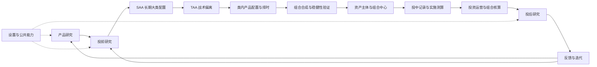
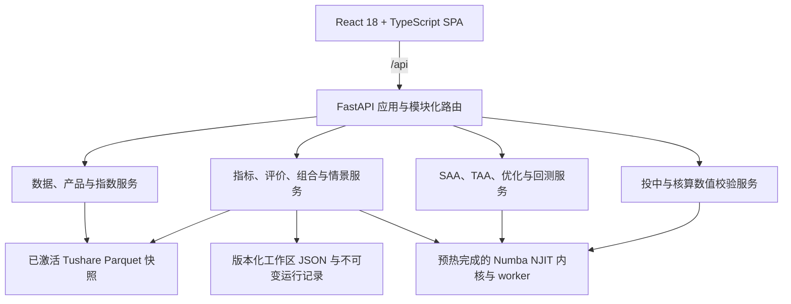
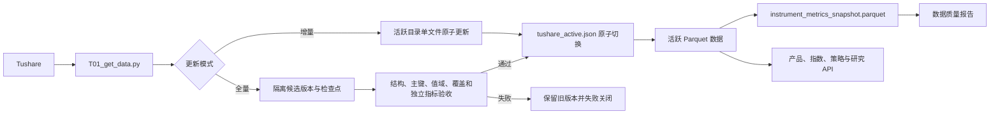

# 资产配置投研与组合管理平台

本项目面向个人、企业和家族办公室等资产所有者，用于内部开展 ETF、场外公募基金研究，自上而下完成 SAA、TAA、产品配置、组合研究、回测、投中记录和投后复盘。

平台当前以“可复现研究 + 流程化组合管理”为核心。产品研究、数据管理、指标计算、资产配置、组合研究、历史情景和压力测试已经具备真实数据或后端计算能力；资产主体、外部账户、真实组合、投资核算和完整投后体系仍以交互原型或局部计算为主。

> 本平台不提供基金募集、客户份额登记、法定基金会计、监管报送、投资建议或交易下单能力。
>
> 本项目自当前版本起采用 **PolyForm Noncommercial License 1.0.0**，仅允许非商业用途。商业使用必须取得版权方的单独书面授权。

## 业务架构

产品研究是持续运行的公共能力；单次组合研究从投前开始，依次完成长期配置、战术偏离和类内产品配置，内部确认后再进入真实组合、投中记录、核算和投后反馈。



核心业务边界：

- **产品研究**：研究 ETF、场外公募基金及其管理人、基金经理、费用、净值、持仓披露和风格特征。
- **投前研究**：严格保持 `SAA → TAA → 产品配置 → 组合合成 → 回测验证` 的层次，不把产品选择与大类择时混为一体。
- **研究组合与真实组合分离**：研究组合承载假设、参数和回测；真实组合承载账户、持仓、现金流、责任和实际绩效。
- **外部执行边界**：平台可以测算交易计划、记录外部成交和执行结果，但不连接券商或基金销售系统下单。
- **投后闭环**：实际结果应反馈至产品池、配置模型和研究假设，而不是直接覆盖历史研究版本。

完整业务定义见 [CONTEXT.md](CONTEXT.md)、[公募基金量化投资流程大纲.md](公募基金量化投资流程大纲.md) 和 [前端功能蓝图](docs/frontend-investment-research-blueprint.md)。

## 当前能力状态

README 只把已经接入当前代码、真实 API 或本地数据的能力描述为可用。页面可访问不代表对应生产能力已经完成。

| 领域 | 当前能力 | 状态 |
| --- | --- | --- |
| 产品研究 | ETF/公募基金全景、检索、筛选、详情、比较、指标分析和评价方案 | 已接入真实数据与 API |
| 数据源与下载 | Tushare Token、本地下载、增量/全量更新、模块与范围选择、任务进度 | 已实现，位于 `/settings/data-sources` |
| 数据质量 | 快照结构、唯一性、净值有效性、复权净值断点、连续性、及时性、产品覆盖和源版本一致性 | 部分具备，位于 `/settings/data-quality` |
| 指标与模型 | 受限 LaTeX/DSL、类型与维度校验、DAG、版本化指标、真实产品和组合计算 | 已实现核心链路 |
| 产品评价 | 锁定指标 revision、严格完整样本、方向归一化和加权排名 | 已实现核心链路 |
| SAA | 大类资产构建、风险预算、有效前沿、目标权重、调仓和回测 | 已实现核心链路 |
| TAA 与历史情景 | 历史状态定义、运行、发布、比较及 TAA 回测 | 部分具备 |
| 产品组合研究 | ETF/基金组合目标、不可变运行快照、诊断、历史情景和 CSV/ZIP 导出 | 已实现核心链路 |
| 情景模拟与压力测试 | 历史重演、因子路径、Monte Carlo、状态条件和反向压力测试 | 已实现核心计算链路 |
| 组合中心、投中和核算 | 组合主档、账户关系、成交分摊、Booking、报表等工作区 | 交互原型与局部数值校验，不是生产账务系统 |
| 投后与反馈 | 绩效、归因、监控、结论和模型复盘流程 | 以流程原型为主 |
| 统一回测中心、PIT 快照、研究参数 | 平台级治理入口 | 规划或原型阶段 |

数据下载已经从业务驾驶舱移至设置页；数据质量页只负责检查和定位问题，不负责启动下载任务。

## 技术架构

项目采用模块化单体架构：React 单页应用与 FastAPI API 共用一个代码库和数据目录，生产构建由 FastAPI 同源托管前端静态文件。



### 前端

- `frontend/src/App.tsx`：BrowserRouter 路由入口，组织产品研究、投前、组合中心、投中、核算、投后、反馈、方案库和设置。
- `frontend/src/app/processRegistry.ts`：流程节点、能力状态和导航元数据。
- `frontend/src/pages/`：真实业务页面、局部工作区和静态原型页面。
- `frontend/src/services/`：统一封装后端 API、响应类型和固定 NJIT 执行审计。
- `frontend/src/layouts/`、`frontend/src/components/`：阶段布局、导航和共享交互组件。

旧地址通过 `LegacyRedirect` 迁移到当前流程路由，避免历史入口继续形成平行信息架构。

### 后端

- `backend/app.py`：FastAPI 入口、CORS、生命周期、兼容 API 和 `frontend/dist` 静态托管。
- `backend/services/`：数据刷新与质量、产品与指数、指标、组合研究、历史情景、压力测试、策略和业务数值路由。
- `backend/cal_indicators/`：受限公式解析、类型系统、算子注册、计算图和固定签名 NJIT 执行计划。
- `backend/custom_indicators/`：指标/评价方案持久化、数据窗口、批量计算 worker 和组合研究服务。
- `backend/historical_regimes/`、`backend/scenario_stress/`：历史状态识别、TAA 与独立压力测试能力。
- `backend/optimizer.py`、`backend/strategy.py`、`backend/backtest_engine.py`：组合优化、权重、调仓和回测核心。

### 高性能计算约束

服务启动阶段统一预热优化器、指标、回测、拟合、历史情景、TAA、组合研究、情景压力、产品分析和业务数值等生产 NJIT 签名，并启动持久 worker。任一必要预热失败时，应用启动失败关闭。

正式请求中的 Python 代码只负责校验、读取、稳定 dtype 转换、任务编排和结果封装；大规模逐行、逐期、逐资产和逐情景计算进入已经编译的 Numba `njit` 内核。缓存未命中或类型不匹配不得静默回退到 Python/pandas 循环。

`GET /api/health` 返回 `numba_warmup` 和 worker 状态，可用于确认服务是否完成计算预热。

## 数据架构



主要约定：

- ETF 与场外公募基金物理分表，产品键使用 `(instrument_type, ts_code)`。
- 研究收益和风险主要使用复权净值 `adj_nav`；单位净值和累计净值用于交叉核验。
- 全量更新先写入隔离候选目录，验收通过且文件未变化后才原子激活，失败不会暴露半成品。
- 增量更新使用重叠窗口合并，新到数据覆盖相同业务键的旧记录，并保留检查点和有界重试。
- 宏观和历史状态研究保留观测期、发布日期/可用日和版本，避免时间穿越。
- 数据质量 API 读取已激活版本及预计算指标快照，不在页面请求期间扫描全部历史文件。
- Token 只允许从受控配置或本机凭据文件读取，不回传、不写入日志、不提交仓库。

Tushare 接口、文件、业务键和刷新状态以 [TushareDownload.md](TushareDownload.md) 为快速契约，以当前代码和活跃快照为最终事实。

## 目录结构

```text
.
├── backend/                 FastAPI、研究服务、NJIT 内核与测试
├── frontend/                React/Vite 单页应用、组件测试与 Playwright
├── data/                    本地 Parquet、工作区 JSON 和运行快照（通常不提交）
├── docs/                    产品、数据、指标、核算和 AI 路由文档
├── deploy/                  生产部署说明
├── T01_get_data.py          Tushare 下载、增量更新和检查点入口
├── config.py                数据目录与本地凭据配置
├── docker-compose.yml       单服务容器部署
└── 公募基金量化投资流程大纲.md  业务流程总纲
```

## 快速开始

### 环境要求

- Python 3.12
- Node.js 18 或更高版本
- 本地开发建议使用 `/Users/chenjunming/Desktop/myenv_312/bin/python3.12`

### 安装依赖

```bash
cd backend
pip install -r requirements.txt

cd ../frontend
npm install
```

### 开发模式

启动后端：

```bash
cd backend
uvicorn app:app --reload --host 0.0.0.0 --port 8000
```

首次启动会执行 NJIT 和 worker 预热，完成前服务不会进入就绪状态。健康检查：`http://127.0.0.1:8000/api/health`。

另开终端启动前端：

```bash
cd frontend
npm run dev
```

前端默认通过 Vite 将 `/api` 代理到后端。

### 一体化运行

```bash
npm run build --prefix frontend
python backend/run.py
```

访问 `http://127.0.0.1:8000`。FastAPI 会同时提供 API 和 `frontend/dist`。

### Docker

```bash
cp .env.example .env
docker compose up --build
```

容器使用持久化 `fund_data` volume。公开部署前必须保护具有写权限的 `/api/data/*` 接口，并保持 `DATA_REFRESH_ENABLED=false`，除非已经配置 HTTPS、认证和访问控制。

## 数据下载与更新

数据下载入口位于 **设置 → 数据源与下载**：

1. 保存本机 Tushare Token。
2. 选择基础信息、ETF、公募基金、指数或宏观模块。
3. 按模块选择细分范围和增量/全量模式。
4. 查看任务阶段、进度、最近成功时间和错误信息。
5. 全量任务验收通过后激活候选版本；增量任务更新活跃文件。任务末重建研究指标快照，再由数据质量页检查结果。

关键环境变量：

| 变量 | 作用 | `.env.example` 示例值 |
| --- | --- | --- |
| `DATA_REFRESH_ENABLED` | 是否允许浏览器启动数据更新 | `false` |
| `TUSHARE_TOKEN_CONFIG_ENABLED` | 是否允许页面写入本机 Token | `true` |
| `DATA_FULL_REFRESH_ENABLED` | 是否允许全量历史更新 | `false` |
| `TUSHARE_MAX_CALLS_PER_MINUTE` | 所有下载任务共享的分钟调用上限 | `180` |
| `TUSHARE_MAX_WORKERS` | 下载 worker 上限 | `8` |
| `INDICATOR_PROCESS_WORKERS` | 指标计算 worker 数 | `7` |
| `INDICATOR_STARTUP_WARMUP_TIMEOUT_SECONDS` | 指标 worker 启动预热超时 | `120` |

完整配置见 [.env.example](.env.example)。不要把 Token 写入源码、文档、命令输出或测试夹具。

## API 概览

FastAPI OpenAPI 页面默认位于 `/docs`。主要接口按领域分组：

| 路由前缀 | 作用 |
| --- | --- |
| `/api/health` | 应用健康状态、NJIT 预热与 worker 状态 |
| `/api/data/*` | Token、刷新任务、指标快照重建和数据质量 |
| `/api/instruments/*`、`/api/indices/*` | ETF/基金产品研究、指标快照、指数目录和覆盖 |
| `/api/custom-indicators/*`、`/api/evaluation-plans/*` | 指标定义、计算、版本和评价方案 |
| `/api/fit-classes`、`/api/rolling-corr`、`/api/efficient-frontier` | 大类资产拟合、相关分析和有效前沿 |
| `/api/strategy/*` | 权重求解、调仓计划和组合回测 |
| `/api/research-targets/*`、`/api/portfolio-runs/*` | 组合研究目标、不可变运行、诊断、情景和导出 |
| `/api/historical-regimes/*` | 历史状态定义、运行、发布、比较和 TAA 回测 |
| `/api/scenario-stress/*` | 情景定义、运行、批量压测、比较和发布 |
| `/api/business-numeric/*` | 投中分摊、账簿汇总等原型工作区的数值校验 |

兼容层仍保留部分 `/api/etf/*` 和根级资产配置接口，新功能优先使用模块化路由。

## 测试与验收

后端：

```bash
cd backend
/Users/chenjunming/Desktop/myenv_312/bin/python3.12 -m pytest -q
```

前端单元测试与构建：

```bash
npm run test --prefix frontend -- --run
npm run build --prefix frontend
```

端到端测试：

```bash
npm run test:e2e --prefix frontend
```

提交前至少验证本次改动涉及的后端测试、前端测试和生产构建。数据测试必须使用本地夹具，禁止依赖网络或污染正式数据目录。

## 设计与安全原则

- 缺失、异常、过期或窗口不完整的数据必须明确标记并失败关闭，不得按零填充后继续排名。
- 产品、数据、指标、评价方案、情景、研究目标和运行结果均保留版本或来源指纹。
- PIT 研究必须冻结决策时点可得的数据、规则、参数和指标 revision。
- 研究模式、严格回测和真实执行必须明确区分；回测结果不是实际成交或未来收益承诺。
- 当前 JSON 工作区是实例级共享存储；在引入真实账户和敏感数据前，必须增加身份、权限、审计和正式数据库边界。
- CORS 生产环境默认同源；分离部署时只允许显式配置的可信来源。
- 数据文件、Token、构建产物、缓存和本地运行结果不得提交到版本库。

## 相关文档

- [领域语言与边界](CONTEXT.md)
- [资产配置投研与组合管理流程大纲](公募基金量化投资流程大纲.md)
- [前端功能蓝图](docs/frontend-investment-research-blueprint.md)
- [需求说明](docs/requirements.md)
- [自定义指标设计](docs/custom_indicator_design.md)
- [Tushare 下载与数据契约](TushareDownload.md)
- [数据刷新设计](docs/tushare_data_refresh_design.md)
- [部署说明](deploy/README.md)

## 许可

本项目采用 [PolyForm Noncommercial License 1.0.0](LICENSE)：允许个人研究、学习、实验以及符合许可条款的其他非商业用途；禁止未经授权的商业使用。

如需将本项目用于收费服务、商业产品、企业商业运营或其他商业目的，必须事先取得版权方的单独书面许可。该许可限制不改变第三方依赖和数据源各自的许可、服务条款与知识产权约束。
