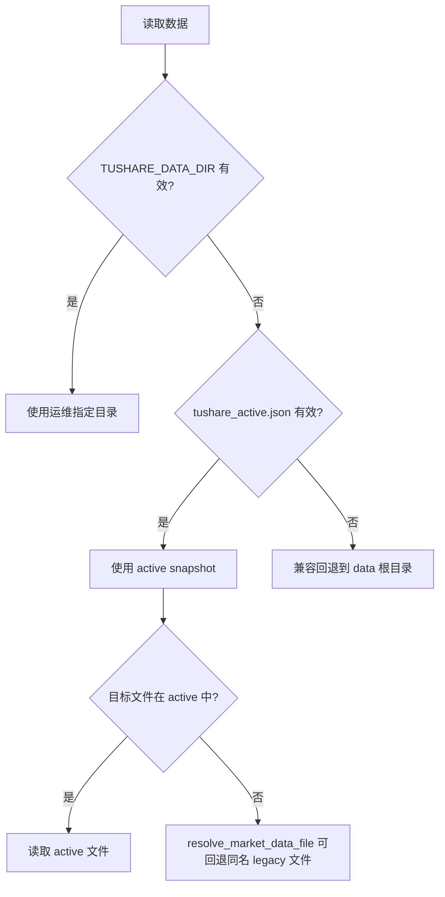
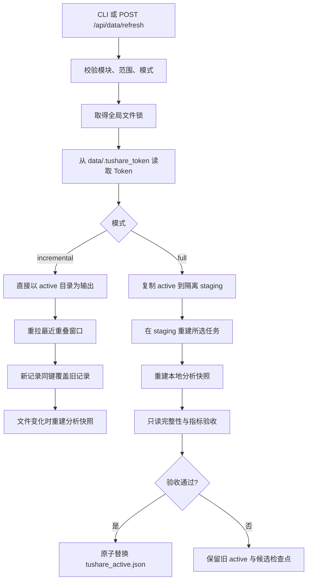

# Tushare 下载数据与执行逻辑

> 审计时间：2026-09-03（Asia/Singapore）
> 执行真相：`T01_get_data.py`、`backend/services/data_refresh.py`、`backend/market_data.py`
> 数据现状：`data/tushare_active.json` 指向的活跃目录及其 Parquet 元数据
> 接口参考：`tushare-fetcher/references/tushare_interfaces_ai_optimized.json`

本文用于快速回答四个问题：当前真正有哪些数据、代码还能下载什么、每类数据如何下载、落盘格式与时点语义是什么。

代码中存在下载能力，不代表数据已经下载。本文严格区分以下状态：

- **已下载**：文件真实存在于当前活跃目录，行数来自 Parquet metadata。
- **已下载但需关注**：文件存在，但为空、仅有短窗口，或与最近失败任务存在一致性风险。
- **代码已支持但未下载**：已有接口、动作和目标文件定义，但当前活跃目录没有该文件。
- **本地派生**：不直接调用 Tushare，由其他 Parquet 在本地生成。

## 1. 当前结论

当前活跃数据目录为：

```text
data/tushare_snapshot_20260902T042251Z_e8c207e4
```

`data/tushare_active.json` 的激活时间为 `2026-09-02T07:19:06.567614+00:00`。截至本次审计：

- 活跃目录有 **29 个 Parquet 文件**，合计 **71,482,328 行**、约 **3.07 GiB**。
- 已有 ETF 信息、ETF 净值、ETF 行情、ETF 份额，场外公募基金信息与净值，以及较完整的指数目录、行情、估值、成分和权重。
- **没有**公募基金经理、规模、持仓披露、分红、复权因子、标准基准库六张扩展表。
- **没有任何宏观 Parquet**；GDP、CPI、PPI、PMI、货币、社融、Shibor、LPR、回购和发布日历目前均只是“代码已支持”。
- ETF 与场外公募基金统一使用 `qdii_type` 区分 `QDII` / `非QDII`；旧 ETF 快照缺少结构化来源时允许显示 `待确认`。ETF 优先采用 Tushare `etf_basic.etf_type` 的结构化“纯境内/QDII”口径；场外基金因 `fund_basic` 没有独立 QDII 字段，只认官方简称中的显式 `QDII` 标记，不用“海外、港股、全球”等模糊关键词推断。
- `etf_share_size_df.parquet` 是增量模式为新数据集建立的短基线，仅覆盖 `2026-08-28` 至 `2026-09-02`，不是完整历史。
- `index_ci_daily_df.parquet` 文件存在但为 **0 行**，当前应视为不可用，而不是“中信行业指数已覆盖”。

### 1.1 当前一致性风险

最近一次任务状态来自 `data/.tushare_refresh_status.json`：

| 项目 | 当前值 |
| --- | --- |
| 模式 | `incremental` |
| 开始 | `2026-09-03T08:02:01.593077+00:00` |
| 结束 | `2026-09-03T09:09:20.100886+00:00` |
| 状态 | `failed`，进程中断 |
| 已选模块 | `base`、`etf`、`fund`、`index` |
| 未选内容 | 公募基金 manager/scale/portfolio/dividend/adjustment/benchmark；整个 macro 模块 |
| 中断位置 | `index_constituents`：成分已写入，权重抓取约执行到 `5200/9141` |

增量模式直接原子替换活跃目录中的单个 Parquet，不经过整快照重新激活。因此这次失败前完成的文件已经更新，而后续步骤、`index_coverage_snapshot.parquet` 和 `instrument_metrics_snapshot.parquet` 没有完成本轮统一重建。当前应按以下方式理解：

- 活跃 manifest 证明该目录在 2026-09-02 激活时通过过验收；manifest 内的文件大小是**激活时基线**，不是当前实时大小。
- 当前源文件已被后续增量更新；活跃目录中有 22 个既有文件的大小已经不同于激活基线，另新增 `etf_share_size_df.parquet`。
- `index_members_df.parquet` 已在失败任务中更新到 621,382 行，而 `index_weights_df.parquet` 仍是中断前的旧文件。
- 当前分析指标文件有 30,939 行，最大 `latest_date=2026-09-02`，但它早于最近失败任务中 08:02 UTC 以后更新的产品目录和指数文件。

在用于正式研究或发布数据质量结论前，应先完成失败任务，或仅在本地执行分析/覆盖快照重建并重新验收。

### 1.2 2026-09-05 下载任务恢复补充

网页下载由后端服务进程监督子下载进程，并通过 `data/.tushare_refresh_status.json` 和全局文件锁记录状态。若监督该任务的后端进程退出或重启，且下载锁随后释放，任务会被标记为“已中断”；已经原子落盘的数据不会回滚。失败任务保留原模块、下载范围与模式，下载中心可按原配置重新进入恢复流程：增量模式按最新本地日期重算小窗口并幂等 upsert，全量模式继续复用隔离候选目录和检查点。

大文件增量归并属于正常计算阶段，不应被“无日志输出”误判为卡死。`append_incremental_rows` 在流式复制/归并历史 Parquet 时现在至少每处理 1,000,000 行或每 15 秒输出一次进度并立即 flush。以当前约 2,528 万行、约 1.21 GiB 的 `index_daily_df.parquet` 为例，长时间归并会持续刷新父进程心跳，不再因为 30 分钟 idle timeout 仅由缺少 stdout 而被误终止。

### 1.3 2026-09-05 数据源与接口映射中心

入口：`设置 → 数据源与接口映射`（`/settings/source-center`）。原下载页保留于 `/settings/data-sources`。本节是代码能力补充，**不更新上文 2026-09-03 的实际下载盘点，不代表新增数据已进入活跃快照**。

- 标准表合同为 `backend/data_model/catalog.py` 的 `1.2.0`，补齐 `fund.adjustment_factor`；外部映射不能选择系统内部表或直接覆盖系统维护字段。机构、人员、标的和账户的外部代码对照属于内部结构，不是独立导入目标；用户在导入配置中关联代码，净值、行情等仍进入各自业务表的候选数据。此分类调整不改变字段合同或现有 Tushare 预置业务映射。
- 新增 `backend/data_sources/`：Pydantic 配置、SQLite 乐观版本控制、凭据、接口级共享配额、HTTPS 传输、映射、候选批次以及旧下载器桥接。配置存于忽略目录 `data/data_sources.sqlite3`；自定义凭据独立存于 `data/.source_credentials/`，Tushare 继续使用 `data/.tushare_token`，不调用 `ts.set_token`，不把 Token 写入接口参数、日志或返回结果。
- 预置当前下载器使用的 **40 个 API 配置**，包含来源字段、响应路径、标准表映射、下载限制及分页。预置不代表所有接口已实测、已下载或拥有独立权限；新增自定义 Tushare API 启用前必须确认权限。`fund_manager` 缺少可靠人员/基金产品身份码时保留人工对照要求，不按姓名自动合并实体。
- `T01_get_data._run_actions` 使用 `ConfiguredTushareClient` 代替 SDK 直接 I/O；保留既有日期/代码分片、全量/增量、检查点及旧 Parquet 输出。接口参数是默认值，下载器的当前分片参数优先。API 名称、方法、路径、响应结构、参数名、分页、映射与限制均读取已保存配置，不因初始化来源而锁定。原下载动作通过稳定接口 ID 寻址，实际 API 名称可以修改；不兼容的配置明确失败，不静默还原默认值。原生 Token 认证禁止 GET 携带凭据；采用请求头认证的接口可使用 GET。
- 来源及接口配额共同生效并使用 SQLite 原子预留，所有线程/进程共享请求次数、预留行数和并发额度。每分钟行数按单次允许上限保守预留；实际生效上限取来源/接口较严格值，CLI/环境限制还可进一步收紧。`fund_basic/fund_nav/fund_manager` 默认页大小分别为 15000/10000/5000，最大页数可配置；其他接口的市场范围仍由原下载器分片；独立接口下载执行器可按保存的 offset/page/none 协议运行。页码与旧分片不对齐时明确报错，避免重复或漏页。
- 请求有连接、读取、响应字节和运行时间边界；只对已分类的临时连接/限流错误重试，权限/字段/契约错误立即失败。禁止重定向、环境代理、私网和混合 DNS 地址。限频数字为本地安全约束，不替代供应商权限判断。
- CLI/Web 请求指纹和历史分片目录包含配置指纹；修改映射或限制后不把旧配置下的检查点当作同一次任务继续使用。
- 每次实际响应同时保存可重放原始批次和显式 Arrow Schema 的标准化候选至 `data/mapped_candidates/<source>/<batch>/`。幂等批次记录包含配置哈希、原始哈希、接受/拒绝行数和未发布标记。映射失败保留原始数据及原因，不把错误候选发布为正式数据；原下载链路仍单独按既有规则处理其旧表。
- Tushare 与 AKShare 的初始配置只写入一次；保存后的修改不会被初始化覆盖，删除也不复活。凭据可在统一来源编辑器维护；地址或认证协议变更后须重新确认凭据。
- 独立接口下载支持 HTTP、Tushare 与 AKShare，以所选接口、产品/请求参数和日期为范围，支持全量重取或增量断点加 3 天重叠。配置与参数指纹隔离检查点；空响应标记 EMPTY，截断或分页耗尽失败关闭，不提交不完整候选。任务共用原市场下载锁，不会并行污染数据。
- 多源规则支持全局和表级顺序、缺失/异常替代开关、容差、必需字段、值域及跳变检查。按整条同口径记录选源，冲突默认隔离；输出带来源批次、规则版本和审计的不可变 Parquet。标准候选文件携带 SHA256，缺失或校验失败不得进入多源取值。
- 页面区分下载结果、映射结果、取值冲突和未发布状态。**正式研究消费者仍读取旧结构**；本阶段没有完成统一主数据外键验收、正式消费者迁移或定时调度。AKShare 单接口任务不是全市场自动下载。
- 净值公告仅有日期时按来源时区日终转换，历史公告未知不伪造可得性。指数 `pct_change` / `pct_chg` 按接口区分；手、万股、千元、万元分别映射标准单位；`fund_portfolio.stk_mkv_ratio` 不冒充基金净资产占比。Tushare 未映射字段保留原始批次；宏观预置当前映射主序列，其余列可添加独立映射，不宣称自动覆盖全部宏观子序列。

本阶段新增验证命令：

```text
python -m pytest backend/tests/test_data_source_center.py backend/tests/test_data_model_catalog.py backend/tests/test_tushare_data_script.py backend/tests/test_data_refresh.py -q
npm run test --prefix frontend -- --run src/pages/DataSourceCenter.test.tsx src/pages/DataModelCatalog.test.tsx src/pages/DataManagement.test.tsx src/App.test.tsx
npm run test:e2e --prefix frontend -- e2e/data-source-center.spec.ts
python scripts/smoke_data_source_center.py --smoke --allow-config-token
```

最后一条为明确选择的真实请求，最多一次、写入临时目录、不发布数据，其余测试离线。2026-09-05 已完成 `fund_daily` 的单次真实请求和标准 Parquet 映射验证；不能据此声明其他接口均已在线验证。

多源阶段另用 `scripts/smoke_multi_source.py --interface <ID> --confirm-network` 验证 `tushare.trade_cal`、`akshare.etf_daily`、`akshare.fund_nav`：每项最多 1 次真实 HTTP 请求，2024-01-02 至 2024-01-05 各取得 4 行，映射通过，均使用临时目录。AKShare 使用独立依赖文件 `backend/requirements-akshare.txt` 固定版本 1.18.94；ETF 不复权行情与单位净值分别入各自候选表，不伪造复权净值或历史公告时间。详细边界与测试见 `docs/multi_source_resolution_design.md`。

### 1.4 多源下载入口与 ETL 编排（2026-09-06）

`/settings/data-sources` 现在默认提供“按数据源下载 / ETL 任务编排 / 运行记录与恢复”。先选已保存来源，再按业务分类选择接口、参数、产品、日期范围及全量/增量。原 Tushare 模块级全市场任务保留在折叠兼容入口，未删除原功能。

- ETL 将 `download → map → resolve → snapshot` 拆成独立有序步骤，支持跨来源、自定输入依赖、流程保存修订及调整快照位置。执行前检查接口修订、映射、坏依赖、口径和快照必需输入。
- `backend/data_sources/acquisition.py` 为 ETL 与原单接口下载共同的有界采集函数；继续使用既有共享配额、凭据目的地址绑定、超时与受控重试。ETL 没有新增 Tushare API 或放宽任何账户配额。
- 下载只提交完整 Raw；映射完成才推进增量断点，回查最近 3 天。全量是重新请求指定范围，不等于清空仓库或自动拉全市场；空响应默认阻断，不冒充成功。
- 运行冻结来源/接口修订、多源规则、历史批次及指标配置。取值仅使用显式输入与冻结历史清单；失败或取消保留成功步骤，继续前核验制品哈希、配置和执行代码指纹。
- 快照复用真实 NJIT 分析构建器，输入必须包含已取值的产品信息和基金净值。只在私有目录投影本次标准数据，不引用旧活跃价格；单位净值不代填复权净值。指标配置先冻结，再复制到单步运行目录，防止运行器修改冻结配置。
- 新控制表 `etl_workflow`、`etl_workflow_revision`、`etl_run` 属系统内部；制品位于 `data/etl_runs/`。ETL 与现有刷新/采样共用全局锁。`/api/data-sources/etl/*` 提供校验、保存、执行、状态、取消和恢复。
- **标准 ETL 输出仍为未发布候选；不改变上文正式活跃目录盘点或旧研究读取路径。** 原兼容下载仍按原发布规则执行。定时调度、动态全市场参数循环和正式 Repository 迁移不在本轮实现。

详细流程、接口与边界见 `docs/etl_workflow_design.md`。新增离线回归 `backend/tests/test_etl_workflows.py`、`backend/tests/test_etl_snapshot.py`；`scripts/smoke_etl_workflow.py --confirm-network` 为显式一次真实请求，其他测试不联网。
2026-09-06 单次 `trade_cal(exchange=SSE,start_date=20240102,end_date=20240105)` 验证通过：下载、映射、取值各 4 行，真实请求 1 次，使用本机全局锁和共享配额，仅写临时目录；执行指纹 `e3429438cf713eabce25b91ccb47a9d77a61c10707d3f624402d0a97099db300`。不是其他接口或全市场下载的在线验收。

## 2. 运行时如何选择数据目录



当前 `data/` 下还存在两类非活跃数据：

- 根目录 legacy 文件：较早的 ETF、指数、交易日历和研究结果文件；不是当前活跃快照。
- `data/tushare_full_validation_20260831/`：11 个 Parquet、约 1.35 GiB；未被 manifest 激活，不能当作当前数据。

结论和统计默认只使用活跃目录；除非专门分析兼容回退，否则不要混入 legacy 或未激活候选目录。

## 3. 当前实际下载清单

### 3.1 基础、ETF 与公募基金

| 状态 | 文件 | 来源/生成方式 | 行数 | 大小 MiB | 实际日期范围或说明 |
| --- | --- | --- | ---: | ---: | --- |
| 已下载 | `trade_day_df.parquet` | `trade_cal(exchange='SSE')` | 6,090 | 0.05 | `2010-01-01` 至 `2026-09-03` |
| 已下载 | `stock_basic.parquet` | `stock_basic` | 5,555 | 0.25 | 当前上市股票目录 |
| 已下载 | `fund_company_df.parquet` | `fund_company` | 206 | 0.05 | 基金公司目录 |
| 已下载 | `etf_info_df.parquet` | `fund_basic(E)` + `etf_basic` | 1,786 | 0.15 | ETF 产品主数据 |
| 已下载 | `etf_daily_df.parquet` | `fund_nav(market='E')` | 1,619,037 | 65.03 | `2010-01-04` 至 `2026-09-02` |
| 需关注 | `etf_share_size_df.parquet` | `etf_share_size` | 6,595 | 0.22 | 仅 `2026-08-28` 至 `2026-09-02` 的短基线 |
| 已下载 | `etf_daily_candle_df.parquet` | `fund_daily` | 1,577,462 | 86.59 | `2010-01-04` 至 `2026-09-02` |
| 已下载 | `fund_info_df.parquet` | `fund_basic(market='O')` | 29,206 | 1.55 | 场外公募基金份额级目录 |
| 已下载 | `fund_nav_df.parquet` | `fund_nav(market='O')` | 33,710,365 | 1,221.92 | `2010-01-03` 至 `2026-09-02` |
| 已下载 | `etf_index.parquet` | `etf_index` | 560 | 0.03 | ETF 指数原始目录；网页通过 index/catalog 获取 |

产品主数据下一次刷新后会写入两个统一字段：

| 字段 | 取值 | ETF 来源 | 场外基金来源 |
| --- | --- | --- | --- |
| `qdii_type` | `QDII` / `非QDII`；旧 ETF 兼容读取时可为 `待确认` | `etf_basic.etf_type`；缺失但名称有显式标记时判定 QDII，否则待确认 | `fund_basic.name` 中是否含显式 `QDII` 标记 |
| `qdii_source` | 来源标识 | `etf_basic.etf_type` 或 `fund_basic.name_marker` | `fund_basic.name_marker` |

`qdii_type` 是投资通道属性，与 `instrument_type=etf/fund`、`fund_type=股票型/债券型/...`、`invest_type=被动指数型/主动型/...` 相互独立。QDII ETF 仍然是 ETF，仍可使用交易所 OHLC；场外 QDII 基金仍然是场外基金，不能因此获得开高低收字段。

### 3.2 指数原始目录、统一目录与行情

| 状态 | 文件 | 来源/生成方式 | 行数 | 大小 MiB | 实际日期范围或说明 |
| --- | --- | --- | ---: | ---: | --- |
| 已下载 | `index_info.parquet` | `index_basic` | 9,643 | 0.45 | 多市场指数基础信息 |
| 已下载 | `index_classify_df.parquet` | `index_classify` | 511 | 0.02 | 申万/中信行业目录原表 |
| 已下载 | `ths_index_df.parquet` | `ths_index` | 2,517 | 0.05 | 同花顺指数目录原表 |
| 已下载 | `dc_index_df.parquet` | `dc_index` 最近可用日 | 1,031 | 0.05 | 快照日 `2026-09-03` |
| 已下载 | `tdx_index_df.parquet` | `tdx_index` 最近可用日 | 613 | 0.03 | 快照日 `2026-09-02` |
| 已下载 | `index_catalog_df.parquet` | 上述目录统一标准化 + 南华固定代码表 | 14,953 | 0.25 | 主键 `source_api, ts_code` |
| 已下载 | `index_daily_df.parquet` | `index_daily` | 25,280,959 | 1,238.93 | `2010-01-01` 至 `2026-09-03` |
| 已下载 | `index_sw_daily_df.parquet` | `sw_daily` | 1,549,960 | 113.89 | `2010-01-04` 至 `2026-09-02` |
| 需关注 | `index_ci_daily_df.parquet` | `ci_daily` | 0 | 0.00 | 文件存在但没有行情 |
| 已下载 | `index_ths_daily_df.parquet` | `ths_daily` | 2,877,395 | 240.80 | `2010-01-04` 至 `2026-09-02` |
| 已下载 | `index_dc_daily_df.parquet` | `dc_daily` | 1,419,342 | 85.87 | `2020-01-02` 至 `2026-09-03` |
| 已下载 | `index_tdx_daily_df.parquet` | `tdx_daily` | 205,056 | 35.88 | `2025-03-28` 至 `2026-09-02` |
| 已下载 | `index_global_daily_df.parquet` | `index_global` | 86,126 | 4.94 | `2010-01-04` 至 `2026-09-02` |
| 已下载 | `index_futures_daily_df.parquet` | `fut_index_daily` | 193,746 | 11.64 | `2010-01-04` 至 `2026-09-02` |
| 已下载 | `index_daily_basic_df.parquet` | `index_dailybasic` | 24,294 | 1.34 | `2010-01-04` 至 `2026-09-03` |

### 3.3 指数成分、权重与本地派生快照

| 状态 | 文件 | 来源/生成方式 | 行数 | 大小 MiB | 实际日期范围或说明 |
| --- | --- | --- | ---: | ---: | --- |
| 需关注 | `index_members_df.parquet` | `index_member_all`、`ci_index_member`、`ths_member`、`dc_member`、`tdx_member` | 621,382 | 2.38 | 在最近失败任务中已更新 |
| 需关注 | `index_weights_df.parquet` | `index_weight` | 2,193,640 | 26.46 | `2026-06-30` 至 `2026-09-01`；最近一轮未完成 |
| 需关注/派生 | `index_coverage_snapshot.parquet` | 本地扫描各指数行情 metadata/批次 | 13,359 | 0.12 | 早于最近失败任务，需重建 |
| 需关注/派生 | `instrument_metrics_snapshot.parquet` | 本地 ETF/基金净值与 ETF 行情计算 | 30,939 | 2.57 | 最大净值日 `2026-09-02`；未覆盖最近失败任务后的全部变化 |

## 4. 代码已支持、但当前活跃目录尚未下载

### 4.1 公募基金扩展数据

| 动作 | Tushare 接口/来源 | 目标文件 | 关键格式与主键 |
| --- | --- | --- | --- |
| `fund_manager` | `fund_manager` | `fund_manager_df.parquet` | 履历字段 + lineage；`ts_code,name,begin_date` |
| `fund_scale` | 从 `fund_nav_df.parquet` 派生 | `fund_scale_df.parquet` | `net_asset,total_netasset`；`ts_code,observation_date` |
| `fund_portfolio` | `fund_portfolio` | `fund_portfolio_df.parquet` | 季报股票持仓；`available_at,ts_code,end_date,symbol` |
| `fund_dividend` | `fund_div` | `fund_dividend_df.parquet` | 分红事件；`available_at,ts_code,ex_date,pay_date` |
| `fund_adjustment` | `fund_adj` | `fund_adj_factor_df.parquet` | 复权因子；`ts_code,date` |
| `fund_benchmark` | `mkt_idx_bmk` | `fund_benchmark_df.parquet` | 标准基准目录；`ts_code` |

注意：`fund_portfolio` 只是公开披露的股票持仓，不是含债券、现金、基金和衍生品的完整资产配置；`mkt_idx_bmk` 也不自动等于每只基金合同中的业绩比较基准。

### 4.2 宏观数据

| 动作 | Tushare 接口 | 目标文件 | 观测期字段/版本键 |
| --- | --- | --- | --- |
| `macro_cycle` | `cn_gdp` | `macro_cn_gdp_df.parquet` | `quarter -> observation_date` |
| `macro_cycle` | `cn_cpi` | `macro_cn_cpi_df.parquet` | `month -> observation_date` |
| `macro_cycle` | `cn_ppi` | `macro_cn_ppi_df.parquet` | `month -> observation_date` |
| `macro_cycle` | `cn_pmi` | `macro_cn_pmi_df.parquet` | `month -> observation_date` |
| `macro_money_credit` | `cn_m` | `macro_cn_money_df.parquet` | `month -> observation_date` |
| `macro_money_credit` | `sf_month` | `macro_cn_social_financing_df.parquet` | `month -> observation_date` |
| `macro_rates` | `shibor` | `macro_shibor_df.parquet` | `observation_date` |
| `macro_rates` | `shibor_lpr` | `macro_lpr_df.parquet` | `observation_date` |
| `macro_rates` | `repo_daily` | `macro_repo_daily_df.parquet` | `ts_code,observation_date` |
| `macro_release_calendar` | `cn_schedule` | `macro_cn_schedule_df.parquet` | `observation_date,title,data_api` |

宏观接口未显式固定 `fields`，因此原始业务列随 Tushare 接口返回列演进；本地稳定追加以下治理列：

```text
observation_date: timestamp[ns]
available_at: timestamp[ns] 或 null
availability_status: string
source_api: string
ingested_at: string
revision: int
vintage: string
```

GDP、CPI、PPI、PMI、货币和社融当前没有可靠的逐期首次发布日期，代码写入 `available_at=null`、`availability_status=release_date_unknown`。它们不能直接当作历史时点可得数据用于正式回测。Shibor、LPR、回购和发布日历暂记为 `date_only`，同样不包含日内可得时刻。

## 5. 下载动作、接口与输出文件

### 5.1 基础与产品

| 代码动作 | CLI 参数 | 接口/处理 | 输出 |
| --- | --- | --- | --- |
| `calendar` | `--calendar` | `trade_cal(SSE)` | `trade_day_df.parquet` |
| `stock_basic` | `--stock-basic` | `stock_basic` | `stock_basic.parquet` |
| `fund_company` | `--fund-company` | `fund_company` | `fund_company_df.parquet` |
| `etf_info` | `--etf-info` | `fund_basic(E)` + `etf_basic` | `etf_info_df.parquet`、Excel 镜像 |
| `nav` | `--nav` | `fund_nav(E)` | `etf_daily_df.parquet` |
| `etf_share` | `--etf-share` | `etf_share_size` | `etf_share_size_df.parquet` |
| `candle` | `--candle` | `fund_daily` | `etf_daily_candle_df.parquet` |
| `fund_info` | `--fund-info` | `fund_basic(O)` | `fund_info_df.parquet`、Excel 镜像 |
| `fund_nav` | `--fund-nav` | `fund_nav(O)` | `fund_nav_df.parquet` |
| `fund_manager` | `--fund-manager` | `fund_manager` | `fund_manager_df.parquet` |
| `fund_scale` | `--fund-scale` | 本地派生 | `fund_scale_df.parquet` |
| `fund_portfolio` | `--fund-portfolio` | `fund_portfolio` | `fund_portfolio_df.parquet` |
| `fund_dividend` | `--fund-dividend` | `fund_div` | `fund_dividend_df.parquet` |
| `fund_adjustment` | `--fund-adjustment` | `fund_adj` | `fund_adj_factor_df.parquet` |
| `fund_benchmark` | `--fund-benchmark` | `mkt_idx_bmk` | `fund_benchmark_df.parquet` |

### 5.2 指数与宏观

| 代码动作 | CLI 参数 | 接口/处理 | 输出 |
| --- | --- | --- | --- |
| `index_info` | `--index-info` | `index_basic`；直接 CLI 兼容动作 | `index_info.parquet` |
| `etf_index` | `--etf-index` | `etf_index`；直接 CLI 兼容动作 | `etf_index.parquet` |
| `index_catalog` | `--index-catalog` | `index_basic`、`etf_index`、`index_classify`、`ths_index`、`dc_index`、`tdx_index` | 原始目录 + `index_catalog_df.parquet` |
| `index_domestic` | `--index-domestic` | `index_daily` | `index_daily_df.parquet` |
| `index_industry` | `--index-industry` | `sw_daily`、`ci_daily` | 两张行业行情表 |
| `index_concept` | `--index-concept` | `ths_daily`、`dc_daily`、`tdx_daily` | 三张概念行情表 |
| `index_global` | `--index-global` | `index_global` | `index_global_daily_df.parquet` |
| `index_futures` | `--index-futures` | `fut_index_daily` | `index_futures_daily_df.parquet` |
| `index_valuation` | `--index-valuation` | `index_dailybasic` | `index_daily_basic_df.parquet` |
| `index_constituents` | `--index-constituents` | 五类成员接口 + `index_weight` | `index_members_df.parquet`、`index_weights_df.parquet` |
| `index_coverage` | 自动追加 | 本地派生 | `index_coverage_snapshot.parquet` |
| `macro_cycle` | `--macro-cycle` | GDP/CPI/PPI/PMI | 四张 macro 表 |
| `macro_money_credit` | `--macro-money-credit` | 货币/社融 | 两张 macro 表 |
| `macro_rates` | `--macro-rates` | Shibor/LPR/回购 | 三张 macro 表 |
| `macro_release_calendar` | `--macro-release-calendar` | `cn_schedule` | `macro_cn_schedule_df.parquet` |

网页模块及默认范围：

| 模块 | 可选范围 | 默认范围 |
| --- | --- | --- |
| `base` | calendar、stock_basic、fund_company | 全部 |
| `etf` | info、nav、share、candle | 全部 |
| `fund` | info、nav、manager、scale、portfolio、dividend、adjustment、benchmark | info、nav、manager、scale、benchmark |
| `index` | catalog、domestic、industry、concept、global、futures、valuation、constituents | catalog、domestic、industry、global |
| `macro` | cycle、money_credit、rates、release_calendar | 全部 |

依赖会自动展开：ETF 的 nav/share/candle 依赖 ETF info；公募基金的 nav/manager/portfolio/dividend/adjustment 依赖 fund info，scale 依赖 fund info + fund nav；任何指数范围都依赖 catalog。增量时，只要选择时序数据，还会自动附带 calendar。

## 6. 全量与增量执行逻辑



### 6.1 全量模式

- 默认开始日 `20100101`；网页全量必须显式设置 `DATA_FULL_REFRESH_ENABLED=true`。
- staging 先复制当前活跃目录的普通文件，再仅重建用户选择的范围，因此未选择的数据会沿用旧版本。
- 净值、行情按代码分片；每个代码及日期段保留隐藏检查点，可在同一候选目录续跑。
- 选择 index 时，下载动作末尾重建 `index_coverage_snapshot.parquet`；所有下载节点完成后再重建 `instrument_metrics_snapshot.parquet`。
- 候选必须满足核心文件、Parquet 结构、独立抽样指标与文件指纹验收，才会原子切换 manifest。
- 下载完成但分析或验收失败时，旧版本继续服务；同请求续跑可复用候选，避免重复调用 Tushare。

### 6.2 增量模式

- 时序数据默认重拉最近 **5 个上交所开放交易日**，以覆盖迟报和修订；新值按业务键 `keep=last`。
- 每 **20 个交易日**为一批执行 Arrow 流式归并，避免一次加载完整历史。
- 未命中更新窗口的产品直接按 Arrow 批次复制；内容完全相同时不替换原文件。
- 新引入但没有基线的数据不会在一次增量中回补完整历史：ETF 份额仅建立最近窗口；基金持仓、分红、复权因子也只建立安全近期窗口。
- 增量没有整快照回滚。如果任务中途失败，前面完成的单文件更新仍然有效，因此必须结合任务状态判断跨表一致性。

## 7. 分页、限频、截断与并发

默认网页刷新参数：16 个 worker、450 次/分钟、任意两次请求最少间隔 0.13 秒、最多重试 5 次、普通退避 2 秒、限流等待至少 15 秒。所有 worker 共用同一个线程安全 `RateLimiter`。

| API | 代码中的单次行数警戒值 | 防截断策略 |
| --- | ---: | --- |
| `fund_basic` | 15,000 | E/O + L/I/D 分区，`offset/limit` 分页，检查分页是否前进 |
| `fund_manager` | 5,000 | `offset/limit` 分页，最大页数失败关闭 |
| `fund_portfolio` | 2,000 | 按公告日；触顶后降级为公告日 + 单基金 |
| `fund_div` | 5,000 | 按公告日；触顶后降级为公告日 + 单基金 |
| `fund_adj` | 2,000 | 全量按基金且日期窗口不超过 1,200 天 |
| `mkt_idx_bmk` | 500 | 触顶即失败，不保存疑似截断结果 |
| `etf_basic` / `fund_daily` / `etf_share_size` | 5,000 | 交易所/状态分区，或按代码、日期切片；ETF 份额区间触顶递归二分 |
| `index_daily` | 8,000 | 按代码 + 日期段，触顶递归二分 |
| `sw_daily` / `ci_daily` | 4,000 | 按代码 + 日期段，触顶递归二分 |
| `ths_daily` / `tdx_daily` | 3,000 | 按代码 + 日期段，触顶递归二分 |
| `dc_daily` / `fut_index_daily` | 2,000 | 按代码 + 日期段，触顶递归二分 |
| `index_global` | 4,000 | 先发现代码，再按代码 + 日期段 |
| `index_dailybasic` | 3,000 | 仅固定代表性指数代码 |
| `index_weight` | 1,000 | 每只指数只取最近 120 天内最新权重；逐代码检查点 |
| GDP/CPI/PPI/货币等 | 2,000–10,000 | 小表整表重取，触顶即失败 |
| Shibor/LPR/回购 | 2,000/4,000/2,000 | 分别按 1,800/3,500/90 天切片，触顶即失败 |

普通异常使用指数退避和随机抖动；权限/积分错误立即转成 `PermissionError`；异常返回空数据会额外确认一次。中间交易日为空会阻止落盘，只有最后一个尚未发布的开放日允许留待下次更新。

## 8. Parquet 写入和去重契约

- 所有正式 Parquet 先写同目录临时文件，再通过 `os.replace` 原子替换。
- 全量长历史按代码或公告日写检查点，最终由主线程合并；worker 不直接并发写最终文件。
- 历史文件要求按第一排序键连续排列，通常是 `ts_code` 或 `index_code`，否则增量归并拒绝执行。
- 同键冲突时新批次优先；日期会先标准化，再转换回既有 Arrow 日期类型，避免字符串/整数/时间戳混写。
- 大文件采用 Snappy Parquet 和 Arrow 流式处理；Excel 只为少量目录生成兼容镜像，不是运行时主数据。
- Tushare 数值字段通常不在下载层统一换算；除 ETF 信息构建中的明确转换外，单位应以接口字段定义为准，不能仅凭列名猜测。

### 8.1 公共 lineage 字段

公募基金事件、复权因子和宏观表会尽量增加：

| 字段 | 含义 |
| --- | --- |
| `observation_date` | 数据对应的报告期、经济观测期或行情日 |
| `available_at` | 当时最早可得日；未知时必须为空 |
| `availability_status` | `announced_date`、`date_only` 或 `release_date_unknown` |
| `source_api` | Tushare 接口名；派生表记录真正上游接口 |
| `ingested_at` | 本地取得时间，UTC ISO 字符串 |
| `revision` / `vintage` | 宏观同一自然键的修订序号和本地版本时间 |

## 9. 当前活跃文件的实际 Arrow schema

以下 schema 直接读取自当前活跃 Parquet metadata。缩写：`s=string`、`f=double`、`i=int64`、`t=timestamp[ns]`、`n=null`。

### 9.1 基础与产品

```text
trade_day_df.parquet
  exchange:s, cal_date:s, is_open:i, pretrade_date:s

stock_basic.parquet
  ts_code:s, symbol:s, name:s, fullname:s, market:s, exchange:s, area:s,
  industry:s, list_date:s, list_status:s

fund_company_df.parquet
  name:s, shortname:s, short_enname:s, province:s, city:s, address:s, phone:s,
  office:s, website:s, chairman:s, manager:s, reg_capital:f, setup_date:t,
  end_date:t, employees:f, main_business:s, org_code:s, credit_code:s

etf_info_df.parquet / fund_info_df.parquet
  ts_code:s, code:s, name:s, instrument_type:s, management:s, custodian:s,
  trustee:n, fund_type:s, type:s, invest_type:s, market:s, market_code:s,
  status:s, status_code:s, benchmark:s, index_code:s|n, index_name:s|n,
  issue_amount:f, m_fee:f, c_fee:f, exp_return:n, duration_year:f, p_value:f,
  min_amount:f, list_date:t, found_date:t, issue_date:t, due_date:t,
  delist_date:t, purc_startdate:t, redm_startdate:t

etf_daily_df.parquet / fund_nav_df.parquet
  ts_code:s, ann_date:s, nav_date:s, unit_nav:f, accum_nav:f, accum_div:f,
  net_asset:f, total_netasset:f, adj_nav:f, name:s, date:t

etf_daily_candle_df.parquet
  ts_code:s, trade_date:s, open:f, high:f, low:f, close:f, pre_close:f,
  change:f, pct_chg:f, vol:f, amount:f, name:s, date:t

etf_share_size_df.parquet
  trade_date:s, ts_code:s, etf_name:s, total_share:f, total_size:f, nav:f,
  close:f, exchange:s, name:s, date:t

etf_index.parquet
  ts_code:s, indx_name:s, indx_csname:s, pub_party_name:s, pub_date:s,
  base_date:s, bp:f, adj_circle:s
```

当前 `trustee`、`exp_return`、场外基金的 `index_code/index_name` 等全空字段被 Arrow 推断为 `null`；后续出现非空值时 schema 会升级，消费代码不能硬编码为永久 null。

上述 Arrow schema 是当前活跃快照的真实 metadata，因此尚不包含新代码定义的 `qdii_type`、`qdii_source`。在下一次 ETF/fund info 刷新前，产品 API 会对旧快照按显式名称标记补齐兼容字段；没有显式名称标记的旧 ETF 显示 `待确认`，不会被误报为非 QDII。刷新完成后，Parquet 本身应包含这两个字段，届时需重新审计本节 schema 和数量。

### 9.2 指数目录与行情

```text
index_info.parquet
  ts_code:s, name:s, fullname:s, market:s, publisher:s, index_type:n,
  category:s, base_date:s, base_point:f, list_date:s, weight_rule:s,
  desc:s, exp_date:s

index_classify_df.parquet
  index_code:s, industry_name:s, level:s, industry_code:s, is_pub:s,
  parent_code:s, src:s

ths_index_df.parquet
  ts_code:s, name:s, count:f, exchange:s, list_date:s, type:s

dc_index_df.parquet
  ts_code:s, trade_date:s, name:s, leading:s, leading_code:s, pct_change:f,
  leading_pct:f, total_mv:f, turnover_rate:f, up_num:i, down_num:i,
  idx_type:s, level:s

tdx_index_df.parquet
  ts_code:s, trade_date:s, name:s, idx_type:s, idx_count:i, total_share:f,
  float_share:f, total_mv:f, float_mv:f

index_catalog_df.parquet
  source_api:s, ts_code:s, name:s, category:s, market:s, publisher:s,
  list_date:t, exp_date:t, quote_source_api:s, status:s

index_daily_df.parquet / index_futures_daily_df.parquet
  ts_code:s, trade_date:t, close:f, open:f, high:f, low:f, pre_close:f,
  change:f, pct_chg:f, vol:f, amount:f, source_api:s

index_sw_daily_df.parquet
  ts_code:s, trade_date:t, name:s, open:f, low:f, high:f, close:f, change:f,
  pct_change:f, vol:f, amount:f, pe:f, pb:f, float_mv:f, total_mv:f, source_api:s

index_ci_daily_df.parquet
  source_api:s, ts_code:s, trade_date:t

index_ths_daily_df.parquet
  ts_code:s, trade_date:t, open:f, high:f, low:f, close:f, pre_close:f,
  avg_price:f, change:f, pct_change:f, vol:f, turnover_rate:f, source_api:s

index_dc_daily_df.parquet
  ts_code:s, trade_date:t, close:f, open:f, high:f, low:f, change:f,
  pct_change:f, vol:f, amount:f, swing:f, turnover_rate:f, category:s, source_api:s

index_global_daily_df.parquet
  ts_code:s, trade_date:t, open:f, close:f, high:f, low:f, pre_close:f,
  change:f, pct_chg:f, swing:f, vol:f, source_api:s

index_daily_basic_df.parquet
  ts_code:s, trade_date:t, total_mv:f, float_mv:f, total_share:f, float_share:f,
  free_share:f, turnover_rate:f, turnover_rate_f:f, pe:f, pe_ttm:f, pb:f,
  source_api:s
```

`index_tdx_daily_df.parquet` 除 OHLC、涨跌幅、成交量额、换手率外，还保留 `rise`、`vol_ratio`、涨跌家数、涨跌停家数、3/5/10/20/60 日表现、MTD/YTD/1year、PE/PB、市值、份额及北向资金字段；当前 PE/PB 为字符串，不能直接与其他估值表的 float 混算。

### 9.3 指数关系与派生快照

```text
index_members_df.parquet / index_weights_df.parquet
  source_api:s, index_code:s, con_code:s, member_name:s|n, in_date:t,
  out_date:t, is_new:s|n, weight:f|n, trade_date:t

index_coverage_snapshot.parquet
  source_api:s, ts_code:s, first_date:t, latest_date:t, rows:i, stale_days:i,
  domestic_trade_day_coverage:f, source_file:s, source_fingerprint:s

instrument_metrics_snapshot.parquet
  instrument_type:s, ts_code:s, as_of:t, first_date:t, latest_date:t,
  observation_count:i, observation_count_1m:i, observation_count_3m:i,
  observation_count_1y:i, observation_count_3y:i, coverage_ratio_1m:f,
  coverage_ratio_3m:f, coverage_ratio_1y:f, coverage_ratio_3y:f,
  quality_reason_1m:s, quality_reason_3m:s, quality_reason_1y:s,
  quality_reason_3y:s, adj_nav_anomaly_count:i, latest_adj_nav:f,
  return_1m:f, return_3m:f, return_1y:f, return_3y:f,
  annual_volatility_1y:f, max_drawdown_3y:f, sharpe_1y:f, calmar_3y:f,
  stale_days:i, nav_source_fingerprint:s, latest_close:f,
  latest_candle_date:t, latest_unit_nav:f, premium_discount_latest:f,
  premium_discount_date:t, amount_avg_20d:f, volume_avg_20d:f,
  candle_source_fingerprint:s
```

## 10. 安全与运维边界

- Token 只从被忽略的 `data/.tushare_token` 读取；前端保存时使用私有权限和原子替换。
- 不读取 legacy `TUSHARE_TOKEN` 环境变量，不调用 `tushare.set_token`，避免在用户主目录生成第二份凭据。
- Token 不进入命令行参数、任务状态、日志或 API 响应；日志会再次脱敏并限制尾部长度。
- CLI、网页刷新和本地分析重建共用 `data/.tushare_refresh.lock`。该锁只适用于共享同一本地文件系统的单机部署。
- 生产环境默认关闭网页刷新；全量刷新有独立开关。对外启用 `/api/data/*` 前必须增加网关鉴权。
- Tushare 积分不等于接口授权；新增或当前缺失接口应先在临时目录执行单请求 smoke，不得直接把权限假设写进正式任务。

## 11. 验证与维护

快速查看代码支持的参数：

```bash
/Users/chenjunming/Desktop/myenv_312/bin/python3.12 T01_get_data.py --help
```

运行下载契约、刷新编排与指数数据测试：

```bash
cd backend
/Users/chenjunming/Desktop/myenv_312/bin/python3.12 -m pytest \
  tests/test_tushare_data_script.py tests/test_data_refresh.py tests/test_index_data.py -q
```

查看网页任务状态：

```text
GET /api/data/refresh/status
GET /api/data/quality
```

维护规则：凡修改 Tushare API、动作、网页模块/范围、默认依赖、输出文件名、字段/schema、主键、时点口径、全量/增量算法、分页/限频、检查点、凭据、验收或激活逻辑，必须在同一变更中更新本文。代码是可执行真相，本文是同步的快速分析契约；“已下载”状态必须通过活跃 manifest、实际文件和 Parquet metadata 复核，不能仅根据代码推断。
