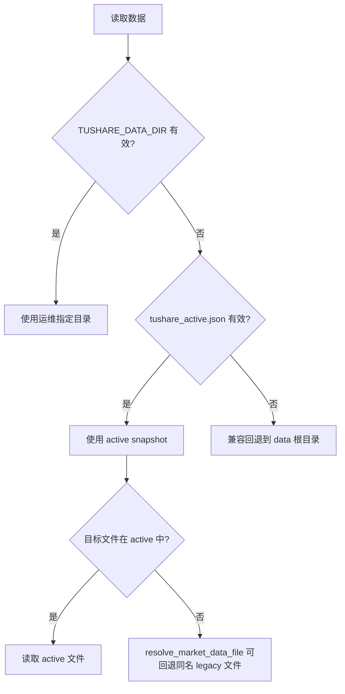
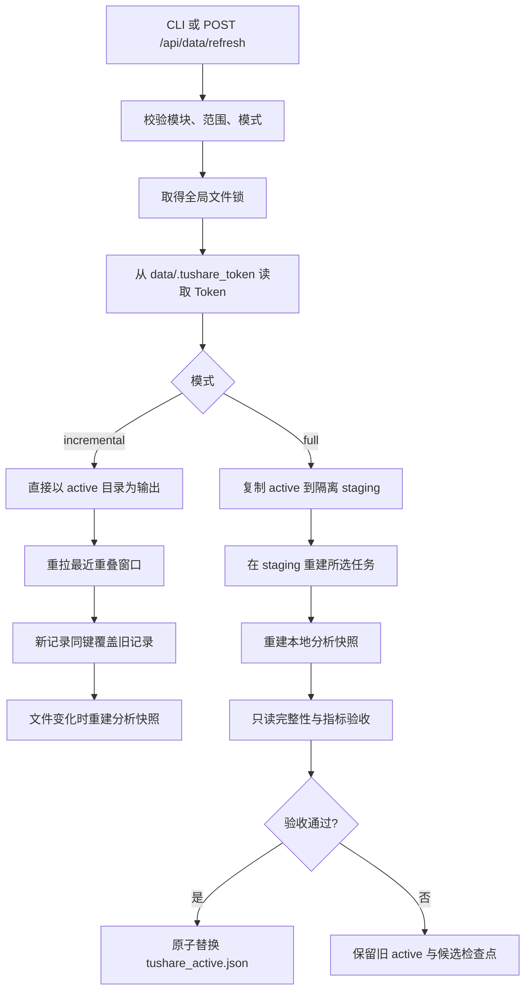

# Tushare 下载数据与执行逻辑

> 审计时间：2026-09-03（Asia/Singapore）
> 执行真相：`T01_get_data.py`、`backend/services/data_refresh.py`、`backend/market_data.py`
> 数据现状：`data/tushare_active.json` 指向的活跃目录及其 Parquet 元数据
> 接口参考：`tushare-fetcher/references/tushare_interfaces_ai_optimized.json`

## 指定磁盘存储（2026-09-08 功能增补）

下载页新增“数据存储位置”，可选择已挂载盘或输入后端本机绝对目录，检查权限、锁、原子写入及容量后保存迁移计划。停止下载后执行 `./start_services.sh restart`，在 API 启动前复制整个 `data/`，逐文件 SHA-256 校验、保留 mtime/权限并切换受管理的 `data` 链接。包括原始批次、分片、检查点、快照及配置，不只迁移最终 Parquet；源码、依赖、Numba 缓存和服务日志不迁移。

- 默认仍是项目 data；存储配置/迁移状态位于忽略目录 `.storage/`。盘未挂载、身份不符或写入前剩余不足 2 GiB 时明确阻止，禁止回退旧本机副本。API/下载锁占用时禁止搬迁；不会主动终止下载。
- 复制中断可重跑并复用校验一致的文件；原数据变化后必须取消计划重新准备，不能混入新旧清单。切换阶段中断需重试完成，不能直接取消。
- 原本机副本默认保留，因此“迁移完成”不等于“本机空间已释放”。确认数据可用并停止服务/下载后，`./start_services.sh storage-cleanup <迁移ID>` 才删除精确登记的副本（不可恢复）。`storage-status` 查看状态，`storage-cancel <迁移ID>` 取消尚未进入切换阶段的计划，不删除暂存文件。
- 本期支持从项目原生 data 首次迁到一个指定目录，不支持再次跨盘移动；拒绝非空目标、内部软链接、Git 跟踪的数据文件及不支持私有权限/文件锁的文件系统。不会格式化磁盘或绕过历史路径、执行版本与 PIT 门禁。
- 此功能不改变 API、字段、限频、空响应复核、日期轴、发布合同和共享配额。本轮账户机制读取为 10,000 分；持仓接口仍使用已保存的 400 次/分钟及 0.15 秒间隔。单请求 smoke：010797.OF、19991231—20260906，542 行、仅临时输出、未发布；包括存储保护依赖的前后哈希一致。`T01_get_data.py=f4f11b888aa46d0d75e81bdcc2dcb1c0f08194b389f7ac3f13b7559ac3dfb55a`，`runtime.py=b498dc3885abd5d60c6bbbfc4cffda0733215dc6baa257f334294f61e0e42803`。
- 功能开发阶段进行了临时目录迁移/掉线模拟和现有下载链路烟测；随后按用户指定完成真实外接盘迁移，见下节。详细设计、边界与命令见 `docs/data_storage_design.md`。

### 2026-09-08 实际外接盘迁移

- 用户指定实际数据区 `/Volumes/SdCard/TushareData`，项目 `data/` 已切换为指向该目录的受管理链接；`.storage/config.json` 登记迁移 ID `07fbdca707404b90a740593a3c1978b3`。源码、依赖、Numba 缓存及服务日志仍在本机。
- 离线迁移涵盖 681,485 个文件、42,383,481,859 字节，包括数据库、原始批次、私有候选、检查点、历史目录及活跃快照。源清单、目标清单与逐文件 SHA-256 均通过校验；校验收据及文件清单位于 `.storage/migrations/`。本次搬盘没有调用供应商、重新下载或修改历史执行版本。
- 外接盘 SQLite `PRAGMA quick_check` 返回 `ok`；活跃 manifest 的 SHA-256 迁移前后同为 `b708f2c0a75ef1d083d86551a17bbb48c348c9fbc5a22a655f53d1cb9ef959b5`，仍指向 `tushare_snapshot_20260902T042251Z_e8c207e4`。manifest 声明的 28 个 Parquet 元数据均可读取；此项验证不代表当前数据已刷新或新的业务数据质量验收通过。
- 迁移前没有仍在执行的下载。最新运行 `ffade99dcd59477c80075e4adace7f3d` 已失败，原因是 `011869.OF` 的 `20260331` 单日持仓区间触顶；存储搬迁不消除此采集错误，也不绕过执行版本、检查点完整性及跨日期 PIT 提示。
- 按用户释放本机空间的要求，通过登记 ID 的专用清理命令删除了 `.storage/backups/07fbdca707404b90a740593a3c1978b3/data` 原副本；配置修订为 3、`backup_removed=true`。清理完成时本机可用 45,003,370,496 字节（约 41.9 GiB），外接盘可用约 303 GiB。原副本已删除，完整数据仍在外接盘；逻辑数据大小不等同于 APFS 实际释放量。
- 前后端通过启动脚本恢复，完整启动及 Numba/worker 预热耗时 286 秒；前端代理 `/api/health` 返回 `ok=true`、`numba_warmup.complete=true`，`/api/data-storage` 返回 `online=true` 和指定实际目录。正式恢复旧下载接口返回 HTTP 409 / `ETL_IMPLEMENTATION_CHANGED`，因此下载仍未重新启动；需先修复原单日触顶故障并核验检查点兼容性，不把存储迁移成功写成下载恢复成功。400 次/分钟接口配额未改动。
- 后续恢复排查：对 `011869.OF / 20260331` 临时改用明确的 `ann_date` 参数，走原采集器及共享配额做了一次真实请求，仍返回 `FUND_EVENT_UNSPLITTABLE`；只有临时输出，未发布。该实验不能证明“区间参数造成误报”，未固化这一改法，`T01_get_data.py` 已恢复为本节上述原哈希。当前单请求安全阈值为 2,000 行、分页模式为 `none`；官方 doc 121 未在接口页声明该行数上限或分页协议，不能把本地阈值当作已证实的供应商上限。进一步分页诊断申请额外最多 6 次真实请求，尚未执行；原检查点及运行版本未修改，下载保持失败状态。

### 2026-09-08 单日持仓分页修复与恢复

- 用户已授权恢复所需真实测试请求及每 40 分钟检查后续全流程。上述“等待最多 6 次请求授权”状态已结束，仍遵守共享配额和有界请求，不采用无限重试。
- 根因实测：`011869.OF / ann_date=20260331` 返回 **2,231 行、2,231 个唯一业务键**，报告期 `20251231`。本地 2,000 行安全阈值触发保护；公告区间拆到单日后原实现没有分页。不是这只基金只有 2,000 行，更不是必须丢弃超出行。
- 4 次只读诊断（一次原响应、三次分页）证实 `offset/limit` 在当前来源有效：`limit=1000, offset=0/1000/2000` 分别取得 1,000/1,000/231 行，业务键无重叠、并集等于原响应。官方 doc 121 没有明示该分页协议或 2,000 行硬上限；这里记录的是 2026-09-08 的真实接口观察。
- 配置修订 3 仅将持仓 `pagination.mode` 从 `none` 改为 `offset`；保留页长 1,000、每单基金公告日最多 20 页、400 次/分钟、0.15 秒间隔、2,000 行请求安全阈值、16 并发和原连接/读取超时。全历史仍按基金/公告区间二分，单日叶子按明确公告日分页；增量按公告日拆基金后也使用分页。同一基金单日页面顺序读取，不并发跳页。
- 空页独立复核；超页长、页内重复、跨页业务键重叠、基金/公告日不符、缺业务键、分页耗尽、权限或请求预算错误全部失败关闭。只有末页确认后才写完整叶子回执，未完成页面不发布，不提高行数阈值掩盖缺失。
- `--accept-pagination-enable tushare.fund_portfolio` 是显式离线迁移选项，只允许当前持仓接口 `none → offset`，页长、页数、参数名、字段、日期、认证、限频等仍要求一致（限频变更需另行明确接受）。新运行保留前后修订及分页配置。旧单日 `SPLIT` 回执按哈希复制到 `requery_evidence/` 作为不可变审计，不作为完成或工作缓存；新任务重新查询该叶子，不改写旧任务。
- 真实采集器 smoke 已通过：同一失败基金/单日，**3 次请求、2,231 行**，公告日/基金/来源/PIT 字段检查通过，仅临时目录、未发布，采集链路前后哈希一致。`T01_get_data.py=1a40c4e2e6df49cf85350ad7ebcbeed625d0a0447a2d8cdd5c82e9e3faf56a6e`，`fund_events.py=404a7d1af92f536b59b473cb2717bffa30ecc611bd561c61f3cf0e1495aedc5a`。烟测默认 1 次请求；用户授权后可明确给 `--max-requests`，并报告真实请求数。
- 已创建当前任务的每 40 分钟巡检 `tushare`。正常推进不通知；故障继续修复/恢复，全部完成后核查发布并暂停巡检。任务是否已恢复、是否发布以运行状态为准，烟测成功不等于全流程完成。
- 离线恢复迁移已完成：新运行 `ff00468a8ebf4a92bec550189359e801` 来源 `ffade99dcd59477c80075e4adace7f3d`，复用前 10 步、152 个非空日期分片、9,030 个非空区间、5,039 个已复核空区间及 2,600 个待检查子区间的 SPLIT；1 个单日 SPLIT 仅作为不可变审计保留并重新请求。原任务未修改。针对采集、迁移、服务重启接管和数据源的离线回归共 368 项通过，文档契约另行通过；测试的真实数据配置访问已隔离到临时目录。
- 21:09（UTC+8）正式恢复已实证：新运行状态 `RUNNING`、attempt 1，基金处理计数从 11,516 增至 11,593 / 29,225，本次实际接收从 68 批/31,763 行增至 175 批/88,178 行，无任务错误；两个进程共同持有继承下载锁。请求端、worker 和后续节点仍由独立执行器管理。前端代理健康检查 `ok/complete/fully_warmed` 均为 true；外接盘剩余约 302 GiB。此时全流程尚未结束，正式活跃 manifest 未变；当前 ETL 候选完成不自动等于发布，不扩大原发布策略。

### 2026-09-08 22 时巡检：控制数据库争用优化

- 巡检发现 `ff00468a8ebf4a92bec550189359e801` 于 21:38:58（UTC+8）失败：`OperationalError`，持仓处理到 17,192/29,225，本次累计接收 8,332 批、2,739,984 行（含重复/复核批次，非最终新增行数）。锁已释放、外接盘在线且剩余约 298 GiB。旧回执只保存异常类型，不能据此断言当时是锁超时、I/O 或其他 SQLite 操作错误。
- 代码与实际查询计划确认：1.3 GiB 控制库的 `source_run` 最近批次查询没有时间索引，执行全表扫描及临时排序；16 线程等待配额时也在重复清理过期行，产生无必要写事务。新增 `source_run(created_at DESC)` 索引；配额查询显式排除过期记录，仅真正获批时才在同一事务中清理及预留来源/API 两级额度，等待分支不再写入。保留 15 秒 SQLite 有界等待及原 journal mode，不通过扩大网络重试掩盖本地故障。
- `SourceStore.connection` 将 SQLite 锁忙、磁盘满、I/O、无法打开、只读错误转换成安全的明确错误码（`SOURCE_DB_*`）；失败事务回滚，不输出原始 SQL/路径/凭据，不将本地数据库错误作为供应商网络错误重试。历史回执不补造错误细节。
- 本机最近 30 批查询单次观察由约 0.848 秒降至 0.0001 秒，查询计划命中索引；这是局部测量，不是全下载性能承诺。离线测试覆盖 16 线程两级限额、等待不写入、过期租约、实际锁冲突、有界退出、事务回滚与错误脱敏。
- 真实分页 smoke 通过：`011869.OF / 20260331`，3 次请求、2,231 行、临时输出、未发布，链路前后哈希一致。`store.py=7b28bdac5742f22b9376c86202fc57aeb606e64fe9dcd218498e8ebaa0211d4c`，`quota.py=8c7ba1894fc715f0fa541a367b39c270970267070b4a5a62fe139b7d0e337c19`。首次尝试因短暂已有持锁操作被拒绝，未发供应商请求；确认锁释放后才执行烟测。
- 数据接口修订、400/450 次每分钟限额、分页、字段、日期、PIT 和发布边界不变。首次恢复目录 `7af2dfac032541e582df0b858c9998e8` 已完成分片核验，但期间并行指标任务修改了执行指纹涵盖的源码，最终门禁拒绝创建运行；收据保留，不将该目录称为已启动任务。随后按稳定的新指纹创建恢复运行 `77eeeb84aac444688155100458449266`，仍从原失败任务核验导入，不重写旧执行指纹或重跑已完成数据；实际启动以下述后续核验为准。下载链路烟测哈希未变。
- 本轮离线回归 380 项通过（采集/迁移/数据源等 365 项，加本机进程隔离夹具 15 项），文档契约另行通过；实际控制库 `PRAGMA quick_check` 返回 `ok`。巡检期间另有流程于 22:10:51 激活 `tushare_snapshot_20260908T135106Z_etfadj02`；本恢复流程不修改活跃 manifest，不把其他流程的发布归因于本次全数据下载。
- 22:28 实际恢复确认：`77eeeb84aac444688155100458449266` 为 `RUNNING / attempt 1`，复用前 10 步、152 个非空日期分片、13,344 个非空区间、7,041 个复核空区间及 3,192 个 SPLIT 路径。持仓已推进到 17,344/29,225（超过原失败位置），本次新接收 229 批/73,782 行，错误为空；独立执行器和下载 worker 均存活并共同持有继承锁。数据仍写外接盘，剩余约 298 GiB。每 40 分钟巡检已更新到新运行；全流程尚未完成，未擅自发布私有候选。

### 2026-09-08 23:51 巡检：持仓完成后的版本迁移

- 运行 `77eeeb84aac444688155100458449266` 的持仓节点于 23:50:37（UTC+8）成功完成；最终 `fund_portfolio_df.parquet` 元数据为 **15,863,631 行、215,813,140 字节**，13 个字段包含公告日、报告期、基金/股票身份、来源及采集时点。这是私有候选合并结果，不是本次请求累计行数，也不代表已发布到活跃快照。
- 独立执行器进入基金分红节点前检测到指标源码执行指纹变化，返回 `ETL_IMPLEMENTATION_CHANGED` 并退出；分红工作区尚未创建，没有分红下载需要重复或导入。持仓完成不回滚，原前 11 个节点及产物保留。
- 下载采集、单日分页、配额和数据库访问代码哈希均与前次通过的烟测一致；本轮不修改采集实现、接口或权限，不重复发起诊断请求。账户机制仍为 10,000 分，`fund_div` 技能目录明示门槛 400 分；继续使用原接口修订 1 的 240 次/分钟、0.25 秒间隔、16 并发、连接 5 秒/读取 30 秒、最多 3 次尝试，以及来源共享上限。持仓修订 3 的 400 次/分钟不变。
- 当前源码最后变动在 22:58，确认指纹稳定后，通过既有迁移工具创建 `a8d864130924425ca9bbabeaf5e71ad5`，来源为上述已停止运行。逐文件核验并复用前 11 个成功节点，后续从分红开始；不改写旧指纹、完成记录或采集时间。迁移回归 28 项通过；真实启动结果以随后进度核验为准。
- 23:57 恢复实证：新运行 `RUNNING / attempt 1`、错误为空，分红推进至 43/9,747 个日期分片、95 个响应批次；早期日期返回空结果，累计业务行仍为 0，已按合同独立复核，不能把响应批次等同于新增数据。独立执行器及 worker 均存活、共同持有继承锁；外接盘余约 296 GiB，活跃 manifest 哈希仍为 `8eeaf5361eec9d7d5bbdd3bed819148dbb2ed44163ee9409cddffc60ce9736ec`。自动巡检已切换至新运行；其余步骤尚未完成。

### 2026-09-09 凌晨巡检：分红空类型合并修复

- `a8d864130924425ca9bbabeaf5e71ad5` 于 00:59:29（UTC+8）在分红合并阶段失败，异常为 `ArrowNotImplementedError`。9,747 个公告日已完成采集，留下 5,857 个 COMPLETE 分片（允许筛选基金目录后为 0 行）及 3,890 个独立复核的 EMPTY 回执；没有仍持锁的工作进程。
- 原始分片复现证实：首个 `20000313_market.parquet` 的 `availability_status/source_api/ingested_at` 为 Arrow `null`，后续分片为 `string`；原合并器只继承首个同名字段类型，尝试把文本转换为 null，产生 `Unsupported cast from string to null`。不是供应商请求失败，也不是需要重新下载全部日期。
- 顺序分片合并改为 Arrow 严格 schema 统一：只将 null 提升为已观察到的具体类型，不隐式统一不兼容的具体类型；继续流式读取、校验行数和原子替换。该改动只涉及序列化/I/O，不改变数值计算或普通增量归并的类型契约。离线覆盖空首片、非空全 null、反向顺序、具体类型冲突和失败不覆盖既有文件。
- 跨版本恢复增加 `tushare.fund_dividend` 的当前 v4 公告日回执导入：冻结输入、字段、基金目录、日期和配置保持一致，逐一核验文件哈希、完整解码、行数、基金及 PIT 字段；零行 COMPLETE 保留，EMPTY 必须有两次成功复核。分红 SPLIT 或按基金细分回执尚不支持迁移，会明确阻止，不静默丢弃检查点或全量重取。复制后的全部证据进入恢复清单，正常 resume 再核验；旧回执与采集时间不改写。
- 全部 5,857 个真实分片已在临时目录离线合并通过，输出 **65,670 行、24,873,445 字节**；与本次工作进程累计接收的 114,581 行不同，后者包含市场范围、重复或复核响应，不能当作最终表行数。真实采集器烟测通过：`fund_div / ann_date=20260904`，1 次请求、39 行，仅临时输出且未发布。账户机制仍为 10,000 分，接口修订 1 的 240 次/分钟、来源 450 次/分钟及原超时/重试不变。
- 烟测前后采集链路哈希一致：`T01_get_data.py=b2e3076330c7ee2a931f55f5a36bb74881938316a93d0c8405acfe767bf1df8d`；正式迁移、启动及后续节点状态以之后实际核验为准。前 11 个完成节点与活跃 manifest 不因修复而重下、覆盖或自动发布。
- 01:38—01:39 恢复实证：新运行 `82c8dadba02e4a7fab1a35de0baa3453` 来源上述失败运行，全部 9,747 个分红日期回执核验迁移通过；正常 resume 后分红消费缓存期间 `batches=0`，随后节点成功，前 12 步完成。流程已进入 `dataset_fund_adjustment`，实际接收批次增至 82，仍有空结果独立复核；这不代表复权因子数据已下载完整。离线回归 400 项通过，文档契约另行通过；独立执行器持锁、外接盘剩余约 296 GiB，每 40 分钟巡检已更新到新运行。活跃 manifest 哈希保持 `8eeaf5361eec9d7d5bbdd3bed819148dbb2ed44163ee9409cddffc60ce9736ec`，没有擅自发布候选。

### 2026-09-09 02 时巡检：复权因子标的范围纠正

- `82c8dadba02e4a7fab1a35de0baa3453` 的复权因子节点仍在运行，但累计 10,085 批响应全部 0 行，进度只到 550/29,225。代码实际使用 `fund_info_df.parquet` 的 `.OF` 场外基金目录，逐只跨历史日期请求行情复权因子，持续消耗配额但没有有效数据。已通过正常取消接口安全停止，前 12 个成功节点保留。
- 官方 [fund_adj 文档](https://tushare.pro/document/2?doc_id=199) 当前归于 ETF 复权因子，说明用于基金复权行情，当前门槛 **2,000 积分**、每次最多 **2,000 行**，支持代码/交易日/日期范围及 offset/limit。技能旧目录的 600 分门槛已过时，本轮以当前官方说明核定；账户查询仍为 10,000 分。3 次共享配额对照请求：`000001.OF / 20260901—20260904` 为 0 行，`510300.SH` 同区间为 4 行，`20260904` 市场样本 1,000 行全部为 SH/SZ 代码（包含 ETF/LOF）。样本不能证明全部基金覆盖；本项目采集边界是已登记的 ETF 目录，不扩张到未建模 LOF。
- `fund_adjustment` 的实际输入改为 `etf_info_df.parquet`，名称与任务分类为“ETF 复权因子”，ETL 前置能力明确为 `etf_info + calendar`。全量仍按 ETF/最多 1,200 天日期分片、独立空复核和每基金检查点；增量按交易日查询后只保留该 ETF 目录。`.OF` 请求在消耗配额前拒绝；响应代码、日期范围、业务键、因子非空/有限/正值必须通过校验，不把非法响应丢行后当成功。保留输出名 `fund_adj_factor_df.parquet`、字段、来源和 date_only 可得性口径，不宣称历史 PIT 完整。
- 兼容已有调用，动作 ID、`--fund-adjustment` 和既有 `fund/adjustment` 模块范围键不变，但含义明确为 ETF 市价复权因子；场外基金复权净值继续读取 `fund_nav_df.parquet.adj_nav`，不是通过该接口获取或伪造因子。
- 增加明确迁移开关 `--accept-fund-adjustment-scope`：仅允许当前未完成复权因子节点从原 `.OF` 目录合同纠正为上述 ETF 合同；名称、分类和依赖以外的任务内容及来源配置必须完全一致。前置 ETF 目录和日历必须已核验；原工作区只能存在场外空标记，若存在任何非空输出、其他类型或未知分片则阻止自动迁移。空标记按哈希复制到独立审计目录，不进入新工作缓存，也不算 ETF 完成证据。原任务、日期和采集时间不改写。
- 接口修订和配额不变：`fund_adj` 240 次/分钟、来源共享 450 次/分钟，连接/读取超时 5/30 秒、最多 3 次尝试；持仓 400 次/分钟不受影响。修复测试和实际恢复结果以后续核验为准，不能把目录修正称为全部下载完成。
- 修复验证：离线回归 432 项通过（采集/任务/迁移等 417 项，独立执行器 15 项）。真实采集器最终烟测 `510300.SH / 20260901—20260904` 为 1 次请求、4 行，临时输出、未发布且采集链路哈希一致；`T01_get_data.py=966c20da963661a47df51ffaf2818e0d1f2c851ffe0e403b3f91ccb2dd3b52be`。测试期间发现的校验器缺失引用已修正后重跑，不把失败尝试计为通过。
- 已核查旧复权因子检查点只有 551 个 `.OF.empty` 标记、无非空分片；本轮前置 ETF 目录真实为 1,793 个唯一交易所代码。新恢复运行使用完整原日期范围，不通过 IPO/成立日期推测裁剪历史；按实际响应处理合法空区间，保留历史连续性。
- 02:40—02:42 实际恢复：`b365c3edcd38492baba0c5dbb4848c59` 来源上述已取消任务，状态 `RUNNING / attempt 1`，复用前 12 步。新节点显示“ETF 复权因子”，响应批次由 57 增至 364、累计接收从 0 增至 **3,234 行**，错误为空；累计响应不等于最终合并表行数。独立执行器及 worker 共同持有继承锁，数据继续写外接盘。前后端重启及 Numba/worker 预热耗时 295 秒，前端代理健康全部通过；每 40 分钟巡检已绑定新运行。活跃 manifest 哈希不变，本节点及后续全流程尚未完成、未发布。

### 2026-09-09 上午：概念行情断点恢复

- 旧运行 `b365c3edcd38492baba0c5dbb4848c59` 已完成前 20 步，于 07:57（UTC+8）在概念行情失败关闭。`ths_daily / 703133.TI` 曾遇到本地 `SOURCE_DB_BUSY`（15 秒锁等待超时），其余代码正常处理完毕；这不是磁盘已满或供应商权限错误。未捕获具体竞争事务，不能据此断言唯一根因。
- 实际留下 3,506 个非空日期分片、4,042 个空标记；2,517 个代码按原 3 个日期区间处理，失败代码缺少 3 段。项目执行版本已更新，不能原地改写旧任务指纹。新增仅针对当前尚未合并的 `ths_daily` 日期分片的显式跨版本导入：核对原工作区身份、冻结目录/来源配置/区间网格，完整解码 Parquet，校验来源、代码、日期、唯一键、必要字段及复制前后 checksum，保留原字节和时间戳。
- 旧空标记只有 `no data`，不能证明独立复核；复制到独立审计目录，不作为完成缓存，新运行重新查询。指数日期区间采集现在对成功空响应再独立请求一次，复核失败则失败关闭，复核有数据则正常处理；两次调用仍走同一共享配额、超时和有界重试，不绕过限流。既有非空分片不重下，已完成节点不重跑。
- 迁移不接受未知/临时/符号链接分片、冲突空标记、被改动的目录、后续 API 分片、已合并文件或按代码汇总缓存；不支持的状态明确阻止，不能默认丢弃后全量重下。全部导入文件（包括空结果审计）进入恢复清单，正常 resume 再核验。历史行情不含历史供应商 vintage 证明，跨日期采集仍显示 PIT 风险警告，不把旧数据伪装为新采集。
- 当前 `ths_daily` 配置仍为 240 次/分钟、3,000 行/请求、16 并发、连接/读取 5/30 秒、最多 3 次尝试，来源共享 450 次/分钟；账户配置机制核验为 10,000 分，接口目录门槛为 6,000 分。迁移和空复核不更改来源修订、权限或配额。实际恢复结果以完成后的验证记录为准，本次数据仍是私有候选，不自动激活快照。
- 验证：离线 454 项通过（采集/迁移等 439 项、独立执行器 15 项）；真实 `703133.TI / 20260901—20260904` 烟测 1 次请求、4 行，使用共享配额且仅写临时目录，Parquet 校验通过、未发布。采集器 `T01_get_data.py` 哈希为 `72e0783663cabb500272b75dd61b1a93bf1bed09fb9d399e96c84ca8bb8008af`，迁移内核哈希为 `a09ce3c5900be13b5e03f1cfc82a03c9f84bb6c862d57d1401b1b050b7f4bee9`。测试包含原文件不变、只请求缺失/待复核区间、篡改后拒绝 resume，以及路径、来源、日期、业务键和格式异常。路由覆盖检查通过；全量路由验证仍因仓库大量未纳入 Git 的引用（包含本轮新增文件）失败，未为通过该检查擅自提交其他工作。

- 09:54—09:58（UTC+8）实际恢复：新运行 `d2f6f0eb749a45ae97496c72c31fc920` 来源上述失败任务，已通过正常 resume 完整性门禁进入 `RUNNING / attempt 1`，复用前 20 步和 3,506 个非空分片，共 2,911,868 行；4,042 个旧空标记仅保留审计，3 个缺失区间待补。概念行情进度由 50 增至 100、150 / 2,517，日志统计异常 0；启动初期连接错误经有界重试后继续推进。当前新增接收行数为 0，因为正在复核旧空区间，不代表已复用分片没有数据。独立执行器与 worker 持有继承锁，仍写入外接盘；本轮未重启正常服务，未改变活跃快照，`published=false`。上述为恢复时点状态，不代表全部 31 步已完成。

### 2026-09-09：网页统一恢复下载

- 原因：页面只调用同版本 `/resume`，`can_resume=false` 直接禁用按钮；命令行的“校验迁移后再续跑”没有网页入口，旧任务也没有指向已恢复后续任务的导航。
- 现在对失败、中断、取消记录显示“恢复下载”，不因旧版本或持锁预检查而禁用。用户确认后提交 `POST /api/data-sources/etl/runs/{id}/recovery`（`confirm=true` 与幂等 `request_id`），快速返回 202；此提交及普通 GET 不校验 GB 数据文件。后续才检查实际锁、版本、来源合同和数据完整性。同版本使用原守卫 resume；跨版本仅调用现有验证迁移器，再自动 resume 新运行。不允许网页提交频率/分页/标的范围豁免或指纹覆盖参数。
- 校验由独立进程执行，复用进程出生身份及继承文件锁机制；原子进度记录放在受控数据根 `etl_recoveries/<source_run_id>.json`。状态包含等待、核验、迁移、启动与成功/失败，保留最多 12 条脱敏阶段日志并每 2 秒更新心跳；校验上限两小时。网页通过既有运行轮询及 `GET .../recovery` 读取，无已知工作总量时只显示不定进度，不伪造百分比。刷新页面保留下载页签，API 重启重新读取进度；执行器死亡只展示中断，不凭旧心跳认为完成或删除锁。
- 已有迁移后继时引导“查看后续任务进度”，原失败记录明确标注为历史记录；不重复启动祖先任务。恢复执行中禁止重复点击，未知提交结果沿用请求 ID；失败后按钮附近展示明确原因并可重试。跨日期仍是需确认的 PIT 风险警告，不是日期阻断；原采集时间与区间不改写，数据不自动发布。
- 对尚无迁移规则的节点，只允许确认工作目录仍是未改动的前置文件；若已有额外或被修改的部分文件，恢复明确失败并保留数据，不能悄悄全量重下。THS/持仓/分红继续使用已核验的专用迁移路径。所有锁、接口限流、共享配额、超时和原采集器保持不变；此次控制层及 UI 修改不改变下载执行指纹，不需要停止正在运行的独立下载任务。未修改采集脚本，测试不增加供应商请求。
- 验证：相关后端离线回归 362 项通过，独立进程/API 生命周期另 16 项通过（含真实强制退出 API、重启重连恢复任务）；前端相关 96 项通过，最终主链组件 25 项复测通过，320/768/1440px 浏览器恢复交互 12 项通过，构建通过。初测发现本机 SQLite 不支持 JSON1，现用已有 JSON 元数据解析，不增加数据库扩展依赖。路由覆盖 14/14 通过；全量路由校验仍受未跟踪引用和已有 R70 fact_check code 缺失影响，未修改其他任务的路由内容或擅自提交。
- 10:30（UTC+8）已通过 `start_services.sh restart` 加载新版前后端，Numba/worker 预热及前端代理校验通过，耗时 303 秒。独立执行器 32726 和 worker 32766 未被重启；原 `d2f6f0eb749a45ae97496c72c31fc920` 仍 `RUNNING / CONNECTED`，THS 已处理 2,517/2,517，后续合并及其他概念接口尚待完成，不能把该阶段 100% 当作全流程完成。真实前端代理调用旧任务 `/recovery` 返回现有后续运行入口，未创建重复下载；实际页面显示当前运行和历史后续关系。执行指纹仍为 `7344b099a0b89f7c3d62fcb28c484684b616da5d201af5f86e85f70aaedf5b7a`，数据仍在外接盘，未发布。

本文用于快速回答四个问题：当前真正有哪些数据、代码还能下载什么、每类数据如何下载、落盘格式与时点语义是什么。

代码中存在下载能力，不代表数据已经下载。本文严格区分以下状态：

- **已下载**：文件真实存在于当前活跃目录，行数来自 Parquet metadata。
- **已下载但需关注**：文件存在，但为空、仅有短窗口，或与最近失败任务存在一致性风险。
- **代码已支持但未下载**：已有接口、动作和目标文件定义，但当前活跃目录没有该文件。
- **本地派生**：不直接调用 Tushare，由其他 Parquet 在本地生成。

## 1. 当前结论

当前活跃数据目录为：

```text
data/tushare_snapshot_20260902T042251Z_e8c207e4
```

`data/tushare_active.json` 的激活时间为 `2026-09-02T07:19:06.567614+00:00`。截至本次审计：

- 活跃目录有 **29 个 Parquet 文件**，合计 **71,482,328 行**、约 **3.07 GiB**。
- 已有 ETF 信息、ETF 净值、ETF 行情、ETF 份额，场外公募基金信息与净值，以及较完整的指数目录、行情、估值、成分和权重。
- **没有**公募基金经理、规模、持仓披露、分红、复权因子、标准基准库六张扩展表。
- **没有任何宏观 Parquet**；GDP、CPI、PPI、PMI、货币、社融、Shibor、LPR、回购和发布日历目前均只是“代码已支持”。
- ETF 与场外公募基金统一使用 `qdii_type` 区分 `QDII` / `非QDII`；旧 ETF 快照缺少结构化来源时允许显示 `待确认`。ETF 优先采用 Tushare `etf_basic.etf_type` 的结构化“纯境内/QDII”口径；场外基金因 `fund_basic` 没有独立 QDII 字段，只认官方简称中的显式 `QDII` 标记，不用“海外、港股、全球”等模糊关键词推断。
- `etf_share_size_df.parquet` 是增量模式为新数据集建立的短基线，仅覆盖 `2026-08-28` 至 `2026-09-02`，不是完整历史。
- `index_ci_daily_df.parquet` 文件存在但为 **0 行**，当前应视为不可用，而不是“中信行业指数已覆盖”。

### 1.1 当前一致性风险

最近一次任务状态来自 `data/.tushare_refresh_status.json`：

| 项目 | 当前值 |
| --- | --- |
| 模式 | `incremental` |
| 开始 | `2026-09-03T08:02:01.593077+00:00` |
| 结束 | `2026-09-03T09:09:20.100886+00:00` |
| 状态 | `failed`，进程中断 |
| 已选模块 | `base`、`etf`、`fund`、`index` |
| 未选内容 | 公募基金 manager/scale/portfolio/dividend/adjustment/benchmark；整个 macro 模块 |
| 中断位置 | `index_constituents`：成分已写入，权重抓取约执行到 `5200/9141` |

增量模式直接原子替换活跃目录中的单个 Parquet，不经过整快照重新激活。因此这次失败前完成的文件已经更新，而后续步骤、`index_coverage_snapshot.parquet` 和 `instrument_metrics_snapshot.parquet` 没有完成本轮统一重建。当前应按以下方式理解：

- 活跃 manifest 证明该目录在 2026-09-02 激活时通过过验收；manifest 内的文件大小是**激活时基线**，不是当前实时大小。
- 当前源文件已被后续增量更新；活跃目录中有 22 个既有文件的大小已经不同于激活基线，另新增 `etf_share_size_df.parquet`。
- `index_members_df.parquet` 已在失败任务中更新到 621,382 行，而 `index_weights_df.parquet` 仍是中断前的旧文件。
- 当前分析指标文件有 30,939 行，最大 `latest_date=2026-09-02`，但它早于最近失败任务中 08:02 UTC 以后更新的产品目录和指数文件。

在用于正式研究或发布数据质量结论前，应先完成失败任务，或仅在本地执行分析/覆盖快照重建并重新验收。

### 1.2 2026-09-05 下载任务恢复补充

网页下载由后端服务进程监督子下载进程，并通过 `data/.tushare_refresh_status.json` 和全局文件锁记录状态。若监督该任务的后端进程退出或重启，且下载锁随后释放，任务会被标记为“已中断”；已经原子落盘的数据不会回滚。失败任务保留原模块、下载范围与模式，下载中心可按原配置重新进入恢复流程：增量模式按最新本地日期重算小窗口并幂等 upsert，全量模式继续复用隔离候选目录和检查点。

大文件增量归并属于正常计算阶段，不应被“无日志输出”误判为卡死。`append_incremental_rows` 在流式复制/归并历史 Parquet 时现在至少每处理 1,000,000 行或每 15 秒输出一次进度并立即 flush。以当前约 2,528 万行、约 1.21 GiB 的 `index_daily_df.parquet` 为例，长时间归并会持续刷新父进程心跳，不再因为 30 分钟 idle timeout 仅由缺少 stdout 而被误终止。

### 1.3 2026-09-05 数据源与接口映射中心

入口：`设置 → 数据源与接口映射`（`/settings/source-center`）。原下载页保留于 `/settings/data-sources`。本节是代码能力补充，**不更新上文 2026-09-03 的实际下载盘点，不代表新增数据已进入活跃快照**。

- 标准表合同为 `backend/data_model/catalog.py` 的 `1.2.0`，补齐 `fund.adjustment_factor`；外部映射不能选择系统内部表或直接覆盖系统维护字段。机构、人员、标的和账户的外部代码对照属于内部结构，不是独立导入目标；用户在导入配置中关联代码，净值、行情等仍进入各自业务表的候选数据。此分类调整不改变字段合同或现有 Tushare 预置业务映射。
- 新增 `backend/data_sources/`：Pydantic 配置、SQLite 乐观版本控制、凭据、接口级共享配额、HTTPS 传输、映射、候选批次以及旧下载器桥接。配置存于忽略目录 `data/data_sources.sqlite3`；自定义凭据独立存于 `data/.source_credentials/`，Tushare 继续使用 `data/.tushare_token`，不调用 `ts.set_token`，不把 Token 写入接口参数、日志或返回结果。
- 预置当前下载器使用的 **40 个 API 配置**，包含来源字段、响应路径、标准表映射、下载限制及分页。预置不代表所有接口已实测、已下载或拥有独立权限；新增自定义 Tushare API 启用前必须确认权限。`fund_manager` 缺少可靠人员/基金产品身份码时保留人工对照要求，不按姓名自动合并实体。
- `T01_get_data._run_actions` 使用 `ConfiguredTushareClient` 代替 SDK 直接 I/O；保留既有日期/代码分片、全量/增量、检查点及旧 Parquet 输出。接口参数是默认值，下载器的当前分片参数优先。API 名称、方法、路径、响应结构、参数名、分页、映射与限制均读取已保存配置，不因初始化来源而锁定。原下载动作通过稳定接口 ID 寻址，实际 API 名称可以修改；不兼容的配置明确失败，不静默还原默认值。原生 Token 认证禁止 GET 携带凭据；采用请求头认证的接口可使用 GET。
- 来源及接口配额共同生效并使用 SQLite 原子预留，所有线程/进程共享请求次数、预留行数和并发额度。每分钟行数按单次允许上限保守预留；实际生效上限取来源/接口较严格值，CLI/环境限制还可进一步收紧。`fund_basic/fund_nav/fund_manager` 默认页大小分别为 15000/10000/5000，最大页数可配置；其他接口的市场范围仍由原下载器分片；独立接口下载执行器可按保存的 offset/page/none 协议运行。页码与旧分片不对齐时明确报错，避免重复或漏页。
- 请求有连接、读取、响应字节和运行时间边界；只对已分类的临时连接/限流错误重试，权限/字段/契约错误立即失败。禁止重定向、环境代理、私网和混合 DNS 地址。限频数字为本地安全约束，不替代供应商权限判断。
- CLI/Web 请求指纹和历史分片目录包含配置指纹；修改映射或限制后不把旧配置下的检查点当作同一次任务继续使用。
- 每次实际响应同时保存可重放原始批次和显式 Arrow Schema 的标准化候选至 `data/mapped_candidates/<source>/<batch>/`。幂等批次记录包含配置哈希、原始哈希、接受/拒绝行数和未发布标记。映射失败保留原始数据及原因，不把错误候选发布为正式数据；原下载链路仍单独按既有规则处理其旧表。
- Tushare 与 AKShare 的初始配置只写入一次；保存后的修改不会被初始化覆盖，删除也不复活。凭据可在统一来源编辑器维护；地址或认证协议变更后须重新确认凭据。
- 独立接口下载支持 HTTP、Tushare 与 AKShare，以所选接口、产品/请求参数和日期为范围，支持全量重取或增量断点加 3 天重叠。配置与参数指纹隔离检查点；空响应标记 EMPTY，截断或分页耗尽失败关闭，不提交不完整候选。任务共用原市场下载锁，不会并行污染数据。
- 多源规则支持全局和表级顺序、缺失/异常替代开关、容差、必需字段、值域及跳变检查。按整条同口径记录选源，冲突默认隔离；输出带来源批次、规则版本和审计的不可变 Parquet。标准候选文件携带 SHA256，缺失或校验失败不得进入多源取值。
- 页面区分下载结果、映射结果、取值冲突和未发布状态。**正式研究消费者仍读取旧结构**；本阶段没有完成统一主数据外键验收、正式消费者迁移或定时调度。AKShare 单接口任务不是全市场自动下载。
- 净值公告仅有日期时按来源时区日终转换，历史公告未知不伪造可得性。指数 `pct_change` / `pct_chg` 按接口区分；手、万股、千元、万元分别映射标准单位；`fund_portfolio.stk_mkv_ratio` 不冒充基金净资产占比。Tushare 未映射字段保留原始批次；宏观预置当前映射主序列，其余列可添加独立映射，不宣称自动覆盖全部宏观子序列。

本阶段新增验证命令：

```text
python -m pytest backend/tests/test_data_source_center.py backend/tests/test_data_model_catalog.py backend/tests/test_tushare_data_script.py backend/tests/test_data_refresh.py -q
npm run test --prefix frontend -- --run src/pages/DataSourceCenter.test.tsx src/pages/DataModelCatalog.test.tsx src/pages/DataManagement.test.tsx src/App.test.tsx
npm run test:e2e --prefix frontend -- e2e/data-source-center.spec.ts
python scripts/smoke_data_source_center.py --smoke --allow-config-token
```

最后一条为明确选择的真实请求，最多一次、写入临时目录、不发布数据，其余测试离线。2026-09-05 已完成 `fund_daily` 的单次真实请求和标准 Parquet 映射验证；不能据此声明其他接口均已在线验证。

多源阶段另用 `scripts/smoke_multi_source.py --interface <ID> --confirm-network` 验证 `tushare.trade_cal`、`akshare.etf_daily`、`akshare.fund_nav`：每项最多 1 次真实 HTTP 请求，2024-01-02 至 2024-01-05 各取得 4 行，映射通过，均使用临时目录。AKShare 使用独立依赖文件 `backend/requirements-akshare.txt` 固定版本 1.18.94；ETF 不复权行情与单位净值分别入各自候选表，不伪造复权净值或历史公告时间。详细边界与测试见 `docs/multi_source_resolution_design.md`。

### 1.4 多源下载入口与 ETL 编排（2026-09-06）

`/settings/data-sources` 现在默认提供“按数据源下载 / ETL 任务编排 / 运行记录与恢复”。先选已保存来源，再按业务分类选择接口、参数、产品、日期范围及全量/增量。原 Tushare 模块级全市场任务保留在折叠兼容入口，未删除原功能。

- ETL 将 `download → map → resolve → snapshot` 拆成独立有序步骤，支持跨来源、自定输入依赖、流程保存修订及调整快照位置。执行前检查接口修订、映射、坏依赖、口径和快照必需输入。
- `backend/data_sources/acquisition.py` 为 ETL 与原单接口下载共同的有界采集函数；继续使用既有共享配额、凭据目的地址绑定、超时与受控重试。ETL 没有新增 Tushare API 或放宽任何账户配额。
- 下载只提交完整 Raw；映射完成才推进增量断点，回查最近 3 天。全量是重新请求指定范围，不等于清空仓库或自动拉全市场；空响应默认阻断，不冒充成功。
- 运行冻结来源/接口修订、多源规则、历史批次及指标配置。取值仅使用显式输入与冻结历史清单；失败或取消保留成功步骤，继续前核验制品哈希、配置和执行代码指纹。
- 快照复用真实 NJIT 分析构建器，输入必须包含已取值的产品信息和基金净值。只在私有目录投影本次标准数据，不引用旧活跃价格；单位净值不代填复权净值。指标配置先冻结，再复制到单步运行目录，防止运行器修改冻结配置。
- 新控制表 `etl_workflow`、`etl_workflow_revision`、`etl_run` 属系统内部；制品位于 `data/etl_runs/`。ETL 与现有刷新/采样共用全局锁。`/api/data-sources/etl/*` 提供校验、保存、执行、状态、取消和恢复。
- **标准 ETL 输出仍为未发布候选；不改变上文正式活跃目录盘点或旧研究读取路径。** 原兼容下载仍按原发布规则执行。定时调度、动态全市场参数循环和正式 Repository 迁移不在本轮实现。

详细流程、接口与边界见 `docs/etl_workflow_design.md`。新增离线回归 `backend/tests/test_etl_workflows.py`、`backend/tests/test_etl_snapshot.py`；`scripts/smoke_etl_workflow.py --confirm-network` 为显式一次真实请求，其他测试不联网。
2026-09-06 单次 `trade_cal(exchange=SSE,start_date=20240102,end_date=20240105)` 验证通过：下载、映射、取值各 4 行，真实请求 1 次，使用本机全局锁和共享配额，仅写临时目录；执行指纹 `e3429438cf713eabce25b91ccb47a9d77a61c10707d3f624402d0a97099db300`。不是其他接口或全市场下载的在线验收。

### 1.5 同一 ETL 的全量与增量运行（2026-09-06）

- 全量/增量改为每次运行的 `options.mode`，流程下载步骤默认 `mode=inherit`；旧定义中的显式模式保留。产品主数据和日历可以固定每次全量刷新，不需要另建一套流程。
- 已通过普通保存 API 创建 **Tushare ETF 与公募基金数据同步**（`tushare_fund_research`）：17 步，日历 → 产品信息 → 净值 → ETF 行情 → 指标快照，每组包含显式映射和取值。
- 运行时填写一只 ETF、一只场外基金及日期范围；起始日期默认 2010-01-01，产品代码/截止日没有自动默认。此流程不是全市场遍历，不扩展原供应商调用权限或频率。
- 净值和行情只合并同接口、同产品及同口径的历史候选；基础信息使用本次结果。启动冻结实际模式、参数、断点范围，恢复不随新的断点改变取数范围。参数、流程、运行三者分离，切换模式不会修改流程修订。
- 本次仅创建配置，**未触发 Tushare 下载，未修改活跃快照**。全量重取也不等同于删除仓库，结果仍是候选；快照计算使用完整输入而非仅新增日期。
- 验证：`backend/tests/test_etl_run_options.py` 覆盖同一流程版本的全量/增量/再全量、模式幂等、参数校验、历史范围和恢复冻结；前端运行设置与流程定义分别测试。

### 1.6 通用数据集节点与全数据同步（2026-09-06）

- 新增普通流程 **Tushare 全数据同步**：采集器 30 个已支持动作及独立指标分析快照，共 31 个可编辑节点，覆盖项目当前 40 个已配置接口。这里只指本项目数据范围，不是供应商全站所有接口；没有单产品参数、代码默认值或产品数量上限。
- 编排器使用通用 `task` 节点，任务名称、分类、输入参数、来源选项和依赖均由后端 `/api/data-sources/etl/tasks` 提供。`/templates` 提供普通流程定义，导入后可以编辑、删除和另存。旧单 ETF/单基金示例仍保留，不覆盖用户已有配置。
- 通用下载表单不再根据响应中的 `symbol/ts_code` 猜测请求参数；新增可配置 `request_fields` 请求字段合同。旧配置使用连接器提供的兼容默认合同，自建 HTTP 来源可自行定义；前端不按 Tushare、AKShare 或流程 ID 选择专用表单。
- 数据集适配器复用 `T01_get_data._run_actions(..., client=...)` 的目录遍历、日期分片、分页、重试及检查点，`args.limit=None`。仅新增可选注入边界，原 CLI 行为不变；实际网络请求继续经过保存的接口、共享配额和凭据目的地址验证。存在未成功请求时不把采集器的部分目录当成完成。
- 全量从空私有工作区初始化，增量仅复用同范围、来源配置和实现版本的成功 ETL 私有基线；不偷偷读取当前活跃目录。每步 Copy-on-Write 或安全复制前置文件，禁止可写硬链接；文件清单、校验和、输入依赖和运行参数冻结。失败保留当前节点分片检查点，成功前置节点不重跑。
- **全数据节点产生私有兼容 Parquet 和独立来源映射候选，不等于标准数据已通过多源取值或已正式发布。** 指标快照是独立本地任务，读取该私有工作区和冻结指标配置；本轮不迁移正式 Repository，不自动激活数据。映射拒绝及警告保留为待复核事项。
- 新增离线测试 `backend/tests/test_etl_dataset_tasks.py` 与 `frontend/e2e/etl-all-data.spec.ts`。真实 smoke `scripts/smoke_dataset_task.py --confirm-network` 已跑通注册任务 → 子进程 → 原采集器 → 兼容日历和标准映射候选：1 次请求、4 行、仅临时目录，不运行全数据流程。执行指纹 `89df45405c00491de483e5fe93f597ed8edf1afcf9d153e05c0c6112ee5b739f`。

详细设计见 `docs/etl_generic_full_data_design.md`；本节不改变前文活跃快照实际下载盘点。

### 1.7 公用计算图与 ETL 编辑（2026-09-06）

- ETL 从顺序表单改为公用计算图画布。既有 `tushare_all_data` 的 31 个任务无需重建，按原顺序显示；Tushare 没有专用画布组件。
- 标准数据输入 `inputs` 为实线，新增执行依赖 `after` 为虚线；后端公共图模块检查引用、环和拓扑顺序。控制边不能替代产品、净值等实际数据输入。
- 画布位置/视口保存于流程的 `canvas` 字段，运行编译时剥离；图编辑不修改接口配置、下载范围、限流、PIT、Parquet 字段或正式数据发布机制。全量/增量继续在本次运行选择。
- 节点复制、删除、撤销重做、参数检查器和前后端校验使用通用组件。历史情景识别同样复用公共画布和图拓扑，不改动其模型与数值内核。
- 本阶段验收使用离线夹具和浏览器；没有触发真实 Tushare 下载，没有发布或修改活跃市场数据。设计见 `docs/computation_graph_design.md`。

## 2. 运行时如何选择数据目录



当前 `data/` 下还存在两类非活跃数据：

- 根目录 legacy 文件：较早的 ETF、指数、交易日历和研究结果文件；不是当前活跃快照。
- `data/tushare_full_validation_20260831/`：11 个 Parquet、约 1.35 GiB；未被 manifest 激活，不能当作当前数据。

结论和统计默认只使用活跃目录；除非专门分析兼容回退，否则不要混入 legacy 或未激活候选目录。

## 3. 当前实际下载清单

### 3.1 基础、ETF 与公募基金

| 状态 | 文件 | 来源/生成方式 | 行数 | 大小 MiB | 实际日期范围或说明 |
| --- | --- | --- | ---: | ---: | --- |
| 已下载 | `trade_day_df.parquet` | `trade_cal(exchange='SSE')` | 6,090 | 0.05 | `2010-01-01` 至 `2026-09-03` |
| 已下载 | `stock_basic.parquet` | `stock_basic` | 5,555 | 0.25 | 当前上市股票目录 |
| 已下载 | `fund_company_df.parquet` | `fund_company` | 206 | 0.05 | 基金公司目录 |
| 已下载 | `etf_info_df.parquet` | `fund_basic(E)` + `etf_basic` | 1,786 | 0.15 | ETF 产品主数据 |
| 已下载 | `etf_daily_df.parquet` | `fund_nav(market='E')` | 1,619,037 | 65.03 | `2010-01-04` 至 `2026-09-02` |
| 需关注 | `etf_share_size_df.parquet` | `etf_share_size` | 6,595 | 0.22 | 仅 `2026-08-28` 至 `2026-09-02` 的短基线 |
| 已下载 | `etf_daily_candle_df.parquet` | `fund_daily` | 1,577,462 | 86.59 | `2010-01-04` 至 `2026-09-02` |
| 已下载 | `fund_info_df.parquet` | `fund_basic(market='O')` | 29,206 | 1.55 | 场外公募基金份额级目录 |
| 已下载 | `fund_nav_df.parquet` | `fund_nav(market='O')` | 33,710,365 | 1,221.92 | `2010-01-03` 至 `2026-09-02` |
| 已下载 | `etf_index.parquet` | `etf_index` | 560 | 0.03 | ETF 指数原始目录；网页通过 index/catalog 获取 |

产品主数据下一次刷新后会写入两个统一字段：

| 字段 | 取值 | ETF 来源 | 场外基金来源 |
| --- | --- | --- | --- |
| `qdii_type` | `QDII` / `非QDII`；旧 ETF 兼容读取时可为 `待确认` | `etf_basic.etf_type`；缺失但名称有显式标记时判定 QDII，否则待确认 | `fund_basic.name` 中是否含显式 `QDII` 标记 |
| `qdii_source` | 来源标识 | `etf_basic.etf_type` 或 `fund_basic.name_marker` | `fund_basic.name_marker` |

`qdii_type` 是投资通道属性，与 `instrument_type=etf/fund`、`fund_type=股票型/债券型/...`、`invest_type=被动指数型/主动型/...` 相互独立。QDII ETF 仍然是 ETF，仍可使用交易所 OHLC；场外 QDII 基金仍然是场外基金，不能因此获得开高低收字段。

### 3.2 指数原始目录、统一目录与行情

| 状态 | 文件 | 来源/生成方式 | 行数 | 大小 MiB | 实际日期范围或说明 |
| --- | --- | --- | ---: | ---: | --- |
| 已下载 | `index_info.parquet` | `index_basic` | 9,643 | 0.45 | 多市场指数基础信息 |
| 已下载 | `index_classify_df.parquet` | `index_classify` | 511 | 0.02 | 申万/中信行业目录原表 |
| 已下载 | `ths_index_df.parquet` | `ths_index` | 2,517 | 0.05 | 同花顺指数目录原表 |
| 已下载 | `dc_index_df.parquet` | `dc_index` 最近可用日 | 1,031 | 0.05 | 快照日 `2026-09-03` |
| 已下载 | `tdx_index_df.parquet` | `tdx_index` 最近可用日 | 613 | 0.03 | 快照日 `2026-09-02` |
| 已下载 | `index_catalog_df.parquet` | 上述目录统一标准化 + 南华固定代码表 | 14,953 | 0.25 | 主键 `source_api, ts_code` |
| 已下载 | `index_daily_df.parquet` | `index_daily` | 25,280,959 | 1,238.93 | `2010-01-01` 至 `2026-09-03` |
| 已下载 | `index_sw_daily_df.parquet` | `sw_daily` | 1,549,960 | 113.89 | `2010-01-04` 至 `2026-09-02` |
| 需关注 | `index_ci_daily_df.parquet` | `ci_daily` | 0 | 0.00 | 文件存在但没有行情 |
| 已下载 | `index_ths_daily_df.parquet` | `ths_daily` | 2,877,395 | 240.80 | `2010-01-04` 至 `2026-09-02` |
| 已下载 | `index_dc_daily_df.parquet` | `dc_daily` | 1,419,342 | 85.87 | `2020-01-02` 至 `2026-09-03` |
| 已下载 | `index_tdx_daily_df.parquet` | `tdx_daily` | 205,056 | 35.88 | `2025-03-28` 至 `2026-09-02` |
| 已下载 | `index_global_daily_df.parquet` | `index_global` | 86,126 | 4.94 | `2010-01-04` 至 `2026-09-02` |
| 已下载 | `index_futures_daily_df.parquet` | `fut_index_daily` | 193,746 | 11.64 | `2010-01-04` 至 `2026-09-02` |
| 已下载 | `index_daily_basic_df.parquet` | `index_dailybasic` | 24,294 | 1.34 | `2010-01-04` 至 `2026-09-03` |

### 3.3 指数成分、权重与本地派生快照

| 状态 | 文件 | 来源/生成方式 | 行数 | 大小 MiB | 实际日期范围或说明 |
| --- | --- | --- | ---: | ---: | --- |
| 需关注 | `index_members_df.parquet` | `index_member_all`、`ci_index_member`、`ths_member`、`dc_member`、`tdx_member` | 621,382 | 2.38 | 在最近失败任务中已更新 |
| 需关注 | `index_weights_df.parquet` | `index_weight` | 2,193,640 | 26.46 | `2026-06-30` 至 `2026-09-01`；最近一轮未完成 |
| 需关注/派生 | `index_coverage_snapshot.parquet` | 本地扫描各指数行情 metadata/批次 | 13,359 | 0.12 | 早于最近失败任务，需重建 |
| 需关注/派生 | `instrument_metrics_snapshot.parquet` | 本地 ETF/基金净值与 ETF 行情计算 | 30,939 | 2.57 | 最大净值日 `2026-09-02`；未覆盖最近失败任务后的全部变化 |

## 4. 代码已支持、但当前活跃目录尚未下载

### 4.1 公募基金扩展数据

| 动作 | Tushare 接口/来源 | 目标文件 | 关键格式与主键 |
| --- | --- | --- | --- |
| `fund_manager` | `fund_manager` | `fund_manager_df.parquet` | 履历字段 + lineage；`ts_code,name,begin_date` |
| `fund_scale` | 从 `fund_nav_df.parquet` 派生 | `fund_scale_df.parquet` | `net_asset,total_netasset`；`ts_code,observation_date` |
| `fund_portfolio` | `fund_portfolio` | `fund_portfolio_df.parquet` | 季报股票持仓；`available_at,ts_code,end_date,symbol` |
| `fund_dividend` | `fund_div` | `fund_dividend_df.parquet` | 分红事件；`available_at,ts_code,ex_date,pay_date` |
| `fund_adjustment` | `fund_adj` | `fund_adj_factor_df.parquet` | ETF 市价复权因子，输入 ETF 目录；`ts_code,date` |
| `fund_benchmark` | `mkt_idx_bmk` | `fund_benchmark_df.parquet` | 标准基准目录；`ts_code` |

注意：`fund_portfolio` 只是公开披露的股票持仓，不是含债券、现金、基金和衍生品的完整资产配置；`mkt_idx_bmk` 也不自动等于每只基金合同中的业绩比较基准。

### 4.2 宏观数据

| 动作 | Tushare 接口 | 目标文件 | 观测期字段/版本键 |
| --- | --- | --- | --- |
| `macro_cycle` | `cn_gdp` | `macro_cn_gdp_df.parquet` | `quarter -> observation_date` |
| `macro_cycle` | `cn_cpi` | `macro_cn_cpi_df.parquet` | `month -> observation_date` |
| `macro_cycle` | `cn_ppi` | `macro_cn_ppi_df.parquet` | `month -> observation_date` |
| `macro_cycle` | `cn_pmi` | `macro_cn_pmi_df.parquet` | `month -> observation_date` |
| `macro_money_credit` | `cn_m` | `macro_cn_money_df.parquet` | `month -> observation_date` |
| `macro_money_credit` | `sf_month` | `macro_cn_social_financing_df.parquet` | `month -> observation_date` |
| `macro_rates` | `shibor` | `macro_shibor_df.parquet` | `observation_date` |
| `macro_rates` | `shibor_lpr` | `macro_lpr_df.parquet` | `observation_date` |
| `macro_rates` | `repo_daily` | `macro_repo_daily_df.parquet` | `ts_code,observation_date` |
| `macro_release_calendar` | `cn_schedule` | `macro_cn_schedule_df.parquet` | `observation_date,title,data_api` |

宏观接口未显式固定 `fields`，因此原始业务列随 Tushare 接口返回列演进；本地稳定追加以下治理列：

```text
observation_date: timestamp[ns]
available_at: timestamp[ns] 或 null
availability_status: string
source_api: string
ingested_at: string
revision: int
vintage: string
```

GDP、CPI、PPI、PMI、货币和社融当前没有可靠的逐期首次发布日期，代码写入 `available_at=null`、`availability_status=release_date_unknown`。它们不能直接当作历史时点可得数据用于正式回测。Shibor、LPR、回购和发布日历暂记为 `date_only`，同样不包含日内可得时刻。

## 5. 下载动作、接口与输出文件

### 5.1 基础与产品

| 代码动作 | CLI 参数 | 接口/处理 | 输出 |
| --- | --- | --- | --- |
| `calendar` | `--calendar` | `trade_cal(SSE)` | `trade_day_df.parquet` |
| `stock_basic` | `--stock-basic` | `stock_basic` | `stock_basic.parquet` |
| `fund_company` | `--fund-company` | `fund_company` | `fund_company_df.parquet` |
| `etf_info` | `--etf-info` | `fund_basic(E)` + `etf_basic` | `etf_info_df.parquet`、Excel 镜像 |
| `nav` | `--nav` | `fund_nav(E)` | `etf_daily_df.parquet` |
| `etf_share` | `--etf-share` | `etf_share_size` | `etf_share_size_df.parquet` |
| `candle` | `--candle` | `fund_daily` | `etf_daily_candle_df.parquet` |
| `fund_info` | `--fund-info` | `fund_basic(O)` | `fund_info_df.parquet`、Excel 镜像 |
| `fund_nav` | `--fund-nav` | `fund_nav(O)` | `fund_nav_df.parquet` |
| `fund_manager` | `--fund-manager` | `fund_manager` | `fund_manager_df.parquet` |
| `fund_scale` | `--fund-scale` | 本地派生 | `fund_scale_df.parquet` |
| `fund_portfolio` | `--fund-portfolio` | `fund_portfolio` | `fund_portfolio_df.parquet` |
| `fund_dividend` | `--fund-dividend` | `fund_div` | `fund_dividend_df.parquet` |
| `fund_adjustment` | `--fund-adjustment` | `fund_adj` | `fund_adj_factor_df.parquet` |
| `fund_benchmark` | `--fund-benchmark` | `mkt_idx_bmk` | `fund_benchmark_df.parquet` |

### 5.2 指数与宏观

| 代码动作 | CLI 参数 | 接口/处理 | 输出 |
| --- | --- | --- | --- |
| `index_info` | `--index-info` | `index_basic`；直接 CLI 兼容动作 | `index_info.parquet` |
| `etf_index` | `--etf-index` | `etf_index`；直接 CLI 兼容动作 | `etf_index.parquet` |
| `index_catalog` | `--index-catalog` | `index_basic`、`etf_index`、`index_classify`、`ths_index`、`dc_index`、`tdx_index` | 原始目录 + `index_catalog_df.parquet` |
| `index_domestic` | `--index-domestic` | `index_daily` | `index_daily_df.parquet` |
| `index_industry` | `--index-industry` | `sw_daily`、`ci_daily` | 两张行业行情表 |
| `index_concept` | `--index-concept` | `ths_daily`、`dc_daily`、`tdx_daily` | 三张概念行情表 |
| `index_global` | `--index-global` | `index_global` | `index_global_daily_df.parquet` |
| `index_futures` | `--index-futures` | `fut_index_daily` | `index_futures_daily_df.parquet` |
| `index_valuation` | `--index-valuation` | `index_dailybasic` | `index_daily_basic_df.parquet` |
| `index_constituents` | `--index-constituents` | 五类成员接口 + `index_weight` | `index_members_df.parquet`、`index_weights_df.parquet` |
| `index_coverage` | 自动追加 | 本地派生 | `index_coverage_snapshot.parquet` |
| `macro_cycle` | `--macro-cycle` | GDP/CPI/PPI/PMI | 四张 macro 表 |
| `macro_money_credit` | `--macro-money-credit` | 货币/社融 | 两张 macro 表 |
| `macro_rates` | `--macro-rates` | Shibor/LPR/回购 | 三张 macro 表 |
| `macro_release_calendar` | `--macro-release-calendar` | `cn_schedule` | `macro_cn_schedule_df.parquet` |

网页模块及默认范围：

| 模块 | 可选范围 | 默认范围 |
| --- | --- | --- |
| `base` | calendar、stock_basic、fund_company | 全部 |
| `etf` | info、nav、share、candle | 全部 |
| `fund` | info、nav、manager、scale、portfolio、dividend、adjustment、benchmark | info、nav、manager、scale、benchmark |
| `index` | catalog、domestic、industry、concept、global、futures、valuation、constituents | catalog、domestic、industry、global |
| `macro` | cycle、money_credit、rates、release_calendar | 全部 |

依赖会自动展开：ETF 的 nav/share/candle 依赖 ETF info；公募基金的 nav/manager/portfolio/dividend/adjustment 依赖 fund info，scale 依赖 fund info + fund nav；任何指数范围都依赖 catalog。增量时，只要选择时序数据，还会自动附带 calendar。

## 6. 全量与增量执行逻辑



### 6.1 全量模式

- 默认开始日 `20100101`；网页全量必须显式设置 `DATA_FULL_REFRESH_ENABLED=true`。
- staging 先复制当前活跃目录的普通文件，再仅重建用户选择的范围，因此未选择的数据会沿用旧版本。
- 净值、行情按代码分片；每个代码及日期段保留隐藏检查点，可在同一候选目录续跑。
- 选择 index 时，下载动作末尾重建 `index_coverage_snapshot.parquet`；所有下载节点完成后再重建 `instrument_metrics_snapshot.parquet`。
- 候选必须满足核心文件、Parquet 结构、独立抽样指标与文件指纹验收，才会原子切换 manifest。
- 下载完成但分析或验收失败时，旧版本继续服务；同请求续跑可复用候选，避免重复调用 Tushare。

### 6.2 增量模式

- 时序数据默认重拉最近 **5 个上交所开放交易日**，以覆盖迟报和修订；新值按业务键 `keep=last`。
- 每 **20 个交易日**为一批执行 Arrow 流式归并，避免一次加载完整历史。
- 未命中更新窗口的产品直接按 Arrow 批次复制；内容完全相同时不替换原文件。
- 新引入但没有基线的数据不会在一次增量中回补完整历史：ETF 份额仅建立最近窗口；基金持仓、分红、复权因子也只建立安全近期窗口。
- 增量没有整快照回滚。如果任务中途失败，前面完成的单文件更新仍然有效，因此必须结合任务状态判断跨表一致性。

### 6.3 自动增量（2026-09-07）

运行可见性：数据集节点支持按当前下载/合并阶段展示进度、耗时、累计接收批次与最近 20 条脱敏日志。工作进程每秒限量写入 attempt 私有 `progress.json`，父进程将其同步到运行记录，前端每 3 秒查询；100% 仅表示该阶段完成，不表示节点或流程成功。未知总量不展示百分比，无新输出与调度心跳分开说明。取消/失败保留日志，续跑重置计数；旧进程不支持追溯补采日志。此改动不改变采集范围、共享限频、检查点及发布规则，详见 `docs/etl_generic_full_data_design.md`。

恢复交互：调度服务退出后，继承锁的下载子进程可能仍在工作。新版运行接口列出持锁、执行版本变化等恢复阻断；页面在恢复按钮旁显示页内确认、校验中、成功或拒绝原因，不因页面很长而隐藏错误。实际续跑仍在锁内重新校验执行指纹、来源与成功文件，不允许改写旧指纹跳过兼容性检查，也不通过删锁或全量重取解除阻断。

跨日期续跑（2026-09-08）：允许跨采集日期继续，`recovery.warnings` 单独提示“下载内容时点可能不一致”，不加入 `blockers`，不覆盖执行版本等安全阻断。按北京时间比较已有采集记录与续跑日；确认后保留旧尝试 `collection_history`、确认时刻与警告 `resume_events`。运行页通过 `collection_timing` 持续显示跨日风险及节点时间明细，下载连续跨午夜同样提示。新工作进程记录首末批次接收时间，日志/本地合并不改变采集时钟；旧记录仅能用执行范围估计或标为未知。跨版本迁移沿用原任务的时间来源，不改写旧记录。仅剩本地计算时不误报新跨日下载。

此警告不等于 PIT 判定：采集日期不是净值日期、公告日期、`available_at` 或完整供应商 vintage；跨日可能混入修订但不必然错误，同日也不保证 PIT。日期汇总只覆盖本流程及续跑/迁移记录，不覆盖增量基线全部批次。原始业务区间、已采集时点字段、Parquet schema、共享配额、检查点与发布门禁保持不变，既有活跃快照未改变。本次仅修改任务元数据与提示，无新增真实供应商请求。

跨版本现场恢复（2026-09-07）：`python -m backend.data_sources.etl_migration --run-id OLD_UUID --request-id NEW_UUID --confirm` 是显式运维导入工具，不直接访问供应商。只接受已停止、无增量基线的单链数据集任务；逐项核验来源/接口修订、任务合同、完成前缀的清单与文件 checksum、Parquet 行数。新运行引用旧的已完成制品，并记录原生产执行指纹、原任务备份与恢复清单；不改写旧运行或活跃快照。首个未完成持仓节点只复制日期、来源和完整读取校验通过的非空公告日分片，使用独立写时复制文件；旧 `.empty`、临时文件和动作成功标记不导入，空结果须重新查询。随后经原 `/resume` 接口重新核验目标指纹、恢复清单和导入文件后执行；前端显示“恢复任务 / 已核验复用原任务结果”。来源、字段、分页、配额、日期范围及 NJIT 规则不因此改变。停止遗留工作进程是经过身份核验的独立运维动作，不通过删除锁文件解除互斥。测试均离线；该工具没有生成或固化新的供应商采集脚本。

- 新增 `options.mode=auto_incremental`，入口为数据下载工作台“自动增量（无需日期）”，ETL 数据集流程也可选择。它是手动触发、自动推断范围，不是定时任务。
- 先通过 `/api/data-sources/etl/validate` 只读解析活跃 manifest、真实 Parquet 日期统计与 SSE 日历，展示 `auto_plan`；启动必须携带匹配的 `auto_plan_id`。请求上界为上海时区昨日，各数据集按自身最新日期回查最近 5 个交易日。
- 基金净值/ETF 行情先按代码补齐无历史记录的标的（已有覆盖起点与生命周期起点取较晚者），再执行冻结窗口的逐日增量；不重取所有旧代码历史。更早的稀疏缺口不属于自动最新日推断的覆盖范围。
- 新模式显式引用活跃快照，并冻结所需基线至私有工作区；缺基线、空/未来日期、失效 manifest 或超过一年待补范围时阻断，绝不静默全量。原手动增量与历史运行保持原合同。
- 日历先补齐；目录/经理/基准及部分宏观表按原刷新口径执行；有基线的其他历史表使用登记的日期列；指数成分与权重暂须手动更新。日期计划不是供应商已披露证明。
- 仍遵循现有共享配额、16 线程、分页/重试/超时与原子归并，不提高权限或调用上限。结果仍为候选，不自动激活快照；正式快照未更新时再次预览仍使用它，不静默消费未发布候选。
- 设计与验证范围见 `docs/auto_incremental_design.md`；新增离线测试 `backend/tests/test_auto_incremental.py` 和 `frontend/src/components/data-sources/AutoIncrementalWorkspace.test.tsx`。当前正在执行的下载不被重启或修改；在线 smoke 必须等共享下载锁空闲后，仅对临时目录发起单次请求。

## 7. 分页、限频、截断与并发

默认网页刷新参数：16 个 worker、450 次/分钟、任意两次请求最少间隔 0.13 秒、最多重试 5 次、普通退避 2 秒、限流等待至少 15 秒。所有 worker 共用同一个线程安全 `RateLimiter`。

| API | 代码中的单次行数警戒值 | 防截断策略 |
| --- | ---: | --- |
| `fund_basic` | 15,000 | E/O + L/I/D 分区，`offset/limit` 分页，检查分页是否前进 |
| `fund_manager` | 5,000 | `offset/limit` 分页，最大页数失败关闭 |
| `fund_portfolio` | 2,000（本地警戒值） | 全历史按基金 + 公告区间二分；单日叶子在已启用 offset 配置下顺序分页；增量按公告日拆基金后分页，页长/业务键/末页校验失败关闭 |
| `fund_div` | 5,000 | 公告日触顶后按基金补抓；不以当前成立日、清盘日期或基金类型排除历史披露 |
| `fund_adj` | 2,000 | 全量按 ETF 目录中的交易所代码，日期窗口不超过 1,200 天；不请求 `.OF` |
| `mkt_idx_bmk` | 500 | 触顶即失败，不保存疑似截断结果 |
| `etf_basic` / `fund_daily` / `etf_share_size` | 5,000 | 交易所/状态分区，或按代码、日期切片；ETF 份额区间触顶递归二分 |
| `index_daily` | 8,000 | 按代码 + 日期段，触顶递归二分 |
| `sw_daily` / `ci_daily` | 4,000 | 按代码 + 日期段，触顶递归二分 |
| `ths_daily` / `tdx_daily` | 3,000 | 按代码 + 日期段，触顶递归二分 |
| `dc_daily` / `fut_index_daily` | 2,000 | 按代码 + 日期段，触顶递归二分 |
| `index_global` | 4,000 | 先发现代码，再按代码 + 日期段 |
| `index_dailybasic` | 3,000 | 仅固定代表性指数代码 |
| `index_weight` | 1,000 | 每只指数只取最近 120 天内最新权重；逐代码检查点 |
| GDP/CPI/PPI/货币等 | 2,000–10,000 | 小表整表重取，触顶即失败 |
| Shibor/LPR/回购 | 2,000/4,000/2,000 | 分别按 1,800/3,500/90 天切片，触顶即失败 |

普通异常使用指数退避和随机抖动；权限/积分错误立即转成 `PermissionError`；异常返回空数据会额外确认一次。中间交易日为空会阻止落盘，只有最后一个尚未发布的开放日允许留待下次更新。

### 7.1 基金披露无效请求与中断保护（2026-09-08）

执行入口仍为 `T01_get_data.py`，持仓/分红的唯一公告日采集实现为 `backend/data_sources/fund_events.py`。旧实现一次触顶便逐只查询全部基金、仅在整日补抓结束后保存、收集异常后继续遍历全部日期，会使历史任务长期停留在同一日期阶段。

- 全历史持仓每只基金请求 `ts_code + start_date + end_date`，返回触顶才对公告区间自适应二分；避免“每个公告日 × 全部基金”的笛卡尔积。区间严格采用用户原公告窗口，逐行校验 `ann_date`，不按报告期 `end_date` 校验区间，也不静默过滤越界行。报告期早于公告窗口的迟发披露仍完整保留。`found_date` 仅可作为二分位置提示，左右区间均请求，绝不作为历史截断线。
- 不能根据当前成立日期直接排除历史：现场 `000264.OF`（博时内需增长）、`000595.OF`（嘉实泰和）当前合同成立于 2013/2014 年，却保留 2000 年原封闭式基金披露。转型关系有[上交所公告](https://www.sse.com.cn/disclosure/fund/announcement/c/2013-07-11/500006_20130712_1.pdf)和[嘉实基金公告](https://www.jsfund.cn/main/a/20140416/113256.shtml)支持。清盘日及当前类型同样不能用来排除迟发或历史披露；不根据名称猜测转型关系。
- 每个“基金 + 公告区间”叶分片立即写原子 Parquet/回执，记录请求身份、行数及 SHA-256；触顶节点保存 SPLIT 状态，恢复只下载未完成叶子。协议 `events_v4` 显式冻结 `range_field=ann_date`，不消费错误报告期口径的 v3 回执，旧文件保留供审计。生产空响应独立复核一次，不把网络/权限错误当空结果。全历史输出使用最多 32 路、每路 512 行批次的外部有序归并，不一次把全部历史放进内存；业务键排序与去重口径不变。临时合并文件仅在整次合并校验后替换输出。
- 增量持仓和分红保留公告日口径以覆盖迟发/修订；公告日触顶按基金补抓并逐只保存回执，不假设分红接口支持报告期参数。某只基金没有历史时最多做一次独立空复核，不再为它循环扫描几千个历史公告日（全历史持仓策略）。
- 目录/成立日期、字段、范围、来源配置和检查点协议隔离缓存。旧无证据 `.empty` 不复用；旧非空文件只有经过显式 `etl_migration` 校验并生成 `verified_day_imports.json` 后才被新协议消费。导入回执及文件在 resume 时重新验 checksum；不改变旧版本/旧快照，也不自动启动迁移。
- 第一个不可恢复错误（含有限重试耗尽）立即停止派发，保留已完成/在途成功分片；不等待把余下所有日期请求一遍。共享配额等待每秒响应取消检查；在途网络请求仍受已保存连接/读取超时约束。鉴权/权限/参数等非瞬时错误不盲目重试。
- 默认 `--fund-event-max-requests=100000`（计入重试/空复核）、`--fund-event-idle-timeout=180` 秒、`--fund-event-max-runtime=86400` 秒。任务运行上限取与接口策略更严格者，超限保留检查点并明确失败；预算不是许可配额，不会提高来源或接口调用额度。CLI 可收紧或显式调整这些保护；界面没有新增无限运行开关。
- 成功响应必须匹配请求基金、公告区间或公告日分片，并具有有效业务键，拒绝参数被忽略、报告期格式错误及疑似截断。持仓单基金单公告日使用本轮已实测并显式启用的 `offset/limit` 分页；未启用或分页无法完整收敛时仍失败关闭。分红不借用未经核定的持仓分页协议。已完全验证替代分片的触顶请求才清除任务失败统计，权限/连接失败仍保留。
- 全历史进度显示基金完成数、当前基金/公告区间细分及请求预算；增量进度区分外层日期完成数与公告日内的基金补抓；合并/校验单独切换阶段。请求批次/行数含空复核与重试，不是最终新增行数。

接口核定：本次使用技能保存的账户积分 10000；积分不等于独立授权。官方文档及技能 JSON 将 `fund_portfolio.start_date/end_date` 描述为报告期，但 2026-09-08 实际请求 `000011.OF, 20150826—20210301` 返回 895 行：公告日 20150829—20210121，报告期 20150630—20201231。旧实现按报告期校验而误报 `FUND_EVENT_RESPONSE`。当前按该实测供应商行为锁定公告日期轴，若后续返回越界仍明确失败，不按单次结果自适应切换日期轴。`period` 仍是独立报告期参数，不能与范围日期轴混淆。未核定分页或官方单次行数硬上限。表中 2000 是当前代码与保存配置的保守警戒值，不宣称官方上限。现场有效策略仍为 240 次/分钟、间隔 0.25 秒、至多 16 并发、连接 5 秒/读取 30 秒、最多 3 次尝试，未放宽配额。参考：[持仓接口](https://tushare.pro/document/2?doc_id=121)、[分红接口](https://tushare.pro/document/2?doc_id=120)。

现场证据（2026-09-08，私有候选而非活跃快照）：原任务虽标记手动增量，但没有冻结基线，实际初始化 19991231—20260906 全历史。停止前基金目录为 29225 只；其中仅 622 只当前合同成立于 20101026 之前，但该统计不能当作其余请求全部无效的证明，转型前历史必须保留。本次减少的是重复日期探测，不声称所有空请求均可消除或给出未经全量实测的提速倍数。

用户已要求关闭的旧 worker 24052 已核验身份后终止，锁已释放，运行 `e9cf325eb9144ccca5d8d5e29eb4099a` 标记 CANCELLED。成功步骤、原数据和检查点保留，不自动恢复下载。单次真实 smoke 入口为 `scripts/smoke_fund_events.py --confirm-network --announcement-date YYYYMMDD --universe-file PATH`：使用已保存接口/账户共享配额、全局锁、临时输出、不记录正式批次、不激活快照，固定最多一次请求且验证代码哈希。第一轮验证被最初的成立日期假设提前排除，配额记录确认未发请求；这一反例促成移除不安全的历史剪枝，不作为线上成功证据。

前轮单请求验证：20000117 公告日请求成功、90 行；它没有经过全历史区间链路，不能作为区间语义正确的证据。范围验收入口 `scripts/smoke_fund_events.py --smoke --confirm-network --fund-code 000011.OF --start-date 20150826 --end-date 20210301 --universe-file PATH` 默认一次请求、单基金、单线程、一次尝试，使用正式全历史调用链及临时输出；用户授权分页测试后才显式增加 `--max-requests`。验收检查公告边界、基金身份、来源、行数及采集链路哈希，不新增正式批次或激活快照，不据此承诺全市场完成时间。

2026-09-08 前轮范围 smoke：上述 000011.OF 参数单次返回 895 行，公告日及报告期范围与失败现场一致，保留了报告期早于检索起点的披露。该轮后端离线回归 358 项通过；这些是前轮执行证据，不代表此后源码哈希。

2026-09-08 请求故障与恢复修复：运行 `f3ee2a62617649978d3ec3514dd3e527` 于 14:22（UTC+8）在基金 `010797.OF` 连续请求异常后停止；累计完成 10,242/29,225 只，工作进程累计请求 20,024 次，未触及 100,000 次预算。原代码将网络错误重新包装为 `RuntimeError`，worker 又仅返回异常类型，因此历史记录已不能区分当时的连接超时、DNS 或 HTTP 暂时故障，不能据此断言具体网络根因。

- `call_tushare_api` 现在保留受控传输层错误类别、尝试次数、基金和公告范围；日志显示安全错误码，失败回执保留明确原因。不输出原始异常中的凭据、请求体或 URL。只有暂时网络故障和限流有界重试，磁盘、数据和程序错误立即失败；原有配额、退避、时限和失败不发布约束不变。
- 跨版本恢复仍创建新运行并保留旧运行。`fund_event_recovery.py` 扩展现有迁移器，核验精确 `events_v4` 合同（公告轴、日期、基金目录、字段）、非空分片 checksum/行数/全部数据页/业务键/PIT 字段及空响应两次确认。复制已验证 COMPLETE/EMPTY/SPLIT 回执，SPLIT 不表示子区间完成；续跑仍会检查全部子区间并只请求缺失分片。旧 v3、临时文件和失败日志不导入；旧日分片导入流程保持兼容。恢复清单记录原件与副本校验和，点击继续时重新核验；不改写生产者版本或采集时点。
- 本轮单请求 smoke：`010797.OF`、公告区间 `19991231—20260906` 实测一次返回 542 行，公告范围 `20210422—20260831`，说明该请求当前已恢复。通过正式区间调用链、临时目录验收，未记录正式批次、未发布；前后代码哈希一致：`T01_get_data.py=b0472a81890b18fafdfa23b52571ba2a551bc6c0cb801f1fc6ceb2a2f6aefecd`，`fund_events.py=a549b0be85e259bd13ec8f7260c80b4d17c46b94c0e6940a0ab202c266c4ead0`。
- 回归包含 `test_fund_event_download.py`、`test_fund_event_recovery.py`、`test_etl_migration.py` 和 `test_tushare_data_script.py`，验证已完成/复核空区间不重发、缺失区间继续请求，以及错误来源/日期/哈希/空确认/符号链接拒绝复用。线上单请求成功不保证未来网络稳定或全市场完成。
- 用户确认账户超过 10,000 积分后，本机持仓接口修订 2 已保存为每分钟 400 次、最小间隔 0.15 秒，来源总限额仍为 450 次/分钟，低于官方该积分档的 500 次；16 个线程/同一配置库进程共享额度，重试重新计入。配置外的其他机器或程序使用同一账户不受此本地限流器管理。提高限频不保证消除 DNS、连接超时和供应商暂时故障。
- 限速变化也产生新配置修订。显式迁移参数 `--accept-rate-change tushare.fund_portfolio` 只允许该接口的 `requests_per_minute`/`min_interval_seconds` 差异；日期、字段、地址、认证、分页、行数上限、超时、映射等变化仍阻断。按旧配置哈希定位并核验原检查点，再复制到新配置哈希对应的目录，避免配置提速后又全量重取。清单保存前后限速与修订，普通 resume 不获得忽略配置的权限。
- 新配置的单请求 smoke 同样返回 542 行、代码哈希不变。另应用户要求，仅传 `ts_code=010797.OF` 与 fields、不传日期，独立一次请求返回相同 542 行，报告期覆盖 `20210331—20260630`；说明该基金可以一次返回接口所持历史，不证明所有基金都能单次返回或数据供应商历史绝对完整。历史较多的基金仍需按行数保护拆分。

## 8. Parquet 写入和去重契约

- 所有正式 Parquet 先写同目录临时文件，再通过 `os.replace` 原子替换。
- 全量长历史按代码或公告日写检查点，最终由主线程合并；worker 不直接并发写最终文件。
- 历史文件要求按第一排序键连续排列，通常是 `ts_code` 或 `index_code`，否则增量归并拒绝执行。
- 同键冲突时新批次优先；日期会先标准化，再转换回既有 Arrow 日期类型，避免字符串/整数/时间戳混写。
- 大文件采用 Snappy Parquet 和 Arrow 流式处理；Excel 只为少量目录生成兼容镜像，不是运行时主数据。
- Tushare 数值字段通常不在下载层统一换算；除 ETF 信息构建中的明确转换外，单位应以接口字段定义为准，不能仅凭列名猜测。

### 8.1 公共 lineage 字段

公募基金事件、复权因子和宏观表会尽量增加：

| 字段 | 含义 |
| --- | --- |
| `observation_date` | 数据对应的报告期、经济观测期或行情日 |
| `available_at` | 当时最早可得日；未知时必须为空 |
| `availability_status` | `announced_date`、`date_only` 或 `release_date_unknown` |
| `source_api` | Tushare 接口名；派生表记录真正上游接口 |
| `ingested_at` | 本地取得时间，UTC ISO 字符串 |
| `revision` / `vintage` | 宏观同一自然键的修订序号和本地版本时间 |

## 9. 当前活跃文件的实际 Arrow schema

以下 schema 直接读取自当前活跃 Parquet metadata。缩写：`s=string`、`f=double`、`i=int64`、`t=timestamp[ns]`、`n=null`。

### 9.1 基础与产品

```text
trade_day_df.parquet
  exchange:s, cal_date:s, is_open:i, pretrade_date:s

stock_basic.parquet
  ts_code:s, symbol:s, name:s, fullname:s, market:s, exchange:s, area:s,
  industry:s, list_date:s, list_status:s

fund_company_df.parquet
  name:s, shortname:s, short_enname:s, province:s, city:s, address:s, phone:s,
  office:s, website:s, chairman:s, manager:s, reg_capital:f, setup_date:t,
  end_date:t, employees:f, main_business:s, org_code:s, credit_code:s

etf_info_df.parquet / fund_info_df.parquet
  ts_code:s, code:s, name:s, instrument_type:s, management:s, custodian:s,
  trustee:n, fund_type:s, type:s, invest_type:s, market:s, market_code:s,
  status:s, status_code:s, benchmark:s, index_code:s|n, index_name:s|n,
  issue_amount:f, m_fee:f, c_fee:f, exp_return:n, duration_year:f, p_value:f,
  min_amount:f, list_date:t, found_date:t, issue_date:t, due_date:t,
  delist_date:t, purc_startdate:t, redm_startdate:t

etf_daily_df.parquet / fund_nav_df.parquet
  ts_code:s, ann_date:s, nav_date:s, unit_nav:f, accum_nav:f, accum_div:f,
  net_asset:f, total_netasset:f, adj_nav:f, name:s, date:t

etf_daily_candle_df.parquet
  ts_code:s, trade_date:s, open:f, high:f, low:f, close:f, pre_close:f,
  change:f, pct_chg:f, vol:f, amount:f, name:s, date:t

etf_share_size_df.parquet
  trade_date:s, ts_code:s, etf_name:s, total_share:f, total_size:f, nav:f,
  close:f, exchange:s, name:s, date:t

etf_index.parquet
  ts_code:s, indx_name:s, indx_csname:s, pub_party_name:s, pub_date:s,
  base_date:s, bp:f, adj_circle:s
```

当前 `trustee`、`exp_return`、场外基金的 `index_code/index_name` 等全空字段被 Arrow 推断为 `null`；后续出现非空值时 schema 会升级，消费代码不能硬编码为永久 null。

上述 Arrow schema 是当前活跃快照的真实 metadata，因此尚不包含新代码定义的 `qdii_type`、`qdii_source`。在下一次 ETF/fund info 刷新前，产品 API 会对旧快照按显式名称标记补齐兼容字段；没有显式名称标记的旧 ETF 显示 `待确认`，不会被误报为非 QDII。刷新完成后，Parquet 本身应包含这两个字段，届时需重新审计本节 schema 和数量。

### 9.2 指数目录与行情

```text
index_info.parquet
  ts_code:s, name:s, fullname:s, market:s, publisher:s, index_type:n,
  category:s, base_date:s, base_point:f, list_date:s, weight_rule:s,
  desc:s, exp_date:s

index_classify_df.parquet
  index_code:s, industry_name:s, level:s, industry_code:s, is_pub:s,
  parent_code:s, src:s

ths_index_df.parquet
  ts_code:s, name:s, count:f, exchange:s, list_date:s, type:s

dc_index_df.parquet
  ts_code:s, trade_date:s, name:s, leading:s, leading_code:s, pct_change:f,
  leading_pct:f, total_mv:f, turnover_rate:f, up_num:i, down_num:i,
  idx_type:s, level:s

tdx_index_df.parquet
  ts_code:s, trade_date:s, name:s, idx_type:s, idx_count:i, total_share:f,
  float_share:f, total_mv:f, float_mv:f

index_catalog_df.parquet
  source_api:s, ts_code:s, name:s, category:s, market:s, publisher:s,
  list_date:t, exp_date:t, quote_source_api:s, status:s

index_daily_df.parquet / index_futures_daily_df.parquet
  ts_code:s, trade_date:t, close:f, open:f, high:f, low:f, pre_close:f,
  change:f, pct_chg:f, vol:f, amount:f, source_api:s

index_sw_daily_df.parquet
  ts_code:s, trade_date:t, name:s, open:f, low:f, high:f, close:f, change:f,
  pct_change:f, vol:f, amount:f, pe:f, pb:f, float_mv:f, total_mv:f, source_api:s

index_ci_daily_df.parquet
  source_api:s, ts_code:s, trade_date:t

index_ths_daily_df.parquet
  ts_code:s, trade_date:t, open:f, high:f, low:f, close:f, pre_close:f,
  avg_price:f, change:f, pct_change:f, vol:f, turnover_rate:f, source_api:s

index_dc_daily_df.parquet
  ts_code:s, trade_date:t, close:f, open:f, high:f, low:f, change:f,
  pct_change:f, vol:f, amount:f, swing:f, turnover_rate:f, category:s, source_api:s

index_global_daily_df.parquet
  ts_code:s, trade_date:t, open:f, close:f, high:f, low:f, pre_close:f,
  change:f, pct_chg:f, swing:f, vol:f, source_api:s

index_daily_basic_df.parquet
  ts_code:s, trade_date:t, total_mv:f, float_mv:f, total_share:f, float_share:f,
  free_share:f, turnover_rate:f, turnover_rate_f:f, pe:f, pe_ttm:f, pb:f,
  source_api:s
```

`index_tdx_daily_df.parquet` 除 OHLC、涨跌幅、成交量额、换手率外，还保留 `rise`、`vol_ratio`、涨跌家数、涨跌停家数、3/5/10/20/60 日表现、MTD/YTD/1year、PE/PB、市值、份额及北向资金字段；当前 PE/PB 为字符串，不能直接与其他估值表的 float 混算。

### 9.3 指数关系与派生快照

```text
index_members_df.parquet / index_weights_df.parquet
  source_api:s, index_code:s, con_code:s, member_name:s|n, in_date:t,
  out_date:t, is_new:s|n, weight:f|n, trade_date:t

index_coverage_snapshot.parquet
  source_api:s, ts_code:s, first_date:t, latest_date:t, rows:i, stale_days:i,
  domestic_trade_day_coverage:f, source_file:s, source_fingerprint:s

instrument_metrics_snapshot.parquet
  instrument_type:s, ts_code:s, as_of:t, first_date:t, latest_date:t,
  observation_count:i, observation_count_1m:i, observation_count_3m:i,
  observation_count_1y:i, observation_count_3y:i, coverage_ratio_1m:f,
  coverage_ratio_3m:f, coverage_ratio_1y:f, coverage_ratio_3y:f,
  quality_reason_1m:s, quality_reason_3m:s, quality_reason_1y:s,
  quality_reason_3y:s, adj_nav_anomaly_count:i, latest_adj_nav:f,
  return_1m:f, return_3m:f, return_1y:f, return_3y:f,
  annual_volatility_1y:f, max_drawdown_3y:f, sharpe_1y:f, calmar_3y:f,
  stale_days:i, nav_source_fingerprint:s, latest_close:f,
  latest_candle_date:t, latest_unit_nav:f, premium_discount_latest:f,
  premium_discount_date:t, amount_avg_20d:f, volume_avg_20d:f,
  candle_source_fingerprint:s
```

## 10. 安全与运维边界

### ETL 与 API 生命周期解耦（2026-09-07）

新版 ETL 的执行链为 `API → 独立 etl_runner → 下载/数据处理 worker`。API 只提交和查询；同机 API 重启后按运行 ID、执行器 PID/启动身份和尝试 nonce 重新连接，不重新下载、不增加 attempt，执行器在 API 离线期间仍推进后续步骤。启动前完成全局文件锁 FD 交接，父进程只关闭自己的副本、不能 `LOCK_UN`；取消通过持久化标记发送给执行器，由其停止子进程后释放锁。`start_services.sh stop/restart` 不表示取消 ETL。

独立执行器每 2 秒更新身份匹配的心跳文件；心跳缺失/过期只提示待确认，不假定成功或自动启动第二份。工作进程将带尝试身份的完成回执原子写入 `worker_result.json`，执行器同时检查退出码、回执和输出 inventory。`worker_contract.json` 保留尝试身份及执行指纹，不能用动作标记、现存文件或进程退出代替成功证明。状态查询采用所有者条件更新，防止迟到查询把已完成任务或新所有者覆盖为中断。

本机制覆盖同一台机器上、同一执行合同的 API 重启；不承诺机器断电或独立执行器被杀后无条件接管，也不绕过代码/配置/制品校验。执行代码变更时在下一节点前停止，禁止混用新旧版本。旧协议已启动的孤立 worker 不能热补完成回执：可读取其已有进度，但保留“调度中断”边界；需显式停止并经跨版本恢复导入后，才能进入新协议。原下载和检查点不会因读取状态被删除。

本轮仅修改进程编排、锁、结果回执和 UI 状态，不修改 Tushare API、参数、共享配额、日期区间、数据格式、激活规则或数值内核。离线回归 `backend/tests/test_etl_executor.py` 使用真实 API/执行器/worker 子进程替换供应商采集，验证正常/强制 API 退出、离线续步、重连取消、重复提交互斥和回执失败关闭；不发起真实供应商请求。

- Token 只从被忽略的 `data/.tushare_token` 读取；前端保存时使用私有权限和原子替换。
- 不读取 legacy `TUSHARE_TOKEN` 环境变量，不调用 `tushare.set_token`，避免在用户主目录生成第二份凭据。
- Token 不进入命令行参数、任务状态、日志或 API 响应；日志会再次脱敏并限制尾部长度。
- CLI、网页刷新和本地分析重建共用 `data/.tushare_refresh.lock`。该锁只适用于共享同一本地文件系统的单机部署。
- 生产环境默认关闭网页刷新；全量刷新有独立开关。对外启用 `/api/data/*` 前必须增加网关鉴权。
- Tushare 积分不等于接口授权；新增或当前缺失接口应先在临时目录执行单请求 smoke，不得直接把权限假设写进正式任务。

## 11. 验证与维护

快速查看代码支持的参数：

```bash
/Users/chenjunming/Desktop/myenv_312/bin/python3.12 T01_get_data.py --help
```

运行下载契约、刷新编排与指数数据测试：

```bash
cd backend
/Users/chenjunming/Desktop/myenv_312/bin/python3.12 -m pytest \
  tests/test_tushare_data_script.py tests/test_data_refresh.py tests/test_index_data.py -q
```

查看网页任务状态：

```text
GET /api/data/refresh/status
GET /api/data/quality
```

维护规则：凡修改 Tushare API、动作、网页模块/范围、默认依赖、输出文件名、字段/schema、主键、时点口径、全量/增量算法、分页/限频、检查点、凭据、验收或激活逻辑，必须在同一变更中更新本文。代码是可执行真相，本文是同步的快速分析契约；“已下载”状态必须通过活跃 manifest、实际文件和 Parquet metadata 复核，不能仅根据代码推断。

### 2026-09-08：情景数据源复权口径

情景算法的 ETF 行情读取 `etf_daily_candle_df.parquet`（`fund_daily` 市价），可与同一快照中的 `fund_adj_factor_df.parquet`（`fund_adj` 因子）按 `ts_code,trade_date` 精确连接。后复权 = 当日价格 × 当日因子；前复权 = 后复权 / 所选区间末日因子。前复权基准在截止日和区间筛选后确定。缺失因子不填1、不前向填充；因子文件绑定独立指纹。开高低收支持同一口径；成交量和成交额保留原值。

ETF 的“复权净值”直接使用已下载的 `etf_daily_df.parquet.adj_nav`（`fund_nav`）；公募基金使用 `fund_nav_df.parquet.adj_nav`。它们是复权单位净值，不是 ETF 市价，也不等于 `accum_nav`。ETF 在同一个行情节点切换数值字段，自动绑定净值或市价各自的来源文件、快照及校验值，无需重复选择产品；净值不依赖 `fund_adj` 因子。净值日期用 `nav_date`，公告日期用 `ann_date`，截至日按公告可得性过滤。当前复权来源缺乏完整历史发布版本，因此上述复权字段仅用于事后研究，实时分析在后端拒绝。本次净值选项仅接入现有文件，没有新增下载、改写数据或激活其他快照。

2026-09-08 已通过完整验收并激活 `tushare_snapshot_20260908T135106Z_etfadj02`，新增因子仅覆盖 510300.SH 与 513500.SH：所需行情分别3470、3072个日期，因子分别3470、3073行（后者有一个额外日期，精确连接不引入该日），所需日期均覆盖，截止2026-09-03。其他 ETF 的因子仍属于未补齐；复权市价选项显示为不可用，复权净值按其独立数据覆盖提供。后续状态以 `data/tushare_active.json` 为准。原始价格和既有指标结果文件逐一确认未改变，计算值为运行时本地派生，不伪称供应商原始报价。

接口事实核定：[fund_adj 官方文档](https://tushare.pro/document/2?doc_id=199)当前标注2000积分、2000行/次；[频次文档](https://tushare.pro/document/1?doc_id=290)确认积分接口边界。本次一次真实小样本验证、随后9个日期分片，复用项目共享配额、受控凭据、HTTPS超时及有界重试；禁止 Token 输出。临时数据经过覆盖校验后，使用现有完整快照验收和原子激活流程发布。

验收同步修复：存在 `instrument_metrics_snapshot.meta.json` 时，使用其中记录的指标编号、版本及周期，预热后以 `prefer_snapshot=false` 抽样复算，禁止拿固定夏普公式比较用户配置的夏普指标；非配置快照仍按其固定口径验收。缺失版本记录、复算错误、结果缺失、数值或状态不符均阻止激活。元数据文件也计入验收文件清单。本次8项配置指标各验证60只产品，净值结构及溢折价独立抽样仍保留；不重建或修改指标中心已有结果。
