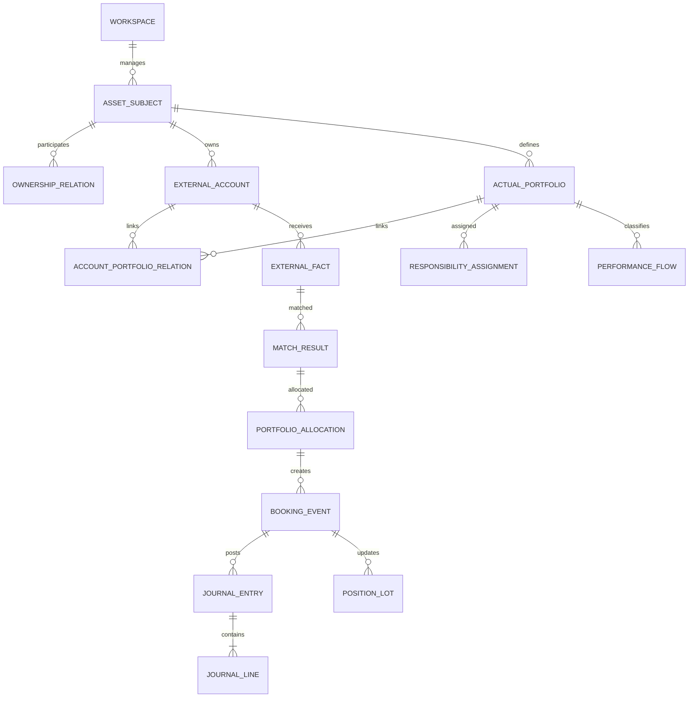
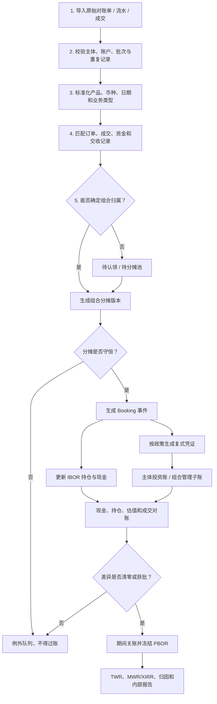

# 资产主体、账户、组合分摊与投资核算详细设计

## 1. 设计结论

本平台的核算主线应从“基金账与管理人公司账”改为：

```text
外部银行/券商/销售账户事实
        ↓ 匹配、去重与归属确认
资产主体级 Booking 与投资账
        ↓ portfolio_id 管理维度分摊
组合管理子账、IBOR 与 PBOR
```

关键原则：

1. **资产主体先于组合**：先确认谁拥有资产、承担权利义务，再判断账户和组合归属。
2. **账户是真实通道，组合是内部管理边界**：一个账户可服务同一资产主体的多个组合，一个组合也可关联多个账户。
3. **只保留一个外部事实**：原始流水或成交不可因组合分摊而复制成多笔外部事实。
4. **分摊必须守恒**：各组合数量、金额、费用和税费分摊之和必须等于外部确认数。
5. **复式记账在核算主体内平衡**：每张凭证借贷相等，主体层满足“资产 = 负债 + 所有者权益”。
6. **组合子账不是默认法定账**：它用于持仓、现金、成本、绩效和责任归属；只有独立法律或会计主体才另建法定总账。
7. **研究、运营、会计与绩效分层**：目标权重不是成交，成交不是凭证，凭证确认日也不必等同于绩效现金流日。
8. **不处理基金管理业务**：不建设持有人份额、基金募集、管理费收入或公募基金法定会计。

## 2. 适用主体

| 资产主体类型 | 平台核算定位 | 典型输出 |
| --- | --- | --- |
| 个人 | 投资辅助账和资产汇总，不替代个人税务申报 | 账户余额、组合持仓、成本、现金流、绩效和资产负债视图 |
| 企业 | 投资运营子系统，按企业会计政策生成或映射投资分录 | 投资台账、科目映射、凭证导出、估值与损益、公司总账对账 |
| 家族持有实体 | 各法律实体分别核算，再按所有权关系形成管理汇总 | 实体账、家庭穿透汇总、主体间往来和合并抵销辅助 |
| 家办工作空间 | 协作和管理容器，本身不当然是资产主体 | 跨主体看板、权限、任务、审计和内部报告 |

家族成员、公司、信托或其他持有实体不得仅因属于同一家族就在会计上混账。平台可以做管理汇总，但必须保留法律主体、持有比例、币种和数据来源。

## 3. 领域模型



### 3.1 资产主体

至少记录：

- `asset_subject_id`、主体类型、名称和有效状态。
- 所有权/控制关系及有效期。
- 本位币、适用会计政策、税务口径和报表周期。
- 数据敏感级别、授权人员和内部责任人。
- 企业场景下的总账公司代码、成本中心或科目映射版本。

### 3.2 外部账户

至少记录：

- 账户号脱敏标识、机构、账户类型、币种、开户主体和用途。
- 资金账户、证券账户、销售账户之间的关联。
- 数据接入方式、对账频率、最近成功日期和余额状态。
- 可关联的真实组合及关系有效期。
- 是否允许共享、共享范围和默认待认领规则。

外部账户只能归属一个明确资产主体。若一个技术账户实际承载多个法律主体，必须有机构子账户、受益所有权或可验证分户证据；否则系统应阻止自动分摊。

### 3.3 真实组合

至少记录：

- `portfolio_id`、组合名称、资产主体、基准、本位币和生效日期。
- 投资目标、期限、流动性层级、风险预算和可投资范围。
- 关联目标配置版本、外部账户、内部责任人和 Sleeve。
- 核算模式：管理子账 / 独立会计主体。
- 绩效边界、外部现金流政策、费用和汇率口径。

### 3.4 账户—组合关系

关系字段至少包括：

- `account_id`、`portfolio_id`、有效起止日。
- 可用资产或产品范围、币种和用途。
- 默认分摊方式、分摊上限和优先级。
- 是否允许组合外资产、待认领余额和人工复核。
- 关系版本、批准人和变更原因。

## 4. 全流程



## 5. 一个账户对应多个组合

### 5.1 交易前

平台可以基于多个组合目标差异生成合并交易测算，但该测算不等于真实委托。应保留：

- 每个组合的原始需求。
- 合并、冲抵和尾差处理规则。
- 预分摊比例与生成时间。
- 责任人、复核人和版本。

### 5.2 成交后

外部账户成交回流后，按实际数量、价格、费用和交收金额分摊：

```text
账户实际成交数量 = Σ 组合分摊数量 + 待分摊数量
账户实际成交金额 = Σ 组合分摊金额 + 待分摊金额
账户实际费用     = Σ 组合分摊费用 + 待分摊费用
```

分摊规则可以是按预分摊比例、按目标缺口、按实际确认批次或人工调整，但必须保存版本和理由。不得通过直接修改原始成交完成“修正”；应冲销旧分摊并创建新版本。

### 5.3 多名内部责任人

交易记录区分的是：

- 资产主体。
- 外部账户。
- 真实组合。
- Sleeve。
- 投资责任人 / 组合责任人。
- 操作与复核人员。

底层公募基金经理是产品属性，不用于拆分资产主体的交易记录。

## 6. Booking 事件

### 6.1 不可缺少的字段

- 来源系统、文件、批次、行号和来源记录哈希。
- 资产主体、外部账户、组合、Sleeve 和分摊版本。
- 产品/事项、业务类型、方向、数量、价格、金额、费用和税费。
- 交易日、确认日、会计日、价值日、交收日和数据入库日。
- 原币、本位币、汇率、汇率日期和汇率来源。
- 外部现金流分类、表内/表外分类及理由。
- 会计政策、科目映射、状态、复核人、过账批次和冲销链。

### 6.2 状态机

```text
原始导入 → 已标准化 → 已匹配 → 已分摊 → 待复核
        → 已确认 → 已过账 → 已对账 → 已关账
```

任一阶段发现错误，应通过退回、冲销和重做处理。已过账或已关账记录不得静默覆盖。

## 7. 借贷与会计恒等式

### 7.1 基本控制

- 每一凭证只属于一个资产主体、一个账簿和一个会计期间。
- 每张凭证必须满足 `借方本位币合计 = 贷方本位币合计`。
- 每个主体在试算平衡后满足 `资产 = 负债 + 所有者权益`。
- 组合维度借贷汇总应能勾稽至主体账，但组合外、待分配和公共费用必须单独展示。
- 会计科目、确认日期和计量分类由资产主体适用准则及内部政策版本决定，不能写死在页面中。

### 7.2 示例分录

以下仅展示系统应支持的结构，不替代主体正式会计政策。

| 业务 | 交易/确认时的示例借方 | 示例贷方 | 绩效属性 |
| --- | --- | --- | --- |
| 外部资金划入投资账户 | 银行存款 | 所有者投入、主体间往来或其他适用科目 | 组合外部流入 |
| 买入 ETF / 基金 | 金融资产；按政策处理交易费用 | 银行存款或清算款项 | 内部投资交易 |
| 卖出产品 | 银行存款或清算款项 | 金融资产成本；差额进入投资损益 | 内部投资交易 |
| 收到现金分红 | 银行存款 | 投资收益或应收股利 | 内部收益，不是外部流入 |
| 公允价值变动 | 金融资产或公允价值变动损益 | 公允价值变动损益或金融资产 | 非现金估值 |
| 支付券商/账户费用 | 投资费用或管理费用 | 银行存款或应付款 | 费用 |
| 同一主体账户间划转 | 转入账户银行存款 | 转出账户银行存款 | 主体层内部划转 |
| 同一主体组合间调拨 | 组合子账转入 | 组合子账转出 | 主体层不形成收入或外部流量 |

底层公募基金的管理费通常已经反映在基金净值中，平台记录其费率用于产品成本研究，不为资产主体虚构“管理费收入”或重复计提已经包含在净值中的费用。

### 7.3 交易日与交收日

系统应支持按资产主体政策选择交易日或交收日会计，并对同类金融资产一致应用。无论 ABOR 采用何种确认时点，IBOR 和 PBOR 都要保留完整日期并通过可追溯的应收、应付或在途项解释差异。

## 8. 表内、表外与组合范围

### 8.1 主体层

“表内/表外”只能相对于资产主体及其正式会计政策判断：

- 表内：已满足确认条件并进入主体资产、负债、权益、收入或费用。
- 表外备查：未满足表内确认或只需披露、承诺、授权、担保、未执行计划等事项。
- 不入本主体账：属于其他资产主体，或尚无法证明归属。

### 8.2 组合层

组合一般不是独立会计主体，页面应使用：

- 纳入组合。
- 组合外但属于同一资产主体。
- 待认领 / 待分配。
- 备查事项。

不能把“没有分到某组合”直接称为资产主体的表外业务。

## 9. 报表体系

### 9.1 资产主体层

- 投资资产与现金汇总。
- 金融资产分类、成本、公允价值、已实现和未实现损益。
- 投资收入、费用和汇兑损益。
- 主体投资资产负债视图。
- 企业总账科目映射、凭证导出与差异对账。
- 家族多主体管理汇总及所有权抵销辅助。

### 9.2 组合层

- 组合持仓表、现金表、交易流水和成本批次。
- 目标与实际权重偏离。
- 收益与费用明细、已实现与未实现损益。
- 外部现金流、TWR、MWR/XIRR 和基准比较。
- 收益归因、风险暴露与情景压力。
- 组合变动说明和内部管理报告。

这不是默认的法定基金资产负债表、利润表和净资产变动表。若某真实组合是独立会计主体，系统再按该主体的适用准则启用法定报表模板。

## 10. IBOR、ABOR 与 PBOR

| 记录本 | 回答的问题 | 核心事实 |
| --- | --- | --- |
| IBOR | 今天可管理的持仓和现金是多少？ | 成交、交收、持仓、在途、现金、公司行动 |
| ABOR | 资产主体按政策确认了什么？ | 凭证、科目、期间、估值、应计、试算平衡 |
| PBOR | 某个绩效期间应该如何计量？ | 冻结估值、外部现金流、费用、汇率、基准和算法版本 |

三者不得分别维护三份互不关联的原始事实。应共用 Booking 来源和数据血缘，通过不同视图、日期与政策形成结果。

## 11. TWR、MWR/XIRR 的数据要求

- 每笔组合外部现金流必须有组合、日期、方向、金额、币种和汇率。
- 产品买卖、底层基金申购赎回、股息和利息通常不作为组合外部现金流。
- 同一主体组合间划转在两个组合可分别表现为流出/流入，但在主体汇总层必须抵销。
- TWR 需要按日或重大外部现金流时点估值并链接子期间收益。
- MWR/XIRR 使用实际日期现金流和期末价值，反映资金时点对资产主体体验的影响。
- 缺失估值、未分摊现金流或未解决对账差异时，不得把结果标为正式绩效。

## 12. 前端页面设计

### 12.1 资产主体与组合中心

- 资产主体列表与详情。
- 所有权/控制关系图。
- 外部账户与接入状态。
- 真实组合、账户关系、目标版本和责任人。
- 主体、账户、组合三级汇总切换。

### 12.2 投资运营与组合核算

页面采用真正的工作区，不使用容易误认为按钮的说明卡片：

1. **数据接入**：上传区、字段映射、批次表和错误行。
2. **匹配与待认领**：外部事实、候选组合、匹配证据和例外队列。
3. **组合分摊**：实际数、分摊数、待分摊数、守恒校验和版本记录。
4. **Booking**：事件明细、日期、现金流/表内分类和凭证预览。
5. **IBOR**：持仓、现金、在途和公司行动。
6. **主体投资账**：凭证、科目余额、试算平衡和总账导出。
7. **组合管理子账**：持仓、成本、损益、费用和现金流。
8. **对账与关账**：差异队列、复核、锁定、重开和冲销。
9. **PBOR 与报表**：冻结批次、绩效口径和内部报告。

说明性内容只放在页首帮助、字段提示或可折叠说明中；没有真实交互的“职责边界”“产出标签”等不得做成高亮功能卡片。

## 13. 权限与控制

- 数据录入、分摊、凭证生成、复核和关账应职责分离。
- 账户号、身份证件、实体文件和家族所有权属于高敏感数据，应最小权限访问和加密存储。
- 原始文件、匹配、分摊、Booking、凭证和报表全链路保留审计日志。
- 自动规则只能生成候选结果；高金额、跨主体、未知对手方和手工调账必须复核。
- 已关账期间重开、冲销和政策切换应采用更高权限并记录理由。
- 导出文件应包含主体、组合、口径、数据截止日、版本和保密水印。

## 14. MVP 验收

1. 可创建个人、企业或家族持有实体，并在其下关联外部账户和多个真实组合。
2. 同一账户成交可分配给同一主体的多个组合，数量、金额和费用严格守恒。
3. 原始记录、分摊、Booking、凭证和持仓可从来源号双向追溯。
4. 每张凭证借贷相等，主体试算平衡满足会计恒等式。
5. 组合管理子账可勾稽至主体投资账，并明确组合外和待分配余额。
6. 可区分外部资金流、内部投资交易和同一主体内部划转。
7. 可生成 TWR 和 MWR/XIRR 所需的逐日现金流与估值数据集。
8. 页面不存在基金募集、客户申赎、管理费收入、管理人公司账或法定基金三表的默认流程。
9. 平台不产生真实订单或网络交易请求。

## 15. 参考依据

- [IFRS Foundation：IFRS 9 Financial Instruments](https://www.ifrs.org/issued-standards/list-of-standards/ifrs-9-financial-instruments/)：金融资产和负债由成为合同一方的实体确认，具体分类与计量取决于主体业务模式和合同现金流特征。
- [IFRS 9：trade date and settlement date accounting](https://www.ifrs.org/content/dam/ifrs/publications/pdf-standards/english/2022/issued/part-a/ifrs-9-financial-instruments.pdf?bypass=on)：常规金融资产买卖可按交易日或交收日会计并对同类资产一致应用。
- [GIPS Standards Handbook for Asset Owners](https://www.gipsstandards.org/standards/gips-standards-for-asset-owners/gips-standards-handbook-for-asset-owners/)：用于外部现金流、TWR、MWR 和估值时点的方法参考。
- [BlackRock Aladdin Accounting](https://www.blackrock.com/aladdin/platforms/products/aladdin-accounting)：IBOR、ABOR、PBOR 使用统一投资数据并可向总账输出凭证的架构参考。
- [Deloitte：Family Office Technology—Information Management](https://www.deloitte.com/us/en/services/deloitte-private/articles/family-office-technology.html)：家办需要整合来自银行、托管人和历史表格的碎片数据，建立可供分析的单一事实来源。
- [Addepar：Family Office Software](https://addepar.com/family-office-software/)：多实体所有权建模、跨机构聚合和分层汇总是家办技术平台的重要能力。

具体科目、税务、确认时点和法定报表必须由各资产主体依据所在地准则与专业会计意见确定；本设计不构成会计、税务或法律意见。
