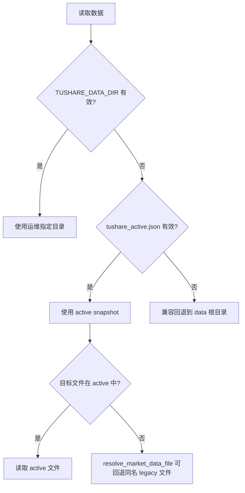
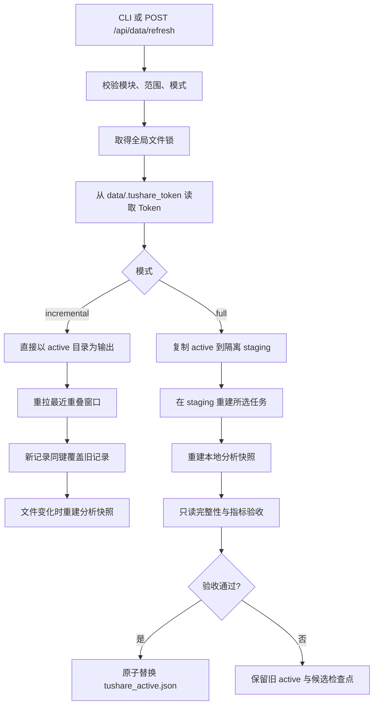

# Tushare 下载、文件与数据状态契约

执行真相：`T01_get_data.py`、`backend/services/data_refresh.py`、`backend/market_data.py`。本文保留动作、接口、输出、schema、分页和恢复约束；编排见[ETL](etl.md)，目录身份见[存储](storage.md)。

## 状态如何判断

必须分别判断“活跃快照中已真实下载”“代码已支持但未下载”“本地派生”。活跃状态只认 `data/tushare_active.json`、所指文件与 Parquet metadata；代码有接口、任务完成或候选文件存在都不能证明已经发布。

下面文件行数／schema 表保留 **2026-09-03 的历史审计快照**，用于理解数据合同，不表示当前活跃目录。2026-09-08、09-10、09-11 的后续证据在文末分别标明，不能把不同快照拼成当前库存。本次整理未重新查询账户、供应商或正式数据。

新增或变更接口须按 AGENTS 的 tushare-fetcher 协议核对当前目录、账户与独立权限。历史记录的积分、调用上限和文件数量都不是永久常量。
## 运行时如何选择数据目录



2026-09-03 审计时，`data/` 下另有两类非活跃数据：

- 根目录 legacy 文件：较早的 ETF、指数、交易日历和研究结果文件；不是当前活跃快照。
- `data/tushare_full_validation_20260831/`：11 个 Parquet、约 1.35 GiB；未被 manifest 激活，不能当作当前数据。

结论和统计默认只使用活跃目录；除非专门分析兼容回退，否则不要混入 legacy 或未激活候选目录。

## 历史下载快照（2026-09-03）

### 基础、ETF 与公募基金

| 状态 | 文件 | 来源/生成方式 | 行数 | 大小 MiB | 实际日期范围或说明 |
| --- | --- | --- | ---: | ---: | --- |
| 已下载 | `trade_day_df.parquet` | `trade_cal(exchange='SSE')` | 6,090 | 0.05 | `2010-01-01` 至 `2026-09-03` |
| 已下载 | `stock_basic.parquet` | `stock_basic` | 5,555 | 0.25 | 当前上市股票目录 |
| 已下载 | `fund_company_df.parquet` | `fund_company` | 206 | 0.05 | 基金公司目录 |
| 已下载 | `etf_info_df.parquet` | `fund_basic(E)` + `etf_basic` | 1,786 | 0.15 | ETF 产品主数据 |
| 已下载 | `etf_daily_df.parquet` | `fund_nav(market='E')` | 1,619,037 | 65.03 | `2010-01-04` 至 `2026-09-02` |
| 需关注 | `etf_share_size_df.parquet` | `etf_share_size` | 6,595 | 0.22 | 仅 `2026-08-28` 至 `2026-09-02` 的短基线 |
| 已下载 | `etf_daily_candle_df.parquet` | `fund_daily` | 1,577,462 | 86.59 | `2010-01-04` 至 `2026-09-02` |
| 已下载 | `fund_info_df.parquet` | `fund_basic(market='O')` | 29,206 | 1.55 | 场外公募基金份额级目录 |
| 已下载 | `fund_nav_df.parquet` | `fund_nav(market='O')` | 33,710,365 | 1,221.92 | `2010-01-03` 至 `2026-09-02` |
| 已下载 | `etf_index.parquet` | `etf_index` | 560 | 0.03 | ETF 指数原始目录；网页通过 index/catalog 获取 |

产品主数据刷新代码写入两个统一字段；该历史快照是否具备字段须与当前文件区分：

| 字段 | 取值 | ETF 来源 | 场外基金来源 |
| --- | --- | --- | --- |
| `qdii_type` | `QDII` / `非QDII`；旧 ETF 兼容读取时可为 `待确认` | `etf_basic.etf_type`；缺失但名称有显式标记时判定 QDII，否则待确认 | `fund_basic.name` 中是否含显式 `QDII` 标记 |
| `qdii_source` | 来源标识 | `etf_basic.etf_type` 或 `fund_basic.name_marker` | `fund_basic.name_marker` |

`qdii_type` 是投资通道属性，与 `instrument_type=etf/fund`、`fund_type=股票型/债券型/...`、`invest_type=被动指数型/主动型/...` 相互独立。QDII ETF 仍然是 ETF，仍可使用交易所 OHLC；场外 QDII 基金仍然是场外基金，不能因此获得开高低收字段。

### 指数原始目录、统一目录与行情

| 状态 | 文件 | 来源/生成方式 | 行数 | 大小 MiB | 实际日期范围或说明 |
| --- | --- | --- | ---: | ---: | --- |
| 已下载 | `index_info.parquet` | `index_basic` | 9,643 | 0.45 | 多市场指数基础信息 |
| 已下载 | `index_classify_df.parquet` | `index_classify` | 511 | 0.02 | 申万/中信行业目录原表 |
| 已下载 | `ths_index_df.parquet` | `ths_index` | 2,517 | 0.05 | 同花顺指数目录原表 |
| 已下载 | `dc_index_df.parquet` | `dc_index` 最近可用日 | 1,031 | 0.05 | 快照日 `2026-09-03` |
| 已下载 | `tdx_index_df.parquet` | `tdx_index` 最近可用日 | 613 | 0.03 | 快照日 `2026-09-02` |
| 已下载 | `index_catalog_df.parquet` | 上述目录统一标准化 + 南华固定代码表 | 14,953 | 0.25 | 主键 `source_api, ts_code` |
| 已下载 | `index_daily_df.parquet` | `index_daily` | 25,280,959 | 1,238.93 | `2010-01-01` 至 `2026-09-03` |
| 已下载 | `index_sw_daily_df.parquet` | `sw_daily` | 1,549,960 | 113.89 | `2010-01-04` 至 `2026-09-02` |
| 需关注 | `index_ci_daily_df.parquet` | `ci_daily` | 0 | 0.00 | 文件存在但没有行情 |
| 已下载 | `index_ths_daily_df.parquet` | `ths_daily` | 2,877,395 | 240.80 | `2010-01-04` 至 `2026-09-02` |
| 已下载 | `index_dc_daily_df.parquet` | `dc_daily` | 1,419,342 | 85.87 | `2020-01-02` 至 `2026-09-03` |
| 已下载 | `index_tdx_daily_df.parquet` | `tdx_daily` | 205,056 | 35.88 | `2025-03-28` 至 `2026-09-02` |
| 已下载 | `index_global_daily_df.parquet` | `index_global` | 86,126 | 4.94 | `2010-01-04` 至 `2026-09-02` |
| 已下载 | `index_futures_daily_df.parquet` | `fut_index_daily` | 193,746 | 11.64 | `2010-01-04` 至 `2026-09-02` |
| 已下载 | `index_daily_basic_df.parquet` | `index_dailybasic` | 24,294 | 1.34 | `2010-01-04` 至 `2026-09-03` |

### 指数成分、权重与本地派生快照

| 状态 | 文件 | 来源/生成方式 | 行数 | 大小 MiB | 实际日期范围或说明 |
| --- | --- | --- | ---: | ---: | --- |
| 需关注 | `index_members_df.parquet` | `index_member_all`、`ci_index_member`、`ths_member`、`dc_member`、`tdx_member` | 621,382 | 2.38 | 在最近失败任务中已更新 |
| 需关注 | `index_weights_df.parquet` | `index_weight` | 2,193,640 | 26.46 | `2026-06-30` 至 `2026-09-01`；最近一轮未完成 |
| 需关注/派生 | `index_coverage_snapshot.parquet` | 本地扫描各指数行情 metadata/批次 | 13,359 | 0.12 | 早于最近失败任务，需重建 |
| 需关注/派生 | `instrument_metrics_snapshot.parquet` | 本地 ETF/基金净值与 ETF 行情计算 | 30,939 | 2.57 | 最大净值日 `2026-09-02`；未覆盖最近失败任务后的全部变化 |

## 已支持接口与历史未下载项（以审计日期为准）

### 公募基金扩展数据

| 动作 | Tushare 接口/来源 | 目标文件 | 关键格式与主键 |
| --- | --- | --- | --- |
| `fund_manager` | `fund_manager` | `fund_manager_df.parquet` | 履历字段 + lineage；`ts_code,name,begin_date` |
| `fund_scale` | 从 `fund_nav_df.parquet` 派生 | `fund_scale_df.parquet` | `net_asset,total_netasset`；`ts_code,observation_date` |
| `fund_portfolio` | `fund_portfolio` | `fund_portfolio_df.parquet` | 季报股票持仓；`available_at,ts_code,end_date,symbol` |
| `fund_dividend` | `fund_div` | `fund_dividend_df.parquet` | 分红事件；`available_at,ts_code,ex_date,pay_date` |
| `fund_adjustment` | `fund_adj` | `fund_adj_factor_df.parquet` | ETF 市价复权因子，输入 ETF 目录；`ts_code,date` |
| `price_adjustment` | 从 `etf_daily_candle_df.parquet` + `fund_adj_factor_df.parquet` 派生 | `etf_daily_candle_df.parquet`（就地补列） | 新增 `adj_factor,adj_factor_source,adj_open,adj_high,adj_low,adj_close`；`ts_code,trade_date` |
| `fund_benchmark` | `mkt_idx_bmk` | `fund_benchmark_df.parquet` | 标准基准目录；`ts_code` |

注意：`fund_portfolio` 只是公开披露的股票持仓，不是含债券、现金、基金和衍生品的完整资产配置；`mkt_idx_bmk` 也不自动等于每只基金合同中的业绩比较基准。

`price_adjustment` 是本地派生，必填参数 `factor_policy`（CLI `--adjust-factor-policy`）决定因子来源：
`source` 只用 `fund_adj_factor_df.parquet`（原审计账户/快照只覆盖2只ETF，该数量不是当前权限或覆盖保证）；
`source_then_pre_close`（默认）对没有数据源因子的标的按 `close[t-1]/pre_close[t]` 累乘推导；
`pre_close` 全部推导，用于核验两条路径。没有可用因子的标的复权列留空，依赖复权口径的指标据此报不可计算，
不用未复权价格冒充。因子是累乘量，每次运行整表重算，不做增量拼接。详见 `docs/data/adjusted-price.md`。

### 宏观数据

| 动作 | Tushare 接口 | 目标文件 | 观测期字段/版本键 |
| --- | --- | --- | --- |
| `macro_cycle` | `cn_gdp` | `macro_cn_gdp_df.parquet` | `quarter -> observation_date` |
| `macro_cycle` | `cn_cpi` | `macro_cn_cpi_df.parquet` | `month -> observation_date` |
| `macro_cycle` | `cn_ppi` | `macro_cn_ppi_df.parquet` | `month -> observation_date` |
| `macro_cycle` | `cn_pmi` | `macro_cn_pmi_df.parquet` | `month -> observation_date` |
| `macro_money_credit` | `cn_m` | `macro_cn_money_df.parquet` | `month -> observation_date` |
| `macro_money_credit` | `sf_month` | `macro_cn_social_financing_df.parquet` | `month -> observation_date` |
| `macro_rates` | `shibor` | `macro_shibor_df.parquet` | `observation_date` |
| `macro_rates` | `shibor_lpr` | `macro_lpr_df.parquet` | `observation_date` |
| `macro_rates` | `repo_daily` | `macro_repo_daily_df.parquet` | `ts_code,observation_date` |
| `macro_release_calendar` | `cn_schedule` | `macro_cn_schedule_df.parquet` | `observation_date,title,data_api` |

宏观接口未显式固定 `fields`，因此原始业务列随 Tushare 接口返回列演进；本地稳定追加以下治理列：

```text
observation_date: timestamp[ns]
available_at: timestamp[ns] 或 null
availability_status: string
source_api: string
ingested_at: string
revision: int
vintage: string
```

GDP、CPI、PPI、PMI、货币和社融当前没有可靠的逐期首次发布日期，代码写入 `available_at=null`、`availability_status=release_date_unknown`。它们不能直接当作历史时点可得数据用于正式回测。Shibor、LPR、回购和发布日历暂记为 `date_only`，同样不包含日内可得时刻。

#### 美林时钟输入与通用 ETL（2026-09-10 核验）

- 统一使用已有 `tushare.macro_cycle`（宏观增长、通胀与景气）任务，调用 `save_macro_cycle` 下载上表四个周期接口；不另建美林时钟专用任务或重复采集器。任务说明已列出 PMI/CPI/GDP/PPI 与用途。
- 可用字段：增长维度为 PMI `pmi010000` 或生产指数 `pmi010400`，通胀维度为 CPI 全国同比 `nt_yoy`；GDP `gdp_yoy`、PPI `ppi_yoy` 可替换。GDP 是季频，不能不做显式频率处理就替换月频 PMI。这是可配置研究输入，不代表唯一美林时钟口径。
- 官方文档当日门槛：GDP/CPI/PPI 各 600 积分，PMI **5000 积分**（技能附带旧目录仍写 2000，应以当前官方文档为准）；单次上限分别为 10000/5000/5000/2000 行。文档未要求这四项另开独立权限。参考：[GDP](https://tushare.pro/document/2?doc_id=227)、[CPI](https://tushare.pro/document/2?doc_id=228)、[PPI](https://tushare.pro/document/2?doc_id=245)、[PMI](https://tushare.pro/document/2?doc_id=325)、[积分频次](https://tushare.pro/document/1?doc_id=290)。
- 沿用系统共享配额：默认来源 450 次/分钟、单接口 240 次/分钟，配置更严时取更严值；现有超时、有限重试、行数触顶失败、私有工作区与版本记录继续生效。四个周期接口当前采用官方允许的完整快照请求，运行开始/截止日不会裁剪快照或恢复历史修订版本。仅凭参数中填写过去日期不能声称 PIT。
- 实测仅发起 **1 次** `cn_pmi` 请求，范围 `202501—202512`，返回 12 条；验证大写字段别名转换后保留 `month/pmi010000`，仅写临时 Parquet。其他三个接口有代码和离线全链路测试，本次没有真实请求。没有新增或修改下载脚本，不另行生成、固化重复脚本。
- 2026-09-10 再次核验：通用ETL私有任务已产出 PMI 260 行（2005-01—2026-08）、CPI 511 行（1951-12—2026-07）。本次修复未再次调用供应商接口，复核既有工作区清单和文件SHA256后，将这两份原始文件加入新快照 `tushare_snapshot_20260910_merrill_macro01`，通过完整快照验收并激活。其余行情沿用原活跃快照；旧快照 `tushare_snapshot_20260908T135106Z_etfadj02` 保留。GDP/PPI仍须区分ETL私有下载与研究版本可用状态，不能据此声称已激活。
- 美林时钟默认 PMI `pmi010000` ＋ CPI `nt_yoy`，共同月份实算259期（2005-01—2026-07）。未知发布日期保留为null；事后解析使用版本采集时间表示系统获得该版本的知识时点，不修改原始文件、不补造发布日期、不产生历史可交易生效日；实时及历史截止日门禁继续生效。详见 `docs/regimes/README.md`。

## 下载动作、接口与输出文件

### 基础与产品

| 代码动作 | CLI 参数 | 接口/处理 | 输出 |
| --- | --- | --- | --- |
| `calendar` | `--calendar` | `trade_cal(SSE)` | `trade_day_df.parquet` |
| `stock_basic` | `--stock-basic` | `stock_basic` | `stock_basic.parquet` |
| `fund_company` | `--fund-company` | `fund_company` | `fund_company_df.parquet` |
| `etf_info` | `--etf-info` | `fund_basic(E)` + `etf_basic` | `etf_info_df.parquet`、Excel 镜像 |
| `nav` | `--nav` | `fund_nav(E)` | `etf_daily_df.parquet` |
| `etf_share` | `--etf-share` | `etf_share_size` | `etf_share_size_df.parquet` |
| `candle` | `--candle` | `fund_daily` | `etf_daily_candle_df.parquet` |
| `fund_info` | `--fund-info` | `fund_basic(O)` | `fund_info_df.parquet`、Excel 镜像 |
| `fund_nav` | `--fund-nav` | `fund_nav(O)` | `fund_nav_df.parquet` |
| `fund_manager` | `--fund-manager` | `fund_manager` | `fund_manager_df.parquet` |
| `fund_scale` | `--fund-scale` | 本地派生 | `fund_scale_df.parquet` |
| `fund_portfolio` | `--fund-portfolio` | `fund_portfolio` | `fund_portfolio_df.parquet` |
| `fund_dividend` | `--fund-dividend` | `fund_div` | `fund_dividend_df.parquet` |
| `fund_adjustment` | `--fund-adjustment` | `fund_adj` | `fund_adj_factor_df.parquet` |
| `price_adjustment` | `--price-adjustment` | 本地派生 | `etf_daily_candle_df.parquet` 就地补复权列 |
| `fund_benchmark` | `--fund-benchmark` | `mkt_idx_bmk` | `fund_benchmark_df.parquet` |

### 指数与宏观

| 代码动作 | CLI 参数 | 接口/处理 | 输出 |
| --- | --- | --- | --- |
| `index_info` | `--index-info` | `index_basic`；直接 CLI 兼容动作 | `index_info.parquet` |
| `etf_index` | `--etf-index` | `etf_index`；直接 CLI 兼容动作 | `etf_index.parquet` |
| `index_catalog` | `--index-catalog` | `index_basic`、`etf_index`、`index_classify`、`ths_index`、`dc_index`、`tdx_index` | 原始目录 + `index_catalog_df.parquet` |
| `index_domestic` | `--index-domestic` | `index_daily` | `index_daily_df.parquet` |
| `index_industry` | `--index-industry` | `sw_daily`、`ci_daily` | 两张行业行情表 |
| `index_concept` | `--index-concept` | `ths_daily`、`dc_daily`、`tdx_daily` | 三张概念行情表 |
| `index_global` | `--index-global` | `index_global` | `index_global_daily_df.parquet` |
| `index_futures` | `--index-futures` | `fut_index_daily` | `index_futures_daily_df.parquet` |
| `index_valuation` | `--index-valuation` | `index_dailybasic` | `index_daily_basic_df.parquet` |
| `index_constituents` | `--index-constituents` | 五类成员接口 + `index_weight` | `index_members_df.parquet`、`index_weights_df.parquet` |
| `index_coverage` | 自动追加 | 本地派生 | `index_coverage_snapshot.parquet` |
| `macro_cycle` | `--macro-cycle` | GDP/CPI/PPI/PMI | 四张 macro 表 |
| `macro_money_credit` | `--macro-money-credit` | 货币/社融 | 两张 macro 表 |
| `macro_rates` | `--macro-rates` | Shibor/LPR/回购 | 三张 macro 表 |
| `macro_release_calendar` | `--macro-release-calendar` | `cn_schedule` | `macro_cn_schedule_df.parquet` |

网页模块及默认范围：

| 模块 | 可选范围 | 默认范围 |
| --- | --- | --- |
| `base` | calendar、stock_basic、fund_company | 全部 |
| `etf` | info、nav、share、candle | 全部 |
| `fund` | info、nav、manager、scale、portfolio、dividend、adjustment、benchmark | info、nav、manager、scale、benchmark |
| `index` | catalog、domestic、industry、concept、global、futures、valuation、constituents | catalog、domestic、industry、global |
| `macro` | cycle、money_credit、rates、release_calendar | 全部 |

依赖会自动展开：ETF 的 nav/share/candle 依赖 ETF info；公募基金的 nav/manager/portfolio/dividend/adjustment 依赖 fund info，scale 依赖 fund info + fund nav；任何指数范围都依赖 catalog。增量时，只要选择时序数据，还会自动附带 calendar。

## 全量与增量执行逻辑



### 全量模式

- 默认开始日 `20100101`；网页全量必须显式设置 `DATA_FULL_REFRESH_ENABLED=true`。
- staging 先复制当前活跃目录的普通文件，再仅重建用户选择的范围，因此未选择的数据会沿用旧版本。
- 净值、行情按代码分片；每个代码及日期段保留隐藏检查点，可在同一候选目录续跑。
- 选择 index 时，下载动作末尾重建 `index_coverage_snapshot.parquet`；所有下载节点完成后再重建 `instrument_metrics_snapshot.parquet`。
- 候选必须满足核心文件、Parquet 结构、独立抽样指标与文件指纹验收，才会原子切换 manifest。
- 下载完成但分析或验收失败时，旧版本继续服务；同请求续跑可复用候选，避免重复调用 Tushare。

### 增量模式

- 时序数据默认重拉最近 **5 个上交所开放交易日**，以覆盖迟报和修订；新值按业务键 `keep=last`。
- 每 **20 个交易日**为一批执行 Arrow 流式归并，避免一次加载完整历史。
- 未命中更新窗口的产品直接按 Arrow 批次复制；内容完全相同时不替换原文件。
- 新引入但没有基线的数据不会在一次增量中回补完整历史：ETF 份额仅建立最近窗口；基金持仓、分红、复权因子也只建立安全近期窗口。
- 增量没有整快照回滚。如果任务中途失败，前面完成的单文件更新仍然有效，因此必须结合任务状态判断跨表一致性。

### 自动增量与公告查询覆盖

自动区间、候选采集基线、公告日覆盖清单、修订重查和跨版本恢复统一见[ETL 契约](etl.md)。自动增量不是定时调度，无基线不能悄悄全量；完整请求回执与业务质量通过分别记录。
## 分页、限频、截断与并发

默认网页刷新参数：16 个 worker、450 次/分钟、任意两次请求最少间隔 0.13 秒、最多重试 5 次、普通退避 2 秒、限流等待至少 15 秒。所有 worker 共用同一个线程安全 `RateLimiter`。

| API | 代码中的单次行数警戒值 | 防截断策略 |
| --- | ---: | --- |
| `fund_basic` | 15,000 | E/O + L/I/D 分区，`offset/limit` 分页，检查分页是否前进 |
| `fund_manager` | 5,000 | `offset/limit` 分页，最大页数失败关闭 |
| `fund_portfolio` | 2,000（本地警戒值） | 全历史按基金 + 公告区间二分；启用 offset 时，增量按全市场公告日顺序分页，不再展开为日期 × 全部基金；复用已验证查询覆盖，页长/业务键/末页校验失败关闭 |
| `fund_div` | 5,000 | 公告日触顶后按基金补抓；不以当前成立日、清盘日期或基金类型排除历史披露 |
| `fund_adj` | 2,000 | 全量按 ETF 目录中的交易所代码，日期窗口不超过 1,200 天；不请求 `.OF` |
| `mkt_idx_bmk` | 500 | 触顶即失败，不保存疑似截断结果 |
| `etf_basic` / `fund_daily` / `etf_share_size` | 5,000 | 交易所/状态分区，或按代码、日期切片；ETF 份额区间触顶递归二分 |
| `index_daily` | 8,000 | 按代码 + 日期段，触顶递归二分 |
| `sw_daily` / `ci_daily` | 4,000 | 按代码 + 日期段，触顶递归二分 |
| `ths_daily` / `tdx_daily` | 3,000 | 按代码 + 日期段，触顶递归二分 |
| `dc_daily` / `fut_index_daily` | 2,000 | 按代码 + 日期段，触顶递归二分 |
| `index_global` | 4,000 | 先发现代码，再按代码 + 日期段 |
| `index_dailybasic` | 3,000 | 仅固定代表性指数代码 |
| `index_weight` | 1,000 | 最近 120 天内最新权重，按月倒序查询；新配置最多 100 页/查询，触顶按日期二分，单日仍触顶失败关闭；完整查询与逐代码检查点 |
| GDP/CPI/PPI/货币等 | 2,000–10,000 | 小表整表重取，触顶即失败 |
| Shibor/LPR/回购 | 2,000/4,000/2,000 | 分别按 1,800/3,500/90 天切片，触顶即失败 |

普通异常使用指数退避和随机抖动；权限/积分错误立即转成 `PermissionError`；异常返回空数据会额外确认一次。中间交易日为空会阻止落盘，只有最后一个尚未发布的开放日允许留待下次更新。

### 基金披露无效请求与中断保护（2026-09-08）

执行入口仍为 `T01_get_data.py`，持仓/分红的唯一公告日采集实现为 `backend/data_sources/fund_events.py`。旧实现一次触顶便逐只查询全部基金、仅在整日补抓结束后保存、收集异常后继续遍历全部日期，会使历史任务长期停留在同一日期阶段。

- 全历史持仓每只基金请求 `ts_code + start_date + end_date`，返回触顶才对公告区间自适应二分；避免“每个公告日 × 全部基金”的笛卡尔积。区间严格采用用户原公告窗口，逐行校验 `ann_date`，不按报告期 `end_date` 校验区间，也不静默过滤越界行。报告期早于公告窗口的迟发披露仍完整保留。`found_date` 仅可作为二分位置提示，左右区间均请求，绝不作为历史截断线。
- 不能根据当前成立日期直接排除历史：现场 `000264.OF`（博时内需增长）、`000595.OF`（嘉实泰和）当前合同成立于 2013/2014 年，却保留 2000 年原封闭式基金披露。转型关系有[上交所公告](https://www.sse.com.cn/disclosure/fund/announcement/c/2013-07-11/500006_20130712_1.pdf)和[嘉实基金公告](https://www.jsfund.cn/main/a/20140416/113256.shtml)支持。清盘日及当前类型同样不能用来排除迟发或历史披露；不根据名称猜测转型关系。
- 每个“基金 + 公告区间”叶分片立即写原子 Parquet/回执，记录请求身份、行数及 SHA-256；触顶节点保存 SPLIT 状态，恢复只下载未完成叶子。协议 `events_v4` 显式冻结 `range_field=ann_date`，不消费错误报告期口径的 v3 回执，旧文件保留供审计。生产空响应独立复核一次，不把网络/权限错误当空结果。全历史输出使用最多 32 路、每路 512 行批次的外部有序归并，不一次把全部历史放进内存；业务键排序与去重口径不变。临时合并文件仅在整次合并校验后替换输出。
- 增量持仓和分红保留公告日口径以覆盖迟发/修订；公告日触顶按基金补抓并逐只保存回执，不假设分红接口支持报告期参数。某只基金没有历史时最多做一次独立空复核，不再为它循环扫描几千个历史公告日（全历史持仓策略）。
- 目录/成立日期、字段、范围、来源配置和检查点协议隔离缓存。旧无证据 `.empty` 不复用；旧非空文件只有经过显式 `etl_migration` 校验并生成 `verified_day_imports.json` 后才被新协议消费。导入回执及文件在 resume 时重新验 checksum；不改变旧版本/旧快照，也不自动启动迁移。
- 第一个不可恢复错误（含有限重试耗尽）立即停止派发，保留已完成/在途成功分片；不等待把余下所有日期请求一遍。共享配额等待每秒响应取消检查；在途网络请求仍受已保存连接/读取超时约束。鉴权/权限/参数等非瞬时错误不盲目重试。
- 默认 `--fund-event-max-requests=100000`（计入重试/空复核）、`--fund-event-idle-timeout=180` 秒、`--fund-event-max-runtime=86400` 秒。任务运行上限取与接口策略更严格者，超限保留检查点并明确失败；预算不是许可配额，不会提高来源或接口调用额度。CLI 可收紧或显式调整这些保护；界面没有新增无限运行开关。
- 成功响应必须匹配请求基金、公告区间或公告日分片，并具有有效业务键，拒绝参数被忽略、报告期格式错误及疑似截断。持仓单基金单公告日使用本轮已实测并显式启用的 `offset/limit` 分页；未启用或分页无法完整收敛时仍失败关闭。分红不借用未经核定的持仓分页协议。已完全验证替代分片的触顶请求才清除任务失败统计，权限/连接失败仍保留。
- 全历史进度显示基金完成数、当前基金/公告区间细分及请求预算；增量进度区分外层日期完成数与公告日内的基金补抓；合并/校验单独切换阶段。请求批次/行数含空复核与重试，不是最终新增行数。

接口核定：本次使用技能保存的账户积分 10000；积分不等于独立授权。官方文档及技能 JSON 将 `fund_portfolio.start_date/end_date` 描述为报告期，但 2026-09-08 实际请求 `000011.OF, 20150826—20210301` 返回 895 行：公告日 20150829—20210121，报告期 20150630—20201231。旧实现按报告期校验而误报 `FUND_EVENT_RESPONSE`。当前按该实测供应商行为锁定公告日期轴，若后续返回越界仍明确失败，不按单次结果自适应切换日期轴。`period` 仍是独立报告期参数，不能与范围日期轴混淆。未核定分页或官方单次行数硬上限。表中 2000 是当前代码与保存配置的保守警戒值，不宣称官方上限。现场有效策略仍为 240 次/分钟、间隔 0.25 秒、至多 16 并发、连接 5 秒/读取 30 秒、最多 3 次尝试，未放宽配额。参考：[持仓接口](https://tushare.pro/document/2?doc_id=121)、[分红接口](https://tushare.pro/document/2?doc_id=120)。

现场证据（2026-09-08，私有候选而非活跃快照）：原任务虽标记手动增量，但没有冻结基线，实际初始化 19991231—20260906 全历史。停止前基金目录为 29225 只；其中仅 622 只当前合同成立于 20101026 之前，但该统计不能当作其余请求全部无效的证明，转型前历史必须保留。本次减少的是重复日期探测，不声称所有空请求均可消除或给出未经全量实测的提速倍数。

用户已要求关闭的旧 worker 24052 已核验身份后终止，锁已释放，运行 `e9cf325eb9144ccca5d8d5e29eb4099a` 标记 CANCELLED。成功步骤、原数据和检查点保留，不自动恢复下载。单次真实 smoke 入口为 `scripts/smoke_fund_events.py --confirm-network --announcement-date YYYYMMDD --universe-file PATH`：使用已保存接口/账户共享配额、全局锁、临时输出、不记录正式批次、不激活快照，固定最多一次请求且验证代码哈希。第一轮验证被最初的成立日期假设提前排除，配额记录确认未发请求；这一反例促成移除不安全的历史剪枝，不作为线上成功证据。

前轮单请求验证：20000117 公告日请求成功、90 行；它没有经过全历史区间链路，不能作为区间语义正确的证据。范围验收入口 `scripts/smoke_fund_events.py --smoke --confirm-network --fund-code 000011.OF --start-date 20150826 --end-date 20210301 --universe-file PATH` 默认一次请求、单基金、单线程、一次尝试，使用正式全历史调用链及临时输出；用户授权分页测试后才显式增加 `--max-requests`。验收检查公告边界、基金身份、来源、行数及采集链路哈希，不新增正式批次或激活快照，不据此承诺全市场完成时间。

2026-09-08 前轮范围 smoke：上述 000011.OF 参数单次返回 895 行，公告日及报告期范围与失败现场一致，保留了报告期早于检索起点的披露。该轮后端离线回归 358 项通过；这些是前轮执行证据，不代表此后源码哈希。

2026-09-08 请求故障与恢复修复：运行 `f3ee2a62617649978d3ec3514dd3e527` 于 14:22（UTC+8）在基金 `010797.OF` 连续请求异常后停止；累计完成 10,242/29,225 只，工作进程累计请求 20,024 次，未触及 100,000 次预算。原代码将网络错误重新包装为 `RuntimeError`，worker 又仅返回异常类型，因此历史记录已不能区分当时的连接超时、DNS 或 HTTP 暂时故障，不能据此断言具体网络根因。

- `call_tushare_api` 现在保留受控传输层错误类别、尝试次数、基金和公告范围；日志显示安全错误码，失败回执保留明确原因。不输出原始异常中的凭据、请求体或 URL。只有暂时网络故障和限流有界重试，磁盘、数据和程序错误立即失败；原有配额、退避、时限和失败不发布约束不变。
- 跨版本恢复仍创建新运行并保留旧运行。`fund_event_recovery.py` 扩展现有迁移器，核验精确 `events_v4` 合同（公告轴、日期、基金目录、字段）、非空分片 checksum/行数/全部数据页/业务键/PIT 字段及空响应两次确认。复制已验证 COMPLETE/EMPTY/SPLIT 回执，SPLIT 不表示子区间完成；续跑仍会检查全部子区间并只请求缺失分片。旧 v3、临时文件和失败日志不导入；旧日分片导入流程保持兼容。恢复清单记录原件与副本校验和，点击继续时重新核验；不改写生产者版本或采集时点。
- 本轮单请求 smoke：`010797.OF`、公告区间 `19991231—20260906` 实测一次返回 542 行，公告范围 `20210422—20260831`，说明该请求当前已恢复。通过正式区间调用链、临时目录验收，未记录正式批次、未发布；前后代码哈希一致：`T01_get_data.py=b0472a81890b18fafdfa23b52571ba2a551bc6c0cb801f1fc6ceb2a2f6aefecd`，`fund_events.py=a549b0be85e259bd13ec8f7260c80b4d17c46b94c0e6940a0ab202c266c4ead0`。
- 回归包含 `test_fund_event_download.py`、`test_fund_event_recovery.py`、`test_etl_migration.py` 和 `test_tushare_data_script.py`，验证已完成/复核空区间不重发、缺失区间继续请求，以及错误来源/日期/哈希/空确认/符号链接拒绝复用。线上单请求成功不保证未来网络稳定或全市场完成。
- 用户确认账户超过 10,000 积分后，本机持仓接口修订 2 已保存为每分钟 400 次、最小间隔 0.15 秒，来源总限额仍为 450 次/分钟，低于官方该积分档的 500 次；16 个线程/同一配置库进程共享额度，重试重新计入。配置外的其他机器或程序使用同一账户不受此本地限流器管理。提高限频不保证消除 DNS、连接超时和供应商暂时故障。
- 限速变化也产生新配置修订。显式迁移参数 `--accept-rate-change tushare.fund_portfolio` 只允许该接口的 `requests_per_minute`/`min_interval_seconds` 差异；日期、字段、地址、认证、分页、行数上限、超时、映射等变化仍阻断。按旧配置哈希定位并核验原检查点，再复制到新配置哈希对应的目录，避免配置提速后又全量重取。清单保存前后限速与修订，普通 resume 不获得忽略配置的权限。
- 新配置的单请求 smoke 同样返回 542 行、代码哈希不变。另应用户要求，仅传 `ts_code=010797.OF` 与 fields、不传日期，独立一次请求返回相同 542 行，报告期覆盖 `20210331—20260630`；说明该基金可以一次返回接口所持历史，不证明所有基金都能单次返回或数据供应商历史绝对完整。历史较多的基金仍需按行数保护拆分。

## Parquet 写入和去重契约

- 所有正式 Parquet 先写同目录临时文件，再通过 `os.replace` 原子替换。
- 全量长历史按代码或公告日写检查点，最终由主线程合并；worker 不直接并发写最终文件。
- 历史文件要求按第一排序键连续排列，通常是 `ts_code` 或 `index_code`，否则增量归并拒绝执行。
- 同键冲突时新批次优先；日期会先标准化，再转换回既有 Arrow 日期类型，避免字符串/整数/时间戳混写。
- 大文件采用 Snappy Parquet 和 Arrow 流式处理；Excel 只为少量目录生成兼容镜像，不是运行时主数据。
- Tushare 数值字段通常不在下载层统一换算；除 ETF 信息构建中的明确转换外，单位应以接口字段定义为准，不能仅凭列名猜测。

### 公共 lineage 字段

公募基金事件、复权因子和宏观表会尽量增加：

| 字段 | 含义 |
| --- | --- |
| `observation_date` | 数据对应的报告期、经济观测期或行情日 |
| `available_at` | 当时最早可得日；未知时必须为空 |
| `availability_status` | `announced_date`、`date_only` 或 `release_date_unknown` |
| `source_api` | Tushare 接口名；派生表记录真正上游接口 |
| `ingested_at` | 本地取得时间，UTC ISO 字符串 |
| `revision` / `vintage` | 宏观同一自然键的修订序号和本地版本时间 |

## 当前活跃文件的实际 Arrow schema

以下 schema 直接读取自当前活跃 Parquet metadata。缩写：`s=string`、`f=double`、`i=int64`、`t=timestamp[ns]`、`n=null`。

### 基础与产品

```text
trade_day_df.parquet
  exchange:s, cal_date:s, is_open:i, pretrade_date:s

stock_basic.parquet
  ts_code:s, symbol:s, name:s, fullname:s, market:s, exchange:s, area:s,
  industry:s, list_date:s, list_status:s

fund_company_df.parquet
  name:s, shortname:s, short_enname:s, province:s, city:s, address:s, phone:s,
  office:s, website:s, chairman:s, manager:s, reg_capital:f, setup_date:t,
  end_date:t, employees:f, main_business:s, org_code:s, credit_code:s

etf_info_df.parquet / fund_info_df.parquet
  ts_code:s, code:s, name:s, instrument_type:s, management:s, custodian:s,
  trustee:n, fund_type:s, type:s, invest_type:s, market:s, market_code:s,
  status:s, status_code:s, benchmark:s, index_code:s|n, index_name:s|n,
  issue_amount:f, m_fee:f, c_fee:f, exp_return:n, duration_year:f, p_value:f,
  min_amount:f, list_date:t, found_date:t, issue_date:t, due_date:t,
  delist_date:t, purc_startdate:t, redm_startdate:t

etf_daily_df.parquet / fund_nav_df.parquet
  ts_code:s, ann_date:s, nav_date:s, unit_nav:f, accum_nav:f, accum_div:f,
  net_asset:f, total_netasset:f, adj_nav:f, name:s, date:t

etf_daily_candle_df.parquet
  ts_code:s, trade_date:s, open:f, high:f, low:f, close:f, pre_close:f,
  change:f, pct_chg:f, vol:f, amount:f, name:s, date:t

etf_share_size_df.parquet
  trade_date:s, ts_code:s, etf_name:s, total_share:f, total_size:f, nav:f,
  close:f, exchange:s, name:s, date:t

etf_index.parquet
  ts_code:s, indx_name:s, indx_csname:s, pub_party_name:s, pub_date:s,
  base_date:s, bp:f, adj_circle:s
```

当前 `trustee`、`exp_return`、场外基金的 `index_code/index_name` 等全空字段被 Arrow 推断为 `null`；后续出现非空值时 schema 会升级，消费代码不能硬编码为永久 null。

上述 Arrow schema 是当前活跃快照的真实 metadata，因此尚不包含新代码定义的 `qdii_type`、`qdii_source`。在下一次 ETF/fund info 刷新前，产品 API 会对旧快照按显式名称标记补齐兼容字段；没有显式名称标记的旧 ETF 显示 `待确认`，不会被误报为非 QDII。刷新完成后，Parquet 本身应包含这两个字段，届时需重新审计本节 schema 和数量。

### 指数目录与行情

```text
index_info.parquet
  ts_code:s, name:s, fullname:s, market:s, publisher:s, index_type:n,
  category:s, base_date:s, base_point:f, list_date:s, weight_rule:s,
  desc:s, exp_date:s

index_classify_df.parquet
  index_code:s, industry_name:s, level:s, industry_code:s, is_pub:s,
  parent_code:s, src:s

ths_index_df.parquet
  ts_code:s, name:s, count:f, exchange:s, list_date:s, type:s

dc_index_df.parquet
  ts_code:s, trade_date:s, name:s, leading:s, leading_code:s, pct_change:f,
  leading_pct:f, total_mv:f, turnover_rate:f, up_num:i, down_num:i,
  idx_type:s, level:s

tdx_index_df.parquet
  ts_code:s, trade_date:s, name:s, idx_type:s, idx_count:i, total_share:f,
  float_share:f, total_mv:f, float_mv:f

index_catalog_df.parquet
  source_api:s, ts_code:s, name:s, category:s, market:s, publisher:s,
  list_date:t, exp_date:t, quote_source_api:s, status:s

index_daily_df.parquet / index_futures_daily_df.parquet
  ts_code:s, trade_date:t, close:f, open:f, high:f, low:f, pre_close:f,
  change:f, pct_chg:f, vol:f, amount:f, source_api:s

index_sw_daily_df.parquet
  ts_code:s, trade_date:t, name:s, open:f, low:f, high:f, close:f, change:f,
  pct_change:f, vol:f, amount:f, pe:f, pb:f, float_mv:f, total_mv:f, source_api:s

index_ci_daily_df.parquet
  source_api:s, ts_code:s, trade_date:t

index_ths_daily_df.parquet
  ts_code:s, trade_date:t, open:f, high:f, low:f, close:f, pre_close:f,
  avg_price:f, change:f, pct_change:f, vol:f, turnover_rate:f, source_api:s

index_dc_daily_df.parquet
  ts_code:s, trade_date:t, close:f, open:f, high:f, low:f, change:f,
  pct_change:f, vol:f, amount:f, swing:f, turnover_rate:f, category:s, source_api:s

index_global_daily_df.parquet
  ts_code:s, trade_date:t, open:f, close:f, high:f, low:f, pre_close:f,
  change:f, pct_chg:f, swing:f, vol:f, source_api:s

index_daily_basic_df.parquet
  ts_code:s, trade_date:t, total_mv:f, float_mv:f, total_share:f, float_share:f,
  free_share:f, turnover_rate:f, turnover_rate_f:f, pe:f, pe_ttm:f, pb:f,
  source_api:s
```

`index_tdx_daily_df.parquet` 除 OHLC、涨跌幅、成交量额、换手率外，还保留 `rise`、`vol_ratio`、涨跌家数、涨跌停家数、3/5/10/20/60 日表现、MTD/YTD/1year、PE/PB、市值、份额及北向资金字段；当前 PE/PB 为字符串，不能直接与其他估值表的 float 混算。

### 指数关系与派生快照

```text
index_members_df.parquet / index_weights_df.parquet
  source_api:s, index_code:s, con_code:s, member_name:s|n, in_date:t,
  out_date:t, is_new:s|n, weight:f|n, trade_date:t

index_coverage_snapshot.parquet
  source_api:s, ts_code:s, first_date:t, latest_date:t, rows:i, stale_days:i,
  domestic_trade_day_coverage:f, source_file:s, source_fingerprint:s

instrument_metrics_snapshot.parquet
  instrument_type:s, ts_code:s, as_of:t, first_date:t, latest_date:t,
  observation_count:i, observation_count_1m:i, observation_count_3m:i,
  observation_count_1y:i, observation_count_3y:i, coverage_ratio_1m:f,
  coverage_ratio_3m:f, coverage_ratio_1y:f, coverage_ratio_3y:f,
  quality_reason_1m:s, quality_reason_3m:s, quality_reason_1y:s,
  quality_reason_3y:s, adj_nav_anomaly_count:i, latest_adj_nav:f,
  return_1m:f, return_3m:f, return_1y:f, return_3y:f,
  annual_volatility_1y:f, max_drawdown_3y:f, sharpe_1y:f, calmar_3y:f,
  stale_days:i, nav_source_fingerprint:s, latest_close:f,
  latest_candle_date:t, latest_unit_nav:f, premium_discount_latest:f,
  premium_discount_date:t, amount_avg_20d:f, volume_avg_20d:f,
  candle_source_fingerprint:s
```

## 安全与运维边界

### ETL 与 API 生命周期解耦（2026-09-07）

新版 ETL 的执行链为 `API → 独立 etl_runner → 下载/数据处理 worker`。API 只提交和查询；同机 API 重启后按运行 ID、执行器 PID/启动身份和尝试 nonce 重新连接，不重新下载、不增加 attempt，执行器在 API 离线期间仍推进后续步骤。启动前完成全局文件锁 FD 交接，父进程只关闭自己的副本、不能 `LOCK_UN`；取消通过持久化标记发送给执行器，由其停止子进程后释放锁。`start_services.sh stop/restart` 不表示取消 ETL。

独立执行器每 2 秒更新身份匹配的心跳文件；心跳缺失/过期只提示待确认，不假定成功或自动启动第二份。工作进程将带尝试身份的完成回执原子写入 `worker_result.json`，执行器同时检查退出码、回执和输出 inventory。`worker_contract.json` 保留尝试身份及执行指纹，不能用动作标记、现存文件或进程退出代替成功证明。状态查询采用所有者条件更新，防止迟到查询把已完成任务或新所有者覆盖为中断。

本机制覆盖同一台机器上、同一执行合同的 API 重启；不承诺机器断电或独立执行器被杀后无条件接管，也不绕过代码/配置/制品校验。执行代码变更时在下一节点前停止，禁止混用新旧版本。旧协议已启动的孤立 worker 不能热补完成回执：可读取其已有进度，但保留“调度中断”边界；需显式停止并经跨版本恢复导入后，才能进入新协议。原下载和检查点不会因读取状态被删除。

本轮仅修改进程编排、锁、结果回执和 UI 状态，不修改 Tushare API、参数、共享配额、日期区间、数据格式、激活规则或数值内核。离线回归 `backend/tests/test_etl_executor.py` 使用真实 API/执行器/worker 子进程替换供应商采集，验证正常/强制 API 退出、离线续步、重连取消、重复提交互斥和回执失败关闭；不发起真实供应商请求。

- Token 只从被忽略的 `data/.tushare_token` 读取；前端保存时使用私有权限和原子替换。
- 不读取 legacy `TUSHARE_TOKEN` 环境变量，不调用 `tushare.set_token`，避免在用户主目录生成第二份凭据。
- Token 不进入命令行参数、任务状态、日志或 API 响应；日志会再次脱敏并限制尾部长度。
- CLI、网页刷新和本地分析重建共用 `data/.tushare_refresh.lock`。该锁只适用于共享同一本地文件系统的单机部署。
- 生产环境默认关闭网页刷新；全量刷新有独立开关。对外启用 `/api/data/*` 前必须增加网关鉴权。
- Tushare 积分不等于接口授权；新增或当前缺失接口应先在临时目录执行单请求 smoke，不得直接把权限假设写进正式任务。

## 持仓冲突、复权分页与恢复

持仓请求以原始响应行数推进 offset 和判断末页。完全相同重复行只有在规定的原页完整复读、顺序／全字段校验一致后才合并；游标漂移、整页无新键、未知末页、预算耗尽仍失败。不能靠舍入、求和、取最后值解决同键数值冲突。

稳定数值冲突保留原始变体和 SHA-256；对应业务键唯一占位，`mkv/amount/stk_mkv_ratio/stk_float_ratio` 留空，`availability_status=source_conflict`。COMPLETE 仅证明请求采集完整，`quality_status=CONFLICTED` 阻止候选成为基线、计算输入或激活快照。正常跨批次单一订正沿原更新契约处理，不与同批多值混淆。

ETF 复权增量复用交易日下载器的 offset/limit。整页先核验代码、日期、因子、唯一键，再筛选 ETF 目录；未完整获取日期不得合并。恢复中的配置兼容只允许经过核定的模式差异，页长、配额、字段、映射、认证等不能一起改变。

## 宏观数据模块与时点契约

| 范围 | Tushare 接口 | 本地文件 | 主要用途 |
| --- | --- | --- | --- |
| `cycle` | `cn_gdp`、`cn_cpi`、`cn_ppi`、`cn_pmi` | `macro_cn_gdp_df.parquet`、`macro_cn_cpi_df.parquet`、`macro_cn_ppi_df.parquet`、`macro_cn_pmi_df.parquet` | 增长、通胀与景气状态 |
| `money_credit` | `cn_m`、`sf_month` | `macro_cn_money_df.parquet`、`macro_cn_social_financing_df.parquet` | 流动性与信用扩张 |
| `rates` | `shibor`、`shibor_lpr`、`repo_daily` | `macro_shibor_df.parquet`、`macro_lpr_df.parquet`、`macro_repo_daily_df.parquet` | 资金价格与贷款定价环境 |
| `release_calendar` | `cn_schedule` | `macro_cn_schedule_df.parquet` | 发布日校验与 PIT 映射 |

宏观下载不等于数据可直接进入历史回测。每张表统一保留：

- `observation_date`：经济观测期末或行情日期；
- `available_at`：当时最早可得日期；
- `revision`、`vintage`：同一观测期后续修订版本；
- `ingested_at`、`source_api`：本系统取得时间和来源。

GDP、CPI、PPI、PMI、货币供应和社融的历史接口没有给出逐期真实发布日期，因此 `available_at` 保持为空，`availability_status=release_date_unknown`。这些数据可用于事后研究，但正式历史回测必须等待发布日映射或使用可证明的首次发布版本。Shibor、LPR 和回购行情暂按日期级可得，使用 `availability_status=date_only` 提醒调用方缺少日内时间。

月度/季度宏观小表每次重取当前历史，只在值发生变化时追加新 revision；日频利率按安全日期窗口分段。这样既保留修订轨迹，也避免每天重复保存完全相同的历史副本。

## 指数数据模块

指数采集独立为 `index` 模块，并按用途拆成八个范围。选择任一范围都会自动带上 `catalog`；前端默认选择用于情景模拟的核心范围 `catalog + domestic + industry + global`。

| 范围 | Tushare 接口 | 本地文件 |
| --- | --- | --- |
| `catalog` | `index_basic`、`etf_index`、`index_classify`、`ths_index`、`dc_index`、`tdx_index` | 原始目录、`index_catalog_df.parquet` |
| `domestic` | `index_daily` | `index_daily_df.parquet` |
| `industry` | `sw_daily`、`ci_daily` | `index_sw_daily_df.parquet`、`index_ci_daily_df.parquet` |
| `concept` | `ths_daily`、`dc_daily`、`tdx_daily` | 三个来源独立行情文件 |
| `global` | `index_global` | `index_global_daily_df.parquet` |
| `futures` | `fut_index_daily` | `index_futures_daily_df.parquet` |
| `valuation` | `index_dailybasic` | `index_daily_basic_df.parquet` |
| `constituents` | 六类成分接口、`index_weight` | `index_members_df.parquet`、`index_weights_df.parquet` |

统一目录键为 `source_api, ts_code`，行情键为 `source_api, ts_code, trade_date`。`index_coverage_snapshot.parquet` 逐 Parquet row group 生成，保存首末行情日、行数、陈旧天数、境内交易日覆盖率和源文件指纹；指数查询接口只读取目录与覆盖快照，不扫描完整行情。

全量指数按代码并发、单代码日期段顺序执行，每个代码/日期段都有检查点；只有主线程写 Parquet。达到已知接口行数上限时递归二分日期区间。`dc_index` 与 `tdx_index` 本质上是按日快照接口，目录构建固定从截止日向前寻找最近有数据日期，禁止无日期请求聚合全历史后命中 5,000/1,000 行上限。增量严格按本地上交所交易日历重复拉取最近 5 个交易日并覆盖同键旧值。`fut_index_daily` 运行时要求指数代码，代码目录使用 Tushare 文档列明的完整南华指数清单，不以无代码请求猜测。

## 复权消费与快照验收
情景算法的 ETF 行情读取 `etf_daily_candle_df.parquet`（`fund_daily` 市价），可与同一快照中的 `fund_adj_factor_df.parquet`（`fund_adj` 因子）按 `ts_code,trade_date` 精确连接。后复权 = 当日价格 × 当日因子；前复权 = 后复权 / 所选区间末日因子。前复权基准在截止日和区间筛选后确定。缺失因子不填1、不前向填充；因子文件绑定独立指纹。开高低收支持同一口径；成交量和成交额保留原值。

ETF 的“复权净值”直接使用已下载的 `etf_daily_df.parquet.adj_nav`（`fund_nav`）；公募基金使用 `fund_nav_df.parquet.adj_nav`。它们是复权单位净值，不是 ETF 市价，也不等于 `accum_nav`。ETF 在同一个行情节点切换数值字段，自动绑定净值或市价各自的来源文件、快照及校验值，无需重复选择产品；净值不依赖 `fund_adj` 因子。净值日期用 `nav_date`，公告日期用 `ann_date`，截至日按公告可得性过滤。复权净值及前/后复权市价均可用于实时分析，保留日级可得性与截至日过滤。前复权在筛选后定基，实时识别与评价源缓存均按截至日隔离，防止后续因子改变较早请求的基准。当前快照缺乏完整历史发布版本，PIT 元数据将当前可用与历史重放认证分开；未认证数据仍不能通过正式回测的 PIT 发布检查。本次净值选项仅接入现有文件，没有新增下载、改写数据或激活其他快照。

指标快照存在 metadata 时，按其冻结指标编号、版本和周期抽样复算，不能用固定夏普公式替代用户指标。缺版本、结果或计算错误、数值／状态不一致均阻止激活；元数据同样进入验收文件清单。

## 有效历史证据与未解决问题

| 日期 | 保留的证据 | 边界／待处理 |
|---|---|---|
| 2026-09-08 | 激活 etfadj02 快照；510300.SH、513500.SH 因子覆盖对应行情日期 | 不证明其他 ETF 因子齐全；后续活跃状态必须重新读 manifest |
| 2026-09-10 | 运行 `59d1cc04fb1b410b8b3d541b2c597abc` 的 31 节点完成；最终 46 文件的 SHA-256/footer/行数一致 | 当时 published=false，9 个节点有 rejected 映射批次，中信行业表为空；不是正式发布或完整 PIT 验收 |
| 2026-09-11 | 两个公告日完整分页及复读验证保留稳定重复／冲突；冲突原值不被选定 | 持仓真实冲突待供应商订正或权威资料核验；隔离不等于解决 |

历史真实 smoke 仅证明所列请求与冻结代码。本文不把供应商权限、未来数据覆盖或金融正确性由测试数推导出来。

## 维护与验证

下载变更完整遵守[采集协议](acquisition-protocol.md)；任务收尾按[文档维护协议](../governance/documentation.md)核对动作/文件/参数和证据状态。

修改 API、动作、模块、默认依赖、文件、schema、业务键、时点、全量／增量、分页限频、检查点、凭据或激活时同步更新本文。

```bash
python3 T01_get_data.py --help
python3 -m pytest backend/tests/test_tushare_data_script.py -k document -q
```

下载逻辑变更还需执行数据采集模块 minimum regression 和受控 smoke；本轮只有文档整理，不启动正式数据任务。
