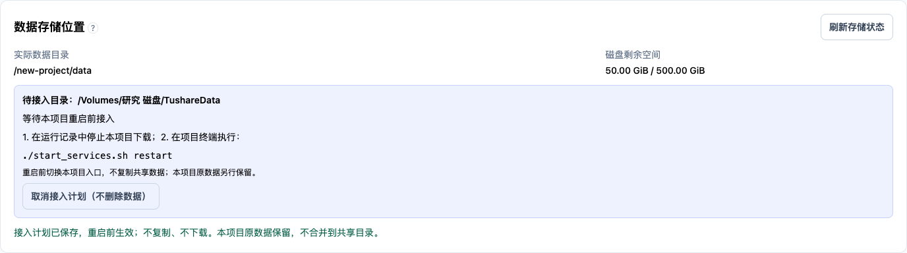

# 指定磁盘数据存储

## 需求与范围

下载占用不仅是最终 Parquet，还包括原始响应、候选批次、分片、检查点、合并临时文件及历史快照。因此本功能迁移整个 `data/` 存储区，而不是仅给最终下载增加一个输出目录。源码、Python/Node 依赖、Numba 编译缓存和 `.run/` 服务日志仍留在项目目录。

每个项目有一个活动数据入口：项目 `data/` 保持为稳定逻辑入口，由受管理的目录软链接指向用户选择的绝对路径。数据区独立于 Git 仓库与 worktree，多个兼容项目可指向同一数据区。沿用已有相对路径、快照 manifest、SQLite 配置、共享配额与锁，不另建下载实现，不修改历史运行 hash、数据日期或 PIT 字段。本地连接配置与迁移事务状态保存在各项目 `.storage/`，磁盘掉线时仍能诊断。

## 数据目录与项目解耦（2026-09-11）

- `StorageManager.guard` 校验存储 ID、格式和挂载，不再校验创建它的项目路径。既有 `{id, project}` 标记原样读取，`project` 仅为旧审计信息，不是访问白名单；活动旧配置无需重写。新迁移使用 `{id, schema_version: 2, state: copying|ready}`，完成全量校验才变成 `ready`。不支持的版本或未完成复制不能接入。格式版本只描述存储元数据协议，不代替各数据集、研究制品及数据库的格式检查。
- 页面区分“将本项目数据迁移到空目录”和“使用已有数据目录（不复制）”。后者只检查已有目录的身份、挂载和格式，确认共用整个数据区（行情、研究定义、运行记录、配置及本地凭据）后保存计划；检查与保存都不改 `data/`。实际接入在本项目重启前离线执行，不搬动目标数据，不重新下载，不改变目录归属。
- 新接入必须使用已登记标记的真实目录；不会把任意非空文件夹自动初始化成数据区。接入时再次核对检查阶段的数据 ID，检查后换盘或掉盘会失败关闭。未经登记的手工符号链接仍会报错，避免启动时悄悄使用另一份数据；应通过接入入口生成本地配置。
- 本项目旧 `data/` 若有内容，保留到 `.storage/backups/<接入操作ID>/data`，不合并到共享区，不删除；Git 跟踪数据仍拒绝移动。接入操作 ID 与共享数据 ID 分开。此类保留数据没有“复制到目标”的校验收据，禁止使用 `cleanup-backup` 当作已验证迁移副本清理，页面也不显示该删除命令。
- 接入的切换意图先落盘；在保留原目录、创建链接之间中断，`startup` 可以继续。进入 `SWITCHING` 后不能取消成原生目录状态；目标不在线时保持失败，不回退备份。当前不新增在线切换、再次跨盘搬迁或自动断开/删除入口。
- API 继续持有项目本地 `.storage/service.lock`，防止运行中改本项目入口；同时持有数据区 `.fund-storage-use.lock` 共享锁，使其他项目能感知该数据区正在使用。离线迁移/最终校验切换/迁移副本清理取得数据区排他锁。接入另一项目只取得目标共享锁，不阻止已有实例读取；保留本项目原目录前还要取得原目录使用排他锁与下载锁。
- `.fund-storage-use.lock` 是运行锁，不进入复制收据或数据清单，不复制其锁状态，不跟随符号链接锁文件。数据区掉线时不得为锁创建不存在的外接目录。
- 下载继续共用同一物理 `.tushare_refresh.lock`；配额继续由同一 `data_sources.sqlite3` 的事务维护。研究 JSON 继续使用数据文件旁的文件锁与原子替换，`AtomicJsonStore` 读写边界增加掉盘校验。并发读取可以进行，冲突下载明确报忙，JSON 的读改写在锁内执行；不能将原子替换本身误当作事务互斥。
- 多实例必须运行支持此协议的版本；“旧配置兼容”不代表未升级的旧进程支持新增共享使用锁。部署升级应先停止旧服务及下载，再统一更新实例。目录可接入也不代表旧 ETL 可以续跑：存储代码属于执行指纹，原有 `ETL_IMPLEMENTATION_CHANGED` 门禁不放宽，不改历史回执、hash 或 PIT 状态。
- 本次仅涉及 I/O、目录检查、锁与任务编排，没有新增数值内核或 NJIT 豁免。必要复制仅是原有搬盘流程；接入已有目录不复制业务数据。

命令行接入（在新项目目录执行）：

```sh
python scripts/manage_data_storage.py attach --path /Volumes/研究磁盘/TushareData
python scripts/manage_data_storage.py attach --path /Volumes/研究磁盘/TushareData --confirm <上一步显示的数据ID>
```

第一次仅检查并显示所需确认 ID；确认后保存计划并尝试离线接入。若本项目服务或下载还在运行，计划保留，停服后执行 `startup` 完成，不强制终止任何进程。页面方式则在确认后按提示运行 `./start_services.sh restart`。

验收覆盖：旧/新标记双项目读取同一快照且标记与 manifest 不改写；独立进程共享读取、存储排他锁、下载互斥、并发 JSON 事务无丢失；掉盘后读写/建锁不重新创建目录；旧配置及旧未完成迁移计划兼容；接入中断恢复、身份变化、未知版本、非本机请求和未确认请求拒绝；320/768/1440 浏览器接入及既有迁移流程。自动化回归全部使用临时数据，另对真实数据盘做只读路径核验；不迁移、不改标记、不下载，具体结果见下述 2026-09-11 验收记录。

## 页面操作

数据下载页新增“数据存储位置”。首次迁移操作如下；接入已有数据目录按上一节执行：

1. 显示实际目录、磁盘剩余空间、在线状态、存储范围与本机副本。
2. 可从已挂载磁盘填入推荐目录，也可输入服务器本机的绝对路径（不是浏览器下载目录）。
3. “检查目录”核验目录边界、可写性、私有文件权限、文件锁、原子替换、剩余空间；短小探测文件使用随机临时目录，自动清除。
4. “保存迁移计划”只保存待生效配置，不移动数据、不终止任务。目标改变后必须重新检查，过期检查不可直接保存。
5. 停止下载后运行 `./start_services.sh restart`：启动后端前执行离线迁移；终端显示扫描、复制、校验、切换进度。独立下载仍持锁时拒绝迁移，不强杀或删锁。
6. 迁移成功后展示旧副本路径与清理命令。复制不等于释放空间；用户确认清理旧副本后才释放本机空间。系统不自动删除原数据。

## 存储安全与迁移事务

- 仅本机请求可修改存储；沿用同源检查和数据源写开关。首次迁移目标必须是不存在或为空的专用目录；接入已有数据区则要求有效身份标记。两种操作均拒绝相对路径、根目录、用户主目录、项目内部以及源目录的父子目录，拒绝符号链接目标。
- 先对目标文件系统做 POSIX 权限/锁/原子替换探测。无法保存 0600 权限的文件系统不接收含凭据的整库迁移；页面明确说明，不伪装成可用。不会格式化磁盘。
- 存储配置记录随机存储身份标记和挂载位置。运行时验证逻辑入口、标记与挂载状态；外接盘缺失或被替换时失败关闭，不自动创建挂载目录、不回退本机旧副本。
- 保存计划允许下载仍在进行；实际迁移必须持有项目级及数据区存储排他锁和现有下载锁。API 整个生命周期同时持有本项目与数据区的共享使用锁，防止运行中切换；启动脚本先停 API，下载独立执行器的锁另行核验。
- 扫描源树（仅目录和普通文件），排除迁移器自己的身份标记。拒绝内部软链接和特殊文件。以磁盘上完整大小检查容量并保留安全余量。
- 复制到目标旁的私有暂存目录，逐文件流式计算 SHA-256、复制、fsync、保留 mtime/权限，并重新读取目标校验。断电后可重复执行：仅复用校验一致的已复制文件，不重新下载。临时文件不会成为活动数据。
- 复制全部完成并再次核验源清单，写入校验收据。将原 `data/` 重命名为 `.storage/backups/<迁移ID>/data`，然后切换稳定入口；记录事务阶段，以便进程中断后继续完成切换。任何复制/容量/校验错误保留原入口与原数据。
- 本期支持从项目原生 `data/` 首次迁移至一个指定目录；不支持将已经迁移的数据区再次跨盘搬迁。原因是历史任务中可能持有物理绝对路径，不能为了搬盘篡改不可变回执。再次搬盘需要独立的路径兼容迁移设计，页面/API 明确拒绝，不提供不安全切换。
- 旧副本清理为显式离线命令：只允许删除本次迁移器登记的副本，确认活动入口、目标身份和成功迁移收据，拒绝任何用户自填删除路径。删除不可恢复，执行前显示目标及要求确认迁移 ID。
- `data/` 中若存在 Git 跟踪文件（例如版本化测试夹具），先拒绝迁移，要求将源码/夹具与运行数据分离；不会把 Git 跟踪文件藏到软链接下。本工作区检查时没有 Git 跟踪的 `data/` 文件。

## 接口与运维

- `GET /api/data-storage`：状态、挂载磁盘、待迁移计划、进度和备份。
- `POST /api/data-storage/probe`：检查候选路径，不保存配置。
- `PUT /api/data-storage/plan`：乐观修订校验、重新探测并保存待迁移计划。
- `DELETE /api/data-storage/plan`：取消尚未执行的计划；不删除暂存或源数据。
- `POST /api/data-storage/existing/probe`：检查已有数据区，返回 ID、实际路径和挂载；不修改业务数据。
- `PUT /api/data-storage/existing/plan`：携带 `path`、`expected_revision`、`expected_id`、`confirm=true` 保存接入计划，重启前生效。
- `python scripts/manage_data_storage.py startup`：有计划则离线迁移，无计划则检查活动盘；失败时启动脚本不得继续启动后端。
- `python scripts/manage_data_storage.py status`：无需启动计算服务即可排障。
- `python scripts/manage_data_storage.py cleanup-backup --confirm <迁移ID>`：成功切换后按明确 ID 删除原本机副本。
- 日常使用启动脚本包装，自动选用项目 Python：`./start_services.sh storage-status`、`./start_services.sh storage-cleanup <迁移ID>`。离线复制失败但还没切换时，可 `./start_services.sh storage-cancel <迁移ID>` 取消计划后恢复原数据服务；已进入切换阶段只能重试完成，不能直接取消。

## 下载与研究联动

SourceStore、下载请求边界、原子状态写、Parquet 输出和市场快照读取增加存储检查。API 磁盘不可用时返回明确 503，存储状态接口保留诊断入口。读取路径仍由原有 manifest 决定；磁盘配置不能把未发布候选当作正式数据。

迁移不发起供应商请求，Tushare 限频、权限、超时、重试和数据契约不变；跨日期下载警告继续保留。只涉及 I/O、配置校验及编排，不新增金融数学计算或 NJIT 豁免。

## 验收

覆盖首次空库/已有数据迁移、含空格中文路径、目标非空/路径逃逸/内部软链接拒绝、容量不足、只读/权限不符、下载锁和 API 锁互斥、复制异常/校验异常、断点重跑与切换中断恢复、掉线不创建目录不回退、清理仅限登记副本、源/目标内容与 mtime 一致、历史相对制品校验、快照读取与新下载写入外部目录。所有回归使用临时目录和离线模拟；真实外接盘迁移须由用户明确选择目标后执行。

### 2026-09-11 解耦验收记录

浏览器验收截图（模拟数据，非正式磁盘状态）：



- 后端相关回归 191 项通过（`test_data_storage.py`、`test_market_data.py`、`test_etl_executor.py`、`test_tushare_data_script.py`、`test_custom_indicator_service.py`），用时 202.76 秒；仅有一条 Starlette TestClient 依赖弃用警告。使用临时数据目录和网络/正式数据写入防护，不代表全仓后端测试已运行。
- 四项指定场景均通过：两个项目使用同一物理目录；独立进程下载互斥且两个 JSON 写进程合计 50 次事务无丢失；掉盘后读取、写入和建锁失败关闭且不重建目录；旧活动配置、旧身份标记及旧未完成迁移计划继续可用。另覆盖真实应用 lifespan 持锁、CLI 接入、接入中断恢复、身份/格式变化拒绝，以及空间不足时可读但禁止写入。
- 前端全量 120 个测试文件、885 项通过；存储及数据管理专项 13 项通过。浏览器模拟 API 的接入与原有迁移流程在 320 / 768 / 1440 三种宽度下共 6 项通过；TypeScript 检查、生产构建和 i18n 检查通过。
- 代码自审核、选定 Ruff 错误规则、`git diff --check`、AI Hermes 完整路由校验通过；本次 14 个变更文件均被路由覆盖。下载契约文档同步完成，未修改供应商接口、配额或下载脚本，未发起真实供应商请求。
- 实盘仅做只读核验：当前项目与临时项目使用同一份旧配置，均解析到 `/Volumes/SdCard/TushareData`；正式配置、身份标记及活跃快照 manifest 的前后 SHA-256 一致。没有获取正式存储锁、拔盘或修改业务文件；掉盘验证使用临时文件系统模拟。
- 本轮没有重启正式前后端、替换项目目录、删除 worktree、提交或推送代码。测试用前端服务已退出；验收通过不等于现有运行进程已经升级。

### 2026-09-08 实测记录

- 存储后端专项 30 项通过；加上下载、ETL、快照、市场读取等相关回归，本轮累计 406 项通过。沙箱无法绑定本机 socket 的 3 项已在本机权限下复跑所在执行器测试文件，15 项全部通过；不是跳过失败测试。
- 存储及数据管理相关前端 61 项通过；前端构建通过。Playwright 在 320 / 768 / 1440 三种宽度下均通过选择磁盘、目录检查、键盘确认、保存计划、掉线禁止提交和无横向溢出验收。浏览器验收使用模拟接口，不会迁移真实数据。
- 全量前端为 667 项通过、1 项失败。失败位于 `ClassAllocation.test.tsx` 的“策略回测携带精确的正式历史情景发布引用”，选项 `regime-run-1|regime-publication-1` 不存在；单独复跑该文件仍为 6 通过 / 1 失败。本功能没有修改该页面或测试，不将全量套件报告为通过，也不在存储任务中改动该业务。
- 本机 `./start_services.sh restart` 成功，包含约 252 秒的启动及 Numba/worker 预热；脚本明确打印 `启动成功 / SUCCESS`。实际 `http://127.0.0.1:5173/api/data-storage` 返回在线、原目录、容量及已挂载磁盘，`active=null`、`pending=null`；真实页面已加载新面板。
- 本轮按 Tushare 技能进行了最多 1 次真实请求，输出仅在临时目录，未发布；存储保护依赖的脚本哈希前后一致，结果详见 `TushareDownload.md`。修改前后未改变供应商配额。
- 路由覆盖检查和 `validate_ai_routing.py --skip-reproducibility` 通过。完整 Git 可复现性检查仍因本工作区大量尚未跟踪的新文件阻断；未擅自暂存或提交用户文件。
- 上述功能开发验收基于临时文件系统，未执行真实外接盘搬迁；随后用户明确指定目标后执行了下述实际迁移。不能由可用容量推断文件系统能力。

### 2026-09-08 用户指定磁盘的实际迁移

- 目标：`/Volumes/SdCard/TushareData`；迁移 ID：`07fbdca707404b90a740593a3c1978b3`。目标实际通过权限、锁、原子写及空间探测，没有格式化或改变磁盘设置。
- 停止本项目 API/前端及同项目残留的 8011 测试 API 后离线操作；开始时没有活跃下载进程。完整复制并核验 681,485 个文件、42,383,481,859 字节，迁移工具退出码为 0，输出 `存储迁移成功 / SUCCESS`。
- 项目 `data/` 保留为逻辑入口，实际指向外接盘；配置 `active.target` 为指定目录、`pending=null`。原始响应、检查点、候选、SQLite 和快照全部随数据区迁移，不改历史数据日期或运行指纹。
- 除全量文件 SHA-256 和源/目标清单校验外，外接盘数据库 `quick_check` 为 `ok`，活跃 manifest 哈希与迁移前一致，28 个声明的 Parquet 元数据可读。校验收据及文件清单保留在 `.storage/migrations/`。
- 旧下载本身已有单日持仓触顶错误，且执行版本与当前代码不一致；数据搬迁与下载故障恢复是两个独立状态，不能因目录切换成功就显示下载成功。
- 使用 `./start_services.sh storage-cleanup 07fbdca707404b90a740593a3c1978b3` 校验并删除精确登记的本机旧副本，命令退出码为 0；配置修订 3、`backup_removed=true`。外接盘完整数据保留。本机可用空间由操作前 15,346,163,712 字节增至清理完成时 45,003,370,496 字节；这是当时文件系统读数，不是承诺释放全部逻辑文件大小。
- 本次运维后的文档契约专项及两份变更文档的路由覆盖检查通过。补跑 `test_tushare_data_script.py` 为 63 通过 / 3 失败：三个 `test_manual_cli_*` 测试经 `configuration_fingerprint()` 访问真实 SourceStore，在对外接盘数据库设置权限时被沙箱拒绝（`PermissionError`）。没有为测试放开正式数据写权限，也没有将全文件回归报告为通过；后续需隔离这些测试的配置根目录。
- `./start_services.sh start` 退出码 0，286 秒后打印 `启动成功 / SUCCESS`；主后端 8000、前端 5173 均恢复，Numba/worker 预热完成。前端代理的存储状态接口确认外接盘在线、实际目录正确、无待迁移计划；原 8011 测试服务未另行启动。
- 通过正式 `POST /api/data-sources/etl/runs/ffade99dcd59477c80075e4adace7f3d/resume` 尝试恢复，返回 409 / `ETL_IMPLEMENTATION_CHANGED`。下载未启动，原始检查点保留。单日 `20260331-20260331_011869.OF` 的 SPLIT 回执也不能通过当前安全迁移检查；没有改写运行指纹、跳过失败分片或启动重复全量任务。
