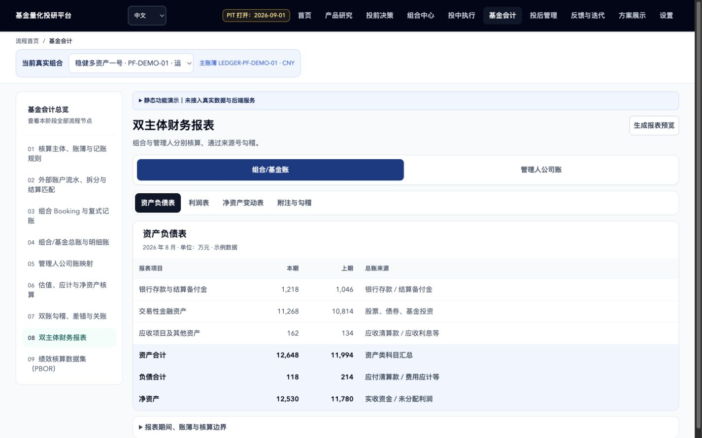

# 前端设计与指标诊断变更说明

本次将已有前端优化、设计规范和指标无数据说明整合为同一提交。提交版本、实际测试结果和独立 AI 审核状态以对应 PR 的最新记录为准。

## 需求与范围

- 设计要求见 [前端设计规范](frontend-design-guidelines.md)：统一界面令牌、提高文字可读性，保留资产分类语义色及分段边界。
- 提交要求见 [AI 提交规范](../branch_submission_rules.md)：开发分支通过 PR 进入 `Dev`，三个门禁成功后才可合并。
- 指标数据说明见 [指标设计文档](custom_indicator_design.md#无数据时的日期说明)：区分成立日期、本地数据覆盖、公告时点和无有效结果。

## 最终交互

- 子页面使用紧凑阶段上下文。宽度达到 1280px 时显示常驻导航，窄屏展开导航支持 Escape 关闭及焦点恢复。
- 财务报表将主体数据提前；长说明折叠，静态演示提示保留，移动端行名固定、金额右对齐并提示横向滚动。
- 指标及历史情景工作台在 1280px 以下通过页签切换工作区域，表单根据可用宽度排列。
- 数据目录将搜索放在概览之前；英文首页删除重复标签，覆盖桌面布局临界宽度。
- 图表分类颜色与界面强调色独立，堆叠条增加分隔线，图例提供对应色块。
- 共享 UI 与装饰性吉祥物遵守设计规范中的状态、尺寸和禁用位置要求。
- 指标不可用状态可展开输入日期背景，不将数据起点冒充成立日期，不用解释性元数据放宽 PIT 过滤。

## 验证范围

- 前端完整 Vitest、TypeScript、生产构建、国际化检查和静态设计检查。
- 83 条注册路由在 320、768、1440px 下检查初始可见文本对比度；正常数据下的首页、报表、指标及情景工作台、数据目录另外使用固定夹具验证交互。
- 日期诊断使用临时 Parquet 夹具覆盖成立前、数据起点前、尚未公告、缺失公告日期和有效前身历史；比较单产品与批量路径，并检查展示上下文无需再次读取数据。
- 对比度工具是预警工具，未覆盖背景图片、遮挡和滤镜，不代表完整 WCAG 认证。构建大包和静态设计检查中保留的历史预算仍是已知限制。
- 页面截图来自本地固定夹具，不构成真实业务数据、正式发布或部署验收。

## 视觉样例

这些样例于 2026-09-12 生成。提交准备时已比较上轮视觉验证的前端文件哈希，相关源码未变化。

### 移动端报表

### 桌面报表

### 平板指标表单

### 1251px 英文首页

