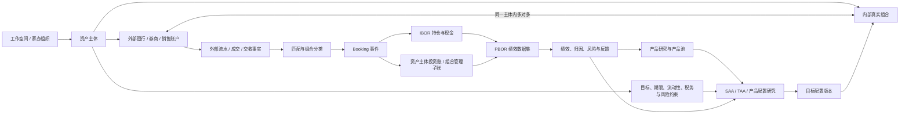
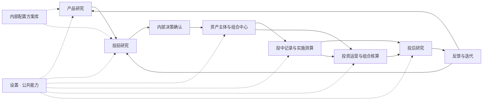

# 资产配置投研与组合管理平台前端功能蓝图

本文定义平台的目标定位、领域结构、功能范围、流程框架和现有设计迁移方向。术语以根目录 [CONTEXT.md](../CONTEXT.md) 为准；账户、组合、分摊与核算的字段级设计见 [资产主体、账户、组合分摊与投资核算详细设计](./account-portfolio-allocation-accounting-design.md)。

## 1. 产品定位

本平台面向个人、企业和家族办公室等资产所有者，用于内部完成公募基金、ETF 等产品研究，自上而下设计资产配置方案，并对自有真实组合进行账户汇总、交易记录、投资核算、绩效与风险研究。

平台的核心不是“生产并管理一只对外募集的基金”，而是回答五个内部问题：

1. 我们拥有或管理哪些资产主体、外部账户和真实组合？
2. 哪些产品值得进入可投资产品池？
3. 每个资产主体在自身目标和约束下应该研究怎样的长期与战术配置？
4. 外部账户实际发生了什么，如何准确分配到内部组合并形成可复核账、持仓和绩效？
5. 实际结果与研究假设为何不同，下一轮如何更新产品池、模型和组合？

### 1.1 明确不做

- 不做公募基金设立、募集、备案、份额登记、投资者名册和客户申购赎回。
- 不做管理人公司管理费计提、应收管理费、销售佣金或对外收费管理。
- 不做基金管理人法定基金会计、托管估值、监管报送或公募基金法定三表替代系统。
- 不做客户 CRM、代销、渠道、路演、公开业绩营销和 GIPS 合规展示。
- 不连接交易通道，不提供下单、委托提交、撤单或自动交易。
- 不输出“买什么”的投资建议；只提供研究、记录、计算、比较和内部决策材料。

底层公募基金的管理人、基金经理、托管人、费率、持仓披露等仍属于产品研究数据，不因上述边界而删除。

## 2. 目标用户

| 角色 | 核心职责 | 平台应支持 |
| --- | --- | --- |
| 个人资产所有者 | 明确目标、流动性和风险边界，查看自有资产全貌 | 目标组合、账户汇总、配置研究、现金流与绩效 |
| 企业资金与投资团队 | 在安全性、流动性和收益性约束下管理自有资金 | 主体级投资政策、流动性分层、账户与组合、核算导出、内部报告 |
| 家族办公室 / 家族投资团队 | 管理多个个人、公司或持有实体的资产 | 多主体所有权结构、跨机构聚合、主体与家庭汇总、精细权限和审计 |
| 量化研究员 | 研究产品、资产配置、信号和稳健性 | PIT 数据、指标、产品池、SAA/TAA、回测、情景与归因 |
| 组合责任人 | 管理内部真实组合及其目标偏离 | 组合主档、目标版本、持仓、现金、再平衡测算和复盘 |
| 投资运营 / 核算人员 | 汇总外部账户事实并保证可追溯 | 导入、匹配、分摊、Booking、对账、凭证、关账和例外处理 |
| 系统管理员 | 维护数据、权限和公共计算能力 | 数据质量、权限、审计、模型和规则版本、备份与安全 |

## 3. 核心领域结构



### 3.1 两级核算而非“两家公司的两套账”

默认结构是：

```text
资产主体投资账 / 主体汇总账
        ↕ 按来源、账户、组合和期间勾稽
组合管理子账（portfolio_id 管理维度）
```

资产主体是会计与所有权边界；组合是投资管理和绩效边界。企业主体需要将投资分录映射或导出到公司总账，个人和家族主体则可使用投资辅助账与汇总报表。只有组合自身确为独立法律或会计主体时，才另建独立法定账套。

## 4. 整体信息架构

主页主流程仍采用研究与真实投资闭环，但增加“资产主体与组合中心”和“投资运营与组合核算”两个持续能力：



### 4.1 一级功能区

1. **产品研究**：市场概览、产品详情与对比、指标评价、持仓与风格研究、产品池及版本。
2. **投前研究**：资产主体目标与约束、产品池选择、SAA、TAA、产品配置与择时、组合合成和稳健性验证。
3. **资产主体与组合中心**：资产主体、所有权层级、外部账户、真实组合、账户—组合关系、内部责任人与目标版本。
4. **投中记录与实施测算**：目标与实际差异、交易计划测算、前置检查、外部成交录入、分摊、交收与再平衡记录。
5. **投资运营与组合核算**：数据接入、匹配、Booking、IBOR、资产主体投资账、组合管理子账、对账、关账和报表。
6. **投后研究**：实际组合数据、TWR/MWR/XIRR、业绩与风险归因、持仓监控、情景压力和内部报告。
7. **反馈与迭代**：研究假设复盘、产品复审、模型更新、版本比较和流程改进。
8. **内部配置方案库**：冻结并复用研究方案，比较模型版本，不用于对外展示或销售。
9. **设置 · 公共能力**：数据、PIT、研究口径与参数、指标与模型、情景算法、统一回测、账户映射、科目与政策、权限和系统参数。

## 5. 目标功能清单

### 5.1 必须具备（Must）

| 能力 | 目标功能 |
| --- | --- |
| 资产主体主数据 | 支持个人、企业、家族持有实体；记录本位币、会计/税务口径、有效期、敏感级别和内部责任人 |
| 所有权与汇总视图 | 家办可维护主体间关系和持有比例，分别查看个人、主体、家庭或工作空间汇总，避免重复统计 |
| 外部账户聚合 | 银行、券商、基金销售账户主档；账户归属、币种、用途、接入方式和余额/流水对账 |
| 真实组合管理 | 按目标、策略或资金用途建立内部组合；关联资产主体、账户、责任人、目标版本和有效期 |
| 产品研究与产品池 | ETF/公募基金检索、详情、对比、评价、持仓与风格、准入规则、产品池版本和生命周期 |
| 配置研究 | 目标与约束、SAA、TAA、类内产品配置、回测、情景、成本、容量与稳健性检验 |
| 真实事实接入 | Excel/CSV 手工导入及未来机构接口；保留原始文件、批次、行号、来源账户和数据血缘 |
| 交易匹配与分摊 | 同一账户成交分配给多个内部组合；守恒校验、待认领池、分摊版本和冲销重做 |
| Booking 与投资核算 | 标准业务事件、交易日/确认日/会计日/价值日/交收日、复式凭证、科目映射和政策版本 |
| 两级账与三本记录 | IBOR 持仓现金、资产主体投资账/公司总账接口、组合管理子账、PBOR 冻结绩效数据 |
| 对账与关账 | 现金、持仓、成交、费用和估值对账；差异队列、复核、期间锁定、重开和审计日志 |
| 绩效与归因 | 基于真实现金流和估值计算 TWR、MWR/XIRR；外部现金流分类、收益/风险/配置归因和目标偏离 |
| 多币种 | 原币、本位币、汇率来源与日期，支持币种收益拆分和跨账户汇总 |
| 安全与治理 | 细粒度权限、职责分离、敏感字段保护、操作审计、版本冻结、备份恢复和导出水印 |

### 5.2 应该具备（Should）

- 目标/负债/流动性分层，将未来现金需求映射到短期流动性组合和长期增长组合。
- 企业资金的安全性—流动性—收益性约束、现金流预测和投资政策校验。
- 税务批次、持有期、已实现损益和税后绩效研究，但不替代纳税申报。
- 底层基金持仓穿透；披露滞后时使用带日期、模型版本和置信度的风格代理。
- 跨账户转账和跨组合内部划转匹配，防止主体汇总与绩效重复计算。
- 内部决策记录、研究意见、附件、复核人与生效版本；不把它包装为外部基金审批。
- 私密报告按资产主体、组合、账户、资产类别、产品和责任人切片。

### 5.3 可以后续建设（Could）

- 私募股权、非上市股权、不动产等低频估值资产及承诺资本/资本调用。
- 受控的银行、券商和托管机构自动数据连接。
- 企业 ERP/总账凭证导出适配器，以及家办会计或税务软件对接。
- 现金流情景预测、目标达成概率和资产负债联动研究。
- 文档 OCR 与半自动流水识别，但必须保留人工复核和原始证据。

### 5.4 明确不建设（Won't）

- 基金产品法律设立、募集、持有人份额、TA、托管估值替代和监管报送。
- 平台运营方的管理费收入、应收账款、销售佣金和客户收费。
- 客户关系、渠道销售、产品发行和对外营销材料。
- 交易路由、自动下单、撤单和券商柜台替代。
- GIPS Composite 管理和合规展示；GIPS 只作为现金流与收益率方法参考。

## 6. 投研流程

### 6.1 产品研究

产品研究是持续运行的可复用能力，不因每次投资而重做。它引用设置中已发布的研究口径与参数模板，并形成带 PIT 数据快照、评价模型和准入原因的产品池版本，供多个资产主体和研究组合使用。基准、无风险利率、数据处理和通用计算口径不在产品研究内重复维护；研究任务启动时冻结所引用的模板版本。

### 6.2 投前研究

投前研究必须先选择资产主体或目标模板，因为个人、企业和家族实体的期限、税务、流动性及可投资范围不同。

- SAA：形成长期大类权重、上下限和再平衡政策。
- TAA：在 SAA 约束内研究短期大类偏离。
- 产品配置与择时：在大类预算内选择和轮换具体产品。
- 输出：研究组合、目标配置版本、回测与风险材料；不输出投资建议或代替决策。

### 6.3 实盘组合建档

内部确认后，在资产主体与组合中心创建真实组合，绑定资产主体、外部账户、目标版本、责任人和生效日。它只是内部管理主档，不是新基金或新法人。

### 6.4 投中记录与核算

平台可测算目标交易，但真实交易发生在外部银行、券商或销售机构。成交回流后按“外部事实 → 匹配 → 组合分摊 → Booking → 持仓/凭证”的顺序处理。

### 6.5 投后研究

投后以已核对的事实为准，比较实际组合与目标配置，解释收益、风险、现金流、费用、交易时点和产品选择的贡献。TWR 用于尽量剥离资产主体资金进出的影响，MWR/XIRR 用于反映真实资金时点体验，两者并列展示而不互相替代。

## 7. 当前设计与目标设计差异

| 当前设计 | 问题 | 目标设计 |
| --- | --- | --- |
| 以公募 FOF 管理人、基金/专户为默认主体 | 与个人、企业、家办自有资产场景不符 | 以资产主体为所有权和核算边界 |
| “组合账 + 管理人公司账”并列 | 错把内部组合当独立基金，又虚构管理费收入 | 资产主体投资账 + 组合管理子账；独立主体例外处理 |
| 基金经理任职、投资单元分工 | 混淆内部责任人与外部基金经理 | 改为投资责任人/组合责任人；外部基金经理只留在产品研究 |
| 基金法律设立、募集、开户与启用 | 平台并不建设或运营基金 | 改为实盘组合建档、内部授权和账户关联 |
| 客户申购赎回、持有人资金 | 自有资产没有外部客户份额体系 | 改为资产主体资金划入/划出；底层基金申赎仍为投资交易 |
| 管理费计提与应收管理费 | 资产主体是费用承担者，不是管理费收取者 | 记录底层产品费率、账户费用和直接投资费用 |
| 公平交易与合规分配 | 带有公募管理人的监管语义 | 改为合并指令与成交分摊，强调守恒、版本和内部审计 |
| GIPS Composite 与对外组合展示 | 平台不做对外业绩营销 | 改为内部配置方案库和组合比较 |
| 法定基金三表 | 平台不替代基金会计和托管人 | 企业主体支持投资分录/总账接口；组合提供管理报表 |
| 只有真实组合，没有上层所有者模型 | 无法正确处理多主体、多账户和家办汇总 | 增加资产主体、所有权层级、账户归属和汇总视角 |
| 静态页面大量“说明卡片” | 容易被误认成可操作功能 | 说明内容收敛为页首帮助；功能区只呈现真实表单、表格、操作和状态 |

## 8. 当前前端迁移建议

| 当前模块 / 路由 | 调整后名称与归属 | 处理 |
| --- | --- | --- |
| 产品总览、详情、对比、评价方案 | 产品研究 | 保留真实功能，补产品池和穿透研究 |
| 研究框架与数据基础 | 设置 / 研究口径与参数中心 | 从产品研究移出；集中维护公共模板，业务页面只选择并冻结版本 |
| 手工配置、大类资产配置 | 投前研究 / SAA | 保留真实功能，增加资产主体目标与约束上下文 |
| 当前产品组合构建 | 投前研究 / 产品配置与择时 | 保留半成品能力，明确类内产品分配边界 |
| 持仓诊断 | 投后研究 / 组合诊断 | 从研究组合与真实组合两个入口调用并明确数据口径 |
| Portfolio Center | 资产主体与组合中心 | 在组合之上新增资产主体和所有权结构；移除基金法律信息 |
| Portfolio Onboarding | 实盘组合建档与启用 | 删除募集、备案、基金合同等含义 |
| Trade Allocation | 外部成交匹配与组合分摊 | 删除公募“公平交易”宣传，保留守恒、规则、复核与审计 |
| Fund Accounting | 投资运营与组合核算 | 重构为外部事实、Booking、主体投资账、组合子账、IBOR/ABOR/PBOR |
| Manager Ledger | 企业总账映射 / 主体汇总账 | 不再作为“管理人公司账”；按资产主体类型按需出现 |
| Financial Statements | 主体投资报表与组合管理报表 | 不默认生成法定基金三表 |
| Portfolio Solutions / Showcase | 内部配置方案库 | 删除客户、渠道、对外展示和营销语义 |
| 指标中心、数据下载、研究参数、情景算法、回测中心 | 设置 · 公共能力 | 保留并作为各业务页面的场景化依赖 |

旧地址可继续重定向，但页面标题、描述、字段和示例数据必须使用新领域语言。

## 9. 分阶段落地

### 第一阶段：纠偏与主数据

1. 统一平台命名和非目标范围。
2. 建立资产主体、外部账户、真实组合及其关系。
3. 修改静态页面中的基金公司、管理费、募集、客户和对外展示语义。
4. 保留已有产品研究、指标、SAA 和回测真实功能。

### 第二阶段：真实事实与组合账

1. 导入模板、原始批次和待认领池。
2. 外部账户成交匹配和组合分摊。
3. Booking 事件、IBOR 持仓现金和组合管理子账。
4. 现金、持仓、成交和估值对账。

### 第三阶段：主体核算与绩效

1. 企业主体科目映射和总账导出；个人/家族主体汇总账。
2. PBOR 冻结、TWR、MWR/XIRR、费用与汇率口径。
3. 收益归因、风险归因、目标偏离和内部报告。
4. 多主体所有权汇总、细粒度权限与审计。

## 10. 研究依据

- [CFA Institute：Basics of Portfolio Planning and Construction](https://www.cfainstitute.org/insights/professional-learning/refresher-readings/2026/basics-of-portfolio-planning-and-construction)：IPS 应连接目标、风险和约束，SAA、允许偏离和再平衡政策需要明确。
- [CFA Institute：Asset Allocation with Real-World Constraints](https://www.cfainstitute.org/insights/professional-learning/refresher-readings/2026/asset-allocation-with-real-world-constraints)：资产规模、期限、流动性、税务和治理能力会改变资产配置；TAA 是相对 SAA 的短期偏离。
- [CFA Institute：Principles of Asset Allocation](https://www.cfainstitute.org/insights/professional-learning/refresher-readings/2026/principles-asset-allocation)：长期 SAA 与投资工具选择的复核频率不同，支持产品研究、配置研究和实盘管理分层。
- [GIPS Standards Handbook for Asset Owners](https://www.gipsstandards.org/standards/gips-standards-for-asset-owners/gips-standards-handbook-for-asset-owners/)：用于 TWR、MWR 和外部现金流的方法参考，不代表本平台实施 GIPS 合规。
- [IFRS Foundation：IFRS 9 Financial Instruments](https://www.ifrs.org/issued-standards/list-of-standards/ifrs-9-financial-instruments/)：金融资产和负债由成为合同一方的实体确认，支持以资产主体为会计边界；具体准则须按主体所在地和适用制度确认。
- [Deloitte：Family Office Handbook](https://www.deloitte.com/uk/en/services/deloitte-private/perspectives/family-office-handbook.html)：家办是管理家庭财务事务的私有组织，投资、运营、治理、风险和技术能力需要统一考虑。
- [Deloitte：Family Office Technology—Information Management](https://www.deloitte.com/us/en/services/deloitte-private/articles/family-office-technology.html)：跨银行、托管人与历史表格的数据应清洗整合为可用于分析和决策的单一事实来源。
- [Addepar：Family Office Software](https://addepar.com/family-office-software/)：家办场景需要多层所有权结构、跨银行与托管数据，以及个人、实体和家庭层级的穿透汇总。
- [Association of Corporate Treasurers：Global Guide to Investing Cash](https://www.treasurers.org/node/369243)：企业自有资金投资需以投资政策和现金流预测为基础，优先平衡安全性、流动性和收益性。
- [BlackRock Aladdin Accounting](https://www.blackrock.com/aladdin/platforms/products/aladdin-accounting)：IBOR、ABOR、PBOR 共用数据语言并向总账输出分录，可作为投资运营与核算架构参考。

以上资料用于定义通用业务架构，不替代个人、企业或家族实体所在地的会计、税务、法律和数据保护要求。
