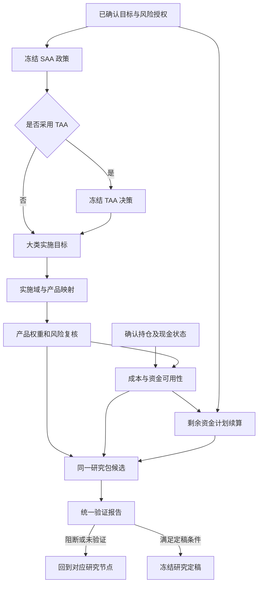

# 产品实施、统一验证与研究定稿

本页是投前下游的主要入口，覆盖“产品与资金 → 证据汇总 → 锁定候选验证 → 研究定稿”。[投前总览](README.md)负责上游，详细现金模型见[资金契约](funding.md)。

基础实现已经接通冻结 SAA／可选 TAA、后置映射、Q 与 Beta 分离、联合残差风险、成本和剩余月份续算。下列对象名是领域职责，不要求每项有独立数据库或页面。

## 当前范围

研究包保存不可变输入、数组、来源、代码／环境指纹；验证绑定候选 hash，定稿追加事件。支持声明同月结算条件下的 ETF／现金路径、费率敏感性和已发布情景。静态产品回放不能称为完整动态 TAA 执行。

模式 B 的产品联合 QCQP、完整实际交收／容量、基金未来费率和认证独立审批未由基础实现覆盖。下列“后续”条款保留为扩展边界，不作为当前完成声明。
## 统一主链与最小数据对象



这是目标链路；基础版现已接通，逐产品路径、执行日历与机构审批的适用边界见开发验收。TAA 可选，不能要求纯 SAA 用户构造虚假的零偏离 TAA ID。

| 对象 | 必须锁定的内容 | 复用边界 |
|---|---|---|
| `ImplementationPlanVersion` | SAA／TAA 来源及 hash、目标大类权重、实施域／映射、Q、产品权重、方法、风险／费用引用 | 新来源契约；现有 `kind=taa` 记录保留原义，通过薄适配进入共同校验 |
| `ProductRiskEvidenceVersion` | 产品／代理轴、B、残差协方差、交叉协方差假设、样本切分、数据与算法 hash、适用期限 | 扩展现有风险模型产物；不另建同义 OLS 引擎 |
| `CostSpecVersion` | 产品与渠道、买卖／申赎费、持有期条件、费用覆盖关系、估计来源／日期、模型限制 | 静态假设、产品条款和真实校准三种证据等级分开 |
| `FundingStateVersion` | 确认时点、持仓市值、可用／受限现金、应收应付、余额口径、支付核对、剩余目标 | 研究态人工确认／文件导入可先落地，不依赖尚未完成的账户原型 |
| `ValidationReportVersion` | 被评估候选 hash、规则版本、逐项结果、执行证据、数据／模型适用性 | 编排已有数值能力；不保存另一套指标计算真相 |
| `ResearchPackageVersion` | 全部精确依赖、验证报告、研究意见、限制、定稿记录与有效性事件 | 复用受控存储、不可变数组、hash、幂等及锁，不新建微服务平台 |

这些是领域契约，不要求每项建立独立数据库或页面。首版可由一个研究包 manifest 引用现有 artifact，并增加少量必要子产物。

## 产品实施风险：预算与暴露必须分开

### 两种矩阵及数据门禁

设 N 个大类、K 个产品，产品权重 `x∈R^K`、目标大类权重 `w∈R^N`。

- `Q∈R^(N×K)`：类别资金归属，首版每列一个 1，满足 `Qx=w`、`x≥0`。现金是明确的实施项；无法映射的大类显示缺口，不偷偷再分配。
- `B∈R^(K×N)`：产品对代理收益的联合统计暴露。实际暴露是 `B' x`，可以与 `Qx` 不同，不能把 Beta 归一化后当作资本归属。
- 多大类主动产品在首版只有可靠穿透证据才能进入对应扩展；否则保存待研究状态。产品杠杆／反向条款单独准入，长仓权重不证明底层无杠杆。

风险数据采用同币种、同收益语义、同频率、共同日期轴；锁定训练／验证窗口、RF、复权和费用覆盖。基础回归使用同一组代理做联合回归；现金常量不与截距一起作为不可识别因子。零方差、秩不足、样本缺口、严重共线性应返回原因，不静默正则化。

现有风险模型允许各输出有样本有效性差异，因此生成产品间残差协方差时必须新增共同有效样本门禁。不能将不同日期估计的残差方差／相关性直接拼成“联合模型”。留出系数与发布后重估系数分开保存，重估后的样本内指标不替代原留出证据。

### 风险传导及逐模型验收

以同期间超额收益表示：`rP-rf = α + B(rA-rf) + ε`。在明确采用因子—残差零交叉协方差假设时，每个 CMA m 对应：

```text
ΣP_m = B ΣA_m B' + Σε
σP_m² = x' ΣP_m x
TE_to_SAA_m² = (B'x - wSAA)' ΣA_m (B'x - wSAA) + x' Σε x
```

需要同时报告相对 SAA 的总主动风险和相对当前 TAA 目标的实施跟踪风险，分别绑定阈值，避免 TAA 和产品层各自通过却累积超出总体风险预算。

`Σε` 必须包含跨产品残差协方差。若使用 `D_m=Cov(rA,ε)`，则联合矩阵 `[[ΣA_m,D_m],[D_m',Σε_m]]` 须逐模型 PSD；产品风险还包括 `B D_m + D_m' B'`。不能把历史 D 原样配到任意前瞻 CMA 后默认仍有效。基础版可采用经说明与稳定性验证的 `D=0` 假设，但必须记录这是模型假设；明显失效时阻断相应应用结论。

风险假设还须声明 B、残差协方差的适用 horizon；短窗历史残差平稳延展至长期本身是待验证假设。对系统性遗漏、残差相关上升、暴露漂移分别压力测试，不靠任意统一“风险乘 1.2”替代证据。

| SAA 模式 | 产品验收主依据 | 原模型结果 |
|---|---|---|
| single | 该冻结 CMA 经产品桥接后的风险与收益 | 同一模型 |
| A：参数平均 | 冻结融合矩，经同一风险桥接后验收 | 逐模型保留诊断；不擅自升级成全部硬门禁，不添加模型间分歧协方差 |
| B：共同兼容 | 每个原始 CMA 都检查产品风险、必要收益及适用资金条件 | 每项都必须有结果，展示用平均矩不得放行 |

产品前瞻收益默认不预测历史回归 alpha。`zero_active_premium` 表示不假设主动超额增益；可另计有证据的跟踪差／增量费率，但不得重复扣 NAV／代理已含费用。没有可辩护的收益桥接时，允许风险报告完整、收益或资金部分 `unavailable`，不能补零后宣称全部验证。

一个可复核反例：两只产品各占 50%，都归同一大类且 Beta=1.2；大类波动 10%，两产品残差波动均 5%、残差完全相关。资金预算完全匹配，实际组合波动却为 `sqrt(0.12²+0.05²)=13%`。忽略残差相关会错报约 12.51%；只看大类则错报 10%。

### 配置方法与求解边界

首个可用版本先让现有手动／类内配置经过统一风险门禁，再提供类别预算 QP：在共同历史联合风险下最小化产品相对目标的 TE，加显式交易成本惩罚，受 Qx、产品限额、现金和准入约束。成本惩罚系数的风险／收益单位与评价期限必须记录，不能直接把“年方差＋人民币成本”相加。

复用 [qp_numba.py](../../backend/qp_numba.py) 的多等式、秩处理和矩阵 QP。Qx 已隐含总预算时移除冗余等式，但须验证一致性。该内核要求可行初值；实施域无产品、产品上限合计不足、现金不足等应先形成可行性诊断，再以明确 Phase I 找初值。不能拿随意等权传入求解器。

历史 TE 优化目标与前瞻逐模型验收分开显示。第一版若只是生成候选后过滤，失败只能表述为“这些候选未通过”，不能宣称所有产品组合无解。后续联合纳入多模型二次风险约束需要扩展现有兼容求解组织，不能直接把当前单总预算 LP 当作任意多等式产品 QCQP。固定开仓费、整数手数／产品数约束另属问题类别，基础版只产出连续权重研究方案。
## 统一研究包、验证与定稿

### 从同一候选出发

先建立研究包草稿，精确引用 Mandate、RiskScale、所有 CMA、SAA、可选 TAA、实施计划、风险／成本／资金状态及已发布情景。任一输入变化生成新候选 hash；旧报告可读但不能给新候选放行。

包不能只保存对象 ID 或页面截图。Manifest 包含依赖内容 hash、数组 hash、代码版本及未提交源文件指纹、数据快照、估值／可得时点、算法版本、随机流、费用覆盖、权重规则、已知限制。资产轴、币种、频率、参考日期、历史回放／前瞻模拟 scope 不兼容时先阻断，不靠拼接 JSON 获得“完整报告”。

现有发布情景 impact 是瞬态结果。首版可在用户明确保存验证报告时，把“精确输入＋结果摘要＋执行版本”作为报告证据冻结，不新增一个自动发布 impact 的能力；普通预览仍不写库。

### 验证结果按事实表达

每项结果至少包含：

```text
check_id / contract_version / scope / evaluated_subject_hash
model_ref / input_hashes / weight_rule / valuation_at / knowledge_cutoff
metric / value / unit / horizon / confidence / comparison / limit / tolerance
status: passed | failed | unavailable | not_applicable
enforcement: hard | review | information
reason / evidence_ref / execution_version / checked_at / review_due_at
```

检查目录由后端产生，包括适用性规则，前端不自算通过数量来决定定稿资格。必须分开：

1. **完整性**：来源、hash、轴、资金对账、版本和计算准备状态。
2. **投资约束**：Q 预算、产品准入、当前授权、单／A／B 实际风险、收益和适用资金条件。
3. **验证证据**：数据时点、训练／验证切分、成本与压力、模型假设、模拟预算、参数稳定性。
4. **治理记录**：负责人、复核意见、决策理由、限制与复核日期。

硬规则 `failed` 或 `unavailable` 阻断对应定稿资格；`not_applicable` 需要后端给出规则依据。数值失败、hash 错误和预算违例不能靠研究员勾选“知悉”放行。可接受的模型限制要保留原结果及具名理由，不改写为 passed。

### 定稿状态与资格分开

建议状态：`draft → candidate_frozen → validation_complete → finalized`；不满足条件可停在候选或形成明确失败报告。每个 report 是不可变版本，包的阶段状态由事件投影，不原地修改既有研究事实。

验证在追加 `candidate_frozen` 前必须取得与预览、优化共用的计算名额。忙碌请求返回 `IMPLEMENTATION_BUSY`，不得修改版本、幂等记录或运行尝试；原 revision 和操作键可直接重试。取得名额后，无论冻结写入、候选校验或计算失败，都必须释放名额；已开始计算的失败尝试仍保留审计记录。

研究定稿同时携带独立资格字段：

- `research_scope`：例如静态权重前瞻研究／历史回放／特定路径规则验证。
- `implementation_eligibility`：可实施研究条件是否完整。
- `historical_pit_eligibility`：历史正式可得性是否有证据，不能因本次保存 hash 变真。
- `independent_review`：谁、何时、针对哪个候选和报告 hash 复核；本地自填身份不等于认证独立性。

完整性通过的研究报告可以在清楚限制下定稿；这不意味着执行资格自动通过。用户界面显示“研究定稿”“实施条件未齐”等明确状态，不出现一个泛化绿勾。若需求要求机构独立审批，缺乏认证身份／职责分离时保持 unavailable，不借一个姓名字段宣称达标。

### 定稿一致性及后续更新

定稿请求锁定 `expected_revision + candidate_hash + validation_report_hash + idempotency_key`。服务端重验全部 hash、当前准入／退休／有效期和必要门禁，在共同生命周期锁或版本比较保护下保存；前端按钮禁用不能代替后端校验。

研究历史与当前应用资格分开。模型退休、产品停售、映射到期、资金状态变化可以新增“需复核”事件，不能修改旧结果或删除已定稿版本。复制重研产生新版本，形成可追溯的比较。

复制来源 `copied_from_id` 指向具体、已存在的研究包版本（artifact ID），不是研究包逻辑 ID。新建复制时由后端检查版本存在且类型正确；后续编辑沿用已保存来源，忽略客户端的空值或替换值。验证、定稿、历史和导出继续携带该来源；原有 revision/CAS 和幂等门禁保持不变，不回写历史版本。

新增显式“登记研究运行”动作，为已选择的假设族记录开始、成功、失败、取消、参数和留出使用情况；普通输入预览不暗中持久化。失败尝试保留，技术重试以同一逻辑 attempt 和幂等键关联。已有历史研究没有完整尝试数时标 `unknown`，不推定为 1。统计纠偏只在有相应数据和适用条件时启用。

## 人类操作与失败处理

界面显示目标来源、映射缺口、产品风险、成本和现金问题，再引导修正对应输入。完整性失败、hash 不匹配、预算违规或硬规则不可用不能靠勾选知悉放行；模型限制及研究意见保留原状态。

预览不自动发布，复制重研生成新版本。研究定稿、实施资格、历史 PIT 和独立审批分别展示；具名记录不等同于经过认证的独立审核。

## 复用与验收要求

产品风险使用统一联合回归和协方差内核，类别预算 QP 复用现有求解器，资金使用唯一月度递推；来源与生命周期编排留在 Python，数值循环进入固定签名 NJIT。共享数组按只读契约使用。

必须覆盖 Q／Beta 不相等、相关残差、费用自融资、现金不足、剩余月数、源退休、旧报告重用、revision 冲突、幂等重试与忙碌请求无写入。技术证据及真实投资边界见[配置验收纪要](../verification/allocation.md)。


## 后续工作

本表承接本页尚未实现的扩展边界，结项须同时修改“当前范围”与对应专业条款。已交付的研究包、候选验证和追加定稿不重复列为待办。

| ID | 状态 | 工作项 | 完成判据 | 证据/剩余事项 |
| --- | --- | --- | --- | --- |
| IMPL-01 | planned | 模式 B 产品联合 QCQP | 在明确的多模型风险、约束与费用口径下完成真实调用及数值/接口/交互验收 | 当前基础路径不覆盖完整联合求解，不能用类内映射代替 |
| IMPL-02 | planned | 实际交收、容量和未来费率资格 | 使用可核验的产品规则与数据完成相应执行/容量/费用验证 | 当前声明同月结算与费用敏感性属于研究假设，不能视为真实实施资格 |
| IMPL-03 | planned | 认证独立审批承接 | 身份、职责分离、审批记录与授权边界通过独立验收 | 研究定稿不是交易授权；须由独立业务需求授权后实施 |
