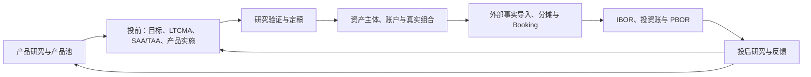

# 产品需求与路线图

本页统一维护产品范围、实现状态和发展优先级。领域词义由 [docs/product/domain-language.md](domain-language.md) 负责；账户、分摊与核算的字段级模型见[核算专业契约](accounting.md)。各研究模块的公式和接口不在本页重复。

## 产品定位与范围

面向个人、企业和家族办公室等资产所有者，建设内部资产配置研究与真实组合管理平台：

- 持续研究 ETF、场外公募基金等底层产品并维护版本化产品池。
- 按资产主体的目标、期限、流动性、税务和风险约束开展 SAA、TAA 与产品配置研究。
- 管理资产主体、银行/券商/销售账户和内部真实组合。
- 将外部交易事实匹配、分摊并 Booking 为可追溯的持仓、投资账和绩效数据。
- 对真实组合开展 TWR、MWR/XIRR、收益归因、风险分析和研究反馈。

平台不面向外部客户销售，不建设基金设立募集、持有人份额、管理费收费、法定基金会计、监管报送或交易下单。

## 目标用户

| 角色 | 主要诉求 |
| --- | --- |
| 个人资产所有者 | 以目标和风险为中心查看账户、组合、现金流与绩效 |
| 企业资金与投资团队 | 管理自有资金的安全性、流动性、收益性、投资核算及总账衔接 |
| 家族办公室 | 管理多个个人和持有实体，跨银行聚合并按所有权关系穿透汇总 |
| 量化研究员 | 产品研究、指标、产品池、配置模型、回测、情景和归因 |
| 组合责任人 | 维护目标版本、真实持仓、偏离、再平衡测算和复盘 |
| 投资运营 / 核算人员 | 数据导入、匹配、分摊、Booking、对账、关账和例外处理 |
| 系统管理员 | 数据、权限、审计、研究口径、指标、模型、场景、规则和系统参数 |

## 主流程与责任边界

该图描述目标业务体系，各阶段实现程度见下表。资产主体是所有权与会计边界，组合是投资管理与绩效维度；外部账户与组合在同主体内多对多。研究结果不能直接写成交易事实或法定账务。企业投资账可映射总账，个人／家族可使用投资辅助账；不为内部组合虚构独立法律实体。

## 当前实现状态总表（2026-09-20）

以下以**当前代码调用链**为准，不以页面名称或设计文档存在与否判断完成度。

| 业务域 | 当前状态 | 说明 |
| --- | --- | --- |
| 基金市场概览 | **已实现** | 有真实页面与数据链路 |
| 产品与管理人研究 | **部分实现** | 产品详情、比较、指标等已有；完整管理人／团队研究未闭环 |
| 持仓穿透与风格研究 | **已预留／原型** | 有独立路由和原型页，尚无完整真实研究链 |
| 产品评价、产品择时 | **部分实现** | 有真实研究页面与算法，但覆盖范围仍在扩展 |
| 产品池构建与生命周期 | **已实现** | 有版本化产品池与生命周期服务 |
| RiskScale | **已实现** | C1–C5、版本治理和 Mandate 引用已接通 |
| Mandate／投资目标 | **核心已实现** | Mandate 2.0 已接通；自动税务／监管判断未实现 |
| Product-first 大类路径 | **已实现** | 产品池 → 大类 → LTCMA |
| Strategic-first 大类路径 | **已实现** | StrategicUniverse → Research Proxy → LTCMA |
| LTCMA | **第一版已实现** | 五类方法族、冻结版本及 SAA 引用完整 |
| SAA | **部分实现** | single、Multi-CMA A/B 基础链已接通；部分高级稳健优化未完成 |
| TAA | **部分实现** | 信号、时点、回测、walk-forward、情景与版本已有；class-level TAA 尚未与产品门禁彻底解耦 |
| 产品实施／研究包 | **部分实现** | 已有 `/api/pre-investment`、产品候选、风险／费用／现金验证、ResearchPackage、定稿和导出 |
| 统一回测中心 | **已预留／原型** | 各业务模块已有真实回测，但统一中心路由本身仍是 prototype |
| 资产主体／所有权／真实组合中心 | **已预留／原型** | 有 `portfolio.*` 数据模型、组合中心页面和演示上下文，尚无完整真实主数据服务 |
| 投中实施 | **已预留／原型为主** | onboarding／trade allocation 有页面，交易计划、前置检查、交收、核对、再平衡仍主要是 prototype |
| 投资运营与基金会计 | **已预留／原型为主** | account statement、Booking、财务报表有演示工作台；总账、估值、关账、PBOR 等已有数据模型／原型但无正式账务闭环 |
| 投后研究 | **已预留／原型为主** | `research-diagnosis` 可消费真实研究快照；正式绩效、收益归因、风险归因、监控、报告仍是 prototype |
| 反馈与迭代 | **已预留／原型** | 六个流程节点均有路由占位，但没有真实反馈闭环 |
| 内部配置方案库 | **已预留／原型** | 有方案目录／展示页面，但尚不是正式版本库 |
| 数据源／数据模型／研究数据实验室／PIT | **已实现** | 已形成真实公共数据能力 |
| 数据质量 | **部分实现** | 已有质量页面与检查，但未覆盖全业务域 |
| 研究口径与参数中心 | **已预留／原型** | 有路由和原型，尚无正式模板版本服务 |
| 指标与模型管理 | **部分实现** | Indicator Studio 已有真实能力，但完整统一治理仍未结束 |
| 因子研究中心 | **已实现** | 研究、检验、版本及下游引用已有 |
| 风险模型中心 | **已实现** | 敏感度／风险模型发布与应用链存在 |
| 历史情景识别／情景模拟压测 | **核心已实现** | Regime Graph v2、历史／实时双轨、Monte Carlo、状态转移、反向压力等已有；治理增强仍有后续 |
| 择时算法中心 | **部分实现** | 可编辑与研究链已有，仍在完善治理／复用边界 |
| 系统参数中心 | **已预留／原型** | 有路由但无正式配置中心 |
| 权限与安全中心 | **尚未预留为独立业务模块** | 当前未发现对应独立路由和领域服务；仅有项目级安全约束与审计要求 |

### 已预留但尚未真正实现的重点

- 资产主体、所有权关系、外部账户与真实组合：已有标准数据模型和组合中心页面框架。
- 投中交易计划、交易前检查、现金交收、核对和再平衡：已有流程路由／Prototype。
- 总账、估值、关账、PBOR、正式绩效与归因：已有 `accounting.*`／`operations.*` 数据模型和原型页面。
- 正式投后、反馈闭环、方案库、统一回测中心、研究参数中心、系统参数中心：已有导航和页面位置，但未形成真实服务闭环。
- 银行／券商／销售机构接入：通用数据源和接口映射框架已预留，但具体机构连接器尚未形成完整生产链。

### 尚未预留或仅有规则层描述的重点

- 独立的工作空间／资产主体级 RBAC、职责分离与敏感字段权限中心。
- 自动税务优化、法律适当性／监管判断引擎；当前只保留人工复核主题和数据字段。
- 面向真实外部审批／真实交易授权的工作流；平台当前明确只做到研究定稿，不提供下单。

### 当前代码与目标蓝图的主要差距

目标架构已经不再是“先把所有业务都做齐再开始投研”。当前实际演进顺序是：**研究公共能力和投前链路已经较成熟，真实组合／运营／核算／投后闭环尚未成熟。** 下一阶段如果继续沿主链推进，优先级应是：

1. class-level TAA 与最终产品应用门禁解耦；
2. 产品实施契约和真实组合目标版本衔接；
3. Asset Owner / Household / Entity + Account 主数据与所有权关系；
4. Cashflow / Liability Planning，支持家办、企业 Treasury 和个人多目标规划共用；
5. Booking → IBOR/PBOR → 正式绩效／归因；
6. RBAC / Approval / Client-Service Governance；
7. 投后 → 反馈闭环。

## 后续交付顺序

下表只描述尚需交付的范围；已实现的基础能力不重复列为待建。状态与结项要求见[文档维护协议](../governance/documentation.md)。

| ID | 状态 | 工作项 | 完成判据 | 证据/剩余事项 |
| --- | --- | --- | --- | --- |
| ROAD-01 | planned | 研究主链的剩余交接 | class-level TAA 与产品资格解耦、实施映射及真实组合目标承接通过对应验收 | 已有研究包/验证/定稿基础；具体范围见[投前研究](../pre-investment/README.md) |
| ROAD-02 | planned | 资产所有者底座 | 主体/所有权、账户、真实组合、目标版本及基础对账形成实际可用链路 | 规划剩余正式能力；[领域语言](domain-language.md)与[核算契约](accounting.md)不代表全部已实现 |
| ROAD-03 | planned | 现金流与负债 | 滚动预测、多目标优先级、资金分层在共用引擎上通过业务验收 | 退休/教育、企业流动性、家办资本调用按独立范围实施；已有[研究资金模型](../pre-investment/funding.md) |
| ROAD-04 | planned | 运营与投后 | 流水、Booking、IBOR、成本、公司行动、PBOR、绩效、关账与反馈完成验收 | 各模块的原型或局部能力不能视为正式闭环；见[核算契约](accounting.md) |
| ROAD-05 | planned | 多角色治理 | 主体隔离、RBAC、职责分离、审批和敏感权限满足实际验收 | MFO 在单主体底座稳定后扩展，客户服务属于未来新范围 |
| ROAD-06 | planned | 专属能力 | 各项非标估值、穿透、信用梯队、ALM/LDI、税后/生命周期能力按独立需求验收 | 后续独立授权与设计；不因列入路线图自动进入开发范围 |

情景研究近期重点是可解释定义、历史／实时双轨、参考校准、前瞻资格与压力期限，细节由[市场状态工作台](../regimes/README.md)和[验证契约](../regimes/validation.md)维护。统一回测平台和跨中心模型治理不能因各模块已有回测而标成完成。

## 非功能与验收原则

- 外部事实不可静默覆盖；分摊守恒、借贷平衡、主体/组合汇总勾稽。
- 数据、模型、目标配置、费用、分摊、估值与绩效按版本追溯；研究绑定 PIT、指标 revision、随机流和代码证据。
- 真实账户及家庭数据引入前，必须建立权限和正式存储边界；实例级共享 JSON 不是多主体隔离方案。
- 常用研究 API 的目标响应为1–2秒；大规模计算展示异步进度。目标不是当前每个 API 的性能实测。
- 原型页面明确说明状态，不模拟真实成功提交；投中不提供下单、撤单或自动交易。
- Python只负责编排、校验与I/O，项目数值计算遵守 AGENTS 的固定签名 NJIT、预热及零回退要求。
- 各里程碑分别取得数值、API、用户交互、数据与发布证据；技术测试不代替投资有效性、独立审批或正式账务资格。

## 文档事实基线

状态表继承2026-09-20的代码梳理，后续随实现维护；它不是生产部署清单。历史设计、阶段日志和发展纲要已合并，不再并行维护另一份总蓝图。专业入口见[文档索引](../README.md)。
