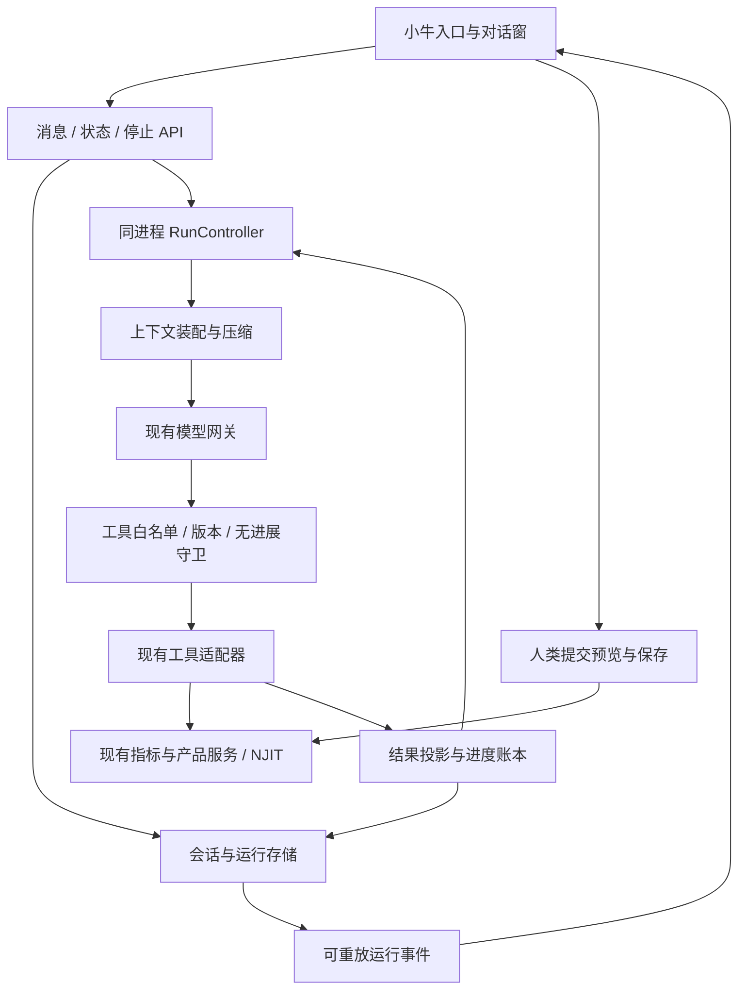
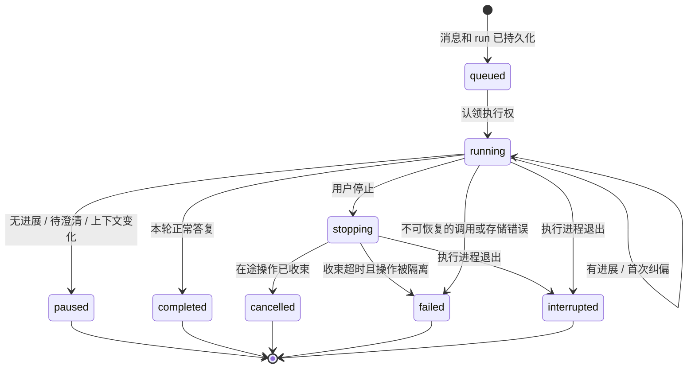

# AI 投研助手 Harness：无默认次数上限与无进展检测详细设计

> 日期：2026-09-20。状态：核心运行链已实施；当前验证证据与边界见第 18 节。
> 需求：默认不限制单次用户请求内的工具调用数与模型往返数；持续有进展就继续，发现无进展时纠偏、暂停并保留成果。
> 本文是 harness 执行、检测、恢复、事件与上下文协议的唯一详细设计来源；替代旧方案的 12 次调用、6 轮往返和固定修复/预览次数配额。指标计算、PIT、人工保存与页面范围仍遵循原有设计。

## 1. 设计决策

1. **默认无总次数上限。** `max_tool_calls`、`max_model_steps` 均为 `null`；总运行时长、累计 token/费用同样不设置默认终止阈值。记录真实用量，允许部署方显式设置限制，但不把一个更大的常量冒充无限制。
2. **进展由工具事实和产物证明。** 新请求 ID、时间戳、草稿 revision、模型说“正在推进”、改变工具参数，本身都不算进展。
3. **先纠偏，后暂停。** 正常执行 → 检测到停滞 → 给一次有界的换方法机会 → 仍无进展则停止工具调用，生成阶段说明，等待人类补充。纠偏、总结和压缩也不能自我循环。
4. **每一步可恢复。** 用户消息先持久化；模型输出、工具开始、工具完成、草稿变化、停止原因分别保存。浏览器连接不拥有任务的生命周期。
5. **正常聊天不强制调用工具。** 讨论、澄清、生成和校验公式不要求产品；仅真实试算需要产品与有效计算上下文。最终回答不自动等于“需求已验证完成”。
6. **继续使用当前单体服务和计算引擎。** 不引入外部 agent runtime、多智能体调度、向量库或第二套数值实现。以下调研用于改进内部 harness，不把 OpenCode/Codex 嵌入产品。

无进展检测是可测试的工程防护，不能在任意模型、任意工具和无限状态空间中数学证明必然终止。本文明确覆盖可观测的重复、振荡、错误和停滞；不可判定的情况进入澄清，用户始终可停止。单操作超时、资源容量与数据契约边界仍有效，它们不限制一个持续推进的任务总共能做多少步。

## 2. 网上调研与采用依据

访问日期均为 2026-09-20。下面区分官方事实与本项目选择；检测阈值见第 7 节，均为本项目待验证初值，不冒称行业标准。

| 来源 | 已核实事实 | 本项目采用与边界 |
| --- | --- | --- |
| [Codex agent loop](https://openai.com/index/unrolling-the-codex-agent-loop/) | 一次人类对话回合可有大量模型/工具迭代；正常结束由最终回答标识；长上下文需要管理 | 不把人类回合等同于一次模型请求；不声称 Codex 没有任何内部限制或已经证明不会死循环 |
| [OpenCode 1.x steps](https://opencode.ai/docs/agents/#max-steps)、[v1.18.31 prompt.ts](https://github.com/anomalyco/opencode/blob/v1.18.31/packages/opencode/src/session/prompt.ts) | 未配置 `steps` 时源码使用 `agent.steps ?? Infinity`；达到配置步数后加入收尾提示 | 采用默认无总步数上限；不能仅凭收尾提示词保证工具停止 |
| [OpenCode 权限](https://opencode.ai/docs/permissions/#available-permissions)、[v1.18.31 processor.ts](https://github.com/anomalyco/opencode/blob/v1.18.31/packages/opencode/src/session/processor.ts) | `DOOM_LOOP_THRESHOLD=3`，检查最近调用的工具名和输入；默认触发询问 | 增加结果与语义状态比较，覆盖跨工具循环；相同参数在依赖改变后允许再执行 |
| [OpenCode V2 steps](https://opencode.ai/v2/docs/agents/#steps)、[V2 permissions](https://opencode.ai/v2/docs/permissions/#actions) | 最后一步去掉工具并要求总结；`doom_loop` 不再是 V2 Core 权限动作 | 借鉴强制无工具的收尾；不能把 V1 检测机制描述成 V2 的现状 |
| [OpenClaw loop detection](https://docs.openclaw.ai/tools/loop-detection)、[检测源码](https://github.com/openclaw/openclaw/blob/main/src/agents/tool-loop-detection.ts) | 比较调用与结果，区分警告/阻断，处理重复模式及压缩后的复发；滚动检测与压缩后保护的默认开关不同 | 采用稳定结果指纹、短历史模式检测、有限纠偏、压缩不清除检测证据；本项目默认开启检测，不照抄其默认开关 |
| [Magentic-One 架构](https://microsoft.github.io/autogen/dev/user-guide/agentchat-user-guide/magentic-one.html#architecture) | 分开维护任务目标和进度账本，停滞时调整计划 | 采用小型结构化进度账本；不引入它的多智能体体系，也不每步增加一个评审模型 |
| [Anthropic 长任务 harness](https://www.anthropic.com/engineering/effective-harnesses-for-long-running-agents) | 压缩本身不足以保证长期推进；可核对的产物、进度记录与验证有助于接续工作 | 固定保留需求、草稿和证据；区分模型自述与校验事实 |
| [Microsoft Agent Looping](https://learn.microsoft.com/en-us/agent-framework/agents/looping) | 提醒完成条件和评审模型可能失效，无界循环需要可靠终止条件 | 将“无默认次数配额”与“所有内部控制都无界”分开；不承诺概率模型能识别所有死循环 |

检索摘要只用于找来源；上述结论已打开官方页面或源码核对。动态 main 分支与在线文档可能变化，实施时核对涉及的接口，不依赖第三方博客的默认值。

## 3. 改造前代码事实与差距

本节记录实施前的静态核对基线，相关旧行为已在本次改造中替换；链接指向当前实现，不代表下表旧行为仍然存在。核对基于 `ISSUE2609/AiFunctions` 的工作区，包含尚未提交的 agent 实现。CodeGraph 尚未覆盖这些新增文件，定位后直接读取源码。旧设计中写过的能力不等于当前实现。

| 当前入口/符号 | 实际行为 | 目标变化 |
| --- | --- | --- |
| [harness.py](../../backend/agent/harness.py) `run_turn` | `MAX_TOOL_CALLS=12`、`MAX_TOOL_ROUNDS=6`；整轮位于 `store.locked()`；正常/到限结束才写状态 | 无默认总次数上限；短事务认领和逐步 checkpoint；网络与计算期间不持锁 |
| [harness.py](../../backend/agent/harness.py) `_history` | 仅装配最近 8 条人类/助手文本；循环内工具消息累积在内存 | 完整持久化转录，按上下文容量装配与压缩 |
| [sessions.py](../../backend/agent/sessions.py) `append_event` | `seq=len(events)+1`，超过 200 条裁头；继续追加会重复序号 | 持久化递增 `next_event_seq`；展示分页与序号分离 |
| [sessions.py](../../backend/agent/sessions.py) `store_draft` | invalid 草稿反复校验仍可能递增 revision；定义 hash 含展示字段 | revision 不作为进展；精确定义 hash 与计算语义 hash 分开 |
| [tools.py](../../backend/agent/tools.py) `execute_tool` | 白名单、Pydantic 参数与作用域校验；handler 改当前会话草稿；结果有界 | 在同一入口增加调用前检测、调用后语义投影和 checkpoint，不绕过现有守卫 |
| [llm.py](../../backend/agent/llm.py) `HttpLLMClient.complete` | 同步 urllib，整包响应，已有错误分类和工具名协议适配；未返回完整 usage | 使用已安装 httpx 实现可取消请求；保留公司网关的 Chat Completions 与别名契约 |
| [routes.py](../../backend/agent/routes.py) `post_agent_message` | 单个同步请求包住整轮；无运行查询、取消与事件订阅 API | 同一 runner 支持整轮兼容响应和异步运行句柄 |
| [AgentPanel.tsx](../../frontend/src/components/agent/AgentPanel.tsx) | 已有即时用户气泡、“思考中…”和失败重试；状态仍主要在组件内存 | 根据持久化消息和运行事件恢复；增加停止、进展状态、暂停后继续 |
| [commit.py](../../backend/agent/commit.py) `commit` | 人类 API 独立于工具；业务写入后保存回执；异常期间没有跨存储原子事务 | 保存入口继续人类专属；在写前记 intent，写入不确定时禁止自动重放 |

事件裁剪、长锁和中断丢进度是此次改造处理的依赖；实现结果与测试证据统一见第 18 节。

## 4. 总体结构与职责



| 文件（拟调整/新增） | 职责 |
| --- | --- |
| `backend/agent/harness.py` | 一个执行循环与 RunController；状态迁移、停止、恢复和收尾 |
| `backend/agent/progress.py`（新增） | 纯编排逻辑：指纹、进度账本、停滞检测、检测器序列化；不调用 LLM、不做数值运算 |
| `backend/agent/context.py`（新增） | 装配固定规则、已确认约束、当前草稿、可追溯摘要与近期完整工具消息组 |
| `backend/agent/sessions.py` | 会话、run、事件与回执事务；保持现有公共会话字段兼容 |
| `backend/agent/tools.py` | 参数规范化、现有 handler、语义结果投影、缓存有效性；执行必须使用原白名单 |
| `backend/agent/llm.py` | 模型请求、取消、有限网络重试、协议解析、usage；唯一网关适配边界 |
| `backend/agent/contracts.py` / `routes.py` | API 输入输出校验、运行控制、SSE/分页事件；不执行数学逻辑 |
| `backend/agent/commit.py` | 人类确认与业务写入 intent/receipt；不向 LLM 暴露 |
| `backend/app.py` | 复用 lifespan 管理 controller 的启动、退出与中断标记；继续复用 indicator_service 单例 |
| `frontend/src/services/agent.ts` | 请求类型、取消与事件流；保留 code/stop_reason，不能只丢成错误字符串 |
| `frontend/src/components/agent/AgentPanel.tsx` | 对话、阶段状态、停止/继续、草稿显示；复杂状态需要时只拆一个 `useAgentSession` hook |

不先拆出插件总线、通用工作流框架、复杂计划图或多个 evaluator。工具串行执行作为本期默认，减少草稿、参数和缓存依赖竞态；正常串行执行的总步数不受限制。

## 5. Run、会话与版本

### 5.1 身份和状态

- `session_id`：持续对话；`message_id`：一次人类输入的幂等键；`run_id`：处理这条输入的一次运行，三者不得混用。
- `session_revision`：接纳新输入、上下文或人工草稿/确认变更时递增；工具内部 checkpoint 不改变它。
- `run_revision`：运行状态每次 checkpoint 递增；`event_seq`：会话内永久单调递增。
- `owner_epoch`：运行执行权的 fencing 标记；旧请求/旧 worker 的迟到结果必须拒绝应用。
- `draft_revision`、业务 indicator revision、editor revision 保留原契约；不用于判断真实进展。

运行 `status`：`queued | running | stopping | paused | completed | cancelled | failed | interrupted`。
运行 `phase`：`thinking | tool | recovery | summarizing | waiting_retry`，只描述正在做什么。
结束原因 `stop_reason`：`null | no_progress | needs_clarification | context_changed | user_cancelled | operation_timeout | upstream_error | process_interrupted | context_capacity | explicit_limit | storage_unavailable`。



`completed` 仅表示本次回答完成。输出另带 `artifact_status=none|draft_invalid|draft_validated|previewed`；只能由真实校验/试算回执推导，不把“校验通过”说成“结果已计算”，不把文本答复说成所有研究目标完成。

### 5.2 接纳、重复请求和继续

1. 短事务中先查 `(session_id,message_id)`，比较 `text + 完整 page_context + 人类控制字段` 的请求指纹；相同返回已有 run，不因旧 revision 再次失败或执行。
2. 新请求核对 `expected_session_revision`、作用域和活动 run，保存用户消息、冻结上下文、run 和 revision；提交成功后才认领模型任务。
3. 同一会话只有一个活动 run。不同消息并发进入返回 `409 AGENT_SESSION_BUSY` 和活动 run_id；不静默排入可能基于旧草稿的队列。
4. “重试传输”继续使用原 message_id，只查原 run。“继续分析”使用新 message_id 和 `resume_from_run_id`，保留原产物与已失败策略，不从旧工具列表重新开始。
5. 人类仅说“继续”不是数据/口径变化，不清除同一依赖版本下已确认无效的调用。用户补充信息时只解除受新信息影响的阻断；新 run 获得一次新的纠偏机会。
6. 页面产品/PIT/参数变化不悄悄注入在途调用。前端发送上下文失效控制，服务端让原 run 在安全边界暂停；新消息冻结新上下文，再校验相关证据。

## 6. 可验证的“进展”

### 6.1 进度账本

```text
TaskProgress
  user_goal_message_ids       # 目标来源，不由模型悄悄替换
  requested_capabilities      # 解释/创作/预览；缺省不自动试算
  confirmed_constraints      # 结果类型、参数、口径；带来源与确认状态
  milestone_evidence         # 每个已达里程碑 -> 真实 tool receipt
  best_validation_evidence   # 最好已证实状态及未解决诊断
  explored_facts             # 相关目录 ID/version、候选、已排除项
  rejected_strategies         # 调用/方案指纹、失败原因、依赖版本
  pending_questions
  current_draft_ref / last_valid_draft_ref / preview_ref
  last_verified_progress_seq
```

模型可以提出目标分解和解释，不能自行将检查项标成通过。口径不明确时提问；不能靠猜测年化方式、改变输出类型或放宽数据要求获得“进展”。本期不追求自动证明自然语言需求全部满足，未能结构化验证的含义保留为待人类复核。

里程碑由用户请求决定：解释可以直接答复；创作通常是“相关契约已查明 → 定义可解析 → 类型/参数满足已知约束 → 校验通过”；只有用户要求试算才增加“真实产品与口径已确定 → 数据可用性有证据 → 真实预览完成”。不要求每个任务机械走完全部阶段。

### 6.2 信号分级

| 信号 | 判定 | 是否解除停滞 |
| --- | --- | --- |
| 首次找到任务相关的变量、算子、来源指标及精确版本 | 有来源 ID 的新证据；相同条目重新排列不算 | 可解除当前检索停滞；不能解除公式修复的重复错误 |
| 首次空搜索结果 | 排除一个具体查找方向 | 仅记录一次；不断换近义词得到空结果不算持续推进 |
| 草稿从无效到有效，且满足已知结果类型和参数约束 | 真实 validator 回执 | 是 |
| 同一需求下解决已知诊断，且没有新增同级/更高严重度阻碍 | 比较稳定 diagnostics 与依赖，不只比较错误条数 | 是；不能只删除出错部分而违背需求 |
| 新定义 hash、改名、改说明、相同错误但换一个表达式 | 只有变化，尚未证明改善 | 否；记候选尝试供检测 |
| A 草稿改 B 再改 A；不断切换两个失败方案 | 重返已见语义状态 | 否 |
| 完成一个用户要求的不同产品/窗口/指标预览 | 目标集合推进，有数据版本和结果回执 | 是；同一已完成目标重复试算不算 |
| compile_token、updated_at、request_id、耗时、随机 ID、revision 改变 | 运行元数据 | 否 |
| 模型宣称“找到了”“已完成”，但无工具证据 | 未验证文本 | 否 |
| 已登记且有可验证 deadline 的后台计算在等待 | 等待状态，不是一次失败动作 | 不计无进展次数；到期转操作超时并收束，不能因心跳延长 |

保留“当前状态”和“最佳已证实状态”，不因为局部回退而丢失最好草稿。新事实只有能关联当前目标或当前阻碍时才解除对应停滞；新增无关目录项、不断改计划、模型自增 milestone 都不刷新进展计数。

### 6.3 指纹与规范化

维护三类指纹，不能混用：

```text
execution_key = SHA256(tool_semantics + validated_args + full_dependency_stamp)
observation_key = SHA256(execution_key + stable_outcome_projection)
semantic_state_key = SHA256(computational_definition + requirements + stable_diagnostics)
```

- `validated_args` 在 Pydantic 补齐默认值后 canonical JSON；对象键排序，数组顺序默认保留。只规范化契约明确等价的集合，不能排序公式参数、删空值、舍入浮点或改写 DSL 来“去重”。
- 无效参数尚未过 Pydantic 时，用有界原始 JSON 与稳定错误位置记录指纹；不能漏掉模型一直发无效参数的循环。
- `metrics.validate` 与同 handler 的 `metrics.draft_save` 在检测层标记为相同语义族；授权与日志仍保留原工具名，别名不能逃过检测或扩大权限。
- `full_dependency_stamp` 至少含 scope、计算域、冻结 PIT、产品/组合 run、周期、指标来源 revision、完整草稿 hash、registry/DSL/catalog 版本及工具依赖的数据 generation。字段按工具实际依赖选取。
- 只在结果投影中排除明确的运行噪声；研究日、观察日期、来源发布日期、单位、缺失原因、数值内容都保留。不要全局删除名为 `date`、`id`、`timestamp` 的字段。
- 进展使用的计算定义可排除名称/说明等展示字段；compile token、提交和结果缓存仍绑定完整定义，不能拿语义等价 hash 绕开现有精确契约。
- 结果投影在 `_bounded` 之前取得，不能仅对截断文本哈希。优先复用现有结果/定义指纹；大数组不为检测再做逐元素计算或复制，必要的摘要哈希在既有序列化边界复用。检测器不判断金融数值是否正确。

## 7. 无进展检测与处理规则

### 7.1 规则和起始参数

检测历史窗口默认保存最近 **32 个已提议/执行的工具动作**，加上当前未解决阻碍和拒绝策略。32 是检测工作集，不是任务调用额度。以下阈值是待回放调优的工程初值。

| 规则 | 触发条件 | 处理 |
| --- | --- | --- |
| `repeat_no_change` | 相同依赖下同一 observation 连续出现 3 次，无相关进展 | 进入纠偏，阻断第 4 次等价执行；静态只读结果可返回缓存，但缓存命中也计作重复提议 |
| `repeat_failure` | 相同调用、相同稳定 error/diagnostics 出现 2 次且依赖未改 | 进入纠偏，阻断下一次原样尝试；权限、鉴权或缺前置条件不等待重复才提示 |
| `cycle_no_progress` | 长度 2–4 的调用/结果或语义草稿状态序列连续重复 3 个周期，未解决当前阻碍 | 阻断重复周期的下一步，进入纠偏；覆盖 A/B 与 A/B/C，不只看工具名 |
| `repair_stall` | 同一目标连续 4 个不同候选仍未改善任何稳定诊断，或重返已失败状态 | 进入纠偏；不把“换表达式”当成功 |
| `stagnation` | 连续 8 个完成动作没有任务相关的新事实或更好产物，即使参数一直变化 | 进入纠偏；区分卡在检索、修复和预览，不自动删需求 |
| `compaction_loop` | 压缩后在相同依赖下复现已阻断模式，或压缩未产生可用上下文却再次请求相同压缩 | 直接暂停；压缩不是新的尝试机会 |
| `protocol_stall` | 模型空响应、畸形工具协议或持续未知工具 | 协议错误有限修复后结束，不通过无限“请继续”驱动模型 |

检测按动作和当前目标记录，不能让并行批次、工具别名、错误文案随机 ID、请求重放或压缩清空计数。跨工具依赖确实改变时使相关 execution key 失效；用户改变 PIT/窗口产生新研究上下文，不能复用旧成功/失败缓存。

不使用“所有同错误码两次就停”的粗规则：不同字段的同类诊断、不同产品的数据缺失是不同问题。也不使用“每个成功 HTTP 200 都算进展”：无效校验和重复空结果可能都返回 200。

### 7.2 一次纠偏机会

1. 首次触发，将原因、重复证据、已尝试方向与仍可用的工具送入下一次正常模型请求；每个停滞事件只注入一次提示。
2. 标记被阻断的 **调用指纹/方案**，通常不禁用整个工具。例如错误公式不能原样再验证，但可以验证修正后的公式。
3. 纠偏最多允许 **2 个新的工具尝试**，并检查是否出现第 6 节定义的相关进展。被阻断的提议、缓存复读与无效参数也消耗这个纠偏机会，不能免费无限试探。
4. 有明确进展则回到正常执行；一个正常长任务可以跨很多有进展的阶段，不设总次数上限。仅新建计划、换名字、刷新 token、改变无关参数，不会重新获得纠偏机会。
5. 没有进展则 `paused/no_progress`。以 `tools=[]` 且 `tool_choice=none` 做一次简短收尾；如果模型仍返回工具，服务端拒绝执行。收尾失败用本地事实模板，不再次请求总结。

暂停回复至少包含：已经完成什么、卡在哪里、保留了什么、最小需要补充什么。例如：“已找到夏普指标，但两种滚动表达式都未通过类型校验。草稿已保留；需要确认输出是每个交易日一个值，还是每月一个值。”只有真的存在该歧义才能这样提问。

### 7.3 调用前和调用后的顺序

调用前顺序：身份/owner 检查 → scope/域/上下文 → 参数 schema → 依赖版本 → 已知重复/阻断 → 记录 `tool.started` → 执行。
调用后顺序：拿到原始结果 → 工具专属语义投影 → 复核目录与所依赖的当前数据版本 → 计算检测结果 → 事务保存结果、草稿 patch、进度和事件 → 发布已提交事件 → 再调用模型。

目录在工具执行期间变化时，以 `context_changed` 暂停；该次结果记为 `discarded`，不发布草稿、预览或新进度。共用模型返回入口也复核目录，覆盖主回复、压缩与收尾；版本已变化的模型内容不进入对话或检查点，实际用量仍记录，此前已提交的有效进度保留。

一个模型回复可以提出多个调用；全部保留 call_id。按序执行，每个调用都重新做守卫。中途停止时给未执行调用补结构化 `not_executed` 结果，再进入总结；不能截断列表造成孤立 tool_call，也不能在阻断某个调用后悄悄执行剩余副作用。重复 call_id 或畸形整批协议在执行前拒绝。

任一调用被阻断，或调用完成后首次触发纠偏，本批剩余调用全部不执行：当前被拒绝的 call_id 记录 `blocked`，其余分别记录 `not_executed`。先提交完整回执组，再进入下一次纠偏模型请求；已耗尽纠偏机会才进入无工具收尾。纠偏阶段当前真正提出但被拒绝的调用消耗一次尝试，因整批停止而未检查的尾项不额外消耗；所有尾项仍可审计。不得在同一批中绕过纠偏提示继续改草稿。

## 8. 工具结果、复用与隐藏重试

在现有工具注册表旁增加一个小型元数据映射，不新增工具框架：

```text
ToolPolicy
  semantic_family
  effect: read | session_draft | human_commit
  dependency_fields
  outcome_projection
  replay: safe_read | revalidate | never
  timeout_source
```

`human_commit` 仅供人类 API 共用审计规则，不出现在模型 tools 中。新工具缺少 policy 时不能进入无限循环运行模式，先补充明确契约。

| 工具族 | 进展证据与复用规则 |
| --- | --- |
| lookup / infer | 相关 ID+version、依赖/类型、稳定诊断；同一目录/DSL 版本可复用有界摘要 |
| validate / draft_save / rolling_draft | 完整定义、来源 revision、计算语义、有效性和诊断；区分 session patch 与编译缓存副作用；token 失效须重新 validate |
| products.search | 真实 kind/product_id 与候选说明；只替换候选不代表试算完成，也不修改页面选中项 |
| availability | 变量覆盖、缺失原因、真实研究日和数据 generation；依赖改变必须重查 |
| preview / products.eval / series / portfolios.eval | 使用现有计算结果 ID/指纹、锁定目标和窗口；结果句柄到期保留过期状态，不能伪装成新计算成功 |

缓存只避免相同有效依赖上的重复工作，不提供新的进展。对于“验证草稿后又回到此前草稿”，不能把缓存命中转成新的成功里程碑。动态数据没有可验证 generation 时，不做跨请求结果缓存。

当前 `_handle_preview` 内含一次 token/预热错误后的 `_refresh_draft → evaluate`。保留既有能力，但必须把内部 validate、evaluate 和失败记为子操作，计入耗时与运行轨迹；禁止在 handler、HTTP 客户端和 harness 三层各自重试形成乘法放大。同一父操作只允许现有的一次刷新，仍失败则反馈稳定错误。

大结果存既有有界结果仓库/导出句柄，模型只收摘要和引用。若结果经过裁剪，摘要保留诊断、有效性、参数与下一步检索入口；不能再对序列化 JSON 直接切字符，不能把 `truncated=true` 当作无内容。

## 9. 持久化、幂等与崩溃恢复

### 9.1 选型：标准库 SQLite 管理 agent 控制状态

当前 AtomicJsonStore 适合配置文件，但无限步运行需要同时提交“事件、工具回执、草稿、检测器状态”；仅增加多个 JSON 文件会引入自建日志事务。选择 Python `sqlite3`，复用项目 [SourceStore](../../backend/data_sources/store.py) 已有的路径守卫、短连接、事务和存储错误分类模式；不修改数据源数据库或让 agent 依赖其业务表。

拟存放：受 `resolve_agent_data_dir()` 与 `guard_path` 管理的 `agent_sessions/harness.sqlite3`。默认沿用本地文件事务模式，不未经验证启用 WAL；外接盘/网络文件系统的锁与断电恢复必须实测。文件权限维持 0600，磁盘不可用则暂停接纳新任务，不能改写到另一个目录装作成功。

| 表 | 最小字段与约束 |
| --- | --- |
| `sessions` | session_id PK、schema_version、revision、next_event_seq、scope、page_context、current_draft、last_valid_draft、pending_confirmation、active_run_id、memory proposals；复杂字段为有版本 JSON |
| `runs` | run_id PK、session_id、message_id、request_hash、status、phase、stop_reason、owner_workspace/instance/epoch、checkpoint、progress、detector_state、usage、final_response；UNIQUE(session_id,message_id) |
| `events` | session_id、seq、run_id、type、public_payload、created_at；PRIMARY KEY(session_id,seq)，按 run/seq 索引 |
| `tool_calls` | run_id、operation_id、model_step、call_id、execution_key、started/completed/unknown 状态、结果引用/有界正文、session patch、依赖 stamp；UNIQUE(run_id,model_step,call_id) |
| `commit_intents` | session_id、request_id、confirmation_id、request_hash、state、indicator receipt；UNIQUE(session_id,request_id) |
| `progress_facts` | progress_space_id、kind、fact hash 联合主键；持续运行及人工接续共享已见事实，避免近期缓存淘汰后把旧事实再次算成进展 |

不增加单独的 plans/milestones/evaluators 数据库表；小型账本存在 run checkpoint，长期去重集合使用 progress_facts 索引。真实数值数组不进 SQLite 文本列。活动/隔离 run 与聊天消息均有部分索引，恢复不扫描全部历史工具日志。

### 9.2 原子 checkpoint

一个短事务同时更新：工具完成回执、当前/最佳草稿、稳定进度、检测器状态、run_revision、events 与 next_event_seq。提交成功后才发送 SSE。网络请求、LLM 等待、编译和数值计算不得位于事务中。

模型成功或异常返回经共用 admit 事务复核取消与执行归属；`model.returned` 记录返回及用量，准许消费不代表正文已经提交。正文、工具结果或压缩摘要在其内容 checkpoint 成功前都是候选。所有终态由存储层 finish 从本轮最后已提交检查点组装，只接受明确最终文本及其模型协议字段，不接收整份内存候选。admit 只保存有限执行元数据和控制回执，checkpoint 专门提交工作集、草稿及进度且不能直接转终态；被拒绝时不写入候选内容。interrupt 只持久化中断和既有进度。最终收尾在同一个写事务内读取控制状态、构造回执并提交终态；正常终态与取消竞争时，取消先提交则返回停止状态，终态先提交则后到取消无操作；真实失败继续按原错误契约报告。事务失败整体回滚，不提前发布成功，真实用量与已提交进度保留。

每次工具执行前先保存 `started` 和冻结依赖；执行时传入该 run 的本地状态副本，handler 不直接修改共享会话。完成时以 `(run_id,owner_epoch,status)` 校验执行权并提交 patch。只有 `applied=true` 的完成回执、草稿 patch 与进度证据能在同一事务中生效。取消/上下文失效之后到达的结果记录为 `discarded/applied=false`，可供审计但不能覆盖草稿、生成可用预览或进入恢复时的最佳证据；重放命中已丢弃结果也不能重新应用。

运行状态由存储入口决定，不能从调用方的可变 `run.status` 直接赋值：首次 `run.started` 内容事务负责 queued → running，取消负责 stopping，finish/interrupt/recover 各自负责终态与恢复；阶段事件不能代替状态转换。工具回执同样校验前态：started 创建唯一执行身份，completed/unknown 必须对应此前同一操作；blocked/not_executed 只记录未派发结果，不能覆盖已开始或已关闭的回执。线程回调已先释放保护时，合法完成仍可提交，不能误把保护是否仍在作为结果身份。

同目录的多 checkout 可能共享 DATA_DIR：owner 必须同时记录规范化 workspace 与 process instance；启动恢复不能取消另一个仍活跃实例的任务。当前产品仍是单应用进程，不设计自动跨机器抢占；owner 无法确认时返回 interrupted/人工重连，不能仅凭 heartbeat 过期就启动第二份计算。

存活判定使用受保护的 `agent_sessions/owners/<instance_id>.lock`：每个应用实例终身持有 OS 排他锁，UUID 实例 ID 不复用，并记录 workspace 身份。恢复方在同一受支持文件系统上非阻塞取得旧实例锁，才证明旧实例不再持锁；锁仍占用则不接管，不能用 PID 数字或文件存在性代替。取得锁后短事务标记其未完成 run 为 interrupted、递增 fencing epoch、释放已确认失主的运行占用；不自动重新请求模型。文件系统不支持可靠锁或 owner 信息损坏时失败关闭，提供明确故障说明，由操作员确认原进程结束后恢复，不偷偷抢占。

### 9.3 中断判定

| 中断位置 | 恢复动作 |
| --- | --- |
| 已接纳消息，尚无模型请求 | 返回原 run；人工继续后从 checkpoint 开始 |
| 模型请求完成，尚未写入响应 | 不能保证供应商调用 exactly-once；允许人工恢复时重新询问模型，显示可能已有一次计费用量未知 |
| 模型回复已持久化，工具尚未开始 | 按原 call_id 顺序继续守卫，不再次向模型索取同一批调用 |
| 工具已有 completed 且 applied=true 回执 | 使用已保存结果，不重新执行；discarded 回执不作为进展或成功结果 |
| 工具 started 但无 completed | 标记 outcome unknown；确认旧执行已结束后，只有契约允许的只读/缓存操作可重做；会话修改先从权威 checkpoint 恢复再校验 |
| 指标保存已调用，但无完成回执 | `commit_uncertain`；禁止自动创建第二个指标，人工核对业务仓库 |
| checkpoint 写失败 | 不发布“已完成”；停止发起新工具，保留最后已提交快照和错误，禁止靠重跑业务写入补救 |

进程重启把属于已确认退出进程的活动 run 标为 `interrupted`；不默认后台恢复计费任务。用户继续时生成关联的新 run，复制已完成证据和稳定失败记忆。原 run 的执行状态与转录保留。

待执行项统一从已提交对话的尾批次推导，不再信任独立 `pending_calls` 队列。每条已提交的 completed、discarded 或 not_executed 工具消息都会关闭其对应调用；在批次中途退出也不能重放已关闭项。旧字段可读取清除，但不能授权执行。恢复净化改变尾批工具名称或参数时关闭该计划并重新规划，不能在净化后的对话旁继续执行旧参数。根因和边界见 [AI 功能设计第3.5节](ai-functions-design.md#35-消除重复执行权威)。

### 9.4 迁移与容量

- 按 `schema_version` 将现有会话 JSON 导入 SQLite：保留 session_id、revision、草稿、确认状态、已存回执、记忆提案和可用历史；迁移一份会话必须在一个事务内完成，重复迁移幂等。
- v1 已裁剪/重复序号的事件不能假装完整。导入时保存旧 seq 为 provenance，分配新单调 seq，明确 `legacy_history_incomplete`。不能恢复已经丢失的旧调用回执。
- 切换后 session 状态只有 SQLite 一个可写实现。JSON 仅保留为只读历史数据输入，停止双写；迁移适配必须有测试，结束后移除失效入口。LLM 配置仍使用当前安全配置存储，不复制 API Key 入 agent 数据库。
- 事件按需分页；内存仅保留近期消息和检测窗口，不能随运行步骤无限增长。运行结束后的留存/清理由显式存储策略管理，活跃检查点、必要回执和最佳草稿不得静默淘汰。
- 资源不足是实际存储/服务故障，显示其真实原因，不包装成“工具次数预算不足”。

## 10. 可取消执行、单操作超时与资源容量

### 10.1 RunController

使用 FastAPI lifespan 管理一个 controller；记录当前进程的 run task、取消信号、操作句柄和实际资源占用。请求接受、状态查询和停止不等待整轮完成。运行退出统一走 `finally`，但只有实际操作结束后才释放对应资源名额。

模型 HTTP 改用 requirements 已有的 `httpx.AsyncClient`，不引入 SDK。保留 dotted tool name 的出入站映射和公司网关兼容测试。关闭连接/取消 async task 可停止本地等待，但不能承诺供应商已立刻停止推理或计费；迟到模型输出不再执行工具。

同步指标服务通过受控执行线程调用既有 service，仍进入原有预热 NJIT/worker 链。**`asyncio.wait_for` 或 `Future.cancel` 不能杀死已经运行的线程。** 停止请求先进入 `stopping`，停止追加模型/工具调用；在途编译/计算等待现有引擎的取消能力或自身超时收束。期间不能再为该会话启动第二份计算，不能提前释放名额后不断堆积孤儿线程。

到该操作已登记的收束 deadline 仍未结束时，run 转 `failed/operation_timeout`，同时保留 `execution_blocked_by=operation_id` 与隔离资源占用。终态只表示已停止推进，不声称底层计算已经终止；真实 Future 完成或进程退出后才能解除隔离。GET/对话历史可用，新计算仍不得绕过隔离占用；UI 显示“后台操作未退出，需要处理服务状态”，操作员可停止对应应用实例后按 owner 锁规则恢复，不能通过“忽略”按钮放行第二份同会话计算。

不为获得强杀能力再启动一套指标服务或对 NJIT 数学路径做进程改造。若现有操作没有可取消/有界完成契约，该操作不能宣称支持即时停止；实施阶段须先用既有超时入口验证其边界，无法满足则在 UI 明示等待并阻止叠加任务。

已核实 [parallel_engine.py](../../backend/custom_indicators/parallel_engine.py) 提供 `INDICATOR_RUN_HARD_TIMEOUT_SECONDS`（默认 600 秒）与 `wait(future)`；这只证明等待存在期限，不能仅凭异常文字证明该 Future 已退出。该默认值也不能套用于所有 infer/validate 路径。每个工具的 `timeout_source` 在开放无默认次数上限前必须具备 deadline、收束/隔离和槽位释放测试；不能以永久禁用已有工具来完成改造。没有可核实 deadline 的等待不能获得豁免，迁移验收应报告该缺口。

### 10.2 超时和重试

| 范围 | 设计 |
| --- | --- |
| 整个正常 run | 不设默认总步数、总次数、总 token、总时长终止阈值 |
| 单次模型请求 | 保留当前设置的 `timeout_seconds`，区分连接、响应等待与操作 deadline；不要用 SSE 心跳无限续期 |
| 单次工具 | 优先复用现有服务 deadline/取消/忙碌契约；必须登记实际来源，不能凭空假设所有计算 60 秒可完成 |
| 可恢复网络错误 | 单操作最多重试 2 次，即最多 3 次尝试；指数退避+抖动，尊重 Retry-After；超出可等待期限则暂停，不频繁撞供应商 |
| 401/403、配置或参数错误 | 不重试；提示修正配置或输入 |
| token/编译状态失效 | 仅工具已定义的一次刷新；由子操作统一记账，不再叠加外层重试 |
| 运行线程无活动、无在途操作却长期没有 checkpoint | 技术 watchdog 标为异常，不把它当作模型语义进展；日志心跳不抵消故障 |

服务同时可承载的活动 run 数和计算引擎容量仍需有限。其作用是准入控制，达到容量返回明确忙碌状态；不终止已运行且有进展的任务，也不把 per-request 产品数量、数组/结果体积契约改为无限。

## 11. 上下文、压缩与模型适配

2026-09-20 上下文溢出修订以 [上下文管理详细设计](ai-agent-context-compaction-design-2026-09-20.md) 为准：按端点/模型与显式窗口配置计量，85% 软触发，完整交互检查点、历史证据回读和一次上游超限恢复。下文保留总体契约，不再使用固定字符默认上限。

固定装配顺序：系统/工具边界 → 当前用户目标与已确认口径 → 冻结研究上下文 → 当前与最佳草稿 → 有来源的进度摘要/否定方案 → 最近人类消息与完整工具消息组。

- 不再只取最近 8 条文本冒充可恢复会话。较早讨论压缩成有来源的摘要，用户否定、参数口径、产品来源、PIT 和未解决问题必须保留。
- 触发依据是模型上下文容量。优先读取已配置模型的已知窗口和真实 usage；自定义网关未知时使用明确的保守输入容量配置与估算标记，不根据模型名字臆造 token 上限，也不把字符数显示为 token。
- 以已知可用输入容量的 85% 为整理触发点，预留输出并计入工具 schema 空间；触发整理本身不代表已经超限。上下文容量只限制一次请求的输入大小，不限制运行总 token。
- 压缩以完整 assistant tool_calls + 对应全部 tool results 为单元；不能留下孤立 call_id。未完成批次不参与摘要折叠。
- 先保存原转录，再生成摘要；记录 `covers_seq`、源事件引用、摘要版本。数值表、密钥和完整目录不进入摘要。
- 每个相同 checkpoint/context-overflow 事件最多一次模型摘要请求，`tools=[]`；失败则用结构化任务账本做确定性装配。仍放不下关键约束时 `paused/context_capacity`，不循环压缩或静默删约束。
- 检测窗口、拒绝策略、纠偏使用情况位于独立 run state，不随 prompt 压缩清零。不同步骤确有新内容时可再次压缩；压缩本身不是任务进展。
- 正常工作只用一个主模型。不默认增加每步评审 LLM；纠偏提示进入原主循环。将来仅在回放证明必要时增加语义评估器，其输出也只能建议，不能覆盖 deterministic guard。

LLMReply 拟扩展 `finish_reason`、结构化 `usage`、`provider_request_id` 和完整 tool calls。token 用量缺失时记 `unknown`；费用没有可信模型价格时不计算估计金额。日志不可包含供应商响应正文、API Key 或认证头。

模型响应体、单条参数和单工具结果保持明确字节/结构边界；超出边界返回协议错误，不静默裁掉半个 JSON 或一部分工具。单包容量保护不限制一个任务累计可以完成的调用次数。模型原始响应不进入通用错误日志。

## 12. API 与事件协议

### 12.1 接口

| 方法与路径 | 行为 |
| --- | --- |
| `POST /api/agent/sessions/{id}/messages` | 保留现有整轮 JSON 响应语义，由同一个 runner 执行，不保留第二套循环 |
| 同路径 `?response_mode=async` | 校验并持久化后返回 202：run_id、message_id、session_revision、status、events_url |
| `GET /api/agent/sessions/{id}` | 当前会话、draft、活动 run、已提交消息页、next_event_seq；运行中也可读取 |
| `GET /api/agent/sessions/{id}/runs/{run_id}` | 运行状态、phase、stop_reason、真实用量、已提交最终回执 |
| `GET /api/agent/sessions/{id}/events?after_seq=N&limit=200` | 分页 JSON；返回 oldest/last_seq、has_more 与下一游标 |
| 同路径 `?stream=1` | SSE，仅订阅已提交事件；支持 Last-Event-ID 断线重连 |
| `POST /api/agent/sessions/{id}/runs/{run_id}/cancel` | 幂等设置取消标志；202 stopping 或 200 已终止，不重启任务 |
| `POST /api/agent/sessions/{id}/runs/{run_id}/invalidate-context` | 校验页面实例/revision 后通知上下文失效；不把新上下文直接注入旧 run |
| `GET /api/agent/meta` | limits 两个次数字段为 null；另有 execution_policy、检测开启状态与 schema_version |

请求保留 `extra=forbid`。消息仅新增可选 `resume_from_run_id`。停止控制携带独立 request_id，以不可变 run_id 定位并检查当前状态；不要求匹配每次 checkpoint 都递增的 run_revision，否则用户总会遇到停止竞态。上下文失效控制另核对 page_instance_id/context_revision；它只能使指定旧上下文失效，不能授予新上下文。重复控制返回最新状态，已终止 run 的取消为幂等 no-op。原消息 JSON 客户端可继续使用；前端切换异步路径，避免代理 HTTP 超时被误判为任务失败。

错误发生在接纳前沿用 422/409/503 等状态；接纳后的运行故障通过持久化终态和 error 事件表达。兼容整轮客户端的上游失败仍可返回 502，同时带 run_id 供恢复。`no_progress` 是可继续的暂停，不是 429；真正限流/引擎忙碌保留原供应商/服务错误含义。

### 12.2 事件形状

```json
{
  "schema_version": 2,
  "session_id": "agent-...",
  "run_id": "run-...",
  "message_id": "message-...",
  "seq": 43,
  "type": "tool.completed",
  "created_at": "2026-09-20T00:00:00Z",
  "data": {
    "operation_id": "op-...",
    "tool": "metrics.validate",
    "status": "ok",
    "summary": "公式已通过校验",
    "draft_revision": 3,
    "progress": "draft_validated"
  }
}
```

事件类型：`user.message`、`run.started`、`run.phase`、`tool.started`、`tool.completed`、`draft.updated`、`progress.updated`、`loop.detected`、`run.recovering`、`assistant.message`、`run.paused`、`run.completed`、`run.cancelled`、`run.failed`、`context.compacted`。

一个 checkpoint 可以产生多个事件，但必须在同一事务中分配序号。SSE 的 `id` 使用 seq；心跳只保活，不创建新 seq、不算进展。日志/模型/浏览器是不同投影：浏览器只拿安全摘要和 public draft，不拿 compile_token、内存对象或原始完整工具结果。

首次连接先补齐 `after_seq` 之后的事件，再持续订阅；订阅过程以数据库游标查缺，不只依赖内存通知。游标早于留存范围返回 reset/snapshot_required 和当前快照，不能默默跳过后假装事件完整。SSE 断开只影响观察，不自动取消运行；用户停止必须发送 cancel。

## 13. 前端交互

继续遵循 [前端设计准则](../frontend/README.md) 第 15.6 节：卡通牛入口、非模态浮窗、固定标题/输入区、独立消息滚动、关闭/ESC 与焦点恢复。本次设计没有新增全站风格或图片。

| 状态 | 对话区表现 | 可用操作 |
| --- | --- | --- |
| 点击发送 | 立即显示用户消息，待服务端回执后按 message_id 合并，不重复追加 | 可以编辑下一条输入，未发送文字保留 |
| thinking | AI 占位“思考中…”；不伪造具体任务进度或内部思维链 | 停止、关闭浮窗 |
| tool | 一行“正在查找算子 / 校验公式 / 试算样例”，详情可折叠 | 停止、关闭；草稿仅在服务端 checkpoint 后更新 |
| recovery | “暂时没有新进展，正在换一种方法”及简短原因 | 停止、补充要求 |
| paused | 同一 AI 消息给出已完成内容、阻碍和下一步，草稿仍可查看 | 补充要求并继续、应用有效草稿 |
| stopping | “正在停止，已提交的进度会保留” | 不允许叠加第二份同会话计算；超时隔离状态明确可见 |
| disconnected | “连接已断开，正在恢复进度”；不显示成任务执行失败 | 重连/查询状态；停止控制仍可重试 |
| interrupted | “服务中断，已保留最近进度” | 人工继续；不悄悄重新消耗 API |

- “关闭”只收起面板；“停止”取消运行，两者语义必须明显。重新打开面板先查询活动 run，再从游标恢复。
- 用户在运行中点击“补充要求”：先提交停止/转向请求，旧 run 达安全边界后用新 message_id 发消息；不能让两份 run 同时改草稿。
- SSE 事件按 `(session_id,seq)` 去重；用户气泡按 message_id 去重，最终 AI 消息有稳定 message ID。乱序事件先补齐游标，不能回退草稿 revision。
- 恢复后的草稿不得覆盖用户在编辑器的手工修改；“填入编辑器”和“保存指标”继续是显式动作。保存预检绑定最新精确定义，运行中暂停提交入口，避免同时改变确认快照。
- 只在用户位于消息底部时自动跟随新内容；用户向上阅读时显示“有新消息”，不强拉滚动。
- 使用 `aria-live=polite` 宣告阶段变化，避免每个工具事件重复读屏；停止按钮和关闭按钮可键盘操作，保持 >=40px 点击区域。
- 320/768/1440px、短视口、长公式、网络重连和图片失败都列入浏览器验收。原生 SSE 不可用时使用同一事件接口分页轮询；不新增消息状态的第二真相源。

## 14. 循环伪代码与终止不变量

以下是语义伪代码，不是可以绕开第 9–10 节执行权/事务约束的独立实现。

```python
async def execute_run(run_id):
    run = claim_existing_run(run_id)  # 接纳时已保存用户消息
    while run.is_active:
        if cancellation_or_context_change(run):
            return await drain_and_finish(run)
        context = assemble_from_checkpoint(run)
        if needs_compaction(context):
            context = await compact_once_or_pause(run, context)
        reply = await model_request_with_operation_deadline(context)
        checkpoint_model_reply(run, reply)
        if reply.is_final:
            return finish_answer_from_verified_state(run, reply)
        validate_batch_protocol(reply.tool_calls)
        for call in reply.tool_calls:
            decision = guard_before_call(run, call)
            if decision.must_pause:
                complete_remaining_calls_as_not_executed(run, reply)
                return await summarize_once_without_tools_and_pause(run)
            if decision.blocked:
                checkpoint_blocked_and_remaining_not_executed(run, reply, call)
                enter_recovery_or_mark_pause(run)
                break
            outcome, patch = await execute_or_reuse_with_owned_slot(run, call)
            signal = project_tool_outcome(call, outcome, patch)
            checkpoint_atomically(run, call, outcome, patch, signal)
            if detector(run).needs_recovery:
                complete_remaining_calls_as_not_executed(run, reply)
                enter_recovery_once(run)
                break
        if recovery_exhausted_or_marked_pause(run):
            return await summarize_once_without_tools_and_pause(run)
        # 回到 while；这里没有默认 calls/rounds 上限。
```

必须成立的约束：

1. **安全性**：未通过白名单/上下文/参数/执行权检查的调用不执行；暂停后总结不能执行工具；人类业务写入不进入模型循环。
2. **可接续性**：已确认工具完成后、下一次模型调用前，结果与进度必须可恢复；已接纳 message_id 不导致两个活动 run。
3. **有限纠偏**：在依赖不变且没有相关进展的情况下，检测触发后的纠偏尝试最多 2 个，收尾最多 1 次模型请求，然后归还人类控制。
4. **无假进展**：元数据、压缩、缓存、同一结果重放、换工具别名不能刷新进展；被否决方案不能靠新 run 自动重新成为有效方案。
5. **长任务可持续**：大于旧 6 轮/12 次，乃至 100 次以上的合法步骤，只要每个阶段持续产生相关证据，就能正常结束。
6. **不声称瞬时强杀**：停止后不再发起新操作；已经进入同步计算的工作必须真实结束/取消，才能释放资源或开始替代运行。

## 15. 验收设计

所有自动测试使用脚本化 LLM、假时钟、临时会话库与隔离指标数据，无外网。默认不做每次变更都调用真实供应商的测试。

| 编号 | 用例 | 必须断言 |
| --- | --- | --- |
| H01 | 100 次以上相关、确有新证据的合法工具步骤后正常回复 | 不触发固定总次数/轮数限制；内存上下文有界 |
| H02 | 不选产品，先聊天再创建可变窗口滚动夏普 | 可生成并校验 time_series；来源版本和现有数值算法不变 |
| H03 | 相同参数与结果重复，只有 timestamp/token/revision 在变 | 检测并阻止继续等价执行 |
| H04 | 同一参数但依赖 generation/真实结果发生变化 | 不把新结果误判为重复；过期缓存不可复用 |
| H05 | A/B、A/B/C 调用循环及 A 草稿↔B 草稿振荡 | 在规定周期识别，无需工具名相同 |
| H06 | 每次改表达式、仍同一类型错误；别名 validate/draft_save 交替 | 识别无改善；不能靠新 hash/revision 绕过 |
| H07 | 不同字段同 error_code；不同产品独立验证 | 合法批量不误阻断；真改善解除对应局部停滞 |
| H08 | 未知工具、无效 JSON/参数、空模型响应 | 未知/越权工具绝不执行，协议错误不启动无限修复 |
| H09 | 首次纠偏成功，以及纠偏 2 次仍失败 | 前者继续，后者一次无工具收尾后暂停 |
| H10 | 收尾模型仍要求工具，或收尾网络失败 | 不执行工具；确定性回复，保留草稿 |
| H11 | 正常压缩；压缩失败；压缩后重现循环 | 关键约束、完整 call/result 对和检测状态保留；不递归压缩 |
| H12 | 500 条以上事件、分页与 SSE 重连 | seq 严格递增、无重复/遗漏；历史裁剪不重置序号 |
| H13 | 两个相同 message_id 同时提交，以及不同消息并发 | 相同请求一个 run；不同请求显式 busy；同 ID 不同内容冲突 |
| H14 | 每个 checkpoint 前后注入进程退出/写失败，含 SIGKILL 与 owner 锁释放 | applied 完成操作可恢复；未确认结果标 unknown，旧 run 可达 interrupted，不谎报成功 |
| H15 | 取消发生在 LLM、工具开始前、同步计算中、计算结束后提交前、checkpoint revision 恰好递增时 | 无后续新工具；迟到结果 discarded 不成为进展；超时终态不提前释放隔离槽；取消不因正常 checkpoint 被拒 |
| H16 | 关闭浮窗、浏览器断线、刷新后重连 | run 不因观察断开重复启动；对话和停止控件恢复 |
| H17 | 运行中改 PIT/产品/窗口/页面，再恢复 | 原结果不应用到新上下文；重新检查来源和 token |
| H18 | expired token 的单次刷新及网络 429/5xx 重试 | 子操作可见，重试不乘法放大；鉴权/权限不重试 |
| H19 | 保存指标后、提交回执前中断 | commit_uncertain 持久化；不自动创建第二个指标 |
| H20 | 老 JSON 会话重复迁移、损坏、旧 seq 重复 | 幂等导入或明确失败；不得伪造完整历史；切换后单一写路径 |
| H21 | 外接盘不可用、数据库忙、容量不足、另一实例仍运行 | 不跨目录静默回退，不抢占活跃任务，不丢最后已提交草稿 |
| H22 | 真实浮窗各状态和响应式浏览器回放 | 气泡即时出现，思考/纠偏/暂停/停止可理解，可达性与对比度达标 |

检测器单元测试集中在一个 `backend/tests/test_agent_progress.py`，通过参数化轨迹覆盖 H03–H11；扩展已有 `test_agent_api.py` 和 `test_agent_llm_client.py` 覆盖运行与协议，不为每个 helper 新建测试套件。前端扩展现有 AgentPanel 测试与 `agent-panel.spec.ts`。

实现后的回归至少包含现有 agent/LLM 配置测试、受影响的 custom-indicator/rolling 参数测试、完整前端 Vitest、TypeScript/build/design/i18n 与浏览器状态验收。只有改到数值路径才新增数值等价/性能测试；本设计不改变算子、窗口、NaN、因果性或 NJIT 契约。

验证指标记录：重复调用漏检、合法任务误暂停、恢复后重复执行、停止到停止发起新请求的延迟、同步计算实际收束延迟、进展事件延迟、持久化增长、每项研究需求成功率与真实供应商用量。用固定轨迹建立对照，再调阈值；不把一次演示成功等同于所有循环消除。

## 16. 实施顺序与发布条件

| 阶段 | 交付 | 开启无默认上限的条件 |
| --- | --- | --- |
| A | 工具结果投影、进度账本、检测器、离线轨迹回放 | 尚不单独移除旧限制，先证明不误判正常链路 |
| B | SQLite 迁移、原子 checkpoint、单调事件、执行权和提交 intent | 崩溃/重复请求/共享目录检查通过 |
| C | 同一个 runner 的异步生命周期、可取消模型调用、工具收束、上下文压缩 | 无孤儿任务叠加、无压缩恢复循环；长任务有界内存 |
| D | 前端事件恢复、停止/继续/转向、SSE 与分页兼容 | 浏览器验收覆盖真实运行状态 |
| E | 同一变更清除旧默认常量、提示词数字和 meta 12/6；设置 null 默认 | A–D 与 H01–H22 的相关实现验收完整后，一次启用 |

每阶段只维护一个当前实现；迁移不是保留“旧版 harness + 新版 harness”两条永久执行路径。`POST /messages` 的旧响应模式仅是同 runner 的等待适配。撤销通过 Git 版本与经验证的数据格式迁移策略处理，不在源码藏备用算法。

显式部署次数限制作为可选 null/正整数字段保留，开启时返回 `explicit_limit` 并正常保存进度；LLM 不能修改配置。默认 UI 只显示“自动处理”“已暂停”等人类可理解状态，不向用户展示内部检测阈值表。LLM API 设置继续负责模型、地址、密钥和单请求超时，不把技术调优参数挤进普通配置表单。

## 17. 设计阶段交付与复核记录

- 交付是本详细设计及原需求/实施设计的交叉引用同步；运行代码、模型配置和服务行为尚未切换。
- 已对照当前源码复核完整路径：AgentPanel → services/agent.ts → routes → harness → tools → 既有 indicator_service；并检查 sessions/storage、LLM 和人工 commit 的失败边界。
- 按用户授权使用 `codex-opencode-dispatch`，由 OpenCode Go 的 `deepseek-v4.1-flash`、`max` 变体、只读 `codex-reader` 做独立静态复核；返回模型绑定与工作区一致，未修改产品文件。
- 采纳长锁、缺 checkpoint、取消和事件恢复方面的事实；没有采纳“新参数指纹/草稿 revision/定义 hash 变化就算进展”的建议，因为它无法阻止无效方案振荡。SQLite 采用短事务与已验证文件系统模式，不把 WAL 当作所有外接盘的默认保证。
- 第二个独立只读审查指出的 owner 存活、停止收束、迟到结果、等待期限和批次阻断问题已补入第 7、9、10、12、14–15 节；最终验收仍由主智能体核对，子智能体完成状态不是运行测试通过。
- 本设计尚无实现回归证据；文档一致性检查不能代替 H01–H22 或浏览器验收。
- 文档交付检查：本地相对链接、Markdown 代码围栏、示例 JSON 与旧限制条款一致性已检查；`git diff --check` 与 AI Hermes 结构校验通过。覆盖扫描仍将这三份研究设计列为未登记路径，尚未把未实施设计或未跟踪文件提升为稳定代码事实；具体报告在 `.run/harness-design-routing.json`。

## 18. 实施、自审核与自测试（2026-09-20）

### 18.1 已实现

- 默认 `AGENT_MAX_TOOL_CALLS`、`AGENT_MAX_MODEL_STEPS` 未设置时为 null；元信息、提示词与实际循环一致。不限制正常任务总工具次数和模型步数。
- 无进展守卫覆盖重复结果、重复失败、短周期振荡、无改善修复与连续停滞；两次纠偏尝试后只做一次无工具总结。近期检测窗口有界，长期已见事实在 SQLite 中精确去重，压缩和继续不把旧事实刷新为新进展。
- SQLite 保存消息/run、检查点、工具回执、人工提交 intent 与单调事件。旧 JSON 按会话幂等迁移；未知历史保持“不完整”标记，只有一个新的会话写路径。
- 同进程异步运行、可取消 httpx 请求、同步工具安全收束与隔离；迟到结果标 discarded，不修改草稿、不成为恢复证据。owner 锁、fencing 与同进程失联任务核对覆盖恢复边界。
- 同一个 runner 服务原整轮 JSON 和异步 202 API；提供状态、停止、上下文失效、分页事件与 SSE。页面刷新按快照恢复，近期聊天与历史工具日志分开查询，更早消息按需加载。
- 前端保留即时气泡/思考状态、小牛、浮窗关闭、人工填入与保存；新增停止、停止后发送补充、暂停继续、断线恢复与历史消息。停止与关闭语义分开。
- 上下文管理已由上述 2026-09-20 修订替换：显式容量或精确端点/模型匹配，未知路由使用标明的保守默认值，真实 token usage 校准估算；不再设置隐含的字符容量上限。保留完整工具组和持久历史，支持整组压缩与证据回读。

### 18.2 自审核修正

| 发现 | 修正与验证 |
| --- | --- |
| 工具失败时可能把此前有效草稿算作新进展 | 失败结果不继承草稿成功信号；新增回归用例 |
| 近期事实缓存被淘汰后，超长循环可能再次变“新信息” | 增加同事务持久化的事实索引；520 个新事实后重访旧事实仍触发暂停 |
| 取消结果可能残留在后续模型转录中 | 丢弃回执、转录与进度一致处理；取消后仅保存已提交历史 |
| 隔离已解除后，旧 checkpoint 可能重新写回隔离标记 | 以数据库中的当前标记为准；专门覆盖该竞态 |
| 存储故障后任务已结束，但运行记录可能一直显示 running | 当前实例核对已结束 task 与真实在途线程，标为 interrupted；不自动重放模型或工具 |
| 编辑器 revision 切换时可下降、HTTP 响应可乱序 | 失效通知相对冻结上下文递增；旧 run/旧 revision 不覆盖新状态 |
| 上下文压缩或恢复可能遗漏工具结果配对 | 按完整调用组处理；持久化的未完成批次可接续，已完成工具不重跑 |
| 模型 JSON 可包含非有限数字或截断响应 | 在协议边界拒绝；不让 NaN/Infinity 进入 checkpoint JSON 索引 |

本次尝试了 OpenCode Go / DeepSeek V4.1 Flash Max 的只读代码提案和复核；生成到达单次输出限制后未给出可用最终报告，因此没有把其“completed”状态作为审核通过证据。以上修正与验证由主智能体独立完成。

### 18.3 验证记录

| 检查 | 结果 |
| --- | --- |
| agent API、运行/存储、无进展、模型客户端、LLM 配置 | 70 项通过，全部使用离线 fixture/MockTransport 与临时目录 |
| custom indicator routes/service/variables 与 instrument routes | 84 项通过；原有计算与接口回归 |
| 前端全量 Vitest | 156 个文件、1264 项通过 |
| 浏览器回归 | 18 项通过，覆盖 320/768/1440px、关闭/思考/重试/无产品草稿/保存/刷新恢复/停止 |
| TypeScript、生产构建、设计和国际化 | 已通过；保留原有大 chunk 提醒，没有新增依赖 |
| 真实模型联调 | 异步 202 及时接纳；滚动夏普请求以 2 次工具调用生成校验通过的可变窗口时序草稿；刷新后恢复对话/草稿；无产品试算，无业务指标保存 |
| 路由治理 | 结构校验通过；新增未跟踪文件仍未纳入稳定路由事实，覆盖报告有明确 uncovered，不冒称覆盖通过 |

可复核产物保存在 `.run/harness-backend-tests.log`、`harness-indicator-regression.log`、`harness-frontend-full.log`、`harness-browser.log`、`harness-live-result.json`、`harness-implementation-routing.json`。真实联调独立于无网络自动测试。

边界：无进展检测不能数学证明任意模型一定终止；编译有效不代表金融口径已由人类认可。同步计算线程不能立即强杀，必须实际退出后才能释放隔离名额；上游请求取消也不保证供应商立刻停止计费。没有修改数值算法、PIT 契约或将业务保存授权给模型。

## 19. 对话 Markdown 与 LaTeX 渲染修复（2026-09-20）

根因是 AgentPanel 将 AI 回复放入纯文本段落，没有 Markdown/数学解析。新增 `AgentMessageContent`，使用 react-markdown、remark-gfm、remark-math 和 rehype-katex，复用已安装的 KaTeX。mdast-util-from-markdown 用于识别受保护的代码/链接范围，再转换普通正文的 LaTeX 括号定界符；没有手写 Markdown 解析器，既有依赖版本保持不变。

- 支持标题、加粗、列表、引用、表格、链接、代码及行内/区块公式；历史回复在读取时自动使用相同渲染。
- 保留代码示例和原始消息；引用/列表缩进不会进入公式内容。错误公式显示源码，不中断其余回复。
- HTML 不执行，危险链接经过库默认过滤；不自动加载模型提供的远程图片。KaTeX 关闭 trust 并保留宏展开与尺寸保护。
- 长公式、代码块、表格使用独立横向滚动，并可键盘操作；前端设计令牌与浮窗关闭行为不变。
- 前端全量测试 157 个文件、1272 项通过；相关组件 18 项通过；三个视口的浏览器回归 21 项通过。类型、构建、设计与语言检查通过。真实已有会话检出 9 处已渲染公式（4 处区块公式），无控制台错误、无新增 agent POST 请求。
- 验证产物：`.run/agent-markdown-full-tests.log`、`agent-markdown-browser.log`、`agent-markdown-live.log`、`agent-markdown-live.png`。路由结构检查通过，覆盖扫描仍对新增未跟踪文件报告 uncovered，未将其误标为稳定代码事实。

### 试算结果到页面的交付（2026-09-20 修复）

`metrics.preview` 的完整响应此前仅进入工具处理链，公共会话只保存产品/周期/定义摘要，指标工作台未订阅结果。这会出现模型声称已展示、页面却没有图表的断链。

现复用 `EvaluationRunResultRepository` 在 agent 数据目录保存有 TTL 与容量上限的试算快照，包含原始结果、定义、产品、周期、有效 PIT 和数据版本。SQLite、工具消息与 `preview.updated` 事件仅保存句柄及元数据；`GET /api/agent/sessions/{session_id}/previews/{preview_id}` 读取完整结果，不重新计算，并校验会话、当前定义及上下文。取消/口径变更后的迟到结果不发布，过期或清理返回 410，旧会话缺少句柄时提示重新试算。

前端同时支持事件通知、最终响应与刷新后的会话恢复；独立加载数据后，在“校验与预览”的“AI 试算结果”显示本次草稿及产品口径，复用现有标量/时序结果组件。此快照不覆盖人工编辑器或手动产品选择；对话提供“查看试算结果”入口。模型 `ok` 仅表示工具执行成功，实际可计算性以结果状态、数值与警告为准，页面加载失败/空结果不得显示成功图表。

验收覆盖完整大结果不受模型摘要截断、标量/时序/不可计算、会话隔离、TTL、取消迟到结果、前端口径变化竞态、恢复不重复执行，以及 320/768/1440px 的真实图表和数据表。

本次验收：后端智能体相关测试 74 项通过；前端全量 1274 项通过，旧会话兼容调整后相关组件 12 项再测通过；浏览器 33 项通过（320/768/1440px）。构建、TypeScript、设计与 i18n 检查通过。真实配置模型与 510300.SH 完成试算，页面展示 20 个实际时序点、曲线、PIT/窗口与截取警告；重新打开会话恢复结果未新增模型请求或保存指标。路由验证通过；智能体文件仍未纳入 Git，11 个现有路由覆盖缺项留待相应提交时登记，未为此暂存文件。

## 20. 页面条件变化与模型容量分别诊断（2026-09-21）

本次日志中的运行在两次 `metrics.lookup` 成功后，由浏览器调用 `invalidate-context` 暂停；服务端记录 `context_changed`，已返回模型请求的累计输入用量为 5,229 tokens，无容量异常或压缩失败事件。这说明本次暂停来自页面条件保护，不是对话长度限制。旧记录未保存变更请求字段，因此不能追溯判定具体是哪个控件或程序同步引起变化，也不能把它断言为某项用户操作或确定的误停。

优化沿用现有运行与事件存储，不新增状态框架：

- 服务端先比较规范化后的页面条件，相同请求不设置取消标记，也不向运行发送停止信号；真正的条件变化继续隔离迟到结果。
- `context.invalidated` 事件记录来源与字段名，区分页面、目录和数据快照变化。页面变更请求保存在私有事件字段供排查，公开事件不返回该字段；并发的旧运行检查点不能覆盖变更原因。
- 暂停回复明确说明变化项，例如计算周期、预览产品或历史截止日；不再对尚无草稿的运行声称“已保留草稿”。版本号为保护另一个条件变化而递增时，回复只强调实际条件。
- 前端的条件提示复用运行保护的规范化比较与已验证试算回填规则；属性顺序、服务端补齐的默认值、恢复原条件和合法的 AI 试算回填不留下常驻警告。真正切换条件的中断保护不变。
- 容量处理仍使用 `compact_if_needed` 的模型窗口、85% 触发线、完整工具交互与检查点压缩；不因页面条件变化压缩消息，也不自动重放已暂停任务或修改历史回复。

验证产物：`.run/agent-context-change/`。后端使用临时目录和离线模型夹具；未调用真实模型或修改用户会话、指标及模型配置。原始旧提示属于历史消息，刷新后仍保留；新运行使用具体原因提示。

验收：后端 120 项、前端 159 个文件 / 1,286 项、浏览器 60 项通过，覆盖 320/768/1440px 与自动试算回填；类型、构建、设计、国际化和 diff 检查通过。浏览器也覆盖整理历史时的状态和停止操作。保留既有构建大 chunk 警告。路由覆盖扫描仍报告这 7 个未跟踪智能体路径尚未登记，未暂存文件或伪造稳定路由事实。
