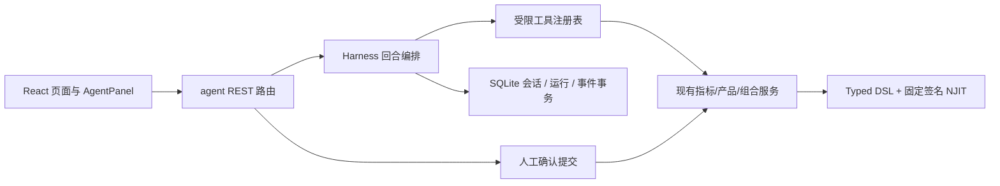
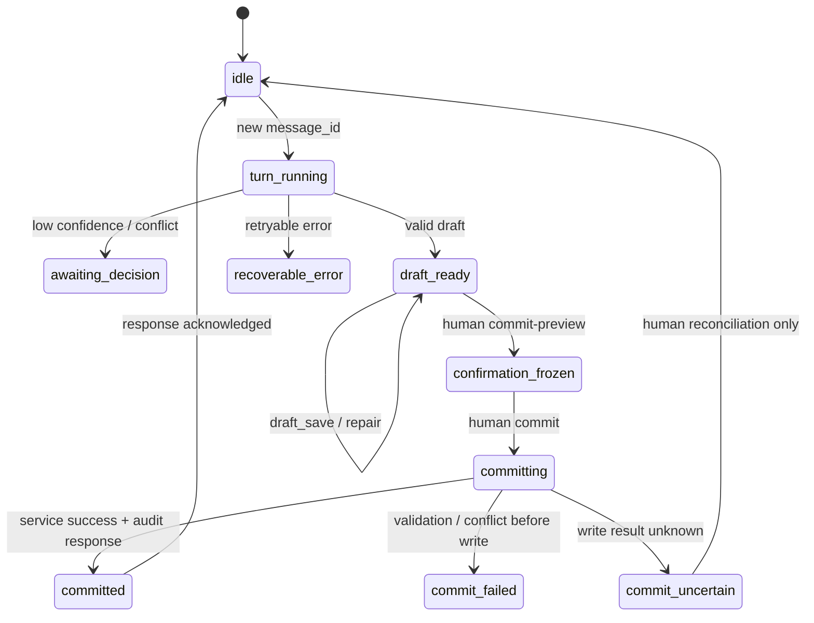

# AI 指标中心 × 产品研究智能体：前后端实施设计

> 日期：2026-09-19\
> 依据：[需求与边界设计](ai-agent-indicator-product-research-design-2026-09-18.md)\
> 状态：已接入指标中心对话/草稿与 LLM 配置；下文其余能力需逐项对照代码，不能据阶段编号认定全部落地。
> 2026-09-20 Harness 修订：[Harness 无默认上限与无进展检测设计](ai-agent-harness-progress-design-2026-09-20.md)；无默认次数上限、检测与恢复核心链路已实施，验收结果见该文第 18 节。
> 范围：指标中心、产品研究、会话智能体、前端 UI 动作层\
> 基线：源码 `8a513575cda106ebdf433d6ac489b18def983fa1`；实施前须按符号重新核对行号。

## 1. 设计结论

智能体是现有指标服务之上的薄编排层：它负责理解请求、调用白名单工具、保存会话草稿和生成待确认动作；指标校验、编译、NJIT 预热、产品计算和版本化保存仍由现有服务负责。

实现分成五层：



有三条不可跨越的边界：

1. LLM 只能生成提案，不能直接写指标目录、评价方案、产品池、快照配置或前端持久化偏好。
2. 未保存指标预览必须走 `validate → compile_token → evaluate/evaluate-series`；已保存的多指标批量计算才使用 `prepare_evaluation → evaluate`。
3. `single_product` 和 `portfolio` 是两个计算域。v1 的组合页只读已有不可变组合运行快照，不新增组合指标作者和组合序列编辑器。

本设计不增加外部 agent runtime、MCP 工具、浏览器控制权、前端依赖或第二套数值计算引擎。

## 2. 现有代码接入事实

| 能力 | 现有真相 | 实施接入 |
|---|---|---|
| 指标服务 | `backend/services/custom_indicator_routes.py` 创建模块级 `indicator_service`；`backend/app.py` lifespan 负责启动和关闭计算引擎 | agent handler 必须复用此单例，禁止重新 `CustomIndicatorService()` |
| 指标校验 | `/api/custom-indicators/validate` → `CustomIndicatorService.validate`；typed 路径生成并持久化编译计划和 `compile_token` | `metrics.validate` 直接调用同一 service |
| 单产品评估 | `/evaluate`、`/evaluate-series`，参数包含 target、period、as_of、compile_token | `metrics.preview`、`products.eval`、`products.series` 共用同一适配器 |
| 组合评估 | `/evaluate-portfolio` 只接受 `run_id`、`indicator_ids`、可选 portfolio inline 定义和 token | `portfolios.context`、`portfolios.eval` 只读当前 run |
| 指标保存 | `create_indicator` / `update_indicator` 在写仓库前校验并预热 | `commit.py` 唯一调用入口；不直写 repository |
| editor-state | `graph_service.save_state` 要求已保存 indicator revision、定义指纹和 `expected_editor_revision` | agent 草稿不能写 editor-state；“发送到编辑器”只改页面内存 |
| PIT | `pit_as_of` 与 `resolve_request_context` 读取系统、页签和请求显式口径 | agent 回合冻结解析后的研究日、模式、数据版本和 generation |
| 前端公式真相 | `IndicatorStudio` 的 `editable_latex` / expression，`display_latex` 是展示结果 | UI 动作写可执行文本，不能把展示公式倒灌为源码 |
| 视觉资产 | `components/Mascot.tsx` 映射 6 个已有 WebP；源图在 `images/`，生产路径在 `frontend/public/homepage/images/` | 复用状态和组件，不直接引用 PNG，不新增动画 |

服务端状态码沿用现有领域异常：请求校验和指标 `ValidationError` 返回 422，冲突返回 409，找不到返回 404；agent 自己的 LLM、执行和确认错误在 agent 路由层映射，不能写成统一 400。

## 3. 后端实施设计

### 3.1 模块目录

```text
backend/agent/
├── __init__.py
├── __main__.py                 # dump / smoke；不启动真实 LLM
├── contracts.py                # Pydantic 外部契约，extra=forbid
├── catalog.py                  # 从现有 meta/registry 生成目录快照
├── scopes.py                   # 两个 scope、页面、工具和计算域白名单
├── router.py                   # scope × action × context 判定
├── context.py                  # PageContext、PIT、数据 generation 冻结
├── tools/
│   ├── __init__.py              # 注册表、参数校验、handler 白名单
│   ├── indicator_center.py      # lookup / validate / infer / preview / excel
│   ├── product_research.py      # products 与 plans 的只读投影
│   └── portfolio.py             # run 摘要与 portfolio 指标只读计算
├── harness.py                  # 回合、无进展检测、恢复、压缩、模型提案装饰
├── llm.py                      # LLMClient、HttpxClient、FixtureClient
├── sessions.py                 # SQLite 会话/run、短事务、幂等事件
├── memory.py                   # 提案、人工接受、追加审计
├── commit.py                   # commit-preview、确认快照、唯一写入口
├── ui.py                       # UiSurface、UiActionBatch、回执校验
├── routes.py                   # /api/agent/*
└── prompts/
    ├── system.md
    ├── indicator_center.md
    ├── product_research.md
    └── compaction.md
```

`backend/agent` 只新增编排代码。数值计算不得复制到该目录；handler 通过现有路由模块的 `indicator_service`、现有产品服务和组合服务调用真实实现。

### 3.2 服务所有权

| 文件 | 只负责 | 禁止负责 |
|---|---|---|
| `contracts.py` | 请求、响应、模型输出、错误结构 | 业务计算、默认猜测、权限判断以外的副作用 |
| `catalog.py` | 由 `indicator_service.meta()`、变量注册表和算子注册表生成版本化说明书 | 手写算子、手写变量事实 |
| `context.py` | 解析 PageContext、冻结 PIT 与 context hash | 修改系统 PIT 设置 |
| `tools/*.py` | 参数校验、服务调用、结果截断、错误转译 | 直接读写 JSON、直接编译第二套计划 |
| `harness.py` | LLM 回合、无进展检测和执行控制 | 判断数学正确性、修改定义口径 |
| `sessions.py` | 会话事件、草稿版本、request/message 幂等 | 指标仓库写入 |
| `commit.py` | 确认快照、影响面投影、调用唯一 service 写入口 | 直接调用 `repository.create/update` |
| `routes.py` | HTTP 状态码、鉴权前的结构校验、router 注册 | LLM prompt 拼接、数值计算 |

### 3.3 运行与存储

agent 路由加入 `backend/app.py` 现有 `include_router` 区域。LLM 未配置时只返回 `GET /api/agent/meta` 的 `configured=false`，不阻止应用 lifespan；现有 NJIT 预热失败仍按应用既有规则失败关闭。

当前会话运行存储已调整为标准库 SQLite，事件、回执、草稿与检测状态以短事务提交；路径守卫、旧 JSON 导入、崩溃恢复和容量规则统一见 [Harness 无默认上限与无进展检测设计](ai-agent-harness-progress-design-2026-09-20.md) 第 9 节。LLM 配置保留原安全存储，长期记忆仍须人类确认。

指标目录与 agent 状态不是跨存储事务。指标写前记录 intent，写成功而回执未知时必须持久化 `AGENT_COMMIT_UNCERTAIN`，禁止自动新建第二个指标。

### 3.4 核心契约

对外模型统一 `extra='forbid'`；服务端生成哈希、token、revision、工具轨迹和预览状态，不能信任 LLM 回传的同名字段。

```python
class PageContext(Contract):
    page: Literal[
        "indicator-studio", "product-detail", "product-research",
        "product-compare", "holding-diagnosis", "evaluation-plan",
    ]
    page_instance_id: str
    context_revision: int
    view_state: Literal["unknown", "inherit", "explicit", "off"]
    calculation: SingleProductContext | PortfolioContext

class SingleProductContext(Contract):
    context_kind: Literal["single_product"]
    targets: list[EvaluationTarget] = Field(default_factory=list, max_length=10)
    period: str
    as_of: str | None = None

class PortfolioContext(Contract):
    context_kind: Literal["portfolio"]
    run_id: str

class AgentMessageRequest(Contract):
    message_id: str
    expected_session_revision: int
    text: str | None = None
    page_context: PageContext
    surface: UiSurfaceSnapshot | None = None
    ui_results: list[UiBatchReceipt] = []
    decision: DecisionResolution | None = None
```

会话草稿至少包含 `draft_revision`、`valid`、规范化 `definition_hash`、`context_hash`、`catalog_version`、服务端派生的 `display_latex`、`editable_latex` 和 diagnostics。指标 revision、editor revision、draft revision 三者不能复用同一字段。

### 3.5 工具白名单

| 工具 | 计算域 | 服务入口 | 写入 |
|---|---|---|---|
| `metrics.lookup` | single_product / portfolio | 指标摘要与现有 meta 的 variables/operators 契约，按 kind 检索 | 无业务写入 |
| `metrics.rolling_draft` | single_product | `derive_rolling_series` + 现有参数绑定/校验 | 仅当前会话草稿 |
| `metrics.validate` | single_product | `indicator_service.validate` | 编译计划缓存可能写入；不写指标目录 |
| `metrics.infer` | single_product | `indicator_service.infer` | 无业务写入 |
| `metrics.availability` | single_product | `indicator_service.availability` + `pit_as_of` | 无业务写入 |
| `metrics.preview` | single_product | validate 后 token → evaluate/evaluate-series | 结果缓存按现有契约处理 |
| `metrics.excel` | single_product | 同一 token → export-excel | 仅临时导出文件 |
| `metrics.draft_save` | 当前会话 | `sessions.save_draft` | 只写当前会话 |
| `products.search` | single_product | 既有 instrument_search；真实候选暂存在当前会话 | 无业务写入 |
| `products.eval` | single_product | 锁定 refs 或 validate inline → evaluate | 无业务写入 |
| `products.series` | single_product | 锁定 refs 或 validate inline → evaluate-series | 无业务写入 |
| `products.plans` | single_product | 当前方案引用投影 | 无；不返回正文 |
| `portfolios.context` | portfolio | `portfolio_runs.get(run_id)` 的冻结摘要 | 无 |
| `portfolios.eval` | portfolio | `evaluate_portfolio(run_id, indicator_ids)` | 无；不接产品 targets |

明确不存在 `create/update/delete indicator` 工具。`commit-preview` 和 `commit` 是人类触发的 API，不进入 LLM tool schema，也不进入 `ui.act`。

### 3.6 API 设计

运行句柄、事件订阅、停止与上下文失效的新增接口统一见 Harness 设计第 12 节；下表保留业务入口，不构成完整运行控制清单。

| 方法 | 路径 | 所有者 | 关键输入 | 关键输出 |
|---|---|---|---|---|
| GET | `/api/agent/meta` | routes | 无 | configured、model、catalog_version、scopes、limits |
| POST | `/api/agent/sessions` | sessions | speaker、PageContext、可选 Surface | session_id、session_revision=0、scope、state |
| GET | `/api/agent/sessions` | sessions | limit | 有界会话索引 |
| GET | `/api/agent/sessions/{id}` | sessions | event_from | state、events、pending 状态 |
| POST | `/api/agent/sessions/{id}/messages` | harness | message_id、expected revision、text/decision/ui_results、最新 PageContext | AgentTurnResponse 或纯回执结果 |
| POST | `/api/agent/sessions/{id}/commit-preview` | commit | draft_revision、definition、可选样例 target、PageContext | confirmation_id、冻结 definition hash、impact、preview_status |
| POST | `/api/agent/sessions/{id}/commit` | commit | request_id、confirmation_id、hash、draft_revision、confirmed=true | indicator_id、revision、refresh、impact |
| POST | `/api/agent/sessions/{id}/memory` | memory | proposal_id、accept/reject、speaker | 幂等处理结果 |
| POST | `/api/agent/sessions/{id}/scope` | sessions | scope | 新 scope、session_revision |

`routes.py` 复用 `StableValidationRoute`；请求结构错误返回 422，领域冲突 409。所有端点的 response 都带 `request_id` 或 `session_revision`，方便前端重试和审计关联。

### 3.7 PIT 与计算上下文

`context.py` 在每个回合开始执行：

1. 校验 page、page_instance、context_kind 和页面白名单。
2. `view_state=unknown` 时允许讨论、公式校验与人工保存定义，仅阻断产品数据检查和实际计算；`off` 只有在页面已显式选择并发送 `x-pit-off` 时成立。
3. 单产品使用 `resolve_request_context` 解析系统设置、页签覆盖和显式 as_of，并保存 `as_of/run_mode/data_release_id`。
4. 组合只读取 run 中的 `requested_as_of/effective_as_of`、窗口、来源和数据指纹；不使用当前页面设置重写历史 run。
5. 生成 `context_hash`，并将 catalog version、指标 refs、参数签名、数据 generation 纳入预览和确认快照。
6. 产品、run、窗口、研究口径、数据 generation 或 page_instance 变化时，废弃旧预览、compile token、confirmation 和 UI batch。

### 3.8 回合状态机

以下是业务草稿/确认流程；运行层另使用 Harness 设计第 5 节的 run 状态，不将两套状态混为一个枚举。停止/暂停/中断协议以 Harness 文档为准。



同一会话只能有一个 `turn_running`。重复 `message_id` 返回已有结果；旧 `expected_session_revision` 返回 409；`commit_uncertain` 期间禁止生成新的提交。

### 3.9 预览与提交序列

单产品 inline 预览：

```text
ModelTurnDraft.definition
  → server normalize + validate
  → compile_token / definition_hash / context_hash
  → availability(as_of)
  → evaluate 或 evaluate-series
  → truncate result for prompt + full bounded result handle for UI
```

提交：

```text
human edits name/description
  → commit-preview
  → validate + impact projection + freeze confirmation_id
  → human sees formula, context, impact, preview status
  → commit(request_id, confirmation_id, definition_hash, confirmed=true)
  → compare draft/context/hash
  → indicator_service.create_indicator/update_indicator
  → refresh catalog + return id/revision
```

现有 service 会在仓库写入前完成校验与预热，因此 agent 不增加第二次写前编译。提交失败保留草稿；写入结果不确定只允许人工核对。

### 3.10 错误和可观测性

#### 2026-09-20：模型网关工具调用兼容修复

实际请求被网关以 HTTP 400 拒绝，原因是 `metrics.lookup` 等内部工具 ID 含点号。先前 HTTPError 被统一处理为“上游不可用”，掩盖了参数错误。

`HttpLLMClient` 在 HTTP 边界把点号替换为下划线，校验 1–64 位合法名称并拒绝别名冲突；工具定义和历史 assistant tool_calls 都转换。响应按本轮工具表还原内部 ID，call_id、参数和工具结果保持一致，不改工具白名单或计算服务。

接口仍用 HTTP 502 表示模型调用失败，但 detail.code 区分 `AGENT_LLM_REQUEST_REJECTED`、`AUTH_FAILED`、`RATE_LIMITED`、`ENDPOINT_NOT_FOUND`、`TIMEOUT` 和 `INVALID_RESPONSE`（后五项同样以 `AGENT_LLM_` 为前缀）；上游 HTTP 失败额外返回 upstream_status。提示来自本地固定文案，不回显网关正文、密钥或用户 prompt。

验收：模型客户端、agent API、配置测试共 26 项通过，覆盖双轮工具调用、别名冲突、HTTP 错误分类与脱敏。使用已保存模型配置的真实 Chat Completions 请求完成工具调用及结果回传；未变更用户的模型、接口地址、密钥或推理档位。 后端重启且 NJIT/worker 就绪后，通过前端代理发送“怎么计算滚动平均收益率？”返回 HTTP 200 和正常回答（该回合未调用工具）。

| 错误码 | HTTP | 前端行为 |
|---|---:|---|
| `AGENT_NOT_CONFIGURED` | 503 | 显示未启用，不显示重试 |
| `AGENT_LLM_UNAVAILABLE` | 502 | 保留草稿，显示重试 |
| `AGENT_SESSION_BUSY` | 409 | 读取当前会话状态 |
| `stop_reason=no_progress` | 200 / run.paused | 显示具体阻碍，保留草稿与证据，可补充要求后继续；非供应商额度错误 |
| `AGENT_CONTEXT_CHANGED` | 409 | 丢弃旧证据，重新解析上下文 |
| `AGENT_CONFIRMATION_STALE` | 409 | 重新 commit-preview |
| `AGENT_COMMIT_UNCERTAIN` | 409 | 禁止自动重放，转人工核对 |
| `VALIDATION_ERROR` | 422 | 定位节点/字段 diagnostics |
| `REVISION_CONFLICT` | 409 | 显示当前 revision 与 rebase 选项 |

每个事件写入：session_id、message_id、request_id、speaker、scope、context_hash、catalog_version、tool、round、duration_ms、status、error_code、摘要长度。禁止写入 token、完整 prompt、完整数值表和 API key。


### 3.11 无产品的交流与指标创作（2026-09-20）

- 会话 `targets` 默认为空；交流、澄清、生成、校验、填入编辑器和人工保存指标均不要求产品。`commit-preview.target` 仅为可选样例引用，不是指标定义的必要输入；无产品时返回 null。保存公式不代表完成产品试算。
- 模型生成公式前通过 `metrics.lookup(kind=variables/operators)` 查询现有变量和算子；`metrics.validate` 复用路由 ValidateRequest 的 schema、默认 DSL 版本及同一 service 校验，避免缺省版本退回旧解析器。
- 数据可用性和预览才要求真实产品；没有目标时返回 `AGENT_PREVIEW_TARGET_REQUIRED`，保留公式草稿。未知 PIT 只阻断数据计算，不阻断纯定义创作；off 仍须有一致的显式请求头。
- 人类请求试算时，AI 可调用 `products.search` 检索样例，经 `metrics.availability` 检查后，将返回的 kind/product_id 显式传给 `metrics.preview.target`。代码只接受页面已选或本会话刚检索的真实候选；不得猜造产品代码。候选不等于数据可用，真实计算继续遵守既有 PIT、缺失与 compile_token 门禁。
- AI 说明样例名称、代码、选择依据、周期与研究日；样例不写入指标定义、不替换页面选中项。上下文变化清除候选；组合域不能用该检索或预览路径创作单产品指标。
- 验证覆盖无产品多轮交流、校验、人工保存、预览缺目标、未知口径、AI 检索样例及过期候选。隔离工作区真实模型验证：无需产品生成 `mean(adjusted_high - adjusted_low)`，同一指标服务校验通过，无产品数值试算、无指标目录写入。30 项后端测试、1258 项前端测试、12 项浏览器测试通过；服务重启后真实网页两轮请求均 HTTP 200、targets=[]，第二轮生成有效草稿并成功填入编辑器，未保存业务指标。

### 3.12 执行策略与滚动指标（2026-09-20）

当前默认不限制工具调用次数和模型往返轮数，采用无进展检测、有限纠偏、逐步 checkpoint、停止/恢复与上下文压缩。完整实现与验收见 [Harness 设计](ai-agent-harness-progress-design-2026-09-20.md) 第 18 节。下方旧版本测试数字仅为此前滚动派生功能的历史记录，不能替代本次验收。


目录检索支持多关键词相关匹配，优先返回更相关条目。目录过长时按完整条目缩减并注明截断与数量；模型收到完整 JSON，禁止按字符剪断工具 JSON。

滚动时序需求优先查找已有标量指标 id/revision，再由 metrics.rolling_draft 调用现有 derive_rolling_series。窗口可变时复用 inspect_parameter_inputs/bind_parameter_input，开放唯一 rolling_apply 窗口并重新校验；不重新实现夏普算法，不改来源定义，不选产品、不写指标库。来源版本的无风险利率、年化、窗口缺失语义继续保留；若用户要求不同口径，先澄清再调整。

此前版本的真实模型复核同样的“滚动夏普、时序向量、窗口可变”请求，使用目录查询和滚动派生共 2 次工具调用生成有效草稿，默认窗口 20，开放整数窗口参数。相关验收覆盖即时气泡、思考中、失败重试不重复、上限前缀执行、草稿保存和继续、多关键词与完整 JSON，以及现有滚动算法/参数契约复用。 33 项后端测试、1259 项前端测试、15 项浏览器测试通过；重启后真实网页同一需求返回 HTTP 200，2 次工具调用生成有效的可变窗口时序草稿，用时约 23 秒，未保存指标库。

## 4. 前端实施设计

### 4.1 文件树

```text
frontend/src/
├── services/agent.ts
├── components/agent/
│   ├── AgentLauncher.tsx
│   ├── AgentPanel.tsx
│   ├── AgentMessageList.tsx
│   ├── AgentComposer.tsx
│   ├── AgentDraftCard.tsx
│   ├── AgentCandidateCard.tsx
│   ├── AgentDecisionCard.tsx
│   ├── AgentCommitBar.tsx
│   ├── AgentToolTrace.tsx
│   ├── AgentMemoryProposal.tsx
│   ├── AgentActionChip.tsx
│   ├── AgentWelcome.tsx
│   ├── useAgentSession.ts
│   ├── useAgentSurface.ts
│   └── agentTypes.ts
├── app/agent/
│   ├── pageContext.ts
│   ├── surfaceRegistry.ts
│   └── draftSelection.ts
└── pages/
    ├── IndicatorStudio.tsx
    ├── ProductDetail.tsx
    ├── ProductResearch.tsx
    ├── ProductCompare.tsx
    ├── EvaluationPlan.tsx
    └── HoldingDiagnosis.tsx
```

不新增路由；每个页面挂载 `AgentLauncher`，右下角非模态浮窗由 `AgentPanel` 承载。

### 4.2 页面适配器契约

```ts
export interface AgentPageAdapter {
  page: AgentPage
  getContext(): PageContext
  getSurface(): UiSurfaceSnapshot
  onCommitted?(response: CommitResponse): void
  applyDraft?(draft: IndicatorDraft): Promise<{ applied: boolean; reason?: string }>
}

export interface AgentSurfaceField {
  target: string
  kind: UiFieldKind
  label: string
  getValue(): unknown
  setValue(value: unknown): void
  constraints: FieldConstraints
  effect: 'local_state' | 'read_query'
}
```

适配器只能暴露页面已有 setter 和只读查询。会写 localStorage、editor-state、评价方案或产品池的函数不直接注册为 setter。

| 页面 | v1 暴露 | v1 禁止 |
|---|---|---|
| IndicatorStudio | expression、name、description、result_kind、参数、校验、预览 | 自动保存指标、写 editor-state、覆盖未保存编辑 |
| ProductDetail | 当前产品、周期、as_of、指标临时选择、查询 | 自动写展示偏好、改变产品数据 |
| ProductResearch | keyword、条件列表、排序、查询提交 | 臆造 condition_fields、持久化筛选以外的业务对象 |
| ProductCompare | 比较产品、指标临时选择、周期 | 修改产品池和评价方案 |
| EvaluationPlan | 指标目录只读、当前产品选择 | 写评价方案、写快照配置 |
| HoldingDiagnosis | run_id 摘要、组合指标只读刷新 | 创作组合指标、修改 run、加入单产品指标 |

### 4.3 AgentPanel 组件职责

```text
AgentLauncher
└── AgentPanel
    ├── header: scope chip / session menu / close
    ├── AgentMessageList role=list aria-live=polite
    │   ├── UserMessage
    │   ├── AssistantMessage
    │   ├── AgentToolTrace details/summary
    │   ├── AgentDraftCard
    │   ├── AgentDecisionCard
    │   ├── AgentActionChip
    │   └── AgentMemoryProposal
    ├── AgentCommitBar
    └── AgentComposer
```

复用 `Card`、`Button`、`Badge`、`SectionHeader`、`EmptyState`。KaTeX 复用现有依赖；消息正文按纯文本/受限 Markdown 渲染，不渲染任意 HTML。

### 4.4 前端状态与数据流

长运行的目标数据流为异步 run 句柄、已提交事件、停止/继续和断线恢复，见 [Harness 无默认上限与无进展检测设计](ai-agent-harness-progress-design-2026-09-20.md) 第 12–13 节；以下整轮响应流程是兼容模式，仍由同一个 runner 执行。

发送时先将人类消息追加至本地对话并清空输入框，再创建会话/请求模型；不能等成功回复后才显示消息。等待回复时在对话流显示“思考中…”，滚动仅作用于消息区。失败保留气泡，提供同 message_id、原始上下文和 revision 的重试，不追加重复人类消息；成功后只追加 AI 回复。

`useAgentSession` 管理：

- `sessionId`、`sessionRevision`、`scope`、`pageContext`、`surface`；
- `events`、`draft`、`pendingDecision`、`usage`；
- `inFlightMessageId`、`loading`、`error`；
- `uiBatches`、每个 batch 的 action receipts；
- `confirmationId` 和确认快照摘要。

发送流程：

```text
页面状态 → getContext/getSurface
  → POST /messages(message_id, expected_session_revision)
  → AgentTurnResponse
  → 服务端已验证 draft/ui_batch 渲染
  → UI batch staged apply
  → POST /messages(ui_results only)
```

纯 UI 回执不触发新 LLM 回合。刷新页面后只恢复历史 batch，不自动重放动作。

### 4.5 UI 动作批次与撤销

`useAgentSurface` 为每个页面实例建立 `revisionRef`。字段状态变化递增 revision；批次绑定 `page_instance_id`、`context_hash`、`base_revision`。

1. 前端整批检查 target、kind、枚举、范围、计算域和 revision。
2. 依次执行动作；每次成功更新 revision 游标并记录 old/new。
3. 人类编辑、切页、上下文变化或某动作失败时停止剩余动作，已执行前缀明确回执。
4. 撤销前确认页面仍处于该批次结束 revision 且字段值未被人类改写；否则拒绝撤销。
5. `submit` 仅允许命中注册的只读查询或公式校验动作，且最多一个、必须最后执行。
6. 目标、窗口、as_of 或 run_id 的变更不得和依赖新上下文的计算同批。

### 4.6 卡通牛资产设计

复用现有源图和组件：

| 资产 | 现有文件 | Agent 使用 |
|---|---|---|
| 欢迎 | `images/0005.png` → `mascot-welcome-240.webp` | 右下角对话入口；小屏 64px、桌面 80px，同屏一处 |
| 成功 | `images/0008.png` → `mascot-success-96.webp` | commit 成功确认条；不与收益、风险、PIT 数值同排 |
| 工作中 | `images/0006.png` → `mascot-working-160.webp` | Agent 面板不使用，避免和页面加载态抢状态；面板用骨架和文本 |
| 错误 | `images/0003.png` → `mascot-error-240.webp` | Agent 面板不使用；错误附近使用文字+重试 |
| 空态 | `images/0010.png` → `mascot-empty-240.webp` | Agent 面板不使用；沿用局部纯文字空态 |
| 无结果 | `images/0011.png` → `mascot-noresult-240.webp` | Agent 面板不使用；产品结果区遵守原页面禁区 |

`Mascot.tsx` 是唯一状态映射；不在 `Agent*.tsx` 中直接引用 PNG，不新增动画。由于工作台面板经常紧邻收益、净值、风险和 PIT 信息，消息区不放吉祥物；欢迎牛常驻于独立入口（准则 15.6 的用户授权例外），不再在空态或成功条中重复显示。

### 4.7 响应式和可达性

- 右下角悬浮对话窗宽 420px，小屏保留至少 12px 边距，高度随动态视口收缩；页面主体不锁滚动。
- Portal 脱离页面层叠上下文，浮层高于导航；只有消息区滚动，标题与输入区固定可见。关闭按钮、`Escape`、再次点击小牛都能收起并交还焦点，保留输入与对话。
- 消息列表 `role=list`，新消息 `aria-live=polite`；工具轨迹使用原生 `details/summary`。
- 公式、动作 chip 和表格不得产生横向溢出；320px、768px、1440px 均验收。
- 加载/空/错误/禁用四态完整；禁用按钮说明原因。
- 使用现有 accent、slate、emerald、amber、rose 令牌；不引入 AI 紫色、动画库或新图标家族。

## 5. 测试与验收设计

### 5.1 后端

新增：

```text
backend/tests/test_agent_catalog.py
backend/tests/test_agent_scopes.py
backend/tests/test_agent_context.py
backend/tests/test_agent_harness.py
backend/tests/test_agent_commit.py
backend/tests/test_agent_memory.py
backend/tests/test_agent_api.py
backend/tests/test_agent_boundaries.py
backend/tests/test_agent_ui.py
```

关键断言：

- `indicator_service` 是唯一实例；agent 不重新构造 service。
- inline 预览必须使用 validate 返回的 token；prepare 不生成 inline token。
- portfolio 工具只读 immutable run，不调用 single_product targets。
- 业务写工具只有 session draft；LLM、ui.act 不能触发 commit。
- commit-preview 后修改名称、参数、context 或 definition hash 必须失效；重复 request_id 不重复创建。
- 422、409、404、502、503、429 错误码和 Retry-After 语义保持稳定。
- 会话恢复、旧 token、旧 surface、旧 UI receipt 都失败关闭。

### 5.2 前端

新增组件测试：

```text
AgentPanel.test.tsx
AgentDraftCard.test.tsx
AgentCommitBar.test.tsx
AgentActionChip.test.tsx
agent.test.ts
surface.test.tsx
```

E2E：

- `agent-panel.spec.ts`：ProductDetail → 自然语言 → draft → validate/token → preview → commit-preview → 人工 commit → 目录刷新。
- `agent-context.spec.ts`：产品切换、PIT 变化、run 切换使旧响应失效；HoldingDiagnosis 只读组合工具。
- `agent-ui-actions.spec.ts`：条件动作、公式临时填入、动作拒绝、部分执行、撤销冲突。
- `agent-mascot.spec.ts`：小牛入口资产、关闭与恢复、数据面板不出现 mascot。

### 5.3 设计与构建检查

```sh
npm run design:check --prefix frontend
npm run test --prefix frontend -- --run
node frontend/node_modules/typescript/bin/tsc --noEmit --project frontend/tsconfig.json
npm run build --prefix frontend
node scripts/check_i18n.mjs
python3 skills/ai-hermes-self-evolve/scripts/validate_ai_routing.py
```

后端按实现阶段的 `repo_map` minimum regression 执行；fixture 模式禁止网络和真实数据目录污染。浏览器验收覆盖 320/768/1440 视口、键盘关闭、焦点返回、对比度和无 mascot 禁区。

## 6. 实施顺序

| 阶段 | 主要文件 | 完成标准 |
|---|---|---|
| P0 | `backend/agent/contracts.py`、`catalog.py`、`scopes.py`、`tools/__init__.py` | 目录快照、工具白名单、scope/context 校验通过 |
| P1 | `sessions.py`、`llm.py`、`harness.py`、`router.py`、`routes.py`、`app.py` | Fixture 对话、无进展检测、恢复和错误状态通过；LLM 未配置不影响主应用 |
| P2 | `context.py`、`tools/indicator_center.py`、`tools/product_research.py`、`tools/portfolio.py` | PIT、token、单产品/组合边界和真实结果句柄通过 |
| P3 | `commit.py`、`memory.py` | commit-preview、幂等 commit、revision 冲突、人工记忆提案通过 |
| P4 | `services/agent.ts`、AgentPanel 组件、IndicatorStudio adapter | 指标中心闭环，提交后目录刷新，编辑器仅人工导入 |
| P5 | 五个产品研究页 adapter、临时指标选择、HoldingDiagnosis 只读 adapter | 产品研究主链、组合只读和上下文失效通过 |
| P6 | `ui.py`、`useAgentSurface.ts`、动作 chips、撤销审计 | UI batch、部分执行、撤销冲突和 accessibility 通过 |
| P7 | compaction、session list、性能与文档路由 | 长会话、目录分类、路由记忆和全量验收完成 |

每个阶段完成后更新 `docs/repo_map.json`、`docs/task_routes.json`、必要的 `docs/pitfalls.json`，运行 AI Hermes 校验；不把实现级设计当成已完成代码。

## 7. 明确不做

- 不新增组合指标作者、组合时序指标、组合 editor-state 或组合 Excel 设计。
- 不自动写评价方案、快照配置、产品池、展示偏好或浏览器 localStorage 业务数据。
- 不添加浏览器自动化、截图点击、MCP 工具、外部 agent runtime 或多智能体编排。
- 不生成新算子、自由 Python/Numba、第二套指标运行时或 Python fallback。
- 不把编译缓存、临时导出文件和业务指标目录混为同一持久化层。
- 不以卡通牛替代错误、PIT、风险、收益或会计事实说明。

## 8. 待实施前确认的事实

下列内容在本设计中保留为实施前核对项：

1. `product_analysis`、`research_series` 的完整内部读接口需在实现对应工具时单独核对。
2. 产品研究页面的共享页头挂载位置需按实际组件结构选择，不复制页头。
3. 产品筛选字段名和单位由运行时 `condition_fields` 决定，不能写死。
4. LLM 实际供应商配置、耗时、模型输出质量和大消息性能要在 fixture 与浏览器环境中验证。
5. 所有源码行号以实现前当前符号为准；本设计只锁定职责和契约，不锁定可能漂移的行号。

## 2026-09-20 对话成果归属与多 API 配置

平台统一使用“AI 助手”的名称；业务工具按当前页面授权，目前首先接入指标中心。草稿和试算操作归属产生它们的运行与回复，不作为会话底部的全局卡片。服务端从已提交的 `draft.updated`、`preview.updated` 事件汇总每轮 `artifacts`；终态回复及历史分页返回对应快照，纯讨论轮次返回空成果，不复用会话当前草稿冒充该轮产物。旧回复从同一 run 的已提交事件重建；没有证据的旧消息不推测关联。

历史草稿仅支持填入编辑器后重新校验保存，当前草稿仍走现有人类确认提交。`GET /api/agent/sessions/{session_id}/previews/{preview_id}?historical=true` 允许明确查看本会话已发布过的历史试算；按持久化事件与文件快照校验归属和哈希，继续执行过期检查，不重放计算，不放宽默认当前结果接口的失效校验。查看期间手动修改条件时，迟到结果不得覆盖新条件。

`llm_settings.json` 使用 schema 2：`profiles` 保存带稳定 ID 的独立配置，`active_profile_id` 指定唯一使用项。旧单组配置读为默认使用项，下一次配置写入时原子持久化为 schema 2；不复制密钥到会话库。新增或编辑配置不自动启用、不借用其他配置密钥。模型客户端只读取当前使用项；无使用项或该项未配置密钥时关闭模型调用，不回退备用服务。已启动的运行保持该轮绑定的客户端，新请求使用新的选择。

- `GET /api/settings/llm`：返回配置列表、使用项及脱敏状态。
- `POST /api/settings/llm/profiles`：新增未启用配置。
- `PUT /api/settings/llm/profiles/{profile_id}`：修改指定配置，省略密钥保留该项现有值。
- `PUT /api/settings/llm/active`：指定使用项，传 null 停用。
- 既有 `PUT /api/settings/llm` 保留为当前使用项的薄适配，委托同一存储实现。

验收覆盖：两轮成果分离、流式更新及历史恢复、旧会话重建、历史试算会话隔离和过期、API 配置迁移、密钥独立与脱敏、明确切换及停用不回退，以及手机、平板和桌面交互。

### 2026-09-20 模型思考等级与 OpenCode Go

每组 LLM API 独立保存 `reasoning_effort` 与 `timeout_seconds`，随当前使用项读取，在本轮运行创建客户端时固定。新增与编辑不自动切换使用项。存量配置保持 `default` / 60 秒；省略字段保留原值，显式 `default` 恢复服务默认。超时可设 10–1800 秒，是单次模型请求及重试共用的截止时间，不是整轮工具或对话次数预算；前端提示 max 可选 600 秒。等待仍可停止。

配置提供 default、none、minimal、low、medium、high、xhigh、max。当前接口是 Chat Completions：非 default 原样发送 `reasoning_effort` 并省略固定 temperature；default 不额外指定思考参数。各模型支持的档位由上游决定，拒绝参数时明确报错，不偷偷降级。DeepSeek 另发送 `thinking.type=enabled/disabled`（none 为 disabled），max 使用原模型 ID，例如 `deepseek-v4.1-flash`，不拼接模型名后缀。这里不宣称支持 Anthropic Messages、Gemini 原生接口或 Responses 的专用思考协议。

DeepSeek 工具续调需要的 `reasoning_content` 原样留在服务端消息及检查点中，包括最终回复的协议上下文；不出现在公开会话、事件、回复或 UI。继续对话与工具结果回传保留它，已有无思考数据的消息在 DeepSeek 请求边界补空字段。切换 API 地址或模型时去除旧模型的思考字段，保留普通对话和工具证据。已有上下文压缩与容量边界继续有效，不能靠截断一个未结束的工具交换来省空间。

请求目标为 HTTPS `opencode.ai/zen/go/v1/` 时发送真实客户端 `User-Agent: AiFunctions/1.0` 和稳定的本项目会话 ID `x-opencode-session`；同会话的工具往返、跨轮请求、压缩请求使用同一标识。缺会话 ID 在请求前报错，其他域名不发送 Go 专用会话头，不伪装成 OpenCode。Go 官方将其定位为编程智能体接入；本项目的使用资格与真实账户的模型可用性由服务方决定，离线契约测试不代表上游已接受请求。

依据（2026-09-20 查询）：[DeepSeek 思考模式](https://api-docs.deepseek.com/guides/thinking_mode/)、[OpenCode Go 客户端要求与端点](https://opencode.ai/docs/go/)、[OpenCode provider transform](https://github.com/anomalyco/opencode/blob/dev/packages/opencode/src/provider/transform.ts)。验收覆盖 API 配置持久化/默认兼容/非法值、max 与其他等级的实际请求体、Go 会话头、工具后及跨轮思考上下文、切换 API 与公开信息隔离、取消/超时/重试、320/768/1440px 页面交互与对比度。
