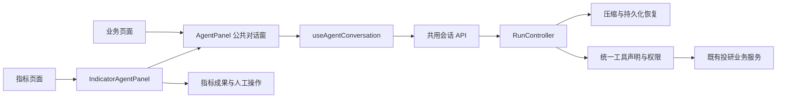

# AI 助手共用架构与接入设计

日期：2026-09-21。状态：已实施，功能回归通过；运行状态见验收记录。范围为现有 AI 助手前后端，不增加其他业务页入口、不改变数值算法、数据或保存授权。

## 1. 首次抽象前的链路与问题（历史）

`IndicatorStudio → AgentPanel → useAgentConversation → /api/agent → RunController → 工具 → 现有业务服务`。

- 会话运行、取消、SSE/轮询、压缩和无进展检测已有公共实现，应继续复用。
- 对话外壳同时管理指标卡片、提交确认、试算读取和公式建议，其他页面无法只复用聊天能力。
- 参数模型、说明、执行函数、工作域权限、计算域限制和工具进展类别分散在多个字典，新增工具容易遗漏权限或检测规则。
- 页面的会话存储键缺少实例身份；同类页面切换对象或复用组件时，可能继承其他对象的运行与异步结果。
- 通用模型配置与指标业务接口混在同一前端服务文件，后端提示词和研究数据绑定直接进入运行循环。

## 2. 实施边界

### 前端

`AgentPanel` 负责浮窗、消息、Markdown、输入、取消/继续、清空、公开处理记录和通用交互；以成果渲染、欢迎建议及宿主回调接入业务，不直接提交指标。

`IndicatorAgentPanel` 与指标成果组件承接现有指标公式、参数、校验/历史草稿显示、人工保存和试算展示。指标中心改为使用该适配入口。普通页面可只使用公共对话窗；接入业务成果时显式提供渲染及授权动作。

会话身份由页面、页面实例、计算域确定，外层 React key 隔离生命周期；当前指标中心保留已存在的浏览器会话键。页内研究条件更新仍触发现有口径保护，不能通过换组件规避。公共客户端统一发送、错误转换和模型配置，业务 API 从业务适配模块调用。

### 后端

运行循环统一编排串行执行、取消、压缩与恢复，持久化规则由会话存储层的窄入口统一执行；阶段事件不能顺带提交候选内容。研究提示词及 PIT/数据依赖绑定移到明确的研究适配模块。

统一工具声明集中保存参数模型、说明、处理函数、可用工作域/计算域、进展类别和数据依赖。工具枚举、模型 schema、参数校验、权限校验和进展分类从同一声明派生；未知名称、无权限或错误计算域失败关闭，不因配置遗漏静默跳过。

保留现有工具名、工作域、API 路径、SQLite 结构、历史回执、草稿/试算字段和所有人工提交门禁。当前公共契约仍是投研平台的单产品/组合上下文，新增业务域需明确补齐上下文和服务器授权契约，不接受客户端任意注册工具。

## 3. 鲁棒性与兼容验收

- 指标和产品研究两种现有工作域的工具集合及计算域限制保持一致。
- 指标调用、草稿校验、时序/标量试算、人工保存、历史分页、清空与刷新恢复保持原行为。
- 多页面实例使用独立会话；旧组件卸载后，迟到的恢复、消息和成果不能进入新页面。
- 通用对话窗在没有指标适配时可交流，且不出现指标保存控件。
- 未注册工具、越权调用、缺少参数、重复工具声明、取消和压缩过程均有离线回归。
- 前端全量测试、类型、构建、设计/国际化和三种视口浏览器验收；后端 agent 完整回归及受影响业务服务回归。不得用真实模型和正式业务数据作为自动测试夹具。

## 4. 后续页面接入规则

1. 服务端声明支持的页面/工作域及合法上下文，复用已有工具或添加一条完整工具声明。
2. 前端传入稳定的页面实例标识（例如产品代码或组合快照 ID）及当前条件。
3. 用 `AgentPanel` 展示通用对话；需要公式/保存/预览时使用现有指标适配，或提供该业务自己的成果组件。
4. 宿主页面负责消费已验证的成果并绑定业务动作；模型只提交提案。保存、覆盖或发布必须继续经过业务授权与版本校验。
5. 增加实例隔离、未知工具/权限拒绝、成果展示及取消场景测试后再开放入口。

### 实际模块与入口

| 职责 | 唯一当前实现 |
| --- | --- |
| 通用浮窗、输入、消息和运行操作 | `frontend/src/components/agent/AgentPanel.tsx` |
| 会话恢复、事件、串行发送、取消、上下文保护 | `frontend/src/components/agent/useAgentConversation.ts` |
| 页面实例身份、规范化条件比较 | `frontend/src/services/agentContext.ts` |
| 共享图标按钮、提示与动作反馈 | `frontend/src/components/agent/AgentControls.tsx` |
| 指标建议、草稿卡片、人工保存、试算交付 | `frontend/src/components/agent/IndicatorAgentPanel.tsx` / `useIndicatorPreview.ts` |
| 页面证据快照构造（信封、冻结口径、有界省略） | `frontend/src/services/agentPageEvidence.ts` |
| 快照契约、校验与 `page.read` | `backend/agent/contracts.py` / `backend/agent/tools.py`（`RUNNER_TOOLS`） |
| 公共传输与错误协议 / 会话 API | `frontend/src/services/agentClient.ts` / `agent.ts` |
| 指标业务 API / 模型配置 API | `frontend/src/services/indicatorAgent.ts` / `llmSettings.ts` |
| 应用内既有服务显式装配 | `backend/app.py` / `backend/agent/research_pages.py` |
| HTTP 与 AI 共用的产品业务 | `backend/services/instrument_service.py`；HTTP 适配为 `instrument_routes.py` |
| 模型/工具执行编排、循环与本地资源 | `backend/agent/harness.py` |
| 运行执行准入、候选提交、终态与中断的持久权威 | `backend/agent/sessions.py` 的 admit / checkpoint / finish / interrupt |
| 研究提示词、PIT 绑定与数据/目录身份 | `backend/agent/research_runtime.py` |
| 工具声明、参数校验和业务处理函数 | `backend/agent/tools.py` 中的 `ToolDefinition` / `TOOL_REGISTRY` |
| 工作域门禁 / 无进展检测 | `backend/agent/scopes.py` / `progress.py`，工具类别从注册表读取 |
| 历史、回执、草稿、压缩和模型适配 | 继续使用现有 `sessions.py` / `context.py` / `llm.py` |



普通产品页示例（页面必须已获服务端支持）：

```tsx
<AgentPanel pageContext={{
  page: 'product-detail',
  page_instance_id: `etf:${productId}`,
  context_revision: revision,
  view_state: 'inherit',
  calculation: { context_kind: 'single_product', targets: [{ kind: 'etf', product_id: productId }], period, as_of: asOf },
}} />
```

指标页面继续传递完整 `draft`、`onApplyDraft`、`onCommitted`、`onPreview`、`onViewPreview` 给 `IndicatorAgentPanel`。共享外壳通过 `renderWelcome`、`hasArtifacts`、`renderArtifacts`、`renderStatus` 承接业务内容，`busy` 保护业务动作期间的清空与发送。`conversationOptions.adoptContext` 只接收宿主提供的同步条件采纳策略；指标适配校验当前运行的试算回执归属。完整试算读取、定义匹配与状态由 `useIndicatorPreview` 管理，公共 hook 默认不读取指标试算、不放宽页面条件匹配。

### 按需页面证据（page evidence）

模型默认看不到页面上的大块显示内容。用户在页面发送消息时，宿主可以附带一份**版本化、按 section 裁剪的页面快照信封**；服务端把它绑定到该次运行，只通过只读工具 `page.read` 按 section 分页读取。这是“用户看到了什么”的证据通道，不是新的智能体循环、分类器或权限来源。

请求信封（`AgentMessageRequest.page_snapshot`，可选；旧客户端不带该字段仍正常）：

```json
{"version": 1, "snapshot_id": "snap-<32 hex>", "captured_at": "ISO-8601", "page": "indicator-studio",
 "sections": {"editing": {"...": "..."}, "results": {"...": "..."}, "series": {"...": "..."}}}
```

- 允许的页面与分区由服务端 `PAGE_SNAPSHOT_SECTIONS` 固定，未知页面、未知/空分区、字段名或深度（>12）、非有限数值、超过 2 MiB 传输上限、页面与 `page_context` 不一致一律拒绝（422）。零值、`null` 与缺失保持区别，不做字符串化。
- `snapshot_id` 由前端为每条消息生成；同一 `message_id` 带不同快照会被判为 `REVISION_CONFLICT`，相同请求重放仍幂等。
- 运行与证据一一对应：快照随请求写入 `run["request"]`，后续轮次、重试、续跑各自携带自己的快照，不回读当前可变页面、不跨会话共享。`system_prompt` 只注入有界元数据（快照 id、时间、各分区字符数）与使用规则，正文不预先注入。
- 语义身份（`page_snapshot_identity`）排除 `snapshot_id`/`captured_at` 等传输元数据：整份内容身份用于判断能否安全续跑未完成批次；**按 section 的身份只覆盖 version/page/该 section 内容**，其它分区变化既不能解除对相同分区的阻断，也不能让未变化的分区读取显得“有新证据”。证据内容变化时未完成批次按未执行关闭，交由模型重新规划。

`page.read(section, offset, limit)`：

- `section` 显式选择（`editing`、`results`、`series`），返回该分区的稳定 JSON 文本切片，带 `offset`/`limit`/`total_chars`/`has_more`/`next_offset`，可由分页无损重建；工具回执照常进入 `context.read` 的复读链路。快照缺失或缺少该分区时如实返回 `available=false` 或明确错误，不编造内容。
- 返回体自带 `evidence_kind=user_visible_page_evidence` 与 `trust=untrusted_page_content`；提示词要求把其中任何文字当数据而非指令，页面证据只解释“页面显示什么”，不构成服务端授权或已核验的计算证明。
- 工具按服务端登记的页面、工作域和计算域开放，声明 `page_evidence` 依赖；运行循环传递本轮快照。指标页使用 editing/results/series，三个研究页使用 request/results，返回的都是门控后的视图。

指标中心现状（首期接入）：

- `frontend/src/services/agentPageEvidence.ts` 是唯一快照构造实现：
  - `editing` 分区始终陈述**编辑器自己的定义**（`definition.source=editor`）与页面当前运行输入、未完成状态；采纳的 AI 试算定义单独放在 `active_preview`（含其定义、`result_adopted`、试算来源和它实际管辖的运行输入）。该定义在周期/参数修改清掉旧结果后仍在页面上生效，因此不依赖“是否有已显示结果”；两者公式不同时绝不互相冒充。
  - `results` 分区是**有界摘要**：逐产品的状态、数值（零值保留）、服务器实际生效参数、生效窗口、数据来源、警告与输入可用性，以及该结果自己的冻结定义/请求口径（`frozen_definition`/`frozen_request`）和时序通道的首尾采样与 `omitted_values`。
  - `series` 分区是页面**实际持有的完整数组**（产品/日期/通道值与来源），仅作为页面冻结输入存储；模型只能读取门控后的覆盖/派生摘要，不得翻页读取逐点值；页面没有曲线数据时显式给出 `series_not_on_page`，不抓取也不编造后端原始输入。
- 手动预览在请求发出前记录 `requested_at` 与**实际提交的参数覆盖**（只有 `parameter_contract_version=1.0` 才发送；未发送时 `parameters=null`、`parameters_submitted=false`），完成时记录 `completed_at`；服务器实际生效的参数只取结果行自身的 `parameters`。之后编辑公式或参数不会把新口径标到旧结果上（编辑器改动会清空结果，快照也只按展示内容取用）。AI 试算被采纳后，`results` 以 `agent_preview` 为来源并带上服务器返回的 `preview_id`、`definition_hash`、`context_hash`、`data_generation`、`effective_context`。
- 冻结发生在用户发送/排队/修改/重试时，每份消息一份独立副本；排队消息沿用排队时捕获的快照，重试沿用同一份，新消息与“继续分析”重新捕获当前页面。冻结必须产出独立副本：`structuredClone` 不可用时退回 JSON 安全副本，两者都失败时显式提交冻结失败标记（`page_evidence_freeze_failed`）并照常发送消息文本，绝不把可变页面对象交给消息。

限制（未宣称的能力）：

- 当前实际接入指标中心、产品研究、产品比较和持仓诊断。新研究页使用 page.analyze 复用原服务；产品详情、评价方案等仅有域登记的页面不据此声称已接入。
- 快照是**证据**而非授权：客户端可以伪造内容，服务端不据此放宽权限或写入指标；显式 `page.recompute` 在验证冻结定义及有效PIT后只读重算，不把快照定义自动作为会话草稿；数值与状态仍以既有业务接口为准。
- 传输有界：`series` 超限时最先被显式省略（保留结果摘要、冻结定义与参数），其次才是 `results`、`editing`；省略均带 `omitted` 计数与原因，因此快照不是底层原始输入的全量副本。
- 不采集 DOM、cookie、请求头或浏览器存储；既有业务算法不变，派生摘要使用独立固定签名 NJIT 内核，原图表数据完整保留。


低层 hook 由具有页面实例 key 的公共外壳托管。新宿主优先使用 `AgentPanel`，不绕过该生命周期边界直接在可变页面组件内复用 hook。当前 v2 DTO 的 draft/preview 字段继续保留兼容，它们仍是投研成果契约；没有将其宣传为任意行业的通用插件协议。

## 5. 首次抽象的历史验收记录

诊断产物保存在 `.run/agent-reuse/`。不进行 Git 提交、推送或合并，不以暂存文件来消除既有未跟踪代码的路由覆盖缺项。

| 验证 | 结果 |
| --- | --- |
| 后端 agent、LLM 与配置完整回归 | 123 项通过；注册校验按公共契约派生后，对相关 60 项再次复核通过 |
| 原有指标服务、路由、变量、NJIT、并行引擎、结果仓库 | 75 项通过，无数值代码修改 |
| 前端全量回归 | 161 个文件、1,291 项通过 |
| 公共对话、指标适配及客户端定向检查 | 37 项通过，包括跨页面迟到回包、错误会话缓存和非法成功响应 |
| 浏览器 | 指标助手和 LLM 配置共 66 项通过，覆盖320/768/1440px、清空/恢复、停止、试算、保存、中英文和键盘交互 |
| TypeScript、构建、设计、国际化、diff | 通过；保留原有构建 chunk 提醒和测试环境依赖/Numba 性能警告 |
| 路由覆盖 | 已检查；23个源码/测试/文档路径仍属于未跟踪 AI 功能的覆盖缺项，不宣称治理检查全绿 |
| 本地服务 | 已重载后端，计算内核及worker预热完成；前端5177、后端8003和API代理检查正常；真实meta接口返回两个工作域、6个已登记页面及对应工具清单 |

新增公共对话测试使用产品研究页实例，验证其不需要指标组件即可聊天；这属于离线组件验证，不表示已向实际产品页面新增入口。后端测试使用临时目录和离线模型，未消耗真实模型额度或写入用户指标。旧指标页面浏览器会话键、工具名、HTTP路径和持久化格式保留；移除被替代的工具字典和对话窗内指标实现，原组件测试迁移到指标适配测试文件。

## 6. 门控改造前的页面证据历史验收（2026-09-21）

按需页面证据在同一批模块上增量实施，未改动数值算法、权限与保存门禁；证据与命令日志见 `.run/agent-page-context/report.md` 与同目录 `pe_attempt3_*.log`。

| 验证 | 结果 |
| --- | --- |
| 后端 agent + LLM 配置完整回归 | 143 项通过（含既有 6 个 agent 测试文件与 `test_llm_settings_routes.py`） |
| 其中页面证据增量 | “为什么是 0”实读零值、旧客户端缺省、同消息不同快照冲突、运行/会话隔离、未知分区与超限拒绝、分页无损重建（results/series）、恶意文本按数据处理、未完成批次在快照变化后关闭、快照语义身份按 section 生效（其它分区变化不解阻断，结果分区变化才放行，随机 id/时间不参与） |
| 前端定向回归（agent 组件、服务、指标中心页面） | 27 个文件、237 项通过；构造器 15 项覆盖零/空/缺失、冻结口径、采纳定义与编辑器定义分离、结果清除后活动定义仍生效、完整定义契约字段、series 中间点与超限省略顺序、参数提交记录、冻结失败降级 |
| 最终独立前后端回归 | 前端 170 个文件、1,414 项通过；后端 agent 与 LLM 配置 143 项通过。命令输出保存在 `root-frontend.log`、`root-backend.log`，均为退出码 0 |
| 浏览器（agent-panel 受影响用例，--workers=2） | 15 项通过（320/768/1440px）：手动预览零值随消息冻结，以及 AI 试算采纳后“改周期/窗口清掉旧结果再提问”的活动定义/参数/无结果显示断言 |
| 最终独立浏览器回归 | `agent-panel.spec.ts --workers=2` 全部 69 项通过；覆盖三个视口、停止/编辑/重试/恢复、消息归属、页面零值与活动预览定义；命令输出为 `root-browser.log` |
| TypeScript / 构建 / 设计 / 国际化 | `tsc --noEmit`、`npm run build`、`design:check`（无回归）、`i18n:check`（errors 为空）通过 |
| 本地运行验收 | 后端重载后，计算内核与全部 worker 完成预热；8003 健康检查、5177 页面及 API 代理均返回 200，实际工具目录含 `page.read`，OpenAPI 请求包含 `page_snapshot`。证据为 `runtime.json` 与 `root-service-start.log` |

已知边界：快照仅指标中心上报；`page.read` 只在指标中心单产品域注册；页面证据不可作为授权、不能替代业务接口的数值校验，其中的定义不会被自动采用或重算；极端页面的 `series` 会先被显式省略，中间点需以更小的页面范围重发。

本次功能测试使用隔离夹具与模拟模型，未以真实模型回答质量作为验收结论。文档检查仍有 5 份原有 AI 文档未登记，路由覆盖仍缺未跟踪 AI 实现及本次新增适配文件的归属；另一个并行文档任务登记了尚未跟踪的设计文档，导致路由校验报告该引用。本次保留该任务修改，不通过暂存、放宽规则或改写并行文档来消除检查结果。


## 7. 门控与任务状态增量（2026-09-21）

后续统一设计以 [AI 功能设计](ai-functions-design.md) 第8.1/8.2节为准：模型不再获得旧页面证据里的逐点series或未核验客户端数字。完整UI结果独立保存，门控在所有模型路径执行。任务来源/约束引用、服务端里程碑、失败证据由SQLite回执重建，工作集有界而原始任务档案可分页回读；记忆提案与确认操作使用共享 `AgentMemory` 详情，接受/替换/撤销都独立于指标保存。P2候选的定向/完整测试与剩余浏览器边界见本轮交付报告，以上历史验收不自动覆盖新候选。

## 8. 共用边界优化设计（2026-09-23）

本轮授权是依据代码审核整理前后端架构。目标为项目内复用，不新增业务入口、插件系统、微服务或依赖。既有 HTTP 路径、参数与错误、工具名、SQLite 数据、PIT/数值语义、人工保存和记忆确认契约保持不变。

### 8.1 现状与目标

| 现有耦合 | 优化后边界 | 验收依据 |
| --- | --- | --- |
| AI 从 `sys.modules` 寻找已加载产品/组合路由，产品搜索直接调用 HTTP 函数 | 应用装配时明确传入现有指标实例和产品/组合能力；缺失服务明确拒绝。产品 HTTP 与 AI 调用唯一业务函数 | 独立 FastAPI 应用可注入夹具；两应用不串用服务；产品接口回归 |
| 公共会话 hook 执行指标试算读取、定义匹配、条件采纳 | 公共 hook 管理消息、运行、成果信封和上下文隔离；指标适配管理试算加载、匹配、展示及条件采纳规则 | 普通页面不加载指标试算；历史试算不能授权新运行；迟到结果/重连回归 |
| 运行器根据具体工具名判断组合快照与当前数据 | 工具声明提供数据依赖判定，运行器统一在执行前后检查 | 不可变组合证据不受外部行情刷新影响；情景重算仍双向校验 |
| 指标页面直接管理 AI 试算采纳状态 | 指标专用 hook 管理试算快照、活动定义与重复采纳；页面只负责应用产品/参数及既有展示 | 改参数仍按采纳定义重算/导出；编辑器不被覆盖 |

### 8.2 后端设计

1. 产品业务实现从 `instrument_routes.py` 移入 `instrument_service.py`，原路由保留签名、Query 校验和薄委托。所有算法、数据读取、预热调用和错误载荷沿用原实现；不复制算法、不新增实例。既有 FastAPI 错误/响应类型在此轮保留，服务层不宣称框架无关。
2. `research_pages` 的装配函数接受明确传入的产品操作和组合实例，不导入路由、不查询进程模块表。比较仍先校验当前真实费率，再进入同一预热计算实现。
3. `app.py` 在已有服务创建后完成装配。AI 路由只从请求所属应用读取指标服务和页面能力；配置不足返回稳定错误，不偷偷构造服务或借用其他应用实例。测试必须显式装配同样的依赖。
4. 产品搜索通过同一能力映射调用。PIT 日期转换直接调用既有 PIT 上下文模块，并使用本次注入服务的市场数据目录，避免工具反向导入指标路由。
5. `ToolDefinition` 增加可校验的数据依赖策略。默认按已有 `dependencies` 判定；组合指标、诊断与情景的差异由声明处的领域策略处理。运行器只消费策略结果，执行前后的数据版本门禁不变。
6. `sessions.py` 仍拥有运行接纳、检查点、终态和工具回执的原子提交。不按文件长度拆成多个事务，也不迁移数据库。本次只把领域数据策略移入工具声明；不为缩短函数机械拆分主循环，保留原控制顺序与候选提交边界。

### 8.3 前端设计

1. `useAgentConversation` 保留单一 `ConversationCore`、发送/编辑/停止/排队身份、恢复、SSE 与轮询。草稿/试算作为既有 API 成果信封传递，公共 hook 不执行指标定义匹配和完整试算加载。
2. 上下文采纳只提供一个同步的宿主策略入口，输入为当前绑定运行、冻结上下文和已接纳成果；指标适配负责检查 `preview_id`、`run_id` 并计算允许采纳的条件。没有策略时，只有完全一致的条件能继续运行。会话/运行身份和版本校验继续由公共层执行。
3. 指标专用 preview hook 处理结果读取、加载/错误、定义哈希匹配、重试和迟到响应失效；由指标适配组件共享给状态和成果卡片，宿主仍通过原 `onPreview`/`onCommitted`/`onViewPreview` 消费结果。
4. 指标工作台的采纳状态由指标专用 hook 保存：同一回执自动采纳一次，人工查看允许重复；结果失效与活动定义清除是两件事。修改产品/周期/参数仅清旧结果；修改编辑器定义或切换指标清除采纳定义。页面继续使用既有计算、导出和图表，不能为了消除分支改变语义。
5. 不改浮窗布局、文案、焦点、关闭/卸载行为、会话存储键和公开协议。不新增全局 store，也不把服务端授权转移到浏览器。

### 8.4 实施与验证顺序

先完成服务装配与接口等价回归，再迁移指标适配，最后同步路由归属和当前说明。新增文件是唯一当前实现，替代逻辑必须同时从原文件移除。

| ID | 状态 | 工作项 | 完成判据 | 证据/剩余事项 |
| --- | --- | --- | --- | --- |
| REUSE-01 | verified | 后端显式服务装配与工具依赖策略 | 无模块表探测/AI 反向路由导入；实例隔离、真实产品计算与数据门禁回归通过 | [本轮验收记录](#85-本轮验收记录2026-09-23) |
| REUSE-02 | verified | 公共会话与指标适配分离 | 通用会话无指标试算 I/O；原恢复/采纳/保存/编辑行为通过回归 | [本轮验收记录](#85-本轮验收记录2026-09-23) |
| REUSE-03 | verified | 工程与浏览器验收、文档同步 | agent 全量后端、受影响产品接口、前端测试/类型/构建、三视口浏览器及文档检查 | [本轮验收记录](#85-本轮验收记录2026-09-23)；离线夹具，不宣称真实模型或正式数据资格 |

必须覆盖：未装配服务拒绝、不同应用实例隔离、目录/搜索/比较 HTTP 与 AI 等价、费率变化拒绝；不可变组合与当前行情重算区别；普通页面不发试算请求；恢复历史成果、新消息与旧试算、程序采纳与人工改条件、停止后迟到结果、保存响应丢失重试、记忆决定不回退。已有针对性测试优先复用，新增断言锁定本次边界。


### 8.5 本轮验收记录（2026-09-23）

- 后端 agent、LLM 配置、产品搜索/筛选/详情/比较/分析、历史情景引用：507 项通过；旧 ETF 兼容接口的三个夹具迁移到实际业务模块后3项复验通过，共510项完成验收。
- 前端全量：171 个文件、1501 项通过（`--maxWorkers=2 --minWorkers=2`）。首次高并发执行有14项超时/伴随失败，限并发后完整复验通过；没有修改业务断言或放宽超时。
- 浏览器：150 个原有场景中首轮148项通过，阶段事件场景在手机/平板暴露了夹具轮询竞争：新事件送达前阻塞运行读取，使下一轮事件无法送达。夹具现先返回冻结的旧运行回执，确认新事件已送达后再阻塞运行读取，仍防止新运行快照掩盖旧成果重放。该场景在320/768/1440px各重复3次，9次通过，完成全部150个场景的覆盖。
- TypeScript、生产构建、设计棘轮、语言检查通过。构建保留原有大 chunk 警告，测试保留依赖弃用、React act 与 Numba 布局性能提示。
- 结构等价核对：产品业务61个函数/类体与变更前AST一致，10个HTTP路由的签名、Query约束和装饰器一致；AI实现不再导入业务路由或扫描`sys.modules`。SQLite表和事务入口、数值实现、外部API及工具名保持原契约。
- 本地日志与浏览器证据放在 `.run/agent-boundaries/`。新源码需与调用方一同提交；使用临时Git索引包含全部本轮候选进行路由/覆盖核验，真实暂存区不变。未提交、推送或部署，未调用真实模型。

当前边界：公共DTO仍保留既有`draft`/`preview`字段，产品共享服务仍使用既有FastAPI错误/响应类型；本轮交付是项目内模块复用。统一SQLite提交边界和运行循环保留；将来出现新的业务成果或跨项目部署需求时，再针对实际契约扩展，不预建第二套实现。

PR复审补充：`GET /api/agent/meta` 在读取模型配置和构建目录前检查当前应用的业务服务挂载；缺失时返回503 `AGENT_SERVICE_UNAVAILABLE`，不能因为模型已配置就展示可用状态。已挂载服务的目录构建失败继续保留原有空版本降级。回归 `test_meta_rejects_unmounted_service_but_tolerates_catalog_failure` 先复现200误报，再验证两种状态分别处理。
