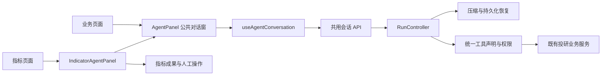

# AI 助手共用架构与接入设计

迁移状态（2026-09-30）：本文保留迁移前的行为契约与历史实现证据。当前候选已通过外部框架挂载；最新调用链、已验证范围和剩余门槛见[整体迁移设计](portable-agent-platform-integration.md)，不能将下文旧运行器路径当作当前装配入口。

下一阶段的整体迁移以[平台接入 Portable Web Agent](portable-agent-platform-integration.md)为目标设计：通用运行与界面归独立仓库，平台只保留业务和薄适配。当前候选已按此设计替换并删除旧运行器；下文实现描述只适用于迁移前历史基线。

日期：2026-09-21。状态：已实施，功能回归通过；运行状态见验收记录。范围为现有 AI 助手前后端，不增加其他业务页入口、不改变数值算法、数据或保存授权。

中央入口的增量实现见[平台意图与跨页交接详细设计](ai-functions-design.md#11-平台意图识别与跨页交接详细设计2026-09-23)：增加无计算上下文的 platform 工作域和共享内嵌聊天，复用既有运行控制；上述2026-09-21范围为历史基线。

跨项目独立产品的选型验证见第11节；该部分仍是实验，不属于上文已实施的项目内复用，也未替换现有运行实现。

## 1. 首次抽象前的链路与问题（历史）

`IndicatorStudio → AgentPanel → useAgentConversation → /api/agent → RunController → 工具 → 现有业务服务`。

- 会话运行、取消、SSE/轮询、压缩和无进展检测已有公共实现，应继续复用。
- 对话外壳同时管理指标卡片、提交确认、试算读取和公式建议，其他页面无法只复用聊天能力。
- 参数模型、说明、执行函数、工作域权限、计算域限制和工具进展类别分散在多个字典，新增工具容易遗漏权限或检测规则。
- 页面的会话存储键缺少实例身份；同类页面切换对象或复用组件时，可能继承其他对象的运行与异步结果。
- 通用模型配置与指标业务接口混在同一前端服务文件，后端提示词和研究数据绑定直接进入运行循环。

## 2. 实施边界

### 前端

`AgentPanel` 负责浮窗、消息、Markdown、输入、取消/继续、清空、公开处理记录和通用交互；以成果渲染、欢迎建议及宿主回调接入业务，不直接提交指标。

`IndicatorAgentPanel` 与指标成果组件承接现有指标公式、参数、校验/历史草稿显示、人工保存和试算展示。指标中心改为使用该适配入口。普通页面可只使用公共对话窗；接入业务成果时显式提供渲染及授权动作。

会话身份由页面、页面实例、计算域确定，外层 React key 隔离生命周期；当前指标中心保留已存在的浏览器会话键。页内研究条件更新仍触发现有口径保护，不能通过换组件规避。公共客户端统一发送、错误转换和模型配置，业务 API 从业务适配模块调用。

### 后端

运行循环统一编排串行执行、取消、压缩与恢复，持久化规则由会话存储层的窄入口统一执行；阶段事件不能顺带提交候选内容。研究提示词及 PIT/数据依赖绑定移到明确的研究适配模块。

统一工具声明集中保存参数模型、说明、处理函数、可用工作域/计算域、进展类别和数据依赖。工具枚举、模型 schema、参数校验、权限校验和进展分类从同一声明派生；未知名称、无权限或错误计算域失败关闭，不因配置遗漏静默跳过。

保留现有工具名、工作域、API 路径、SQLite 结构、历史回执、草稿/试算字段和所有人工提交门禁。当前公共契约仍是投研平台的单产品/组合上下文，新增业务域需明确补齐上下文和服务器授权契约，不接受客户端任意注册工具。

## 3. 鲁棒性与兼容验收

- 指标和产品研究两种现有工作域的工具集合及计算域限制保持一致。
- 指标调用、草稿校验、时序/标量试算、人工保存、历史分页、清空与刷新恢复保持原行为。
- 多页面实例使用独立会话；旧组件卸载后，迟到的恢复、消息和成果不能进入新页面。
- 通用对话窗在没有指标适配时可交流，且不出现指标保存控件。
- 未注册工具、越权调用、缺少参数、重复工具声明、取消和压缩过程均有离线回归。
- 前端全量测试、类型、构建、设计/国际化和三种视口浏览器验收；后端 agent 完整回归及受影响业务服务回归。不得用真实模型和正式业务数据作为自动测试夹具。

## 4. 后续页面接入规则

1. 服务端声明支持的页面/工作域及合法上下文，复用已有工具或添加一条完整工具声明。
2. 前端传入稳定的页面实例标识（例如产品代码或组合快照 ID）及当前条件。
3. 用 `AgentPanel` 展示通用对话；需要公式/保存/预览时使用现有指标适配，或提供该业务自己的成果组件。
4. 宿主页面负责消费已验证的成果并绑定业务动作；模型只提交提案。保存、覆盖或发布必须继续经过业务授权与版本校验。
5. 增加实例隔离、未知工具/权限拒绝、成果展示及取消场景测试后再开放入口。

### 迁移前实际模块与入口

下表和后文CopilotKit启动/测试命令只用于解释相应历史版本；旧路径已删除，不是当前安装或接入步骤。当前宿主入口见[整体迁移设计](portable-agent-platform-integration.md)。

| 职责 | 当时唯一实现（历史） |
| --- | --- |
| 通用浮窗、输入、消息和运行操作 | `frontend/src/components/agent/AgentPanel.tsx` |
| 会话恢复、事件、串行发送、取消、上下文保护 | `frontend/src/components/agent/useAgentConversation.ts` |
| 页面实例身份、规范化条件比较 | `frontend/src/services/agentContext.ts` |
| 共享图标按钮、提示与动作反馈 | `frontend/src/components/agent/AgentControls.tsx` |
| 指标建议、草稿卡片、人工保存、试算交付 | `frontend/src/components/agent/IndicatorAgentPanel.tsx` / `useIndicatorPreview.ts` |
| 页面证据快照构造（信封、冻结口径、有界省略） | `frontend/src/services/agentPageEvidence.ts` |
| 快照契约、校验与 `page.read` | `backend/agent/contracts.py` / `backend/agent/tools.py`（`RUNNER_TOOLS`） |
| 公共传输与错误协议 / 会话 API | `frontend/src/services/agentClient.ts` / `agent.ts` |
| 指标业务 API / 模型配置 API | `frontend/src/services/indicatorAgent.ts` / `llmSettings.ts` |
| 应用内既有服务显式装配 | `backend/app.py` / `backend/agent/research_pages.py` |
| HTTP 与 AI 共用的产品业务 | `backend/services/instrument_service.py`；HTTP 适配为 `instrument_routes.py` |
| 模型/工具执行编排、循环与本地资源 | `backend/agent/harness.py` |
| 运行执行准入、候选提交、终态与中断的持久权威 | `backend/agent/sessions.py` 的 admit / checkpoint / finish / interrupt |
| 研究提示词、PIT 绑定与数据/目录身份 | `backend/agent/research_runtime.py` |
| 工具声明、参数校验和业务处理函数 | `backend/agent/tools.py` 中的 `ToolDefinition` / `TOOL_REGISTRY` |
| 工作域门禁 / 无进展检测 | `backend/agent/scopes.py` / `progress.py`，工具类别从注册表读取 |
| 历史、回执、草稿、压缩和模型适配 | 继续使用现有 `sessions.py` / `context.py` / `llm.py` |


```mermaid
flowchart LR
  Page[业务页面] --> UI[AgentPanel 公共对话窗]
  Indicator[指标页面] --> Adapter[IndicatorAgentPanel]
  Adapter --> UI
  UI --> Conversation[useAgentConversation]
  Adapter --> Actions[指标成果与人工操作]
  Conversation --> API[共用会话 API]
  API --> Runner[RunController]
  Runner --> Context[压缩与持久化恢复]
  Runner --> Registry[统一工具声明与权限]
  Registry --> Service[既有投研业务服务]
```

普通产品页示例（页面必须已获服务端支持）：

```tsx
<AgentPanel pageContext={{
  page: 'product-detail',
  page_instance_id: `etf:${productId}`,
  context_revision: revision,
  view_state: 'inherit',
  calculation: { context_kind: 'single_product', targets: [{ kind: 'etf', product_id: productId }], period, as_of: asOf },
}} />
```

指标页面继续传递完整 `draft`、`onApplyDraft`、`onCommitted`、`onPreview`、`onViewPreview` 给 `IndicatorAgentPanel`。共享外壳通过 `renderWelcome`、`hasArtifacts`、`renderArtifacts`、`renderStatus` 承接业务内容，`busy` 保护业务动作期间的清空与发送。`conversationOptions.adoptContext` 只接收宿主提供的同步条件采纳策略；指标适配校验当前运行的试算回执归属。完整试算读取、定义匹配与状态由 `useIndicatorPreview` 管理，公共 hook 默认不读取指标试算、不放宽页面条件匹配。

### 按需页面证据（page evidence）

模型默认看不到页面上的大块显示内容。用户在页面发送消息时，宿主可以附带一份**版本化、按 section 裁剪的页面快照信封**；服务端把它绑定到该次运行，只通过只读工具 `page.read` 按 section 分页读取。这是“用户看到了什么”的证据通道，不是新的智能体循环、分类器或权限来源。

请求信封（`AgentMessageRequest.page_snapshot`，可选；旧客户端不带该字段仍正常）：

```json
{"version": 1, "snapshot_id": "snap-<32 hex>", "captured_at": "ISO-8601", "page": "indicator-studio",
 "sections": {"editing": {"...": "..."}, "results": {"...": "..."}, "series": {"...": "..."}}}
```

- 允许的页面与分区由服务端 `PAGE_SNAPSHOT_SECTIONS` 固定，未知页面、未知/空分区、字段名或深度（>12）、非有限数值、超过 2 MiB 传输上限、页面与 `page_context` 不一致一律拒绝（422）。零值、`null` 与缺失保持区别，不做字符串化。
- `snapshot_id` 由前端为每条消息生成；同一 `message_id` 带不同快照会被判为 `REVISION_CONFLICT`，相同请求重放仍幂等。
- 运行与证据一一对应：快照随请求写入 `run["request"]`，后续轮次、重试、续跑各自携带自己的快照，不回读当前可变页面、不跨会话共享。`system_prompt` 只注入有界元数据（快照 id、时间、各分区字符数）与使用规则，正文不预先注入。
- 语义身份（`page_snapshot_identity`）排除 `snapshot_id`/`captured_at` 等传输元数据：整份内容身份用于判断能否安全续跑未完成批次；**按 section 的身份只覆盖 version/page/该 section 内容**，其它分区变化既不能解除对相同分区的阻断，也不能让未变化的分区读取显得“有新证据”。证据内容变化时未完成批次按未执行关闭，交由模型重新规划。

`page.read(section, offset, limit)`：

- `section` 显式选择（`editing`、`results`、`series`），返回该分区的稳定 JSON 文本切片，带 `offset`/`limit`/`total_chars`/`has_more`/`next_offset`，可由分页无损重建；工具回执照常进入 `context.read` 的复读链路。快照缺失或缺少该分区时如实返回 `available=false` 或明确错误，不编造内容。
- 返回体自带 `evidence_kind=user_visible_page_evidence` 与 `trust=untrusted_page_content`；提示词要求把其中任何文字当数据而非指令，页面证据只解释“页面显示什么”，不构成服务端授权或已核验的计算证明。
- 工具按服务端登记的页面、工作域和计算域开放，声明 `page_evidence` 依赖；运行循环传递本轮快照。指标页使用 editing/results/series，三个研究页使用 request/results，返回的都是门控后的视图。

指标中心现状（首期接入）：

- `frontend/src/services/agentPageEvidence.ts` 是唯一快照构造实现：
  - `editing` 分区始终陈述**编辑器自己的定义**（`definition.source=editor`）与页面当前运行输入、未完成状态；采纳的 AI 试算定义单独放在 `active_preview`（含其定义、`result_adopted`、试算来源和它实际管辖的运行输入）。该定义在周期/参数修改清掉旧结果后仍在页面上生效，因此不依赖“是否有已显示结果”；两者公式不同时绝不互相冒充。
  - `results` 分区是**有界摘要**：逐产品的状态、数值（零值保留）、服务器实际生效参数、生效窗口、数据来源、警告与输入可用性，以及该结果自己的冻结定义/请求口径（`frozen_definition`/`frozen_request`）和时序通道的首尾采样与 `omitted_values`。
  - `series` 分区是页面**实际持有的完整数组**（产品/日期/通道值与来源），仅作为页面冻结输入存储；模型只能读取门控后的覆盖/派生摘要，不得翻页读取逐点值；页面没有曲线数据时显式给出 `series_not_on_page`，不抓取也不编造后端原始输入。
- 手动预览在请求发出前记录 `requested_at` 与**实际提交的参数覆盖**（只有 `parameter_contract_version=1.0` 才发送；未发送时 `parameters=null`、`parameters_submitted=false`），完成时记录 `completed_at`；服务器实际生效的参数只取结果行自身的 `parameters`。之后编辑公式或参数不会把新口径标到旧结果上（编辑器改动会清空结果，快照也只按展示内容取用）。AI 试算被采纳后，`results` 以 `agent_preview` 为来源并带上服务器返回的 `preview_id`、`definition_hash`、`context_hash`、`data_generation`、`effective_context`。
- 冻结发生在用户发送/排队/修改/重试时，每份消息一份独立副本；排队消息沿用排队时捕获的快照，重试沿用同一份，新消息与“继续分析”重新捕获当前页面。冻结必须产出独立副本：`structuredClone` 不可用时退回 JSON 安全副本，两者都失败时显式提交冻结失败标记（`page_evidence_freeze_failed`）并照常发送消息文本，绝不把可变页面对象交给消息。

限制（未宣称的能力）：

- 当前实际接入指标中心、产品研究、产品比较和持仓诊断。新研究页使用 page.analyze 复用原服务；产品详情、评价方案等仅有域登记的页面不据此声称已接入。
- 快照是**证据**而非授权：客户端可以伪造内容，服务端不据此放宽权限或写入指标；显式 `page.recompute` 在验证冻结定义及有效PIT后只读重算，不把快照定义自动作为会话草稿；数值与状态仍以既有业务接口为准。
- 传输有界：`series` 超限时最先被显式省略（保留结果摘要、冻结定义与参数），其次才是 `results`、`editing`；省略均带 `omitted` 计数与原因，因此快照不是底层原始输入的全量副本。
- 不采集 DOM、cookie、请求头或浏览器存储；既有业务算法不变，派生摘要使用独立固定签名 NJIT 内核，原图表数据完整保留。


低层 hook 由具有页面实例 key 的公共外壳托管。新宿主优先使用 `AgentPanel`，不绕过该生命周期边界直接在可变页面组件内复用 hook。当前 v2 DTO 的 draft/preview 字段继续保留兼容，它们仍是投研成果契约；没有将其宣传为任意行业的通用插件协议。

## 5. 首次抽象的历史验收记录

诊断产物保存在 `.run/agent-reuse/`。不进行 Git 提交、推送或合并，不以暂存文件来消除既有未跟踪代码的路由覆盖缺项。

| 验证 | 结果 |
| --- | --- |
| 后端 agent、LLM 与配置完整回归 | 123 项通过；注册校验按公共契约派生后，对相关 60 项再次复核通过 |
| 原有指标服务、路由、变量、NJIT、并行引擎、结果仓库 | 75 项通过，无数值代码修改 |
| 前端全量回归 | 161 个文件、1,291 项通过 |
| 公共对话、指标适配及客户端定向检查 | 37 项通过，包括跨页面迟到回包、错误会话缓存和非法成功响应 |
| 浏览器 | 指标助手和 LLM 配置共 66 项通过，覆盖320/768/1440px、清空/恢复、停止、试算、保存、中英文和键盘交互 |
| TypeScript、构建、设计、国际化、diff | 通过；保留原有构建 chunk 提醒和测试环境依赖/Numba 性能警告 |
| 路由覆盖 | 已检查；23个源码/测试/文档路径仍属于未跟踪 AI 功能的覆盖缺项，不宣称治理检查全绿 |
| 本地服务 | 已重载后端，计算内核及worker预热完成；前端5177、后端8003和API代理检查正常；真实meta接口返回两个工作域、6个已登记页面及对应工具清单 |

新增公共对话测试使用产品研究页实例，验证其不需要指标组件即可聊天；这属于离线组件验证，不表示已向实际产品页面新增入口。后端测试使用临时目录和离线模型，未消耗真实模型额度或写入用户指标。旧指标页面浏览器会话键、工具名、HTTP路径和持久化格式保留；移除被替代的工具字典和对话窗内指标实现，原组件测试迁移到指标适配测试文件。

## 6. 门控改造前的页面证据历史验收（2026-09-21）

按需页面证据在同一批模块上增量实施，未改动数值算法、权限与保存门禁；证据与命令日志见 `.run/agent-page-context/report.md` 与同目录 `pe_attempt3_*.log`。

| 验证 | 结果 |
| --- | --- |
| 后端 agent + LLM 配置完整回归 | 143 项通过（含既有 6 个 agent 测试文件与 `test_llm_settings_routes.py`） |
| 其中页面证据增量 | “为什么是 0”实读零值、旧客户端缺省、同消息不同快照冲突、运行/会话隔离、未知分区与超限拒绝、分页无损重建（results/series）、恶意文本按数据处理、未完成批次在快照变化后关闭、快照语义身份按 section 生效（其它分区变化不解阻断，结果分区变化才放行，随机 id/时间不参与） |
| 前端定向回归（agent 组件、服务、指标中心页面） | 27 个文件、237 项通过；构造器 15 项覆盖零/空/缺失、冻结口径、采纳定义与编辑器定义分离、结果清除后活动定义仍生效、完整定义契约字段、series 中间点与超限省略顺序、参数提交记录、冻结失败降级 |
| 最终独立前后端回归 | 前端 170 个文件、1,414 项通过；后端 agent 与 LLM 配置 143 项通过。命令输出保存在 `root-frontend.log`、`root-backend.log`，均为退出码 0 |
| 浏览器（agent-panel 受影响用例，--workers=2） | 15 项通过（320/768/1440px）：手动预览零值随消息冻结，以及 AI 试算采纳后“改周期/窗口清掉旧结果再提问”的活动定义/参数/无结果显示断言 |
| 最终独立浏览器回归 | `agent-panel.spec.ts --workers=2` 全部 69 项通过；覆盖三个视口、停止/编辑/重试/恢复、消息归属、页面零值与活动预览定义；命令输出为 `root-browser.log` |
| TypeScript / 构建 / 设计 / 国际化 | `tsc --noEmit`、`npm run build`、`design:check`（无回归）、`i18n:check`（errors 为空）通过 |
| 本地运行验收 | 后端重载后，计算内核与全部 worker 完成预热；8003 健康检查、5177 页面及 API 代理均返回 200，实际工具目录含 `page.read`，OpenAPI 请求包含 `page_snapshot`。证据为 `runtime.json` 与 `root-service-start.log` |

已知边界：快照仅指标中心上报；`page.read` 只在指标中心单产品域注册；页面证据不可作为授权、不能替代业务接口的数值校验，其中的定义不会被自动采用或重算；极端页面的 `series` 会先被显式省略，中间点需以更小的页面范围重发。

本次功能测试使用隔离夹具与模拟模型，未以真实模型回答质量作为验收结论。文档检查仍有 5 份原有 AI 文档未登记，路由覆盖仍缺未跟踪 AI 实现及本次新增适配文件的归属；另一个并行文档任务登记了尚未跟踪的设计文档，导致路由校验报告该引用。本次保留该任务修改，不通过暂存、放宽规则或改写并行文档来消除检查结果。


## 7. 门控与任务状态增量（2026-09-21）

后续统一设计以 [AI 功能设计](ai-functions-design.md) 第8.1/8.2节为准：模型不再获得旧页面证据里的逐点series或未核验客户端数字。完整UI结果独立保存，门控在所有模型路径执行。任务来源/约束引用、服务端里程碑、失败证据由SQLite回执重建，工作集有界而原始任务档案可分页回读；记忆提案与确认操作使用共享 `AgentMemory` 详情，接受/替换/撤销都独立于指标保存。P2候选的定向/完整测试与剩余浏览器边界见本轮交付报告，以上历史验收不自动覆盖新候选。

## 8. 共用边界优化设计（2026-09-23）

本轮授权是依据代码审核整理前后端架构。目标为项目内复用，不新增业务入口、插件系统、微服务或依赖。既有 HTTP 路径、参数与错误、工具名、SQLite 数据、PIT/数值语义、人工保存和记忆确认契约保持不变。

### 8.1 现状与目标

| 现有耦合 | 优化后边界 | 验收依据 |
| --- | --- | --- |
| AI 从 `sys.modules` 寻找已加载产品/组合路由，产品搜索直接调用 HTTP 函数 | 应用装配时明确传入现有指标实例和产品/组合能力；缺失服务明确拒绝。产品 HTTP 与 AI 调用唯一业务函数 | 独立 FastAPI 应用可注入夹具；两应用不串用服务；产品接口回归 |
| 公共会话 hook 执行指标试算读取、定义匹配、条件采纳 | 公共 hook 管理消息、运行、成果信封和上下文隔离；指标适配管理试算加载、匹配、展示及条件采纳规则 | 普通页面不加载指标试算；历史试算不能授权新运行；迟到结果/重连回归 |
| 运行器根据具体工具名判断组合快照与当前数据 | 工具声明提供数据依赖判定，运行器统一在执行前后检查 | 不可变组合证据不受外部行情刷新影响；情景重算仍双向校验 |
| 指标页面直接管理 AI 试算采纳状态 | 指标专用 hook 管理试算快照、活动定义与重复采纳；页面只负责应用产品/参数及既有展示 | 改参数仍按采纳定义重算/导出；编辑器不被覆盖 |

### 8.2 后端设计

1. 产品业务实现从 `instrument_routes.py` 移入 `instrument_service.py`，原路由保留签名、Query 校验和薄委托。所有算法、数据读取、预热调用和错误载荷沿用原实现；不复制算法、不新增实例。既有 FastAPI 错误/响应类型在此轮保留，服务层不宣称框架无关。
2. `research_pages` 的装配函数接受明确传入的产品操作和组合实例，不导入路由、不查询进程模块表。比较仍先校验当前真实费率，再进入同一预热计算实现。
3. `app.py` 在已有服务创建后完成装配。AI 路由只从请求所属应用读取指标服务和页面能力；配置不足返回稳定错误，不偷偷构造服务或借用其他应用实例。测试必须显式装配同样的依赖。
4. 产品搜索通过同一能力映射调用。PIT 日期转换直接调用既有 PIT 上下文模块，并使用本次注入服务的市场数据目录，避免工具反向导入指标路由。
5. `ToolDefinition` 增加可校验的数据依赖策略。默认按已有 `dependencies` 判定；组合指标、诊断与情景的差异由声明处的领域策略处理。运行器只消费策略结果，执行前后的数据版本门禁不变。
6. `sessions.py` 仍拥有运行接纳、检查点、终态和工具回执的原子提交。不按文件长度拆成多个事务，也不迁移数据库。本次只把领域数据策略移入工具声明；不为缩短函数机械拆分主循环，保留原控制顺序与候选提交边界。

### 8.3 前端设计

1. `useAgentConversation` 保留单一 `ConversationCore`、发送/编辑/停止/排队身份、恢复、SSE 与轮询。草稿/试算作为既有 API 成果信封传递，公共 hook 不执行指标定义匹配和完整试算加载。
2. 上下文采纳只提供一个同步的宿主策略入口，输入为当前绑定运行、冻结上下文和已接纳成果；指标适配负责检查 `preview_id`、`run_id` 并计算允许采纳的条件。没有策略时，只有完全一致的条件能继续运行。会话/运行身份和版本校验继续由公共层执行。
3. 指标专用 preview hook 处理结果读取、加载/错误、定义哈希匹配、重试和迟到响应失效；由指标适配组件共享给状态和成果卡片，宿主仍通过原 `onPreview`/`onCommitted`/`onViewPreview` 消费结果。
4. 指标工作台的采纳状态由指标专用 hook 保存：同一回执自动采纳一次，人工查看允许重复；结果失效与活动定义清除是两件事。修改产品/周期/参数仅清旧结果；修改编辑器定义或切换指标清除采纳定义。页面继续使用既有计算、导出和图表，不能为了消除分支改变语义。
5. 不改浮窗布局、文案、焦点、关闭/卸载行为、会话存储键和公开协议。不新增全局 store，也不把服务端授权转移到浏览器。

### 8.4 实施与验证顺序

先完成服务装配与接口等价回归，再迁移指标适配，最后同步路由归属和当前说明。新增文件是唯一当前实现，替代逻辑必须同时从原文件移除。

| ID | 状态 | 工作项 | 完成判据 | 证据/剩余事项 |
| --- | --- | --- | --- | --- |
| REUSE-01 | verified | 后端显式服务装配与工具依赖策略 | 无模块表探测/AI 反向路由导入；实例隔离、真实产品计算与数据门禁回归通过 | [本轮验收记录](#85-本轮验收记录2026-09-23) |
| REUSE-02 | verified | 公共会话与指标适配分离 | 通用会话无指标试算 I/O；原恢复/采纳/保存/编辑行为通过回归 | [本轮验收记录](#85-本轮验收记录2026-09-23) |
| REUSE-03 | verified | 工程与浏览器验收、文档同步 | agent 全量后端、受影响产品接口、前端测试/类型/构建、三视口浏览器及文档检查 | [本轮验收记录](#85-本轮验收记录2026-09-23)；离线夹具，不宣称真实模型或正式数据资格 |

必须覆盖：未装配服务拒绝、不同应用实例隔离、目录/搜索/比较 HTTP 与 AI 等价、费率变化拒绝；不可变组合与当前行情重算区别；普通页面不发试算请求；恢复历史成果、新消息与旧试算、程序采纳与人工改条件、停止后迟到结果、保存响应丢失重试、记忆决定不回退。已有针对性测试优先复用，新增断言锁定本次边界。


### 8.5 本轮验收记录（2026-09-23）

- 后端 agent、LLM 配置、产品搜索/筛选/详情/比较/分析、历史情景引用：507 项通过；旧 ETF 兼容接口的三个夹具迁移到实际业务模块后3项复验通过，共510项完成验收。
- 前端全量：171 个文件、1501 项通过（`--maxWorkers=2 --minWorkers=2`）。首次高并发执行有14项超时/伴随失败，限并发后完整复验通过；没有修改业务断言或放宽超时。
- 浏览器：150 个原有场景中首轮148项通过，阶段事件场景在手机/平板暴露了夹具轮询竞争：新事件送达前阻塞运行读取，使下一轮事件无法送达。夹具现先返回冻结的旧运行回执，确认新事件已送达后再阻塞运行读取，仍防止新运行快照掩盖旧成果重放。该场景在320/768/1440px各重复3次，9次通过，完成全部150个场景的覆盖。
- TypeScript、生产构建、设计棘轮、语言检查通过。构建保留原有大 chunk 警告，测试保留依赖弃用、React act 与 Numba 布局性能提示。
- 结构等价核对：产品业务61个函数/类体与变更前AST一致，10个HTTP路由的签名、Query约束和装饰器一致；AI实现不再导入业务路由或扫描`sys.modules`。SQLite表和事务入口、数值实现、外部API及工具名保持原契约。
- 本地日志与浏览器证据放在 `.run/agent-boundaries/`。新源码需与调用方一同提交；使用临时Git索引包含全部本轮候选进行路由/覆盖核验，真实暂存区不变。未提交、推送或部署，未调用真实模型。

当前边界：公共DTO仍保留既有`draft`/`preview`字段，产品共享服务仍使用既有FastAPI错误/响应类型；本轮交付是项目内模块复用。统一SQLite提交边界和运行循环保留；将来出现新的业务成果或跨项目部署需求时，再针对实际契约扩展，不预建第二套实现。

PR复审补充：`GET /api/agent/meta` 在读取模型配置和构建目录前检查当前应用的业务服务挂载；缺失时返回503 `AGENT_SERVICE_UNAVAILABLE`，不能因为模型已配置就展示可用状态。已挂载服务的目录构建失败继续保留原有空版本降级。回归 `test_meta_rejects_unmounted_service_but_tolerates_catalog_failure` 先复现200误报，再验证两种状态分别处理。

## 9. CopilotKit 自带运行能力替换验证（2026-09-24）

此节是选型实验，未更换当前生产实现。验证对象为 `@copilotkit/runtime@1.73.3` 的 `BuiltInAgent`、`InMemoryAgentRunner` 和 `@copilotkit/sqlite-runner@1.73.3`，配合 `ai@6.0.104`、`better-sqlite3@12.8.0`。本地基线为 `e13c2bf7107ef23f6f4124831794cb57b580dbda` 加现有未提交智能体改动。不启动 LangGraph，也不借用原 `RunController` 执行模型循环。

### 验证方法与范围

本地实验位于 `.run/copilotkit-validation/`：`probe.mjs` 使用真实发布包、真实运行器及官方 `MockLanguageModelV3`；`business_bridge.py` 使用临时数据目录、现有固定行情夹具、真实 `CustomIndicatorService`、现有工具分发和原人工提交 HTTP 路由。历史试算夹具显式补齐模拟披露日期；最初缺少披露日期时原PIT门禁返回不可计算，没有关闭门禁来取得成功结果。所有模型回复和工具选择均为固定脚本；服务路由通过 FastAPI TestClient 调用。另验证真实 CopilotKit HTTP handler 输出 SSE，但没有启动真实网页或外部模型调用。

正常业务接入需要一层实验适配：把服务端工具 schema 转换为 AI SDK ToolSet，由 BuiltInAgent 的公共 `mcpClients` 接口消费（没有部署 MCP 服务）；跨语言调用复用 Python 业务工具。会话草稿、结果句柄与冻结确认继续存放于现有 `AgentSessionStore`，人工提交继续使用 `commit-preview` / `commit`。因此，接通业务不能表述为 CopilotKit 已替换全部会话存储，也不能把实验 `/probe/*` 路由描述成既有生产 API。

`maxSteps` 在实验中明确设为20；这是验证用上限，不是对当前“按进展判断停止”契约的修改。完整计算结果留在临时业务存储，模型只接收现有工具投影。API确认测试模拟独立人工操作，不代表已完成真实浏览器点击验收。

### 已确认的运行能力与缺口

| 验证项 | 结果与适用边界 |
| --- | --- |
| 人工中断与恢复 | 内置 interrupt 工具能暂停，resume 能将人工拒绝送回模型；业务确认快照和实际保存仍由接入方负责 |
| 已结束会话持久化 | SQLite 文件在第二个 Node 进程中能回放已结束会话的事件与回复 |
| 运行中进程崩溃 | 在工具已开始后终止独立进程，重启后事件为空、运行标记仍为真；stop 返回false，下一轮报 `Thread already running`。不具备当前项目要求的中断恢复能力 |
| 取消与物理执行 | 内存运行器发出终态后，忽略取消的已派发工具仍未结束；同一会话已经可接受下一轮。HTTP请求取消不能替代 Python 计算完成栅栏 |
| SQLite旧运行取消 | 向正在运行的线程传入旧 `runId`，仍停止了当前运行；该版本SQLite实现没有执行内存运行器已有的精确运行ID校验 |
| 原始数据准入 | 默认 BuiltInAgent 将固定行情表格哨兵值送入模拟模型；需要在所有模型入口继续执行项目自己的数据准入规则 |
| 无进展停止 | 相同工具和相同结果连续执行6次，直到实验设定的步数上限；不能替代当前任务进展判断、纠偏与约束保留 |
| HTTP传输 | 实际 CopilotKit runtime handler 的运行入口能返回包含回复和完成事件的SSE |

取消实验使用故意不响应 AbortSignal 的工具，模拟已派发且不能被HTTP断开直接终止的后台工作；不是声称所有支持协作取消的工具都会继续。崩溃实验使用独立子进程和独立临时SQLite文件，不触及项目业务数据。以上缺口仅针对所验证的开源包版本，不外推为托管 Intelligence、所有未来版本或其他运行器的表现。

### 业务链路与其他页面

完整探针执行退出码为0：12组观察中，7组能力验证通过，5组复现预期缺口。探针执行成功不等于替换验收通过。

- 标量指标：7次模拟模型调用、6次实际业务工具调用，完成目录查询、推导、错误公式修正、有效草稿校验、可用性检查和真实试算。
- 滚动时序指标：5次模拟模型调用、4次实际业务工具调用，使用原 `metrics.rolling_draft` 从已保存指标的精确版本派生5日滚动草稿，再检查可用性并试算。
- 两类指标均通过完整成果读取、确认前拒绝写入、人工提交、同请求重放去重和事件重连。断言标量实际数值有限、时序通道有多个点、结果状态为ok、保存目录只新增一条；完整时序数组未进入模拟模型请求。
- 产品详情：独立会话中的 `products.eval` 经相同BuiltInAgent接通原服务。产品研究页的 `page.read` 保留原证据投影，客户端数值哨兵被排除；服务端仍以409 `AGENT_TOOL_NOT_ALLOWED` 拒绝不属于当前工作域的工具。

原项目 `backend/tests/test_agent_research_pages.py` 的34项离线契约回归通过，覆盖产品筛选、产品比较、持仓诊断的冻结请求、证据投影及原服务适配。这只能证明已有页面契约可继续作为迁移验收依据，不能证明这些页面已经完成 CopilotKit 接入。未来页面仍须各自明确工具白名单、页面实例与冻结条件、成果加载和人工写入门禁；中央意图交接不能直接沿用现有运行器专属回执而省略迁移设计。

### 当前选型判断

正常业务主链路可接通，但暂不把“CopilotKit自带运行器＋业务接口”认定为现有智能体的完整替代。已结束会话的历史持久化与运行中检查点恢复必须分别验收；工具调用能力与投研业务授权也必须分别验收。后续如采用CopilotKit，需要明确承接物理工具栅栏、精确取消、恢复、模型数据准入、上下文版本及无进展控制的唯一执行权威，不能让两个运行器同时拥有同一任务。该方案还需要Node运行环境与Python业务通信适配，并非仅替换前端组件。

本实验没有修改正式前后端依赖、页面或业务行为，未验证真实模型意图质量、浏览器交互、多用户权限、正式行情/PIT资格、上线成本或生产部署。不能据此宣称必须引入LangGraph，亦不能假设添加LangGraph就自动满足上述业务契约。

可复验命令（本地诊断产物，不纳入默认业务回归）：

```bash
cd .run/copilotkit-validation
# 首次准备：npm ci --ignore-scripts；原生SQLite依赖另执行 npm rebuild better-sqlite3
COPILOTKIT_TELEMETRY_DISABLED=true node probe.mjs
COPILOTKIT_TELEMETRY_DISABLED=true node probe.mjs --runtime-only
```

实验源文件、依赖锁、日志和 `results.json` 均为本地诊断产物；`.run` 不由Git分发。本文保留版本、方法及观察结果，不将未提交的诊断入口登记为稳定项目能力。正式迁移前需要把验收用例纳入对应实现的受管测试。

参考官方说明：[BuiltInAgent与自定义模型](https://docs.copilotkit.ai/agent-spec/backend/custom-agent)、[运行器与持久化](https://docs.copilotkit.ai/agent-spec/backend/agent-runner)。实际判断以本次发布包源码和实验结果为准。

## 10. CopilotKit 接入与运行可靠性（2026-09-24）

实现采用官方自定义Agent/AgentRunner接口：`CopilotKit → copilotkit/ResearchRunner → AG-UI HTTP → Python RunController → 现有业务工具`。Node适配层只传输事件；Python继续作为会话、任务检查点、工具回执和人工决定的唯一执行权威。没有修补或启用上节有缺口的Builtin/SQLite运行器，没有引入LangGraph，也不把业务工具交给浏览器执行。此方案保留现有Python执行核心，是本项目接入方案，不等于已经抽取独立通用产品。

### 接入接口

- `copilotkit/runtime.mjs` 导出 `createResearchHandler`，使用正式 `@copilotkit/runtime/v2` 和 `@ag-ui/client`。`server.mjs` 是可启动的本地Node入口，默认监听 `127.0.0.1:4000`；`RESEARCH_BACKEND_URL` 默认 `http://127.0.0.1:8000`，端口可通过 `COPILOTKIT_PORT` 设置。先 `npm ci --prefix copilotkit --ignore-scripts`，再 `COPILOTKIT_TELEMETRY_DISABLED=true npm start --prefix copilotkit`。集成部署应由既有应用网关把 `/api/copilotkit` 指向此进程；当前Python镜像不会自动启动Node，也未执行部署。
- 浏览器CopilotKit Provider使用 `runtimeUrl="/api/copilotkit"`、`useSingleEndpoint={false}`；用 `copilotkit/client.mjs` 的 `registerResearchAgent` 注册本地聊天代理，聊天组件的 `agentId` 指向该注册名，`runtimeAgentId` 指向服务端 `default`。先调用原 `/api/agent/sessions` 创建页面会话，`threadId` 必须使用其真实 `session_id`。本次未替换现有浮窗，未采用需要另行许可的 `selfManagedAgents` 直连配置。
- 每轮 `forwardedProps` 必须携带 `expected_session_revision`、`page_context`；可带 `page_snapshot`、`resume_from_run_id`、`edit_of_message_id`。结构沿用原会话API。`runId` 是本轮稳定幂等键，对应后端 `message_id`；响应丢失后必须沿用同一 `runId`、正文和冻结条件。后端另有不可变 `run_id`，供检查与明确恢复使用，两者不能混用。
- FastAPI增加 `/api/agent/copilotkit/run`、`connect`、`stop` 以及 `GET /api/agent/copilotkit/threads/{session_id}`。Node运行、重连、忙碌状态与停止都委托这些入口；没有Node会话缓存或第二个SQLite库。
- AG-UI输出 `RUN_STARTED`、`MESSAGES_SNAPSHOT`、`STATE_SNAPSHOT` 和终态。页面成果、版本、后端运行ID、执行屏障及历史消息游标放在 `state.research`；其中 `message_artifacts` 按回复ID保留原运行的草稿/试算/意图归属，不能用当前草稿覆盖历史成果。只同步已持久化公开内容；完整试算仍使用原结果句柄接口。历史分页继续使用原会话消息接口，当前快照保留最近200条。

### 可靠性与规则

1. **重启恢复**：Node重建后从Python读取会话；Python进程崩溃后，原owner锁及持久检查点把未完成运行转为interrupted，明确续跑需引用最新后端run。不会因一次重连重新派发已完成的工具。
2. **取消隔离**：停止必须带原AG-UI `runId`，不能从线程猜测“当前运行”。公共浏览器接入在connect流的 `RUN_STARTED` 中记录该线程实际运行ID，刷新恢复后标准 `core.stopAgent` 仍发精确取消；自己的新run沿用SDK的原始请求ID。停止前冻结线程/运行二元组；新发送、另一轮观察和线程切换不能让迟到回执覆盖它，聊天组件克隆的代理单独绑定。即使观察断线，也保留已知ID供取消重试。接受前取消在同一业务SQLite库记录 `cancelled_messages`，与消息接受事务串行；迟到请求被409拒绝。已接受请求只停止其不可变运行，旧取消不影响新轮。停止回执仅确认请求已处理，后台工具真实退出前忙碌状态仍为真，拒绝新任务；流也不会提前发送成功终态。
3. **断线语义**：断开SSE仅结束观察；显式stop才停止任务。离页取消应调用运行时stop并保留原runId，不能只使用 `HttpAgent.abortRun()` 断开HTTP。恢复通过connect读取原会话，不新建会话或自动重做。
4. **模型准入与权限**：最后一条用户文本是唯一新增模型输入；浏览器历史和共享state不充当服务端历史、指令、草稿或授权。拒绝客户端tools、context及AG-UI审批resume注入；模型配置仍从现有服务端设置读取。工具白名单、工作域/计算域、PIT、数值投影、所有模型发送门控、容量整理及无进展控制继续走原链路。会话还需匹配页面和页面实例。
5. **人工决定与版本**：指标保存继续使用原 `commit-preview → 独立人工确认 → commit`，校验冻结定义、草稿版本、上下文和请求幂等性。对话resume不构成业务保存授权。保存/记忆动作后重新获取会话，将新版本用于下一轮；旧版本不能写入。Node每次请求独立转发既有Authorization、Cookie、X-PIT-Off请求头，浏览器共享state不能指定身份；这里的权限验收是已有工作域和业务门禁，不新增多租户身份体系。

在同一个Provider的core上、渲染聊天组件前注册（销毁视图时调用 `unregister`，按离页契约另行明确取消）：

```js
import {registerResearchAgent} from './copilotkit/client.mjs';
const {agent, unregister} = registerResearchAgent(core, {
  agentId: 'research-chat', runtimeAgentId: 'default',
});
agent.threadId = sessionId;
// <CopilotChat agentId="research-chat" threadId={sessionId} />
```

必须使用上述注册入口，不能仅使用Provider默认发现的代理：CopilotKit 1.73.3的默认代理在connect后清除自身的activeRun，停止按钮会发不带runId的请求，被当前服务端安全拒绝。接入助手只修复客户端绑定，不放宽服务端拒绝无ID取消的规则；不修改node_modules，也不维护第二套运行器。

### 验收与范围

新增 `backend/tests/test_agent_copilotkit.py` 覆盖：受理前取消、实际线程未退出的阻塞、旧取消不误停、独立子进程终止后的恢复与续跑、服务器历史、原始数据拦截、页面实例/工具越权、过期会话与保存确认、人工提交去重。

`copilotkit/runtime.test.mjs` 使用真实CopilotKit Runtime和官方HttpAgent，经本地IPC调用FastAPI TestClient，覆盖传输丢失后重试、Node运行时重建、AG-UI事件校验、重连、取消、原人工提交接口及请求头隔离。模型是固定夹具，无外部模型或网络调用；不是浏览器、真实模型质量或生产部署验收。

```bash
PYTHONPATH=.:backend python3 -m pytest backend/tests/test_agent_copilotkit.py -q
PYTHON=python3 npm test --prefix copilotkit
```

本轮完整智能体后端回归472项通过，包含当时新增的12项接入用例；随后增加断线观察用例并补充成果归属断言，最终定向13项通过。真实CopilotKit包的2项联调通过。文档与路由覆盖检查通过，路由结构在包含当前工作区候选的临时Git索引中验证，未改变真实暂存区。本次新增的是可调用的协议接入和可靠性保护，现有页面仍使用原公共对话组件。没有改动投研计算、保存授权或现有页面交互；未提交、推送或部署。

自审核P2修复补充：回归使用实际 `CopilotKitCore.registerProxiedAgent → clone → connectAgent → core.stopAgent` 链路和真实FastAPI控制接口。未安装客户端绑定时断言 `stopped=true` 失败；安装后确认后端最终cancelled，并将重复旧取消延迟至新任务启动后送达，验证新任务未停止。另覆盖凭证、线程切换、克隆隔离、观察错误后取消和新发送回执前取消。最终13项后端专项及3项SDK联调通过。此为SDK/后端离线验收，尚未将CopilotKit浮窗接入正式页面，不宣称浏览器视觉或真实模型验收。


## 11. 独立产品与 Langflow 验证（2026-09-28）

### 目标与选择边界

目标是独立仓库、独立部署、可嵌入不同网页的通用智能体。投研平台只作为一个接入者；指标、PIT、计算、保存与版本检查继续属于业务系统。独立产品应提供可替换图标、浮窗内模型/API设置、会话和运行控制，以及接入方配置的指令、工具参数、权限、确认和页面回调。模型密钥保存在服务端；浏览器接入凭证与模型供应商密钥分开。

选择顺序为直接采用、通过公开扩展接口适配、确有核心缺口时Fork、最后才自研。第10节的CopilotKit接入仍依赖本项目Python运行器，不是上述独立产品。

本次隔离安装并核验 `langflow-base==1.12.3`、`lfx==1.12.3` 发布包，官方源码标签 `v1.12.3` 对应 `fec71dca901949c09ed4d63315804337cd2eb13d`；嵌入组件 `v1.0.8` 对应 `2c412cd047afc25681c2c4fe4c3a1c80a479a953`。两个Python wheel的SHA256与PyPI发布元数据一致。未改上游源码、项目依赖或正式页面。

### 嵌入与配置核对

上游后台可以配置Agent指令、模型和工具；工具说明及JSON Schema供模型选择调用，审批通过工具的 `approval_actions` 声明。此为配置能力核对，真实模型的意图准确率未测。

官方 `langflow-embedded-chat` 的实际入口注册一个Web Component，样式、标题、请求头和flow/session参数可配置，但当前存在以下产品差距：

- `src/controllers/index.ts` 只执行 `POST /api/v1/run/{flowId}`，没有消费后台任务的审批、恢复、停止协议。
- `src/chatWidget/chatTrigger/index.tsx` 固定使用MessageSquare/X图标，没有声明自定义图标入口；按钮样式配置不等于替换图标。
- 对话组件没有浮窗内供应商/API设置、业务成果卡片或向宿主派发动作的公开回调；消息保存在组件内存中，不能据此宣称刷新恢复已经接通。
- 因此不能把后台支持HITL/检查点，直接当作这个嵌入组件支持相同流程。上述结论来自固定版本源码核对，未做浏览器交互验收。

### 运行可靠性实测

`reliability.py` 使用真实 `BackgroundExecutionService.stop_job`、`JobService`、`JobRunner`、`InProcessExecutor` 和临时SQLite。仅替换数据库连接装配与输入帧来源；停止、持久状态、线程池调度和孤儿任务处理使用发布包实现。测试禁止外部网络。

| 验证项 | 实测结果及边界 |
| --- | --- |
| 精确取消 | 停止旧job后启动新job，再次停止旧job不影响新job |
| 不响应取消的外部工作 | 用真实线程模拟已派发工作：旧job已CANCELLED，线程尚未退出；即使执行池并发为1，新job也已开始。项目所需的物理执行隔离不能直接继承此终态 |
| 非正常进程退出 | 在独立子进程进入执行后强制终止；重建JobService和数据库连接，执行孤儿扫描，将任务转为FAILED、错误为worker_lost，未自动续跑 |

孤儿扫描使用零租约等待来确定性触发恢复检查，不代表生产默认超时为零。失败终态是上游的明确恢复策略，不等于数据库丢失；但它不满足本项目从安全检查点继续未完成工作的完整要求。测试只针对当前默认进程内执行路径，不外推到Redis部署，也未验证完整HTTP工作流入口。外部工具是否可中断、是否幂等，仍需接入方提供真实契约。

### 审批检查点对照实验

`checkpoint_probe.py` 走 `AgentComponent.create_agent_runnable → astream_events(version=v2) → _pending_interrupt_getter`，与上游组件读取审批请求的方式一致。锁定依赖为 `langchain==1.3.18`、`langchain-core==1.6.5`、`langgraph==1.2.12`、`langgraph-checkpoint==4.2.0`、`langgraph-prebuilt==1.1.0`，完整依赖另存本地锁文件。

| 配置 | 待审批记录 | 确认前业务写入 |
| --- | --- | --- |
| 默认执行方式＋官方JobCheckpointSaver/SQLite | 没有读到；StateSnapshot.interrupts为空，组件pending getter返回None | 0 |
| 显式durability=sync＋同一官方持久化实现 | 可读取，存在1个interrupt | 0 |
| 默认执行方式＋上游InMemorySaver对照 | 可读取，存在1个interrupt | 0 |

这不是仅凭文档推测。普通ainvoke和实际astream_events路径都复现默认配置下中断回执缺失；检查点读取者无法可靠构建/恢复审批卡片。本地写入顺序记录显示，先保存了包含 `__interrupt__` 的writes，随后新的检查点写入将writes重置为空；同步持久化对照避免了这一交错。同步持久化参数的对照恢复了中断记录，但标准 `AgentComponent.run_agent` 当前没有传入该参数。因此，下面的双业务实验显式使用同步持久化，不能表述为原样Langflow网页流程已经通过审批恢复。此处未修改第三方包或强行执行未经批准的保存。

### 两种业务的组件接入实验

实验 `probe.py` 使用实际 `AgentComponent.create_agent_runnable`、LangChain脚本模型与上游SQLite检查点。工具通过JSON Schema配置，经本地进程通信调用FastAPI TestClient上的宿主接口。投研宿主仅导入现有 `CustomIndicatorService` 和固定数据夹具；不导入本项目 `agent` 包，不使用 `RunController`、`AgentSessionStore` 或 `/api/agent`。

显式使用 `durability="sync"` 后，两种业务的组件级探针通过：

- 指标：依次实际执行catalog、validate、availability、preview、save；1M试算得到有限值0.1643835616438356，无Python计算回退、无请求期编译缓存未命中。试算请求携带原校验返回的compile_token，没有关闭编译门禁。审批前自定义指标数为0；模拟独立批准后为1。
- 审批持久化：独立新进程从SQLite读到中断记录；随后当前测试进程重建AgentComponent和checkpointer，读取待审批状态并批准保存。这里验证了跨进程读取及组件重建续跑，没有把它描述为整个Langflow服务重启后的HTTP恢复验收。
- 工单：仅更换工具schema和脚本模型任务，实际执行查询和创建；审批前工单数为0，批准后为1，使用相同的AgentComponent与检查点实现。
- 隔离：业务宿主在执行前后检查导入模块，均无 `agent` / `backend.agent`；通用运行器没有调用本项目智能体服务。额外确认无审批工具的Agent默认不创建agent级checkpointer，不能把普通聊天也默认为具有同样的持久恢复保障。

这些是三份离线探针的完成结果：`probe.py` 验证两种配置后的组件工具链；`reliability.py` 记录精确取消通过及物理执行/崩溃续跑缺口；`checkpoint_probe.py` 记录默认失败与同步持久化对照。探针正常退出只代表观察与断言完成，不代表完整替换验收通过。

仍未验证：真实模型意图质量、MCP网络接入、两套真实网页、浮窗内API设置、权限体系、全模型数据准入、冻结保存预览/版本冲突、保存响应丢失的幂等回放、时序指标、正式数据/PIT资格及生产部署。实验中的save直接调用原业务服务，前置的是上游通用工具审批；不能冒充原 `commit-preview → commit` 的完整业务保存门禁。

### 本轮判断与后续门槛

**不采用“Langflow加官方浮窗即可完整替换”的方案。** 后台具备可复用基础，但独立产品还需要嵌入端和宿主协议，并解决取消时真实工具退出、异常中断续跑、模型数据准入和业务保存门禁。

先以固定版本依赖和公开扩展接口验证这些缺口；目前证据不足以支持立即Fork整个Langflow仓库，也不据此转向重写全部运行器。若只有嵌入端需要改造，可独立实现/扩展该组件；必须改后台核心时，再按具体缺口决定Fork范围。

下一阶段的验收目标是同一个独立网页智能体，在指标页面和非投研演示系统中仅通过配置更换工具、图标与指令。指标验收还必须覆盖标量和时序、冻结条件、数据准入、权限、版本冲突、独立人工保存及丢响应重试；通用验收覆盖重连、崩溃、取消竞态和宿主动作回传。通过这些门槛后，才执行正式迁移及删除被替代实现。本节不表示已创建远端仓库、已Fork、已完成迁移或已有可交付的独立网页产品。

当时只扩展本设计文档；现有P12已覆盖精确取消、物理工具退出、恢复与业务门禁，未把上游实验能力登记为本项目已实现事实。模块和文档归属未改变，因此无需新增路由或重复坑点。

本地复验材料放在 `.run/langflow-validation/`，包括发布元数据、源码版本、依赖锁、探针、日志与JSON结果；该目录不随Git分发，不登记为稳定项目模块。运行命令为该目录虚拟环境Python执行 `probe.py`、`reliability.py` 与 `checkpoint_probe.py`。如进入正式开发，应把被选中实现的验收迁入独立仓库的受管测试。

来源：[Langflow 1.12.3](https://github.com/langflow-ai/langflow/releases/tag/v1.12.3)、[工具配置](https://docs.langflow.org/agents-tools)、[HITL](https://docs.langflow.org/human-in-the-loop)、[Workflow API](https://docs.langflow.org/workflow-api)、[嵌入组件v1.0.8](https://github.com/langflow-ai/langflow-embedded-chat/tree/v1.0.8)。运行结论以固定发布包的上述实测为准，文档不能代替验证。


## 12. 独立模块原型实施（2026-09-28）

依据第11节的实测结果，本轮采用Langflow所用的LangChain/LangGraph公共运行库和官方SQLite检查点，而不依赖Langflow服务。当时交付位于 `standalone-agent/`；该目录随后已迁出并从平台删除。独立产品的当前文档应到[独立框架仓库](https://github.com/KevinCJM/portable-web-agent)查阅；安装、嵌入、工具协议、验收与限制见[独立框架仓库](https://github.com/KevinCJM/portable-web-agent)。

目录包含服务端、原生Web Component、独立访问页、研究/工单两个宿主示例、HTTP适配示例、依赖锁、容器入口和测试。通用代码不导入本项目agent、业务计算或前端组件。原投研业务继续通过原实现运行；本轮不属于正式页面迁移，也不能据此删除原Agent或第10节既有接入。专业数据准入、版本和保存资格仍须由业务服务完成。
