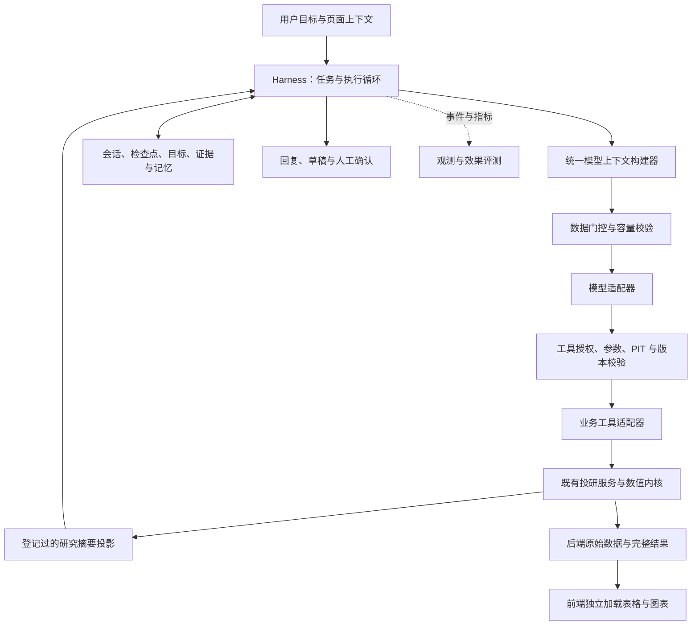
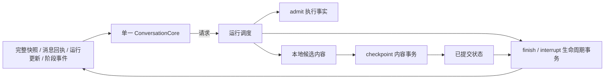
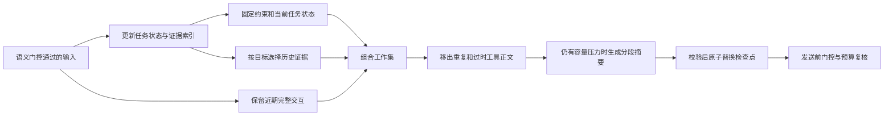

# AI 功能设计

日期：2026-09-21。状态：四阶段工程实现及离线验收已完成；真实模型效果与费用对照仍未验证，见第8.4和第9节。

本文统一维护本次讨论的 AI 功能设计：智能体 Harness、业务工具、数据门控、上下文与记忆、人工确认、观测评测和后续验收，不再拆分成 Harness 与门控两份设计。方案写入文档不代表功能已经实现，历史回归也不代表后续修改已验收。

当前共用边界与2026-09-23优化设计见 [共用架构第8节](ai-agent-reusable-architecture-design-2026-09-21.md#8-共用边界优化设计2026-09-23)。应用显式装配既有业务服务；产品 HTTP 与 AI 共用唯一业务实现，指标试算加载和采纳策略由前端指标适配层负责。下文历史验收的模块装配方式以该节当前实现为准。

## 1. 功能目标与边界

AI 根据用户目标和当前页面，协助理解数据口径、查找指标与算子、生成和校验公式、调用投研计算、解释结果并形成可审阅提案。用户可继续澄清、纠正、取消或恢复任务。

模型负责理解、规划和解释；数值计算由本项目既有业务服务与计算内核执行。保持原有算法、PIT、数据缺失、预热、版本及人工确认契约。计算实现遵守[数值规范](../governance/numeric-computing.md)与[算子治理](../governance/operator-contracts.md)。

**原始日频净值、OHLC、成交量等行情记录不能给模型。** AI 可以知道哪个字段是日期、哪个字段是净值，以及该净值是单位净值还是复权净值；可以要求后端执行计算并读取合规的汇总结果。

解释和生成公式不强制选择产品，也不自动试算。只有研究任务需要实际计算时，才绑定真实产品、期间及研究日。目录登记、工具可调用、页面已接入和完整业务验收是不同状态。

## 2. 总体架构



模型调用、工具执行、数据存储和业务计算保持明确接口。先完善受控单智能体；多智能体、向量检索或通用执行沙箱在任务收益明确时再引入，不作为本方案的前置条件。

| 层 | 职责 | 本项目承接位置 |
| --- | --- | --- |
| 对话与业务页面 | 用户输入、页面上下文、活动轨迹、草稿及结果展示 | `AgentPanel`、`useAgentConversation`、`IndicatorAgentPanel` |
| Harness | 模型/工具循环、运行状态、停止、恢复和停滞检测 | `RunController`、`ProgressGuard` |
| 模型上下文与数据门控 | 汇总所有输入，按统一规则生成允许送给模型的视图 | 复用上下文构建链路，阶段一使用版本化投影与发送守卫 |
| 业务工具 | 唯一注册表、输入输出契约、权限及业务服务调用 | `TOOL_REGISTRY` 与工具适配器 |
| 投研计算 | 数据读取、校验、编译预热、计算和统计摘要 | 既有 `CustomIndicatorService` 等业务服务 |
| 会话与证据 | 事件、工具回执、检查点、结果引用和人工提交 | `AgentSessionStore`、提交确认流程 |
| 效果评测 | 判断模型与 Harness 是否稳定完成真实研究任务 | 离线回归已有；系统性研究任务评测待补齐 |

## 3. Harness 执行与恢复

一次运行按以下顺序执行：接收并幂等登记请求 → 冻结页面/研究上下文 → 恢复目标和检查点 → 构建经门控的模型上下文 → 请求模型 → 验证并执行工具 → 保存回执与状态 → 判断进展 → 继续、回复或暂停。

运行状态、任务目标和产物状态分别表达：

- **运行状态**：本轮是否正在执行、完成、失败、暂停、取消或被中断。
- **目标状态**：用户要求哪些能力，哪些约束已确认，哪些工作尚未完成。
- **产物状态**：是否有草稿、是否校验通过、是否执行过所需预览，以及相应证据。

保留当前 `completed` 表示“本轮正常答复”的语义。概念解释允许直接回复；不能把模型文字中的“完成”当成金融结果已验证。

会话、事件、工具回执和检查点持久化。恢复时校验 owner、运行世代、取消状态、上下文及依赖版本；已确认执行的动作不得无条件重复。超时后仍在执行的后台操作按不确定状态隔离，不把“等待结束”当成“执行已停止”。

新的续接请求只允许引用会话最新一轮；较旧运行即使未被编辑替换，也不能在后续对话完成后重新执行其待处理批次或覆盖最新草稿。已经接受的同一消息仍优先返回原回执，不能因续接父运行已不是最新一轮而破坏幂等重试。

客户端恢复旧会话期间禁止发送；读取失败继续保留旧引用，只有明确不存在或没有可恢复会话时才允许新建。一次消息的 ID、正文、冻结上下文/页面证据、编辑对象及续接父运行构成固定请求，重试不能根据最新显示的运行重新推导父运行；原本不续接也须保持。`expected_session_revision` 是并发校验值，不属于服务端幂等指纹：冲突后刷新会话，人工重试使用当前版本，已接受请求仍返回原运行。重放已接受请求不得取消该运行；已接受编辑在恢复后按原身份重试，不重新要求已被替换的消息具备编辑资格。

默认不增加总工具次数或总模型步数上限，保留已有显式配置。通过操作超时、并发准入、取消和无进展检测控制运行；新增摘要阶段不能形成无界重试。

### 3.1 状态归属与交错操作

多轮审核中的重复问题主要出在状态衔接：同一功能分别保存在运行、会话、人工回执和界面中，更新时机不同。旧快照、迟到响应或重试若只核对其中一层，就会恢复失效内容、漏掉最新决定或重复执行。测试数量不能替代这些操作顺序的验证。

| 边界 | 必须保持的规则 | 典型反例 |
| --- | --- | --- |
| 请求与对象身份 | 重试保留原请求、续接父运行和完整定义身份；并发版本独立更新 | 重挂后重复保存、重试续接到另一轮、记忆写入与回读键不同 |
| 证据有效性 | 历史可审计不等于可继续入模；核对实际依赖及所属运行是否已被替换 | 旧页面结果冒充当前结果、编辑后从历史工具回执读回旧原句 |
| 人工决定 | 已确认的记忆、拒绝、替换、撤销及业务保存以持久化回执为准，不能被本轮工具快照撤销 | 停止后确认记忆，再编辑消息使提案回到待确认 |
| 异步结果归属 | 成功与失败回调都须仍属于当前会话/运行；排队到提交的交接保持发送锁 | 旧停止请求的失败覆盖新轮成功、恢复中释放发送状态 |
| 产物授权归属 | 试算回填只豁免其所属运行的口径变化，不能凭仍在界面的旧引用给新运行授权 | 新消息已按3Y接受，旧1Y试算却阻止用户改回1Y后的失效处理 |
| 控制状态的执行归属 | 控制器初始化、接受任务和恢复协调在同一事件循环内执行；线程池仅承接独立阻塞读取 | 运行已落库但尚未登记本地任务，被并发试算读取误判为异常退出 |

编辑只撤销被替换轮尚未确认的生成状态；已独立作出的人工决定继续有效。回读提案状态须与决定回执协调，旧会话的不一致不能靠重复写入修复。被替换轮的工具回执保留审计，但 `context.read` 与任务账本均不得将它们送回后续模型；已确认长期偏好仍遵守独立的来源、范围和撤销契约。

用户原话的来源消息与生成计划的运行归属分别核对。兼容缺少轮前快照的旧记录时，以已应用回执识别本轮新增提案/计划，保留早轮已存在的同 ID 项。内部归属使用稳定 ID 和已校验参数，不能依赖面向模型的有界投影仍含完整字段；计划超过投影容量不改变编辑撤销语义，也不放开模型容量门禁。客户端若已恢复同一消息的服务端回执，则原 POST 的迟到成功或失败都不能回退运行、消息或同版本会话字段。

回归按操作组合组织：停止→接受/拒绝/替换/撤销→编辑，重复编辑与旧快照恢复，响应丢失→重新读取/重试，旧请求延迟→新轮完成/关闭/卸载。每项同时核对持久事实、公开状态及实际模型输入；不只断言单个接口返回成功。复用现有会话事务、回执和控制器，不增加另一套状态框架。

恢复入口还须区分“准备执行”“实际完成”和“完成结果已持久化”。待发送消息持有自己的冻结口径；只有采纳其运行回执时，才一起更新当前运行及其口径。期间恢复到旧运行的快照仍使用旧运行口径，不能让新运行继承该旧值。普通发送、编辑、排队和重试都走同一接收入口；发送后真正改变页面条件仍触发失效。

后台线程退出不等于解除隔离已落盘。短暂存储失败后，持久化的隔离标记继续作为待恢复事实；后续读取或提交前的共用协调入口再次核对本进程归属、运行任务已退出且真实工具线程均已结束，再补偿解除隔离。失败终态不豁免这一步；尚在执行或属于其他进程的操作不能提前释放，也不通过重跑工具完成清理。回归同时检查恢复动作失败后再次恢复，并核对成功恢复没有重复执行或丢失原失败原因。

归属检查也作用于状态切换期间的临时引用和控制入口。旧试算可以按历史结果展示，但不能建立新运行的口径豁免；合法本轮试算的程序回填继续有效。服务端不能把“本地任务表暂时没有记录”直接当成崩溃证据：所有访问控制器的 HTTP 入口保持事件循环归属，完整试算文件读取单独进入线程池，既不跨线程恢复半登记运行，也不阻塞其他运行控制。回归通过延迟 POST、旧试算残留、接受登记间隙和慢文件读取验证这些边界。

### 3.2 状态写入的强制约束

反复出现问题的根本原因是同一事实存在多个副本，接纳依据却分散在调用点：消息请求保存冻结条件，运行保存执行版本，会话保存当前产物，界面另有展示状态，数据库还保留人工决定。只修某个回调或规定调用顺序，不能阻止其他入口使用过期副本。因此约束分别落在前端接纳入口、控制器执行入口与数据库写事务，不新增通用状态框架。

| 事实与权威来源 | 强制规则 | 不能误伤的合法情况 |
| --- | --- | --- |
| 固定消息请求 | 正文、页面快照、编辑对象和续接父运行随消息 ID 冻结，重试只刷新并发校验版本 | 已接受请求重放，不重复执行或撤回已接受编辑 |
| 会话与当前运行 | 共享入口校验会话/页面归属；只有新消息回执或完整快照可切换运行，并同时绑定冻结口径 | 记忆操作增加会话版本，不使仍有效的运行回执失效 |
| 运行与事件版本 | 同一运行版本不得倒退，终态不能被旧处理中状态覆盖；事件序号用于增量历史，不代替运行版本 | 同版本完整会话可补齐记忆等字段，但不能恢复旧隔离标记 |
| 展示产物与执行许可 | 历史草稿/试算继续可读，自动采纳口径须属于当前运行 | 本轮合法试算程序回填、已采纳口径及显式历史查看 |
| 控制器本地状态 | 初始化及控制操作强制核对所属事件循环和线程，错误调用在访问存储前拒绝 | 工具与文件读取仍在线程池；关停后真实线程退出可释放本地资源，持久清理由下次恢复完成 |
| 新操作的执行准入 | 模型和工具的共用启动入口必须消费持久接纳结果；拒绝后不再发出请求或派发线程 | 其他进程已取消也有效；已在途操作继续按停止、等待及隔离契约收尾 |
| 异步返回与候选结果 | 模型成功、异常返回共用事务准入，核对持久取消与执行归属后才交给主答复、压缩或总结；通过返回检查不等于正文已提交 | 实际用量保留；工具产物以完成 checkpoint 成功为准，未提交候选不能作为后续模型证据 |
| 数据库运行状态 | checkpoint 核对执行世代及会话当前运行；终态不接受迟到产物、事件或进度写回 | 取消后的收尾仍可提交；超时的错误答复与失败终态一起落盘，关闭中断保留最后检查点 |
| 最终答复与会话历史 | 收尾在存储层同一事务内读取控制状态、组装答复和提交终态；所有终态从已提交检查点开始，只接收明确的最终回复，不写回整份内存候选 | 正常收尾与取消竞争时，取消先提交则生成停止回执，终态先提交则后到取消无操作；真实失败仍按原错误契约报告，已提交进度和人工决定保留 |
| 恢复与解除隔离 | 恢复在事务内重验候选版本和运行归属，过期恢复不写；解除隔离须匹配操作并推进运行版本 | 重复清理幂等，终态清理保留原状态/原因/答复，新运行的隔离标记不受旧恢复影响 |
| 人工决定 | 记忆和业务保存的持久回执独立于工具快照 | 编辑、恢复和运行结束不回滚已经确认的决定 |

回归以这些规则组织有限组合，覆盖消息入口、回包顺序、同/异运行、旧/新版本、活动/终态、完整/部分快照、存储失败及线程退出时机。每组同时检查接受和拒绝路径，以及持久状态、公开回执和副作用；已存在的功能回归继续保留。结构约束与组合测试用于防止同类入口绕过，不能把用例数量解释为对任意未来代码或真实模型效果的证明。

前次只约束新请求派发，仍遗漏“在途请求返回”和“异常收尾”两段：本地停止事件不是跨执行实例的取消事实，工作集中的结果也不等于成功提交的进度。两者叠加会让页面显示已停止，却在后续上下文中继续使用迟到正文，或把写入失败的工具结果重新保存。完整边界是启动许可、返回准入、结果提交和事务收尾；失败恢复只能从最后提交的状态开始。仅在调用点增加一次读取仍有检查后写入的竞争窗口。


### 3.3 架构收敛：让接口限制写入权限

前几轮已修复具体竞态，但仍残留结构债：`checkpoint(run)` 接收完整可变运行对象，记录阶段或准入事件也会顺带持久化其工作集；控制器负责挑选恢复字段、组装终态并直接访问存储私有连接；前端分别维护 session、run、冻结条件和采纳条件，再用回调同步副本。这使新增入口必须记住一长串调用约定，绿测试也只能证明已覆盖的交错。

再次审核实际复现了边界缺口：模型返回准入成功后，另一实例恰在 `model.completed` 内容提交前取消；旧 checkpoint 返回 False，却已把被拒绝正文写入运行检查点，后续消息仍会引用。缺陷不在某个模型调用，而在同一个存储入口混合了“允许执行”和“提交内容”。因此本次调整的是接口权限和权威来源，保留现有工具、投研流程、数值模型和人工确认。

| 入口与权威来源 | 允许写入 | 机械限制 |
| --- | --- | --- |
| `AgentSessionStore.admit` | 有限的阶段、实际用量、服务端执行绑定及 started/unknown 回执 | 不提交 caller 的对话、摘要、检测状态、工具轨迹、草稿或内容事件；线程未退出时仍可登记隔离 |
| `AgentSessionStore.checkpoint` | 明确的候选工作集、完成回执、草稿 patch、进度与相应事件 | 共享事务检查执行世代、当前运行及取消；拒绝时保留已提交内容，只生成必要的丢弃审计，不允许直接设置终态 |
| `AgentSessionStore.finish` | 明确的最终文本及模型协议 reasoning、公开回执、会话历史与终态 | 始终从已提交工作集开始，不再接受整份内存候选或依赖调用方的 discard 标记；取消与终态在一个事务中排序 |
| `AgentSessionStore.interrupt` | 中断状态和已产生的执行用量 | 只保留已提交内容，不伪造助手答复，不提前解除真实线程隔离 |
| 前端 `ConversationCore` | 会话元数据及一个运行绑定 | 当前运行、独立冻结副本和采纳口径一起更新；对外 active_run/屏障由绑定派生，不单独维护副本 |



控制器只编排执行和选择业务步骤，不再取得存储私有连接或自行组装持久终态。新事件必须明确归属控制或内容入口；阶段事件不能变成隐式内容提交。首次运行基线、模型工具计划、工具完成、跳过的调用组以及整理后的上下文均显式提交并检查结果。压缩回调只收集整理说明，候选安装到工作集后才一次提交内容与事件；记录模型用量的校准信息也有明确提交点。

前端接纳输入使用 session/message/run/phase 四种判别类型，替换“可选运行、可选口径、可选快照”的组合。阶段事件只改变阶段，不重放旧回复或成果。绑定中的冻结对象由其规范化字符串一次生成，后续修改入参不能改变许可。消息、表单及历史成果继续保留各自原有职责，没有引入全局状态框架。

这次降低的技术债是隐含耦合：Runner 对存储私有事务字段的访问归零，最终收尾缩为调度层的薄调用，前端核心发布只写一个共享对象。代码行数不是完成标准；新增有限入口和字段白名单用于缩小可写范围，没有新依赖、数据库表、平行实现或重复业务保存流程。不可变旧会话适配仍保留，测试中直接构造旧格式仅用于验证真实兼容契约。

回归同时覆盖禁止路径与合法路径：被拒绝内容不得进入后续模型；同一 call_id 在后续计划复用不能改写早先工具证据；正常终态与取消先后均可完成；已提交草稿、原问题、实际用量与私有模型 reasoning 保留；前端恢复、编辑、队列、记忆决定、屏障释放、口径采纳和跨页面实例保持原行为。人工记忆和业务 commit intent 继续使用自己的确认、幂等和不确定写入契约，不并入耗时计算事务。

### 3.4 执行生命周期与调用身份

后续审核说明，第3.3节收窄写入权限后，仍有两类事实没有贯穿整个生命周期：工具是否还在真实执行，以及工具回执属于哪一次调用。两者的共性是把局部标识或局部完成状态当成全局事实，依赖各调用点补足约定；正常流程通过，存储失败、历史恢复或压缩时就会失配。

| 根因 | 统一约束 | 必须验证的相反情况 |
| --- | --- | --- |
| 超时后才补写隔离，补写失败时终态丢失真实执行占用 | 派发前的 started 事务先登记操作保护；确认未派发、真实操作结束或旧 owner 已退出后才能解除，终态继续继承未解除保护 | 同会话不得叠加活线程；其他会话仍可使用剩余容量，正常完成不能留下永久隔离 |
| 将供应商 call_id 当作整段会话的唯一键，各入口分别取首个或最后一个名称 | 回执按前置 assistant 的工具批次配对；发送准入、旧检查点净化、压缩投影和待执行批次收束共用配对规则 | 已完成批次可复用 ID；同批重复、孤立结果或借用后续工具名称仍不能入模 |

执行保护复用原有 SQLite 回执、operation_id、owner 和执行屏障，不新增锁服务或重试队列。正常运行的内部保护不作为“后台超时隔离”公开；终态仍有真实操作时继续公开阻断。线程回调只清自己的操作，迟到回调不能解除后续操作，清理写入失败交给已有协调入口重试。保存候选内容与确认线程退出仍是不同事实，不恢复整份运行对象的无条件写回。

身份规则以消息顺序和批次边界为准，数据库已有的 `(run_id, model_step, call_id)` 回执身份保持不变。来源配对不授予数据权限：工具签名、参数契约和原始行情门控继续独立校验。旧记录无法确定来源时保留审计并明确省略或拒绝，不用前后任意一次同 ID 调用补造来源；异常历史也不能阻止错误终态落盘。

回归按“入口 × 操作顺序 × 写入成功/失败”组织，同时观察持久状态、实际线程及下一次模型请求。已知反例的修复与当前验证记录见第8节；这些约束覆盖本项目当前入口，不等于证明任意未来实现、真实模型或外接盘故障均已验收。

### 3.5 消除重复执行权威

反复出现的 P2 并非同一个条件判断漏写，而是同一事实有多个可写来源：运行对象与数据库都能决定状态，对话与 `pending_calls` 都能决定下一项操作，完成回执又可以不证明对应操作曾获准开始。前面的门禁已缩小写入范围，但只要这些旁路仍存在，新增恢复或异常分支就必须再次记住同步规则。

本次先区分真实故障与结构缺口：真实中断复现中，纠偏分支已提交某个工具的 `not_executed` 消息，独立队列却尚未清除；人工继续后该工具再次执行并改变草稿，随后重复结果导致上下文拒绝。存储边界探针则证明，内部调用者可用阶段更新把运行改成没有取消事实的 `stopping`，或直接提交没有 `started` 的成功回执；后两者是已确认的接口约束缺口，不冒充已经发生的用户故障。

| 事实 | 唯一权威与约束 | 移除的维护负担 |
| --- | --- | --- |
| 哪个工具尚未处理 | 已提交对话的最后一个 assistant 调用批次，减去该批已有结果；共用批次解析器，按原顺序派生 | 不再读写独立待执行队列来授权派发，旧 `pending_calls` 不具有执行权 |
| 哪个运行状态有效 | 存储层按启动、取消、收尾、中断及恢复入口决定；候选对象不能自行设置控制状态 | 无须在各个阶段事件中同步另一份状态机；现有过期与非法候选拒绝仍保留 |
| 工具结果属于哪次执行 | 既有 `(run_id, model_step, call_id)` 下的 started 回执及 operation_id、工具名 | 完成或未知结果不能凭新操作标识覆盖另一执行；跳过与阻断不能伪装成已执行 |

恢复先净化历史，再比较尾批次的执行身份与参数。待执行计划被净化修改时关闭原计划，交给模型根据现有证据重新规划；仅较早已完成历史被净化不影响合法尾批续跑。已关闭调用不能重放，合法未完成余项仍可继续。真实线程的占用和释放继续由第3.4节机制管理，与“对话是否已有结果”分别核对。

取消后的 `discarded` 表示结果不应用，不等于线程完成。内部回执另保留被拒绝结果的执行阶段；准入被拒的 started 标为未执行，实际已经开始的 unknown/completed 则保留真实阶段。这样，线程先退出并解除保护、稍后才提交丢弃结果仍可合法结算；已完成回执不能借同一操作标识再次写入。不新增数据库表或公开 API 字段，也不改写旧历史。

本次架构优化针对状态与执行权威，不以拆分文件、增加接口层或替换框架作为完成标准。继续使用现有 SQLite、工具注册表和上下文模块；前端单一会话核心、人工记忆决定、指标保存幂等及投研数值服务保留各自职责。验收要同时证明非法写入被拒绝、合法恢复继续工作，以及取消/超时/写失败的旧回归仍通过；当前证据见第8节。

## 4. 工具契约与人工确认

每个工具由唯一注册表声明名称、职责、输入 schema、scope、计算域、所需上下文、版本依赖和副作用。输出另外声明数据类别、允许的模型视图 schema 及投影规则。输入合法不等于输出可以送给 AI。

调用前验证权限、参数、PIT、数据 generation、指标/目录版本和当前任务依赖。字段含义来自可信后端契约；模型或页面传入的类别标签不能扩大权限。工具返回后再次核对目录版本：执行期间变化则暂停并将该次回执标为丢弃，不提交草稿、预览或新进度。所有模型调用的共用返回入口同样核对目录版本，并通过数据库事务复核取消和执行归属；成功与异常返回都适用，防止等待回复、压缩或收尾期间变化后继续消费旧结果。结果未成功提交时，不得借错误答复或停止答复将其带回后续上下文；已提交的有效进度和实际模型用量保留。

模型只通过业务工具生成提案和调用已有计算。指标保存等业务写入沿用显式人工确认，绑定完整定义哈希、revision、上下文和幂等键。记忆提案的确认与业务保存确认分别处理。

确认预览须同时匹配服务端当前草稿的修订和完整定义，并从该草稿冻结定义及其哈希，不能只匹配修订却保存客户端混入的另一份合法定义。完整定义比较只兼容浏览器将0.0传回0等相等JSON数值表示，字段、列表顺序、布尔值和字符串仍严格区分，不补齐或省略客户端字段。实际保存再次核对当前草稿身份，旧版产生的错配确认也应拒绝；已成功提交请求的回执重放仍先于新写入校验。

前端不能把点击保存视为对尚未返回的影响预览的批准。`commit-preview` 持久化冻结结果后，原生确认框展示该结果的名称、全部公式、计算口径和校验状态；同名冲突优先展示，并说明将新增指标、不覆盖已有指标。用户在该确认框再次明确确认后才生成已确认的幂等请求并调用 `commit`；取消不调用业务写入。预览本身会递增会话版本，客户端收到回执后立即通过统一状态入口仅推进同一会话的版本，再等待人工决定；取消或后续提交失败也不遗失该已发生的版本变化。较旧/其他会话回执不覆盖状态，不依赖额外读取成功才能继续对话。成功保存的版本回执也经同一入口接纳，随后刷新完整快照；即使该刷新失败，也不丢失已确认的保存版本。旧保存回执的恢复与已确认请求的幂等重试继续保留。

运行从处理中进入终态后，共用会话控制器重新读取会话快照，覆盖实时事件与轮询；工具新增的记忆提案和引用来源不只依赖回复或会话 revision 更新。首次会话快照补全记忆字段也会触发列表读取，不要求版本号额外递增。沿用恢复流程的身份、版本及迟到响应检查，同一终态不循环刷新。恢复失败可重连，成功后清除断线提示；未发送输入保留，记忆决定与指标保存继续分开。

一次指标保存的确认与幂等键在发出前固定。响应丢失后的人工重试重放同一请求，关闭再打开浮窗也不新建确认；收到成功回执后保持已保存状态。只有服务端明确判定确认失效、尚未写入时，下一次人工保存才重新确认；不把网络失败当作未写入的证明。

服务端还按同一会话内的完整定义哈希查找持久化保存记录，覆盖刷新或离开页面后丢失客户端请求标识的情况。新的人工确认与请求 ID 复用原成功回执，不再次创建指标；已开始、失败或结果不确定的同定义记录不能凭新标识绕过核对。新定义和新会话分别处理，普通人工指标保存接口不受影响。会话读取返回当前草稿对应的 `saved_commit`，页面重挂从该回执恢复“已保存”，不依赖浏览器保存业务内容。直接收到成功回执或恢复该回执后，都通知指标工作台刷新目录；在同一宿主生命周期内按会话和完整定义去重，浮窗重开、重复快照及宿主重新渲染不会反复刷新。卡片同步显示成功回执，清除已经解决的保存失败提示，后续操作失败仍独立提示。

目录限制作用于单次返回条数，不应在检索和版本计算前丢弃整个目录尾部。完整目录负责检索、真实 total 和版本指纹；模型只接收本次相关的有界条目。

## 5. 统一数据门控

### 5.1 准入分类

门控依据**可信来源、数据语义、载荷形态和使用目的**，先决定是否允许，再控制体积。不能仅靠“少于 8,000 字符”放行。

| 类别 | 是否送给 AI | 具体边界 |
| --- | --- | --- |
| 字段与数据字典 | 允许 | 日期/净值字段名、dtype、语义角色、单位、币种、频率、复权方式、源字段映射 |
| 计算契约 | 允许 | 公式、参数默认值和约束、输入输出类型、因果性、缺失处理与边界规则 |
| 证据与质量元信息 | 允许 | 研究日、覆盖区间、样本数、缺失率、数据/指标版本、计算状态、警告代码 |
| 派生统计结果 | 条件允许 | 可信计算服务生成的区间收益、波动、回撤、相关性或小型比较结果，附口径、区间和来源 |
| 原始行情记录 | 禁止 | 日频净值、OHLC、成交量等原始观测；一行、一个值、抽样、改名、嵌套或分页也不能绕过 |
| 长时序、大矩阵和完整图表数据 | 后端保留，模型获取登记过的摘要 | 图表由前端直接读取；进一步分析通过后端计算工具完成 |
| 未登记或语义不明的载荷 | 默认不发送 | 任意 JSON、缺少来源的数值、无法确定数据类别的输出 |

这里区分“原始观测的日期值”和“覆盖区间、研究日”等元信息；不是禁止所有数字或日期。净值经过单位换算、抽样、滞后或简单重命名，仍不能冒充统计摘要；单日/单观测恒等结果也不能借汇总工具透传。

### 5.2 字段描述示例

下面是允许给 AI 的描述对象，不含真实行情取值。物理字段名仅为示例，实际内容必须来自对应数据源契约。

```json
{
  "kind": "dataset_descriptor",
  "fields": [
    {"name": "date", "dtype": "date", "role": "observation_date"},
    {
      "name": "adj_nav",
      "dtype": "float64",
      "role": "net_asset_value",
      "basis": "adjusted_nav"
    }
  ],
  "frequency": "daily",
  "raw_observations_exposed": false
}
```

`basis` 必须准确表达单位净值、累计净值或复权净值等已登记口径，不能从 `nav`、`adj` 等名字猜测。来源未确认时返回“口径未知”，不擅自补全。描述对象不得夹带 rows、values 或 sample 行情。

### 5.3 单一策略、两道检查

**第一道：所有上下文来源先生成受控视图。** 每个来源使用严格输出 schema 和可信分类，生成允许给模型的投影；原始数据留在计算与结果存储层。未知字段不能通过 `extra`、任意字典或文本字段透传。

**第二道：每次模型请求发送前统一复核。** 只有通过当前策略校验的上下文才能交给模型适配器。复核覆盖普通任务、上下文压缩、停滞收尾和错误恢复请求，不允许旁路直接调用模型。

两道检查复用同一份策略和字段契约，不各自维护互相矛盾的白名单。策略版本、上下文来源和准入结果由服务端产生；前端或模型声明 `safe=true`、`kind=metadata` 均不能获得授权。

### 5.4 必须覆盖的路径

| 来源或路径 | 处理方式 |
| --- | --- |
| 工具结果 | 校验来源与输出类型，生成业务摘要，再写入模型可读回执 |
| 页面快照与 `page.read` | 页面可见不等于模型可读；按 section 的服务端契约过滤，禁止整表/图表点透传 |
| `context.read` 与证据句柄 | 只读取准入摘要、契约和元信息；分页不能取得原始行情 |
| 历史会话与恢复检查点 | 按当前门控版本重新投影，旧记录不能直接重放为模型输入 |
| 记忆与系统上下文 | 存储、载入均受准入规则约束，不能夹带原始记录或获得额外权限 |
| 压缩摘要 | 输入已通过门控；不能先把行情交给 LLM 再要求它压缩 |
| 异常、调试信息与拒绝说明 | 使用结构化错误代码和安全说明，不回显原始载荷 |

用户粘贴的结构化行情表应在模型请求前转为后端数据引用，再提供字段描述。自由文本和附件入口需要单独的数据处理契约；不能声称字段白名单能够识别任意编码、图片或自然语言中的全部原始观测。未完成相应门控前，不开放新的原始数据输入通道。

### 5.5 研究摘要与结果存储

完整数据和数值结果留在后端，可供计算、审计及前端展示；模型仅接收任务相关的汇总。摘要包括计算状态、指标值、口径、区间、覆盖/缺失信息、来源版本及证据引用，不能只有 keys/digest，也不能为了显得完整而塞入整条序列。

摘要必须通过既有数值内核或经批准的计算实现产生。需要更深分析时，AI 调用明确的汇总计算工具，例如比较两个区间或计算某项统计；不下载原始序列自行运算。

模型证据引用与前端图表引用区分读取权限。模型不能利用前端数据句柄、文件路径或下载地址取得原始数据。

### 5.6 容量控制与审计

语义准入通过后，执行字段数、列表条数、字符串长度和 token 预算校验；过量结果返回有界摘要或要求缩小研究目标。不得通过累计分页重建原始行情。

门控记录策略版本、来源工具/section、准入类别、允许/投影/阻止结果，以及被阻止的字段路径和数量。拒绝信息不保存或回显原始值。未知类别、来源冲突和容量超限分别说明原因，便于定位和选择替代计算工具。

## 6. 目标、进展、上下文与记忆

### 6.1 任务状态与长期记忆

任务账本至少保存：用户目标的消息来源、已确认约束及其来源、所需能力、待确认问题、当前/最佳草稿、已验证里程碑及工具回执、已排除策略、当前阻碍和依赖版本。

只把与当前目标有关的新事实、诊断改善或所需预览完成记为进展。改名称、刷新 token、模型自称成功以及不断发现无关目录项不构成任务完成证据。压缩、恢复或人工“继续”不能清空仍适用的失败证据。

当前有效性须核对工具的实际依赖：页面工具比较冻结内容，分区读取仅比较所读分区；快照 ID、采集时间变化不代表内容变化。草稿试算还须匹配当前有效草稿的定义指纹。旧回执缺少对应依赖凭据时不升格为当前证据。任务工作集与 `task.read` 使用相同判断；失效记录仍可作为历史回读。任务状态、计划、记忆提案和 `context.read` 的回执不能作为新计算证据重新选入工作集，避免其中缓存的旧状态再次取得当前效力。

上下文压缩保持用户约束、未解决问题及证据引用；压缩工作集与完整会话存储分别管理。超过窗口时不牺牲数据门控，也不通过重新发送原始结果恢复信息。

长期记忆形成“提案 → 人工确认 → 版本化保存 → 按 scope 检索 → 使用来源展示 → 冲突/替代处理”的完整流程。人工接受、拒绝或撤销后，前端先恢复会话提案状态再刷新已确认列表；任一读取失败或仍在加载时不开放记忆变更。响应丢失的重新读取只恢复状态，不重发写入，不把已接受提案改成替换请求。新会话只使用已确认且适用的偏好，不自动继承旧会话的私有对话；记忆不能覆盖用户当前指令、业务契约或数据门控。已有写入与审计功能，不等于回读能力已经完成。

### 6.2 改造前的实现与缺口

2026-09-21 核对的 [context.py](../../backend/agent/context.py) 使用“规则裁剪 + 可选 LLM 摘要 + 近期原文保留”：

- 按序列化请求的 UTF-8 字节数估算 token，用供应商返回的实际输入用量校正；输入预算先为输出留出空间，达到输入预算的 85% 时尝试压缩。
- 按预算保留近期完整工具交互，另外保留被移出近期窗口的最近 4 条用户原文；更早用户消息与上次摘要进入本次整理源。
- 旧工具结果超过 1,800 字符时取前 1,200 字符及引用，并去掉旧 `reasoning_content`；整理源超过 6,000 字符且摘要请求能放入窗口时，调用同一模型，提示最多 1,500 字，代码接受上限为 6,000 字符。
- 摘要调用失败或不可用时，候选回退为结构化整理源；只有比原请求更小且能放入窗口才替换。硬容量仍足够时可暂时继续原上下文，否则报容量错误。模型报告超长后，[Harness](../../backend/agent/harness.py) 允许一次强制压缩重试。

这套机制已有容量与工具配对保护，但没有完整的结构化约束保真校验、按目标检索或分层摘要。按字符取前缀可能遗漏末尾口径、否定条件和诊断，且不能阻止行情片段进入摘要请求。当前 [模型适配器](../../backend/agent/llm.py) 使用 Chat Completions 协议，尚未接入下表的厂商原生压缩。

### 6.3 前沿方法比较

调研截至 **2026-09-21**，依据官方文档及论文原文；论文日期按所引版本记录。表中“本项目选择”是设计判断，不是已有实现或性能承诺。软件工程、对话记忆基准的结果不能直接外推到投研。

| 方法与来源 | 核心机制及证据范围 | 本项目选择 |
| --- | --- | --- |
| 工具观测裁剪 Observation Masking：[The Complexity Trap](https://arxiv.org/html/2508.21433v2)，2025 | 用简短占位替换较旧的工具观测，保留交互骨架；其 SWE-agent/SWE-bench Verified 实验中，简单裁剪与 LLM 摘要的解题率相当，费用更低 | **优先作为低成本基线**。先把必要诊断、口径和证据登记，再移出重复/过时正文；保留完整工具协议配对 |
| 结构化记忆与意图检索：[SimpleMem v3](https://arxiv.org/abs/2601.02553v3)，2026-01-29 | 将历史整理为可索引的记忆单元，会话内合并相关事实，并按当前意图规划检索；主要证据来自 LoCoMo 对话记忆任务 | **采用其组织思路**：任务账本、来源引用、按 scope 和目标取用；不把论文所称“semantic lossless”当作本项目无损保证，也不必先引入向量数据库 |
| OpenAI 原生压缩：[Responses Compaction](https://developers.openai.com/api/docs/guides/compaction)，官方现行接口 | 支持阈值触发和独立 `/responses/compact`；返回含不透明加密压缩项的上下文，独立接口的返回窗口应整体继续使用 | **可选适配能力**。需要 Responses 协议和已核实的模型支持，不能直接塞入当前 Chat Completions；保留本地可审计任务账本 |
| Claude 原生压缩：[Compaction](https://platform.claude.com/docs/en/build-with-claude/compaction)，含 2026-09-04 beta | 除阈值摘要外，按需接口可返回签名摘要块，支持后台生成及保留近期原文；按需与阈值模式有不同的消息替换规则，支持范围受模型/平台限制 | **可选适配能力**。按官方能力检测接入；不把两种模式、两家厂商的块格式或保留规则混用 |
| 动态块筛选：[AttnCompress](https://arxiv.org/html/2609.08318v1)，2026-09-08 | 通过困惑度变化分块、代理模型注意力评分和滚动重评，召回重新相关的历史；论文标注 ISSTA 2026，实验对象为软件工程任务 | **实验候选**。先利用现成字段/工具 schema 确定块边界，再评估相关性筛选；代理模型需要额外计算，注意力分数不能决定权限或否定证据是否保留 |
| 异步记忆压缩：[CoMem](https://arxiv.org/abs/2605.30842v1)，2026-05-29 | 独立记忆模型与主模型流水并行，配合奖励驱动训练；论文标为 work in progress，在 SWE-bench Verified 报告相对其长上下文基线约 1.4 倍加速 | **后续优化候选**。可借鉴后台压缩，但不能把简单异步调用等同于复现其训练方案或收益；必须处理旧摘要覆盖新消息的问题 |
| 抽取式 token 压缩：[LLMLingua-2](https://arxiv.org/abs/2403.12968v2)，2024-08-12 | 小型编码器按 token 分类保留内容，属于已发表的早期基线，不是 2026 新方法 | **限可容忍有损的说明文本实验**。公式、JSON、字段名、单位、否定词与边界条件不交给通用删词器；不能替代数据门控 |
| 模型内部记忆压缩：[PReM](https://arxiv.org/abs/2607.14327v1)，2026-07-15 | 训练模型在内部 KV 记忆中选择信息，并用专用 token 触发刷新；属于需要训练和推理栈支持的研究方案 | **暂不纳入当前落地路径**。本项目调用外部 API，无法仅修改提示词或 Harness 实现该机制 |

厂商上下文编辑也能清除旧工具结果；[Claude Context editing](https://platform.claude.com/docs/en/build-with-claude/context-editing) 明确提示清理可能使缓存前缀失效。因此评估需要同时记录摘要开销、缓存读写与后续回读成本。Prompt caching 减少重复前缀的处理成本，不能代替上下文容量控制；KV 压缩主要作用于模型推理内部，也不等于少向 API 发送 token。

### 6.4 本项目推荐：分层工作集与可追溯压缩

在第 5 节门控落地后，按以下顺序生成模型工作集。以下为待实现设计，不改动现有业务算法。



| 层 | 放入模型的内容 | 保真要求 |
| --- | --- | --- |
| 固定约束与当前状态 | 适用的用户目标、确认约束、研究日、复权口径、未决问题、当前草稿版本 | 从服务端状态和来源重建；不靠反复改写摘要维护。系统策略、工具 schema 独立提供 |
| 近期交互 | 最新用户要求及有预算保障的完整工具调用/回执组 | 保持协议和先后顺序；所有内容先过门控，不能因“保留原文”豁免原始行情 |
| 任务相关证据 | 本次问题需要的字段契约、指标摘要、失败原因和证据引用 | 按目标、对象、版本及 scope 选择；明确缺失、过期和相互冲突状态 |
| 分段历史摘要 | 已结束研究阶段的结论、否定路径、未决事项和来源范围 | 摘要附来源引用；必要时由合规证据重新生成，不长期只对旧摘要继续摘要 |

模型外分别保留会话记录、合规证据档案及计算层完整数据。`context.read` 只回读允许的证据视图；“可恢复历史”不表示可以恢复原始行情到模型。初期使用已有 SQLite、稳定 ID、关键词与结构化过滤即可；引入 embedding、重排器或代理注意力模型前，仍须满足同一门控。

### 6.5 压缩检查点契约

每次压缩记录 `schema_version`、`policy_version`、`session_id`、`source_message_range`、`source_hash`、`state_revision`、`provider/model`、`method`、`token_before/after`，并分别保存约束引用、结论证据、未决事项及近期消息边界。

- **先提取状态，再压缩正文**：确认的 `price_basis`、币种、研究日、版本、失败/取消状态和保存授权保持精确字段。LLM 只能提出摘要，不能凭摘要把单位净值改成复权净值、把未知改成零、把失败改成成功或创造新的保存授权。
- **校验候选再替换**：核对必需约束 ID、类型、版本、证据可解析性、否定/未决状态、工具配对和预算；失败不覆盖上一个有效检查点。结构校验不能证明任意自然语言语义完整，仍需任务评测和必要的证据回读。
- **来源粒度保留**：摘要可跨阶段合并，但不把整条任务唯一地依赖在一份不断缩写的散文上。当前相关约束不能因年代久远被删除；确有用户修订时记录替代关系和来源。
- **异步提交有版本条件**：后台摘要绑定已完成交互的消息前缀及状态 revision；完成后只替换该前缀，拼接其后的新增消息。用户纠正、取消或版本变化使候选失效时丢弃候选；不覆盖新尾部，不跨越待完成的工具批次。
- **原生压缩块按来源管控**：不透明或签名块只能来自已过门控的本项目模型请求，并绑定策略、供应商及上下文来源。禁止导入来源不明的块；政策变化后不能复核其内部内容时，从当前允许的证据重建。厂商支持续接不等于项目准入自动有效。

原始日频数据也不能发给摘要模型、小模型、embedding 或重排模型。门控必须先于任何语义压缩；压缩后的文字、向量或不透明块不会使原本禁止的数据自动合法。

### 6.6 触发、失败与采用顺序

先保留现有 85% 输入预算触发值作为对照，再用本项目任务集选择阈值，不直接照搬论文或厂商示例。预算应包含系统提示、工具 schema、当前状态、近期交互、检索证据以及生成空间；还需给整理提示和下一批允许的工具结果留出余量。

优先用去重、过时正文移出和按任务选证据降低体积，最后才摘要；不在每条消息后都调用摘要模型。较早启动后台摘要、缓存稳定前缀属于性能实验，只有计入额外调用和缓存重建后确有收益才启用。异步摘要尚未完成但达到硬容量时，暂停模型请求；不能为避免等待发送超限或未门控内容。

摘要失败、引用缺失或校验不通过时，有容量则沿用上一有效工作集，无容量则保留进度并明确报错；重试有界且响应取消。厂商原生压缩作为适配器可选能力，供应商切换时从可审计状态重建上下文，不转发不兼容的私有块。暂不承诺无限任务记忆或固定压缩倍数。

## 7. 观测与效果评测

运行轨迹覆盖模型请求、工具调用、内部重试、门控决定、状态迁移、取消、恢复和人工提交。记录耗时、token、错误和证据来源，避免把原始行情写入模型可读日志。

两类验证分别维护：

- **确定性工程回归**：使用临时目录、离线模型与固定数据，验证协议、权限、状态、幂等、取消、恢复、门控和业务适配。
- **研究任务效果评测**：在明确运行条件下评估“模型 + Harness”，使用隔离研究数据、固定任务、评分规则和多次尝试，检查实际草稿/结果与用户目标的一致性。

优先评测滚动夏普、歧义澄清、禁止未来数据、缺失数据解释、长会话口径保持、目录尾部检索、摘要正确性、原始行情不进入模型和人工保存。统计完成率、重复尝试稳定性、错误类型、耗时与 token；不以 HTTP 200 或回复中的“完成”代替验收。

### 7.1 上下文压缩专项验收

[2026-08 的交互成本研究](https://arxiv.org/abs/2608.16370v1) 显示，在其受控规划环境中，压缩后的完成率可能没有显著变化，但为找回信息产生的检索调用增加；另一环境未出现同样现象。因此不能只看单次压缩率或最终完成率。

使用相同模型、工具、任务、输入和试验次数，对比：当前实现、仅工具观测裁剪、分层状态与检索、再增加分段摘要；原生压缩和其他论文方案另列实验组。所有组都先满足原始行情禁止入模；“无压缩”对照也只能使用经门控的上下文，且任务必须能装入窗口。记录供应商、模型/策略版本、预算和缓存冷热条件。

| 验收维度 | 必须检查的情形与指标 |
| --- | --- |
| 口径与目标保持 | 多轮压缩后仍区分单位/复权净值、日期字段/研究日；保留用户否定与后续纠正、未完成目标、待确认事项 |
| 证据与数值 | 结论引用有效；获准统计值、单位、窗口和来源不漂移；不得补造丢失值，不能把工具失败摘要成成功 |
| 协议与恢复 | 多工具批次配对；崩溃恢复；摘要空返回/格式错误/容量不足；后台摘要期间用户修订和取消均不丢消息或覆盖新状态 |
| 数据门控 | 捕获全部模型请求，包括摘要、检索模型和恢复请求；元数据可见，原始观测在所有压缩轮次均不可见 |
| 成本与时延 | 全任务输入/输出 token、摘要与检索开销、缓存读写、总费用、总耗时及压缩等待 P50/P95；记录丢失证据造成的重复检索/计算次数 |
| 真实任务效果 | 实际产物正确率、约束违反率、未决事项保持率、人工补救次数及多次运行差异；关键语义回归失败即不采用该方案 |

先补离线夹具和固定评分，再进行已获授权范围内的真实模型评测；本次只完成文献调研与设计，没有运行这些新方案或证明 token/费用下降。

## 8. 审核证据与待解决事项

以下证据来自 2026-09-21 本次会话的早期工作区快照，Git 基线为 `7052060476ebce8f6d42882c397615b4e3577381`，包含未提交 AI 功能。随后工作区已有页面证据等修改，原结果不能自动视为当前全部实现的验收。

| 事项 | 已观察到的事实 | 设计处理 |
| --- | --- | --- |
| 大结果只有结构摘要 | 合成 300 点时序，14,789 字符结果经裁剪后回执仅 197 字符，无统计摘要 | 补有业务含义的受控摘要；不向模型恢复原始序列 |
| 目录前置截断 | 401 项目录的 total 为 400；第 401 项按精确 ID 查不到，其 revision 改变也未影响目录版本 | 完整集合检索和版本计算，单次返回限量 |
| 导入副作用 | 导入 Harness 依赖链就初始化路由单例，在隔离目录生成评价方案及锁文件 | 请求契约与路由初始化解耦，执行阶段复用原业务单例 |
| 记忆仅写入 | accepted 记录成功落盘，新会话模型请求不包含该记忆，也无检索工具 | 补确认后的记忆回读与来源/冲突处理 |
| 目标账本不足 | 已有停滞检测器；完整目标、约束来源和里程碑账本尚未形成 | 按第 6 节补齐，不改变 completed 的既有含义 |
| 质量基线不足 | 已有离线测试及文档中的少量真实模型 smoke | 建立固定研究任务集、评分器和多次运行基线 |

历史验证：后端 7 个智能体测试文件共 **131 passed**；前端 6 个相关测试文件共 **47 passed**。额外复现全部使用合成数据和 FixtureLLMClient，未向真实模型发送行情。同期文档检查发现 5 份既有 AI 设计文档未登记。此次统一文档不把这些问题标记为已修复，也不把旧测试当成新门控的验收。

代码核对入口：[运行控制](../../backend/agent/harness.py)、[工具注册与输出](../../backend/agent/tools.py)、[会话与证据](../../backend/agent/sessions.py)、[上下文压缩](../../backend/agent/context.py)、[进展检测](../../backend/agent/progress.py)、[长期记忆](../../backend/agent/memory.py)、[页面与提示词上下文](../../backend/agent/research_runtime.py)、[变量字段与口径注册表](../../backend/custom_indicators/variable_registry.py)。

变量注册表已有 source_field、source_bindings、dtype、frequency、semantic_role、price_basis 等信息，门控复用这些可信描述；当前按字符长度裁剪的 `_bounded` 不等于语义门控。

### 8.1 阶段一实现（2026-09-21）

当前候选由 `data_policy.py`、`views.py`、`derivation.py` 和既有 Harness 共同执行两道门控。工具视图按登记字段投影；发送前校验当前策略 HMAC、工具参数契约及消息形态。签名绑定策略版本，不能由页面的 `safe`、`kind` 或 `admission` 字段代替。系统草稿使用定义契约，历史摘要和压缩源使用服务端签名，primary、compaction、finalization 共用同一守卫。

- 单行 JSON、嵌套字符串、CSV/Markdown 表在请求前阻止；旧消息中的同类内容改为明确省略说明。用户原文仍在后端会话记录中，模型证据入口不能回读原始粘贴。自然语言和任意编码的识别仍不是完整保证，不开放附件等新入口。
- 旧未签名或旧策略工具回执不再尝试按标签恢复可信来源，统一省略并保留格式合法的证据引用。旧摘要无当前策略签名时省略；正常用户要求、工具配对、取消及恢复约定继续保留。
- 数值结果使用服务解析的版本化 DAG 证明；标量还要求服务端观察轴长度至少为二，但观察轴长度不证明有限样本数；对原始字段直接归约（如 mean(volume)、mean(unit_nav)）缺少可信的窗口有限样本计数时一律省略数值，仅 counts/length 继续允许。未知算子、抽样/端点及缺少选择后样本证据的 masked reductions 不向模型提供值，但业务计算和前端结果仍完整支持。可证明的收益、波动、夏普、回撤与派生曲线提供标量或统计摘要；未证明的结果明确标记 unavailable/unproven。
- 页面参数仅接受冻结定义所声明的参数；客户端结果值和自报 mean/std/extrema 不可信。已存在的试算引用必须匹配会话、运行、定义和冻结请求；手动结果通过 `page.recompute` 按冻结定义、实际参数、产品、周期与研究日重算，缺少输入时失败关闭；冻结周期/研究日必须匹配本轮页面声明及有效 PIT，差异明确拒绝，不能用页面快照覆盖当前有效研究日。前端完整结果不由模型投影原地修改。
- 派生序列的计数、均值、样本标准差及范围使用固定 readonly float64 NJIT 内核，导入时预热并禁止新增签名；空样本、NaN/Inf 和不足两个有限点的摘要不伪造统计量。原始序列仅提供覆盖计数。
- 完整指标目录参与检索、total 和 revision 指纹；请求契约迁出路由单例。固定模型任务包含零值、缺失、401 项目录尾部和原始粘贴，每项重复两次，检查实际工具证据与全部捕获请求，不按回复自称完成评分。

回归入口：[门控反例](../../backend/tests/test_agent_native_admission.py)、[准入与冻结重算](../../backend/tests/test_agent_admission.py)、[完整目录及导入隔离](../../backend/tests/test_agent_catalog.py)、[固定任务评分](../../backend/tests/test_agent_eval.py)。当前是离线工程证据，最终冻结复核、真实浏览器图表验收及真实模型任务效果分别记录，不能互相替代。

### 8.2 阶段二实现：任务状态、工作集与确认记忆

`ledger.py` 从既有 SQLite 中仍有效的 user.message、已应用且通过当前门控签名的工具回执重建任务状态。用户原句按消息 ID/seq 保留，类型化页面与计算依赖独立保存；模型用 `task.plan` 提出能力需求、待澄清问题和逐字约束引用，不能自报验证或保存完成。引用必须是有效用户原句片段，修订关系只能指更早来源；选择/修订解释仍标为 proposed，来源核验不等于任意自然语言语义证明。已验证定义、计算状态和失败策略只取真实 applied receipts；run.completed 继续仅表示正常答复。

工作集包含当前任务状态、相关受控证据、近期完整交互及已归档段。日常来源视图保留首条与最近五条用户原话，完整来源、计划、里程碑和失败策略可用 `task.read(section,offset,limit)` 分页；遗漏数量和回读要求明确展示，不把缺失当成约束取消。**逐字引用的 canonical 约束不按年代截断**，超出容量时保留状态并暂停，不静默丢弃。中间轮次否定条件和后续修订使用来源关系同时保留。

每次压缩先移出旧工具正文并保留 context_ref；已有任务状态时优先创建确定性 evidence checkpoint，避免不断压缩旧散文。段记录 schema/policy、session、源消息范围/hash、证据refs、状态revision、provider/model身份、方法与token前后。候选在副本上检查任务状态字节等价、引用归属、消息配对及预算后替换；无任务状态的兼容整理继续保留有界摘要与取消保护。模型切换、状态版本变化时由原句与回执重建，旧摘要不覆盖新口径。必要契约探索与用户明确要求的长目录查询可持续前进，无关新目录条目不能无限重置停滞计数；不设置默认总调用上限。

`memory.propose` 只能引用本会话有效用户原句，沿用当前运行owner/cancel事务提交为pending。共享面板的“偏好与记忆”详情独立接受/拒绝；接受后写同一SQLite的版本记录，按scope/object回读并显示来源，当前用户要求优先。冲突必须明确替换对应ID和版本；撤销有独立幂等请求ID。新会话只可取已确认适用偏好，不导入旧用户消息/草稿/结果。入模最多五条相关偏好，完整适用记录供UI独立读取。旧Markdown/无来源记录不盲目迁移，损坏或未签名记录不使用。记忆决定与指标保存互不授权。

保存确认流程生成的指标定义提案使用 `object_id=scope`，以完整定义指纹组成 `key`；提案、列表和替换核对采用相同身份。人工接受后，该作用域的新会话可召回，也可在界面查看来源、明确替换或撤销。旧版自动提案及已签名的定义记忆在读取时兼容此身份，不改写历史签名；普通产品偏好仍限定原对象，未签名或损坏记录不因此获得召回资格。

默认日期重算：页面原请求as_of=null时通过现有PIT resolver解析本轮有效默认日期，比较后按该有效日计算，并同时保留requested/effective日期；显式不一致或未来日期仍拒绝。不会改用会话草稿/新参数。

验证入口：[状态/记忆/多次压缩](../../backend/tests/test_agent_task_state.py)、[重复多轮评测](../../backend/tests/test_agent_multiturn_eval.py)、[记忆面板](../../frontend/src/components/agent/AgentMemory.test.tsx)。固定模型任务与多轮场景各重复三次，检查实际状态、引用、结果与未授权业务写入；token缺失时记录null，不宣称真实模型质量或费用提升。阶段二候选等待根最终冻结复核，真实浏览器验收与后续页面接入整合执行。

### 8.3 阶段四页面接入：三个研究页面

新增 `research_pages.py`，登记 product-research、product-compare、holding-diagnosis 的 request/results 分区，复用 page.read 与新只读 page.analyze。接口按页面/计算域/真实运行/冻结目标核对，未登记操作拒绝。request 是严格参数契约；results 中客户端数值不成为模型证据。目录条件阈值和自定义参数先由原业务契约核对，不从页面标签取得数值权限。

`page.read(request)` 对比较页费率只返回已声明标记，原数值仍需既有产品资料核验。`page.read(results)` 保留各区块的 ready/loading/error/stale/pending/not_requested 状态、原请求指纹及允许的产品、指标版本、周期和日期引用；未知状态标为 unknown。所有内容仍是客户端声明，ready 不是服务端验证通过。完整查询字符串、PIT 序列化载荷、费率、参数值与结果数组不下发；只有原查询字符串的记录保留指纹供追溯。当前 `page.analyze` 不回放历史显示请求，助手须说明旧结果或未完成状态，不能用当前请求重算冒充旧图表来源。

持仓情景错误独立于页面其他操作记录。首次失败和已有结果后的复算失败均冻结为 error，最后一次成功结果的原请求仍保留；发起重试时进入 loading，成功后恢复 ready。

页面视图签名版本同步覆盖 page.read、context.read、任务状态和压缩摘要。旧版签名证据不能在恢复、回读或压缩时绕过新投影；失效证据保留明确省略说明，已确认偏好仍按原记忆签名读取。

原业务回调从运行时已加载的路由模块注入，agent公共模块导入不初始化新业务单例。产品列表完整传递原筛选、条件、快照字段、排序与分页；只输出登记过的目录元信息、聚合summary与真实hindsight提示，snapshot_values/condition_values中的逐条行情不下发。指标按锁定revision及各自period分组调用原evaluate，P1推导证明继续约束数值。列表条目最多本页明确偏移的10项，选择数量仅是客户端声明；模型计算只覆盖响应声明的当前批次。

产品比较允许最多10个混合ETF/fund，performance/risk/efficiency三个范围与rolling_window分别保留。费用必须匹配原product_detail当前资料后才调用原compare-analysis；demo、费用变化或研究日不匹配拒绝。模型只读登记metric/window/单位及来源限制；原normalized_nav、drawdown和rolling_volatility曲线保持原业务API完整返回。ETF仅陈述close优先、adjNAV回退的真实loader规则，不伪造实际未报告的dataset；日期截断明确不等于公告可得性PIT。

比较口径的 `as_of` 来自页面全局 PIT；矩阵自己的显式截止日另存 `metrics_as_of`。指标分析临时按原 resolve_request_context 规则解析并绑定该日，执行结束或失败均恢复比较口径；因此比较2019年、指标2020年的原页面用法保持有效。结果中的有效数据日不会回填成请求研究日。

持仓只用真实不可变run，其target revision、请求/有效日期、窗口/count、fingerprints来自原快照，不用当前全局PIT替代。diagnose复用原服务，完整矩阵和时序不下发；组件/贡献摘要最多10行。scenario必须来自页面明确起止请求，原服务用当前数据和锁定策略重算，响应与原快照回放区分。组合自定义指标若冻结revision与原接口可执行的当前revision不一致，明确失败，不静默切换。缺失run不创建占位。

使用当前行情的工具在执行前后核对数据 generation，包含 portfolio 域的情景重算；版本变化立即暂停，并丢弃该次迟到结果，不把它发给模型或登记为当前有效进度。读取不可变组合 run 的诊断与指标计算不因外部行情更新而取消，其数据来源仍是原快照。

page.analyze显式返回target/indicator分页，默认各3项、上限各10项，继续调用只读同一冻结批次；未计算部分不能宣称完成。完整UI数据不经模型投影修改。协议/参数/0与null/旧证据/原服务parity回归在 [三个页面后端回归](../../backend/tests/test_agent_research_pages.py)。前端候选已复用共享助手：冻结实际指标版本请求，分别记录当前条件和最后结果的请求引用；加载失败或切换对象不能借用旧产品，离开对象取消运行，关闭浮窗不取消。浏览器覆盖入口、完整图表、三种视口、独立日期及记忆人工确认的回归位于 [研究页面浏览器测试](../../frontend/e2e/agent-research-pages.spec.ts)；最终状态仍等待根代理冻结验收，不以源码存在替代验证。

### 8.4 四阶段最终工程验收（2026-09-21）

验收针对 Git 基线 `7052060476ebce8f6d42882c397615b4e3577381` 之上的本任务工作树，不表示已提交或发布。主代理在源码冻结后独立运行，日志与文件指纹位于 `.run/harness-upgrade-20260921/`；测试使用离线模型、临时数据和独立浏览器服务，不调用真实模型或行情 API。

| 检查 | 结果与范围 |
| --- | --- |
| 最终 agent / LLM 配置 | 232 passed，root-final-agent.log |
| 原业务路由与比较扩展 | 254 passed / 1 failed；失败为迁移漏导出 SUPPORTED_PERIODS，补回后该原用例独立通过，root-route-compatibility.log。不把修复前全套称为全绿 |
| 完整前端 | 171文件、1433 passed，root-final-frontend.log |
| 三个研究页与记忆浏览器 | 18 passed，320/768/1440，root-final-browser.log；独占4276测试端口，未复用旧 preview |
| 类型、构建、设计、语言 | tsc、build、design:check、check_i18n 均退出0；保留既有 chunk 和测试环境警告 |
| 重复离线任务 | 四类固定任务与三类多轮场景各重复3次通过；实际产物与状态评分，不代表真实模型解题率 |

页面覆盖真实路由、混合产品类型、三段比较区间与独立指标截止日、批次提示、真实/缺失快照、加载与迟到回包、停止/关闭差异、记忆人工操作、键盘及完整图表。25轮对话的中间否定和后续修订跨三次压缩保留原句来源；110步真实工具循环正常完成。

边界：任意编码及自由文本不保证完整识别；无有限样本或 DAG 证明的结果值不进入模型，但前端业务结果不删减；未引用的散文条件不承诺语义无损，完整来源可回读。真实模型效果、压缩策略成本对照和费用收益未开展。服务就绪另看运行时证据，不能由离线测试代替。

运行时复核：本项目后端8003、前端5177已重启，启动程序在全部计算预热完成后报告就绪（326秒）。健康检查、前端API代理及三个实际页面均返回200；实际工具目录包含 page.read/page.recompute/page.analyze/task.read/task.plan/memory.propose。记录为 runtime.json、root-service-start.log；未发送真实模型请求。

文档结构与链接检查通过，五份既有AI文档已补入目录。路由校验仍报告统一设计文档尚未Git跟踪，覆盖检查也保留未提交AI源码/测试的归属缺项；未通过暂存、提交或放宽检查来消除这些状态。

### 8.5 审核问题复验（2026-09-22）

当前工作树修复比较页费率准入、保存响应丢失后的重复创建，以及页面旧结果来源丢失三个问题。新增反例覆盖当前与历史费率、六种结果状态、旧签名回读与摘要、已确认偏好兼容，以及保存重试、浮窗关闭重开和过期确认。

本地验证：Agent/LLM 后端 252 passed；相关前端 13 文件、157 passed；浏览器 24 passed，包含 320/768/1440 下的保存失败与重试、普通人工保存、三个研究页、独立日期和记忆操作。TypeScript、构建、设计、语言及文档结构检查通过。证据位于 `.run/agent-review-fixes-20260922-102110/`，可执行反例归入 [页面协议回归](../../backend/tests/test_agent_research_pages.py)、[历史准入回归](../../backend/tests/test_agent_native_admission.py)、[保存组件回归](../../frontend/src/components/agent/IndicatorAgentPanel.test.tsx) 和 [保存浏览器回归](../../frontend/e2e/agent-panel.spec.ts)。这些是离线工程验收，未调用真实模型。

原有未提交状态保留：Hermes 仍报告统一设计文档未跟踪及 AI 模块路径归属缺项；本次不暂存文件或放宽规则以消除提示，未提交或推送。

同日第二轮修复了页面条件变化后的证据有效性误判及持仓情景错误状态遗漏。继续自审核又复现并修复了草稿变化后旧试算仍被选中、旧任务状态/历史回读被重新选作当前证据两条同类路径。三个研究页面共用回执依赖核验；语义内容相同而快照 ID/时间不同仍可复用，失效证据继续保留历史回读。

第二轮本地回归：Agent/LLM 后端 **256 passed**；相关前端 **159 passed**；研究页面浏览器 **21 passed**，包含 320/768/1440 下首次情景失败、已有结果后的失败及成功重试。TypeScript、构建、设计与语言检查通过。本轮范围内自审核未遗留可复现代码缺陷；证据在 `.run/agent-review-fixes-20260922-105924/`，反例归入 [任务证据回归](../../backend/tests/test_agent_task_state.py)、[持仓页面回归](../../frontend/src/pages/HoldingDiagnosis.test.tsx) 和 [研究页面浏览器回归](../../frontend/e2e/agent-research-pages.spec.ts)。验证使用隔离数据和离线模型，不代表真实模型或投资结果验收。

再次审核补齐页面重挂后的保存恢复与持仓情景的数据版本门禁。保存回执按会话内完整定义复用，旧成功回执兼容读取；刷新恢复已保存状态，新确认/新请求标识也不能重复写入或绕过不确定记录。情景计算前后发生行情版本变化时暂停并丢弃结果，不影响不可变快照诊断与指标读取。

本轮复验：后端 264 passed，相关前端 13 文件、161 passed；浏览器 9 passed，覆盖 320/768/1440 下的保存回执丢失后刷新恢复、关闭重开重试和普通人工保存，并检查操作可达性及文字对比度。类型、构建、设计和语言检查通过。证据在 `.run/agent-review-fixes-20260922-120329/`；回归见 [运行与保存测试](../../backend/tests/test_agent_runs.py)、[保存组件测试](../../frontend/src/components/agent/IndicatorAgentPanel.test.tsx) 和 [保存浏览器测试](../../frontend/e2e/agent-panel.spec.ts)。测试使用离线模型、临时 SQLite/Parquet 和浏览器接口夹具；不代表真实模型、行情算法或部署验证。

会话恢复与消息重试的本次复验修复三个问题：恢复未完成时误建新会话、版本冲突重试仍带旧版本，以及续接重试改变原父运行。自审核另复现并修复已接受编辑在恢复后无法结束重试的问题；运行中的已接受请求可重放，不被重试动作取消。无父运行、配置已停用、恢复读取失败与明确 404 也有对应检查。

完整前端回归 171 文件、1449 passed；最后调整重试按钮门禁后，共用助手相关 8 文件、85 passed。后端既有会话/编辑契约 7 passed，类型、构建、设计和语言检查通过。助手浏览器全套首次 81 passed、3 failed，失败均为剪贴板测试写死旧端口；夹具改为当前页面 origin 后，三视口下该用例与恢复加载态共 6 passed，覆盖其余 3 个失败项并核对加载文字对比度。新增恢复/冲突/续接流程此前 9 passed，手机及桌面加载截图已检查。证据在 `.run/agent-review-fixes-20260922-124904/`，回归见 [会话组件测试](../../frontend/src/components/agent/AgentPanel.test.tsx)、[共享会话测试](../../frontend/src/components/agent/useAgentConversation.test.tsx) 和 [浏览器测试](../../frontend/e2e/agent-panel.spec.ts)。本轮修复范围自审核通过；测试均为离线接口/临时存储，不代表真实模型或部署验收。既有 Hermes 未跟踪引用及路径归属缺口保留。

本次修复工具执行途中目录变化仍接纳结果、持久保存回执恢复后未刷新宿主目录两项问题。自审核另复现并修复等待模型回复期间目录变化仍发布旧内容、恢复“已保存”后仍残留保存失败提示两条相关路径。目录失效检查覆盖共用模型返回入口，丢弃内容但保留已提交进度和真实用量；保存通知按会话及完整定义去重，后续填入失败仍正常提示。

本次相关后端 267 passed，最终目录竞态与用量检查另有 3 passed；最终前端全量 171 文件、1451 passed。三视口保存浏览器 12 passed，覆盖关闭重开、整页刷新、人工重试与正常保存，实际核对指标库更新、通知去重、成功反馈、操作可达性和文字对比度；手机与桌面截图已复核。类型、构建、设计和语言检查通过。证据在 `.run/agent-review-fixes-20260922-132752/`，回归见 [运行测试](../../backend/tests/test_agent_runs.py)、[保存组件测试](../../frontend/src/components/agent/IndicatorAgentPanel.test.tsx) 与 [浏览器测试](../../frontend/e2e/agent-panel.spec.ts)。本轮修复范围自审核通过，仍为离线工程证据；既有 Hermes 未跟踪引用及路径登记缺口保留。


记忆确认链路复验修复：运行结束后未读取新提案，导致用户必须重开对话才能确认。自审核另修复成功重连后仍显示断线，以及首次完整会话与创建回执版本相同时未加载已引用记忆。实时事件和轮询共用终态恢复，重复通知不重复读取，旧运行的迟到快照不覆盖新运行；未发送输入及独立人工决定保留。

最终前端 171 文件、1456 passed；后端任务/记忆链路 16 passed。三视口新增记忆流程 6 passed，覆盖即时确认、读取失败重连、首次引用展示、键盘操作与对比度；保存、停止、续接和清空等相关浏览器回归另有 30 passed。手机、桌面截图已复核，类型、构建、设计与语言检查通过。证据在 `.run/agent-review-fixes-20260922-152616/`；回归见 [共享会话测试](../../frontend/src/components/agent/useAgentConversation.test.tsx)、[记忆组件测试](../../frontend/src/components/agent/AgentMemory.test.tsx) 和 [浏览器测试](../../frontend/e2e/agent-panel.spec.ts)。本轮修复范围自审核通过；均为离线工程验证，原有 Hermes 未跟踪引用及文件登记缺口保留。


记忆操作恢复复验：修复接受成功但响应丢失后，“重新读取”只更新列表、旧提案被误发为替换的问题；自审核同时覆盖正常成功后会话读取失败或两个读取先后到达的同类路径。接受、拒绝、撤销及错误恢复共用先读取提案状态、再刷新记忆列表的顺序；读取中或失败时禁用决定，重新读取不重发写操作，恢复成功清除旧错误。

本轮前端全量 **1462 passed / 171 文件**，后端任务/记忆 **16 passed**，三视口记忆浏览器 **15 passed**，另有两项独立延迟竞态复核通过。实际覆盖三类决定响应丢失、读取再次失败、正常确认、恢复、输入保留及无重复业务写入；手机错误态和桌面恢复态截图已检查。类型、构建、设计与语言检查通过，证据在 `.run/agent-review-fixes-20260922-161710/`；长期回归保留在 [记忆组件测试](../../frontend/src/components/agent/AgentMemory.test.tsx) 和 [浏览器测试](../../frontend/e2e/agent-panel.spec.ts)。本轮修复范围自审核通过；这些是离线工程验证，既有 Hermes 未跟踪引用及文件登记缺口保留。

指标记忆与排队发送复验：自动定义记忆统一提案、存储和替换身份，已确认记录可回读、替换及撤销；兼容旧签名记录与两种既有作用域，保持普通产品偏好的对象限制。排队消息在恢复读取至提交接管期间保持发送锁，取消或卸载后忽略迟到读取，失败保留重试；关闭浮窗仍继续原流程。前端 **1468 passed / 171 文件**、Agent/LLM 后端 **272 passed**、三视口浏览器 **24 passed**；新增回归覆盖新旧记忆、签名边界、插队、取消和失败恢复。手机及桌面截图、类型、构建、设计、语言与文档检查通过，证据在 `.run/agent-review-fixes-20260922-165751/`。本轮修复范围自审核通过；均为离线工程验证，既有 Hermes 未跟踪引用及文件登记缺口保留。

### 8.6 状态交错系统复验（2026-09-22）

按第3.1节的共性对运行、会话、人工回执与界面完成边界交叉复核。修复编辑回滚已确认提案，并覆盖接受、拒绝、替换、撤销、重复编辑、旧数据已失配和提案已被移除后的回放。继续复现并修复被替换工具回执重新入模、旧会话无轮前快照时遗留引用前轮原话的计划，以及大计划模型投影省略 ID 后内部归属失效。人工决定、审计记录及有效前轮状态保持各自契约。

前端共用控制器补齐停止/口径变更回包的归属检查；同轮已结束、新轮已完成或卸载后不再显示旧失败。发送与编辑已被恢复快照证实接收时，迟到 POST 不能倒退运行或回滚文本。关闭浮窗后仍属于当前运行的真实成功/失败继续处理，尚未证实接受的请求继续保留重试。

新增 **31 项确定性回归**（后端19、前端12）及两个三视口浏览器场景。最终前端 **1480 passed / 171 文件**；测试索引访问改为当前 TypeScript 目标支持的写法后，共享 hook **35 passed**、类型检查通过。Agent/LLM 后端最终 **291 passed**。浏览器全套首次 **111 passed / 3 failed**，仅新增用例在浮窗淡入期间采样对比度；等待已有180ms动画结束后，两项新增场景 **6 passed**，覆盖全部114项用例且未降低阈值。手机和桌面截图已核对；构建、设计、语言及文档检查通过。证据在 `.run/agent-state-fixes-20260922-175927/`，永久回归复用既有 [任务/记忆测试](../../backend/tests/test_agent_task_state.py)、[上下文测试](../../backend/tests/test_agent_context.py)、[共享会话测试](../../frontend/src/components/agent/useAgentConversation.test.tsx) 和 [浏览器测试](../../frontend/e2e/agent-panel.spec.ts)。

修复经独立交叉审核通过，未再发现本轮范围内可复现的待修问题。没有新增状态框架、依赖、API 或数据库结构；真实模型与投资验证仍未执行。既有 Hermes 未跟踪引用及文件登记缺口保留，未暂存、提交或推送。

后续恢复边界复验补齐第3.1节的两处共享完成入口：采纳新运行时一起绑定其消息口径，避免发送期间恢复的旧快照误停新运行；后台操作已结束但解除隔离遇短暂存储失败时，沿现有协调入口补偿，不再要求重启服务。真正口径变化仍停止运行，活线程及其他进程的操作仍受保护，原失败原因、回复和已完成草稿保留。

本次新增 **11 项确定性回归**：前端四类发送入口与两种返回顺序共8项，每项另检查真实口径变化；后端超时、取消、关闭三类真实 SQLite 锁失败回归。前端 **1488 passed / 171 文件**，Agent/LLM 后端 **294 passed**，独立交叉审核通过。浏览器全套首次 **116 passed / 1 failed**，失败为新增测试误用窄屏页签名；按既有桌面/窄屏入口修正测试后，该场景三视口 **3 passed**，117项均已覆盖通过，未改生产布局或降低断言。手机、平板和桌面截图及输入保留、真实停止、对比度已核对；类型、构建、设计和语言检查通过。证据在 `.run/agent-recovery-fixes-20260922-190234/`，回归保存在 [运行恢复测试](../../backend/tests/test_agent_runs.py)、[共享会话测试](../../frontend/src/components/agent/useAgentConversation.test.tsx) 和 [浏览器测试](../../frontend/e2e/agent-panel.spec.ts)。此结论限定离线工程验证；既有 Hermes 未跟踪引用及文件登记缺口仍保留。

产物与执行归属复验进一步修复两类共享入口：旧试算引用不得为新运行建立口径豁免；试算读取与消息接受不得跨线程竞争控制器恢复。全部7个控制器 HTTP 入口统一在事件循环执行，阻塞的试算文件读取保留在线程池。新增 **7 项回归**覆盖发送、编辑、排队、重试的旧试算交错，本轮合法采纳，以及真实 ASGI 下接受登记窗口和慢读取期间控制接口的响应；反例先失败，修复后通过。没有新增状态框架、锁或依赖。

最终前端 **1493 passed / 171 文件**、Agent/LLM 后端 **296 passed**、三视口助手浏览器全套 **120 passed**；新增场景核对真实控件从1Y改3Y发送、等待期间改回1Y后的停止，以及历史试算、输入保留、操作可达性和对比度。首次全量前端有一项既有图表测试超过5秒，单文件22项复验通过，随后按既有双worker命令完整重跑通过；新增测试的类型断言已补齐，最终类型、构建、设计与语言检查通过。主代理独立复验原前端反例转绿，并与独立审核核对所有控制器入口，未遗留新的可复现问题。证据在 `.run/agent-ownership-fixes-20260922-194216/`，永久回归复用 [API 并发测试](../../backend/tests/test_agent_api.py)、[共享会话测试](../../frontend/src/components/agent/useAgentConversation.test.tsx) 和 [浏览器测试](../../frontend/e2e/agent-panel.spec.ts)。验证仍限定离线工程行为；既有 Hermes 未跟踪引用及5项文件登记缺口保留，未暂存、提交或推送。

第3.2节的共性约束进一步落到共享入口：前端统一会话/运行接纳并隔离资源404；控制器在存储访问前机械核对线程与事件循环；数据库封闭过期 checkpoint 与恢复写入，解除隔离推进运行版本。自审实际复现并补齐恢复旧扫描清掉新轮隔离、旧完整快照恢复执行屏障、附属资源404误清会话，以及另一存储实例取消后仍派发新模型/工具的问题。共享启动入口现在必须消费持久接纳结果，拒绝后不派发，已在途操作保持原有等待与隔离流程。

新增 **51 项确定性回归**（后端47、前端4），按终态与迟到写入、观察版本变化、控制入口与线程/循环、关闭时机和快照来源组织组合。收紧终态保护时独立审核发现工具超时原先提前写失败、随后才写错误答复；已调整为唯一收尾入口一起提交回执与终态，并以真实工具线程及API502/错误正文反例复验。最终前端 **1497 passed / 171 文件**，隔离数据目录下 Agent/LLM 后端 **343 passed**。浏览器首次 **120 passed / 3 failed**，新增404用例硬编码了错误的存储键；改用既有会话键函数并保留原会话ID的严格断言后，三视口 **3 passed**，合计123项均已覆盖通过。手机、平板、桌面的会话/输入保留、重连、操作可达性与对比度均已检查。类型、构建、设计、语言及严格文档检查通过，最终源码与独立审核哈希一致；证据在 `.run/agent-state-contracts-20260922-195921/`，长期回归保留在 [运行控制](../../backend/tests/test_agent_runs.py)、[API](../../backend/tests/test_agent_api.py)、[持久状态](../../backend/tests/test_agent_task_state.py)、[共享会话](../../frontend/src/components/agent/useAgentConversation.test.tsx) 和 [浏览器](../../frontend/e2e/agent-panel.spec.ts) 测试中。既有 Hermes 未跟踪引用及本轮涉及的9项文件登记缺口保留。数据盘挂载变化不作为代码验证依据；未隔离后端重跑曾在掉盘期间失败并中止，最终回归使用项目内独立临时目录，不代表真实模型或部署验收。


后续返回与收尾边界复验确认：仅阻止新操作仍不足以隔离在途结果。共用模型返回入口现对成功和异常结果执行持久准入；取消与异常收尾恢复最后提交的检查点、检测状态和工具轨迹，实际用量独立保留；最终回执与终态在同一既有 SQLite 事务内完成。复核中同时修复了工具完成写入失败后候选结果进入下一轮，以及取消恰好发生在收尾读取和写入之间时遗留 stopping 的问题，没有新增框架、依赖、数据库表或业务入口。

新增 **17 项确定性回归**：主回复/无进展总结的成功、异常和取消顺序8项，真实旧会话压缩的取消/错误/执行世代3项，取消与收尾真实线程竞争2项，外层事务提交/回滚2项，工具结果写入失败有/无取消2项。隔离数据目录下 Agent/LLM 后端 **360 passed**，前端助手关联4文件 **107 passed**；补强的未提交检测状态、工具轨迹与公开回执断言单独复验通过。主代理独立复验原迟到回复和工具结果反例转绿，额外审核验证旧会话真实压缩、空检查点原问题保留，以及取消前已提交草稿/工具进度保留。证据在 `.run/agent-result-admission-20260922-220135/`；原问题与新增收尾竞态的长期回归保留在上述运行控制和持久状态测试。此次没有前端实现变更，不将组件回归称为新的浏览器或真实模型验收；既有 Hermes 未跟踪引用和本轮5项文件登记缺口保留。


第3.3节的架构收敛已完成：执行准入只保存控制事实，内容提交拒绝时不落候选，终态始终以已提交内容为基础；控制器不再访问存储私有事务，前端改为单一核心状态与明确输入类型。审核期间复现并修复拒绝的模型工具计划正文进入下一轮、重复 call_id 的丢弃通知覆盖旧证据，并补齐正常总结降级也不得重新提交候选的结构限制。没有新增依赖、数据库结构或第二套状态框架，取消、恢复、人工决定、模型 reasoning 与用量校准保持既有契约。

新增 **21 项回归**（后端18、前端3），最终后端 Agent/LLM **378 passed**，前端 **1500 passed / 171 文件**，助手及跨投研页三视口浏览器 **147 passed**，无失败或放宽断言。浏览器使用最终冻结源码的隔离 Vite 开发服务器；另行生产构建通过，二者不混称生产部署验收。手机、平板、桌面新增截图均由主代理独立查看，阶段更新后最新成果仍保留；类型、设计、语言检查通过，独立架构审核无遗留确认问题。证据在 `.run/agent-architecture-20260922-223852/`，包含先红后绿反例、共享存储边界测试、运行调用映射、单一前端状态测试和最终源码哈希。已有 AI Hermes 未跟踪引用及本轮10项路径登记缺口仍保留，未通过暂存、伪造 artifact 或修改规则掩盖；其不等同于代码回归失败，也未据此宣称 Git 发布可复现。

### 8.7 执行与身份边界复验（2026-09-23）

第3.4节两类共性已落实：工具派发前持久化操作保护，完成回执与唯一线程完成回调精确解除；发送准入、恢复净化、压缩和待执行调用收束共用按批次的来源配对。删除仅超时才注册的隔离回调、重复本地隔离集合及全历史首个/最后一个 call_id 映射。正常运行不公开内部保护为超时告警，终态活线程仍阻断同会话新操作；迟到异常统一观察，错误超时配置在派发前拒绝。

独立复审发现新严格配对会使坏历史在错误收尾时再次抛错，已修复并保留先红后绿证据：异常历史继续禁止入模，但运行可正常暂停、清除 active_run 并展示错误；未知旧工具继续按省略契约恢复。取消遇复用 ID 时，旧成功证据仍保留，新迟到结果丢弃，下一轮正常完成。

新增 **20 项回归**（执行生命周期8、调用批次与旧历史12）。最终冻结源码下 Agent/LLM 后端 **398 passed / 104.40秒**；主代理原始隔离反例及跨步骤/跨轮次四组身份对照全部转绿，独立审核的7项批次检查、4种控制写入失败、旧历史和跨实例取消检查通过，无遗留确认问题。证据在 `.run/agent-boundary-fixes-20260923-082955/`，永久回归在运行、准入和上下文三个既有测试文件中。

本轮仅改后端与文档，未重跑前端/浏览器，未把前次1500/147项结果记为本次新验收。均使用隔离目录、真实线程/SQLite及离线模型，不代表真实供应商、外接盘故障频率、投资或部署资格。文档与 P12 已同步；既有 Hermes 未跟踪稳定引用和本轮8项路径登记缺口仍保留，没有暂存、提交、推送或放宽规则。

### 8.8 执行权威收敛验收（2026-09-23）

第3.5节已落地：运行循环删除独立待执行队列的读写权威，压缩边界也只认真实批次；存储入口决定运行与公开事件状态，并校验操作回执的前态、身份和原始参数。取消的应用状态与实际执行阶段分开，合法迟到完成不受线程清理顺序影响。实现仍集中在既有四个后端模块，无新框架、依赖、数据库表或公开 API 字段；前端复审未发现需要再次重构的确认问题。

新增 **23 项回归**（生命周期与回执18、批次恢复5）。原“跳过后中断却再次执行”的反例由主代理和独立审核分别复验转绿：仅未完成余项执行，运行正常 completed，无业务保存。最终冻结源码下 Agent/LLM 后端 **421 passed / 104.67秒**；独立审核另覆盖真实中断、10项存储边界、取消回执结算、4种控制写入失败、7项批次检查、复用 ID 的跨实例取消及坏历史收尾，未发现遗留确认问题。证据在 `.run/agent-root-architecture-20260923-094938/`，长期回归在既有运行、任务状态和上下文测试中。

文档及 P12 已同步，文档结构、链接、严格影响核对与 diff 检查通过；CodeGraph 已同步7个源码/测试文件。本轮没有前端变更或新增浏览器验收，测试均使用隔离数据与离线模型，不代表真实供应商效果或部署验收。既有 Hermes 稳定引用未跟踪及本轮9项路径登记缺口仍存在，未以暂存或放宽规则掩盖；没有提交、推送或修改远端。


提交候选后续复验（2026-09-23）：新增源码、测试与设计已纳入 Git 暂存范围，并补齐 `ai_research_agent` 模块、R77 路由和文档归属；Hermes validate/evolve 均通过，无未覆盖路径，未增加任何豁免。后端业务源码与421项验收快照一致；前端最终源码全量1500项通过，类型、构建、国际化及设计检查通过。助手/设置页150项浏览器用例和真实公式接口9项用例覆盖320/768/1440视口；公式桌面用例遇开发服务器刷新后，在冻结源码下单独复验通过。文档检查器76项回归通过，正式数据、密钥、运行数据库及构建产物不进入提交。

这次真实公式接口验收还发现存量参数边界误判：服务端 `maximum: null` 表示无上限，前端仅排除 undefined，导致合法 ddof=1 被按上限0拒绝。共用公式校验和画布参数提示已统一按可空上下界处理，保留显式零及有限范围。原单测夹具加入真实 null 元数据后3项先失败，修复后通过，并验证负值仍拒绝；浏览器固定5日场景通过真实派生/保存接口构造独立夹具，不再依赖已经改名的 N 日参数化内置指标。未改变数值算法、指标定义或历史数据契约。

PR #53 后续审核（2026-09-23）复现并修复两项提交边界缺口：同修订混入另一份定义，以及后续对话完成后重启旧运行批次。预览冻结服务端完整草稿，保存再次核对其哈希；新续接仅接受最新运行，既有请求和保存回执仍可幂等重放。另覆盖浏览器0.0→0的合法数值往返及布尔/字符串误配拒绝，未改变全局回执哈希。新增7项回归，原始反例先红后绿；最终 Agent/LLM 后端428项通过（123.78秒）。前端源码未变，1500项及159项浏览器证据保持原验收范围，未另计为本轮重跑。

## 9. 实施顺序与验收

| ID | 状态 | 工作项 | 完成判据 | 证据/剩余事项 |
| --- | --- | --- | --- | --- |
| AI-01 | verified | 统一数据分类、输出契约与门控 | 登记输入的所有模型调用共用策略；元数据可见，原始行情被阻止 | [最终工程验收](#84-四阶段最终工程验收2026-09-21)；任意编码及自由文本识别不作完整保证 |
| AI-02 | verified | 研究摘要与结果引用 | 汇总正确且有界，模型不能读取原始结果，页面保留完整图表 | [最终工程验收](#84-四阶段最终工程验收2026-09-21)，含实际浏览器检查 |
| AI-03 | verified | 目录完整性与适配边界 | 完整目录检索、版本检查及无业务写入的公共导入 | [最终工程验收](#84-四阶段最终工程验收2026-09-21)，含401项尾部与旧导出兼容 |
| AI-04 | verified | 目标账本与长期记忆回读 | 带来源的约束及工具里程碑可恢复；确认偏好可按范围回读 | [最终工程验收](#84-四阶段最终工程验收2026-09-21)；模型提案不替代人类确认，未引用散文可回读但不承诺无损 |
| AI-05 | in_progress | 系统性研究任务评测 | 固定任务、评分器、多次运行及耗时/token 基线可复现 | 四类固定任务、三类多轮场景各3次通过；真实模型效果与费用对照尚未开展 |
| AI-06 | verified | 分层上下文与可校验压缩 | 工作集、来源/状态校验、原子替换、取消及容量保护通过工程验收 | [最终工程验收](#84-四阶段最终工程验收2026-09-21)；第7.1节真实模型成本对照待评测，原生/异步/学习式方法仍为可选实验 |

上下文方案按 AI-01/02 → AI-04 的任务状态 → AI-06 顺序推进，评测统一归 AI-05；长期记忆回读可独立推进，不要求先引入全部研究方法。

门控验收必须覆盖：字段描述可见并准确区分单位/复权净值；有来源的区间统计可见；大小两种原始表、单个原始观测、嵌套/字符串载荷、伪装元数据均被阻止；page.read、context.read、旧检查点、记忆和压缩无绕过；无数据内容通过异常回显；前端真实图表展示保持正常。

实现涉及数值摘要时，执行原有 NJIT、dtype、NaN/Inf、边界、时点及预热要求。涉及前端交互时按[前端设计准则](../frontend/README.md)完成浏览器验收。单纯编写本文只验证文档结构、链接及登记，不宣称运行门控已经生效。

## 10. 调研依据

以下为架构选择依据，不是要求引入对应厂商框架：

上下文压缩的最新方法、日期、证据边界与直接来源集中在第 6.3 节，专项评测依据见第 7.1 节；实现计划只维护在第 9 节。

- 简单、可组合的 Agent 模式：[Anthropic — Building effective agents](https://www.anthropic.com/engineering/building-effective-agents)。
- 长任务的持久进度与结果验证：[Anthropic — Effective harnesses for long-running agents](https://www.anthropic.com/engineering/effective-harnesses-for-long-running-agents)。
- 会话、Harness 与执行环境的稳定边界：[Anthropic — Scaling Managed Agents](https://www.anthropic.com/engineering/managed-agents)。
- 上下文压缩及持久记忆的读写闭环：[Anthropic — Effective context engineering](https://www.anthropic.com/engineering/effective-context-engineering-for-ai-agents)。
- 输入、工具和输出检查的不同职责：[OpenAI Agents SDK — Guardrails](https://openai.github.io/openai-agents-python/guardrails/)。
- 评价模型与 Harness 的实际任务结果：[Anthropic — Demystifying evals for AI agents](https://www.anthropic.com/engineering/demystifying-evals-for-ai-agents)。

数据禁止/允许范围及单文件维护要求来自本次用户明确指示；这些项目约束优先于通用架构建议。
