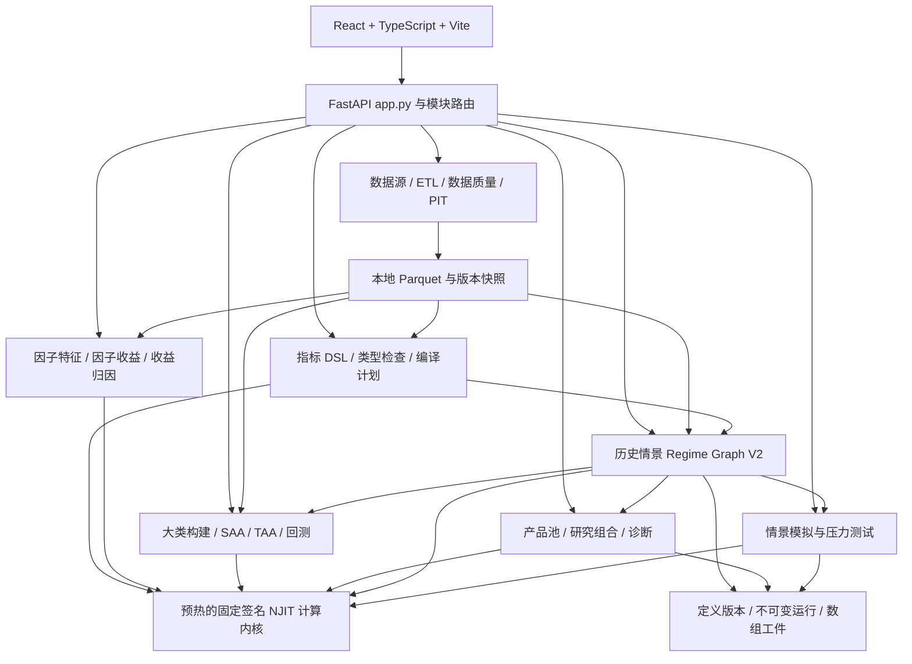
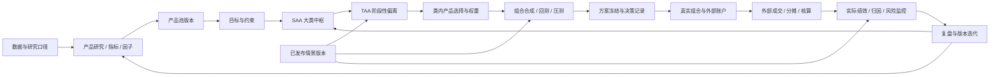
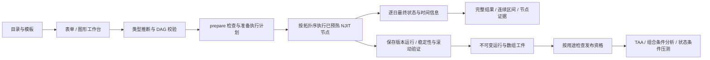
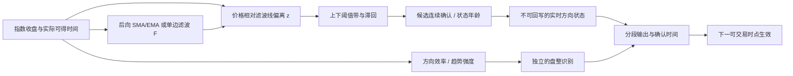

# 投研全流程与历史情景识别：代码审计及算法调研

审计日期：2026-09-07。对象：当前工作区，分支 `codex/frontend-investment-process-framework`，HEAD `10925027961d98f85400f1163b236621d6586ca6`，包含既有未提交代码。本文是分析结果与设计建议，没有修改业务算法、重写历史结果或发布新模型。

**结论先行**

你指出的“色带区间与行情实际峰谷不一致”有具体证据。但现有实现并非“第一次识别后，预先往后圈定固定长度区间”，而是每天产生状态，确认切换后继续保留，最后把连续同状态日期合并。区间结束日随后续信号产生，不是在开始时预测出来的。

问题分为三层：一是将实时趋势状态称为历史牛熊区间，业务含义不清；二是旧 V1 和当前 V2 默认模板实际计算不同；三是 V2 确认内核存在可复现的状态卡住缺陷。应先明确标签用途并修正实现，再比较滤波方法，不能仅靠延长窗口或减少切换次数判断改进有效。

**1. 建图与项目背景**

按 `AGENTS.md → docs/repo_map.json → docs/task_routes.json → docs/pitfalls.json` 的顺序定位，重点采用项目总览 R01 与历史情景 R76 路由，再沿真实前后端调用链展开。

执行 `codegraph sync .` 返回 Already up to date；`codegraph status .` 确认索引包含 **581 个文件、12,574 个节点、40,528 条边**，索引位于项目 `.codegraph/`。以下图是根据 CodeGraph 和源码整理的业务架构投影，并非 CodeGraph 自动生成的业务解释。图谱用于定位依赖，不能证明数值正确性。

项目定位是服务资产所有者的内部“资产配置投研与组合管理平台”。业务对象是 ETF、场外公募基金及研究组合，主体可以是个人、企业或家族持有实体。研究组合承载假设与模拟结果；真实组合承载账户、持仓、现金和实际绩效，二者须保持独立。



技术上是模块化单体。`backend/app.py` 注册业务路由并在启动阶段预热计算内核；各业务服务负责数据、参数、任务和结果，NJIT 负责核心数值计算。本次核实历史情景的实际数值调用，未把全项目存在预热入口当作全项目合规验收。

主要背景依据：[README](/Users/chenjunming/Desktop/KevinGit/FundInvestmentResearchPlatform-frontend-framework/README.md)、[领域语言](/Users/chenjunming/Desktop/KevinGit/FundInvestmentResearchPlatform-frontend-framework/CONTEXT.md)、[投研流程大纲](/Users/chenjunming/Desktop/KevinGit/FundInvestmentResearchPlatform-frontend-framework/公募基金量化投资流程大纲.md)、[应用启动与路由](/Users/chenjunming/Desktop/KevinGit/FundInvestmentResearchPlatform-frontend-framework/backend/app.py:146)。

**2. 投研全流程及当前能力边界**



| 环节 | 输入和输出 | 本次代码核实的能力边界 |
| --- | --- | --- |
| 数据基础 | 供应商与上传数据 → 标准字段、可用时间、快照 | 数据源、ETL、质量检查和版本管理有后端；PIT 已新增 audit/release/context API，不能继续概括成只有原型，也不能由此认定所有数据都满足 PIT |
| 产品研究 | ETF/基金 → 业绩、风险、比较和评价 | 指标、评价方案、产品研究有计算链路；披露持仓穿透与完整管理人研究仍不完备 |
| 因子研究 | 产品特征、因子序列 → IC、分组表现、暴露、贡献 | 新工作区已有因子特征、因子收益、RBSA/FF3/通用收益归因服务；收益估计暴露不等于披露持仓 |
| 产品池 | 评价和研究证据 → 可投资域版本 | 已有产品池服务、版本及下游引用，不只是静态候选清单 |
| SAA | 目标约束、大类代理 → 长期权重及风险预算 | 大类构建、自动分类、优化、有效前沿、调仓回测已有实现；完整投资目标工作流仍局部原型 |
| TAA | SAA 基线、已发布实时情景 → 大类偏离与回测 | 历史状态绑定、时点与发布门槛、TAA 回测已有链路；不能把事后峰谷标签直接当可交易信号 |
| 产品配置与组合研究 | 大类权重、具体产品 → 研究组合快照 | 组合构建、真实净值、权重路径、诊断和导出已实现核心流程；端到端风险检查与决策归档仍不完整 |
| 情景研究 | 指数/宏观/指标 → 状态序列；状态/冲击 → 压测结果 | 历史识别和情景模拟是两套服务；后者已有历史重演、因子路径、Monte Carlo、状态条件、反向压力方法 |
| 投中与核算 | 真实账户事实 → 分摊、Booking、持仓现金 | 页面、演示数据和局部数值校验存在，不能视为完整生产账务或交易执行系统 |
| 投后与反馈 | 已核对的实际数据 → 绩效、归因、监控、研究更新 | 局部研究归因已出现，但真实组合账务驱动的完整投后闭环仍未完成 |

代表性代码：[流程注册表](/Users/chenjunming/Desktop/KevinGit/FundInvestmentResearchPlatform-frontend-framework/frontend/src/app/processRegistry.ts:46)、[研究组合服务](/Users/chenjunming/Desktop/KevinGit/FundInvestmentResearchPlatform-frontend-framework/backend/custom_indicators/portfolio_service.py:197)、[策略回测入口](/Users/chenjunming/Desktop/KevinGit/FundInvestmentResearchPlatform-frontend-framework/backend/services/strategy_routes.py:303)、[因子归因服务](/Users/chenjunming/Desktop/KevinGit/FundInvestmentResearchPlatform-frontend-framework/backend/factor_research/service.py:277)、[PIT 接口](/Users/chenjunming/Desktop/KevinGit/FundInvestmentResearchPlatform-frontend-framework/backend/services/pit_routes.py:39)。上述是代码存在和调用关系结论，非全部页面及外部数据的运行验收。

**3. “历史情景识别”实际如何运行**

界面路径是“设置 → 情景算法中心 → 历史情景识别 → 模板/已有研究 → 工作台”。`ScenarioCenters` 将它与“情景模拟与压测”分开。工作台默认运行模式是 `realtime`。



数据节点可以引用指数、宏观、已登记上传序列、指标版本等；中间节点包括变换、显式对齐、SMA/EMA/单边 Kalman、滚动统计、阈值/滞回、峰谷、HMM/Markov/GMM、变点和集成；输出节点与确认后处理共同确定最终状态。这是一套通用图形计算系统，默认模板只是其中一种组合。

正式运行绑定定义 ID/revision、数据指纹与准备好的计划。`run_saved` 持久化最终序列、节点输出和评价结果；发布检查版本血缘、快照完整性和用途资格。TAA 与组合回测消费者另检查实时性，并使用 `effective_date` 对齐，不能把图上的观察日期直接当成交日期。

源码入口：[界面分工](/Users/chenjunming/Desktop/KevinGit/FundInvestmentResearchPlatform-frontend-framework/frontend/src/pages/ScenarioCenters.tsx:7)、[工作台默认模式](/Users/chenjunming/Desktop/KevinGit/FundInvestmentResearchPlatform-frontend-framework/frontend/src/pages/HistoricalRegimeWorkbench.tsx:174)、[节点执行](/Users/chenjunming/Desktop/KevinGit/FundInvestmentResearchPlatform-frontend-framework/backend/historical_regimes/v2_service.py:2249)、[正式运行](/Users/chenjunming/Desktop/KevinGit/FundInvestmentResearchPlatform-frontend-framework/backend/historical_regimes/v2_service.py:3678)、[发布](/Users/chenjunming/Desktop/KevinGit/FundInvestmentResearchPlatform-frontend-framework/backend/historical_regimes/v2_service.py:4180)、[下游时间对齐](/Users/chenjunming/Desktop/KevinGit/FundInvestmentResearchPlatform-frontend-framework/backend/portfolio_regime.py:366)。

**4. 默认牛熊算法与用户观察的差异**

| 对比 | 旧 V1；本地已保存结果使用此版 | 当前 V2 默认模板 |
| --- | --- | --- |
| 主输入 | 沪深300 close | 沪深300 close |
| 趋势特征 | log(close) → EMA20 → 5 期差分斜率 | log(close) → 20 期滚动 OLS 斜率 |
| 牛/熊进入阈值 | +0.0015 / −0.0015 | +0.0015 / −0.0015 |
| 退出至中间态阈值 | +0.0002 / −0.0002 | +0.0002 / −0.0002 |
| 确认与持续 | 3 期确认、5 期最短间隔 | 3 期确认、5 期持续参数，但计数实现有缺陷 |
| 状态含义 | 平滑趋势斜率的实时三分类 | 近期回归趋势斜率的实时三分类 |
| 是否价格与滤波线交叉 | 否，有滤波但分类使用斜率 | 否，模板没有滤波节点 |

这里的阈值单位是“每观察期的对数价格斜率”，并不是指数累计涨跌 0.15%。同样的阈值配不同特征、日周月频率，不具有同一经济含义。

V1 的斜率为 `s(t) = [EMA(log P)(t) − EMA(log P)(t−5)] / 5`。V2 是在最近 20 个对数价格点上对观察序号做线性回归所得的斜率。因此，V2 模板不能被视为旧算法仅换成画布后的等价版本。

证据：[V1 模板](/Users/chenjunming/Desktop/KevinGit/FundInvestmentResearchPlatform-frontend-framework/backend/historical_regimes/contracts.py:44)、[V1 特征计算](/Users/chenjunming/Desktop/KevinGit/FundInvestmentResearchPlatform-frontend-framework/backend/historical_regimes/numba_kernels.py:291)、[V2 模板](/Users/chenjunming/Desktop/KevinGit/FundInvestmentResearchPlatform-frontend-framework/backend/historical_regimes/v2_templates.py:94)、[V2 斜率与滞回内核](/Users/chenjunming/Desktop/KevinGit/FundInvestmentResearchPlatform-frontend-framework/backend/historical_regimes/v2_numba.py:109)。

本地 `data/historical_regime_runs.json` 中有 3 次 2026-09-04 保存的 V1 试算，每次 4,049 个观察点、233 个分类区间，覆盖 2010-01-04 至 2026-09-03。它们没有已保存定义引用，快照也记录不能发布；不能当成已发布正式研究。

其中日频运行 `regime-run-cf9eabfddc354ee59d32502de57ab3c0` 的 2015 年最高收盘观察值为 **2015-06-08，5353.7514**；其牛市色带为 **2015-03-04 至 2015-06-23**，熊市从 **2015-06-24** 开始。这是本地保存数据的核实结果，没有重新向外部供应商核验历史行情。

因此，你对色带与行情拐点不一致的观察成立；其主要语义原因是模型在后续价格数据使斜率和确认条件成立后才切换。不能要求一个实时确认标签同时精确落在事后最高点。

区间汇总代码只把连续相同状态合并，起止采用观察日期；图表使用观察序号边界绘制色带。没有发现“第一天识别后固定外推一个牛熊区间”的逻辑。[区间汇总](/Users/chenjunming/Desktop/KevinGit/FundInvestmentResearchPlatform-frontend-framework/backend/historical_regimes/analytics.py:135)、[V2 完整结果分段](/Users/chenjunming/Desktop/KevinGit/FundInvestmentResearchPlatform-frontend-framework/backend/historical_regimes/result_overview.py:20)、[色带绘制](/Users/chenjunming/Desktop/KevinGit/FundInvestmentResearchPlatform-frontend-framework/frontend/src/pages/regime-workbench/RegimeTimelineChart.tsx:23)。

另一个值得复核的旧结果问题：三次运行分别声明 daily、weekly、monthly，却都保存 4,049 条逐日日期和相同区间数。仅改变频率标签显然没有在这些历史结果中产生周/月重采样；年化和窗口解释可能因此受影响。这是历史工件的证据，不据此推断当前 V2 显式重采样节点仍有相同缺陷。

**5. 已复现的实现缺陷和解释性不足**

**V2 最短持续期可能使状态永久卡住。** `confirmation_state_kernel` 在确认新状态时将 `active_duration` 设为 1。此后只有 `observed == active` 才增加它；反向信号只有在它已经达到 `min_duration` 后才能被计数。如果原始信号在持续期满足之前永久反转，计数就停住，反向确认永远不能开始。这违反了界面对“状态一旦生效，至少保持的期数”的说明。

直接调用当前已经编译的 NJIT 内核，`confirmation=3, min_duration=5`：

```text
原始输入：牛 牛 牛 熊 熊 熊 熊 熊 熊 熊 熊 熊 熊 熊 熊
实际输出：未 未 牛 牛 牛 牛 牛 牛 牛 牛 牛 牛 牛 牛 牛
```

还通过 `RegimeGraphV2Service.prepare → _execute_graph` 运行了默认 V2 模板，仅把指数数据源换成临时合成价格，保持其余算法参数不变：先 22 点按对数步长 +0.01 上升，再 12 点按 −0.2 下降。原始分类从观察索引 24 起持续为熊，最终状态却从索引 21 起一直为牛；执行审计为 `request_time_compilation=0`。这是刻意构造的极端测试路径，用于证明缺陷可经真实图谱调用链触发，不代表市场中发生频率。温和下降的对照样本能够正常转熊。

源码：[确认内核](/Users/chenjunming/Desktop/KevinGit/FundInvestmentResearchPlatform-frontend-framework/backend/historical_regimes/v2_numba.py:248)、[实际调用入口](/Users/chenjunming/Desktop/KevinGit/FundInvestmentResearchPlatform-frontend-framework/backend/historical_regimes/v2_service.py:2361)、[参数业务说明](/Users/chenjunming/Desktop/KevinGit/FundInvestmentResearchPlatform-frontend-framework/backend/historical_regimes/v2_registry.py:159)。

修正方向是明确状态年龄的计时基准，使其随已经过的有效观察期或规定交易期推进，而不取决于原始信号是否继续支持旧状态；反向候选的连续计数应与持有期约束独立维护。当前 V1 使用 `index - last_switch`，不能把这个 V2 缺陷倒推为 V1 保存结果的原因。

**缺失值没有中断“连续确认”计数。** 输入 `牛、缺失、牛、缺失、牛`，上述 V2 内核在第五点确认牛。缺失日虽然输出未分类，候选计数却跨越缺失保留。需要明确“连续期”是否允许跨缺失；按当前界面文案，至少应中断确认或明确标示该规则。

**三状态的业务定义过弱。** 当前中间态主要是斜率回到阈值带，并没有独立检验区间宽度、方向效率或趋势强度。因此“趋势减速”会被叫作震荡，“弱上涨/弱下跌”也可能落入震荡；无法直接等同于经济意义上的横盘市场。

**概率和确认延迟需要说明。** 默认 V2 模板只输出最终 `state`。服务补出的概率是确定性 one-hot，`probability_source=deterministic_state`，不是校准后的牛熊概率。默认识别索引设为当前点，下一观察点生效；这可以表达最终标签何时可用，却不测量从首次交叉、原始候选或经济拐点到确认的全部延迟。最终主序列的 `filtered_value` 和 `score` 又被设为 None，节点调试能看中间值，主图却缺少解释滤波和阈值的直接证据。[结果序列封装](/Users/chenjunming/Desktop/KevinGit/FundInvestmentResearchPlatform-frontend-framework/backend/historical_regimes/v2_service.py:2670)。

**6. 有代表性的文献方法：先分用途，再选算法**

没有统一、可观测的“真实牛熊标签”。更严谨的问法是：希望划分哪种指数、什么时间尺度、哪些幅度和持续性特征，以及标签用于历史解释还是当时决策。Kole 与 van Dijk 的比较研究在其 S&P 500 样本中发现，规则法更适合样本内状态识别，Markov 切换模型更适合样本外预测；这不是某个模型在所有市场更优的证明。[Kole & van Dijk，2017，Journal of Applied Econometrics](https://onlinelibrary.wiley.com/doi/abs/10.1002/jae.2511)。

| 方法族 | 实际识别逻辑 | 时间信息边界 | 本项目的合适用途 |
| --- | --- | --- | --- |
| Pagan–Sossounov（PS）峰谷规则 | 局部峰谷、峰谷交替，再施加阶段/周期持续和幅度约束 | 经典算法使用未来窗口，属于事后定年 | 历史牛熊区间基准、产品分段评价 |
| Lunde–Timmermann（LT）幅度规则 | 跟踪峰谷，达到足够回撤或反弹后确认反转 | 触发可以顺序计算；确认后回溯峰谷的历史标签仍含事后信息 | 幅度驱动历史区间；另保留在线确认流 |
| 长均线与价格交叉 | 比较指数与长期均线；可用上下带减少反复切换 | 后向均线可因果计算；必须另约定成交时点 | 可解释、容易复核的实时基准 |
| EMA / KAMA / Kalman / Ehlers 滤波 | 先估计平滑趋势，再比较价格与趋势或趋势斜率 | 递推滤波可因果；参数估计、平滑和去噪也要守住时间边界 | 你描述方法的候选框架 |
| HMM / Markov 切换 | 根据收益、波动等特征推断潜在状态和转移 | 过滤概率与全样本平滑概率不同；参数只能来自当时训练集 | 概率型状态研究、条件情景与预测比较 |

**历史区间基准：PS。** 原文附录先用左右各 8 个月找峰谷，再保证交替，筛除过短周期/阶段：完整周期至少 16 个月、阶段至少 4 个月，并有超过 20% 涨跌的例外。它说明长期牛熊研究通常显式处理峰谷、持续与幅度，不能把其月频参数直接当成日频参数。这些是该论文的设定，不是行业统一标准。[Pagan & Sossounov，2003，原文及附录 B](https://onlinelibrary.wiley.com/doi/full/10.1002/jae.664)。

**幅度基准：LT。** 多头阶段跟踪峰值，回撤达到阈值确认空头；空头阶段跟踪谷值，反弹达到阈值确认多头。阈值可以不对称。若事后把空头起点回填到前面的峰值，必须保留另一个确认时间字段，不能声称在峰值当天已识别空头。芝加哥联储论文展示了采用 LT 方法及回溯标签的过程。[Lunde & Timmermann，2004，论文入口](https://www.tandfonline.com/doi/abs/10.1198/073500104000000136)、[Chabot 等，2014，Chicago Fed Working Paper，§1.1](https://www.chicagofed.org/~/media/publications/working-papers/2014/wp2014-27-pdf.pdf)。前者正文此次未能获取；详细过程依据后者公开原文。

**实时基准：长期均线。** Faber 的公开研究采用月末价格相对 10 月简单均线的规则，并讨论常用的 200 日均线。这为指数与滤波线交叉提供了可复核的实践基准。但它是风险管理/择时规则，不是精确恢复经济峰谷的算法；其原文包含月末同收盘成交假设，项目实现应单独采用可执行的下一交易时点，且区分价格指数与全收益指数。[Faber，2007，2013 更新版，pp.19–22](https://mebfaber.com/wp-content/uploads/2016/05/SSRN-id962461.pdf)。

**7. 你记忆中的“滤波线交叉＋噪声汇聚”**

描述与“因果趋势滤波 → 价格/趋势差值 → 状态机去抖”的方法族一致。滤波器候选包括 EMA、KAMA、单边 Kalman，以及 Ehlers 的低滞后滤波。LLT 也是进一步核对原始出处的检索线索；目前没有找到足以唯一确定你所指完整算法的原始资料，不能把这些名称说成同一种算法。

Ehlers 的 SuperSmoother 原文给出递推滤波，只引用当前/过去价格及过去滤波值；thinkorswim 官方指标库也提供该指标。这能支持它是有正式出处和平台采用的滤波技术，不能据此推断“配上任意交叉和合并规则”就是业内公认最优牛熊算法。[Ehlers 原文公开副本，2013](https://c.mql5.com/forextsd/forum/118/predictiveindicators.pdf)、[thinkorswim 官方 SuperSmoother 说明](https://toslc.thinkorswim.com/center/reference/Tech-Indicators/studies-library/E-F/EhlersSuperSmootherFilter.html)。

KAMA 的关键是效率比：一段价格的净方向位移，除以同段逐期绝对位移之和。单向运动效率高，来回震荡效率低，据此调整平滑速度。这也为震荡识别提供了一个可解释的辅助特征，但阈值仍需检验。[thinkorswim 官方 KAMA 说明](https://toslc.thinkorswim.com/center/reference/Tech-Indicators/studies-library/M-N/MovAvgAdaptive)。

严格无未来信息要求整个链路满足：对固定参数和固定数据版本，用截至 t 的数据算出的历史结果，与后面追加数据后的前 t 段结果一致。仅滤波线本身是单边，不能证明最后的牛熊色带无未来信息。

| 去噪操作 | 能否保持历史标签不重绘 |
| --- | --- |
| 交叉后等待连续 k 期；确认前保留旧状态，确认当天起改变 | 可以；代价是等待和可能错过部分行情 |
| 上穿较宽上带进入牛，下穿另一下带才转熊；带内延续状态 | 可以；属于滞回/缓冲带 |
| 按过去信息累计反向幅度或证据，超过阈值再切换 | 可以；累计与阈值校准也必须仅使用当时信息 |
| 看到“牛—短熊—牛”后，把中间已输出的熊改为牛 | 不可以作为不可重绘在线标签；这是事后段合并 |
| 中心窗口多数投票、全样本平滑、全路径最优状态解码 | 通常使用未来信息，不能直接当实时结果 |

一个简单例子：今天出现熊信号，未来可能只是两天回调，也可能是持续一年下跌。今天的数据不能区分这两条尚未发生的路径。既要当天精确抓住反转，又要事后完全消除所有假反转，还要求历史永不修改，三者不能同时保证。

`scipy.signal.filtfilt` 明确先正向再反向滤波，产生零相位效果。因此“零相位、看起来不滞后”尤其需要排查是否使用未来数据。它与仅向前执行的滤波不是同一信息口径。[SciPy 官方文档](https://docs.scipy.org/doc/scipy/reference/generated/scipy.signal.filtfilt.html)。同理，状态模型的 filtered 概率只使用截至 t 的观察，而 smoothed 概率使用全样本；即使选 filtered，若参数是在全样本拟合，仍可能泄漏未来信息。[statsmodels 官方示例](https://www.statsmodels.org/stable/examples/notebooks/generated/markov_autoregression.html)。

**8. 建议的产品和算法设计**

建议保留现有 Regime Graph 的数据、节点、快照和发布结构，明确区分下面三个结果概念，不要用一种色带同时解释三件事。

| 结果 | 回答的问题 | 起止依据 |
| --- | --- | --- |
| 历史行情区间 | 回头看，这一段主要上涨、下跌还是盘整？ | 峰谷或事后分段；明确可修订、截至日期与算法版本 |
| 实时识别状态 | 在当日可得信息下，模型判断什么状态？ | 确认当日开始；禁止后续回写已确认历史 |
| 策略生效状态 | 哪个交易时点可以据此改变组合？ | 根据确认时间、可交易日历和执行规则生成 |

可以共享同一算法的特征和候选证据，但必须显式记录 `candidate_start / recognized_at / effective_date`，以及历史分段所需的峰谷/归属起点。实时流无需被事后历史色带覆盖；最新尚未结束的阶段也不应因样本结束而被解释为牛熊已经终止。

对你描述的方法，我建议第一轮比较采用以下框架，作为待验证设计，不冒充某篇论文的原封不动实现：



例如取正值价格和趋势线，定义 `z(t)=P(t)/F(t)-1`。较简单的方向基准是 z 高于正阈值候选转牛，低于负阈值候选转熊，缓冲带中延续旧方向，连续满足后切换。可以比较固定百分比带和过去波动调整带；两者不能用同一数值阈值直接互换。若低滞后滤波会过冲或输出非正值，需另设输入/输出有效性检查。

震荡识别应单独约定“方向效率低、趋势弱、围绕趋势线往复”之类条件，并设置自己的确认和退出阈值。**低波动不等于震荡，趋势减速也不等于横盘。** 如果目标是完整的大牛熊周期，最好同时输出“长期方向：牛/熊”和“短期结构：推进/整理/反弹”，因为牛市中的整理和熊市中的反弹不必强行改变长期方向。三分类标签可作为这两层的明确映射，而非随意合并短区间。

默认模板建议分为：

1. **历史牛熊周期：PS/LT 类基准。** 用于历史解释；当前 `model.turning_point` 已有左右窗口峰谷实现，可复用基础设施，但它只有窗口和幅度判断，不是完整 PS/LT 复现。
2. **实时长期趋势：长期均线＋缓冲带。** 作为透明、易复核基线；200 日和月末 10 月均线是不同频率的两个基准，不视为完全相同。
3. **实时滤波趋势：EMA/KAMA/Kalman/SuperSmoother＋去抖。** 以更低滞后、更少短暂切换和更稳定样本外表现为待验证目标；先用现有 EMA/SMA/Kalman 节点，新增滤波器须有独立内核与参数说明。
4. **概率状态：HMM/Markov。** 明确训练截止、过滤概率、状态映射和估计不确定性，不把分量编号自然解释成牛熊。

**9. 验证与实施顺序**

优先处理 V2 持续期计数和缺失确认的契约，随后明确 V1/V2 模板命名与时间语义，再开展算法对比。算法比较要锁定指数口径、采样频率、训练/测试分段和参数选择过程，避免以全样本最好看的色带反过来选参数。

验收应同时包含：

- **实现正确性**：快速反转不能卡住；缺失/NaN/Inf 不可变成震荡或零；常数价格、空样本、窗口不足、等阈值、频率切换都有明确结果。
- **无未来信息**：逐前缀重放；只修改未来数据不得改写历史实时标签；训练与归一化参数、缺失处理、最终去噪一并测试。
- **区间质量**：切换次数、短区间比例、持续时间分布、方向与区间收益的对应、转折确认滞后、未分类覆盖；事后标签可看峰谷偏差，但实时信号不能以零偏差为验收要求。
- **决策价值**：样本外收益/回撤/风险暴露、换手和成本、危机响应与反弹捕获；用于实时决策时评价确认后未来表现，不能把构造标签时已经看到的收益当预测能力。
- **对照与稳健性**：现行模板、长均线基准、替代滤波法；多个指数、多个周期，参数邻域与逐段样本外比较。
- **执行约束**：固定 dtype/连续数组、默认 NJIT、启动预热、请求期不编译、无 Python fallback；新增数值功能遵循项目 AGENTS 的一致性及边界测试要求。

本次运行的现有测试：

```text
工作目录：backend
NUMBA_CACHE_DIR=/private/tmp/regime-audit-numba-20260907 \
  /Users/chenjunming/Desktop/myenv_312/bin/python3.12 -m pytest \
  tests/test_historical_regime_overview.py \
  tests/test_historical_regime_v2.py \
  tests/test_historical_regime_v2_p1.py -q -p no:cacheprovider

74 passed, 1 warning in 22.25s
```

另行执行了上文的确认内核反例、缺失确认反例、温和反转对照，以及默认 V2 模板的极端反转服务链路。**现有测试通过与反例失败同时成立：测试未覆盖该状态机语义。** 没有运行全仓回归、浏览器验收、真实服务重启或新算法的多指数绩效比较，因此本文没有声称任何候选算法已被证明优于当前算法。

研究依据采用原始论文、作者公开文稿及官方指标/软件文档。中文 LLT 与具体“噪声汇聚”组合检索没有获得可唯一对应用户记忆的原始方法，保留这一不确定性；不以论坛或策略复现文章证明行业认可度。后续最有价值的工作是按上述明确口径做受控比较，而不是继续增加没有来源和验收标准的模板名称。
