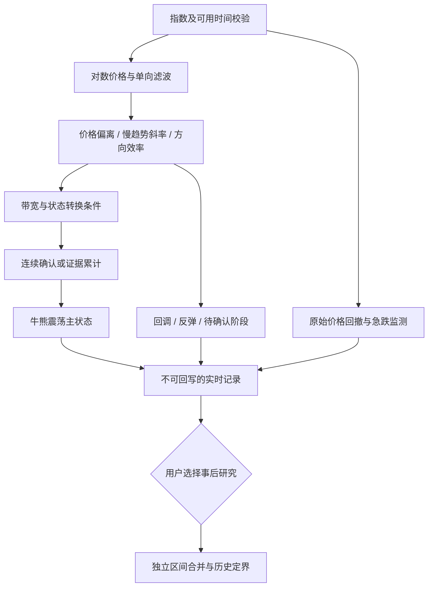

# 指数、滤波与噪声过滤：牛熊震荡市场识别研究

日期：2026-09-07。面向本项目的算法设计与投研应用。范围：指数价格驱动的中长期市场状态、实时去噪和事后分段；不讨论宏观估值模型，也不对当前市场作投资判断。

**建议：建立“慢趋势主状态＋回调/反弹子状态＋独立风险标记”。以长期均线为基准，比较 Super Smoother、KAMA；通过带宽、持续确认和趋势强度减少误切换。实时结果禁止回写历史，事后结果独立保存。**

这是有文献依据的工程研究方案，尚未经过本项目指数数据的样本外验证，不能称为“业内统一标准”或“最优算法”。本次只形成研究文档，未修改业务算法。

**一、先明确到底要识别什么**

同一个指数可以处于“长期牛市、近期回调”。如果把每次短线向下都叫熊市，再强行删除，实际上混淆了观察尺度。

建议输出三个相互区分的维度：

| 维度 | 回答的问题 | 输出示例 |
|---|---|---|
| 主状态 | 在预先选定的中长期尺度上，市场处于什么趋势？ | 牛、熊、震荡 |
| 内部阶段 | 主状态之内，最近价格如何运动？ | 上行、回调、反弹、盘整、反转待确认 |
| 风险 | 是否已经发生需要关注的急跌或大幅回撤？ | 正常、急跌警报、重大回撤 |

预热不足、数据缺失和无法形成初始判断，单独返回“无法判断”，不能塞进震荡市。震荡也不等于低波动：大幅来回涨跌仍可能没有持续方向。

Maheu、McCurdy、Song 的研究明确区分牛市、牛市回调、熊市、熊市反弹。这支持“主行情包含反向阶段”的建模思想，但其概率模型并不证明本文提出的滤波规则有效。[作者会议材料，2010](https://www.fieldsinstitute.ca/programs/scientific/09-10/bachelier/talks/Fri/Thompson/bfs472maheu-mccurdy-song.pdf)；[2012 年论文记录](https://papers.ssrn.com/sol3/papers.cfm?abstract_id=2171892)。

**二、已有研究能支持到什么程度**

| 方法 | 有依据的用途 | 不能据此声称 |
|---|---|---|
| 长期均线、时间序列动量 | 用自身历史价格或收益识别持续方向，作为可解释基准 | 均线交叉就是真实经济牛熊分界 |
| Pagan–Sossounov 峰谷法 | 事后研究较长的牛熊区间，约束持续时间和幅度 | 当时就知道峰谷；直接得到震荡类 |
| Lunde–Timmermann 幅度法 | 用相对运行峰谷的累计涨跌确认变化 | 回溯到峰谷的历史标签可用于实时交易 |
| Super Smoother、KAMA | 构造平滑趋势及响应机制 | 已被证明优于长期均线的牛熊分类器 |
| 滞回、持续确认、CUSUM | 减少阈值附近的反复触发，积累变化证据 | 有统一适用于所有指数的参数 |

Faber 的研究给出了月末价格与 10 个月 SMA 比较的简单规则；它是择时基准，不是三分类定义。其原文采用信号日收盘成交假设，本项目若用收盘后才确定的信号，应按下一可执行时点验证。[Faber，A Quantitative Approach to Tactical Asset Allocation](https://mebfaber.com/wp-content/uploads/2016/05/SSRN-id962461.pdf)。

Moskowitz、Ooi、Pedersen 的跨资产研究支持过去收益的趋势延续现象；研究对象包括期货与远期合约，不构成对某个中国现货指数三分类方案的直接验证。[Time Series Momentum，2012](https://www.aqr.com/Insights/Research/Journal-Article/Time-Series-Momentum)。

**三、滤波器怎么选择**

| 方法 | 放在这套体系中的角色 | 主要局限 | 研究优先级 |
|---|---|---|---|
| SMA / EMA | 长趋势基准线 | 滞后、横盘反复交叉 | 必须保留的基准 |
| Ehlers Super Smoother | 固定参数的低通趋势线，适合研究价格与线的关系 | 仍有滞后；二阶递推可能过冲 | 首批候选 |
| KAMA | 根据方向效率自适应调整平滑程度 | 参数含义更多；响应随路径变化 | 首批对照 |
| Alpha–Beta | 同时估计趋势位置与速度 | 匀速跟踪时价格残差趋小；不能机械依赖价格穿线 | 第二批，速度方案 |
| Laguerre RSI | 回调、反弹等动量阶段 | 饱和值不等于未来上涨概率 | 辅助解释 |
| ZLEMA MACD | 快慢趋势差和动量变化 | 补偿可能放大过冲；柱值转正不等于牛市 | 辅助解释 |

后面三项的角色判断来自本轮对话提供的递推公式；未把外部 PyFinance 实验脚本重新审计成当前项目实现。ZLEMA 的公开平台支持只能证明该指标存在，不能证明组合后的牛熊识别效果。[QuantConnect ZLEMA 文档](https://www.quantconnect.com/docs/v2/writing-algorithms/indicators/supported-indicators/zero-lag-exponential-moving-average)。

对 Super Smoother，令输入为对数指数 x，周期参数为 P：

\[
\theta=\sqrt{2}\pi/P,\quad a=e^{-\theta},\quad
c_2=2a\cos\theta,\quad c_3=-a^2,\quad c_1=1-c_2-c_3
\]
\[
f_t=c_1(x_t+x_{t-1})/2+c_2f_{t-1}+c_3f_{t-2}.
\]

该递推只使用当期及过去值。这里将原文价格输入改为对数价格，是本方案的工程选择。P 控制频率响应，不等于 SMA(P)，更不代表输出区间至少持续 P 天。原文的 10 根示例面向其噪声和交易讨论，不能直接照搬为长期牛熊周期。低通只能按频率抑制波动，无法证明被压掉的变化没有经济意义。[Ehlers，Predictive Indicators，2013，代码清单 1](https://c.mql5.com/forextsd/forum/118/predictiveindicators.pdf)。

KAMA 使用效率比调整增益。其核心效率比是“净位移／累计绝对位移”，强定向运动接近 1，来回运动较接近 0。[MetaTrader 官方公式](https://www.metatrader5.com/en/terminal/help/indicators/trend_indicators/ama)。采用 KAMA 后再加效率比门槛，不是两份独立证据，需要检查是否重复过滤。

Alpha–Beta 在稳定的线性趋势中可以让估计位置跟上实际价格，因此即使趋势持续向上，价格与滤波线的距离也可能很小。这是从递推方程得出的性质：该分支应以速度 V 及其阈值为主，不能与 Super Smoother 共用同一组穿线门槛。

**四、推荐的实时流程**

这不是将六个指标投票。第一版只需要一条主趋势线、少量特征和明确的状态转换规则。

**1. 输入、尺度与时间**

建议先研究宽基指数的完整日收盘数据，长期尺度另做月末或已完成周线对照。每个定义固定指数、价格指数/全收益指数、币种、交易日历、观察频率与数据快照。描述市场价格与评估可投资收益，须分别明确口径。

日线的 P=20 不能直接解释为宏观牛熊；日线 20 根和周线 20 根也不是同一方案。当前尚未收完的周线/月线不能伪装成已完成观测。

**2. 三个核心特征**

设指数收盘为 C_t>0，对数价格 x_t=log C_t，对数收益 r_t=x_t-x_(t-1)，滤波结果为 f_t，显示到价格图上时画 exp(f_t)。

为适应指数尺度，定义：

\[
q_{t-1}=\max\left(q_{\min},\sqrt{\operatorname{EWMA}_{m}(r^2)_{t-1}}\right),
\quad d_t=\frac{x_t-f_t}{q_{t-1}},
\quad s_t=\frac{f_t-f_{t-h}}{h q_{t-1}}.
\]

d 是价格相对趋势线的偏离；s 是过去 h 根的平均趋势变化，相对于每根收益尺度的大小。q 是过去收益的均方根尺度，并非去均值标准差。使用上一期尺度是避免当日急跌同时放大分母、削弱当日异常程度的设计选择；它不能消除所有波动适应问题。

这两项只是无量纲特征，不是统计检验的 z 值或显著性概率。不同滤波器和 h 不能共用未经校准的阈值。若只有收盘数据就不要冒充计算完整 ATR；有高低收数据时，可另测 ATR 通道。

再计算过去 n 根的方向效率：

\[
ER_t=\frac{|x_t-x_{t-n}|}{\sum_{i=t-n+1}^{t}|x_i-x_{i-1}|}.
\]

分母为零且整个窗口有效时，设 ER=0；缺失窗口返回无法判断。ER 采用公开效率比结构，在对数空间计算属于本方案变体。它不表示方向，也不能单独证明震荡：一次急剧 V 形反转可能净位移小、ER 低，但风险很高。

**3. 一个可以实现并检验的三状态规则**

下面是本研究提出的起始设计，不是引用某篇论文的标准算法。设 b_on>0，s_on>s_off≥0，0≤e_off≤1：

| 候选状态 | 条件 |
|---|---|
| 牛 | d_t≥b_on，且 s_t≥s_on |
| 熊 | d_t≤−b_on，且 s_t≤−s_on |
| 震荡 | \|s_t\|≤s_off，且 ER_t≤e_off |
| 暂不提出新状态 | 以上均不满足 |

三个正式候选条件互斥。候选要连续出现 k 根，才替换已确认主状态。没有候选时，保留旧状态，同时显示“趋势减弱/反转待确认”；从未确认过状态则返回无法判断。候选回到原状态、改变方向、消失或出现缺失，连续计数清零。

这里“进入门槛”与“维持条件”不同：已经处于牛市时，某一天不再满足牛市进入条件，不会自动变为熊市。连续出现足够明确的熊候选或震荡候选，才切换。宽带保留状态的思想来自滞回比较器；其工程抗抖原理不等于金融收益证据。[Texas Instruments 滞回比较器说明](https://www.ti.com/tool/CIRCUIT060078)。

**保留旧状态是一种有延迟的估计，并不保证它仍然正确。** 如果证据长期停留在门槛间，状态可能显著滞后；因此必须同时展示待确认持续时间与当前特征，并在验证中惩罚这种情况，不能只统计切换次数。

可另测“斜率主导”版本，去掉价格带宽的硬性入场条件，改为斜率加效率确认，以减少低滞后滤波器残差过小导致的漏识别。它与穿线版本是两个独立候选，不在结果不理想时临时切换规则。

**4. 牛市中的短暂熊信号怎么处理**

在尚未满足反转条件前，负向偏离记录为“牛市回调/反转待确认”，原始信号保留。若很快恢复，主状态从未切换，不需要事后抹除任何历史。

例如旧状态为牛，确认要求 3 根；连续两根出现熊候选，第三根恢复，候选被取消。若连续三根满足，则第三根收盘确认熊，不能把前两根补画为“当时已识别的熊”。

若第三根确认后第四根迅速反弹，实时记录中这次切换仍然保留。为了图形连续而删除这次已确认切换，就是事后改写。

**5. 震荡的识别必须有自己的证据**

“价格在线附近”不充分：很灵敏的趋势线在强趋势中也能紧贴价格。更合适的组合是慢趋势接近平坦，且在匹配尺度上方向效率较低，再加持续确认。

有 OHLC 时，可把 ADX 作为 ER 的替代对照。ADX 描述强度而非涨跌方向；常见 20/25 分界是惯例，不是通用真值。不能将低 ADX 一律当作震荡，也不能将高 ADX 一律当作牛市。[Fidelity ADX 说明](https://www.fidelity.com/viewpoints/active-investor/average-directional-index-ADX)。

**五、去噪方法的选择顺序**

| 方法 | 过滤什么 | 代价或注意点 | 建议 |
|---|---|---|---|
| 幅度带宽＋滞回 | 线附近的小幅反复穿越 | 带宽过大，反转确认更晚 | 第一版必测 |
| 连续 k 根确认 | 持续时间短的假突破 | 最少增加 k−1 根确认等待 | 第一版必测 |
| 最近 n 根中 m 根支持 | 中间夹杂少量反向日的信号 | 旧票残留；必须规定窗口与重置 | 与连续确认对照 |
| CUSUM 证据累计 | 一串单次不大、累积明显的变化 | 输入相关性和波动变化影响阈值 | 第二阶段对照 |
| 长短尺度一致 | 慢趋势中的短暂反向波动 | 早期反转时两尺度通常不一致 | 子状态优先 |
| 最短驻留/冷却 | 已切换后过早再切换 | 可能锁住错误状态、漏掉急跌 | 默认先关闭 |

不要把这些规则全部叠加。更合理的比较是“滤波→加带宽→加确认→加震荡特征”，每次只增加一层，看误切换减少是否值得新增延迟。

CUSUM 可作为连续确认的替代：令 u_t 为提前定义好的标准化反向证据，累计

\[
G_t^+=\max(0,G_{t-1}^++u_t-\kappa),\qquad
G_t^-=\max(0,G_{t-1}^- -u_t-\kappa).
\]

超过阈值 H 才触发。小反向波动可以抵消积累，而持续变化逐步跨过门槛。公式对应经典累计和结构；将价格偏离或趋势特征作为输入，是需要重新校准的金融应用。信号触发、缺失处理和状态切换后应明确重置规则，不能直接套用工业过程的误报概率。[NIST CUSUM 原理与公式](https://www.itl.nist.gov/div898/handbook/pmc/section3/pmc323.htm)。

**急跌保护应读取原始价格。** 例如运行峰值回撤、短窗累计下跌超过预设阈值时，立即记录风险警报。警报可以先于慢趋势转熊；它不必强行改变主状态。若产品需要快速转熊通道，应单独定义幅度、确认和解除条件，并独立回测，不能让大幅下跌被“最短驻留期”拦住。

**六、事后去噪：允许利用后续行情，但只供事后研究**

**方案 A：对实时区间做局部合并。**

在“牛 A→熊 B→牛 C”中，只有 B 已结束，且其长度短、逆向运动幅度小、C 已获得预定持续证据，才把 B 归入较大的历史牛市阶段。熊市中的短暂反弹对称处理。这是工程合并规则，并非 Pagan–Sossounov 原算法。

幅度至少同时检查 B 之前最近主趋势峰值到 B 内低点的回撤，以及 B 内最大回撤；不能只看 B 起止日收益，因为一次暴跌后的恢复会掩盖中途风险。熊市反弹使用对应低点至高点的涨幅。阈值若随波动调整，应使用候选区间开始前的尺度或固定训练尺度，避免剧烈波动自行放宽合并标准。

禁止合并包含重大风险事件的段；禁止穿过未知数据；未结束的尾段标“待定”。三状态序列中，牛→短熊→震荡不能套用牛→短熊→牛的规则。多次合并时固定候选优先级和并列排序，每次更新后重算邻段条件，并保存合并原因，避免处理顺序不一致。

**方案 B：Pagan–Sossounov 作为独立历史对照。**

原文附录使用前后各 8 个月的局部峰谷，强制峰谷交替；进行样本边界剔除、少于 16 个月的周期剔除，以及少于 4 个月的阶段剔除，但附录对超过 20% 的涨跌给出例外。正文讨论例外时特别强调单月暴跌；复现须注明采用附录步骤，不能混成不明口径。它使用未来观测，且主要是牛熊两类。[Pagan–Sossounov，2003，附录 B](https://onlinelibrary.wiley.com/doi/full/10.1002/jae.664)。

**方案 C：全局分段，作为后续高级研究。**

可给牛、熊、震荡定义逐日不匹配损失，再求解：

\[
\min_{z_1,\dots,z_T}\sum_t\ell_t(z_t)
+\lambda\sum_{t=2}^{T}\mathbf{1}[z_t\ne z_{t-1}].
\]

这是一种自定义的有限状态分段目标：解释力不足会付出损失，过度切换也会付出损失，可用动态规划求解。它不是把牛=1、震荡=0、熊=−1 后简单求移动平均。基于整段样本回溯最优路径属于事后分析；本阶段没有证据证明它优于简单局部合并，因此不列为第一版。

Lunde–Timmermann 式幅度触发也要区分两种时间：跌破阈值的当日可以实时确认；将熊市起点追溯到之前峰值，则是事后定界。联储论文对该算法的应用明确说明了这种回溯，并指出阈值没有共识，其 5%/10% 用于动量组合，不能抄作宽基指数默认值。[Chabot、Ghysels、Jagannathan，2014，§1.1](https://fraser.stlouisfed.org/title/working-papers-federal-reserve-bank-chicago-5285/momentum-trading-return-chasing-predictable-crashes-533943/fulltext)。

**七、实时模式的硬边界**

| 检查项 | 实时要求 |
|---|---|
| 滤波 | 只依赖当时已可用的观测；禁用整段双向滤波、居中未来窗口 |
| 模型参数 | 固定于训练期，或按预先规定的历史窗口更新；禁止全样本拟合再冒充历史实时结果 |
| 确认 | 第 k 根确认，只从确认时点改变识别状态 |
| 区间 | 当前段持续到新状态实际确认，结束日期不预先推算 |
| 回测 | 按实际可用时间，在下一可执行时点使用信号 |
| 数据修订 | 新快照另建版本，保留旧实时记录与参数版本 |
| 事后模块 | 不可选择、不可执行，也不在后台自动参与实时诊断 |

SciPy 的 filtfilt 明确执行正向、反向两次滤波；整段调用会使用未来数据。Statsmodels 明确区分仅截至 t 的 filtered 状态和使用全部样本的 smoothed 状态。即使使用 filtered 输出，若参数来自全样本估计，历史实时验证依然会泄漏未来信息。[SciPy filtfilt](https://docs.scipy.org/doc/scipy/reference/generated/scipy.signal.filtfilt.html)；[Statsmodels 状态空间文档](https://www.statsmodels.org/stable/statespace.html)。

例：指数周一见顶，周五才满足转熊条件。实时状态周五收盘确认、下个可交易时点用于决策；事后研究可以另记“周一为峰值边界”。这两条时间线都合理，但不可互相替代。

建议保存 observation_time、available_at、recognition_time、effective_time；事后另存 pivot_time 和 retrospective_version。不要只用一个 start_date 表达全部含义。

**八、参数和验证：怎样证明改进有效**

先用同一数据快照建立四类实验：长期 SMA/EMA 基准、Super Smoother 穿线方案、KAMA 穿线方案、Alpha–Beta 速度方案。Laguerre RSI 与 ZLEMA MACD 暂时只做阶段解释或后续增量实验。

中长期日线研究可从 P=63/126/252、斜率跨度 h=10/20、ER 窗口 n=20/60、连续确认 k=3/5 的稀疏组合开始。**这些是待验证的试验起点，不是行业默认；P 在不同滤波器间不等价。** 幅度门槛和斜率门槛在训练数据中校准，先固定其他项逐层比较，避免全排列搜索。

滤波器之间同时比较相近的高频抑制程度、转折响应和最终状态延迟，不能让更慢的滤波器仅凭切换少获胜。KAMA 的效率窗口、快慢增益应单列，不套用固定滤波周期。

| 验证内容 | 为什么需要 |
|---|---|
| 前缀不变性 | 对每个截断日重算，过去输出应与相同参数计划的长样本前缀一致 |
| 流式与批量一致 | 每次追加一根与一次正向遍历应得到同样标签 |
| 重启续算一致 | 恢复滤波状态、候选计数后不应改变结果 |
| 切换后短期反切率 | 衡量抖动，但短反切不自动等于错误 |
| 转向确认延迟及其尾部 | 防止平均延迟尚可，但危机时极慢 |
| 转熊前已承受回撤、重大下跌漏报 | 衡量去噪是否掩盖风险 |
| 震荡覆盖率及区间内趋势效率 | 防止把所有行情都塞进一个类别 |
| 参数邻域稳定性、跨指数与跨周期表现 | 防止只拟合一段漂亮历史 |
| 下一时点可执行回测与交易成本 | 单独评估应用价值，不把标签合理性等同收益 |

采用按时间滚动的训练—验证—测试。若训练目标来自事后标签或未来收益，训练样本必须等到标签所需后续数据已经出现才可使用；边界 purge 长度应覆盖实际标签前瞻期，不能只机械空出几天。事后算法标签只能作为一种参考定义，不能当唯一真值。

必须包含：平价序列、带噪单调趋势、浅回调、持续缓跌、急跌后 V 形反弹、大幅高波动横盘、缺失、短样本、不同初始化。尤其关注“持续缓跌但每次都没有达到高门槛”，这是过度去噪很容易掩盖的反例。

**九、与当前项目的衔接**

本轮用 CodeGraph 重新读取了当前确认内核与实时校验函数。实时校验已要求节点同时声明支持实时、因果且不重绘；元数据之外，仍需用上述前缀测试验证完整算法链。[实时图校验](/Users/chenjunming/Desktop/KevinGit/FundInvestmentResearchPlatform-frontend-framework/backend/historical_regimes/v2_service.py:2496)。

研究时发现 confirmation_state_kernel 的状态年龄只在观测等于旧状态时递增，导致过早出现的持续反转可能一直无法切换；缺失也未重置连续计数。随后实施已修复这两处问题，并验证反转发生在最短持续期内及缺失打断确认的情形。[确认内核](/Users/chenjunming/Desktop/KevinGit/FundInvestmentResearchPlatform-frontend-framework/backend/historical_regimes/v2_numba.py:248)。

实施顺序建议：先修正确认状态机并验证因果性，再加入滤波候选与震荡特征，随后做稀疏样本外比较，最后独立增加事后区间合并。所有本项目数值逻辑按 AGENTS.md 进入预热的固定签名 NJIT 路径；不能仅添加一个带装饰器却未被正式调用的函数。

**研究边界**

已核对滤波公式、效率比、滞回/CUSUM 原理、峰谷定界和未来数据边界，足以形成第一版研究设计。尚未进行真实指数回测，不能给出最佳周期、准确率或收益提升。部分作者论文全文链接受 403/404/502 限制：牛熊内部阶段由可读作者会议材料支持；Lunde–Timmermann 细节由联储论文应用说明与学术工作论文附录交叉核对。没有将受阻全文声称为已完整阅读。

本文的推荐组合、三状态条件、风险分层及参数试验表均是综合设计，需验证；不是任何单一来源的原文结论。

**实施补记（2026-09-07）**

默认模板已升级为对数指数 → Super Smoother → 前一期收益 RMS 标准化偏离/斜率与方向效率 → 三状态连续确认。初始参数为滤波 126、收益尺度 60、斜率跨度 20、效率窗口 60、偏离 1、趋势门槛 0.1、震荡斜率上限 0.05、效率上限 0.25、确认 3 期；均可编辑，不是经真实指数验证的最佳值。

- 未达切换条件时保留旧状态；初始与缺失时可未分类，不把未知当作震荡。滤波遇缺口重新预热。
- 确认当期才切换，区间由实际连续输出合并，不从首次候选日起固定外推，也不回填首次候选。
- KAMA 可作为替换滤波器；事后短反向段合并只允许事后模式，按原始区间从左到右处理，已删除的区间不能再次充当合并依据。暴跌、强反弹、未知与未结束尾段保留。
- 指数和滤波线独立于用户选择的绩效对照显示；风险标记依据原始价格，合并前证据保留。
- 旧的已保存配置和运行快照不自动覆写；重新载入指数牛熊震荡模板可获得新版。

验证：后端全量相关回归 198 项通过；最后的算法专项 22 项通过（包括新增 KAMA/事后执行与证据持久化）；前端 53 项通过，构建通过。涵盖参考公式一致性、前缀不变、未来扰动、短反向段、持续反转、独立震荡条件、缺失/预热和实际 NJIT 路径。尚未进行真实指数样本外效果评估。

重复性能检查：在仓库根目录运行 `/Users/chenjunming/Desktop/myenv_312/bin/python3.12 backend/scripts/benchmark_regime_trend.py`。使用固定种子的一万条合成观测，分别计时两条滤波—特征—状态计算链；导入/预编译和数据准备不计时，不代表网络、落盘或完整页面延时。

本机本次一万条观测的纯计算计时：Super Smoother 链 0.702–0.863 毫秒，KAMA 链 1.252–1.519 毫秒（各 5 次）；签名集合不变，未发生请求期编译或 Python 回退。全库路由校验仍受未纳入 Git 的文件影响，本次变更的路由覆盖检查通过。
