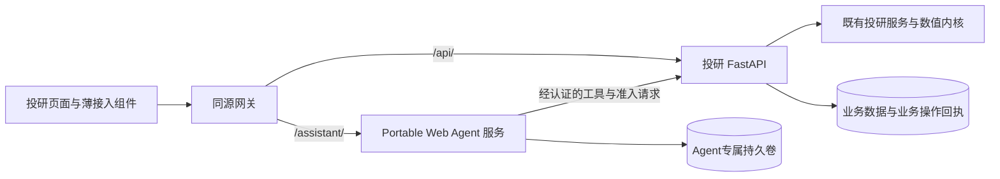

# 投研平台接入 Portable Web Agent：整体迁移设计

状态：开发候选与本地离线工程验收已完成；正式发布与生产切换仍待执行。首次设计：2026-09-29；当前证据：2026-10-01。两仓均未提交、推送或发布，未迁移生产数据。

目标：由 [KevinCJM/portable-web-agent](https://github.com/KevinCJM/portable-web-agent) 独立承担全部通用智能体功能。投研平台仅保留接入适配、业务接口、业务安全规则、页面配置及必要部署文件。现有用户能力必须逐项迁移，不能以“新框架暂不支持”为由删除。

## 1. 设计决定与适用基线

采用**独立服务、固定版本交付、平台持有业务权威**。平台不维护智能体源码副本，不导入框架的运行器，不保留本地聊天状态机。浏览器加载由同版 Agent 服务提供的 Web Component；平台后端通过 HTTP 提供业务工具。

这比上一轮“submodule 便于联调”的建议边界更严格，依据是本轮明确要求平台内部不再保留智能体实现。默认不增加 submodule，也不使用 subtree。开发时两个仓库并列打开，分别启动；生产消费不可变镜像。submodule 能固定源码提交，但不会完成接口适配，也不提供运行隔离，见 [Git 官方说明](https://git-scm.com/docs/gitsubmodules)。

2026-09-30通过GitHub提交API及独立工作树核实，独立仓库main为 `23cf2be05530ac41b919fa3b429af893e9cc5252`。相较首次设计读取的 `0d7f6e7d22424bc66a1a537e7821d32a8f5a739c`，已增加交付治理并修复组件设置/重连竞态；仍不是满足本设计的目标版本。运行底座继续是LangChain/LangGraph及官方SQLite检查点，前端是原生Web Component，不再引入另一套运行框架。

平台当前已切换到 `Dev`，基线为远端 `77ab60ee4bfe540250ece5cfa8fe5283e7bac136`；保留并整合原脏工作区，索引无未解决冲突。Dev 的九阶段导航、情景研究身份与保存算法读取均保留。候选调用链为页面 → `PortableAgentMount` → `/assistant/v2` 外部框架 → `/internal/portable-agent` → `research_access` 与原业务服务。

旧 `backend/agent`、前端通用Agent组件、CopilotKit及 `standalone-agent` 已从平台候选删除；业务投影、数值摘要、页面冻结输入、人工保存和适用回归迁到业务模块。独立框架v2仍是未提交候选；已安装wheel的HTTP验收不代表该远端main或生产镜像已发布。

迁移基线与责任清单（旧路径仅用于说明迁移前行为；当前实现和验收见18.2节）：

| 事实 | 证据与迁移含义 |
| --- | --- |
| 实际挂载助手的页面为指标中心、产品研究、产品比较、持仓诊断、设置中的中央助手 | 对应 `IndicatorStudio.tsx`、`ProductResearch.tsx`、`ProductCompare.tsx`、`HoldingDiagnosis.tsx`、`PlatformAgent.tsx`；须全部纳入等价迁移 |
| 产品详情、评价方案被旧后端工作域接受，但未发现页面挂载 | `backend/agent/scopes.py` 与实际 JSX；区分“协议支持”和“页面已接入” |
| 情景算法中心与历史情景工作台已新增外部组件挂载，完整业务浏览器等价验收仍待完成 | `ScenarioCenters.tsx`、`ScenarioAlgorithmCenter.tsx`、`HistoricalRegimeWorkbench.tsx`、旧 PAGE_SCOPES；列为新增接入，不能写成已迁移功能 |
| 通用运行与投研业务混在旧目录中 | `backend/agent/tools.py` 同时包含任务/记忆工具与指标工具；`commit.py` 直接依赖旧会话存储 |
| 旧实现已有多模型配置、压缩、记忆、消息编辑与交接 | `llm_settings.py`、`context.py`、`memory.py`、`sessions.py`、`handoff.py`；须补到独立框架 |
| 新框架已有组件、工具声明、加密配置、JWT、检查点和取消回执 | 独立仓库 `src/portable_agent/`；目前每应用/用户仅一组模型配置、纯文本正文和单节点运行 |
| 新框架限制与旧契约不同 | 当前默认15次模型调用、100轮会话门槛、工具HTTP超时最多120秒；旧运行默认不增加总步数限制，计算服务可能运行更久 |
| 本轮读取的主入口没有建立可复用的登录主体链 | `backend/app.py`、旧 Agent/LLM 路由未见统一身份依赖；不能假设新增 token 接口已有可信用户来源 |

现有行为以 [AI 功能设计](ai-functions-design.md)、[前端准则15.6—15.7](../frontend/README.md#156-ai-助手悬浮入口与对话窗)及当前源码为迁移验收基线。独立原型说明当前能力，本设计定义平台接入的目标差异，二者不能互相充当实现证据。

“全部AI功能迁移”包括聊天、意图、任务执行、模型设置、长期记忆、压缩、恢复、交接及已提供的协议桥接；不是只换图标或聊天组件。投研数值模型、聚类/情景算法、业务图表和数据准入仍属平台业务，不能因名称含AI或被助手调用而删除。AGENTS/Hermes是开发治理文件，也不属于产品运行器。

## 2. 两个仓库的职责边界

| 能力 | 独立 Agent 仓库 | 投研平台 |
| --- | --- | --- |
| 自然语言理解、意图分类、澄清、计划、工具选择 | 实现并执行 | 提供能力描述、工具 schema、业务约束配置 |
| 模型请求、重试、用量、供应商兼容、多配置管理 | 唯一实现；供应商密钥只存这里 | 只提供经过身份校验的配置页面挂载入口 |
| 会话、运行、SSE、检查点、取消、恢复、进展检测 | 唯一运行权威 | 不复制运行状态表；仅保留业务操作与审计关联ID |
| 长期记忆、历史压缩、对话编辑、跨页任务交接 | 通用机制与存储 | 提供对象范围和有效性校验，不执行第二套记忆/交接流程 |
| 聊天界面、正文排版、活动记录、设置界面、中英文通用文案 | 唯一实现与UI测试 | 加载组件，传图标、主题、语言、业务上下文 |
| 指标/情景定义、草稿、编译、试算、计算结果 | 仅引用和调用 | 继续由唯一业务服务执行与保存 |
| PIT、数据投影、推导证明、业务权限、正式保存/发布资格 | 按协议调用并服从拒绝 | 唯一业务权威；每次操作重新校验 |
| 图表、指标卡、定义编辑器、保存影响预览 | 提供通用成果插槽与宿主动作桥 | 复用业务组件，独立于聊天也可使用 |
| 品牌图标、导航目录、业务名称与术语 | 不硬编码投研内容 | 保留现有资产、导航和业务词条 |

判断一段代码能否留在平台：移除所有聊天界面后，它仍是业务能力，或仅负责外部组件挂载/协议转换，才允许保留。名为 adapter 但自行调用 LLM、管理对话、选择下一工具、编写压缩摘要或维护 Agent 运行状态的代码不合格。

允许有业务长任务状态机、业务幂等回执和人工保存确认；它们描述“计算/保存是否完成”，不能重复描述“Agent 应思考什么、下一步调用什么”。

## 3. 部署与版本集成



- 候选采用 `docker-compose.yml` 加 `deploy/portable-agent.compose.yml` 覆盖文件增加独立 Agent 服务与同源网关；投研服务继续由现有 Dockerfile 构建。Agent 通过固定镜像 digest 部署，镜像内含配套 JS/CSS，避免前后端协议错配。[Docker digest 说明](https://docs.docker.com/reference/cli/docker/image/pull/)
- `/assistant/widget/` 与目标 `/assistant/v2/` 由网关去掉 `/assistant` 前缀后转发，浏览器 endpoint 指向 `/assistant`。v2是本次每轮上下文、分页及授权契约的目标主版本；独立仓库未提交候选已实现v2；远端原型提交不能只改URL便声称兼容。验证静态资源相对路径、重定向和SSE均保留前缀语义。内部管理、迁移接口不透出公共网关。
- 网关转发 SSE 时关闭缓冲，保留流式响应、心跳和取消请求；断线只重连观察，不重放任务。业务工具路径只在服务网络开放，浏览器使用单独的用户业务接口。
- 网关成为唯一公共入口：生产Compose移除当前投研服务的宿主机 `ports` 映射，Agent也不直接发布端口；网关仅白名单转发公开路径并拒绝 `/internal/`，两后端仍验证身份。开发直连仅绑定回环地址。新增网关不能保留一个绕过网关的公网8000端口；从宿主机外部验证不能直达内部工具/准入接口。
- Agent 不挂载市场数据、业务数据库或平台源码；平台不挂载 Agent 数据卷或解密主密钥。当前单节点 SQLite 模型保持单执行实例，不能通过增加 worker 扩容。
- 本地开发两个独立虚拟环境/进程；平台 `start_services.sh` 接受已运行 Agent 地址或启动固定镜像，不下载 main 最新源码、不在平台虚拟环境安装 LangChain/LangGraph。
- 建议交付时增加 `config/portable-agent/release.json`，记录 source commit、image digest、协议版本和兼容能力集合。初始提交只有原型源码，本设计不虚构已存在的可部署镜像。
- 框架增加只读兼容元数据：协议主版本、组件版本、部署ID、已支持能力。挂载前核验目标协议和必要能力；不兼容则仅禁用助手，业务页面仍可独立使用。

框架改动先在其仓库提交、测试并发布固定版本，平台再升级锁定引用并执行接入回归。无需把两个仓库历史合并，也不自动跟随框架 main。

`release.json` 的目标字段为 `source_commit`、`image_digest`、`protocol_major`、`widget_version`、`required_capabilities`、`manifest_sha256`。框架制品发布时生成含静态资源哈希的manifest；平台锁定该manifest，运行元数据与制品不符就拒绝挂载。本文不填写虚构镜像digest。生产不得使用demo服务、匿名token样例或公网CDN的浮动latest资源。框架许可证和仓库可见性沿用独立仓库决定，本方案不要求公开私有代码。

静态模块同源加载，CSP按实际脚本、样式、图片来源放行，不为组件开放任意脚本来源。Web Component注册每个页面文档只执行一次；同页不混装两个版本，升级通过整页刷新切换。SDK恢复连接时再次核对服务版本；版本不符保持原请求身份并提示刷新，不自动新建任务。

## 4. 平台最终保留的文件形态

以下是职责示意；当前具体路径以 `docs/repo_map.json` 的 portable_agent_integration 模块为准。身份签发在 `research_access/identity.py`，业务工具在 `research_access/tools.py`；生产 `release.json` 待正式制品发布后填写。

```text
backend/
  integrations/portable_agent/
    routes.py       # bootstrap、上下文登记、内部工具/准入协议入口
    identity.py     # 可信身份转短期凭证、访问范围与服务认证
    tools.py        # 名称/schema映射和既有业务服务调用
  research_access/  # 从旧目录提取的数据准入、投影与推导证明
  custom_indicators/ # 既有计算；补业务草稿/预览/确认的独立归属
frontend/src/
  integrations/portable-agent/
    PortableAgentMount.tsx # 外部组件挂载、销毁与事件接线
    pageBindings.ts       # 各页面上下文与动作白名单
  components/indicators/  # 可独立展示的指标定义/试算/保存UI
config/portable-agent/
  apps.json               # 工具声明、指令、来源与端点配置；不含密钥
  release.json            # 锁定外部交付版本
deploy/                    # 必要网关与本地联调配置
```

只保留一个平台适配入口和现有业务服务，避免新增“Agent服务工厂”“另一套插件管理器”或每个页面一套通用 hook。业务指令配置属于接入元数据；意图解释器与执行循环属于独立框架。

## 5. 身份、上下文与配置

### 5.1 身份来源

部署默认采用一个应用ID，例如 `fund-research`；不同页面能力通过服务端签发的 scope 与上下文授权约束。这样同一用户的模型配置、记忆和中央助手可共享，页面间仍保留独立会话/运行。

生产接入须先接上可信身份来源：已有认证网关/OIDC身份，经签名或受控代理验证后转换为平台 principal。网关必须移除客户端伪造身份头。若部署确为单人本机模式，只能在回环地址及明确的本地会话保护下使用服务端配置的 owner，不能把匿名 demo 签发接口用于生产。身份方案是实施前置项，不能在未核实部署环境时声称已有多租户权限体系。

bootstrap 不接受浏览器指定 subject、角色或任意 scopes。服务端根据主体、工作空间、业务对象和页面能力计算最小权限。短期 JWT 由应用专属签名密钥签发；主密钥继续只在 Agent 服务。平台只依赖 JWT 标准库或轻量协议包，不为签令牌导入整个 Agent Python 包。

首次连接顺序固定为：平台用户认证 → 登记/取得context_ref → bootstrap核验该引用后签token → SDK创建或恢复会话。后续每轮条件变化先登记新引用，再获取覆盖该引用的授权。采用cookie的用户业务写接口执行CSRF和Origin校验；CORS不能代替身份认证。服务间凭证只允许调用工具/准入，不具备用户正式确认权限。

远端原型只有 app/sub/scopes 校验；当前独立候选已增加**上下文授权绑定**：签名声明绑定 `context_ref`、内容哈希、工作空间和允许的页面能力。创建/恢复运行不得换成同一个用户的另一份未经授权上下文。令牌续期可以更新到期时间，但不能静默更换运行所绑定的身份和业务范围。

### 5.2 上下文与页面证据

平台登记不可变业务上下文，返回 `context_ref` 与版本；内容包含 page_id、page_instance_id、workspace、计算域、真实产品/组合run、周期/日期、PIT模式、数据版本、定义/目录版本，以及最后实际显示结果的来源引用。未经服务端核验的客户端显示声明标为 client_only，不能当作计算证据。

将“会话归属”“每轮冻结输入”“页面展示状态”分开：

- 会话归属：应用、用户、工作空间、页面实例/业务对象。跨主体或对象必须隔离。
- 每轮输入：在发送动作开始时冻结当前条件、页面证据引用和授权；响应丢失重试保持相同引用，不从新页面重新采集。
- 展示状态：正在加载、失败、结果过期和旧结果原始请求分别保存；开关公式、滚动、语言切换不改变计算身份。

页面内容可超过框架目前128KiB请求限制，不能直接把旧512KiB页面证据打进聊天请求。页面只登记有界业务定义和引用，大结果仍用原业务接口；Agent上下文只携带小型、已准入元数据。超过业务登记上限直接报错，不截断公式、参数或定义。

远端原型通过 `setContext` 切换会话。当前独立候选增加了每轮冻结上下文协议以及有版本条件的宿主回填：用户修改时精确停止旧运行；本轮已核验试算的程序回填可被采纳，不误停本轮。平台只提供业务签名/比较结果，通用取消和迟到响应处理由 SDK 完成。

### 5.3 模型配置

`/settings/llm-api` 保留为平台路由壳，加载框架的设置模式组件。多配置、新增/编辑不自动激活、显式停用、reasoning_effort、timeout、context_window_tokens、密钥遮蔽和失败重试全部移入框架。浮窗和设置页使用同一配置存储。

旧配置当前是平台级文件，新配置按主体隔离；迁移必须指定原配置归属的实际管理员/用户，不能广播给所有新用户。供应商密钥经服务器迁移通道导入，禁止经浏览器回读、日志或Git传送。每轮冻结模型配置版本，设置修改只影响新运行。

## 6. 接入接口与工具契约

以下为迁移接口合同。当前候选已实现主要接口；以两仓DTO和测试为实际字段依据，正式发布版本仍待锁定。

| 平台接口 | 调用方 | 职责 |
| --- | --- | --- |
| `POST /api/integrations/portable-agent/bootstrap` | 已认证浏览器 | 核验页面/对象，返回允许的endpoint、app、scope、短期token与兼容信息 |
| `POST /api/integrations/portable-agent/contexts` | 已认证浏览器 | 登记冻结业务输入/页面证据，返回context_ref及哈希；重复相同请求幂等 |
| `GET /api/integrations/portable-agent/capabilities` | 已认证浏览器或服务 | 从实际导航和已注册业务适配生成能力目录，不把菜单存在等同于可执行 |
| `POST /internal/portable-agent/tools/{name}` | 经服务认证的Agent | 校验授权、参数、版本、幂等身份，委托业务服务；不得接受任意URL/代码 |
| `POST /internal/portable-agent/admission` | 经服务认证的Agent | 每次模型输入准入与依赖版本检查，失败关闭 |
| `GET /internal/portable-agent/operations/{id}` | 经服务认证的Agent | 查询既有业务作业/写入的真实终态，不触发第二次执行 |
| `POST /internal/portable-agent/operations/{id}/cancel` | 经服务认证的Agent | 幂等记录业务取消意图，实际停止前保持占用 |

浏览器的业务成果读取、草稿、确认预览和正式保存使用业务领域接口，不混入 Agent 会话API。目标Agent `/v2/apps/.../sessions`、运行、事件、记忆和设置由独立服务提供，平台不手写协议转译层继续仿造旧 `/api/agent`。

工具请求沿用现有 envelope 的 application、subject、run_id、operation_id、context、arguments。目标协议补充 session_id、冻结 context_ref/grant、协议版本与资源依赖。可信身份由服务凭证及平台授权记录交叉验证，不信任 body 自报身份。业务ACL每次检查，不能用初次授权永久替代后续撤权。

幂等键绑定 `(application, subject, workspace, operation_id)` 与规范化参数哈希、工具名、上下文哈希。同键不同内容拒绝；已完成操作先核验读取权限再回原回执。框架负责稳定生成操作身份，平台负责业务幂等结果，两个表不能互相替代。

双方至少固定以下数据身份，禁止共用一个revision表示所有状态：

| 对象 | 唯一持有者 | 不可变身份/并发字段 |
| --- | --- | --- |
| 会话/运行/交接 | 框架 | app、principal、session_id、run_id、message_id、执行世代和对应revision |
| 业务上下文授权 | 平台 | context_ref、owner、workspace、page_instance_id、context_hash、允许能力、有效期及撤销状态 |
| 草稿与试算 | 平台 | authoring_id、draft_id/revision、完整definition_hash、preview_id、数据/目录版本及完整冻结输入 |
| 正式保存确认 | 平台 | confirmation_id、owner、对象/定义/上下文哈希、期望revision、决定及业务request_id |
| 工具业务操作 | 平台 | operation_id、规范化请求哈希、关联作业ID、实际终态和原始业务回执 |

`session_id/run_id` 只做关联，不能成为平台授权凭证；`context_ref` 不自带访问权，仍须核验主体。首次请求还未受理就取消时，框架取消墓碑不能因短期token到期而丢失；刷新token后重放仍命中同一原请求。已开始的操作在grant过期后只允许经当前用户授权查询/取消，继续派发须重新核验当前权限。

同步成功响应继续区分 `model` 与 `artifact`：model 是带准入来源的受控摘要；artifact 在投研接入中只放类型、对象引用、哈希和标题，完整行情/序列不进入框架数据库。浏览器通过平台业务API鉴权取完整成果。

4xx 仅表示**确认没有开始业务副作用的拒绝**，返回安全业务错误码和可操作诊断，不能只保留状态码而丢失公式校验信息。已开始但未知结果不得伪装为普通4xx。超时/5xx/连接中断均先核对同一操作，不能另发新ID重做。

### 6.1 协议版本与字段归属

以下为目标合同和示意字段；当前候选已实现主要流程，具体字段以两仓DTO为准，不把示意值当作可直接发送的请求。框架仓库维护通用JSON Schema与兼容样例，平台维护业务参数schema；发布版本通过manifest哈希关联。平台只保留消费端必要DTO，不复制框架的Python包或运行代码。独立v1用户若确有兼容需求，由框架的运输层映射到唯一执行核心，投研平台不新增v1转译器。

上下文登记请求只提交 `page_id/page_instance_id/workspace/request/page_evidence`；其中workspace仍须服务端验证，owner由登录主体产生。返回：

```json
{
  "context_ref": "ctx-example",
  "context_hash": "opaque-host-hash",
  "context_revision": 1,
  "scope_key": "opaque-owner-workspace-page-object-key",
  "capabilities": ["indicator.author", "indicator.preview"],
  "expires_at": "server-issued-time"
}
```

`scope_key`是服务端核验的会话归属提示，不是权限。bootstrap以context_ref为输入，返回endpoint、app、协议/能力信息、token与到期时间；tokenProvider负责在实际请求前取得有效令牌。框架SDK负责调度刷新和旧请求隔离，平台回调只进行鉴权HTTP请求。密钥、完整页面证据、JWT不进入模型上下文、URL或可观测性日志。

沿用框架现有HS256应用专属签名合同的app/sub/scopes/aud/iss/iat/exp，扩展workspace、context_ref/hash、grant_id和授权版本。平台使用JWT库按版本合同签发，框架校验声明后仍向平台核验当前授权；刷新只更新有效期，不改变既有运行的主体、冻结输入和操作身份。框架只保存授权引用，不靠长期保存浏览器JWT运行任务。

工具协议目标示例：

```json
{
  "protocol_version": 2,
  "application": "fund-research",
  "subject": "authenticated-subject",
  "session_id": "session-example",
  "run_id": "run-example",
  "operation_id": "stable-operation-id",
  "context": {"ref": "ctx-example", "hash": "opaque-host-hash", "grant_id": "grant-example"},
  "arguments": {"authoring_id": "authoring-example", "draft_revision": 3}
}
```

这是外层envelope示例；`arguments`必须符合具体工具schema，不把这些字段套给所有工具。服务凭证来自只读部署配置，平台交叉验证application、subject与grant真实owner。工具不能根据arguments切换主体、目标URL或工作空间。HTTP `Idempotency-Key`必须等于operation_id。框架生成有界稳定ID，平台只验证不重新拼接；现有64字符ID上限保留。

平台hash作为不透明值回传；JS不能自行重算完整业务定义hash。完整定义比较沿用现有数值等价契约：JSON数字0与0.0等价，布尔值/字符串不等价，未知扩展字段不能被忽略。相同操作的token续期、链路trace_id变化不改变幂等身份；业务参数/上下文/目标版本变化必须是明确的新操作。

### 6.2 框架API与重试语义

下面路径均相对 `/assistant/v2/apps/{app}`。框架复用现有app/runtime/store职责扩展；不在平台镜像内实现这些接口。

| 接口 | 输入及关键行为 |
| --- | --- |
| `GET /` | 协议版本、组件版本、构建提交、manifest摘要、当前主体与支持能力；不暴露密钥 |
| `POST /sessions` | 幂等request_id、scope_key、初始授权上下文；创建响应丢失仍恢复同一会话 |
| `GET /sessions/{sid}` | 当前revision、活动运行、当前上下文引用及有界消息首页；不返回完整历史/曲线 |
| `GET /sessions/{sid}/messages?before=...`、`GET /sessions/{sid}/events?after=...` | 前者分页，后者有序事件/SSE；断线缺口回读服务端，不重放工具 |
| `PUT /sessions/{sid}/runs/{rid}` | message、expected_revision、turn_context_ref/hash、可选edit_of/resume_from；同rid先核对不可变输入，再做新受理版本检查 |
| `POST /sessions/{sid}/runs/{rid}/stop` | 对未受理rid也持久记录取消；重复旧停止不影响新运行 |
| `POST /sessions/{sid}/runs/{rid}/resume` | 期望revision；恢复原检查点并核对原业务操作，不新建操作键 |
| `POST /sessions/{sid}/runs/{rid}/decisions` | interrupt_id、request_id、choice、expected_revision；重复决定回读，冲突决定拒绝 |
| `/model-profiles`、`/model-profiles/{id}`、`/model-profiles/active` | 列表/创建/更新/选用/停用，多配置revision并发控制；设置页和浮窗共用 |
| `/memory`、`/memory/{id}/decisions`、`/memory/{id}/revoke` | 有来源和版本的提案/读取/人工决定，按用户/工作空间/业务scope过滤 |
| `/handoffs/{id}`、`/handoffs/{id}/accept`、`/handoffs/{id}/cancel` | 框架签发不可变交接身份；接受绑定目标上下文；查询/重试不产生第二个目标任务 |

产生会话或运行写入的响应返回其权威revision；独立的模型配置、记忆和业务对象返回自身revision。SDK分别接纳，不把不同对象版本混在一起。失败后先按原ID查询：已受理则观察原对象，未受理且版本冲突才取最新版本重试原输入；不能静默用新页面条件覆盖待确认输入。

业务成功返回 `model` 与可选成果引用；异步受理返回202、operation_id、当前业务status与retry_after_ms。operation查询返回原身份和真实状态，成功后才附model/artifact。错误合同包含 `code/message/retryable/field/diagnostics/operation_id` 的有界安全字段；发布、授权或版本冲突不能自动重试，网络不确定也不能当成尚未执行。

## 7. 工具迁移表

旧工具名含点号，新框架当前只接受字母数字下划线；使用显式映射与契约测试，不能直接复制旧名称。以下新名称是建议命名。

| 旧能力 | 新归属/工具 | 业务权威 |
| --- | --- | --- |
| `platform.capabilities` | 平台目录接口；框架读取 | `shared/platform-navigation.json` 加已验收能力声明 |
| `intent.resolve` | 框架通用意图与能力匹配 | 平台只提供动作、目的地白名单和前置条件 |
| `task.read`、`task.plan`、`context.read` | 框架任务/证据机制 | 不复制到平台工具执行器 |
| `memory.propose`及接受/拒绝/撤销 | 框架记忆服务与通用UI | 平台校验对象范围和准入策略 |
| `metrics.lookup`、`metrics.infer` | `metrics_lookup`、`metrics_infer` | 现有目录、变量、算子、推导服务 |
| `metrics.validate`、`metrics.draft_save` | `metrics_validate`；等价别名只留配置映射 | 业务草稿及校验服务，不写正式指标库 |
| `metrics.rolling_draft` | `metrics_rolling_draft` | 精确来源revision及既有滚动派生服务 |
| `metrics.availability`、`metrics.preview` | `metrics_availability`、`metrics_preview` | 真实数据与业务预览存储 |
| `products.search/eval/series/plans` | 对应下划线工具名 | 产品服务、指标服务、方案冻结版本 |
| `portfolios.context/eval` | `portfolios_context/eval` | 不可变组合run及组合域指标 |
| `page.read`、`page.recompute`、`page.analyze` | `research_page_read/recompute/analyze` | 各页面冻结请求及服务端核验摘要 |
| 指标正式保存 | 用户动作调用业务确认/提交接口 | 不作为普通模型可调用工具注册 |

读工具可以写内部计算缓存，但业务草稿创建/修订必须明确声明。当前框架只有read/write/ui，write强制通用审批；直接将 `metrics_validate` 标write会额外打断每次校验，伪装成read又隐藏副作用。目标协议增加 `effect=draft`：仅用于宿主草稿区域的幂等写入，要求独立草稿scope、owner及revision检查，不弹正式发布审批；宿主服务禁止这类接口写正式指标库。正式write仍强制确认。该扩展与FW-06一同验收，旧版本不支持时拒绝注册，不能通过降级effect绕过。

`metrics_validate`和等价的旧 `metrics.draft_save` 共用一个草稿服务实现；框架只看到一个规范工具名，历史工具名仅供导入映射。试算/查询保持read语义；填入/查看/导航是ui；指标正式保存不注册模型工具。未登记能力返回 unsupported，禁止通用 shell、Python、SQL 或任意HTTP兜底工具。

投研指令可配置“先查目录再写公式、无产品可解释/创作、明确要求才试算、保存必须人工确认”等业务要求。涉及授权、发布资格和数据边界的要求必须由接口执行，不能只靠 prompt。

## 8. 指标完整流程与保存权威

1. 页面登记冻结上下文；框架接收自然语言并自主选择已授权工具。
2. 工具查目录、推导、校验，业务服务创建/修订草稿。业务草稿有自己的ID、revision和完整定义哈希，不依赖旧 AgentSessionStore。
3. 明确需要试算时调用真实产品搜索、可用性和试算；记录完整定义、参数、产品、周期、有效研究日、数据版本、执行后端和输出通道。
4. 框架收到已验证摘要与成果引用；通用成果插槽让平台复用指标卡、公式、参数和结果组件。未校验或失效草稿不展示为可保存卡片；卡片归属产生它的轮次。
5. “填入”只更新编辑器；“查看试算”按冻结条件读取结果并聚焦工作台，不能覆盖用户未保存公式；程序回填凭本轮有效回执向 SDK 申请上下文采纳。
6. 用户点保存，平台业务接口生成并持久化 `confirmation_id`，冻结完整定义、draft_revision、context_hash、产品、周期、日期、同名影响和当前版本。
7. 平台业务确认UI展示完整影响；用户第二次明确确认后提交。确认由浏览器用户身份直接认证，Agent服务凭证不能伪造；框架通用工具审批不能代替这一步，也不再多弹一套相同确认。
8. 保存服务重验当前草稿、定义哈希、版本和资格后写一次，保存业务回执。失去响应时按同一请求/确认查询或重试，不重新生成确认造成重复保存。
9. 宿主依据业务回执更新指标库和卡片；框架通过可验证成果状态记录“已保存”。不能仅凭宿主回调的 `saved=true` 或模型文字声称成功。

confirmation 与业务幂等记录移入指标业务存储，Agent session_id/run_id 仅作审计关联。每个业务草稿及其确认是唯一权威，不在 Agent 与平台各存一份可变定义。新确认被旧版本替代时失效；已经成功的原请求仍可幂等回读，不能因确认过期把既有写入误判为未完成。

保留当前 `definition_commit` 的第二道去重：旧实现在同一会话内按完整定义查保存记录，刷新后即使生成新确认和新request_id也不能再创建一次。迁移后业务服务用稳定的 `authoring_id` 表示一次指标创作，绑定owner/workspace；草稿修订、重新校验、页面重挂和聊天压缩不更换它。持久唯一键为 `(owner, workspace, authoring_id, definition_hash)`，操作请求ID另行去重。同一创作内恢复到曾保存的完整定义，返回原业务回执；已开始、失败或未知的同定义操作先核对，不能换ID绕过。用户明确新建一次创作才取得新authoring_id，不对所有同名/同公式指标全局去重。

旧session与authoring_id映射随保存回执一并迁移；它仅表达业务创作归属，不复制会话内容或执行状态。读取当前草稿时返回其已保存回执，供重挂后恢复状态及刷新目录。保存与完成回执能用同一业务事务则原子提交；跨存储无法原子提交时，先持久登记写入意图并保留结果未知的隔离，禁止把“没查到成功回执”直接解释为尚未写入。迁移验收复用 `test_commit_recovery_deduplicates_new_confirmations_and_restores_saved_state` 的行为反例。

已确认写入一旦实际开始，停止聊天不能回滚已完成写入；UI显示实际结果。业务结果仍未确定时持续核对同一个操作，禁止靠换会话重复创建。业务保存与长期记忆接受始终是两个独立决定。

### 8.1 从旧会话中拆出的业务存储

使用平台既有数据目录和SQLite能力，为业务创作增加独立持久存储；不引入新的数据库产品。逻辑记录如下，实施时可合并物理表，但唯一约束及事务边界不能省略：

| 记录 | 持有内容与约束 |
| --- | --- |
| authorings/draft_revisions | owner/workspace/authoring_id，当前revision；每版完整定义、hash和校验结果不可变。修订按expected_revision比较并交换 |
| preview_refs | preview_id、草稿版本、完整冻结业务输入、数据/目录版本、结果引用及摘要来源；大结果继续归既有结果仓库 |
| confirmations | confirmation_id、owner、草稿/定义/上下文、目标版本、影响、有效期及人工决定；状态仅pending/accepted/rejected/invalidated |
| commit_receipts | request_id唯一及 `(owner,workspace,authoring_id,definition_hash)` 唯一；保存意图、真实对象ID/revision、结果未知隔离与可重复回读的回执 |
| research_operations | 工具operation_id、授权owner、参数hash、业务执行者/作业、取消意图和真实终态；不存消息、模型步骤或Agent计划 |

业务服务先取得唯一保存意图，再调用原指标创建服务，最后持久记录回执。当前指标创建与会话数据库不是同一事务，迁移不能假设换库后就原子化：若指标创建接口还不支持按业务操作ID查询结果，崩溃空档保持unknown并禁止重复创建，直到人工核对；后续只有把该关联ID持久写入原业务对象，才能安全自动核对。不能用同名或同公式匹配猜测本次创建成功。

以下新增路径归指标领域，具体路由登记须放在现有动态 `/{indicator_id}` 路由之前或验证无冲突：

| 浏览器业务接口 | 权威行为 |
| --- | --- |
| `POST /api/custom-indicators/authorings` | 创建独立创作；以业务request_id幂等，主体来自登录态 |
| `GET /api/custom-indicators/authorings/{id}` | 读取当前草稿、校验和保存回执；不读取Agent会话 |
| `POST /api/custom-indicators/authorings/{id}/confirmations` | 按草稿/context版本生成冻结影响预览；不得接收客户端任意“已验证”标志 |
| `POST /api/custom-indicators/authorings/{id}/commits` | 独立用户身份、confirmation_id、request_id、expected_revision和confirmed决定；Agent服务身份不能调用 |
| `GET /api/custom-indicators/authorings/{id}/commits/{request_id}` | 失去响应后回读同一业务写入；未确认不返回成功 |

业务UI允许保存自己的未决提交引用以核对写入，这属于业务操作恢复，不是聊天状态机。框架只引用authoring/preview/receipt，不再有另一份可写草稿。试算成果过期时展示“结果已过期”并保留原来源；不得静默换成当前市场数据重新算作历史结果。

## 9. 计算生命周期、取消与数据准入

### 9.1 长计算

新框架当前工具超时上限120秒，不能覆盖平台所有任务。扩展通用 deferred-operation 协议：工具受理后可返回202及绑定当前operation_id的业务作业引用；框架持久保存后轮询固定配置的查询端点。202不生成“工具完成”的模型回执，不占用反复调用模型的步骤。

平台复用各业务域实际存在的执行器和作业记录，不假设当前已有统一持久作业服务。指标 `AdaptiveComputeEngine` 目前返回进程内Future；`EvaluationRunResultRepository` 是有TTL的成果存储，二者不能直接当作跨进程恢复的操作回执。需要202协议的同步业务须补最小持久业务操作登记：派发前写入operation_id、完整请求哈希与执行者身份，完成后写入真实结果引用及终态，再向框架确认；不能仅后台起一个协程后就返回202。不另造 Agent 任务队列。

业务进程重启后，先核实原执行者/子进程和成果，不凭丢失Future或结果缓存过期判定未执行。查询/取消地址来自可信配置和操作ID，不采用模型或响应提供的任意URL。取消能力不足的原执行器可显示stop_requested并等其真实退出，不能把 `Future.cancel()` 返回或HTTP超时当作物理停止；不改变数值内核。

业务状态为 accepted/running/stop_requested/succeeded/failed/cancelled/unknown。外部计算未物理退出前不宣告 cancelled；原操作仍持有资源/互斥范围。查询失败或进程崩溃后无法证明结果时保持 unknown，不因租约到期或超时自动释放并重新执行。恢复先查同一作业，必要时人工核对；框架继续使用 uncertain 状态表示未决。

operation查询返回404、成果TTL过期或授权暂不可用，都不能作为“从未执行”的证据。未决操作、已完成正式写入的去重身份和未确认取消记录不得因普通缓存清理被删除；可归档大成果，但需保留终态/请求hash/对象引用或取消墓碑。旧成果不可读时明确返回过期，不能以原操作ID重新计算或创建写入。

### 9.2 取消与页面切换

SDK承担未接受请求、已接受运行、等待交接和等待恢复期间的取消责任。取消固定到不可变session/run/message或handoff身份，支持取消先于接受持久化；迟到回执只影响原对象。关闭浮窗继续执行，离开研究对象或有效计算条件变化停止对应任务。

业务执行权与客户端连接分离。断SSE不取消业务，也不自动重发工具；取消后已在途成功回执可保留审计，但不得自动采纳为新页面当前草稿/当前结果。业务正式写入的真实回执仍须如实呈现。

浏览器断网或进程退出时，卸载回调不能保证取消请求送达。SDK应持久记录未获确认的精确取消意图，在同一身份恢复后核对/重试；界面收到服务端回执前不得宣称已经停止。服务器通过授权有效期、业务上下文撤销和操作期限限制后续派发，但到期仍不是外部计算物理退出的证据。不能用SSE心跳超时直接取消所有任务，否则普通断线恢复会改变既有语义。

### 9.3 两道数据门禁

第一道由平台按服务端字段契约生成签名摘要，保留 `data_policy`、`views`、`derivation` 的业务语义。原始日频净值/OHLC/成交量及完整图表数组留在业务服务。`series_summary` 的数值内核迁入业务摘要模块，保持固定签名、启动预热和现有精度，不能在通用框架用Python重算。

第二道是框架所有模型调用前请求平台 admission：普通回答、摘要压缩、记忆加工、停滞收尾和错误恢复均走同一入口。平台验证确切messages、工具声明、授权、来源证明、策略版本及数据/目录依赖。需要远程准入的应用缺少服务认证或准入不可用时失败关闭。

原型 admission 目前没有独立 headers_env，也不会自动理解旧HMAC证明、供应商消息格式和模型结果返回时的目录变更；框架需补通用认证配置、完整输入序列化与发送/返回两侧校验钩子。平台按新工具名版本化映射证明，不能给历史未验证内容重新盖章。准入回执绑定候选载荷哈希；重试改变输入须重验。

工具或模型等待期间数据/目录变化，返回内容只能作为已失效历史记录，不能更新当前业务草稿或进入后续模型上下文。对不可变组合run按其冻结版本判断，不能套用“当前市场数据变化即全部失效”。框架只处理抽象依赖版本，具体有效性由平台决定。

用户文本中的结构化行情表继续按既有规则拒绝/转为业务数据引用；不能宣称对任意自由文本、编码或图片实现了完备识别。新增附件/原始数据输入不在此次迁移中开放。

## 10. 前端接入与跨页面能力

通用浮窗、设置、消息、编辑、重试、记忆、活动轨迹和交接状态均来自外部组件。平台的 React 包装只负责 ref、configure、语言/主题/图标、页面绑定与宿主事件；禁止在包装内再维护消息列表、轮询运行、SSE游标或Agent sessionStorage。

框架需提供浮窗、内嵌对话、设置三种展示模式，以及受控的业务成果插槽。宿主按可信 type 注册渲染器，收到引用后鉴权加载业务组件；不执行服务端返回的HTML/JS，不把任意业务JSON自动渲染成可执行按钮。

输入、响应、取消和动作的ID、epoch、重试由SDK生成和维护。宿主只接收已核验的动作事件，按业务版本执行固定白名单动作，重复requestId回原回执；回包只能作用于原页面实例。新组件须保留现有中英文、Markdown/KaTeX安全排版、复制、历史分页、消息编辑、停止并发送、草稿/试算归属和无障碍交互。原型纯文本不是允许降级的依据。

语言随平台当前选择传给组件，通用助手词条由框架维护，业务名称/术语仍由平台提供；切换语言不重建业务运行。情景中心当前用hidden保留已访问子页，不能仅靠React卸载检测离页：宿主显式报告当前活动子域，只有活动页面绑定可接收成果和启动新任务。活动标识包含外层center及内层stage/event_view/pane；内层组件的active必须与外层活动状态相与，不能让隐藏中心里仍为active的历史工作台继续接收动作。切换子域按上下文语义交由SDK取消/隔离，隐藏页不能继续抢占入口或回填。

上下文按钮、非模态/关闭语义、480/720px宽度、键盘、重开阅读位置、图片失败和小牛图标继续按前端准则验收。平台只配置品牌资产，不在Agent仓库写死小牛。无需为了迁移重做首页或业务工作台布局。

中央入口继续使用 `/settings/ai-agent`，仅挂载框架内嵌组件。平台输出准确的导航/能力目录；框架负责引用用户原话的结构化意图、澄清和任务分派。仅导航不执行；页面显示成功不等于业务保存；不支持的任务明确返回限制。

跨页交接由框架持久化 source session/run、intent、target capability、冻结参数、取消记录和目标run。平台提供目标页 readiness、合法路由与已核验context_ref。框架在同一执行权威内原子接受目标任务并登记回执；重复受理只回原目标，取消先到则拒绝迟到受理。

交接只接受当前主体拥有的已完成来源run中、仍有效的execute意图；chat/navigate/clarify不能转成执行。目标能力与参数必须匹配该意图并重新通过平台授权，客户端不能替换目标以扩大scope。源run完成仅代表提案已形成，不代表目标业务已完成；目标页面的ready只表示能够接收绑定，不是写入许可。

页面过渡期间的取消责任归框架SDK，直至目标会话被组件成功接管。平台路由层不能重新实现旧 IndicatorHandoff 的状态机。首次正常分派可沿用当前自动进入目标页行为；刷新旧完成消息只能显示继续入口。恢复条件来自实际目标会话，保留交接等待期间的用户后续修改，不能复活清空前的旧会话。

### 10.1 一个挂载组件、明确的宿主回调

目标 `PortableAgentMount` 接收pageBinding、active、locale、iconUrl和displayMode。它只加载锁定组件、注册/清理事件和把业务回调交给SDK，不封装第二套send/stop/retry。`PlatformAgent`保留为embedded路由壳；`LlmSettings`保留为settings路由壳；其他五个入口计数中的四个业务页面使用floating模式。同一活动页面只出现一个入口。

以下是v2拟议组件合同，当前原型的configure/setContext不具备其中所有能力：

| 组件合同 | SDK负责 | 平台负责 |
| --- | --- | --- |
| `configure({app,endpoint,displayMode,locale,iconUrl,theme,...})` | 单组件生命周期、身份隔离、所有聊天/设置UI | 提供锁定服务地址和设计令牌；品牌图失败仍可操作 |
| `captureContext()` + `authorizeContext(snapshot)` | 发送/编辑开始即冻结快照，持有请求身份；异步登记失败保留原输入；重试不重采集 | 同步复制当前业务条件，异步调用contexts/bootstrap；不得返回整条行情 |
| `updateBinding({scopeKey,active,contextRevision})` | 区分归属改变、条件改变和仅显示变化；精确取消，inactive不能发新任务 | 报告真实页面/嵌套页活动状态和条件版本，不自行选择要停的run |
| `adoptContext({receiptRef,contextRef,expectedContextRevision})` | 核验原run/页面和版本，仅采纳已验证本轮回执，不误停当前回复 | 通过业务接口获取回执；用户已有后续修改则拒绝回填 |
| `agent-action` | 稳定requestId、超时/重试/取消、旧回调隔离 | 执行固定白名单中的查看、填入、路由导航；复核对象/版本后回执 |
| `agent-artifact`及成果slot | 消息/run归属、插槽生命周期、loading/error状态 | 按白名单type鉴权读取业务对象，复用业务卡片/公式/图表 |
| `acceptHandoff({handoffId,targetContextRef})` | 原子受理/恢复、取消责任连续转移、重复消息去重 | 等真实页面就绪，提供合法目标上下文和路由 |
| `dispose()` / disconnect | 释放观察/监听；按归属离开规则处理取消并保留未确认记录 | 卸载React业务插槽、移除事件处理器 |

Shadow DOM只隔离样式，不是权限边界。业务成果采用SDK创建的受控slot加React portal挂载现有业务组件；SDK传递结构化引用和容器，平台清理对应React子树。禁止拼接模型HTML或把整个公式/图表数组写入DOM属性。宿主成果的可编辑定义、手工保存按钮仍由原业务权限约束。

模型侧能力配置来自平台能力目录及工具schema，不能从React页面源码猜测。每项能力含稳定id、title/description、当前可用动作、参数schema、前置条件与scope；路由只由宿主导航白名单解析。框架通用意图模式保持chat/navigate/execute/clarify/unsupported，记录当前用户消息和原话引用；平台不保留自己的自然语言分类器或LLM兜底。

例如“解释回撤”只解释；“打开指标中心”只导航；“计算某产品近一年回撤”在产品/截止日不完整时先澄清，完整后仅调用获准工具；“保存这个指标”只能引导打开冻结确认，不能绕过人工业务提交。指标示例与非投研工单示例必须使用同一框架代码，仅更换能力/工具配置。

## 11. 全平台接入范围

以下分“迁移既有能力”与“通过同一协议扩展”，不因页面存在就开放业务执行权限。

| 页面/业务域 | 接入方式与验收边界 |
| --- | --- |
| 指标中心 | 首个端到端样板；完整覆盖标量、时序、多通道、滚动派生、实际参数、预览、人工保存 |
| 产品研究 | 迁移当前批次分析；保留最多10项的明确批次、筛选/选中语义、锁定指标revision；不能将全选计数当作已计算数量 |
| 产品比较 | 迁移混合产品、费用、三个独立区间；全局研究日与指标矩阵截止日分别冻结 |
| 持仓诊断 | 只绑定真实不可变组合run；无run不发送；情景复算失败保留失败状态和旧结果原始引用 |
| 中央助手、LLM设置 | 迁移为外部内嵌组件；导航、配置、交接契约不缩水 |
| 产品详情、评价方案 | 保留后端已支持语义并设计薄页面绑定；页面新增入口单独验收，不冒充当前已有 |
| 情景算法中心、历史情景工作台 | 新增接入；目录/节点/模板查询、定义校验、明确请求的试算和结果解释；填入可编辑定义，不自动发布 |
| 产品池、因子、风险模型、择时、SAA/TAA、配置与验证 | 接入协议可复用；逐域开放已存在且有权限/数据投影的读取、校验和试算工具，能力目录分别标导航/读取/执行 |
| 投中执行、真实组合、核算、投后及反馈原型页面 | 导航与明确标注的功能说明；未实现业务不注册工具，不产生交易、记账、发布或真实资金操作 |

情景接入按实际路由 `/settings/scenario-algorithms` 的 `ScenarioCenters` 及其嵌套页面登记，不能只给同名旧文件加入口：

| 实际工作区 | 复用服务与本轮工具边界 |
| --- | --- |
| 市场状态：历史参考、实时识别、验证 | `MarketStateResearchCenter` 挂载不同用途的 `HistoricalRegimeWorkbench`；复用 `historical_regime_routes.py` 背后的服务，分别冻结purpose、参考/模型revision和验证来源 |
| 全球事件：事件库、人工历史事件 | `regime-workbench/GlobalEventCenter`；事件查询/解析复用 `historical_regimes/event_routes.py` 安装的事件库接口，人工图定义复用历史情景服务；事件增删改仍为人工业务动作 |
| 情景模拟：已发布模型的传导预览 | `PublishedScenarioCenter`；复用 `published_scenario_routes.py` / `PublishedScenarioService` 的目录、preview和读取能力，冻结模型release、变量契约及horizon；不注册发布/停用工具 |
| 情景模拟：高级独立实验 | 上页高级面板实际挂载 `ScenarioAlgorithmCenter`；复用 `scenario_stress_routes.py` 背后的试算服务，与已发布模型传导预览分开 |
| 独立历史工作台深链接 | `/settings/scenario-algorithms/workbench` 复用同一页面绑定和业务服务，不创建第二份适配流程 |

冻结图定义、模板/节点版本、数据/PIT、随机种子、参数和结果类型；保持实时/事后、因果性、发布用途门禁。已有算法和画布组合颗粒度不因接入改变，遵守[算子治理](../governance/operator-contracts.md)与[数值规范](../governance/numeric-computing.md)。

情景保存/发布仍在原业务UI经人工确认；Agent仅提供候选和查看/填入动作。正式回测、TAA、风险监控资格分别由业务服务判定。框架任意页面可接入，不代表所有业务能力应一次性开放。

## 12. 独立框架必须先补齐的能力

以下全部在独立仓库实现，平台不得通过兼容层补写通用引擎。验收对照当前行为，不复制旧Python Harness成为第二套运行器；继续复用LangChain/LangGraph公开机制与官方检查点。[持久化机制](https://docs.langchain.com/oss/python/langgraph/persistence)不能替代外部业务操作的幂等与终态核对。

| 编号 | 必须补齐 | 完成判据 |
| --- | --- | --- |
| FW-01 | 多模型配置、激活/停用、思考等级、上下文窗口、真实供应商兼容 | 旧设置交互与实际请求参数等价，不回传密钥，不静默忽略不支持参数 |
| FW-02 | 任务/证据工作集、压缩、依赖失效、进展判断 | 长对话保留约束/失败证据，工具批次完整，所有辅助模型请求经过准入 |
| FW-03 | 运行预算兼容 | 平台接入不继承15步/100轮等原型业务上限；用显式可选预算、分页和压缩保持既有语义，仍保留并发/输入/单操作安全边界 |
| FW-04 | 确认记忆、来源引用、替换/撤销 | 按用户/工作空间/业务scope隔离；记忆决定不被编辑或恢复回滚 |
| FW-05 | 交互完整性 | 编辑最后未回答消息、停止并发送、取消排队、历史分页、活动轨迹、设置/内嵌模式、双语及安全数学排版 |
| FW-06 | 每轮上下文与宿主成果扩展 | 冻结证据、数据与UI结果分离、受控成果插槽、本轮条件采纳、迟到结果隔离 |
| FW-07 | 通用意图与持久交接 | 源任务核验、取消/接受竞态、目标会话接管、刷新不重复执行；不得硬编码平台路由 |
| FW-08 | 完整准入与身份约束 | 服务认证、context授权绑定、发送前/返回后依赖核验、业务错误保真及所有模型路径覆盖 |
| FW-09 | 长操作与恢复 | 202作业回执、查询、取消、未知结果隔离、崩溃恢复；真实业务结束前不释放原操作 |
| FW-10 | 交付、兼容元数据和迁移工具 | 固定构建产物、协议检查、离线导入/校验、可回滚的数据升级；组件与服务同版；已提供的CopilotKit/AG-UI运输能力迁入框架并通过原协议回归 |

长期自动压缩不能仅把 `max_context_chars` 调大；无上限工具流程不能仅把默认15改成64。相同任务在新框架多次有效推进时须能继续，并能在不再推进时明确停下。

### 12.1 框架内的实现落点

继续扩展独立仓库现有 `src/portable_agent/`，不搬入平台RunController。不把“迁出目录”当成重构完成；下面每项必须对应跨仓协议和可运行反例。

| 工作包 | 独立仓库改动落点 | 主要实现与回归 |
| --- | --- | --- |
| FW-01 | config.py、store.py、security.py、app.py、web/widget.js | profiles主键扩展profile_id，active选择单独持久化；迁旧单配置；冻结运行配置版本；测试停用、密钥不回读、已运行任务不随设置变化 |
| FW-02/03 | runtime.py的middleware与官方检查点；必要时提取context/progress模块 | 统一模型准入；维护来源/证据引用，按完整工具批次压缩；预算改为显式可选，历史分页解除100轮硬门槛；超过15步仍有进展时继续，无进展时停止 |
| FW-04 | store.py与独立memory模块、app.py、组件记忆UI | 独立提案及人工决定记录；不随LangGraph分支回退；确认前不是有效记忆，撤销后检索不可再注入 |
| FW-05/06 | web/widget.js/css及按实际大小拆出的UI模块、app.py/contracts | 三种显示模式、当前交互等价；编辑关系/分页游标/每轮上下文；受控成果slot；draft effect及业务回执核验 |
| FW-07 | 独立intent/handoff模块、store.py、组件SDK | 能力声明驱动意图，不写投研菜单；同一SQLite事务保存取消墓碑或目标受理，LangGraph调度只在提交后开始 |
| FW-08 | security.py、config.py、runtime.py/模型适配、app.py | 上下文grant及当前权限、准入headers配置、精确载荷/响应依赖核验；真实供应商序列化字段全部受控 |
| FW-09 | runtime.py HostBridge、store.py receipts | 202回执/有界轮询/取消/恢复；只查询可信配置端点；中断后不以新operation_id重派 |
| FW-10 | cli.py、发布流程、通用协议adapter、tests | 固定镜像/manifest、离线导入工具与版本升级；AG-UI映射唯一Runtime，真实CopilotKit SDK取消回归迁入独立仓库 |

消息/任务分支的执行检查点继续由官方checkpointer管理；store只持有会话索引、授权、独立人工决定、交接及操作回执，不新增第二套可恢复执行循环。迁移旧任务语义时将引用和进展作为graph state/middleware的数据，不通过平台服务回调旧harness。

需要真实供应商的既有特殊请求参数，应在框架供应商适配中用实际SDK离线传输反例验证，不复制硬编码平台session/data路径。新增依赖只由框架安装；平台只保留HTTP、身份和业务校验所需依赖。工具schema、prompt和宿主前置条件不是运行器，因此仍可由平台配置。

框架API及组件在原子切换前必须同时宣告所需能力，例如profiles、memory、compaction、turn-context、handoff、host-admission、deferred-operations和artifact-slots；能力名仅由通过合同测试的实现宣告。不得让平台用“缺什么补什么”的hook补齐缺失框架功能。

## 13. 文件迁出、保留与删除清单

| 当前文件/范围 | 目标处理 |
| --- | --- |
| `backend/agent/harness.py`、`sessions.py`、`context.py`、`progress.py`、`ledger.py`、`storage.py` | 行为和适用回归迁至框架；平台删除实现，不原样搬入 integrations |
| `backend/agent/llm.py`、`llm_settings.py`、`memory.py` | 框架提供唯一模型/配置/记忆实现；历史格式读取仅留在框架迁移工具 |
| `backend/agent/intent.py`、`handoff.py` | 通用意图/交接迁框架；平台只保留导航与业务能力声明 |
| `backend/agent/tools.py`、`scopes.py`、`contracts.py` | 按第7节拆分；业务DTO/白名单留领域或薄适配，Agent运行/事件/消息DTO由外部协议定义 |
| `backend/agent/catalog.py`、`research_pages.py`、`research_runtime.py` | 目录、冻结请求、PIT/数据版本和业务回调移入业务/适配；任务提示组装和运行修改删除 |
| `backend/agent/data_policy.py`、`views.py`、`derivation.py`、`series_summary.py` | 业务投影与数值摘要迁到平台领域模块，去除旧会话/模型客户端依赖；不得删除准入与推导证明 |
| `backend/agent/commit.py` | 业务草稿/确认/保存移入指标领域服务，清除对AgentSessionStore的读写 |
| `backend/agent/routes.py`、`copilotkit.py` | 删除旧会话/执行入口；既有CopilotKit/AG-UI运输能力由框架承接，旧HTTP路径是否兼容按实际客户端合同决定 |
| `backend/app.py`、`backend/services/llm_settings_routes.py` | 删除旧Agent装配与LLM配置路由，装配业务适配；纯业务服务原实例保留 |
| `AgentPanel`、`AgentControls`、`AgentMemory`、`AgentMessageContent`及其CSS、`useAgentConversation` | 通用行为由外部组件替代后删除；无需在平台保留第二套聊天UI |
| `IndicatorAgentPanel`、`useIndicatorPreview`、`useResearchAgentView`、`usePageContextRevision` | 提取业务卡片、页面证据/采纳逻辑；取消、恢复、会话绑定由SDK承担；原Agent目录删除 |
| `IndicatorHandoff.tsx`、`PlatformAgent.tsx` | 删除本地交接执行器；中央路由只保留挂载壳与平台导航接线 |
| `LlmSettings.tsx`、`services/llmSettings.ts` | 设置路由改外部组件；旧表单/密钥状态与传输实现删除 |
| `services/agent.ts`、`agentClient.ts`、`agentContext.ts`、`indicatorAgent.ts`、`agentPageEvidence.ts` | 通用部分删除或由外部SDK负责；业务证据和领域接口类型提取为平台适配 |
| `copilotkit/`、`standalone-agent/` | 已验收外部交付成为唯一实现后删除本地副本；删除前核对未提交内容已完整进入独立仓库，不丢失本地修复 |
| `shared/platform-navigation.json`、`processRegistry.ts`、现有品牌与业务词条 | 保留；它们服务平台导航/业务，不能因Agent引用过就误删 |
| Agent单测、浏览器夹具、`scripts/eval_agent_intent.py` | 通用执行评测迁框架；平台保留业务契约/接入E2E；同时清理旧导入和脚本配置，不删除覆盖目标 |
| Dockerfile、Compose、启动脚本、环境变量、依赖与文档路由 | 改为消费外部交付；删除旧Agent环境与专属依赖前核查其他调用方；路由清理在实际删除同一变更完成 |

旧 `/api/agent/*` 和 `/api/settings/llm*` 不默认建设长期转译层。目前确认的本仓库调用方随迁移一起更新；若部署存在未观察到的外部调用方，先登记具体兼容合同，再由独立框架提供有期限的薄运输适配。既有CopilotKit/AG-UI协议能力应在框架适配层调用唯一新执行权威，保留重连后精确run取消等契约；不能只删除平台Node目录便认定等价。业务API版本兼容与保存回执必须保留，不能以“不留Agent代码”为由删除历史数据。

## 14. 数据迁移与切换

平台业务结果继续归平台；会话、记忆、模型设置和Agent审计归框架。框架迁移CLI离线读取旧导出，平台运行代码不永久保留旧格式解释器。

| 旧数据 | 处理原则 |
| --- | --- |
| `agent_sessions/harness.sqlite3`及旧会话JSON（实际路径须由部署配置核实） | 导出消息、决定、已完成回执、来源和时间，按版本化中间格式导入；保留原ID映射与校验摘要。逐表核对sessions/runs/events/tool_calls/commit_intents/memory_records/memory_actions及取消记录，不只导出public会话快照 |
| SQLite `memory_records`、`memory_actions`及会话内决定 | 有效记忆的权威来源；校验memory.record原签名、source_verified、scope/object、状态与版本，再导入确认/拒绝/替换/撤销链；来源或owner未明的记录隔离，不能变为有效记忆 |
| `agent_memory/*.md`与`audit.jsonl` | 作为历史展示/审计旁证保存；当前recall明确不读旧Markdown，不能仅凭其中的文字或接受日志恢复有效记忆、覆盖SQLite撤销状态或给未签名内容重新签名 |
| `llm_settings.json` | 受控服务端导入并加密，明确owner与active配置；不输出密钥，不创建匿名共享配置 |
| 旧草稿、预览、保存确认/幂等回执 | 业务对象导入领域存储，Agent只保留引用；已保存记录必须能回读防重复，未决确认失效后重新展示影响 |
| 旧策略签名密钥 | 仅供离线验证旧记录，不能签任意新内容；导入后用新来源元数据区分历史与当前有效证据 |

迁移执行顺序：

1. 在隔离数据副本上 dry-run；输出记录数量、哈希、主体映射、未知/损坏记录及拒绝原因，不输出秘密。
2. 停止接受旧Agent新请求，等所有实际计算与保存结束；无法确认的操作必须先核对，不能以终止HTTP连接当作完成。
3. 冻结并备份Agent旧数据与相关业务回执，记录一致性时点；不冻结无关市场数据下载或改业务历史。
4. 导入历史展示、确认记忆、配置与业务成果，核对数量/哈希/保存身份；未知owner不能自动归给任意当前用户。
5. 旧执行检查点不伪装成LangGraph检查点。已完成历史可继续对话，但从重新准入的历史与业务引用建立新运行；活动任务先排空，未能排空则不切换。
6. 导入完成后只启动新执行入口。旧浏览器缓存通过一次性版本标记清理；深链接映射到新历史引用，不能在刷新时重启旧任务。
7. 导入过程可幂等重跑；旧数据以只读审计备份保存，不随源码/镜像交付、不作为在线备用Agent执行源。

回滚使用Git和先前发布镜像。切换后已发生的业务写入不可逆向丢弃：先停止新任务、核对新旧业务回执和数据格式兼容，再决定代码回退或向前修复。不能直接恢复旧SQLite覆盖新数据，也不能预留旧运行器作为热切换兜底。

### 14.1 可重跑导入与切换失败处理

导出/导入工具归独立仓库的离线migration目录，不进入平台生产镜像；不import旧RunController。导出从一致性备份读取旧SQLite/JSON，遇到WAL必须使用SQLite一致性备份接口，不能在服务写入时只复制主数据库。禁止扫描或打印真实密钥；配置通过受限文件/标准输入或受控服务端通道传递，不能放到命令行参数。

一次迁移生成migration_id和清单：source_schema、来源数据集标识/快照时间、source/target commit、owner映射摘要、每类记录数量/hash、拒绝/隔离原因和验证结论。导入幂等键为 `(source_dataset_id, record_type, original_id, original_revision)`；同键不同内容立即报冲突。先将草稿/预览/正式保存回执导入平台业务存储，取得对象映射，再将消息、有效记忆和对象引用导入框架。包含原始曲线或未准入载荷的旧工具记录只归业务审计存储，不能整表塞进框架历史。

用户身份映射由实际部署配置提供；无owner、签名失败、缺引用或未决业务操作分别输出隔离记录，不计作成功导入。消息展示数量、有效/撤销记忆数量、配置激活关系、已保存定义去重关系及业务回执逐类核对；不能只用“总记录数相同”验收。导入重跑不得发送模型请求、重做试算或创建正式指标。

最终切换使用四个检查点：旧入口停止受理且活动操作排空 → 一致性备份及导入核对完成 → 新平台/框架制品与协议匹配 → 新入口放开并完成冒烟。任何一步失败就停在该步，不能部分用户走旧运行器、部分用户走新运行器。新入口放开前可恢复旧发布物及未变更旧数据；放开后按上一节核对新增业务写入，再选择向前修复或受控回退。导入数据可隔离/清理不等于可以删除审计备份。

## 15. 实施顺序与验收计划

本表为此迁移唯一活动计划；其他文档只链接本设计。状态按代码和实际验收记录推进；开发不等于获准立即执行远端变更。

| ID | 状态 | 工作项 | 完成判据 | 证据/剩余事项 |
| --- | --- | --- | --- | --- |
| MIG-01 | verified | 固定现有行为、身份来源与跨仓协议 | 页面/工具/数据清单、主体归属、协议schema和兼容测试确定 | [本地验收](#182-2026-10-01-dev整合与验收收尾)：本地身份和JWT契约、撤权/跨主体拒绝已验；生产发行方联调归MIG-07 |
| MIG-02 | verified | 独立框架补齐 FW-01—FW-10 | 框架离线与浏览器回归通过，无平台源码导入 | [本地验收](#182-2026-10-01-dev整合与验收收尾)：独立未提交v2候选40项后端、27项组件浏览器及AG-UI传输验收；正式制品发布归MIG-07 |
| MIG-03 | verified | 指标业务解耦与薄适配 | 不依赖旧会话完成创作、标量/时序试算、独立确认与幂等保存 | [本地验收](#182-2026-10-01-dev整合与验收收尾)：真实标量、多通道时序、锁定revision滚动、人工保存、强杀前后恢复与去重通过 |
| MIG-04 | verified | 全部既有页面与设置迁移 | 五个已挂载入口完整等价，中央交接与用户后续修改不丢失 | [本地验收](#182-2026-10-01-dev整合与验收收尾)：三视口真实组件/双服务覆盖全部既有入口与设置；记忆、压缩、编辑由框架回归覆盖 |
| MIG-05 | verified | 情景中心新增接入 | 图/模板校验、试算、引用/填入及人工保存发布门禁通过 | [本地验收](#182-2026-10-01-dev整合与验收收尾)：真实保存算法读取/校验/图试算/回填、压力及发布预览、失败重试通过；不自动保存或发布 |
| MIG-06 | verified | 隔离环境集成、数据演练和性能 | 第16节离线工程组通过，导入可复验，业务手动路径无回归；生产身份、网关和正式数据另归MIG-07 | [本地验收](#182-2026-10-01-dev整合与验收收尾)：固定wheel双服务30项、业务回归、SIGKILL恢复、迁移夹具、200次挂载与30分钟稳定性通过 |
| MIG-07 | in_progress | 原子切换与旧代码清理 | 新版已发布；同一平台切换变更删除第13节被替代实现，满足零运行器验收 | [本地验收](#182-2026-10-01-dev整合与验收收尾)：本地切换候选已清理旧实现并通过边界反例；剩余受审固定制品发布、release锁定、生产身份/网关验收及真实数据导入 |
| MIG-08 | planned | 其他业务域逐项扩展 | 每个域有真实工具、权限/准入与单独业务验收才标execute | 全平台可接入能力不等于所有原型业务已经实现 |

先在独立框架和隔离集成候选完成能力对齐；平台新旧实现可存在于不同Git提交/测试基线，不能以永久feature flag同时出货。正式切换变更中删除被替代代码与旧依赖，保留已批准且仍有真实调用的运输兼容合同。

### 15.1 开发依赖与交付物

以下是上表工作的拆解，不是第二份独立进度表；MIG-01—07全部达标才满足本次整体迁移目标。MIG-08只扩展此前没有AI业务工具的域，不阻塞现有能力整体迁出，也不能用它无限延后删除旧实现。

| 执行次序 | 关联工作 | 必须交付后才能进入下一步 |
| --- | --- | --- |
| A：锁定基线 | MIG-01 | 当前五个助手入口与设置页的功能/回归映射；主体来源；业务schema；v2合同；存量数据盘点及直接业务性能基线 |
| B：框架扩展 | MIG-02 | FW-08/06/09先保证协议、授权与业务工具承载，再完成FW-01—05/07/10；可独立安装，研究/工单双宿主使用同一Runtime |
| C：平台业务与接入候选 | MIG-03/04/05 | 草稿/确认/准入脱离旧会话；实际页面挂外部组件；情景活动域接线；固定框架候选版本；候选删除本地运行器后通过双进程集成 |
| D：完整验收与发布框架 | MIG-06及MIG-02交付 | 文档第16节测试、数据dry-run、异常恢复、性能/内存报告；框架审核通过并产出固定commit/image/manifest；重新以该制品跑平台验收 |
| E：平台原子切换 | MIG-07 | 单个完整平台切换候选包含适配、全部入口替换、部署配置、旧代码删除及路由/测试清理；按第14节排空和导入，放开唯一新入口 |

框架和平台保持独立Git历史、各自审核。框架开发分支向main交付；平台沿用本项目开发分支→Dev流程。开发时平台可使用显式指定的本地框架进程做隔离测试，合并候选必须锁定已交付制品，不能引用另一个工作树未提交源码或运行 `git pull main` 获取依赖。

A阶段允许确定宿主接口与测试夹具，但框架核心不等待把平台旧Agent封装成HTTP服务。C阶段从旧目录提取业务函数时立即改为唯一业务实现，旧提交只作行为基线；最终平台候选不能以“暂时还要回归”为由保留旧引擎。用户手工业务流程始终是同一服务的消费者。

生产身份提供者、实际历史数据量/owner和目标运行容量需要在A阶段核实；这三项当前源码不能确定。采用同源网关、单实例框架和应用专属凭证为确定的设计默认值；缺少生产身份配置时只允许受控本机测试，不能匿名上线。

## 16. 验证矩阵

| 验证组 | 必须覆盖 |
| --- | --- |
| 边界与交付 | 平台无需框架源码可构建/启动；Agent无需平台源码运行研究与非投研宿主；组件/服务版本错配拒绝 |
| 身份 | 跨用户/工作空间/页面授权、伪造subject/context、过期token、撤权、可信代理头、内部端点外部访问均拒绝 |
| 业务等价 | 实际目录/字段/算子、标量/时序/多通道、滚动来源revision、真实参数、缺失值、冻结结果、可编辑图定义不变 |
| 数据准入 | 捕获每次真实SDK发出的模型请求；普通/压缩/记忆/错误/恢复都不含原始行情，伪造安全标记和旧签名失败 |
| 人工写入 | 冻结预览、同名提示、取消、确认过期、定义变化、业务版本冲突；刷新后换确认/请求ID、恢复曾保存定义及写入后回执丢失仍只写一次；新的独立创作不误去重 |
| 运行竞态 | 取消先于接受、接受回包丢失、SSE断线、旧停止迟到、并行标签页、上下文变化、真实长作业未退出的隔离 |
| 恢复 | 分别强杀Agent和平台业务进程，覆盖工具派发前后、业务完成/回执持久化之间、审批前后及成果TTL过期；恢复核对同一操作，不重复业务副作用 |
| 多轮与记忆 | 超过原型15步/100轮边界、长上下文、多次压缩、来源保真、编辑替换、记忆拒绝/撤销和停止并发送 |
| 页面与交接 | 每个真实挂载页、加载/失败/过期结果、三比较区间、组合run、中央刷新/取消/接管空档、后续用户修改；情景外层中心与内层步骤/面板连续切换后仅活动绑定可执行 |
| UI | 320/768/1440px和1023/1024px、短视口、键盘/IME/焦点、数学/长表/代码、双语、对比度、品牌图失效、业务卡片归属 |
| 数据迁移 | 旧格式/损坏/无owner记录、已保存确认、authoring映射、SQLite记忆及撤销链、Markdown与数据库冲突时不恢复已撤销记忆、配置激活、导入重跑、历史不自动重放、备份恢复核对 |
| 降级 | Agent或准入服务不可用只禁用相应助手功能；原手工指标/产品/情景页面继续可用，不能退回本地LLM运行器 |

性能和内存单独记录：相同固定数据与预热条件下，比较直接业务调用和经适配调用的P50/P95、峰值RSS、活动连接/任务数；核实不序列化整条曲线到Agent。覆盖至少当前4并发槽、超额排队、反复挂载/断线与长对话；记录有界缓存和数据库增长，完成后无孤儿任务/连接。阈值以同机业务基线和明确部署容量定标，不把原型8会话短探针当作长期稳定性证明。

自动回归仅使用本地固定夹具与模拟模型传输。真实模型完整投研任务的效果、费用和误调用率另行验证；离线工程测试不能宣称模型质量或投资资格通过。

### 16.1 测试迁移和证据归属

| 当前回归 | 迁移后的归属与必须保留的反例 |
| --- | --- |
| test_agent_llm_client、test_llm_settings_routes、AgentPanel/AgentMemory/AgentMessageContent、useAgentConversation | 框架单测/浏览器：供应商参数、模型停用、复制/编辑/数学排版、压缩、记忆决定、重试和旧请求保护 |
| test_agent_runs/context/progress/task_state、copilotkit/runtime.test.mjs | 框架运行/真实SDK回归：崩溃、先停后受理、恢复后精确停止、物理工具未结束、无进展和长会话 |
| test_agent_admission/native_admission/series_summary/catalog/research_pages | 平台业务与接入测试：真实准入/目录/冻结证据、数值摘要、不可变组合run；跨仓验证所有模型路径经过它们 |
| test_agent_api中的草稿/保存/记忆混合案例、IndicatorAgentPanel/IndicatorHandoff | 拆分责任：平台验证草稿及正式保存权威；框架验证记忆/交接；浏览器联调验证完整流程与用户等待期间修改 |
| agent-panel、agent-research-pages、llm-settings、platform-agent E2E | 平台保留用户任务级用例，替换驱动方式；对真实SDK和两后端进程执行，不mock掉关键取消/保存HTTP |
| standalone-agent/tests、scripts/eval_agent_intent.py | 通用部分只在独立仓库维护；投研意图语料留平台作为配置验收夹具，通过独立框架执行，不保留评测专用旧运行器 |

每条已确认的缺陷用“触发条件—所保护行为—新测试位置”映射，允许合并重复测试，不靠删掉旧断言获得全绿。旧测试数量仅作历史事实；新测试通过率不能代替覆盖映射。框架测试不import平台，平台单测不import框架运行器，只有集成测试通过HTTP连接两个已构建服务。

固定夹具必须覆盖：同一创作换确认ID仍只保存一次；draft工具不要求正式发布审批；保存仅允许登录用户；过期结果只能展示历史；100轮以上会话能分页/压缩而不是被强制清空；旧停止晚到后新运行继续；设置保存/发送响应晚到不污染新主体；停用Agent服务后手工业务路径仍通过。

性能报告绑定两边commit/image、机器、预热、输入规模和并发。A阶段冻结基线与阈值，D阶段至少复测4个同时执行、超额队列、200次挂载/重连及30分钟固定模型长会话；报告P50/P95、RSS与数据库增长、未结束任务/连接数量。数值内核结果逐项等价；额外协议开销独立计量，不用真实模型耗时掩盖。未固定阈值或缺长期样本时不得给出性能已验收结论。

## 17. “平台无智能体实现”的完成标准

全部满足才可宣布迁移完成：

1. 平台版本中不再包含 `backend/agent/`、旧 `frontend/src/components/agent/`、`copilotkit/`、`standalone-agent/` 或同功能改名副本，也没有框架源码submodule。
2. 平台生产依赖不包含Agent运行依赖；普通HTTP/JWT/JSON校验库可按业务需要保留。共享Markdown/KaTeX依赖须核查其他业务消费者后决定，不能整包误删。
3. 平台不发模型供应商请求、不存模型密钥、不存可执行会话检查点、不维护通用消息/记忆/运行状态。框架无投研Python导入、无业务数据卷、无写死平台路由。
4. 静态扫描、依赖图与实际网络追踪都证明调用链仅为“外部框架 → 平台受控业务接口 → 原业务服务”，没有绕回旧 `/api/agent/messages` 或RunController。
5. 通用测试已迁框架，平台保留真实业务与接入回归；数据和权限的完整证据可回读。历史资料/术语提及Agent不作为违规，机械零关键词不替代依赖审计。
6. 全部现有能力、情景新增约定范围和迁移演练达到验收门槛；任何尚未完成项如实保留，不能把“仓库已建立”当作整体替换完成。

### 17.1 防止旧实现重新进入平台

实施时增加一个平台边界检查并接入现有CI，不增加独立治理系统。检查范围同时覆盖Git候选和实际构建镜像：

- 路径/依赖：禁止旧四个目录、指向框架源码的submodule/subtree、指向兄弟仓库的构建COPY/volume和生产LangChain/LangGraph/CopilotKit运行依赖。检查转移到其他目录的导入与执行路径，不仅匹配目录名。
- 路由/调用：启动实际FastAPI应用列出路由，旧会话/LLM设置执行入口不再装配；前端生产包及浏览器请求不调用旧 `/api/agent`、`/api/settings/llm`。有明确兼容合同的外部路径只由网关导向框架。
- 存储/网络：对新空数据目录运行完整指标流程，平台不创建Agent会话、记忆或模型密钥存储；业务草稿/授权/操作回执允许存在。阻断平台到模型端点的网络访问，流程仍由框架完成；捕获模型请求来源和框架发向业务工具的调用。
- 独立性：从平台镜像移除任何框架源码仍可启动业务；从框架测试环境移除平台源码仍可运行第二个非投研宿主；禁止通过PYTHONPATH和本机兄弟目录隐式补全。
- 人工复核：平台适配层只能看到上下文、身份、业务对象与协议DTO；发现模型客户端、消息循环、摘要压缩、运行重试/取消状态机即判不通过。普通请求超时、用户业务保存重试不机械误报。

历史Markdown、AGENTS/Hermes、通用AI术语及投研数值模型不计作残留引擎；不做全仓“agent/AI关键词清零”。迁移候选故意恢复一个旧路由或运行依赖时，边界检查必须失败，随后还原测试变异。静态检查与实际跨进程行为同时通过才可关MIG-07。

## 18. 文档与路由收尾

本设计记录当前候选、目标合同与验收差距。原AI设计保留为迁移行为基线；当前入口以本设计和源码为准。旧实现已从候选删除，未提交框架不能表述为已发布版本。

实施切换时同步删除旧模块路由、退役路径与脚本引用，将路由指向平台真实适配/业务文件；外部框架仅记录仓库、版本合同与 out_of_scope 边界，不能把其不可见部署状态写成平台已验证事实。当前 `standalone-agent/` 文档随实际目录退出平台目录索引，独立仓库维护框架安装与实现说明，平台维护本接入契约和部署配置。

历史设计阶段记录（不是当前实施状态）：2026-09-29设计自审核已修正四项缺口：刷新后完整定义去重、SQLite签名记忆的权威来源、长任务持久业务回执、情景嵌套活动页及服务映射；并明确网关唯一公共入口。本次只修订本设计，没有实现或删除运行代码，MIG计划仍全部为planned。

同日现有基线复验：平台Agent后端473项、前端171项、CopilotKit 3项；独立原型后端26项，另在已安装wheel与当前源码逐文件核对一致后隔离复跑26项。浏览器共209项（平台浮窗/设置/交接171、研究页21、独立组件17），文档工具76项通过；类型、构建、组件语法、75份文档/478个本地链接及隔离候选路由检查通过。首次测试遇旧Python和未挂载默认数据盘，随后使用项目Python 3.12与隔离 `CUSTOM_INDICATOR_DATA_DIR` 复验；未改本机数据配置。实际Git索引仍有此前未跟踪引用，候选路由通过不表示已提交，真实暂存区保持不变。

独立原型8会话、每工具等待30ms的本地探针耗时0.613秒，峰值并行工具4，进程峰值RSS约120.11MiB，仅为有限样本。以上均使用固定夹具/模型，不是本设计目标接入、数据迁移、真实模型效果或生产部署的验收证据。

历史设计阶段记录（不是当前实施状态）：2026-09-30当时重新读取平台调用链与独立main的config/app/runtime/store/security/widget后，补齐v2协议、每轮上下文与授权、草稿副作用分类、业务存储/接口、SDK宿主回调、框架工作包、可重跑导入、交付依赖及零本地运行器检查。框架main的既有修复不代表FW-01—10已完成；本轮只修改本设计，全部MIG仍为planned。现有R90、模块归属和P26已覆盖该文档及混合业务边界，无需新增路由事实或改AGENTS。

当前开发检查点见18.2节；下方18.1节保留2026-09-30当时的证据及缺口，不作为当前待办的第二份清单。


### 18.1 2026-09-30开发候选验证

本轮获得两个仓库修改授权，未提交、推送、发布或迁移生产数据。保留进入任务时的共享脏工作区；本轮改动集中于联调验证、页面测试迁移、版本/能力门禁、情景成果状态、手机标题栏横排按钮和部署接线。

- 平台：TypeScript检查与生产构建通过；Vitest 174个文件、1537项通过（2个worker）。页面测试改验宿主上下文和冻结证据，通用会话行为由框架及真实HTTP联调验证；忽略 `.run` 临时测试，保留 `dev/sourceWriteGuard` 正式测试。
- 平台业务HTTP回归8项通过：身份、草稿、幂等保存、业务准入和情景工具；生产release缺失、能力缺失、浮动镜像及协议错误拒绝。新增情景卡片反例覆盖加载/校验失败及过期结果不可回填。
- 独立框架后端39项、浏览器24项、CopilotKit/AG-UI桥2项通过。版本、能力、manifest错配时禁用发送并保留原请求；后台130工具链的8秒等待在并行重负载下曾超时，单独复测全套10.06秒通过，不将其当性能阈值。
- wheel为 `portable_web_agent-0.2.0-py3-none-any.whl`，SHA256 `3d164b2381351443b0daa3645f137d342d038e82fc02cf4cf89146d371d8909f`；72个静态资源逐一核对manifest哈希。独立安装目录运行框架，平台不导入其包；联调无需框架源码目录。
- `frontend/playwright.portable.config.ts` / `frontend/e2e/portable-agent.spec.ts`：真实双服务、固定OpenAI线协议、真实指标计算；320/768/1440px共12项通过，覆盖草稿、人工保存、刷新回执、试算摘要与完整结果分离、中央交接、模型配置不自动激活。测试数据按视口项目区分，避免把跨会话草稿去重误判为失败。另有3个视口的情景卡片加载/读取失败/重试/校验失败浏览器用例通过，使用模拟成果HTTP响应，只验证界面，不替代完整情景工具联调。定向复测确认固定净值夹具收益为50.00%。
- Compose 2.39.2解析候选覆盖文件通过，仅网关发布端口，框架数据卷与平台业务卷分离。尚未运行该三容器部署、HTTPS身份接入或外部端口/SSE验证；不能据配置检查声称部署成功。
- 独立框架8会话短探针：0.479秒、工具峰值并发4、进程峰值RSS 121.91 MiB；本机固定模型、30ms ASGI工具。没有直接业务P50/P95基线、200次挂载或30分钟稳定性数据，不关闭MIG-06。

剩余门槛：整合当前脏工作区与最新Dev；补齐第16节其余页面/时序/情景、身份撤权、跨进程异常与数据迁移矩阵；完成性能/内存长期验证；发布受审固定框架制品并锁定release；在同一最终切换候选中迁移旧回归、清理旧运行器/依赖/路由及通过边界检查。MIG-01—07均未据本轮测试直接标记完成。两仓路由结构与本轮变更覆盖检查通过；完整Git可复现检查仍因未纳管候选文件而失败，未通过暂存或修改校验器来掩盖。平台边界检查仍报告18项旧实现残留；其拒绝反例测试通过。


### 18.2 2026-10-01 Dev整合与验收收尾

本轮范围是两个仓库的开发候选及隔离验收，不包括远端提交/推送、正式发布或生产数据迁移。平台基于上述Dev提交；兄弟仓库仍基于第1节main并含未提交v2改动。任务开始的167个平台、42个框架脏文件已记录基线；合并前工作内容保存在本地受限权限审计归档中，未清理原工作区或改动远端。

- **唯一调用链**：移除平台旧运行器、设置实现、运输副本及失效回归入口；保留原指标/组合/情景服务，业务准入与签名投影统一放在 `research_access`。边界检查及故意恢复旧入口的反例通过，CI已接入该检查。CodeGraph用于核对入口和调用依赖，不作为运行证据。
- **业务契约**：平台宿主/业务接入/迁移与边界回归93项通过；原指标服务/时序及真实情景服务回归62项通过（两个集合中的3项情景测试重复执行，不相加作为独立用例数）。覆盖草稿、人工确认、原子目录版本守卫、跨确认ID去重、过期依赖与撤权、所有模型消息路径的数据准入；原页面请求/冻结结果、三比较区间、组合run、原始数值隔离回归已迁移。另用真实指标服务验证三通道布林带与锁定源revision的滚动夏普，80点完整曲线仅在业务成果接口，模型只有有签名摘要；请求期编译和Python回退均为0。
- **情景契约**：保留Dev的保存算法目录、Unicode检索、精确revision和节点分页；查询来源目录，候选只接受已登记节点的单值参数，禁止内联数值序列。研究身份/用途由工作台保留，模板经过真实校验；事后图不能伪装为实时可用。真实图读取/校验/试算/回填通过，压力试算和已发布情景预览由原服务执行，未注册自动保存/发布工具。
- **页面读取准入修复**：真实产品/持仓联调复现了签名page.read的JSON文本被自由文本规则误拒。现在先验证完整签名与主体归属，仅让该登记字段走既有投影契约；其他文字继续检查，篡改内容仍拒绝。反例在修复前失败，修复后复验。
- **异常恢复**：平台子进程分别在业务写入前、写入后回执落盘前被SIGKILL。重启后，已保存定义按原operation_id查回，只创建一次；写入前无法证明结果的操作返回COMMIT_UNCERTAIN并保持隔离，禁止自动重派。未知结果人工核对仍是显式运维边界。框架独立强杀恢复、取消与回执测试保持通过。
- **框架长会话**：40项后端、2项真实CopilotKit/AG-UI桥接回归通过，包含30轮真实ChatOpenAI SDK、多次官方压缩和约束引用保真。12,000字符容量为该测试配置；容量不足时明确拒绝，并未提高生产容量或静默丢弃约束。输入、压缩和最终SDK请求仍经过准入。
- **前端工程**：全量Vitest 186个文件、1695项通过；两项旧测试改为检查宿主绑定，避免误触真实助手网络。TypeScript和生产构建通过。最终真实双服务浏览器10类流程×320/768/1440px共30项一次通过（3分钟）：包含50.00%固定净值收益、草稿保存/刷新、中央交接、模型设置不自动激活、情景状态及离线手工编辑，以及真实产品/比较/持仓读取和不可变组合run诊断。此前桌面设置页的浏览器提前关闭问题已由独立复测和本次全套复验关闭。
- **200次挂载/重连**：独立Chrome组件测试通过，始终只有原会话，未重放写请求；P50=32.6ms、P95=71.8ms，监听器45→45、DOM节点343→341、JS使用堆3.26→3.55MiB。阈值为P95<2s、监听器增量≤20、节点增量≤500、堆增量≤16MiB；1023/1024px短视口键盘和焦点测试通过。此为浏览器局部探针，不是生产容量保证。
- **业务性能**：同机固定目录，预热3次后50组成对直接调用/认证宿主HTTP：直接P50/P95=0.0545/0.0562秒，经宿主=0.2017/0.2693秒；额外协议开销P95=0.2146秒，满足预定HTTP P95≤2秒、额外开销≤1秒，结束时待处理任务0。没有把真实模型耗时混入业务开销。
- **30分钟稳定性**：8会话、4工具槽、30ms本地工具和固定模型完成1440轮；P50/P95=0.5491/0.9876秒，峰值RSS=139.06MiB、增长17.09MiB，数据库1.32→55.91MiB，180次采样均无待处理任务。阈值P95≤5秒、RSS增长≤128MiB、数据库≤512MiB均通过。首次探针因15分钟测试JWT到期而停止；修正探针按同一主体/范围续签后完整复验1800秒，续签2次，未放宽认证规则。
- **迁移与交付边界**：业务导入器的dry-run、幂等重跑、校验和损坏拒绝、历史已保存回执/情景成果保留由隔离夹具验证；编译令牌和未决确认不迁作有效凭据。框架迁移测试覆盖owner、记忆决定/撤销、配置激活与不重放。未访问生产数据。继续使用18.1节固定wheel进行HTTP联调；本轮框架新增测试未改变该wheel的运行代码。
- **文档与可复现性**：前端准则、指标持久化契约、当前接入设计和旧设计的适用范围已同步；文档工具76项回归通过。两个仓库通过独立临时Git索引的完整Hermes校验，原暂存区哈希保持不变；平台文档候选结构/链接检查和两仓变更覆盖检查通过。既有数值算法、数据采集/PIT、投前/会计和历史研究证据未被本次迁移改写，相应专业文档保留原合同与证据日期。

日志在平台 `.run/portable-completion-20261001/` 与框架 `.run/*20261001*`；这些为本地审计产物，不随源码交付。源码中的测试/探针和本文命令可复跑。真实模型意图质量、费用、投资资格、生产HTTPS/身份/外部端口/SSE及固定镜像发布均未据离线测试宣布完成。


### 18.3 2026-10-01 PR复审修正

本轮已获准提交两仓并通过PR交付。平台PR目标为Dev，独立框架PR目标为main；正式生产部署、固定镜像发布及真实数据迁移仍未执行。Bot首轮指出的三个平台问题均核实成立并修正：人工事件工作台以global-events/events登记；已知只读工具错误成为failed终态，不再用unknown永久占用页面；接受任务到running的领取与取消在同一存储事务内竞争，取消已生效时不派发业务计算。新增后端终态/后续调用与状态转换回归，原工作台用例增加真实页面身份断言，并补充双服务人工事件页浏览器用例。

框架复审同时修正跨轮历史权限、CopilotKit Cookie转发、AG-UI审批及历史活动状态导入；这些变化由独立框架回归验证。前述18.2的固定wheel属于修复前候选，本轮联调使用明确指定的框架开发源码；不能将旧wheel继续称为最终修复制品。最终PR审核与CI状态以各PR当前完整HEAD为准。

追加自审核发现研究快照测试仍引用已删除的agent类型模块；已迁到现有researchContracts，并将夹具改用authoring_id。此前18.2中的TypeScript通过记录不覆盖这处最终候选残留，本轮以完整`tsc --noEmit -p frontend/tsconfig.json`重新检查并通过；快照15项、工作台29项、宿主19项及生产构建通过。

平台PR修正候选与框架提交`79c7be77673005959dc31a67858dbd7346691936`完成11类流程×320/768/1440px的真实双服务浏览器验收，共33项一次通过。先前并行生产构建时桌面诊断测试记录了页面重载；停止并行构建后完整33项复验通过，不改产品代码或放宽断言。当前证据在`.run/pr-delivery-20261001/`，仅为本地审计产物。

第二轮Bot进一步确认完成阶段竞态：现在在同一SQLite事务中检查取消、保存指标草稿/预览及情景成果、封存操作结果。取消先提交时保持cancelled且不落成果；完成先提交时取消看到已完成事实；任一步落盘失败回滚全部成果，保留unknown待核对。三种顺序/故障回归均覆盖真实数据库事务，计算仍在事务外执行。

第三轮Bot确认只读调用不应推进创作版本：calculate比较领域处理前后的实际创作状态（排除内部临时字段），仅有状态改变或新预览时保存创作；独立情景成果仍正常落盘。真实HTTP回归先创建保存确认，再连续lookup/infer/draft_read，确认创作revision及历史条数不变且原确认仍可保存。该反例修复前revision从1变4，修复后保持1；有状态变化的产品候选等能力继续保存。

### 18.4 2026-10-01 main发布复审

Dev→main发布PR再次审核完整累计差异。发布基线a8fd9ce的98项后端、1695项前端、33项三视口双服务浏览器、76项文档检查器及完整TypeScript/生产构建通过；这些是源码发布证据，不代表MIG-07的生产切换完成。

本次Bot指出三项可复现缺陷，修复范围如下：

- `page.recompute`的缺失快照、定义、目标及同类确定性输入错误在调用业务计算前已拒绝，应进入failed并释放页面作用域。不能只按progress区分，preview类也可能尚未派发。保留未知异常、未决写入及已派发作业的隔离；真实HTTP反例修复前均成为unknown，修复后可在恢复扫描后继续查询。
- 冻结上下文中的所有已授权业务工具都必须仍被当前权限允许；部分撤权也使旧授权整体失效，阻断旧历史、记忆和模型请求（包含摘要及调用后的复核）。用户按剩余权限重新登记上下文后可继续合法操作，不将旧上下文静默降权后继续使用旧证据。
- 历史导入在首次写入前持久绑定dataset与完整归档hash。重跑核对确定性创作的初始或最终完整内容，复用已写历史情景成果并校验主体/内容，再完成剩余回执与最终清单。另一归档不能占用同一dataset；已完成导入可在新的输出目录重建清单。故障注入覆盖第一个及第二个会话完成创作后中断，验证后续重跑无重复成果或正式保存。

开发修复PR复审进一步确认环境变化边界：中断后重跑必须由已导入创作的context_hash取回其首次持久化且主体匹配的上下文；不能用重跑时的行情/目录版本或PIT日期重新解释旧证据。业务引用回绑只替换authoring_id并复用冻结字段，不重新计算依赖版本。故障测试在中断后同时改变目录与数据generation，验证导入继续完成且首个会话保留原目录版本；冻结引用丢失时明确拒绝，不降级到新环境。

后续发布复审补齐两项冻结授权契约：平台归档导入不从归档合成通配权限，显式apply通过在线业务同一权限入口核验所分配主体，再按真实权限登记工具；dry-run仍离线无写入。只读研究用户导入历史后可读取并bootstrap，但不会获得指标草稿工具；中断重跑仍保留首次冻结条件，之后的撤权继续由实时授权拒绝。本地模式仅接受明确配置的owner/workspace，生产apply需要可信权限端点及凭据。导入前先验证assistant:use，拒绝时不占用dataset；会话处理中的授权或服务故障（包括权限服务返回无效JSON）中断导入并保留待重试状态，不将它们当成坏记录隔离并完成。恢复权限后同一归档可以继续。恢复已持久化上下文和重建已完成清单时，都复用在线authorize/read核验其全部冻结工具权限；部分撤权即拒绝，不推进未完成标记或生成输出，恢复权限后可重跑。

情景catalog_version除指标目录、静态注册表与工作区外，还核验已挂载服务的图定义及其历史版本、事件库及其历史版本、压力定义、研究来源活跃manifest及指标版本、已发布情景的状态与依赖可用性。使用现有只读元数据接口，不运行数值计算；来源快照沿用不可变快照及激活manifest契约。八类变更反例覆盖模型等待后拒绝旧回执、重新登记获得新哈希、旧签名目录证据降为historical_stale及新查询正常。

发布目录的日期解析与领域拒绝统一转换为宿主ResearchError，注册和模型复核复用同一入口：所有情景工作区只接受严格YYYY-MM-DD日期（拒绝紧凑数字、ISO周日期及空串），无效日期返回422，未来研究日保持原领域FUTURE_RESEARCH_DATE及状态码，不变成500；有效历史日期仍可登记。该修正不改变领域对研究日的既有约束。

同一目录版本入口也处理持久数据不可用：活跃manifest损坏、不可读、目标目录缺失，以及图定义、来源指标或发布索引存储损坏，均返回RESEARCH_SERVICE_UNAVAILABLE/503；仅保留请求日期本身的领域校验。目录索引软链/超限、制品校验和失败即使原领域状态为422，也属于不可核验的持久数据；读取合法JSON时抛出的嵌套结构错误同样归入503。注册与模型准入都必须拒绝无法核验的目录，不使用空目录或旧缓存回退；修复原数据后可重试恢复。图与事件版本在既有存储锁下读取完整current/history，核验持久身份及revision，并要求历史ID与所属current一致，再分别复用V2定义结构解析器和EventDraft校验全部版本（含归档事件）；只有校验后的完整记录参与指纹，空事件窗口或损坏历史同样拒绝。压力目录复用现有定义规范化校验。二十三类故障注入覆盖解析、读取、缺失目标、图/来源/事件嵌套结构、索引与校验和，同时核验注册、已登记上下文的准入及恢复后的成功响应。

未配置活跃行情manifest与损坏已配置快照是不同状态：前者记录snapshot为null，保留不依赖行情的本地定义和事件查询；来源查询按原领域契约返回ACTIVE_SNAPSHOT_REQUIRED，宿主将其记为明确failed，后续本地查询仍可运行。快照激活后目录哈希变化，必须重新登记上下文。真实服务HTTP用例覆盖来源失败、本地两类目录继续成功及激活后来源查询恢复，不将缺失行情伪装成空来源成功。

发布候选的最终提交、测试与Bot状态逐版本记录在对应PR；开发修复必须先通过PR进入Dev，再更新Dev→main发布PR，不直接推送保护分支。
