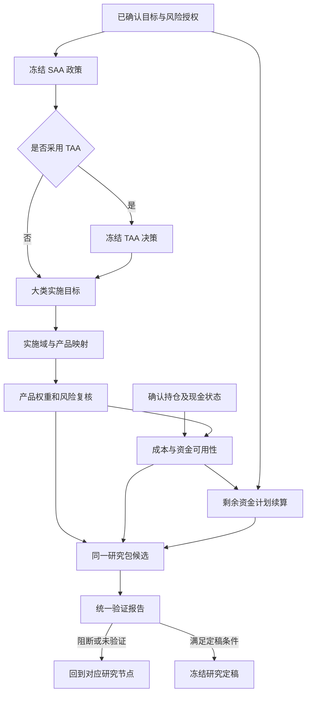

# 投前研究优化方案：产品实施风险、成本、剩余资金与统一研究包

日期：2026-09-19；实施更新：2026-09-20。状态：**基础研究闭环已实现，最终范围和测试以[开发验收](pre-investment-implementation-acceptance-2026-09-19.md)为准**。第 2–3、13 节保留实施前的 Dev 同步与缺口基线，不代表当前仍全部缺失。

依据：同步后的当前工作区代码、[原总体设计](pre-investment-dual-path-cma-saa-design-2026-09-16.md)第 17–19 节、[机构差距研究](pre-investment-institutional-gap-analysis-2026-09-19.md)，以及本次重新查阅的机构一手资料。本文细化总体设计的 P5/P6，不另行改变已完成的单 CMA、模式 A、模式 B 契约。

## 1. 结论与开发范围

优先形成一条可核验的闭环：**冻结 SAA／可选 TAA → 产品实施方案 → 实际产品风险与净成本 → 当前余额和剩余支付续算 → 同一研究包的统一验证 → 明确边界的研究定稿。**

当前主要问题是证据之间缺少一致的交接，而非缺少另一个优化算法。已有类别预算门禁、CMA 多模型校验、留出验证、情景研究、不可变存储和 NJIT 内核，应继续复用。需要补齐的四件事是：

1. 产品权重不仅保持大类资金预算，还应通过产品暴露、残差和逐模型风险复核。
2. 交易成本既影响方案选择，也必须进入真实的金额递推；资产净值、可交易资金和可支付资金分别建模。
3. 从确认的当前资产状态续算剩余计划，保留过去未支付事实，不再引用原始 SAA 成功率作为当前保证。
4. 研究包先锁定输入，再承接验证与定稿；验证的是同一组最终产品权重、资金状态和费用假设。

基础范围维持 ETF／场外公募、长仓、明确现金项与单一本位币研究。暂不扩展为交易系统、完整机构 ALM、衍生品定价或自动投资审批。已有 product-first、strategic-first、手动配置和历史研究功能继续保留。

## 2. 本次 Dev 同步及证据基线

- 分支保持 `ISSUE2609/BetterSaaTaa`。从 `03530dfec8f5f917934e68e2141e7b1b25fdadc1` 快进至远端 `Dev` 的 `3e5c03763713d44a770703db33880f2357738ef4`，纳入 41 个提交、46 个变更文件；核验时 `HEAD...origin/Dev = 0 / 0`。
- 当前代码还包含之前未提交的独立 LTCMA／多 CMA 开发，不能把 HEAD SHA 单独当作完整工作区版本。
- 5 个重叠文件：`strategic_allocation/service.py`、`policy_gate.py`、`docs/repo_map.json`、`docs/pitfalls.json`、`locales/system.json`。其中 service 的两处冲突合并保留了本地三种 CMA 模式、CMA 可引用校验，以及 Dev 的有效 Mandate 校验与锁内复核。
- 原有改动先备份至 `/private/tmp/bettersaataa-dev-sync-20260919-0jd8_0v7`，包含文件、哈希、patch 和三方合并材料。同步途中出现的总体设计文档更新另存备份并保留原位；不涉及 Dev 重叠。同步后非重叠文件哈希一致，无冲突项、无暂存项。未 commit／push。
- CodeGraph 已同步：1,233 个文件记录、24,900 个节点、84,223 条边，状态 up to date。图谱用于定位，关键结论由当前源码核实。

Dev 新增的现金保护、循环计划编辑、风险标尺当前资格及基准再验证，应视为已有能力。它们仍未替代下文的**余额／支付事实续算**。

## 3. 实施前代码事实与缺口（2026-09-19）

| 领域 | 当前代码事实 | 本次需要补齐 |
|---|---|---|
| 产品来源与预算 | [portfolio_bridge.py](../../backend/tactical_allocation/portfolio_bridge.py:66) 只接受已保存 `kind=taa`，要求同一冻结可投资域、产品唯一归属、手动策略及类别权重相等 | 直接 SAA 来源、后置实施映射、新产品实施域，以及受预算约束的产品优化 |
| 产品风险 | 上述桥接检查类别资金合计；没有在该交接中构建产品联合风险矩阵 | Q 与统计 B 分开，产品间残差协方差，实际产品风险／总主动风险再检查 |
| 风险模型中心 | [sensitivity/service.py](../../backend/sensitivity/service.py:131) 已做联合输入 OLS、时间留出及可选验证后重估；结果明确不包含未建模残差 | 新增残差矩阵、共同时轴、秩／条件诊断、因子与残差假设；不能直接把现有 beta 输出称为完整风险模型 |
| 因子画像 | [factor_research/service.py](../../backend/factor_research/service.py:438) 明确是持仓加权特征分数 | 不能拿特征画像替代统计风险暴露 |
| 成本 | TAA 已计算显式成本；[portfolio_service.py](../../backend/custom_indicators/portfolio_service.py:507) 拒绝所有非零交易成本 | 产品费用表、金额成本、自融资检查、净值与现金账对账。产品 NAV 可能已含管理费，不能再重复扣 |
| 历史产品组合 | [portfolio_service.py](../../backend/custom_indicators/portfolio_service.py:909) 使用严格共同日期、下一共同数据日权重生效和漂移内核 | 保留原输出；新版本增加净成本证据。静态目标历史回放仍不是完整动态 TAA 产品执行回放 |
| 资金诊断 | [planning.py](../../backend/strategic_allocation/planning.py:26) 从原预算展开 `horizon_years * 12`；[goal_kernels.py](../../backend/strategic_allocation/goal_kernels.py:184) 限制月数为 12 的倍数、初始资金大于零 | 任意正整数剩余月数、明确截止点、余额和支付核对、零余额边界、剩余期限适配 |
| 三类目标与现金保护 | [mandate_inputs.py](../../backend/strategic_allocation/mandate_inputs.py:15) 将资金目标／现金保护判定与有无现金预算分开 | 续算继承实际适用的成功标准，不因目标为绝对或相对收益而丢失支付保护 |
| 多模型 | [service.py](../../backend/strategic_allocation/service.py:561) 保留 single／A／B；B 逐模型约束与独立资金验证已有 | 同样语义下传至产品和新资金状态；A 的原模型诊断不能自动变成 B 的全部通过门禁 |
| 情景与验证 | 已有发布风险情景、Monte Carlo／历史／状态／逆向压力实验、TAA 留出与 walk-forward | 接入同一最终产品／余额／费用版本；不重造整套情景中心，也不把压力结果冒充概率 |
| 统一流程 | [App.tsx](../../frontend/src/App.tsx:114) 产品构建子页真实，合成、统一验证、定稿入口仍为原型 | 真实研究包对象、验证编排、失败回流、定稿及当前资格复核 |

上述“未接通”指本次定位的实际流程与契约，不能由某个关键词未命中推导为全仓库没有类似工具。本次未审计正式数据完整性、实际产品费率或账户持仓。

## 4. 外部研究对本项目的具体启示

以下为公开方法与披露，不代表掌握机构内部完整工作流。旧论文用于说明稳定方法问题，不称为 2026 年新算法；右栏是针对本项目的设计建议。

| 一手资料 | 可核实的重点 | 本项目采用方式 |
|---|---|---|
| [AQR：可实施效率前沿，2022-08-18](https://www.aqr.com/insights/research/working-paper/machine-learning-and-the-implementable-efficient-frontier) | 从扣交易成本后的收益与风险评价组合 | 比较当前持仓、手动目标、实施优化的净结果；不能只展示毛收益最佳者 |
| [AQR：Trading Costs，2018-08-23](https://www.aqr.com/insights/research/working-paper/trading-costs) | 依据真实交易研究成本和冲击，成本随交易条件变化 | 冻结费率来源、规模和适用范围；基础线性费率只作为有边界的估计，不能冒充已校准冲击模型 |
| [MSCI：风险模型与优化误差，2012-08](https://www.msci.com/documents/10199/8426a871-688b-4705-ae65-aee7c4c9a0c5) | 因子缺失、暴露误差和协方差估计误差可令优化组合风险被低估 | 预算门禁之外增加残差风险、留出稳定性及风险预测复核；MSCI 是风险基础设施参考，不作为买方内部流程证据 |
| [Vanguard：VLCM，2025-05](https://corporate.vanguard.com/content/dam/corp/research/pdf/vanguard_life_cycle_investing_model_vlcm_a_general_portfolio_framework_for_goals_based_investing.pdf) | 将目标、储蓄、支出、财富与投资期限放在同一概率研究框架 | 使用当前余额、剩余支出和期限生成新的目标诊断；同时显示收入不足与终值，而不只显示一个成功概率 |
| [GIC：路径情景研究，2021-01-20](https://www.gic.com.sg/thinkspace/portfolio-construction/scenario-planning-for-portfolio-resilience-in-an-uncertain-world/) | 情景路径与现金流、流动性需要共同评估 | 对“早期下跌＋近期支出＋赎回延迟”做联合压力；只吸收适用思想，不引入本项目未覆盖的私募资产系统 |
| [Two Sigma：Investment Management](https://www.twosigma.com/businesses/investment-management/) | 将预测、交易成本和风险共同用于目标配置 | 产品实施的目标、风险与成本共享输入版本和最终权重 |
| [GIC：2025/26 治理披露](https://report.gic.com.sg/governance.html) | Mandate、投资、风险和审计职责明确 | 研究者确认、数值验证、独立复核分开记录；单用户本地环境不能宣称独立机构审批 |
| [NBIM：External Management](https://www.nbim.no/en/about-us/about-the-fund/governance-structure/policies/external-management--/) | 外部管理费用批准和收益／费用计算具备独立职责 | 保存产品准入、费用依据与审核记录；不将外部委托管理政策照搬为所有公募基金的强制模板 |
| [Bailey／López de Prado：DSR 原论文，2014](https://www.davidhbailey.com/dhbpapers/deflated-sharpe.pdf) | 多次策略尝试及非正态会影响业绩显著性判断 | 新研究显式登记尝试与冻结留出；只有策略比较满足统计适用性时计算 DSR，不给静态资金计划强塞 Sharpe 显著性 |

访问日期均为 2026-09-19。网页抓取时间不作为文献发表时间。

## 5. 统一主链与最小数据对象



这是目标链路；基础版现已接通，逐产品路径、执行日历与机构审批的适用边界见开发验收。TAA 可选，不能要求纯 SAA 用户构造虚假的零偏离 TAA ID。

| 对象 | 必须锁定的内容 | 复用边界 |
|---|---|---|
| `ImplementationPlanVersion` | SAA／TAA 来源及 hash、目标大类权重、实施域／映射、Q、产品权重、方法、风险／费用引用 | 新来源契约；现有 `kind=taa` 记录保留原义，通过薄适配进入共同校验 |
| `ProductRiskEvidenceVersion` | 产品／代理轴、B、残差协方差、交叉协方差假设、样本切分、数据与算法 hash、适用期限 | 扩展现有风险模型产物；不另建同义 OLS 引擎 |
| `CostSpecVersion` | 产品与渠道、买卖／申赎费、持有期条件、费用覆盖关系、估计来源／日期、模型限制 | 静态假设、产品条款和真实校准三种证据等级分开 |
| `FundingStateVersion` | 确认时点、持仓市值、可用／受限现金、应收应付、余额口径、支付核对、剩余目标 | 研究态人工确认／文件导入可先落地，不依赖尚未完成的账户原型 |
| `ValidationReportVersion` | 被评估候选 hash、规则版本、逐项结果、执行证据、数据／模型适用性 | 编排已有数值能力；不保存另一套指标计算真相 |
| `ResearchPackageVersion` | 全部精确依赖、验证报告、研究意见、限制、定稿记录与有效性事件 | 复用受控存储、不可变数组、hash、幂等及锁，不新建微服务平台 |

这些是领域契约，不要求每项建立独立数据库或页面。首版可由一个研究包 manifest 引用现有 artifact，并增加少量必要子产物。

## 6. 产品实施风险：预算与暴露必须分开

### 6.1 两种矩阵及数据门禁

设 N 个大类、K 个产品，产品权重 `x∈R^K`、目标大类权重 `w∈R^N`。

- `Q∈R^(N×K)`：类别资金归属，首版每列一个 1，满足 `Qx=w`、`x≥0`。现金是明确的实施项；无法映射的大类显示缺口，不偷偷再分配。
- `B∈R^(K×N)`：产品对代理收益的联合统计暴露。实际暴露是 `B' x`，可以与 `Qx` 不同，不能把 Beta 归一化后当作资本归属。
- 多大类主动产品在首版只有可靠穿透证据才能进入对应扩展；否则保存待研究状态。产品杠杆／反向条款单独准入，长仓权重不证明底层无杠杆。

风险数据采用同币种、同收益语义、同频率、共同日期轴；锁定训练／验证窗口、RF、复权和费用覆盖。基础回归使用同一组代理做联合回归；现金常量不与截距一起作为不可识别因子。零方差、秩不足、样本缺口、严重共线性应返回原因，不静默正则化。

现有风险模型允许各输出有样本有效性差异，因此生成产品间残差协方差时必须新增共同有效样本门禁。不能将不同日期估计的残差方差／相关性直接拼成“联合模型”。留出系数与发布后重估系数分开保存，重估后的样本内指标不替代原留出证据。

### 6.2 风险传导及逐模型验收

以同期间超额收益表示：`rP-rf = α + B(rA-rf) + ε`。在明确采用因子—残差零交叉协方差假设时，每个 CMA m 对应：

```text
ΣP_m = B ΣA_m B' + Σε
σP_m² = x' ΣP_m x
TE_to_SAA_m² = (B'x - wSAA)' ΣA_m (B'x - wSAA) + x' Σε x
```

需要同时报告相对 SAA 的总主动风险和相对当前 TAA 目标的实施跟踪风险，分别绑定阈值，避免 TAA 和产品层各自通过却累积超出总体风险预算。

`Σε` 必须包含跨产品残差协方差。若使用 `D_m=Cov(rA,ε)`，则联合矩阵 `[[ΣA_m,D_m],[D_m',Σε_m]]` 须逐模型 PSD；产品风险还包括 `B D_m + D_m' B'`。不能把历史 D 原样配到任意前瞻 CMA 后默认仍有效。基础版可采用经说明与稳定性验证的 `D=0` 假设，但必须记录这是模型假设；明显失效时阻断相应应用结论。

风险假设还须声明 B、残差协方差的适用 horizon；短窗历史残差平稳延展至长期本身是待验证假设。对系统性遗漏、残差相关上升、暴露漂移分别压力测试，不靠任意统一“风险乘 1.2”替代证据。

| SAA 模式 | 产品验收主依据 | 原模型结果 |
|---|---|---|
| single | 该冻结 CMA 经产品桥接后的风险与收益 | 同一模型 |
| A：参数平均 | 冻结融合矩，经同一风险桥接后验收 | 逐模型保留诊断；不擅自升级成全部硬门禁，不添加模型间分歧协方差 |
| B：共同兼容 | 每个原始 CMA 都检查产品风险、必要收益及适用资金条件 | 每项都必须有结果，展示用平均矩不得放行 |

产品前瞻收益默认不预测历史回归 alpha。`zero_active_premium` 表示不假设主动超额增益；可另计有证据的跟踪差／增量费率，但不得重复扣 NAV／代理已含费用。没有可辩护的收益桥接时，允许风险报告完整、收益或资金部分 `unavailable`，不能补零后宣称全部验证。

一个可复核反例：两只产品各占 50%，都归同一大类且 Beta=1.2；大类波动 10%，两产品残差波动均 5%、残差完全相关。资金预算完全匹配，实际组合波动却为 `sqrt(0.12²+0.05²)=13%`。忽略残差相关会错报约 12.51%；只看大类则错报 10%。

### 6.3 配置方法与求解边界

首个可用版本先让现有手动／类内配置经过统一风险门禁，再提供类别预算 QP：在共同历史联合风险下最小化产品相对目标的 TE，加显式交易成本惩罚，受 Qx、产品限额、现金和准入约束。成本惩罚系数的风险／收益单位与评价期限必须记录，不能直接把“年方差＋人民币成本”相加。

复用 [qp_numba.py](../../backend/qp_numba.py:232) 的多等式、秩处理和矩阵 QP。Qx 已隐含总预算时移除冗余等式，但须验证一致性。该内核要求可行初值；实施域无产品、产品上限合计不足、现金不足等应先形成可行性诊断，再以明确 Phase I 找初值。不能拿随意等权传入求解器。

历史 TE 优化目标与前瞻逐模型验收分开显示。第一版若只是生成候选后过滤，失败只能表述为“这些候选未通过”，不能宣称所有产品组合无解。后续联合纳入多模型二次风险约束需要扩展现有兼容求解组织，不能直接把当前单总预算 LP 当作任意多等式产品 QCQP。固定开仓费、整数手数／产品数约束另属问题类别，基础版只产出连续权重研究方案。

## 7. 成本与可用现金：从假设到账目一致

### 7.1 成本采用一次且适用于产品

`CostSpecVersion` 每条费用至少包含 `component / product / side / basis / rate_or_schedule / currency / effective_dates / source / included_upstream / evidence_grade`。

- ETF：先支持有依据的买卖费率、价差估计；冲击成本只有实际规模、流动性来源与校准证据齐全时才启用。未校准时列估计区间和容量限制。
- 场外基金：申购／赎回费用与持有期、渠道相关，不能套 ETF 的统一 bps；缺持有期／费率表时输出缺证据，或用明确保守上界作压力，不能填零。
- 年度顾问等附加费用与基金 NAV 已含管理费分开。用费用覆盖表防止 CMA、产品净值、资金模型重复扣同一费用。
- 没有税务身份及适用资料时，显示税前范围或未建模；不自行生成一套税率。

历史 TAA 的成本曲线和最终产品模拟是两条研究证据，不把两条曲线的成本相加。产品层以最终订单／目标变化和真实产品收费基数计算。

复权净值是收益代理，不能直接当作可成交价格。缺少执行价格、价差或成交规模时，费用应标为“基于声明价格／规模假设的研究估计”，不能宣称已验证真实成交成本。

### 7.2 明确换手口径与自融资

换手分开保存 `gross_traded_notional` 与 `half_turnover`。先根据实际买卖金额计算成本，再给出标准化换手；不能以半换手数乘“每一边成交金额收费”的 bps，少扣一半。首次建仓也应收费，现有漂移权重才是下一次调仓前状态。

如果目标 x 是扣费后的权重，调仓成本 K 会改变目标金额，应满足：

```text
W_after = W_before - K
Δh_i = x_i × W_after - h_i_before
K = Σ_i cost_i(Δh_i)
```

现金项不收交易费。基础连续线性费用可用有界求根／分段计算解决，并验证现金守恒、费用非负和目标残差；所有迭代有上限、容差和失败状态。不应先按全本金满仓，再在组合外无来源地扣一笔费用。复杂费率不满足基础求解假设时明确不支持。

例：10 万元、A/B 各半，改至 60%/40%，买卖金额均收 5bps。粗略费用约 10 元，不能用半换手算成 5 元；考虑扣费后目标，精确线性解约为 9.9990001 元。该例已用独立算术核对，不代表生产能力已实现。

### 7.3 估值和支付分开

研究态资金明细至少区分：产品市值、可支付现金、受限现金、未结算应收、未结算应付。市值足够不代表付款日前资金可用；可交易余额也未必可提取支付。产品交易日、申赎确认／到账、截止时间和渠道规则来自版本化条款，不能统一假设 T+1。

第一版建立**近期付款的确定性现金日历压力检查**：用已确认现金与确知到账，检查每个支付日前可用余额；对赎回延期、暂停、成本上升做明确情景。未知到账或条款阻断“现金可用性已验证”，不自动升级成允许融资。

“以卖出收入支付买入”的计划还须检查两端资金可用时点。基础版不支持结算过桥时，不能仅凭调仓末总资产平衡放行；应返回资金缺口，或显式生成分期研究方案并重新计算过渡持仓风险及费用。

跨产品缺失 NAV 仍按严格共同日期处理。现金日历可使用事件日期，但不因此把产品缺失收益补零。首版结论为连续权重下的研究可实施性；没有价格、手数、最低申购额等证据时不输出可直接下单承诺。

## 8. 剩余资金续算：状态、期限与路径

### 8.1 续算起点与支付核对

新增 `FundingContinuationContext`，细化原总体设计第 17.5 节：

```text
original_mandate_ref / original_cash_budget_hash
valuation_at / knowledge_cutoff / state_hash / balance_basis
confirmed_investable_value / settled_cash / restricted_cash
receivables / payables / transition_cost_evidence
cashflow_reconciliation[{flow_id, occurrence_id, due_at, paid_amount, status, evidence}]
remaining_cashflows / remaining_terminal_target / original_price_base
model_calendar / remaining_periods / cutoff_phase
implementation_plan_hash / cost_spec_hash / cma_evaluation_refs
future_weight_rule / distribution_spec / horizon_applicability
search_spec / independent_validation_spec
```

原预算如果没有稳定 occurrence ID，按冻结预算 hash＋流序号＋原模型月生成确定 ID，不能依赖可变页面排序。核对至少区分已付、部分支付、未付、取消、未知；取消及目标调整需要新版本理由。日期已过不等于已支付。

以确认的当前可投资总价值为起点，并单列其中的现金；不能只拿现金当全部本金，也不能把已包含的应收重复加进本金。组合外储备已经排除时不再扣一次；过渡成本按余额截止点确定扣一次。旧发生额只用于核对，未来列表只包含未结清部分；逾期欠款保留原始失败事实与新的偿付安排。

分别报告“从续算日开始的未来条件成功率”和“原计划至今是否已经违约”。已经漏付过一笔，未来即使有较高余额，也不能把原计划整体状态改为成功。

### 8.2 任意剩余月数，先明确截止点

先支持模型月边界的任意整数剩余期，例如 1、3、13、37 个月；不得将 37 个月四舍五入成 3 年。现有内核 `months % 12` 校验和年度扇形数组都要调整：新增检查点轴保留完整年度和最后不完整年度。剩余 0 期只做终值／未付事实核对，不调用随机模拟。

`cutoff_phase` 说明余额已含哪些当天付款／入金／费用，避免同一事件在起点和首期重复计入。非模型月边界首版返回 `cashflow_calendar_adapter_required`；后续实际日期适配再定义年分数、首期收益与事件次序。不能仅改接口为 float 年数。

零可投资余额但未来有收入是合法的研究边界：按新版本显式处理，不能人为注入微小本金绕过旧校验；负净资产／融资超出基础范围则阻断。原名义／实际金额基准日与已实现通胀重估规则保留，不能重置到今天后再次完整复利。

工程上提取／扩展唯一的资金递推内核；旧请求入口维持原数组、旧整年口径和测试覆盖的薄适配，历史 artifact 不重算，不并排复制一套“旧资金算法”。

### 8.3 两层诊断不可混淆

| 层次 | 能回答的问题 | 不能声称 |
|---|---|---|
| 月度标量代理续算 | 当前余额、剩余支付、当前产品组合的桥接矩及明确年费假设下的资金分布 | 未逐资产模拟的未来换手、赎回到账、状态切换或动态 TAA 已验证 |
| 产品路径与事件现金验证 | 明确未来权重规则下，产品收益、费用、调仓和结算共同影响的付款／终值 | 未执行的信号规则、未校准场景概率或未知交易条款已获保证 |

第一层先落地，继承现有对数正态矩匹配并如实标注。第二层是完整成本／支付可实施结论的必要证据；复用现有情景／收益路径生成能力，但必须验证它们对指定 CMA、收益轴、期限和概率语义确实兼容。已有 Monte Carlo 工具不自动成为任意产品的合格前瞻生成器。

新增统一路径输入可为 `gross_growth[period,path]` 和必要事件数组，资金递推核只处理增长、费用、入金、支付及缺口；按月末约定可表达为：

```text
V_available = V_previous × gross_growth × net_wealth_fee_factor
              - incremental_path_cost + contribution
V_end = max(0, V_available - required_payment)
```

该标量表达只用于相同月末约定。逐资产执行时，费用和调仓先进入持仓／现金状态；资金核不能再次扣同一笔。支付可行性依据结算现金事件，不仅依据 V_available 总市值。

未来规则必须区分买入持有漂移、明确周期再平衡、阈值再平衡与冻结当前组合的标量近似。不能用固定权重均值波动声称已经模拟月度调仓成本。没有受支持路径时只完成有边界的研究定稿，保留执行验证缺口。

### 8.4 成功标准与多模型统计

- 保留原三类目标、现金保护、期末底线；有预算但未要求概率保护时，支付与流动性诊断仍适用，不擅自增加目标或降低支付。
- 输出支付失败概率／金额、首次缺口、终值分布、终值不足、资本补足敏感性，以及每项模型和费用边界。概率区间只表示模拟采样误差。
- A 采用冻结融合模型的主结果，并保留原模型诊断；B 对每个原 CMA 续算，以最不利模型结果及逐模型表呈现，不能把 B 的模型列表当作概率混合权重。
- 比较候选可共享随机数；确认候选后用独立验证流。不同 seed 不能替代数据 OOS，也不能消除反复查看留出集造成的选择偏差。
- 若 B 使用每模型 95% Wilson 下界，必须标注是逐模型区间，不称为“全部模型联合 95% 置信”。若定稿契约要求同时覆盖，采用预先冻结的多重比较控制（例如 Bonferroni 的模型数调整）及相应模拟预算；不事后选择更宽松口径。
- CMA 覆盖剩余期限需要显式适配。当前同 as-of／同 horizon 门禁继续保留；历史 CMA 延展只在新证据中记录平稳假设，不修改旧 CMA 日期来骗过检查。

## 9. 统一研究包、验证与定稿

### 9.1 从同一候选出发

先建立研究包草稿，精确引用 Mandate、RiskScale、所有 CMA、SAA、可选 TAA、实施计划、风险／成本／资金状态及已发布情景。任一输入变化生成新候选 hash；旧报告可读但不能给新候选放行。

包不能只保存对象 ID 或页面截图。Manifest 包含依赖内容 hash、数组 hash、代码版本及未提交源文件指纹、数据快照、估值／可得时点、算法版本、随机流、费用覆盖、权重规则、已知限制。资产轴、币种、频率、参考日期、历史回放／前瞻模拟 scope 不兼容时先阻断，不靠拼接 JSON 获得“完整报告”。

现有发布情景 impact 是瞬态结果。首版可在用户明确保存验证报告时，把“精确输入＋结果摘要＋执行版本”作为报告证据冻结，不新增一个自动发布 impact 的能力；普通预览仍不写库。

### 9.2 验证结果按事实表达

每项结果至少包含：

```text
check_id / contract_version / scope / evaluated_subject_hash
model_ref / input_hashes / weight_rule / valuation_at / knowledge_cutoff
metric / value / unit / horizon / confidence / comparison / limit / tolerance
status: passed | failed | unavailable | not_applicable
enforcement: hard | review | information
reason / evidence_ref / execution_version / checked_at / review_due_at
```

检查目录由后端产生，包括适用性规则，前端不自算通过数量来决定定稿资格。必须分开：

1. **完整性**：来源、hash、轴、资金对账、版本和计算准备状态。
2. **投资约束**：Q 预算、产品准入、当前授权、单／A／B 实际风险、收益和适用资金条件。
3. **验证证据**：数据时点、训练／验证切分、成本与压力、模型假设、模拟预算、参数稳定性。
4. **治理记录**：负责人、复核意见、决策理由、限制与复核日期。

硬规则 `failed` 或 `unavailable` 阻断对应定稿资格；`not_applicable` 需要后端给出规则依据。数值失败、hash 错误和预算违例不能靠研究员勾选“知悉”放行。可接受的模型限制要保留原结果及具名理由，不改写为 passed。

### 9.3 定稿状态与资格分开

建议状态：`draft → candidate_frozen → validation_complete → finalized`；不满足条件可停在候选或形成明确失败报告。每个 report 是不可变版本，包的阶段状态由事件投影，不原地修改既有研究事实。

验证在追加 `candidate_frozen` 前必须取得与预览、优化共用的计算名额。忙碌请求返回 `IMPLEMENTATION_BUSY`，不得修改版本、幂等记录或运行尝试；原 revision 和操作键可直接重试。取得名额后，无论冻结写入、候选校验或计算失败，都必须释放名额；已开始计算的失败尝试仍保留审计记录。

研究定稿同时携带独立资格字段：

- `research_scope`：例如静态权重前瞻研究／历史回放／特定路径规则验证。
- `implementation_eligibility`：可实施研究条件是否完整。
- `historical_pit_eligibility`：历史正式可得性是否有证据，不能因本次保存 hash 变真。
- `independent_review`：谁、何时、针对哪个候选和报告 hash 复核；本地自填身份不等于认证独立性。

完整性通过的研究报告可以在清楚限制下定稿；这不意味着执行资格自动通过。用户界面显示“研究定稿”“实施条件未齐”等明确状态，不出现一个泛化绿勾。若需求要求机构独立审批，缺乏认证身份／职责分离时保持 unavailable，不借一个姓名字段宣称达标。

### 9.4 定稿一致性及后续更新

定稿请求锁定 `expected_revision + candidate_hash + validation_report_hash + idempotency_key`。服务端重验全部 hash、当前准入／退休／有效期和必要门禁，在共同生命周期锁或版本比较保护下保存；前端按钮禁用不能代替后端校验。

研究历史与当前应用资格分开。模型退休、产品停售、映射到期、资金状态变化可以新增“需复核”事件，不能修改旧结果或删除已定稿版本。复制重研产生新版本，形成可追溯的比较。

复制来源 `copied_from_id` 指向具体、已存在的研究包版本（artifact ID），不是研究包逻辑 ID。新建复制时由后端检查版本存在且类型正确；后续编辑沿用已保存来源，忽略客户端的空值或替换值。验证、定稿、历史和导出继续携带该来源；原有 revision/CAS 和幂等门禁保持不变，不回写历史版本。

新增显式“登记研究运行”动作，为已选择的假设族记录开始、成功、失败、取消、参数和留出使用情况；普通输入预览不暗中持久化。失败尝试保留，技术重试以同一逻辑 attempt 和幂等键关联。已有历史研究没有完整尝试数时标 `unknown`，不推定为 1。统计纠偏只在有相应数据和适用条件时启用。

## 10. 实施顺序与可验收交付

以下 E0–E5 是本文工作包编号，与总体设计 P0–P6 不同。E0 先约定共同证据，E1–E4 逐步产出内容，E5 最后接通定稿。

| 工作包 | 具体交付 | 可验收完成标准 |
|---|---|---|
| E0：统一证据底座 | 研究包草稿、候选 hash、结果契约、现有 artifact 适配、能力目录 | 更换任何权重／来源／成本／资金状态后旧报告不再适用；未实现能力返回明确状态 |
| E1：产品来源及风险 | 直接 SAA／真实 TAA 两种来源、后置映射、手动产品方案、B／残差证据及逐模型门禁 | Q 守恒但实际风险超限的方案被拦截；缺产品、缺暴露和历史版本各有真实状态 |
| E2：净成本和支付日历 | 费用覆盖表、首次建仓／再平衡成本、扣费后权重、自融资、近期现金可用性 | 毛净差与费用完全对账，付款日晚于到账才可用；缺费率／持有期不填零 |
| E3：资金状态与月度续算 | 核对余额和支付、任意剩余整月、保留目标与期限、独立模拟验证 | 37 个月、0 期、部分支付、逾期、零本金、组合外储备均有正确语义；旧整年契约不变 |
| E4：联合验证与实施优化 | 产品预算 QP、适用的成本／现金路径、现有情景证据编排、模式 B 全模型复核 | 最终同一权重规则通过完整门禁；候选失败不冒充全局无解；无路径时不宣称完整资金验证 |
| E5：定稿闭环 | 合成／验证／定稿真实工作台、复核记录、冻结 manifest、导出和重研 | 同一包可独立复现，变化使当前资格需复核；单人研究与独立审批标记准确 |

类级 TAA 与产品应用解耦可作为 E1 的并行依赖设计，但不应阻塞先交付直接 SAA → 产品实施。仅大类研究有合格 Proxy 就可开展；最终产品应用仍须完整映射。不要为此另建第二套 TAA 算法。

第一条端到端验收案例选：**一份已确认目标＋单 CMA 或模式 A／B＋无 TAA 的 SAA＋两类产品与现金＋明确费率＋剩余 13 个月计划＋统一报告**。再覆盖真实 TAA、映射失效、现金延期、模型 B 某一源失败。每个工作包必须有可用 API 和实际用户路径，不以新增 DTO 或原型页作为完成。

模式 B 五等级前沿、凹效用、更多 CMA 方法、跨币种、多市场频率、整数交易、完整衍生品和机构 ALM 后置。既有相同能力应接入，不再复制。

## 11. 代码接入、数值与内存约束

| 现有位置 | 计划改动及保持项 |
|---|---|
| [portfolio_bridge.py](../../backend/tactical_allocation/portfolio_bridge.py:66)、[policy_gate.py](../../backend/strategic_allocation/policy_gate.py:41) | 扩展来源和共同产品门禁；保留旧记录读取及单／A／B 风险语义、当前标尺资格 |
| [sensitivity/service.py](../../backend/sensitivity/service.py:131)及其内核 | 增加适合实施风险的联合证据输出，复用拟合与验证；旧压力暴露模型不自动升级为完整风险模型 |
| [portfolio_service.py](../../backend/custom_indicators/portfolio_service.py:507)及漂移回测内核 | 新契约支持成本、现金项和费用对账；已有毛收益与不可变 runs 原义保留 |
| [goal_kernels.py](../../backend/strategic_allocation/goal_kernels.py:139)、[planning.py](../../backend/strategic_allocation/planning.py:26) | 唯一现金递推，扩展剩余期／检查点，增加状态边界；旧资金证据不重算 |
| [qp_numba.py](../../backend/qp_numba.py:232) | 复用矩阵 QP、秩校验和数值残差；明确可行初值及联合约束求解扩展 |
| [sensitivity/repository.py](../../backend/sensitivity/repository.py:161) | 复用 append-only、幂等、数组和受控磁盘；新增包／报告编排层，无重复存储框架 |
| [App.tsx](../../frontend/src/App.tsx:114) | 用真实研究包工作台逐步承接合成、验证与定稿；实施前完整读取前端设计准则 |

算子按职责拆分为：联合回归证据、残差协方差、产品风险映射、预算／约束审计、费用计算、现金事件核对、路径资金统计。输入输出可独立复用；用户可替换估计方法而不改写整个流程。

必须保留耦合的部分是：QP 的活跃约束迭代、扣费后目标与成本的自融资求解、持仓／现金／未付标记的路径递推。每个都有明确状态、收敛或有限期间终止条件，外围取数、参数选择、发布独立。不能将整个投前流程做成一个新黑盒算子。

所有新增数学与循环默认进入固定签名 NJIT；服务与 worker 预热不完整即不可计算，`python_fallback=0`。共用 float64／int64 只读数组，时间索引用统一轴，非连续样本在内核索引访问；不得逐窗口创建 DataFrame 或复制全量路径。统计模型需要同轴正规化时允许一次边界复制，记录原因。输出／工作缓冲区可以分配。

执行预算按 `模型数×候选数×期数×路径数×资产数` 预估并限制，固定时限及内存上限。按路径块维护现金状态和充分统计，避免无条件持有全部五维数组；分位数必须明确精确计算或经验证近似，不能为省内存改变统计口径。用实际调用检查、`np.shares_memory`、只读／非连续输入和峰值内存基准验收。

## 12. 必须通过的验收反例

| 类别 | 必测反例 |
|---|---|
| 风险 | Qx 精确匹配但 Beta 偏离超限；两同指数产品残差相关；B=单位阵且残差为零恢复 CMA；产品／因子轴重排不变；非 PSD／缺数据不可放行 |
| 多模型 | A 主结果过关、某源失败仍保留诊断；B 任一源失败阻断；平均矩过关不能覆盖 B；总主动风险和实施 TE 分开 |
| 求解 | 冗余一致等式、矛盾等式、产品上限不足、无可行初值、迭代耗尽；手动方案和 QP 候选走相同真实门禁 |
| 成本 | 零交易零成本、首次建仓收费、买卖费率不同、半换手与总成交基数区分、NAV 已含费用不重复、自融资与费用后权重对账 |
| 现金 | 总市值充足但付款日可用现金不足；卖出未到账不能付款；未知赎回日不自动当当天；缺价格不填零收益 |
| 续算 | 1／13／37 个月、0 期、月中日期、零本金、已付和部分支付、逾期与取消、当天截点、储备不重扣、原实际金额基准不重置 |
| 路径 | 先亏后涨与先涨后亏遇支出产生不同结果；有过漏付即便终值恢复仍记录失败；成本上升／到账延迟不能改善相同路径的可支付性 |
| 统计 | 搜索与独立验证分开；反复查看验证有记录；逐模型区间与联合覆盖明确；压力情景不自动分配概率 |
| 研究包 | 相同幂等请求不重复定稿；候选变化、过期、退休、错误 hash、缺报告、并发更新均拒绝旧资格；历史包不变 |
| 工程／交互 | 实际 NJIT 调用、PID 预热、只读输入及内存共享；真实页面的加载／失败／过期／差异复核／定稿及窄屏可用 |

独立算术例已核对：第 6 节风险 13%、第 7 节费用约 9.9990001 元；从已排除储备的 80 万余额起步、零收益连续 3 个月各付 1 万，余额为 77 万；先漏付后补入导致正终值不抹除漏付事实。这些仅验证方案中的小例子，不是新生产算法测试。

## 13. 方案调研阶段的验证记录（2026-09-19，历史）

- 同步整合后的后端相关测试 **188 passed**：strategic allocation、multi CMA A/B、Mandate 边界／参考诊断、TAA 产品桥接。
- 前端相关测试 **106 passed，6 个文件**：目标工作台／列表、产品池选择、RiskScale flow、多 CMA／SAA 工作台。存在 React `act(...)` 警告，未据此宣称浏览器验收。
- 前端生产构建通过；保留既有浏览器数据过期和 bundle 体积提示。
- 5 个合并文件的 JSON 无重复键／Python 语法检查、`git diff --check`、路由变更覆盖检查通过。
- 路由完整验证因既有未跟踪的多 CMA 测试／源码／文档等 **20 条引用**失败；仅跳过 Git 可复现性检查的结构校验通过。未通过暂存这些文件或放宽规则掩盖该问题。
- 本次不包含全量回归、真实浏览器、新功能实现、正式投资数据／真实费率审计、服务重启或线上部署。后续开发验收须重新覆盖实际变更。

当时建议从 E0＋E1 开工。2026-09-20 已完成 E0–E5 的基础研究闭环；最新代码范围、明确降级项及最终自测见[开发验收](pre-investment-implementation-acceptance-2026-09-19.md)。
