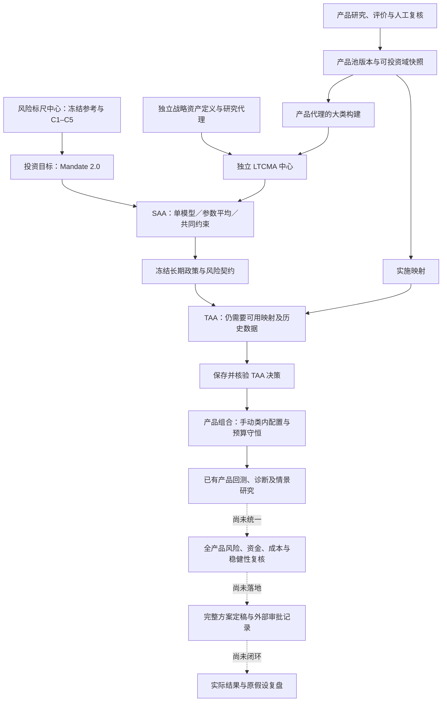

# 投前研究流程与机构买方投研差距分析

核查日：2026-09-19。代码基线：本地 `ISSUE2609/BetterSaaTaa` 工作树，HEAD `03530dfec8f5f917934e68e2141e7b1b25fdadc1`，**包含未提交的 LTCMA、多 CMA A/B 等实现**。不能用 HEAD 单独复现本报告的代码基线。

本次读取 AGENTS、路由、设计文档和实际调用链，使用 CodeGraph 导航；索引状态为 up to date，1,233 个文件记录、24,856 个节点、83,993 条边。另检索并阅读机构官网、方法手册和原始论文。没有修改业务代码，没有运行新回归、浏览器或真实投资数据实验；本报告评价可见实现与流程，不能证明预测有效、实盘有效或正式数据完整。

## 1. 核心判断

**项目已经形成有真实计算和版本治理的资产配置研究骨架；与成熟机构买方流程的主要差距，是把“研究结果”变成“有经济证据、能实施、可复核且可持续追踪的投资决定”。**

目前相对扎实的是：投资目标和资金预算分离、风险授权、独立 CMA、单／多模型 SAA、冻结风险向 TAA 传递，以及哈希、时点、失败关闭和数值执行证据。薄弱环节集中在五条连接：

1. 经济判断 → 可校准的前瞻收益与风险预测；
2. 大类权重 → 实际产品暴露、成本和流动性；
3. 局部回测 → 全链路历史可得性与研究选优控制；
4. 通过某个计算门禁 → 全方案独立复核与外部审批记录；
5. 新余额／新持仓／新信息 → 原投资假设复盘和重新决策。

这不是对机构能力做统一排名。对照对象分三类：J.P. Morgan、BlackRock、Vanguard 的配置研究；GIC、NBIM 的资产所有者治理；AQR、Two Sigma、Man 的量化研究与实施。公开资料只能支持其披露的方法，不能证明它们共享同一内部流程。下述开发优先级是基于本项目范围的分析建议。

## 2. 当前真正接通的流程

图中实线表示当前可见调用关系；虚线表示尚未形成统一业务链。独立战略研究不要求先选产品池；具体实施仍有映射门禁。现有产品桥接只接受已保存 TAA 决策，直接 SAA → 产品实施尚未接通。

| 环节 | 已有能力 | 当前边界 |
|---|---|---|
| 投资目标 | 绝对收益、相对基准、资金目标；现金预算；冻结风险标尺；参考诊断和不可变确认 | C1–C5 是项目参考标尺，不能等同机构适当性结论或完整负债管理 |
| 产品研究与准入 | 指标评价、排名、因子研究、人工准入／观察／限制、权重上限、复审日、产品池与可投资域快照 | 结构化管理人尽调、完整持仓穿透、产品实际可实施性尚未形成统一准入链 |
| CMA | Manual、BL、人工 Scenario、Historical、NIW、历史状态占用六个入口；独立发布、复制和退役 | 自动统计证据目前为 CNY/SSE 日频；宏观与估值驱动的收益生成、历史预测校准不完整 |
| SAA | single；A 参数平均；B 共同约束 minimax regret／maximin；现金／资产／分组／波动／基准 TE 等门禁 | single/A 为有限候选；B 为线性收益目标的连续共同约束；资金成功率不是全空间联合优化 |
| TAA | 冻结 SAA、动量／人工／状态／复合信号、训练与留出、分段验证、决策和执行时钟、成本及实际持仓漂移 | 仍是研究回放；完整历史政策 vintage 回放、纯大类 TAA 与产品实施解耦、剩余资金续算未完成 |
| 产品配置 | 承接 TAA 来源，校验产品归属和大类预算；产品研究目标、真实 NAV 回测与不可变运行 | 承接预算时只允许手动配置；没有完整的暴露匹配、残差协方差与成本联合优化 |
| 风险与情景工具 | 已有历史重演、因子路径、Monte Carlo、状态条件模拟、反向压力，以及敏感性模型的验证和发布 | 情景用途受覆盖与时点门禁约束；工具结果尚未统一进入最终方案的资金、实施与采纳门禁 |
| 统一验证与定稿 | 各模块已有部分验证、快照和发布能力 | `validation` 主入口仍为原型；`portfolio-synthesis`、`approval` 为原型；不是一个完整审批包 |
| 反馈 | 因子已有已保存运行之间的漂移比较；版本可以退役 | 全组合假设—实际结果—偏差原因—复核行动的反馈入口仍为原型 |

关键依据：[实际前端路由](../../frontend/src/App.tsx)、[能力注册](../../frontend/src/app/processRegistry.ts)、[现行设计的实现状态](../pre-investment/README.md)。注册表把统一验证标为 partial，是因为下属工具可用；对应总入口实际仍调用 `prototypePage`。

## 3. 与公开机构实践的九项主要差距

### 3.1 CMA：方法入口较完整，前瞻经济研究与预测校准仍薄弱

**代码事实。** 当前统计方法是历史均值／收缩协方差、NIW 更新、状态条件矩与占用混合。代码明确说明历史占用不等于转移概率，按原历史占用且无收缩混合不会自动创造新预测信息。BL 和人工情景能够承接前瞻观点，但不自动产生观点背后的经济证据。统计证据限于 CNY/SSE/daily/252。[统计实现](../../backend/strategic_allocation/cma_statistical_models.py)、[统计输入契约](../../backend/strategic_allocation/cma_model_contracts.py)。

**机构参照。** J.P. Morgan 的方法手册把股票长期收益拆到收入、利润率、估值、稀释／回购和股息等驱动；固定收益另有利率与信用框架。Vanguard 的 VCMM 将经济／市场驱动、收益映射和模拟分布连接起来。这些是“预测从哪里来”的生产过程，不只是优化器的输入表。[JPM 方法手册，第 10–15 页](https://am.jpmorgan.com/content/dam/jpm-am-aem/global/en/insights/portfolio-insights/ltcma/noindex/ltcma-methodology-handbook.pdf)、[Vanguard 模型体系](https://corporate.vanguard.com/content/corporatesite/us/en/corp/what-we-think/investing-insights/v-family-models.html)。

**差距与影响。** 更多历史估计模型不自动构成更多独立投资判断。若同一数据和同一结构假设有偏，六种入口可以同时有偏；求解正确不能校正输入的经济错误。

**建议。** 在现有 CMA 版本体系内增加可解释的收益驱动模板和观点证据，不替换历史基线。每个 vintage 保存原预测、可得数据、调整理由和实现结果，检验预测偏差、区间覆盖、风险预测与权重稳定性。长期窗口重叠会降低独立样本量，不能把每月十年预测当成大量独立验证；缺少成熟样本时应保留“未验证”。

### 3.2 多模型稳健性：已考虑模型分歧，尚缺经过校准的不确定性与路径

**代码事实。** A 正确地区分参数平均与预测分布混合：政策风险取模型内协方差，另存模型分歧；其不确定性明确为 `not_jointly_calibrated`。B 求解所选模型的共同约束，资金门禁只评估生成的共同候选；失败不证明整个资金目标无解。B 的收益锚点不是资金目标最优锚点。[融合语义](../../backend/strategic_allocation/multi_cma.py)、[共同约束与资金边界](../../backend/strategic_allocation/compatibility.py)。

**机构参照。** BlackRock 明确区分收益本身的风险与均值估计的不确定性，并把预测能力等信息用于不确定性判断，进一步进入模拟和稳健构建。Vanguard 的公开方法也强调分布而非仅点预测。[BlackRock CMA 方法](https://www.blackrock.com/institutions/en-global/institutional-insights/thought-leadership/capital-market-assumptions)、[Vanguard 动态配置研究，附录](https://corporate.vanguard.com/content/dam/corp/research/pdf/time_varying_asset_allocation_vanguards_approach_to_dynamic_portfolios.pdf)。

**差距与影响。** 对所选有限模型都合格，不代表对模型集合之外的结构变化也稳健；模型数量不能当独立证据数量。参数平均、概率混合和最坏模型优化解决不同问题，不应以“更先进”为由强行统一。

**建议。** 先建立模型证据卡、同源数据关系、权重／窗口／先验敏感性和决策稳定性报告。再按需要扩展 E3 的明确路径语义、联合不确定性和尾部目标。B 五等级共同前沿有比较价值，但优先级低于产品实施与验证断点；增加 C1–C5 本身不提升预测有效性。

### 3.3 从大类预算到实际产品：资本归属约束已有，经济暴露闭环不足

**代码事实。** 产品桥接要求同一可投资域、同一冻结产品归属、手动策略，并逐大类校验产品权重之和。它能守住预算，但不等于验证实际产品的 Beta、残差、底层重叠和预期跟踪差。[产品桥接](../../backend/tactical_allocation/portfolio_bridge.py)。

因子中心已经支持 RBSA／FF3／通用收益归因；风险中心已经有敏感性和情景传导。不能把这些能力说成不存在。不过，持仓特征画像明确不是回归风险暴露，而上述能力尚未统一成为最终产品配置的强制风险门禁。[归因调用](../../backend/factor_research/service.py)、[画像语义](../../backend/factor_research/service.py)、[风险模型验证](../../backend/sensitivity/service.py)。

**机构参照。** BlackRock 2026 年的组合构建研究强调，用全组合的经济与因子驱动审视分散化；不同资产标签仍可能暴露于同一风险。[BlackRock：Rethinking portfolio construction，第 4–6 页](https://www.blackrock.com/gls-download/literature/whitepaper/bii-investment-perspectives-february-2026.pdf)。

**差距与影响。** 例如两只同属权益类的基金，资本权重相加合规，并不证明行业、风格或同一底层持仓集中度合规；同一大类内换基金也可能改变整体风险。

**建议。** 复用已有回归和情景能力，接通类别归属矩阵 Q、统计暴露 B、产品间残差协方差、跟踪误差和覆盖率；区分资本预算与风险暴露。产品选择应评价“加入现有组合后的边际贡献”，不能只取单产品排名。最终产品权重变更后，重新通过 SAA 对应的单模型／融合／逐模型契约。数据不足的暴露显示未知或阻断，不能补零。

### 3.4 成本、容量与流动性：TAA 有成本，产品端仍有明确断点

**代码事实。** TAA 的计算接收 `transaction_cost_bps`，区分换手口径与执行时钟。但 `PortfolioResearchService._normalize_rebalance()` 对任何非零交易成本抛出 `TRANSACTION_COST_OUT_OF_SCOPE`，明确只输出毛收益；TAA 桥接后的产品回测又注明它是固定目标历史回放，不是动态 TAA。[TAA 成本与审计](../../backend/tactical_allocation/service.py)、[产品端成本限制](../../backend/custom_indicators/portfolio_service.py)、[回放语义](../../backend/tactical_allocation/portfolio_bridge.py)。

这里的“毛收益”指尚未额外模拟交易成本；基金 NAV 可能已经包含部分基金层费用，不能据此重复扣费。资金模块的年费参数也不能替代交易、申赎和交收成本。

**机构参照。** Two Sigma 公开描述把预测、风险和交易成本共同用于目标配置。AQR 的可实施有效前沿研究以扣除交易成本后的收益—风险关系评价方案；其交易成本论文还研究成本与交易规模等特征的关系。论文是方法证据，不能当成它所有产品当前均使用同一算法的证明。[Two Sigma 投资流程](https://www.twosigma.com/businesses/investment-management/)、[AQR 可实施有效前沿](https://www.aqr.com/insights/research/working-paper/machine-learning-and-the-implementable-efficient-frontier)、[AQR Trading Costs](https://www.aqr.com/insights/research/working-paper/trading-costs)。

**差距与影响。** 大类层优势可能被真实产品换手、价差、申赎费用与到账等待消耗；目前无法从前段净收益直接推导最终产品方案净收益。

**建议。** 优先完成 ETF／公募基金范围内的成本与现金时钟：ETF 价差、佣金和规模敏感成本；基金申赎费、最低持有期、暂停／限额、到账规则；费用来源与 NAV 已含费用对账。容量要由金额、成交／申赎能力和压力假设决定，不能把产品池最大权重当作市场容量。第一版可做保守敏感性测算，无需连接下单系统。

### 3.5 资金目标：初始计划诊断已有，实际调整后的支付能力没有续算闭环

**代码事实。** 已有独立验证种子、Wilson 下界、支付失败记忆、期末财富和补足资本诊断。这是有价值的技术基础。但现行资金模型明确为月度独立对数正态组合代理，区间主要体现模拟抽样误差，非完整 CMA／模型误差。TAA 的政策检查仍标注 `strategic_plan_only_not_tactical_probability_guarantee`。[资金模型边界](../../backend/strategic_allocation/planning.py)、[独立资金验证](../../backend/strategic_allocation/service.py)、[TAA 资金范围](../../backend/strategic_allocation/policy_gate.py)。

项目其他模块已经有状态条件模拟和反向压力等能力，不能概括为“全项目只有对数正态模拟”。真正缺口在于这些路径能力尚未与最终实施方案、支付递推及统一采纳证据形成一致契约。TAA 自带情景比较明确是当前目标的固定权重压力分析，不是完整决策策略在未来情景中的重演。[情景方法与调用](../../backend/scenario_stress/service.py)、[情景方法目录](../../backend/scenario_stress/contracts.py)、[TAA 固定目标压力范围](../../backend/tactical_allocation/service.py)。

**机构参照。** GIC 的情景研究明确讨论路径顺序，并与多期流动性和现金流建模联系起来；这是特别针对其投资范围的公开做法，不意味着本项目必须马上实现私募或完整 ALM。[GIC 情景规划](https://www.gic.com.sg/thinkspace/portfolio-construction/scenario-planning-for-portfolio-resilience-in-an-uncertain-world/)。

**差距与影响。** 一年前的资金计划通过，不代表今天余额下降、支付已发生、产品发生替换之后仍能通过。两个长期均值与波动相同的路径，也可能因为先亏后赚而有不同支付结果。

**建议。** 先实现已设计的剩余资金续算：确认当前余额、已支付事实、剩余现金流、真实可用现金和未来权重规则；产品替换／TAA 应用后生成新的诊断，不改写原证据。然后才扩展联合资产路径、状态持续和压力支付。Wilson 下界不能被解释为模型正确性的置信保证。

### 3.6 验证：局部控制已有，全研究链的选择偏差与历史时点仍未闭环

**代码事实。** TAA 有训练／留出、成熟标签检查、分段 walk-forward；择时有 embargo，因子研究有样本切分，风险模型有时间留出验证。不是“没有样本外”。但 TAA 直接返回 `formal_pit_eligible=False`，提示规则与 SAA 是当前研究中确定；分段验证独立起步，不是串联的一条可投资净值。[TAA 审计](../../backend/tactical_allocation/service.py)、[分段验证契约](../../backend/tactical_allocation/walk_forward.py)。

本次检查相关服务、路由和代码检索，未见覆盖 CMA、SAA、TAA、产品筛选全部尝试的统一实验登记、多重尝试修正和完整研究包。该结论限定为本次检查范围，不把关键词没有命中当作全库数学证明。

**机构参照。** AQR 公开描述理论依据、样本外证据和由另一研究者独立复现；Man 的研究讨论多重尝试、稳定性、独立审查以及失败研究记录。DSR 原始论文说明忽略尝试次数会夸大绩效判断；DSR 是可选研究工具，不是这里认定的机构通行强制标准。[AQR 独立复现](https://www.aqr.com/insights/perspectives/the-replication-crisis-that-wasnt)、[Man 过拟合研究](https://www.man.com/insights/overfitting-and-its-impact-on-the-investor)、[Bailey 与 López de Prado，2014](https://www.davidhbailey.com/dhbpapers/deflated-sharpe.pdf)。

**差距与影响。** 如果反复尝试产品池、资产分类、CMA、参数和回测窗口，只保留最好结果，最后一次留出区并不能消除此前的选择偏差。信号没有未来数据，也不能弥补产品池或 SAA 政策使用了未来版本。

**建议。** 统一登记研究假设、所有尝试及失败原因、选择规则、数据／资产域／模型 vintage、冻结验证区与独立复核。将每个决策日的可得数据、有效产品域和当时政策共同回放；证据不足时继续保留事后研究标签。按研究类型采用多重检验或 DSR 等方法，不能靠一个统计分数“一键认证”。

### 3.7 产品与管理人研究：准入状态丰富，买方尽调证据仍偏轻

**代码事实。** 产品池已经保存评价来源、人工原因、负责人、复审时间、替代组和使用限制；不是简单榜单。持仓穿透主入口仍为原型。本次未见从管理人组织／人员／流程／运营／费用研究到产品准入的完整结构化链。[产品复核字段](../../backend/product_pools/service.py)、[穿透入口](../../frontend/src/App.tsx)。

**机构参照。** NBIM 的外部管理人政策覆盖选择、风险导向尽调、记录、合同、费用、持续监督与退出；2026-03-04 更新版还区分部分独立控制职责。这是其外部委托管理政策，不应直接照搬为所有公募基金的强制要求。[NBIM External Management](https://www.nbim.no/en/about-us/about-the-fund/governance-structure/policies/external-management--/)。

**建议。** 按产品类型分层：被动 ETF 着重复制方式、跟踪差、交易性和底层风险；主动基金增加经理任期、团队稳定性、投资纪律、业绩来源、规模容量与运营事件。把每项判断绑定来源、可得日、责任人和到期日，并评估对已有组合的边际价值。结构化证据优先于继续增加排名指标数量。

### 3.8 治理：版本不可变不等于独立投资复核

**代码事实。** CMA／SAA 的预览哈希、确认、冻结、退役以及人工核验到期门禁已经存在。但机构诊断明确输出 `automated_compliance=not_modelled`、`independent_approval=False`；全方案合成与审批入口为原型。[机构诊断](../../backend/strategic_allocation/institution.py)、[原型路由](../../frontend/src/App.tsx)。

**机构参照。** GIC 的公开治理将客户授权、战略组合、投资实施、风险与审计职责区分，并有持续报告安排。对本项目有参考意义的是责任与证据分离，不是复制其组织结构。[GIC 2025/26 治理报告](https://report.gic.com.sg/governance.html)。

**建议。** 先实现 ResearchPackage：关联 Mandate、产品池、代理、CMA、SAA、TAA／无偏离说明、产品权重、全部验证、限制与复核意见。建立草稿—待复核—通过／退回—外部批准记录—失效状态。用户点击“确认”表示采纳一份研究结果，不能自动转成外部机构已经批准；正式适用还需要人的独立判断。

### 3.9 反馈：缺少以原始预测和决策为单位的经济验收

**代码事实。** 因子 `monitor()` 可以比较已保存运行的得分漂移与数据变化；但它提示需先重新运行方案。投后假设复盘、模型更新等入口仍为原型，尚未串起全组合的原预测、实际产品持仓与实现结果。[局部漂移监控](../../backend/factor_research/service.py)、[反馈路由](../../frontend/src/App.tsx)。

**机构参照。** GIC 披露组合风险与绩效的定期报告；Two Sigma 描述执行端信息返回建模团队；BlackRock 2026 年方法讨论随新信息重审关键配置判断并明确替代情景。三者支持的是持续复核的必要性，不是同一套触发阈值。[GIC 治理](https://report.gic.com.sg/governance.html)、[Two Sigma 投资流程](https://www.twosigma.com/businesses/investment-management/)、[BlackRock 组合构建](https://www.blackrock.com/gls-download/literature/whitepaper/bii-investment-perspectives-february-2026.pdf)。

**建议。** 以每个已确认决策建立预测—实现账本，区分 CMA 偏差、SAA 配置、TAA 偏离、产品选择、费用／执行及现金拖累。设置可解释的复核触发条件：预测区间持续失准、产品暴露漂移、经理变化、现金计划变化、成本异常、模型证据到期。触发重新研究并创建新版本，不能自动回写历史假设或凭短期亏损判定模型失效。

## 4. 建议的开发顺序

下列 P0／P1／P2 是本报告建议优先级，区别于原设计的 P1–P6 里程碑编号。原设计 17.5、18、19.4 与 P5/P6 已覆盖不少方向；本次建议调整先后，不再另起一套重复数学实现。

| 优先级 | 交付 | 最小验收结果 |
|---|---|---|
| P0-1 | 最小研究包与统一验证契约 | 从目标到最终产品的版本可完整回溯；每项门禁区分通过／失败／未验证／不适用；已有模块结果可被引用 |
| P0-2 | 产品实施与风险桥接 | Q 的资本预算和 B 的经济暴露分开；产品替换后验证预算、跟踪误差、残差风险及原 SAA 模式；缺口不被重新归一化掩盖 |
| P0-3 | 产品成本与现金可用日 | 产品端能输出有费用来源的净结果；至少比较基础／保守成本与交收压力；不得双扣 NAV 已含费用 |
| P0-4 | 当前余额与剩余资金续算 | 已支付不重复扣除、组合外储备不重复剔除；新权重／产品方案有独立资金诊断，并注明未来策略假设 |
| P0-5 | 整条链验证与定稿 | 冻结输入、样本、尝试历史和检查结果；独立复核及外部审批记录可追溯；缺正式 PIT 证据时不能升级标签 |
| P1-1 | CMA 经济驱动与 vintage 校准 | 收益假设有驱动分解、来源和调整理由；历史预测被原样保留并评估，不能用实现结果重写原预测 |
| P1-2 | 产品／管理人尽调与穿透 | 研究结论有产品类型、证据日期、责任人和复审触发；底层未知暴露显示覆盖缺口 |
| P1-3 | 情景路径与预测不确定性 | 明确参数平均／混合分布／状态持续等语义；评估危机相关性、收益顺序、现金支付和尾部敏感性 |
| P1-4 | 研究—实际结果反馈 | 偏差归因连回原始研究包，形成可验证的复核事项和新版本 |
| P2 | 求解与展示扩展 | 在已有经济和实施证据上完善共同 C1–C5、凹效用、更多目标及频率／币种适配 |

研发可以复用现有 NJIT 内核、冻结产物和模块验证。统一验证中心应统一编排与证据契约，不要求把不同数值模型塞成一套黑盒，也不把研究包做成只有链接的导航页。

## 5. 适合当前范围的完成标准

对一个 ETF／公募基金、long-only + cash 的具体委托，系统应能回答并留存：

1. **为什么这样配置？** 对应明确目标、可追溯假设、替代方案和放弃理由。
2. **实际买什么仍符合判断？** 产品归属、暴露、底层集中度和证据覆盖经过验证。
3. **扣掉成本且考虑现金等待后还成立吗？** 使用产品实际规则与合理压力范围。
4. **证据能否被另一位研究员复现？** 保留输入、全部尝试、未使用的验证区和方法版本。
5. **钱够不够、何时可能不够？** 当前余额与剩余计划经过一致口径续算。
6. **谁复核、哪些事项没证明、何时再研究？** 形成完整研究包和外部审批／复核记录。

现阶段不必把高频交易、衍生品、多空杠杆、全球私募、自动下单或完整 ALM 都列为必须补齐的短板。项目已明确范围边界；应先完成这一范围内的买方决策闭环。更多算法、AI 摘要或更多模拟次数，不能替代上述证据。

## 6. 资料时效与证据边界

外部链接均在 2026-09-19 本次联网读取。JPM 方法手册含 2025-09 的方法数据，配套 2026 LTCMA；BlackRock 组合构建论文为 2026-02，其 CMA 页当前展示 2026-08 更新；GIC 年报为 2025/26；NBIM 外部管理人政策更新于 2026-03-04。Vanguard、Two Sigma 页面按读取日状态引用。AQR 交易成本／可实施前沿、Man 2015 讨论及 DSR 2014 论文用于方法依据，不冒充最新产品说明。

本报告没有把机构宣传的规模或绩效作为项目差距证据，也没有给出无法验证的“达到机构多少百分比”分数。尚未审计正式数据中的退市／清盘产品覆盖、宏观修订历史、真实交易成本或客户业务记录，因此不能宣称这些数据已完整，也不能断言它们全部缺失。下一轮经济验收需要单独准备可用数据与冻结验证方案。
