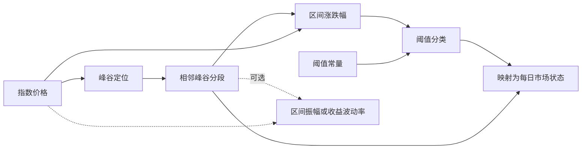

# 峰谷算子拆分与指标／情景构建统一分析

日期：2026-09-07。性质：设计分析；本轮未修改算法、页面或已保存方案，未运行产品回归测试。

## 结论

用户提出的职责拆分成立。历史情景识别可以建模为“具有枚举输出及时间可得性约束的时序计算”。指标中心和历史情景应共享计算节点、类型校验和构建方式；情景保留状态字典、色带、识别时点和发布等业务配置。

这项结论限定于历史情景识别。情景模拟、压力测试、模型训练和组合执行还有各自的输入、状态与制品合同，不能因为也使用计算图就全部改成一个普通指标接口。

目前的峰谷节点把定位、统计、分类和震荡合并混在一起，应拆开。简版模板只需按相邻峰谷涨跌幅分类，不应强制要求多个波段、低方向效率和最短震荡期同时成立。

## 一、当前代码实际情况

| 已核实的事实 | 对建议的影响 |
| --- | --- |
| `peak_trough_asymmetric_kernel` 一次返回峰谷、区间边界、区间收益、连接线和牛熊状态 | 定位阶段已提前承担统计与分类职责 |
| `model.peak_trough` 接着调用 `peak_trough_sideways_kernel`，重写状态并输出合并证据 | 用户在一个节点里同时配置定位与市场分类，难以替换其中一步 |
| 当前震荡算法要求至少两个完整波段，并结合波段涨跌幅、整段振幅、方向效率、长度和峰谷方向结构 | “单个相邻峰谷差异很小”并不保证被标为震荡，确实不同于用户期望 |
| 指标与情景都调用公共前端 `GraphCanvas` | 不需要再造画布；可统一外围资源库、检查器和编辑流程 |
| 指标的 `graph/resolve` 将公式／画布送入同一 typed DSL 推断，返回规范公式、图和节点类型 | 已有双向转换基础，可用于三种构建模式一致性设计 |
| 情景的 `feature.formula` 已复用指标 typed AST→DAG→NJIT，但使用较小的因果算子白名单 | 已有引擎共享基础，但不等于所有节点可以双向使用 |
| 情景公式节点目前最多四个数值输入、一个数值输出 | 不能直接表示整个多输出峰谷与市场状态流程 |
| 情景有 `source.indicator` 锁定指标修订，也有依赖时间轴的 `source.constant` 常量序列 | 不能把指标复用、常量支持说成完全缺失；问题是合同和编辑方式不统一 |
| 指标画布以变量／常量／算子为基础；情景使用另一套节点注册、端口与参数合同 | 同名数学计算仍可能分散注册和执行，需要逐项合并实现与元数据 |
| 指标 `ValueType` 目前支持 float64、bool；情景有独立 int64 状态编码、索引及状态概率类型 | 不能把状态编码直接当普通数值来获得完整枚举语义 |
| 指标画布输入引用只有 node_id；情景引用包含 node_id 和 port | 多输出算子要先统一端口引用，不能只复制指标画布适配器 |
| 情景页面目前只有引导配置和自由画板；公式是内部节点 | 尚无整套情景定义的高级公式编辑与往返转换 |
| 峰谷全样本可得性修正及部分解释输出仍按 `model.peak_trough` 节点名识别 | 拆节点必须一起改成依赖语义，不能只拆界面参数 |

依据：`backend/historical_regimes/peak_trough_numba.py:38`、`backend/historical_regimes/v2_service.py:2258`、`:2795`、`:2854`、`backend/historical_regimes/v2_registry.py:463`、`:528`、`:601`、`backend/historical_regimes/formula.py:1`、`backend/custom_indicators/graph_service.py:104`、`backend/custom_indicators/graph_contracts.py:19`、`backend/cal_indicators/typed_types.py:17`、`frontend/src/pages/HistoricalRegimeWorkbench.tsx:193`。

## 二、峰谷定位应该负责什么

建议保留一个有清晰数学职责的定位算子：输入价格及定位参数，输出拐点位置、类型、价格、有效性和可得性。它不输出牛熊震荡，也不因为下游震荡阈值变化而重选峰谷。

四个窗口仍独立：左／右窗口用于局部极值比较，首／尾窗口用于样本边界排除。它们都按输入观测条数解释，日频即交易观测，不是自然日。

需要区分两种定位能力：

- 基础局部峰谷：局部极值、平台处理、交替峰谷等明确规则。
- PS 峰谷筛选：最短阶段、最短完整周期、首尾优势检查及大幅波动例外。可作为可选筛选步骤或可展开的 PS 组合模板。

这里对“峰谷法只找极值”需补充一个文献边界：PS 原算法本身就包含持续长度与大幅涨跌例外，不能把它描述成完全不涉及幅度的局部极值算法。但这些定位筛选规则不应承担本项目新增的震荡分类。[Pagan 与 Sossounov 原文，第 2 节及附录 B](https://onlinelibrary.wiley.com/doi/full/10.1002/jae.664)

通用峰值检测也把距离、突出度、宽度等作为峰的筛选或属性，与市场标签分开。这支持职责拆分，但不是要求生产计算直接调用 SciPy；本项目仍使用固定签名 NJIT。[SciPy find_peaks 官方文档](https://docs.scipy.org/doc/scipy/reference/generated/scipy.signal.find_peaks.html)

不必把峰谷定位内部的每一次比较、递推或去重都暴露成节点。用户可独立理解、替换和复用的数学操作才适合作为公共算子。

## 三、推荐的最小计算链

相邻峰谷 p_i、p_(i+1) 定义一个完整波段：

- 区间涨跌幅：R_i = P[p_(i+1)] / P[p_i] − 1。
- 区间振幅：A_i = max(P[p_i:p_(i+1)+1]) / min(P[p_i:p_(i+1)+1]) − 1。
- 区间收益波动率：上述区间内逐期收益率的标准差；应明确简单／对数收益、ddof、最少样本数与是否年化，不能对价格水平直接求标准差冒充收益波动率。
- 区间长度：p_(i+1) − p_i，表示收益观测的数量。

这些是独立输出，可以单独用于指标中心或接到市场分类中。初版模板只连接涨跌幅，其他统计不默认参与分类。

设上涨门槛 u>0、下跌门槛 d>0：

| 条件 | 状态 |
| --- | --- |
| R_i > u | 牛市 |
| R_i < −d | 熊市 |
| −d ≤ R_i ≤ u | 震荡 |
| 未形成完整区间，或计算依据缺失 | 未分类 |

对称门槛时 u=d=θ。例如 θ=3%，100→102 为震荡、100→110 为牛市、100→90 为熊市。3%只是规则示例，不能称为通用或最优行业参数。

所有状态在完整区间 `[p_i,p_(i+1))` 展开到每日，统计包含右端点价格。转折点归下一段，避免同一天两种标签；尾部没有下一拐点时保留未分类。

这是一套“给定峰谷粒度和幅度门槛的市场分段定义”。例如日频 8 根窗口得到的短波段，不会因为标签叫牛市就自动成为宏观长期牛市；结果需同时显示定位粒度和分类门槛。

## 四、净差小、振幅小、收益波动小不能混成同一个量

“首尾差小判震荡”可以作为明确的简版定义，但只说明这一段净方向弱。若较粗筛选或合并后的区间包含 100→70→101，首尾涨幅只有 1%，中途仍有大跌大涨，不能称为低风险或窄幅横盘。

该例不是声称基础局部峰谷会把这三个点自动合成一段；它说明经过峰谷剔除、粗粒度筛选或区间合并后，端点并不必然概括整个价格路径。

后续可提供独立的严格模板：净变化小且振幅小 → 窄幅震荡；净变化小但振幅大 → 宽幅震荡。如果只保留牛／熊／震荡三类，宽窄程度放在附加数值或风险标记中，不强行冒充方向标签。

还要分清三个不同操作：

1. 一个小幅完整波段改为震荡：分类规则。
2. 相邻同标签区间合成一段展示：展示压缩，不改变每日状态。
3. 将“牛—短熊—牛”改成连续牛市：会改写标签的去噪算法，应独立且默认关闭。

若第 3 类算法重新定义了区间，应基于新边界重新计算统计，保留原始与处理后边界及规则证据，不能沿用原区间统计。

## 五、共享计算逻辑的实际边界

建议“一个公共计算内核体系，两个业务入口”。无需新增独立服务或整套替换正在工作的执行器。

| 公共层 | 应覆盖的内容 |
| --- | --- |
| 资源目录 | 变量、常量、参数、数学算子、已保存指标／组合计算；按输入合同和实时能力过滤 |
| 算子合同 | 唯一标识与版本、输入／输出端口、参数类型、单位、命名轴、缺失策略、时间依赖、NJIT 内核 |
| 计算定义 | 规范化有类型图；引用锁定版本，多输出端口、共享子图和布局独立保存 |
| 解析与执行 | 同一公式白名单与类型推断，显式准备及预热，执行时禁止新签名和 Python 回退 |
| 结果合同 | 数值、布尔、索引、峰谷／区间引用、枚举序列，以及缺失、可得性和来源 |

“两边都能使用”应理解为满足相同输入合同就可复用，不是把所有节点无条件显示为可用。例如组合权重指标需要组合上下文，区间波动率需要完整区间；标量指标若要变成时序，需显式滚动或逐历史时点计算，不能把期末统计广播到历史。

已保存指标是可复用的组合计算，不应每保存一个业务公式就新增一种基础算子。沿用指标中心锁定修订再展开的已有机制；跨模块复用必须保留源版本、输入绑定和时间依赖，不能因为包装成“指标”而失去事后属性。

峰谷／区间合同可在接口上是有类型的多输出结构，在数值执行中保持固定 dtype 连续数组，避免引入 Python 对象循环。首版可沿用 T 长度索引与有效性数组，不必立刻扩张整个引擎支持任意变长区间轴。

状态枚举需要稳定 code→id→名称／颜色映射，并单独保留缺失掩码。“未分类”不是震荡。不能把 0/1/2 状态代码自动送入均值、插值或标准化；如需状态占比，先显式转换为布尔掩码再计算。

参数还应区分编译期常量和运行期数值序列。窗口节点可以被常量节点绑定；不能仅因都画成连线就允许时变窗口，固定窗口的现有约束仍需保留。

## 六、三种构建模式可以统一，但不是复制整个指标页面

共同工作区使用同一份规范计算定义：

- 画布：变量、常量、算子、复用指标和输出连线。
- 构建向导：按依赖展示同一份图，可选上游、算子、阈值；复杂共享子图可展开查看，不丢弃无法用简单表单表达的部分。
- 高级公式：可编辑的受限源码，具备多输出和共享子表达式的表达方案；与画布、向导无损互转。展示用 LaTeX 不得取代可执行源码。

情景入口额外提供状态字典、识别模式、色带、区间说明、确认／可得时点与版本发布。指标入口按输出类型显示数值线、掩码或状态色带。两边可以复用构建工作区，外层结果与业务动作按合同保留。

指标中心现在的图→嵌套公式转换有长度和深度限制，且图节点输入尚无输出端口字段。因此整图高级公式不是加一个 textarea 就完成：必须解决多端口引用、共享子图、版本锁定、枚举和值类型的往返表达。

不建议为了共享而把整套情景塞进单个“公式特征”节点：那仍会隐藏峰谷、区间统计和状态判断之间的关系。

## 七、实时模式必须沿完整依赖链禁用事后计算

当前峰谷法使用右侧数据和全样本筛选，仍属于事后研究。缩短右窗口或尾窗口不等于变成实时算法。

拆分后应将时间依赖从节点名称判断提升为公共合同：数据何时发生、何时可得、算子是否读取后续样本、输出是否回写历史，以及训练／参数估计使用了哪些数据。

在实时模式下，事后节点、事后复用指标，以及依赖其输出的整图必须在目录、解析／校验和后端执行阶段被阻止。纯数值统计接在事后区间后面，输出仍是事后结果。

尤其不能拆除旧 `model.peak_trough` 后，遗漏原来按这个名字附加的全样本可得性修正。识别日期、确认日期与生效日期不能因图改名或包装而变化。

通用归约算子也应结合使用方式判断：在某个 as-of 日计算截至当天的均值没有问题；把最终全样本均值用于早期每天的分类则使用了未来信息。只标注一个“mean 是否实时”的静态布尔值不足以覆盖所有场景。

未来如另做在线峰谷确认，应定义独立算子：在确认日产生新事件，历史结果保持不改写。它不能把等待确认后的峰谷日期回填成当时已经可交易的信号。

## 八、建议落地顺序与验收

1. 先定义峰谷输出、区间引用、枚举状态与时间可得性合同；使节点拆分不依赖旧节点名的特殊处理。
2. 拆出峰谷定位、区间涨跌幅、可选振幅／波动率、阈值分类、每日映射。用这些节点重建简版日频模板，停止默认绑定复杂震荡合并。
3. 在公共注册表逐项复用现有数学内核；情景与指标通过适配器接入，保留旧版定义的执行路径，不改写已发布结果。
4. 共用资源目录及编辑组件，扩展三种编辑方式的无损转换；新模板采用新合同，旧方案显式另存升级。

验收应覆盖：

- 改分类阈值不改变峰谷位置；同一定位输出能接不同统计和分类规则。
- 单个小幅波段就能按简版门槛标为震荡；阈值等号、空样本、NaN/Inf、非正价格与未完成尾段有明确结果。
- 区间收益、振幅、波动率分别与受控参考实现一致；邻段不重叠、不跨缺失区间。
- 同一计算图在指标和情景上下文绑定相同数据后得到相同数值；枚举及辅助输出元数据一致。
- 三种构建方式往返后计算指纹、版本、参数、端口和结果保持一致，布局变化不影响结果。
- 事后属性穿透复用指标及多层子图；移除旧节点名称后，实时门禁仍完整有效。
- 所有新增数值路径进入已准备、预热且禁止新增签名的 NJIT 内核；性能融合可以发生在执行计划中，作者看到的节点职责仍保持独立。

本轮证据范围为当前工作区源码、已有测试内容与上述原始资料；没有把静态阅读当作新实现已经完成或回归已经通过。
