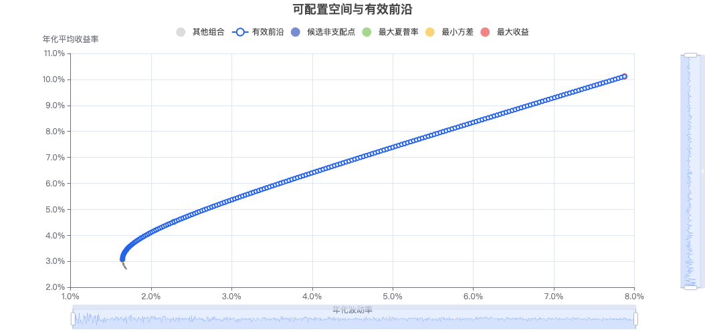
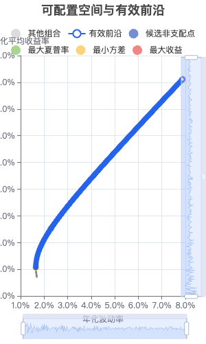
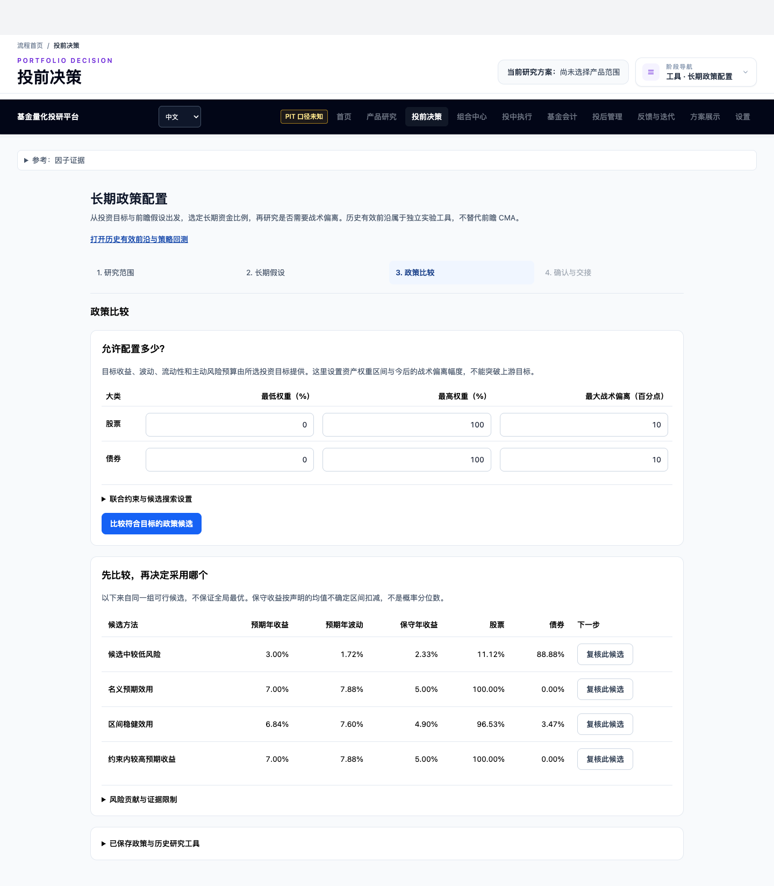
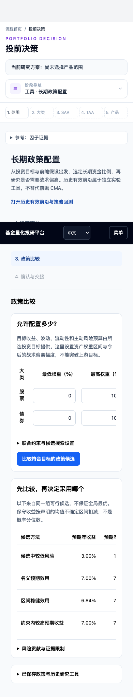

# SAA / TAA 开发分支提交记录

日期：2026-09-13。来源 `codex/saa-taa-frontier-grid`，目标 `Dev`。
基线：`c7e85397de53e286955c02e7401998192ad22ea2`。最终提交 SHA 和实际 PR 编号以 PR 绑定记录为准。

## 本次范围

- 大类分类纠正、投资目标与 CMA、前瞻长期政策、TAA 主动风险门禁和训练/留出分段验证。
- 恢复整条有效前沿按收益目标求解：默认 20 点、可选 200 点；单点预算默认 300 次，分别传参和保存。实际算法为固定签名 NJIT 主动集 QP / BFGS-SQP，非 SciPy SLSQP。
- 网格、随机散点和三个代表点局部精炼各自保留独立语义；最终候选共同重建 Pareto 前沿和代表点。失败状态保留，连续网格与取整散点需显式确认。
- 新分支从最新 Dev 创建，仅迁移任务差异。Dev 尚未合入原工作区依赖的前端设计 PR，因此只补充新页面实际使用的 Button 和 accent 调色板，并在该组合上重新验证；没有带入其它设计与指标修改。
- 五轮原始审核报告的内容与结论保留；提交副本仅规范化行尾空白和文件末尾空行，原工作区证据不改。早期设计/整改文档中的“未提交”“路由待纳入”等是当时快照；本记录说明之后的提交准备状态。

## 本次明确接受的 P2

用户指示“忽略这个p2”仅对应[第五轮复核](../../saa-taa-recheck-round5-2026-09-13.md)发现的奇异协方差问题：当两个资产暴露完全重复时，QP 端点可能耗尽迭代预算，使目标网格返回 `range_unresolved`，没有成功曲线点。

该问题仍未修复，也不等于约束不可行。本次按用户明确决定接受该风险；没有删除原始证据、放宽数值测试或将问题标记为已关闭。其它缺陷和合并流程不在豁免范围内。

## 当前 Dev 组合的验证

全部测试针对本分支工作树执行，测试后业务源码未改；最终 HEAD 与文件哈希由 PR 独立审核绑定。

| 检查 | 结果 |
| --- | --- |
| 18 个相关后端文件 | 392 passed，19 条既有警告 |
| 前端全量 Vitest | 124 文件，918 passed |
| Chrome 桌面 1440 / 手机 390 | 6 passed，真实隔离 API 和真实内核 |
| TypeScript | 退出码 0 |
| Vite production build | 退出码 0，保留大 bundle 提示 |
| i18n 目录校验 | valid=true，退出码 0 |
| 独立 QP 对照 | 60 / 60 正定问题与测试专用 SciPy SLSQP 一致，最大目标差 4.61e-13 |

后端为相关范围回归，没有重跑全仓后端。Dev 基线没有 `design:check` 脚本，因此不沿用另一未合并分支的设计检查结果；本组合已执行真实交互和响应式浏览器验证。手机历史图表的收益轴留白不足沿用既有布局，数值表仍可查看，此局限未作为本次已修复项。

后端命令（Python 3.12；运行前把 `CUSTOM_INDICATOR_DATA_DIR`、`HISTORICAL_REGIME_DATA_DIR`、`TACTICAL_ALLOCATION_DATA_DIR`、`STRATEGIC_ALLOCATION_DATA_DIR`、`TIMING_RESEARCH_DATA_DIR` 指向独立临时目录）：

```bash
PYTHONPATH=.:backend python3.12 -m pytest \
  backend/tests/test_analytics_routes.py \
  backend/tests/test_auto_asset_class.py \
  backend/tests/test_backtest_output.py \
  backend/tests/test_frontier_grid.py \
  backend/tests/test_historical_regime_taa.py \
  backend/tests/test_optimizer_strategy_numba.py \
  backend/tests/test_portfolio_research.py \
  backend/tests/test_rebalance_window.py \
  backend/tests/test_research_input_checks.py \
  backend/tests/test_strategic_allocation.py \
  backend/tests/test_strategy_api.py \
  backend/tests/test_strategy_research_dates.py \
  backend/tests/test_tactical_allocation_bridge.py \
  backend/tests/test_tactical_allocation_data.py \
  backend/tests/test_tactical_allocation_numeric.py \
  backend/tests/test_tactical_allocation_service.py \
  backend/tests/test_tactical_walk_forward.py \
  backend/tests/test_window_slice.py -q
npm run test --prefix frontend -- --run
(cd frontend && npx tsc --noEmit)
npm run build --prefix frontend
npm run i18n:check --prefix frontend
npm run test:e2e --prefix frontend -- --config=playwright.strategic.config.ts
```

浏览器配置启动自己的隔离测试 API，不复用生产服务。源码未写入正式研究数据、活跃快照或投资组合。新文件的 AI Hermes 长期路由在本次纳入 Git 时同步登记：全部 75 个改动文件已覆盖，结构校验及 R87 / R86 / R30 / R60 路由展开均通过；记录见 PR。新隔离目录没有 CodeGraph 索引；调用链先借助原工作区已同步的 CodeGraph 定位，再以本次实际文件与测试为准。

## 浏览器截图

| 桌面 | 手机 |
| --- | --- |
|  |  |
|  |  |

## 合并流程状态

提交准备时已核实远端 Dev 使用 PR-only ruleset，但尚未部署当前提交规范要求的 `branch-policy`、可信 `ai-review` 和 `quality-gate` 三项检查。门禁建设仍在独立草稿 [PR #11](https://github.com/KevinCJM/FundInvestmentResearchPlatform/pull/11)，其测试成功不等于上述门禁已成功运行。

因此本任务先提交、推送并创建 Draft PR；本地独立 AI 审核会绑定实际 PR / HEAD / base，但不能自行发布可信 `ai-review=success`。在三个真实检查满足当前项目提交规范之前不能执行合并。该阻塞与上文接受的 P2 分开记录。

回滚遵守 Git 流程：若将来合入，通过新开发分支中的 `git revert` 和 PR 撤销本任务提交；不提供源码副本或直接重置 Dev。正式研究成果、数据快照与代码回滚分开处理。
