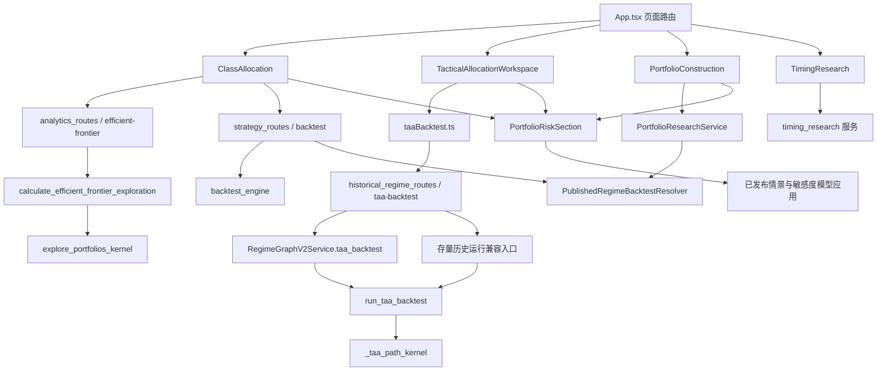
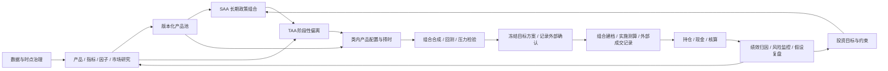

# 战术资产配置：项目现状与产品方案

分析日期：2026-09-10。依据当前工作区（含既有未提交改动）、AGENTS.md、Hermes 路由、更新后的 CodeGraph、现行源码与权威资料。本文是产品建议，未实施业务代码。

**结论：应建设一个以 SAA 为基准、把市场证据转成有期限的配置决策的工作台。现有 TAA 已有研究回测能力，缺少完整的决策与下游应用流程。**

## 1. 图谱与当前代码链路

已执行 `codegraph sync .`，最终 `codegraph status` 显示：885 个文件、18,174 个节点、61,798 条边，索引已更新。图谱存于本项目 `.codegraph/`。MCP 服务仍提示自动监听关闭，因此用 CLI 显式同步，并直接核对关键入口；图谱边只作为导航，不能证明业务或生产运行成功。

这是从知识图谱抽取并经源码核对的主要链路，不是全量符号图。前后端仍是 React + FastAPI 模块化单体；持久化研究定义、快照与计算服务分层，数值计算受固定签名 NJIT、预热和零拷贝契约约束。

| 核对位置 | 当前事实及含义 |
| --- | --- |
| `frontend/src/App.tsx:89` | 投前已有目标、产品池、SAA、TAA、产品配置、合成、验证和确认入口；多个入口仍渲染原型。 |
| `frontend/src/pages/TacticalAllocationWorkspace.tsx:200` | TAA 请求由手填基础权重、状态偏移和收益数据组成；预填收益明确为合成样例。 |
| `backend/services/historical_regime_routes.py:512` | 真实 TAA API 按运行版本分发；v2 与存量入口最终委托同一个 TAA 数值实现。 |
| `backend/historical_regimes/v2_service.py:4868` | v2 要求不可变、实时、因果、不重绘、快照校验正确，且已经通过正式发布检查。 |
| `backend/historical_regimes/taa.py:750` | 使用期间开始时已生效的状态概率；校验资产完整性，处理信号过期、低置信度回归 SAA、权重限制、换手与成本。输出权重、净值、统计和输入哈希。 |
| `backend/optimizer.py:891` | SAA 的前沿来自受约束候选组合探索；不能把它称为严格解析最优前沿，也不能直接当作短期收益预测模型。 |
| `frontend/src/pages/ClassAllocation.tsx:133` | 向产品组合导入产品列表时使用等权模式与零初始权重，未传递选定 SAA 策略的目标权重与完整分类版本。 |
| `backend/custom_indicators/portfolio_service.py:495` | 产品组合研究拒绝非零交易成本；不能直接与 TAA 的含成本收益做优劣比较。 |
| `frontend/src/components/risk-models/PublishedRiskPanel.tsx:94` | 已能选取保存的产品组合，使用相同情景、敏感度、本金和持有政策比较；不会自动把 TAA 大类标签变成产品持仓。 |
| `frontend/src/pages/TimingResearch.tsx:162` | 产品择时可以保存研究版本并绑定投前；绑定本身不会改变组合权重。 |

## 2. 投研全流程体系

图中表示目标业务流程，不能解读为全部已经接通。产品研究是持续能力，不是每次配置都重新开始的第一步。

| 层次 | 核心产出 | 当前判断 |
| --- | --- | --- |
| 数据基础 | 标准化行情、净值、宏观数据、可得时点与快照 | 有数据源、ETL、PIT 等实现；本次未检查真实数据覆盖及发布状态。 |
| 公共研究 | 指标、因子证据、历史状态、风险模型、产品评价与产品池 | 存在实际服务和版本机制；历史复盘、实时识别、未来压力假设具有不同用途。 |
| 投前决策 | 投资约束、SAA、TAA、类内配置、验证后的目标方案 | SAA 与组合研究已有计算链路；TAA 部分实现；跨层权重和版本传递不完整。 |
| 投中与核算 | 真实组合主档、实施测算、成交和资金事实、核算数据 | 以交互原型及局部计算为主；平台没有交易下单能力。 |
| 投后与反馈 | 实际绩效、归因、偏离监控、模型复盘 | 研究组合诊断已有实现；实际组合的完整闭环主要仍为原型。 |

## 3. 上网调研：三个概念怎样区分

自上而下是**决策顺序**：从投资者目标、约束和整体市场预期，逐层决定资产类别及风险敞口，最后选择具体产品。SAA 和 TAA 是这个流程中不同性质的配置决策。[CFA：组合规划](https://www.cfainstitute.org/insights/professional-learning/refresher-readings/2026/basics-of-portfolio-planning-and-construction)、[CFA：资产配置原则](https://www.cfainstitute.org/insights/professional-learning/refresher-readings/2026/principles-asset-allocation)

| 概念 | 回答的问题 | 输出 |
| --- | --- | --- |
| 战略资产配置 SAA | 为实现长期目标，整体应该承担什么风险、怎样分配资金？ | 长期目标权重、允许区间、风险预算、基准和再平衡政策。 |
| 战术资产配置 TAA | 相对长期基准，当前是否值得阶段性超配或低配？ | 有证据、有幅度限制、有生效与退出条件的主动偏离。 |
| 类内产品配置 | 某一大类的预算，交给哪些 ETF 或基金实施？ | 产品权重、替代品与类内择时规则。 |

SAA 也要定期复核；TAA 也可以是低频策略。区别在于是否基于阶段性判断主动偏离政策组合，而非是否“每月调仓”。价格上涨导致股票权重偏高，再平衡回原目标，属于维护 SAA。TAA 可以来自研究员观点，也可以来自量化信号。[CFA：现实约束与 TAA](https://www.cfainstitute.org/insights/professional-learning/refresher-readings/2026/asset-allocation-with-real-world-constraints)

示意：长期股票 40%、债券 50%、现金 10%；某阶段目标改成 45%、45%、10%，其中股票 +5 个百分点和债券 -5 个百分点是 TAA。随后选择具体股票 ETF 属于产品配置。这里的数字仅解释层次，没有表达当前市场判断。

研究启示：宏观状态只是形成收益与风险预期的输入，不能直接推出买卖幅度；经济数据还存在公布延迟、历史修订和预测不确定性。[CFA：资本市场预期](https://www.cfainstitute.org/insights/professional-learning/refresher-readings/2026/capital-market-expectations-part-i)

TAA 应在扣除成本后与 SAA 对照。Vanguard 的研究强调择时需要同时判断方向、进出时点、规模与成本，不能预设主动调整一定增益。[Vanguard：战略配置研究](https://corporate.vanguard.com/content/corporatesite/us/en/corp/articles/strategic-asset-allocation.html/)

## 4. 本项目应怎样实现 TAA

**页面承担配置决策；公共研究中心承担信号与模型生产。** 投资责任人进入页面，应能读懂“为什么调、调多少、风险怎样、何时恢复”，再决定是否采用。

建议主流程：选择 SAA 版本 → 查看截至某日的市场证据 → 形成资产观点 → 生成候选方案 → 比较风险与样本外表现 → 保存并传入产品配置。

### 页面六个功能区

| 功能区 | 用户看到或操作什么 | 与现有功能联动 |
| --- | --- | --- |
| 基准与约束 | 选择研究对象和 SAA 版本；显示资产类别、目标、区间、风险预算、币种、日期和可投资域。 | 投资目标、SAA、大类构建、产品池。 |
| 市场判断 | 增长、通胀、流动性、估值、趋势和波动的证据摘要；展示模型分歧、数据截至日和有效期。 | 历史情景、研究序列、指标、因子研究。 |
| 资产观点 | 每类“超配 / 中性 / 低配”、依据、期限、信心和失效条件；支持采纳规则或人工调整并留理由。 | 引用既有研究版本；历史状态标签不自动成为资产观点。 |
| 配置方案 | 显示“SAA 权重 / 当前权重 / 本次目标 / 相对 SAA 偏离 / 本次调仓差额”；比较维持 SAA、规则方案及人工方案。 | 统一约束求解、大类预算、真实或研究持仓快照。 |
| 验证与解释 | 对比净收益、超额、回撤、主动风险、换手、成本、样本外结果和压力损失；能查看失败原因。 | TAA 回测、统一指标、已发布风险模型与情景。 |
| 保存与跟踪 | 保存策略及决策版本，设置复核与恢复规则；传入类内配置；后续解释偏离贡献和失效原因。 | 产品配置、组合诊断、内部方案库、投后反馈。 |

首屏以配置表和决策摘要为主。研究证据和验证结果通过页签查看，公式、图谱、参数细节与数据哈希按需展开。当前 JSON/CSV 输入改为高级导入方式。

空状态要明确下一步：未选择 SAA 就链接 SAA；缺少合格实时信号就显示缺失依据；无可行权重就列出冲突约束；未形成产品快照就不能展示产品级压测结果。始终保留“不做战术偏离”这一可比较方案。

### 从证据到权重，补上目前缺失的一层

第一版采用可解释规则：复用实时历史状态与趋势/风险指标，按已经验证的映射形成偏离候选，再用风险和成本约束确定幅度。保留人工观点输入，记录来源与覆盖原因。不要按“复苏”“牛市”等名称写死买入方向。

现有内核可以表达：`目标大类权重 = SAA 权重 + 各状态概率加权的偏离`。新能力主要是让偏离映射有研究依据、能自动生成候选，并能贯穿版本、验证和下游应用。

如果使用历史统计学习偏离，样本必须是“当时可识别状态 → 此后可投资期间的收益”。在每个训练窗口内估计映射、参数和归一化，再冻结用于后续样本外；不能用全历史条件收益生成偏离，再回测同一历史。展示状态概率与观点信心的不同含义，不能把分类置信度称为盈利概率。

状态、估值、动量等信号冲突时，按预定规则融合或减小偏离；重复来源不能被当成多份独立证据。进一步加入 Black–Litterman 时，它负责将先验与观点转成预期参数，约束求解器另行决定权重。第一版不依赖黑箱模型或大规模参数寻优。

约束至少包括：资金权重合计 100%、各类上下限、相对 SAA 最大偏离、现金下限、主动风险预算及换手预算。不可行时解释原因，不静默删除资产或擅自放宽限制。信号过期、判断反转和低置信度分别按事先保存的恢复政策处理。

### 连通的是业务对象，不只是页面链接

| 对象 | 必须保存的关键内容 |
| --- | --- |
| SAA 政策版本 | 类别 ID 与定义版本、代理资产、政策权重、区间、风险预算、基准、收益口径、币种和生效日期。 |
| TAA 策略定义 | 引用 SAA；信号/观点版本、映射、约束、调仓频率、阈值、成本、失效及恢复政策。 |
| 本次配置决策 | 研究截至日、当时可得数据与模型、原始证据、观点、候选、选定权重、理由和有效期。 |
| 验证运行 | 冻结输入、训练/样本外区间、费用与成交假设、逐期权重、净值、指标和失败记录。 |
| 下游目标方案 | TAA 决策引用、产品池与分类映射版本、类内权重、合成权重及内部确认记录。 |

冻结一个历史运行只能复现那次研究。持续跟踪必须用固定策略版本，对新的截至日重新生成决策快照；不得把旧运行的最后一行一直当作最新市场状态。

对互斥大类，产品最终权重等于“大类 TAA 权重 × 类内产品权重”；如股票预算 45%，其中某 ETF 占 60%，组合内该 ETF 为 27%。同类各产品必须重新汇总到 45%。混合基金如需穿透多个类别，应另有带时点的暴露映射，不能重复计权或把未知暴露当作零。

产品择时卖出后留下的现金会影响总资产暴露：须定义类内替代工具或重新送回 TAA 检查，不能让产品层悄悄改变已批准的大类预算。第一版可以只接产品选择和类内权重，择时动态叠加在形成统一执行语义后再接入。

## 5. 实施优先级与验收

| 顺序 | 交付物 | 完成标准 |
| --- | --- | --- |
| P0：接通最短闭环 | SAA 版本导入、真实版本化收益、观点/规则到偏离、候选比较、TAA 保存、产品权重合成。 | 用户不用手填 JSON/收益 CSV，就能从 SAA 形成可复现决策并进入产品组合；大类预算守恒。 |
| P0：统一验证口径 | 复用现有 TAA 核心，补足组合层费用和可执行时点，保存不可变权重路径。 | SAA 与 TAA 使用可比较的资产、样本、币种与费用口径；产品研究毛收益不能冒充落地净收益。 |
| P1：完善证据与复核 | 多信号候选、滚动样本外、成本敏感性、产品级压测、到期与偏离复核。 | 能解释主动偏离是否增加了价值，记录无增益与失效方案；不只展示最优一次回测。 |
| P2：扩展模型与实际闭环 | 观点参数模型、更多可投资资产、真实组合监控与实施测算衔接。 | 有数据覆盖、样本外增量证据以及真实持仓/核算契约后再接；平台继续采用外部执行边界。 |

必要验收：零偏离时与 SAA 等价；收益窗口与信号可得时点不穿越；数据/状态缺失和样本不足可解释；成本对照公平；权重与归因勾稽；不同参数/版本使旧结果明确失效；历史结果不可覆盖。收益增加、回撤减少是待研究的效果，不能作为保证。

计算实现遵守 AGENTS.md：现有数学与序列能力复用统一注册表，规则链用可展开组合，只有不可分离状态保留耦合内核；固定签名 NJIT、完整预热、禁止 Python 回退，必要复制须有边界和实际内存证据。不得为 TAA 再造一套平行的基础指标与回测数学实现。

## 6. 本次验证范围

已运行 `backend/tests/test_historical_regime_taa.py`：**24 passed**，另有一条 Starlette 依赖弃用警告。测试覆盖现有概率偏移、时点、约束、成本、快照、NJIT 及兼容路由等；不证明本产品建议已经实现，不证明生产数据可用，也不等于全套 v2 发布或端到端验收。

首次测试在导入服务时尝试使用默认工作区，因数据锁文件权限失败；随后使用 `mktemp` 创建独立目录，并设置 `CUSTOM_INDICATOR_DATA_DIR` 与 `HISTORICAL_REGIME_DATA_DIR` 后测试通过。未为测试申请正式数据写入权限。

未修改业务代码、发布研究版本、下载数据或操作真实组合。已有工作区改动保持原样；本次新增本分析文档并更新 CodeGraph 本地索引。
