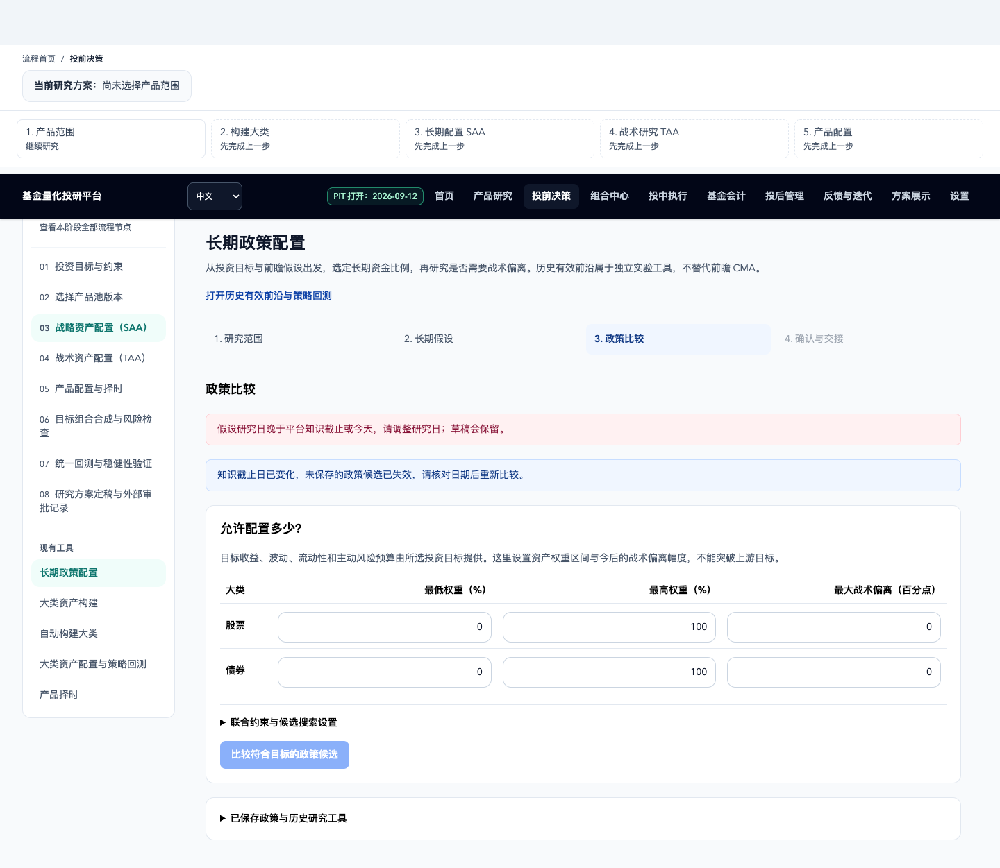
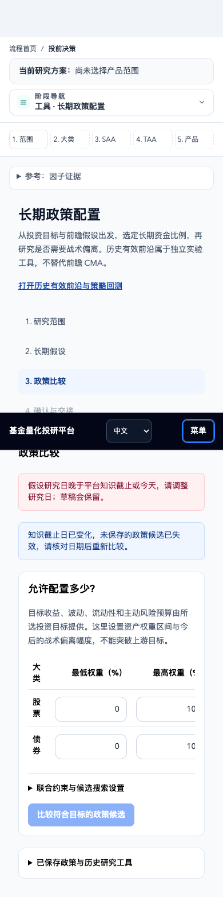

# 投资目标与边界：问题修复及再次审核

日期：2026-09-13。对应 [PR #14](https://github.com/KevinCJM/FundInvestmentResearchPlatform/pull/14)，开发分支 `codex/saa-taa-frontier-grid`，目标 `Dev`。

## 结论与范围

原审核的两个 P2 已修复，原始复现均通过。独立审核另做 96 组资金递推对照全部通过，尚未发现新增实质缺陷。最终 PR 增量组合的独立审核绑定记录将随 PR 更新。

提交基线为最新 `origin/Dev=f77f47d42e377e705485e6bb689e4784e8b46ba4`；先将它合并到原 PR 开发分支，组合提交为 `85b7315`，再移入本轮明确范围的改动。原工作区未切换分支，原始 [投资目标审核](investment-mandate-review-2026-09-13.md) 和前五轮 SAA/TAA 审核记录保留。

本轮提交同时纳入此前已实现、尚未进入 PR 的投资目标强化及前沿恢复：三种目标、资金计划、CMA 诊断、资产及组授权、历史版本、SAA 消费，以及同一前沿模块中的逐轮随机探索、单项/联合约束投影、权重量化、收益/风险选择、整条网格和局部精炼。独立提交目录保留远端已有修复及当前分支规范，没有用旧工作区覆盖最新 Dev。

## 1. 本金门槛的逆推与正向回灌不一致

**根因**：逆向现值排名与逐月正向递推在大金额边界出现浮点差异。原报告把 418/500 条路径记成成功，实际仅 417/500，Wilson 下界跌破 80%。

**修复**：逆推本金向上保留至分，再按同一随机路径回灌实际月度递推；共享唯一 `funding_payment_kernel`，由 `funding_capital_successes_kernel` 重新统计成功计数。未支付、终值、费用和资金流时点规则保持不变。有限向上修正仍失败时显式报错，不把未验证值输出为达标。版本升级为 `mandate-funding-monthly-lognormal/1.2.0`。

原始复现现在为：

| 项目 | 修复后 |
| --- | --- |
| 界面可回填本金 | 2,181,143,227.88 |
| 报告及同路径回灌成功率 | 均为 83.6%（418/500） |
| 报告及回灌 Wilson 下界 | 均为 0.8010053635257086，达到 80% |

正式测试增加 12 组金额/种子组合及早期欠付案例；另由独立审核用 NumPy 递推交叉检查 96 组期限、金额、门槛及入金折减组合。本金是经过回验、按分表示的保守测算，不把有限浮点修正冒称无限精度最小解。

## 2. 研究时钟变化后旧 SAA 候选仍可采用

**修复**：截止日变化时清除未保存的候选与待采用状态，并使未完成请求失效；已保存历史政策保持可读。采用函数、采用按钮和比较按钮都受日期校验。输入参数保留，用户可以核对日期后重算。

原始前端复现中 `/policies` 写请求从 1 次降为 **0 次**。正式测试覆盖未保存候选、迟到响应和已保存历史。真实浏览器额外覆盖 PIT 读取恢复为较早日期时，候选消失、比较按钮禁用、没有写入政策。

浏览器首次增加该案例时还发现比较按钮外观可点击但内部早退；已补齐禁用状态。手机案例改为先打开真实菜单中的 PIT 控件，无强制点击或注入组件状态。

## 3. 最终组合测试

所有以下正式回归都在提交工作目录执行；使用临时研究目录及离线夹具，未修改正式资金计划、研究成果或数据快照。

| 验证 | 结果 |
| --- | --- |
| 后端核心相关范围（20 文件） | **481 passed**，19 条警告 |
| 补充后端（历史阶段/TAA、组合研究、输入边界，3 文件） | **39 passed**，合计相关后端 **520 passed** |
| 全前端 Vitest | **126 文件，957 passed** |
| Chrome 桌面/手机，真实隔离 API + NJIT | **10 passed**；包括 20/200 网格、离散空间、资金诊断、SAA 采用和截止日失效 |
| TAA 原流程浏览器回归 | **2 passed**，真实界面、模拟 API；与真实 API 证据分开 |
| 原审核两条原样复现 | **2/2 passed** |
| 独立 NumPy 资金递推对照 | **96/96 passed** |
| TypeScript、生产构建、设计检查、i18n | 全部通过；保留既有 bundle/目录提示，未放宽预算 |
| AI Hermes | 路由结构通过；R03/R87/R86/R30/R60 展开通过；新文件随提交登记，不跳过 Git 可复现性检查 |
| CodeGraph | 原工作区已同步；提交目录无索引，结合实际源码及哈希复核 |

后端属于相关范围回归，不宣称本轮重跑了全部后端。旧验收的 3492/948 数量与 1.1.0 用时是历史证据，未用来代替本轮结果。现有 Starlette/Pydantic、日期解析、React act、浏览器目录和 bundle 提示不作为新增功能通过证据。

日志位于提交工作目录 `.pytest_cache/mandate-fix-20260913/`：`continuation-backend-full.xml`、`additional-backend-full.xml`、`frontend-full-final.log`、`browser-strategic-final.log`、`browser-taa.log`、`typescript-final.log`、`build-final.log`、`design-final.log`、`i18n.log`。原样复现日志位于原工作区同名目录；被测业务文件与提交目录一致，提交目录另运行仓库正式回归。

### 数值与内存

1.2.0，120 月、2000 路径、7 次内核调用，中位 **6.73 ms/候选**。9 个固定签名内核均预热，`python_fallback=0`、`request_time_compilation=0`，无签名增长。跨步只读随机数/现金流输入实际共享内存，NRT 存活 allocation / meminfo 差均为 0。进程峰值 RSS 417,103,872 字节，包含导入、预热与探针数组，不是请求新增内存；用时不含 I/O 和序列化，不作为跨机器性能保证。必要输出及工作缓冲仍分配。

### 截图检查

已查看桌面、手机的失效状态和手机资金诊断截图；错误原因、保留输入、禁用按钮及横向表格可见。自动化另覆盖 320/390/768/1440 宽度、局部表格滚动、canvas、对比度和响应降级。截图显示合成夹具，不是投资成果。

| 桌面失效状态 | 手机失效状态 |
| --- | --- |
|  |  |

## 4. 保留的边界

- 用户此前明确接受的第五轮奇异协方差 QP 端点 P2 仍未修复；不能把 `range_unresolved` 当成不可行证明。本次关闭的是投资目标审核的两个 P2。
- 目标诊断是声明 CMA 下的月度对数正态研究；Wilson 区间只描述有限模拟误差。不是收益保证、正式 PIT 认证或任意 TAA 路径的成功概率。
- 修复原始报告不改。此次只提交开发分支并更新 PR，不执行 Dev 合并。

详细设计见 [投资目标设计](docs/research/investment-mandate-research-design-2026-09-13.md)、[前沿恢复设计](docs/research/frontier-restoration-design-2026-09-13.md)。
