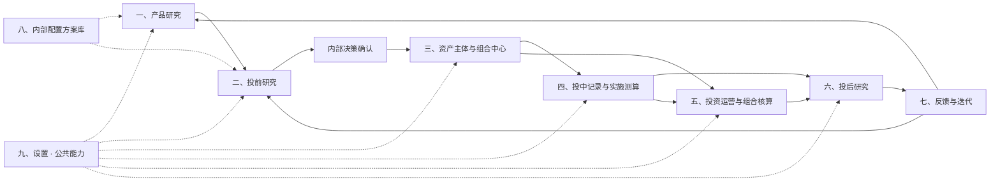
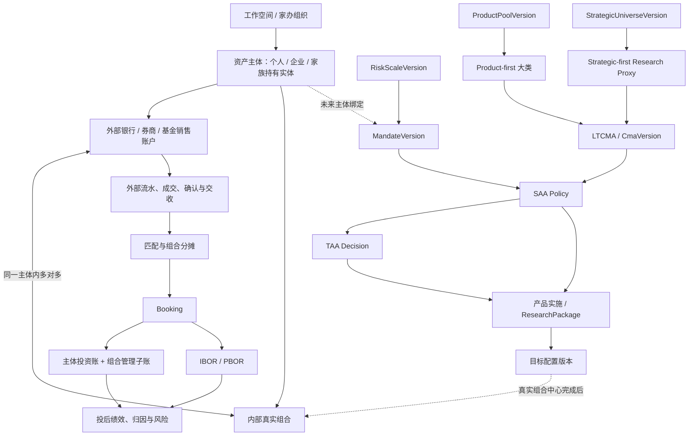
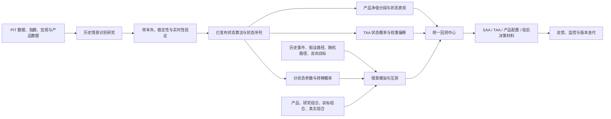

# 资产配置投研与财富管理平台发展规划纲要

本文作为 BetterSaaTaa 的中长期发展规划纲要，面向**单一家族办公室（SFO）、集合家族办公室（MFO）、企业理财／Treasury、企业长期资管和个人资产配置**等资产所有者场景。当前以公募基金和 ETF 为主要实施产品，逐步扩展到股票、债券、现金工具、私募／非标及其他资产。

规划目标不是把系统建设成基金销售、交易下单或法定会计 ERP，而是形成：**研究 → 决策 → 实施研究 → 真实组合 → 核算 → 投后 → 反馈**的一体化资产配置与财富管理研究平台。

## 平台定位

平台用于内部研究、记录、计算、比较和复盘，不是公募基金管理公司 FOF 系统，也不建设基金设立募集、持有人份额、管理费收费、法定基金会计、对外销售或交易下单。

### 目标对象

平台围绕“资产主体—外部账户—内部组合—交易与核算”组织数据，而不是围绕“管理人公司—对外基金产品—客户”组织数据。

### 当前产品范围

ETF、场外公募基金及其外部管理人、基金经理、托管人、费率和持仓披露属于产品研究对象，后续可以扩展到股票、债券、现金工具和其他资产。

### 当前代码状态口径（2026-09-20）

本文同时描述目标业务流程与当前代码事实，状态统一按四类理解：

- **已实现**：已有真实前后端调用链、数据／版本契约及对应测试，不是静态演示。
- **部分实现**：核心链路可运行，但本文描述的完整业务范围尚未闭环。
- **已预留／原型**：已有路由、原型页面、数据模型或契约位置，但尚未形成真实业务服务闭环。
- **尚未预留**：当前代码中没有对应独立路由、领域服务或明确数据契约；仅存在于目标设计。

当前最成熟的是**产品研究公共能力、数据／PIT／因子／风险／情景研究，以及投前的 RiskScale → Mandate → 双路径 LTCMA → SAA → TAA → 产品实施研究包**。组合中心、投中执行、基金会计、正式投后与反馈闭环目前仍以原型／数据模型预留为主。

## 发展定位与适用场景

当前已有的投研主链可以复用于不同资产所有者，但五类场景需要在共同底座上增加不同能力。

| 场景 | 当前可直接复用的能力 | 仍需重点建设 |
| --- | --- | --- |
| 单一家办 SFO | 产品研究、RiskScale、Mandate、LTCMA、SAA/TAA、情景压测、产品实施研究包 | 多实体／信托／受益所有权、家庭合并资产负债表、非标资产、Capital Call、Bill Pay、文档、税务、传承、慈善、家庭治理和外部顾问管理 |
| 集合家办 MFO | SFO 投研能力 + 可复用研究模板 | 多客户隔离、Household/Client 主档、RBAC、KYC/AML/适当性、CRM、客户门户、服务工单、费用计费、客户级报表、顾问权限和数据隔离 |
| 企业理财 / Treasury | Mandate 现金预算、风险等级、资产配置、现金类／固收产品研究、情景压测 | 滚动现金预测、Operating/Reserve/Strategic Cash 分层、银行账户管理、交易对手限额、期限梯队、流动性覆盖、债务/FX/套保、实际交收和对账 |
| 企业长期资管 | LTCMA、SAA/TAA、Multi-CMA、风险模型、情景压测 | 企业经济资产负债表、ALM/LDI、长期负债建模、投资委员会治理、外部管理人委托与监控、非流动资产、资本调用、Look-through、正式绩效归因 |
| 个人资产配置 | RiskScale、Mandate、现金需求、LTCMA、SAA/TAA、产品实施 | Household Balance Sheet、Human Capital、多目标优先级、退休／教育／购房规划、税后收益、保险、养老金、遗产／受益人、集中持股和生命周期规划 |

### 共用底座优先级

五类场景的最大公约数不是继续增加更多 SAA 算法，而是优先补齐：

1. **Asset Owner / Household / Entity Center**：主体、家庭、企业、信托／持有实体及所有权关系。
2. **Account & Position Aggregation**：跨银行、券商、基金销售等账户的现金、持仓、流水和核对。
3. **Cashflow & Liability Planning Engine**：滚动现金预测、未来负债、目标优先级和资金分层。
4. **Tax / Estate / Legal / Insurance Governance Layer**：先做证据、规则、人工复核和版本记录，不直接自动给法律／税务结论。
5. **IBOR / PBOR + Performance / Attribution**：把真实资产事实转成正式投后输入。
6. **RBAC / Approval / Client-Service Governance**：多主体、多客户、多角色的权限、审批、审计和服务流程。

### 场景边界

- 企业长期资管指**企业管理自有长期资金**；如果未来扩展到“资管机构对外管理客户资金”，将额外需要客户份额登记、申赎、费用计提、产品法律结构、合规、监管报送和 OMS 等另一套体系，不纳入当前主路线。
- 平台可以保存人工税务／法律／适当性复核结论，但当前不把自动税务筹划、法律意见或监管适当性判定作为核心自动化能力。
- 真实交易下单仍保持系统边界：研究和测算可以覆盖交易前与成交后事实，但不建设委托提交／撤单能力。

## 整体业务架构

产品研究是可复用的独立能力；单次组合研究从投前开始，内部确认后落入真实组合，投中记录、投资核算和投后研究共同形成反馈闭环。

## 核心数据关系

资产主体是所有权和核算边界，外部账户承载真实资金与成交，真实组合是内部管理和绩效边界。

## 情景研究在整体流程中的位置

平台把情景研究明确拆为两类公共能力：

- **历史情景识别**回答“历史和当前处于什么市场状态”，输出带日期、概率、解释和版本的状态序列，例如牛市/熊市/震荡市、美林时钟、大盘/小盘占优和成长/价值占优。
- **情景模拟与压测**回答“如果给定的经济、市场或流动性路径发生，产品或组合会怎样”，输出资产冲击、净值路径、损失、回撤、恢复期、风险限额突破和脆弱性归因。

两者不是同一个算法的两种参数。历史情景识别可以成为情景模拟的条件和起点，但情景模拟也可以完全独立地使用历史重演、专家假设或反向压力条件。

统一流程为“提出研究问题—选择 PIT 数据与口径—构建算法或情景—运行—验证—发布版本—业务页面绑定—冻结运行快照—投后复盘”。草稿、验证中、已发布、已弃用和已退役版本必须分开；已发布版本不得被后续修改回写。

## 一、产品研究

产品研究独立于单次投资并持续运行，负责引用平台统一研究口径、沉淀产品结论和形成可被多个组合复用的产品池版本。

### 1. 基金市场概览

集中展示 ETF 与场外公募基金的市场规模、产品分布、关键指标和研究入口。

### 2. 产品与外部管理人研究

从业绩、风险、风格、持仓、费用、流动性、投研团队和管理稳定性等维度研究基金及其外部管理人。

### 3. 持仓穿透与风格研究

区分真实披露持仓与基于净值回归的风格代理，并展示报告期、披露日、覆盖率、模型版本和估算置信度。

### 4. 产品评价与分类

使用版本化指标和评价方案完成产品评分、排名、分类和适用场景标记。

### 5. 产品与信号回测

验证单产品持有、产品筛选、评价指标和产品级择时信号的历史有效性。

### 6. 历史情景分段表现

在产品净值图上叠加已发布的历史状态区间，按状态比较收益、波动率、最大回撤、下行风险、Beta、胜率和修复时间。历史状态背景带与未来模拟扇形区间使用不同视觉语义，避免把历史分类误解为未来预测。

### 7. 产品池构建

根据准入规则建立一个或多个产品池，并记录容量、流动性、费用、可申赎状态和适用资产类别。

### 8. 产品池版本与生命周期

记录准入、观察、限制、替换和排除原因，并通过定期复审或重大事件发布新版本。

## 二、投前研究

当前投前主链已经从“产品池 → SAA”演进为：

`RiskScale → Mandate → Product-first / Strategic-first → LTCMA → Single / Multi-CMA SAA → TAA → 产品实施 → 研究包验证 → 定稿`。

其中 RiskScale 属于 Settings 的系统级前置研究，不要求每次 Mandate 重建；产品池和战略大类是两条**上游范围路径**，最终共用同一 LTCMA／SAA 主链。

### 1. 风险等级与目标约束【核心已实现】

- `RiskScaleVersion`：以参考资产、市场假设和有效前沿建立 C1–C5 风险标尺，支持草稿、预览、确认、比较、默认版本、启用和退役。
- `Mandate 2.0`：三类成功标准、独立现金预算、RiskScale 风险授权、资金参考诊断、实时资金回显和不可变确认已接通。
- 税务、监管、币种对冲等目前作为人工复核主题保存，并没有自动税务／法律适当性引擎。

### 2. 两条资产范围路径【第一版均已实现】

#### 2.1 Product-first

`产品池版本 → 产品分类／大类构建 → 大类收益序列 → LTCMA`。

产品池可冻结为本次研究的可投资域，手动／自动大类构建、类内权重和历史大类净值已有真实链路。

#### 2.2 Strategic-first

`StrategicUniverse → Research Proxy → LTCMA`。

研究员可以先定义战略资产，不依赖当前产品池；统计型 LTCMA 再为战略资产选择指数／产品 Research Proxy。实施产品映射可以后补，不能因为暂时没有产品而删除战略资产需求。

### 3. LTCMA 中心【第一版已实现】

独立管理长期资本市场假设，当前支持五类方法族：

- Manual 直接假设；
- Historical 历史统计；
- Black–Litterman；
- Bayesian NIW；
- Scenario／Historical Regime。

已有版本列表、草稿、预览、幂等发布、冻结结果、复制研究和停止新引用；SAA 只引用已确认 LTCMA，不再在 SAA 页面重复拟合。当前统计证据主要限定 CNY／SSE／日频 252，跨币种和跨频率仍是后续扩展。

### 4. 战略资产配置（SAA）【部分实现】

当前已经支持：

- 单 CMA SAA；
- Multi-CMA 参数平均模式；
- Multi-CMA 逐模型兼容配置基础版；
- 权重／分组约束、四类代表候选、风险预算候选、资金目标复核和冻结政策；
- 历史有效前沿与配置回测作为独立实验工具保留。

尚未完整实现：模式 B 五等级联合前沿、广义凹效用、E3 原生混合分布等增强能力。

### 5. 战术资产配置（TAA）【部分实现】

当前真实工作台已经具备：

- 以冻结 SAA baseline 为中枢；
- momentum、manual、regime、composite 等信号模式；
- 观察／决策／执行时点、信号有效期、换手、交易成本和风险约束；
- 训练／验证、walk-forward、情景实验、版本保存与历史恢复。

当前主要缺口是：**class-level TAA 仍与产品实施映射门禁耦合**。目标架构应允许大类 TAA 独立完成研究，只有进入真实产品应用时才要求完整有效的 Implementation Mapping。

### 6. 产品配置与择时【部分实现】

当前已有两层能力：

1. 历史产品组合构建／产品择时研究；
2. `backend/pre_investment` 的产品实施研究包：从 SAA 或 TAA 来源生成具体产品候选，校验大类预算、费用、现金、风险、剩余资金和情景证据，并支持预览、优化、保存、验证、定稿与导出。

仍需继续收口统一的 Implementation Mapping → ProductAllocation 契约，以及 Q／Beta／残差、费用和实际风险的完整实施层治理。

### 7. 研究包、风险汇总与验证【部分实现】

`PreInvestmentImplementation` 已经不是纯占位页：后端存在 `/api/pre-investment` 服务、不可变 ResearchPackage、ImplementationReport、冻结候选验证、当前资格检查及定稿／导出链路。

但“统一回测中心”本身仍是 prototype。当前回测能力分散在产品、SAA、TAA、历史情景、组合研究和情景压测各模块，尚未真正收敛为一个统一运行中心。

### 8. 研究定稿【部分实现】

当前可以基于同一冻结候选与验证报告记录复核人、理由、复核日期并冻结研究包；它是内部研究定稿，不等于真实投资审批、交易授权或外部合规批准。

## 三、资产主体与组合中心

该中心连接研究方案与真实资产，统一维护资产主体、外部账户、真实组合和内部责任关系。

### 1. 资产主体

维护个人、企业或家族持有实体及其本位币、有效期、会计/税务口径、权限和内部责任人。

### 2. 所有权与汇总关系

维护家族成员、企业或持有实体之间的所有权/控制关系，并支持主体、个人、家庭和工作空间视角的穿透汇总。

### 3. 外部账户

维护银行、券商、基金销售等真实账户及归属、币种、用途、数据接入和对账状态。

### 4. 真实组合

按资产目标、策略或资金用途建立内部真实组合，并绑定资产主体、目标配置版本、基准、责任人和生效日期。

### 5. 账户—组合关系

同一资产主体内，一个账户可关联多个组合，一个组合也可使用多个账户，所有关系按有效期和用途版本化。

### 6. 实盘组合建档与启用

把内部已确认方案登记为真实组合主档，不代表基金设立、募集、备案、开户或真实交易。

## 四、投中记录与实施测算

投中围绕真实组合测算目标差异并接收外部成交事实，不提供下单、委托提交或撤单。

### 1. 目标与实际差异

比较真实组合当前持仓与生效目标配置，形成组合级买卖或申赎需求测算。

### 2. 交易前检查

检查现金、产品状态、流动性、容量、费用、交易日历、申赎限制和组合约束。

### 3. 合并指令测算

同一资产主体多个组合可对同一产品需求合并或冲抵，但必须保存每个组合的原始需求和预分摊版本。

### 4. 外部交易数据接入

通过 Excel/CSV 或未来机构接口接收实际流水、成交、确认和交收记录，并保留原始文件、批次、行号和来源账户。

### 5. 成交匹配与组合分摊

把外部账户事实匹配并分配到具体组合，确保数量、金额、费用和税费守恒，无法识别的记录进入待认领池。

### 6. 现金与交收管理

展示在途资金、交收日历、场外基金确认时滞、现金拖累和临时风险暴露研究。

### 7. 持仓与资金核对

将外部账户余额与组合分摊、IBOR 持仓及现金进行核对，差异不得静默通过。

### 8. 再平衡测算与记录

按周期、偏离阈值、现金流或风险事件重新测算，不直接生成真实委托。

## 五、投资运营与组合核算

该主线与投中和投后并行，把外部事实转化为可追溯的 Booking、持仓、投资账和绩效数据。

### 1. 数据接入与待认领

接收外部对账单、流水和成交，对主体、账户、产品、日期及重复记录进行标准化和校验。

### 2. Booking

统一记录来源、资产主体、账户、组合、业务类型、金额、币种、完整日期、现金流属性和会计政策版本。

### 3. IBOR

形成可供投资管理使用的持仓、现金、在途、成本批次和公司行动记录。

### 4. 资产主体投资账

在资产主体边界内按适用政策生成借贷平衡凭证，并满足“资产 = 负债 + 所有者权益”。

#### 4.1 企业主体

支持投资科目映射、凭证导出和公司总账对账，但不替代企业完整 ERP 和法定报表系统。

#### 4.2 个人与家族主体

提供投资辅助账、资产负债汇总和现金流记录，但不替代个人税务申报或家族实体法定账。

### 5. 组合管理子账

以 portfolio_id 记录持仓、现金、成本、损益、费用和外部现金流，它是管理维度，不默认是独立法定账套。

### 6. 表内、表外与组合范围

主体层按正式会计政策判断表内或表外；组合层使用纳入组合、组合外、待分配和备查分类。

### 7. 对账、例外与关账

执行现金、持仓、成交、费用和估值对账，管理差异、冲销、重做、期间锁定和重开审批。

### 8. PBOR

冻结绩效期间的估值、外部现金流、交易、费用、汇率、基准和算法版本，作为正式投后计算输入。

### 9. 报表

生成主体投资报表和组合管理报表，不默认生成公募基金法定资产负债表、利润表和净资产变动表。

## 六、投后研究

投后以已核对的真实组合事实为基础，解释结果、识别风险并为下一轮研究提供反馈。

### 1. 实际组合数据

统一展示目标、实际持仓、现金、交易、费用、估值、基准和数据完整性状态。

### 2. 绩效计量

并列计算 TWR 和 MWR/XIRR，分别衡量策略表现与资产主体实际资金时点体验。

### 3. 收益归因

分解 SAA、TAA、产品选择、择时、费用、现金拖累、汇率和交易执行对收益的贡献。

### 4. 风险归因

分析资产类别、产品、行业、风格、因子、币种、流动性和集中度的风险贡献。

### 5. 持仓与产品监控

监控净值、风格漂移、外部基金经理变更、规模、申赎状态、容量、流动性和产品池状态。

### 6. 情景与压力分析

先使用历史情景识别解释真实组合在不同市场状态中的表现，再调用情景模拟与压测，对当前真实持仓开展历史重演、假设路径、随机模拟和反向压力测试。所有结果必须标注持仓时点、数据截止日、映射覆盖率和模型局限。

### 7. 结论与内部报告

形成带数据截止日、口径、版本、异常和保密标识的内部研究报告。

## 七、反馈与迭代

反馈把实际结果回流至产品研究和投前研究，不要求每个组合重新完成全部产品研究。

### 1. 研究假设复盘

比较研究预期与真实结果，区分模型、数据、产品、执行、现金流和外部环境原因。

### 2. 产品复审

将产品表现、风格变化、流动性和外部管理人事件反馈至产品研究并发布新的产品池版本。

### 3. 配置与模型更新

将归因和风险结果反馈至 SAA、TAA、产品配置、情景算法和风险约束。

### 4. 滚动验证与版本比较

使用新增数据复验旧版本，并区分研究期、观察期和实际运行期。

### 5. 流程改进

沉淀数据、控制、权限、规则和协作问题，形成可追踪的改进事项。

## 八、内部配置方案库

方案库沉淀已冻结的研究成果，供内部比较、复用和复盘，不承担客户、渠道或对外营销职能。

### 1. 方案目录

按资产主体类型、目标、风险等级、期限和版本检索 SAA、TAA 与产品配置方案。

### 2. 方案详情

展示假设、权重、产品池、回测、情景、风险、成本和适用约束。

### 3. 研究与实盘分段

研究回测和真实组合结果必须清晰区分，不拼接成未经说明的连续实盘曲线。

## 九、设置 · 公共能力

设置集中管理跨业务复用的数据、算法、规则、核算政策、权限和系统参数。

### 1. 数据源与下载

管理 Tushare 及未来银行、券商、销售机构数据连接、下载任务、字段映射和数据血缘。

### 2. 数据质量

监控完整性、及时性、唯一性、产品映射、账户对账和异常处理状态。

### 3. PIT 时点快照

冻结研究时点可见的数据、产品池和指标版本，保证回测可复现。

### 4. 研究口径与参数中心

统一维护基准、复合基准、无风险利率、研究区间、数据频率、年化、复权、估值、现金流及缺失异常处理等版本化模板，供产品研究、SAA、TAA、组合回测和投后分析选择引用。

业务页面只维护本次研究的具体对象和约束；研究任务启动时冻结参数模板及依赖版本，后续模板修改不得改写历史结果。PIT 快照负责实际数据版本，指标与模型中心负责公式，本中心负责把这些公共能力组装成可复用研究口径。

### 5. 指标与模型中心

管理标量、矩阵、产品、组合、风险、归因和会计派生指标及其版本。

### 6. 历史情景识别与情景模拟压测中心

分别研究、验证、保存和发布历史状态识别算法与情景模拟/压力测试定义。两类对象使用独立的数据契约和版本生命周期，业务页面只选择已发布版本；详细设计见下文“情景研究双中心详细设计”。

### 7. 统一回测中心

管理研究模式与严格模式、交易规则、成本、申赎确认、回测任务和结果档案。

### 8. 账户与核算规则

管理机构账户模板、产品映射、业务事件、科目、凭证、现金流、汇率和报表规则版本。

### 9. 权限与安全

管理工作空间、资产主体、组合和敏感字段权限，实施职责分离、审计、备份和导出水印。

### 10. 系统参数

管理枚举字典、时区、数值精度、功能开关和运行环境等技术参数；基准、无风险利率和计算口径统一归入研究口径与参数中心。

## 情景研究双中心详细设计

### 1. 共同定位与功能边界

| 维度 | 历史情景识别 | 情景模拟与压测 |
| --- | --- | --- |
| 核心问题 | 历史或当前属于什么状态 | 如果某条路径发生，目标会怎样 |
| 时间方向 | 历史分段、实时识别、当前状态监控 | 未来推演、反事实分析、脆弱性反推 |
| 主要输入 | 指数、宏观、估值、风格、波动率、流动性等历史时序 | 历史事件、宏观路径、市场因子冲击、随机过程、风险限额 |
| 核心方法 | 规则与拐点、Markov Switching/HMM、聚类、变点检测、组合模型 | 历史重演、敏感性分析、确定性路径、Monte Carlo、状态转移模拟、反向压力测试 |
| 主要输出 | 连续状态序列、区间、状态概率、切换原因、转移矩阵 | 资产与产品路径、组合损益、回撤、恢复期、限额突破、脆弱性归因 |
| 业务用途 | 产品分段分析、TAA 信号、条件回测、模拟参数校准 | SAA 韧性、产品/组合风险、投后压力监控、决策预案 |
| 明确不是 | 对未来情景的预测或资产收益模拟 | 对历史市场状态的唯一分类答案 |

历史状态是模型定义下的分类，不是客观唯一真相；不同目标、频率、特征和算法可以给出不同状态。压力情景是假设性路径，也不是平台对未来的预测。页面、报告和导出必须持续展示这一边界。

### 2. 公共研究与发布流程

两类能力共用以下流程，但保存为不同类型的研究对象：

1. **提出问题**：明确研究目的、目标对象、使用场景和不得用于的场景。
2. **选择口径**：选择 PIT 数据快照、研究参数模板、基准、频率、复权、币种和缺失值政策。
3. **构建定义**：历史识别配置状态、特征和分类算法；模拟压测配置情景变量、路径和资产映射模型。
4. **试运行**：展示计算过程、警告、覆盖率、失败对象和中间结果，不把缺失结果当作零。
5. **验证挑战**：完成样本外、敏感性、稳定性、经济解释、数据泄漏和模型风险检查。
6. **版本发布**：冻结数据、算法、参数、标签字典、依赖版本、验证报告和审批记录。
7. **应用绑定**：产品研究、SAA、TAA、组合回测和投后分析引用已发布版本。
8. **运行快照**：每次业务运行冻结目标、持仓、状态/情景版本、输入、输出、警告和运行环境。
9. **持续监控**：监控数据漂移、状态翻转、映射失效、预测误差和压力覆盖不足。
10. **复审迭代**：新版本独立发布；历史运行继续引用旧版本，不被新版本重算覆盖。

统一状态生命周期为：`草稿 → 验证中 → 已发布 → 已弃用 → 已退役`。只有已发布版本可以被正式研究方案绑定；已弃用版本可复现历史结果但不得创建新的正式绑定。

### 3. 历史情景识别

#### 3.1 目标

让研究员从历史数据中定义、发现、比较和发布可复用的市场状态算法，把连续历史区间拆分为有经济含义的状态，并在不使用未来信息的前提下识别当前状态及其概率。

#### 3.2 Regime Graph v2 研究定义

新建研究时必须填写：

- 研究名称、业务问题、算法负责人和适用范围。
- 研究对象，例如沪深 300、宏观经济、大小盘相对收益、成长价值相对收益。
- 状态字典、状态数量、每个状态的业务解释和颜色；颜色只负责展示，不参与算法。
- 数据频率、训练区间、最短状态长度、确认期、更新频率和有效期。
- `事后解释`或`实时可交易`模式；正式 TAA 只允许绑定实时可交易版本。
- 输出要求：硬标签、状态概率、置信度、识别原因、开始/结束日期和当前状态。

研究定义不再保存“一个数据源 + 一个固定算法族”，而是保存可版本化的 `Regime Graph`：

`multi-source data → alignment → feature DAG → model/rule → state mapping → stabilization → regime output`

每个节点锁定 `type_id + type_version`，每条边锁定源端口、目标端口与类型。定义还必须保存状态字典、分类输入、独立的评价目标、校验政策、用途以及数据快照。模板也只是只读的普通图版本；实例化后生成用户草稿，任意节点都可以替换、删除或新增。

分类输入与评价目标必须分离。例如，美林时钟可使用 GDP、PMI、CPI 和 PPI 识别状态，同时用股票、债券和商品指数评价每个状态的投资表现。

#### 3.3 数据实验室与特征研究台

系统提供独立的“研究数据实验室”，并在情景画布中以抽屉复用。数据目录统一搜索指数、宏观、指标中心精确版本与上传数据，并展示字段、单位、频率、覆盖期、缺失率、更新时间、发布延迟、修订次数与 PIT 可用性。

- 指数序列可检查原值、标准化、收益、累计收益、回撤、分布与滚动波动。
- 宏观序列可检查原值、同比、环比、分位数、发布日延迟与 vintage 差异。
- 多序列支持标准化叠加、散点、相关性和共同有效区间。
- “添加到计算图”只生成指向锁定数据版本的源节点，不复制数据。
- 能力已注册但活跃快照中没有对应文件时，页面必须显示“尚未下载”和受控下载入口，不得旁路读取旧目录。

支持从价格、总收益、成交、估值、宏观、利率、信用、汇率、商品、风格和流动性数据构建特征：

- 水平、同比、环比、累计收益、回撤、趋势斜率、均线距离、实现波动率和相关性。
- 相对净值、收益差、广度、分位数、滚动标准化和横截面标准化。
- 季调、去趋势、平滑、异常处理和频率转换；必须说明是否会使用样本终点之后的数据。
- 宏观数据保存观察期、发布日期、修订版次和真正可用日期；财务与持仓数据保存公告日。
- 支持缺失、延迟和异常数据预览；关键特征缺失时算法失败关闭，不沿用旧状态冒充新识别结果。

双边平滑、完整样本去趋势或最终修订数据可以用于事后解释，但实时模式只能使用单边滤波、当时可得数据和当时已经训练的参数。

#### 3.4 节点注册表与可编排工作台

节点、端口、参数和能力由服务端白名单注册表下发，前端不再写死算法族或参数表单。注册元数据至少包含：输入/输出端口与类型、参数 JSON Schema、默认值、范围与单位、实时/事后支持、是否重绘、最少样本、内核 ID、模型版本、执行后端和成本估计。

P0 节点分类为：

- 数据：指数、宏观、指标中心精确版本、上传数据、常量。
- 对齐：严格交集、PIT as-of、频率转换、截面选择；不允许隐式补值。
- 特征：算术、比值、价差、lag、difference、收益、回撤、同比、环比、EMA、SMA、Kalman、滚动统计、标准化、裁剪和特征矩阵组装。
- 模型：阈值规则、四象限规则、拐点、HMM、Markov、GMM、变点检测和候选模型集成。
- 状态处理：模型分量映射、条件优先级、冲突拒判、置信度门槛、滞回、确认期和最短持续期。
- 输出：状态码、概率矩阵、置信度、识别日、生效日和判定原因。

类型系统复用指标中心的数值类型，但情景输出使用独立端口：`NumericSeries[T]`、`BoolSeries[T]`、`FeatureMatrix[T,F]`、`StateCodeSeries[T]`、`ProbabilityMatrix[T,S]`、`RegimeCandidate` 和 `RegimeOutput`，避免改写现有指标最终标量输出契约。

工作台使用“左侧资源库—中央计算图—右侧节点检查器—底部结果区”。用户可从空白画布开始，也可复制下列模板；任意节点均可试算和查看时序结果。图结构变化只自动执行拓扑/类型推导，完整运行必须由用户显式发起。

支持以下算法族，并允许同一研究对象建立多个候选版本：

| 算法族 | 适用问题 | 必备参数与输出 | 主要风险 |
| --- | --- | --- | --- |
| 规则与阈值 | 牛熊震荡、趋势、波动率、相对强弱 | 窗口、阈值、最短持续期、确认/退出规则、标签原因 | 阈值过拟合、频繁切换 |
| 拐点识别 | 牛熊周期、宏观峰谷 | 局部峰谷窗口、阶段/周期最短长度、极端变化例外 | 终点识别滞后、事后性强 |
| Markov Switching / HMM | 收益与波动状态、隐含经济状态 | 状态数、分布、转移矩阵、初值、平滑/过滤概率 | 标签交换、局部最优、解释困难 |
| 聚类 | 多维市场环境探索 | 特征、距离、簇数、初始化、状态命名 | 状态不连续、样本外漂移 |
| 变点检测 | 结构突变、相关性或波动切换 | 代价函数、惩罚项、最短区间、在线/离线模式 | 对噪声和惩罚敏感 |
| 混合/集成 | 提高稳定性与可解释性 | 子模型、权重、投票、冲突处理、拒判条件 | 复杂度高、错误相关 |

研究员应能查看规则表达式、模型参数、训练日志、收敛状态、每个日期的状态概率和判定原因。系统不得只返回一条已经着色但无法解释的时间轴。

#### 3.4.1 指标计算图与 NJIT 执行约束

历史情景识别不另造一套任意代码解释器，而是复用指标中心的类型化计算链路：`表达式 → AST → 类型/形状检查 → 展开到 Regime Graph 子 DAG → 固定签名 NJIT 执行计划`。“公式”是一种白名单特征节点，其输入端口自动成为公式变量，可在公式 token 和展开的内部 DAG 节点之间双向定位。用户也可按 `indicator_id + indicator_revision + product_kind + product_id + period` 引用指标中心的精确版本，但不开放任意 Python 代码。

- 所有可执行算子必须在统一算子注册表中声明 `njit_supported=true`，并具有可验证的 Numba 内核和固定输入/输出签名；任一算子不支持 NJIT 时，定义在运行前失败关闭。
- 生产运行禁止 Python 算子回退、对象模式和请求内静默编译。已保存版本应在服务启动时完成计划校验与预热；普通运行只允许命中已编译计划。研究草稿若需要首次编译，必须显式标注为编译动作，不能伪装成普通运行。
- 执行计划持久化只保存可审计的重建清单，包括图/准备哈希、拓扑顺序、注册表与内核版本、固定签名指纹、公式计划摘要和定义版本绑定；图谱及公式执行令牌永不写盘，只在显式 `prepare` 或启动预热后签发为有时效的进程内凭证。磁盘清单本身不能授权运行，进程缓存被清除后普通正式运行必须失败关闭。
- 每个不可变运行快照保存表达式、AST/DAG、根节点、依赖边、计划 ID、算子注册表版本、数值内核版本、编译签名、指标版本、产品数据指纹和 `python_fallback=0` 证据。
- 页面提供“计算图与内核”视图，能从输出根节点回溯变量与算子，并逐节点展示类型、形状、因果属性、NJIT 支持状态和内核版本；不能只显示一段原始 JSON。
- NJIT 通过只证明执行路径符合性能与确定性约束，不代表不存在前视偏差。实时轨仍须单独检查数据可得日期、单边窗口、参数训练时点、确认滞后和生效日期。
- 至少使用 5,000 期序列验证编译计划复用、数值一致性、缺失值边界和无 Python 回退；不把缺失值静默填零，也不因分块执行改变 lag/difference 等时序语义。

#### 3.5 内置研究模板

| 模板 | 参考序列与特征 | 状态 | 关键设计 |
| --- | --- | --- | --- |
| 沪深 300 牛熊震荡 | 沪深 300 全收益/价格指数、滚动收益、回撤、趋势、波动率、市场宽度 | 牛市、熊市、震荡市 | 支持规则、拐点和三状态隐模型；震荡必须有独立定义，不只是牛熊以外的剩余值 |
| 美林时钟 | 增长组合、通胀组合及其趋势/变化方向 | 再通胀、复苏、过热、滞胀 | 用户可选择工业增加值、PMI、信用脉冲、CPI、PPI 等组成及权重；必须处理发布日期和修订 |
| 大小盘轮动 | `log(小盘全收益指数 / 大盘全收益指数)`、相对动量、波动率和广度 | 小盘占优、大盘占优、均衡 | 先冻结大小盘定义和指数版本，再研究相对状态，避免把风格定义与状态算法混在一起 |
| 成长价值轮动 | 成长/价值指数相对净值或自建风格组合、估值差、盈利与利率特征 | 成长占优、价值占优、均衡 | 保存风格构建方法、财务数据公告日、成分与再平衡版本 |

模板只是可复制的研究起点，不是平台内置的“正确答案”。用户修改数据、状态字典、特征或参数后形成新的研究定义和版本。

#### 3.6 事后解释与实时可交易双轨

每个算法必须分别评估：

- **事后解释轨**：允许使用完整样本识别更稳定的历史区间，用于产品净值背景带、历史事件复盘和条件统计。
- **实时可交易轨**：按每个历史时点重新构建可得数据集，使用 expanding/rolling 训练窗口，输出当时可获得的过滤概率、标签和生效日期，用于 TAA 与正式回测。

状态记录至少包含 `observation_date`、`data_available_at`、`computed_at`、`signal_date`、`effective_date`、`label`、`probabilities`、`confidence`、`reason_codes` 和 `revision`。页面同时展示“状态所属日”和“当时何时能够知道”，防止把事后转折点提前用于交易。

#### 3.7 验证与发布门槛

验证报告至少包含：

- 状态覆盖率、持续期分布、切换次数、转移矩阵和状态占比。
- 不同状态下目标资产收益、波动率、回撤、相关性和尾部损失的区分度及置信区间。
- 不同随机种子、初值、窗口、阈值和样本区间下的标签稳定性。
- 样本外、滚动和 walk-forward 结果；实时标签相对最终标签的识别延迟、翻转率和修订率。
- 与已知市场事件的解释一致性，但不得通过人工挑选事件代替统计验证。
- 用于 TAA 时的增量收益、风险、换手、成本、容量和相对固定 SAA 的贡献分解。
- 失败案例、无结论区间、拒判条件、适用市场和不适用场景。

未通过实时性、样本外稳定性或数据可得性检查的算法，可以发布为“解释研究版”，但不得标记为“TAA 可用”。

#### 3.8 输出与页面表现

历史情景识别工作台至少提供：

- 顶部命令栏：定义名称、修订、实时/事后模式、数据快照、撤销/重做、保存、试算、比较与发布。
- 图编辑区：拖拽、连线、端口类型、缩放、框选、复制删除和节点错误定位；参数表单由服务端 schema 生成。
- 主图：参考序列、特征和连续状态背景区间。
- 节点预览：任意数据、特征、模型或后处理节点的时序、表格、缺失和类型证据。
- 当前状态卡：各状态概率、置信度、更新时间和主要驱动因素。
- 区间表：开始日、结束日、识别日、持续期、累计收益、最大回撤和状态原因。
- 诊断页：状态分布、转移矩阵、稳定性、实时/事后差异和参数敏感性。
- 版本比较：对齐展示两个算法在哪些日期发生分歧及其业务结果差异。
- 应用关系：列出被哪些产品视图、TAA 方案、组合回测或模拟情景引用。

“试算”按 `infer → prepare → preview` 显式展示校验、编译与运行阶段。只改阈值、窗口或权重且未改变拓扑/端口类型时复用已有计划；结构变化才重新 prepare。新结果返回前保留旧结果并标记“已过期”，任务支持取消并忽略过期响应。图表必须同时提供数据表；小屏幕使用可操作的节点列表和抽屉，不强迫用户精细拖线。

### 4. 情景模拟与压测

#### 4.1 目标

让研究员定义经济和市场变量的假设路径，将冲击逐层映射到资产、产品与组合，量化目标在给定情景下的损益、回撤、流动性、恢复能力和风险限额，并反推可能导致不可接受结果的脆弱性组合。

#### 4.2 情景类型

| 类型 | 定义 | 典型用途 |
| --- | --- | --- |
| 历史重演 | 重放某段历史的因子或资产路径，可按当前持仓重新估值 | 回答“当前组合遇到类似历史事件会怎样” |
| 单因子敏感性 | 只改变利率、信用利差、权益、汇率、商品、波动率或流动性中的一个变量 | 快速定位主要暴露和非线性 |
| 多因子假设路径 | 在多个时间点给出相互一致的宏观和市场变量路径 | SAA、组合韧性和决策预案 |
| Monte Carlo | 从参数化、重采样或因子模型生成大量路径 | 净值分布、目标达成率和尾部风险 |
| 状态条件模拟 | 使用历史情景识别结果估计分状态分布和转移概率 | 牛转熊、滞胀持续、风格切换等路径 |
| 反向压力测试 | 先定义亏损、回撤、现金或风险限额，再寻找可能导致突破的最小/可行情景 | 发现组合核心脆弱性 |

确定性历史重演、单因子和假设路径没有天然发生概率，只展示“在该条件下的结果”。只有明确给出概率模型和抽样权重的 Monte Carlo 或状态转移模拟，才展示损失概率、分位数和期望值。

#### 4.3 情景定义工作台

新建情景时必须配置：

- 研究目的、目标对象、基准日期、持有期、时间步长、基准情景和压力等级。
- 情景叙事、变量清单、单位、初值、路径、冲击发生速度和恢复方式。
- 变量之间的方向、相关和约束关系，避免同时出现经济上明显不一致的路径。
- 适用资产、产品和组合范围；未覆盖对象的处理必须显式选择“阻断运行”或“部分结果并降级”。
- 组合权重采用静态持有、按规则再平衡、按 TAA 动态调整或冻结真实持仓。
- 成本、申赎确认、停牌、流动性折价、现金流和汇率政策。
- 情景所有者、复核人、版本、适用期和复审日期。

#### 4.4 分层冲击映射

模拟引擎按以下链路工作：

`宏观变量路径 → 市场因子路径 → 资产类别收益/估值 → 基金或 ETF 路径 → 组合损益与风险`

支持的映射方法包括：

- 历史窗口直接重放及相对起点归一化。
- 利率久期/凸性、信用利差、权益 Beta、风格因子、汇率和商品敏感度。
- 基于历史回归、持仓穿透或净值代理的产品暴露；必须展示估计窗口和置信度。
- 宏观变量到市场因子的卫星模型，以及市场因子到资产收益的传导模型。
- 分状态均值、协方差、尾部分布和状态转移矩阵驱动的条件模拟。
- 用户批准的专家覆盖层；覆盖必须单独记录原因、数值和审批人，不得改写基础模型。

底层基金缺乏及时持仓时，可以使用净值回归代理，但必须标为估计结果；覆盖率过低、回归失效或关键资产无法定价时，不得输出看似精确的完整组合结论。

#### 4.5 运行计算

运行过程应包含：

1. 校验目标快照、情景版本和所有依赖版本。
2. 对齐交易日、宏观频率、产品净值日期和汇率日期。
3. 生成确定性或随机的情景变量路径。
4. 应用映射模型得到资产和产品路径。
5. 根据静态、再平衡或 TAA 规则推进组合权重和现金。
6. 计算损益、净值、回撤、恢复期、风险贡献、流动性缺口和限额突破。
7. 对 Monte Carlo 汇总分位数、尾部均值、损失概率和目标达成率。
8. 保存运行快照、随机种子、执行日志、警告和失败对象。

产品与组合路径必须使用严格共同可用日期或明确的估值/确认规则，不得通过前向填充、零收益或静默再分配掩盖缺失数据。

#### 4.6 结果分析

结果页面至少提供：

- 情景变量与资产传导路径，支持逐层展开查看假设和模型。
- 基准与压力净值、累计收益、最大回撤、恢复期和最差区间。
- 资产、产品、因子和风险来源的损失贡献。
- 风险限额、最低现金、集中度、流动性和目标收益的突破时间。
- Monte Carlo 扇形图、分布、VaR/ES、损失概率和目标达成率；确定性情景不显示伪概率。
- 不可计算对象、映射覆盖率、模型置信度和结果降级说明。
- 多情景横向比较及相对基准的增量影响。
- 建议的管理动作作为“研究预案”，例如降低风险、提高现金或设置监控阈值，不直接生成交易指令。

#### 4.7 反向压力测试

用户先定义不可接受结果，例如最大回撤超过 15%、现金低于最低要求或某风险预算突破。系统搜索能够导致该结果的单因子或多因子组合，输出：

- 首个突破时间和对应目标状态。
- 关键风险因子及其最小冲击幅度。
- 多个近似可行情景，而不是只给一个精确答案。
- 当前组合最脆弱的资产、产品和传导链路。
- 对参数、映射和相关性假设的敏感性。

#### 4.8 验证与发布门槛

验证报告至少包含：

- 情景叙事与变量路径的一致性、严重性和覆盖范围。
- 历史事件重放能否复现目标资产和产品的主要风险方向与量级。
- 映射模型的拟合期、样本外误差、参数稳定性和残差风险。
- Monte Carlo 的边际分布、相关结构、尾部、状态持续期和随机种子复现性。
- 持仓、成本、流动性、申赎和再平衡假设的敏感性。
- 极端但可能、温和但持久、快速冲击和缓慢传导等不同形态的覆盖。
- 独立复核、专家挑战、限制说明和结果使用边界。

### 5. 两类能力的联动设计

#### 5.1 产品研究

- 使用历史识别结果在净值图上绘制状态背景带，并按状态计算产品表现和风格稳定性。
- 允许选择一个历史状态作为 Monte Carlo 校准样本，例如只使用熊市或滞胀期估计收益分布。
- 同一张图中，历史背景带表示“过去被识别为什么”，未来扇形图表示“给定模型可能怎样”，图例、颜色和说明必须分离。

#### 5.2 SAA

- 比较候选长期权重在不同历史状态下的条件表现，识别结构性脆弱点。
- 对同一候选权重执行多情景压测，比较最差回撤、恢复期、风险集中和现金需求。
- 情景结果用于淘汰不稳健候选或调整约束，不由系统自动宣布唯一最优 SAA。

#### 5.3 TAA

- TAA 读取实时状态概率而不是事后硬标签，基础形式为：`目标权重 = SAA 权重 + Σ(状态概率 × 状态偏移)`。
- 权重还必须经过上下限、风险预算、置信度、确认期、换手、成本和流动性约束。
- 研究员可以对“状态不变”“状态切换”和“识别错误”分别压测，检验 TAA 对模型误判的脆弱性。

#### 5.4 产品配置与择时

- 大小盘和成长价值状态可驱动类内产品相对权重，但不得绕过大类预算改变 SAA/TAA 总权重。
- 对风格基金使用持仓披露与净值代理的置信度控制偏移幅度；低置信度时缩小偏移或拒绝交易信号。

#### 5.5 统一回测中心

- 历史识别算法提供带 `available_at` 和 `effective_date` 的状态/概率序列。
- 模拟压测提供情景变量、映射模型和组合推进规则。
- 统一回测负责交易日、决策/执行/确认时点、费用、申赎时滞、持仓推进和结果档案。
- 回测运行冻结 PIT 数据、产品池、状态算法、情景、指标、参数、交易规则和随机种子，不允许页面自行补数或重算口径。

#### 5.6 投后与反馈

- 用历史识别算法解释实际组合经历过的市场状态及其收益/风险贡献。
- 用最新真实持仓重复关键压力情景，监控风险限额和脆弱性变化。
- 比较研究时假设、当时状态概率、后续状态和实际结果，把误差归因到状态识别、情景假设、产品映射、组合构建或执行。
- 数据或模型漂移触发复审，不自动覆盖原有研究与运行快照。

### 6. 核心数据对象

| 对象 | 关键内容 |
| --- | --- |
| `HistoricalScenarioDefinition` | 研究对象、状态字典、特征、算法、参数、训练/更新规则、事后/实时模式、依赖版本 |
| `HistoricalScenarioRun` | 数据快照、训练区间、每日标签/概率、区间、识别原因、诊断、日志、失败和警告 |
| `HistoricalScenarioVersion` | 不可变发布物、验证报告、适用范围、TAA 可用标识、审批与生命周期 |
| `ScenarioDefinition` | 情景叙事、变量路径、概率属性、严重度、期限、映射方法、目标范围、组合推进规则 |
| `ScenarioRun` | 目标/持仓快照、路径或随机种子、资产/产品/组合结果、覆盖率、限额突破、日志与警告 |
| `ApplicationBinding` | 业务模块、研究对象、引用版本、用途、有效期、创建人和冻结状态 |

两类定义都只引用指标、参数、数据和模型的固定版本；运行只产生新的快照，不回写定义。删除定义前必须检查历史运行和业务绑定引用。

### 7. 页面与交互结构

“历史情景识别与情景模拟压测中心”作为父级工作区，默认进入研究任务而不是版本数量看板。

1. **历史情景识别**：目录页负责新建、模板实例化、版本和应用关系；全屏子路由使用 `Regime Graph v2` 完成数据、计算图、状态、验证、实验结果与发布。
2. **情景模拟与压测**：情景库、路径编辑、冲击映射、目标选择、运行、结果比较、反向压力与发布。
3. **研究数据实验室**：独立页面用于查找、剖析和比较真实版本化数据，同一选择器以抽屉形式复用到图画布。
4. **应用关系**：查看产品研究、SAA、TAA、组合回测和投后任务的引用，支持从业务上下文创建草稿绑定。
5. **版本与治理**：状态、验证报告、审批、差异、弃用、依赖和审计记录。

首页只展示与研究决策直接相关的内容：最近任务、当前已发布状态、待处理验证、运行失败和业务引用。单纯的“已发布数量”“能力分布柱状图”不能作为页面主体。

### 8. 权限、审计与非功能要求

- 研究员可创建和试运行；独立复核人验证；发布人批准；业务使用者只能选择已发布版本。
- 所有数据、参数、算法、专家覆盖、状态修改、发布、弃用和业务绑定保留审计记录。
- 小型预览应在秒级返回；长区间重训、大规模 Monte Carlo 和跨组合压测使用异步任务并支持取消、进度和失败重试。
- 相同输入版本、随机种子和运行环境必须复现相同结果；数值库或模型运行时升级形成新的执行环境版本。
- 缺失、过期、覆盖不足和模型失效必须返回结构化不可用原因，不显示零值或静默沿用旧结果。
- 图表必须同时提供表格/文本替代，颜色不能成为识别状态的唯一方式。

#### 8.1 统一 NJIT 计算与第三方模型隔离

所有普通数值计算核心统一使用固定签名的 Numba `njit` nopython 内核，包括但不限于指标、因子、普通数学与矩阵计算、回归与导数、资产映射、绩效与风险归因、组合构建、优化约束后的权重推进、净值/回撤、组合回测、情景路径和 Monte Carlo 统计。Python 只负责 API 契约校验、任务编排、数据读取和结果序列化，不承担可批量执行的数值循环。

- 禁止 object mode、Python 数值回退和请求处理期间的静默 JIT 编译；服务就绪前必须完成固定签名内核预热，未预热或签名不匹配时失败关闭。
- 每个计算结果保存执行后端、引擎/内核版本、固定签名、内核指纹、预热状态、`nopython=true` 和 `python_fallback=0`；页面能查看这些证据。
- 只有机器学习、深度学习、神经网络等内部已有优化实现的第三方模型引擎可以豁免 NJIT。豁免模块必须通过连续 NumPy 数组和明确 shape/dtype 契约与 NJIT 内核隔离，标记 `optimized_third_party_model`、包版本和模型指纹。
- 第三方豁免必须命中经代码评审的模型引擎登记表，并声明真实原生后端；任意包名、Python/NumPy/SciPy/Numba 解释执行或仅以“机器学习”命名，均不能自行取得豁免。
- 豁免按实际执行引擎判定，不按算法名称判定。项目自行实现的 HMM、GMM、聚类、线性/非线性回归、协方差估计、矩阵分解、优化器和数值求导仍属于普通数值计算，必须 NJIT；只有训练或推理确实由已优化第三方 ML/DL/NN 引擎执行的那一段可以豁免。
- 第三方模型异常不得触发 Python 慢速替代；模型训练/推理以外的特征构建、缩放、路径推进、统计、归因和回测仍须由 NJIT 内核执行。
- NumPy、pandas 或 SciPy 的普通数学实现本身不构成豁免理由；若该逻辑不属于上述第三方模型训练/推理，就必须进入 NJIT 计划。
- 用户自定义公式采用“显式编译/预热 → 返回绑定当前 AST/DAG 的编译凭证 → 正式运行”两阶段协议；正式运行不得创建新签名，缺少凭证、凭证与定义不一致或进程内计划未预热时直接失败关闭。
- 浏览器仅负责输入、格式化和图形布局，不生成权威金融、会计或投资数值；页面展示的业务计算结果必须来自带上述执行审计的服务端计算链路。
- 发布门禁检查整个调用图，而不只检查入口函数装饰器；任一非豁免数值节点不合规，正式回测、TAA、组合压测和风险监控用途均不得发布。

### 9. 分阶段交付与验收

#### P0：形成可用研究闭环【核心已实现】

当前 `historical_regimes`、`scenario_stress`、风险模型发布与业务绑定已经形成真实链路；以下条目大部分已有代码实现。需要区分的是：**业务模块已经可以引用发布版本，但独立“统一回测中心”页面仍是 prototype。**

- 历史识别实现节点注册表、`Regime Graph v2`、端口/形状/因果推导、显式编译计划和固定签名 NJIT 运行引擎；计划持久化采用无令牌审计清单，启动时依据已保存定义重新预热并签发新的进程内凭证。
- 提供研究数据目录、Profile API、独立数据实验室与画布内选择器，数据可用性必须以活跃快照实际文件为准。
- 完成可编辑画布、schema 驱动参数检查器、受限公式节点、任意节点预览与最终结果区。
- 沪深 300 牛熊震荡、美林时钟、大小盘和成长价值四个模板转换为可实例化的普通图，用户也能从空白图构建“沪深 300 → log → difference → EMA → slope → 阈值规则 → 滞回/确认 → 状态输出”。
- 完成 v1/v2 双读；旧定义和旧运行只读复现，只允许“复制为 v2”，不原地改写 revision、content hash 或已发布绑定。
- 支持事后/实时双轨、PIT 可得日期、区间图、状态概率、诊断、版本发布和业务绑定。
- 模拟压测支持历史重演、单因子和多因子确定性路径，完成资产—产品—组合分层映射。
- 产品净值状态背景带、SAA 情景比较、TAA 状态绑定和统一回测可引用发布版本。
- 任一运行都可导出完整版本、输入、结果、警告和不可计算对象。
- 历史特征公式及指标引用统一通过类型化 AST/DAG 和 NJIT 算子注册表执行；页面可查看计算图、编译计划与 `python_fallback=0` 审计证据。

#### P1：概率模型与高级压测【大部分核心算法已实现，治理仍在完善】

当前代码已存在实验／可靠性研究、walk-forward、实时／事后时点检查、Monte Carlo（Normal／Student-t）、状态转移模拟、历史重演和反向压力测试；以下仍以“完整产品能力”标准继续验收，而不是把算法存在等同于全部治理完成。

- 增加实验面板、基准运行、参数/状态差异、分歧区间、批量敏感性与指标排序。
- 完成 walk-forward、实时/事后标签差异、翻转率、识别延迟和标签稳定性；无监督模型的标签映射只根据训练区间确定并锁定。
- 支持候选算法比较与多分支集成，支持将白名单子图保存为用户模板。
- 增加 PIT、因果性、样本外、稳定性、数据覆盖和 NJIT 全调用图发布门禁。
- 增加状态条件 Monte Carlo、状态转移路径、概率结果和反向压力测试。
- 情景模拟可锁定某次已发布历史状态运行及其多评价目标制品校验值，按“期初状态 → 下一期跨资产联合收益”形成分状态经验样本并联合 Bootstrap；缺失的联合样本整行剔除而不补零，手工收益只有显式 override 才能覆盖。
- 组合与策略回测可锁定 `formal_backtest` 发布记录，按 `regime.effective_date <= return.period_start` 使用上一可用状态，返回覆盖率、逐期状态及分状态条件表现；未传情景引用时保持原回测契约不变。
- 增加实时标签翻转/修订监控、映射模型监控和跨组合批量压测。

#### P2：治理与持续运营【部分预留，未完整实现】

当前已有不可变版本、发布用途、可靠性／质量检查和部分失效门禁，但尚未形成统一的独立验证人工作流、模型风险评级、跨中心定期复审与自动漂移失效体系。

- 增加独立验证工作流、模型风险评级、定期复审、漂移告警和自动失效控制。
- 扩展宏观卫星模型、非线性产品估值、流动性和多阶段管理动作模拟。

P0 验收的最低标准是：研究员可以从真实版本化数据创建算法或情景，看到可解释结果和失败原因，完成验证与发布，并由至少一个产品研究、一个 TAA 回测和一个组合压测任务复用；历史结果在版本更新后仍能完整复现。

### 10. 已知限制

- 市场状态没有唯一标签，算法只能在明确口径、样本和用途下比较优劣。
- 宏观数据发布滞后和修订会显著影响实时识别，完整样本回看结果通常优于当时真实可得结果。
- 历史事件不会原样重演；历史重放只验证相似冲击下的暴露，不证明未来损失上限。
- 公募基金持仓披露有滞后，净值回归也有模型误差；产品级压力结果必须披露映射覆盖率和置信度。
- 压力测试用于暴露脆弱性和支持决策，不构成收益预测、投资建议或自动交易依据。

## 当前实现状态总表（2026-09-20）

以下以**当前代码调用链**为准，不以页面名称或设计文档存在与否判断完成度。

| 业务域 | 当前状态 | 说明 |
| --- | --- | --- |
| 基金市场概览 | **已实现** | 有真实页面与数据链路 |
| 产品与管理人研究 | **部分实现** | 产品详情、比较、指标等已有；完整管理人／团队研究未闭环 |
| 持仓穿透与风格研究 | **已预留／原型** | 有独立路由和原型页，尚无完整真实研究链 |
| 产品评价、产品择时 | **部分实现** | 有真实研究页面与算法，但覆盖范围仍在扩展 |
| 产品池构建与生命周期 | **已实现** | 有版本化产品池与生命周期服务 |
| RiskScale | **已实现** | C1–C5、版本治理和 Mandate 引用已接通 |
| Mandate／投资目标 | **核心已实现** | Mandate 2.0 已接通；自动税务／监管判断未实现 |
| Product-first 大类路径 | **已实现** | 产品池 → 大类 → LTCMA |
| Strategic-first 大类路径 | **已实现** | StrategicUniverse → Research Proxy → LTCMA |
| LTCMA | **第一版已实现** | 五类方法族、冻结版本及 SAA 引用完整 |
| SAA | **部分实现** | single、Multi-CMA A/B 基础链已接通；部分高级稳健优化未完成 |
| TAA | **部分实现** | 信号、时点、回测、walk-forward、情景与版本已有；class-level TAA 尚未与产品门禁彻底解耦 |
| 产品实施／研究包 | **部分实现** | 已有 `/api/pre-investment`、产品候选、风险／费用／现金验证、ResearchPackage、定稿和导出 |
| 统一回测中心 | **已预留／原型** | 各业务模块已有真实回测，但统一中心路由本身仍是 prototype |
| 资产主体／所有权／真实组合中心 | **已预留／原型** | 有 `portfolio.*` 数据模型、组合中心页面和演示上下文，尚无完整真实主数据服务 |
| 投中实施 | **已预留／原型为主** | onboarding／trade allocation 有页面，交易计划、前置检查、交收、核对、再平衡仍主要是 prototype |
| 投资运营与基金会计 | **已预留／原型为主** | account statement、Booking、财务报表有演示工作台；总账、估值、关账、PBOR 等已有数据模型／原型但无正式账务闭环 |
| 投后研究 | **已预留／原型为主** | `research-diagnosis` 可消费真实研究快照；正式绩效、收益归因、风险归因、监控、报告仍是 prototype |
| 反馈与迭代 | **已预留／原型** | 六个流程节点均有路由占位，但没有真实反馈闭环 |
| 内部配置方案库 | **已预留／原型** | 有方案目录／展示页面，但尚不是正式版本库 |
| 数据源／数据模型／研究数据实验室／PIT | **已实现** | 已形成真实公共数据能力 |
| 数据质量 | **部分实现** | 已有质量页面与检查，但未覆盖全业务域 |
| 研究口径与参数中心 | **已预留／原型** | 有路由和原型，尚无正式模板版本服务 |
| 指标与模型管理 | **部分实现** | Indicator Studio 已有真实能力，但完整统一治理仍未结束 |
| 因子研究中心 | **已实现** | 研究、检验、版本及下游引用已有 |
| 风险模型中心 | **已实现** | 敏感度／风险模型发布与应用链存在 |
| 历史情景识别／情景模拟压测 | **核心已实现** | Regime Graph v2、历史／实时双轨、Monte Carlo、状态转移、反向压力等已有；治理增强仍有后续 |
| 择时算法中心 | **部分实现** | 可编辑与研究链已有，仍在完善治理／复用边界 |
| 系统参数中心 | **已预留／原型** | 有路由但无正式配置中心 |
| 权限与安全中心 | **尚未预留为独立业务模块** | 当前未发现对应独立路由和领域服务；仅有项目级安全约束与审计要求 |

### 已预留但尚未真正实现的重点

- 资产主体、所有权关系、外部账户与真实组合：已有标准数据模型和组合中心页面框架。
- 投中交易计划、交易前检查、现金交收、核对和再平衡：已有流程路由／Prototype。
- 总账、估值、关账、PBOR、正式绩效与归因：已有 `accounting.*`／`operations.*` 数据模型和原型页面。
- 正式投后、反馈闭环、方案库、统一回测中心、研究参数中心、系统参数中心：已有导航和页面位置，但未形成真实服务闭环。
- 银行／券商／销售机构接入：通用数据源和接口映射框架已预留，但具体机构连接器尚未形成完整生产链。

### 尚未预留或仅有规则层描述的重点

- 独立的工作空间／资产主体级 RBAC、职责分离与敏感字段权限中心。
- 自动税务优化、法律适当性／监管判断引擎；当前只保留人工复核主题和数据字段。
- 面向真实外部审批／真实交易授权的工作流；平台当前明确只做到研究定稿，不提供下单。

### 当前代码与目标蓝图的主要差距

目标架构已经不再是“先把所有业务都做齐再开始投研”。当前实际演进顺序是：**研究公共能力和投前链路已经较成熟，真实组合／运营／核算／投后闭环尚未成熟。** 下一阶段如果继续沿主链推进，优先级应是：

1. class-level TAA 与最终产品应用门禁解耦；
2. 产品实施契约和真实组合目标版本衔接；
3. Asset Owner / Household / Entity + Account 主数据与所有权关系；
4. Cashflow / Liability Planning，支持家办、企业 Treasury 和个人多目标规划共用；
5. Booking → IBOR/PBOR → 正式绩效／归因；
6. RBAC / Approval / Client-Service Governance；
7. 投后 → 反馈闭环。

## 中长期发展路线图

### Phase A：完成投资研究主链

目标：把当前最成熟的投前研究真正闭环到产品实施。

- class-level TAA 与产品应用资格解耦；
- SAA/TAA → Implementation Mapping → ProductAllocation 契约统一；
- ResearchPackage / ValidationReport / Finalize 收口；
- 统一来源、费用、现金、风险和情景证据。

### Phase B：建立资产所有者与真实组合底座

目标：从“研究平台”进入“资产所有者组合平台”。

- Asset Owner / Household / Entity 主档；
- 所有权／受益关系和多层汇总；
- 外部账户、账户用途、币种和机构主档；
- 真实组合、目标版本、责任人与有效期；
- 账户—组合多对多关系；
- 跨机构持仓、现金、流水聚合和基础对账。

这一阶段是 SFO、MFO、企业 Treasury、企业长期资管和个人资产配置共同需要的核心底座。

### Phase C：现金流、负债与目标规划

目标：让 Mandate 从“投资约束”扩展到真正的资产所有者资金规划。

- 滚动现金预测和确定／不确定现金流；
- 多目标优先级、时间窗和最低保障；
- 企业 Operating / Reserve / Strategic Cash 分层；
- 个人退休、教育、购房和保险责任；
- 家办 Capital Call、Bill Pay、慈善／赠与和家族支出；
- 企业长期负债及 ALM/LDI 的独立扩展接口；
- Human Capital、养老金和集中持股作为个人／家庭专属扩展。

### Phase D：投资运营、核算与正式投后

目标：形成真实组合的可追溯事实链。

- 外部交易／流水接入和待认领；
- Booking、IBOR、成本批次、公司行动；
- PBOR、估值、费用、基准与绩效期间冻结；
- TWR、MWR/XIRR、正式收益归因和风险归因；
- 对账、例外、关账和重开；
- 投后监控、产品复审和反馈闭环。

### Phase E：多客户、多角色与治理

目标：支持 MFO 和复杂企业／家办组织，而不是只服务单一研究员。

- Workspace → Household / Client / Entity 数据隔离；
- 角色、权限、职责分离、敏感字段和操作审计；
- 投资委员会／复核／批准工作流；
- KYC/AML/适当性证据接口；
- 客户门户、报告分发、服务工单和费用计费；
- 文档中心、法律／税务／保险／遗产／慈善材料版本与外部顾问协作。

### Phase F：场景专属高级能力

在共用底座稳定后再扩展：

- **SFO/MFO**：非上市股权、私募基金、地产等非标估值，Capital Call、Look-through、家族治理和传承分析。
- **企业 Treasury**：交易对手信用额度、到期梯队、流动性覆盖、债务／FX／套保管理。
- **企业长期资管**：ALM/LDI、负债敏感度、外部管理人委托与监控、非流动资产预算。
- **个人**：生命周期配置、税后收益、保险保障缺口、退休与遗产规划。

### 规划原则

1. **先共用底座，后场景分叉。** 不为 SFO、MFO、Treasury 和个人分别复制资产、账户、现金流和绩效系统。
2. **研究、授权、实施、核算分层。** 投研结果不能自动变成交易授权或会计事实。
3. **不可变版本与 PIT 贯穿全链。** 目标、模型、权重、账户事实和投后结果都能追溯当时输入。
4. **自动化不越过专业边界。** 税务、法律、适当性、家族治理等优先做规则／证据／人工复核，不伪装成自动专业意见。
5. **MFO 能力建立在 SFO 底座之上。** 先把单一资产所有者的数据和运营链做完整，再增加多客户隔离、CRM、收费和服务治理。

## 权威资料依据

- [CFA Institute：资产配置现实约束](https://www.cfainstitute.org/insights/professional-learning/refresher-readings/2026/asset-allocation-with-real-world-constraints)支持以资产规模、期限、流动性、税务和治理能力定义 SAA/TAA。
- [Pagan 与 Sossounov：A Simple Framework for Analysing Bull and Bear Markets](https://onlinelibrary.wiley.com/doi/full/10.1002/jae.664)提供以局部峰谷、最短阶段和完整周期约束划分牛熊市场的经典规则型框架；其参数是研究基准，不应未经中国市场验证直接设为默认值。
- [Hamilton：Calling Recessions in Real Time](https://www.nber.org/papers/w16162)总结自动识别经济周期拐点和实时衰退概率的方法，支持把隐状态识别与事后周期认定分开。
- [NBER：Business Cycle Dating Procedure FAQ](https://www.nber.org/research/business-cycle-dating/business-cycle-dating-procedure-frequently-asked-questions)说明经济周期认定综合深度、扩散度和持续期，不等同于单一固定阈值，支持平台同时保留规则、多指标和概率方法。
- [OECD：Composite Leading Indicators FAQ](https://www.oecd.org/en/data/insights/data-explainers/2024/04/composite-leading-indicators-frequently-asked-questions.html)说明季调、去趋势、平滑和成分数据可用性会导致历史指标修订，支持事后解释与实时可交易双轨及数据 vintage 管理。
- [Merrill Lynch：The Investment Clock（原始报告镜像）](https://ks3-cn-beijing.ksyun.com/attachment/114caaf9991619a15e81a0a4b590837f)以增长相对趋势方向和通胀方向划分再通胀、复苏、过热和滞胀，为宏观四状态模板提供原始方法依据。
- [Kenneth R. French Data Library：Benchmark Portfolios](https://mba.tuck.dartmouth.edu/pages/faculty/ken.french/Data_Library/f-f_portfolios.html)展示规模与账面市值比组合的独立排序和定期再平衡，支持把风格组合定义与轮动状态识别拆开管理。
- [MSCI：Global Investable Market Value and Growth Index Methodology](https://www.msci.com/eqb/methodology/meth_docs/MSCI_GIMIVGMethod_May2023.pdf)使用多变量、二维框架和缓冲规则定义成长/价值风格，说明成长与价值不应被处理成简单互斥的单指标标签。
- [Federal Reserve：Policy Statement on the Scenario Design Framework for Stress Testing](https://www.federalreserve.gov/frrs/regulations/appendix-a-policy-statement-on-the-scenario-design-framework-for-stress-testing.htm)把压力情景定义为用于评估韧性的假设性经济变量路径而非预测，并要求变量路径保持一致性。
- [Basel Committee：Stress Testing Principles](https://www.bis.org/bcbs/publ/d450.pdf)覆盖目标、治理、充分严重且多样的情景、数据、方法、独立挑战和定期复审，并把敏感性、情景分析和反向压力测试视为不同但互补的方法。
- [GIPS Standards Handbook for Asset Owners](https://www.gipsstandards.org/standards/gips-standards-for-asset-owners/gips-standards-handbook-for-asset-owners/)用于 TWR、MWR 和外部现金流方法参考，不表示平台实施 GIPS 合规。
- [IFRS Foundation：IFRS 9](https://www.ifrs.org/issued-standards/list-of-standards/ifrs-9-financial-instruments/)支持以成为金融工具合同一方的资产主体为确认边界。
- [Deloitte：Family Office Handbook](https://www.deloitte.com/uk/en/services/deloitte-private/perspectives/family-office-handbook.html)强调家办的投资、运营、治理、风险和技术一体化。
- [Addepar：Family Office Software](https://addepar.com/family-office-software/)说明家办需要多实体所有权、跨机构数据聚合和分层穿透报告。
- [Association of Corporate Treasurers：Global Guide to Investing Cash](https://www.treasurers.org/node/369243)强调企业现金投资需要兼顾安全性、流动性、收益性和现金流预测。
- [BlackRock Aladdin Accounting](https://www.blackrock.com/aladdin/platforms/products/aladdin-accounting)提供 IBOR、ABOR、PBOR 和总账衔接的投资核算架构参考。
- [CFA Institute：Overview of Private Wealth Management（2026）](https://www.cfainstitute.org/insights/professional-learning/refresher-readings/2026/overview-private-wealth-management)支持私人财富管理需要完整掌握资产、负债、收入、支出、税务、目标优先级、退休、财富转移、慈善、KYC、适当性及定期组合报告／复核，而不仅是资产配置。
- [CFA Institute：Wealth Planning（2026）](https://www.cfainstitute.org/insights/professional-learning/refresher-readings/2026/wealth-planning)支持家庭扩展资产负债表、人力资本、隐含负债、法律所有权、税务和流动性规划等整体财富管理框架。
- [PwC：Family Office Survey 2026](https://www.pwc.com/it/it/publications/family-office/docs/2026-report-family-office-survey-en.pdf)显示家办技术使用重点覆盖金融资产聚合、资产配置、会计、成本监控、非流动资产报告和风险管理，支持本规划将聚合、核算和非标资产作为家办底座能力。
- [J.P. Morgan Asset Management：Cash Investment Policy Statement](https://am.jpmorgan.com/us/en/asset-management/liq/insights/liquidity-insights/cash-investment-policy-statement/)将企业现金按 operating／reserve／strategic 分层，并强调现金流盘点、流动性、信用质量、收益目标、许可资产和治理责任，支持企业 Treasury 路线。
